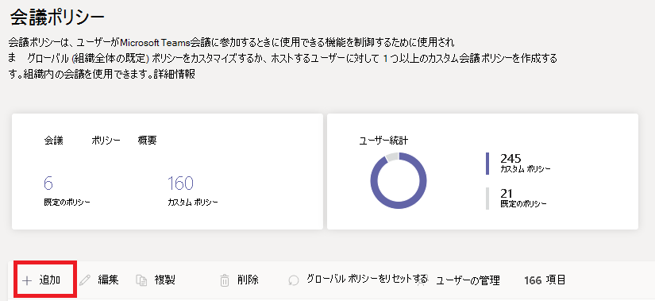

# Microsoft Teams でのデスクトップ共有を構成する

デスクトップを共有すると、ユーザーは会議やチャット中に画面やアプリを表示できます。 管理者が Microsoft Teams で画面共有を構成すると、ユーザーは画面全体、アプリ、ファイルを共有できるようになります。 ユーザーによる制御の付与または要求の許可、PowerPoint 共有の許可、ホワイトボードの追加、共有メモの許可を設定できます。 また、匿名または外部の参加者が共有画面の制御を要求できるかどうかを構成することもできます。 Teams 会議の外部参加者は、次のように分類できます。

- 匿名参加者
- ゲスト
- 外部アクセス ユーザー

画面共有を構成するには、新しい会議ポリシーを作成し、そのポリシーを管理対象ユーザーに割り当てます。

**[Microsoft Teams 管理センター](https://admin.teams.microsoft.com/)で**

1. **[会議]** > **[会議ポリシー]** の順に選択します。

    

2. [ **会議ポリシー** ] ページで、[ **追加**] を選択します。

    

3. ポリシーに一意のタイトルを指定し、簡単な説明を入力します。

4. **[コンテンツの共有]** の下にある、**[画面共有モード]** ドロップダウン リストから選択します。

   - **[画面全体]**: ユーザーはデスクトップ全体を共有できます。
   - **[1 つのアプリケーション]**: ユーザーの画面共有は 1 つのアクティブなアプリケーションに制限されます。
   - **[無効]**: 画面共有をオフにします。

    

  > [!Note]
  > ユーザーがチャットから画面共有を使用するために、通話ポリシーを有効にする必要はありません。 ただし、オーディオは、ミュートを解除するまでオフになります。 さらに、画面を共有しているユーザーは、[ **オーディオの追加** ] をクリックしてオーディオを有効にすることができます。 通話ポリシーが無効になっている場合、ユーザーはチャット セッションから画面共有にオーディオを追加できません。

5. 次の設定をオンまたはオフにします。

    - **参加者に制御の付与または要求を** 許可します。チームのメンバーは、発表者のデスクトップまたはアプリケーションの制御を与えたり、要求したりできます。
    - **外部参加者に制御の付与または要求を許可** する – これはユーザーごとのポリシーです。 組織がユーザーに対してこの設定を行ったかどうかは、会議の開催者が設定した内容に関係なく、外部の参加者ができることを制御するものではありません。 このパラメーターは、組織の会議ポリシー内において、共有先が設定した内容に応じて、外部の参加者に共有スクリーンの制御または制御の依頼を許可するかどうかを制御します。
    - **[PowerPoint 共有を許可する]**: ユーザーによる、PowerPoint プレゼンテーションのアップロードや共有ができる会議の作成を許可します。
    - **[ホワイトボードを許可する]**: ユーザーによるホワイトボードの共有を許可します。
    - **[共有メモを許可する]**: ユーザーが共有メモを取ることを許可します。

6. **[保存]** をクリックします。

## PowerShell を使用して共有デスクトップを構成する

[Set-CsTeamsMeetingPolicy](/powershell/module/skype/set-csteamsmeetingpolicy) コマンドレットを使用して、デスクトップ共有を制御することもできます。 次のパラメーターを設定します。

- Description
- ScreenSharingMode
- AllowPrivateCalling
- AllowParticipantGiveRequestControl
- AllowExternalParticipantGiveRequestControl
- AllowPowerPointSharing
- AllowWhiteboard
- AllowSharedNotes

[csTeamsMeetingPolicy コマンドレットの使用方法に関する詳細情報](/powershell/module/skype/set-csteamsmeetingpolicy)。