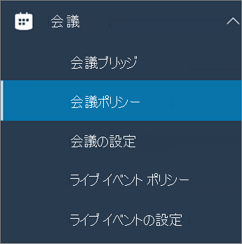
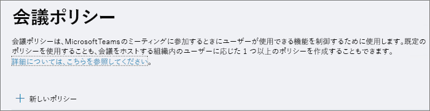
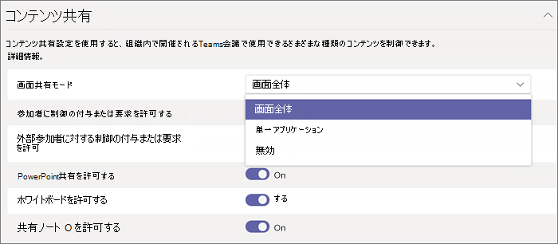

マイクロソフトのチームでデスクトップの共有を構成します。Configure desktop sharing in Microsoft Teams
============================================

デスクトップの共有には、ユーザーが会議出席依頼やチャット中に、画面またはアプリケーションを提示することができます。Desktop sharing lets users present a screen or app during a meeting or chat. 管理者は、画面を画面全体、アプリケーション、またはファイルを共有できるようにするのには、マイクロソフトのチームで共有を構成できます。Admins can configure screen sharing in Microsoft Teams to let users share an entire screen, an app, or a file. ユーザーを与える制御を要求、PowerPoint の共有を許可する、ホワイト ボードの追加やノートの共有を許可することもできます。You can let users give or request control, allow PowerPoint sharing, add a whiteboard, and allow shared notes. 匿名または外部のユーザーが共有画面のコントロールを要求できるかどうかを構成することもできます。You can also configure whether anonymous or external users can request control of the shared screen.

画面共有を構成するには、新しい会議ポリシーを作成し、管理するユーザーに割り当てます。To configure screen sharing, you create a new meetings policy and then assign it to the users you want to manage.

マイクロソフトのチームとビジネス管理センターの Skype。In the Microsoft Teams & Skype for Business Admin Center:

1. **会議**を選択して > **ミーティングのポリシー**です。Select **Meetings** > **Meeting policies**.

    

2. [**ミーティングのポリシー** ] ページで、**新しいポリシー**を選択します。On the **Meeting policies** page, select **New policy**.

    

3. ポリシー固有のタイトルを提供し、簡単な説明を入力します。Give your policy a unique title and enter a brief description.

4. **コンテンツの共有**の下にあるドロップ ダウン リストから**画面共有モード**を選択します。Under **Content sharing**, choose a **Screen sharing mode** from the drop-down list:

   - **全体画面**– を使うと、その全体のデスクトップを共有できます。**Entire screen** – lets users share their entire desktop.
   - **1 つのアプリケーション**では、1 つのアクティブなアプリケーションを制限画面の共有をユーザーことができます。**Single application** – lets users limit screen sharing to a single active application.
   - **無効**– 画面の共有を無効にします。**Disabled** – Turns off screen sharing.

    

5. 次の設定を有効または無効にします。Turn the following settings on or off:

    - 提供または、発表者のデスクトップまたはアプリケーションの制御を要求**したり制御を要求する参加者を許可する**: チームのメンバーを使用します。**Allow a participant to give or request control** – lets members of the team give or request control of the presenter’s desktop or application.
    - 来園者は、**制御を要求したりする外部の参加者を許可する**- と (連合) の外部のユーザーが付与または、発表者のデスクトップまたはアプリケーションの制御を要求します。**Allow an external participant to give or request control** – lets guests and external (federated) users give or request control of the presenter’s desktop or application.
    - **PowerPoint の共有**- には、ユーザーが PowerPoint のプレゼンテーションをアップロードして共有できるように会議を作成することができます。**Allow PowerPoint sharing** - lets users create meetings that allow PowerPoint presentations to be uploaded and shared.
    - **許可するホワイト ボード**-では、ホワイト ボードを共有することができます。**Allow whiteboard** – lets users share a whiteboard.
    - **ノートの共有を許可する**-には、ユーザーが共有ノートを取ることができます。**Allow shared notes** – lets users take shared notes.

6. [**保存**] をクリックします。Click **Save**.

## PowerShell を使用して、デスクトップの共有を構成するにはUse PowerShell to configure shared desktop

デスクトップの共有を制御する[セット CsTeamsMeetingPolicy](https://docs.microsoft.com/en-us/powershell/module/skype/set-csteamsmeetingpolicy?view=skype-ps)コマンドレットを使用することもできます。You can also use the [Set-CsTeamsMeetingPolicy](https://docs.microsoft.com/en-us/powershell/module/skype/set-csteamsmeetingpolicy?view=skype-ps) cmdlet to control desktop sharing. 次のパラメーターを設定します。Set the following parameters:

- 説明Description
- ScreenSharingModeScreenSharingMode
- AllowParticipantGiveRequestControlAllowParticipantGiveRequestControl
- AllowExternalParticipantGiveRequestControlAllowExternalParticipantGiveRequestControl
- AllowPowerPointSharingAllowPowerPointSharing
- AllowWhiteboardAllowWhiteboard
- AllowSharedNotesAllowSharedNotes

[CsTeamsMeetingPolicy コマンドレットを使用してに関する詳細を表示](https://docs.microsoft.com/en-us/powershell/module/skype/set-csteamsmeetingpolicy?view=skype-ps)します。[Learn more about using the csTeamsMeetingPolicy cmdlet](https://docs.microsoft.com/en-us/powershell/module/skype/set-csteamsmeetingpolicy?view=skype-ps).

