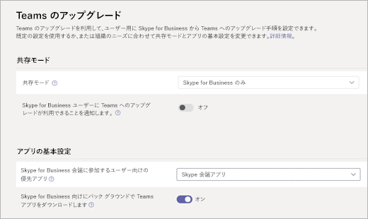

Teams と連動するように Skype 会議アプリを構成する
===================================================

ユーザーを Microsoft Teams にアップグレードした後、管理者は Microsoft Teams 管理センターを使用して、ユーザーが Skype for Business 会議に参加するために使用する優先アプリを指定できます。

Skype for 会議アプリを優先アプリとして指定するには、次の操作を行います。

1. Microsoft Teams 管理センターにサインインする。
2. 左側のウィンドウで、[**組織全体の設定**] の下の [**チームのアップグレード**] を選択します。
3. チームのアップグレードページの [**アプリの環境設定**] で、[ユーザーが**skype for business 会議に参加するための優先アプリ**] ドロップダウンリストから [ **skype 会議アプリ**] を選びます。

    

## 既知の制限

チームで Skype 会議アプリを使用するユーザーには、次の制限が適用されます。

- ユーザーには、ビデオデバイスを変更するオプションはありません。
- ユーザーが Teams にアップグレードされた後、ユーザーが Skype 会議アプリを使用して会議に参加していて、チームで通話を受信した場合、Skype 会議アプリの会議は保留になりません。 代わりに、ユーザーは両方の通話に接続されます。

## More information

- [Skype 会議アプリ (Skype for Business Web App) とは](https://support.office.microsoft.com/article/what-is-skype-meetings-app-skype-for-business-web-app-1ff3d412-718a-4982-8ff2-a4992608cdb5)
- [Skype 会議アプリの最小ネットワーク要件](https://technet.microsoft.com/library/mt845808.aspx)
