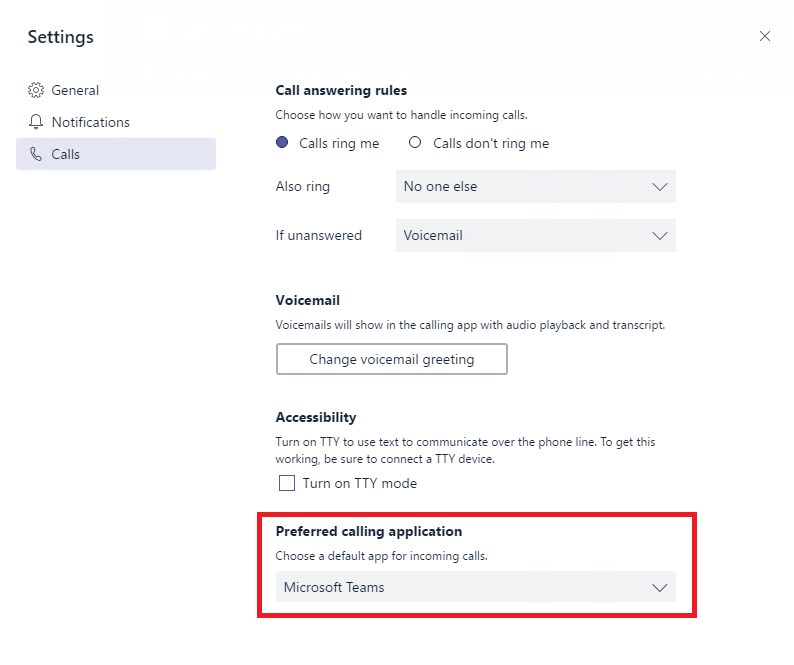

クイック スタート ガイド: Microsoft チームのプランの呼び出しを構成します。Quick start guide: Configuring Calling Plans in Microsoft Teams
==============================================================

このガイドはできる一連の上のユーザーと実行しているので、チームのプランの呼び出しを確認することができます。This guide will help you get a set of users up and running so they can explore Calling Plans in Teams.

チームのプランの呼び出しの 2017、12 月 12日お知らせを読む:[インテリジェント通信チーム呼び出しには、次の手順を移動します。](https://aka.ms/ipyqus)Read the December 12, 2017, announcement of Calling Plans in Teams: [Intelligent Communications takes the next step with calling in Teams](https://aka.ms/ipyqus)

> [!NOTE]
> 、このクイック スタート ガイドと並行、使用すること、[実用的なガイダンス](https://docs.microsoft.com/MicrosoftTeams/phone-system-with-calling-plans)や[FastTrack](https://aka.ms/cloudvoice)を計画し、正常に展開することをお勧めします。We recommend that, in parallel with this quick-start guide, you use our [practical guidance](https://docs.microsoft.com/MicrosoftTeams/phone-system-with-calling-plans) and [FastTrack](https://aka.ms/cloudvoice) to plan and drive a successful rollout.

-[Skype for Business で、Office 365 機能 - プランの呼び出しを追加して land 線と公衆交換電話網 (PSTN) を使って携帯電話の電話の発信や受信にチームを使用することができます。By adding Calling Plans - an Office 365 feature powered by Skype for Business - you can now use Teams to make and receive phone calls to or from land lines and mobile phones via the public switched telephone network (PSTN).

## チームでは、[**通話**] タブを有効にするための前提条件Prerequisites for enabling the **Calls** tab in Teams
チームでは、[**通話**] タブを有効にし、ユーザーが PSTN 通話を送受信できるようにする、ユーザーのプロビジョニングを電話システムとプランの呼び出しの必要があります。これをセットアップする方法については、[プランの呼び出しを設定する](https://support.office.com/article/Set-up-Calling-Plans-57893158-1acd-44ac-acaf-19f58264a9e0)をご覧ください。To enable the **Calls** tab in Teams and allow your users to make and receive PSTN calls, you will need provision users for Phone System and Calling Plans. To learn how to set this up, read [Set up Calling Plans](https://support.office.com/article/Set-up-Calling-Plans-57893158-1acd-44ac-acaf-19f58264a9e0).

> [!IMPORTANT]
> プランの呼び出しを設定する、チームで、前に注意してください次の制限事項。Before configuring Calling Plans in Teams, please be aware of the following limitations:
> * **ハイブリッド音声は、チームでサポートされていない**ハイブリッド ボイスは現在サポートされていませんチームでします。ハイブリッド音声顧客がサービス中断これにより、チームで通話を受信するポリシーのいずれかを変更するのにはお勧めできません。**Hybrid Voice is not supported in Teams** - Hybrid Voice is currently not supported in Teams. Hybrid Voice customers are not advised to change any of the policies to receive calls in Teams, as this will cause service interruptions.
> * **チームでは、フェデレーションの通話はサポートされていない**(テナント/会社間での呼び出し) フェデレーション通話は現在サポートされていませんチームでします。フェデレーションの着信通話、チームでサポートされているまでを構成する方法に関係なく、Skype for Business に常にルーティングされます。**Federated calling is not supported in Teams** - Federated calling (calling between tenants/companies) is currently not supported in Teams. Federated calls will always be routed to Skype for Business regardless of how you configure calling, until it's supported in Teams.

## チームの相互運用ポリシーの構成Teams interop policy configuration
チームが着信を受信し始めますを有効にする必要がありますチームの相互運用ポリシーを更新する、skype for Business リモート Windows PowerShell セッションを使用して[`*-CsTeamsInteropPolicy`](https://docs.microsoft.com/powershell/module/skype)チームに着信をリダイレクトするのには、コマンドレットします。チームの相互運用ポリシーの詳細については、 [Microsoft チーム」と「Skype for Business の相互運用性](https://docs.microsoft.com/MicrosoftTeams/teams-and-skypeforbusiness-interoperability)を参照してください。To enable Teams to begin receiving calls, you'll need to update Teams interop policy, using a remote Windows PowerShell session with the Skype for Business [`*-CsTeamsInteropPolicy`](https://docs.microsoft.com/powershell/module/skype) cmdlets, to redirect calls to Teams. For more information about Teams interop policy, see [Microsoft Teams and Skype for Business Interoperability](https://docs.microsoft.com/MicrosoftTeams/teams-and-skypeforbusiness-interoperability).

> [!TIP]
> 必要がある PowerShell コマンドレットを検索するには、 [Skype for Business PowerShell コマンドレットのドキュメント](https://docs.microsoft.com/powershell/module/skype)で**フィルター** ] ボックスに"CsTeamsInteropPolicy"を入力します。To find the PowerShell cmdlets you need, type "CsTeamsInteropPolicy" in the **Filter** box in the [Skype for Business PowerShell cmdlet documentation](https://docs.microsoft.com/powershell/module/skype).

### チームの既定の相互運用ポリシーDefault Teams interop policy
チームが、既定のポリシー設定を既存のビジネス ワークフローがチーム展開中に中断されないように設計されています。既定では、VoIP、PSTN とフェデレーションの呼び出しをユーザーに引き続きチームに着信通話を有効にするポリシーを更新するまでに Skype for Business にルーティングされます。これによりがないこと意図しない音声サービス中断を開始するパイロット チームを展開するとします。Teams has a default policy configuration designed to ensure that existing business workflows are not interrupted during a Teams deployment. By default, VoIP, PSTN, and federated calls to your users will continue to be routed to Skype for Business until you update the policy to enable inbound calling to Teams. This ensures that there are no unintended interruptions in voice services as you start to pilot and deploy Teams.

チームの相互運用ポリシーには、次の既定の構成がされています。Teams interop policy has the following default configuration:

    Identity                   : Global
    AllowEndUserClientOverride : False
    CallingDefaultClient       : Default
    ChatDefaultClient          : Default

既定の構成の動作は次のとおりです。The behaviors of the default configuration are the following:
* **既存の Skype for Business ユーザーに**、このポリシーが対応している、Skype for Business 通話は Skype for Business に転送され、チーム呼び出しはチームに転送されることを確認します。PSTN とフェデレーションの呼び出しが開かれ Skype for Business このポリシーが有効な場合。**For existing Skype for Business customers**, this policy is designed to ensure that Skype for Business calls are directed to Skype for Business, and Teams calls are directed to Teams. PSTN and federated calls will be directed to Skype for Business when this policy is in effect.
* **Skype for Business の場合**、チームのユーザーの通話のほか、PSTN 通話の発信のみをチームで使われます。チームで PSTN 通話を受けるには、ユーザーに割り当てられているチームの相互運用ポリシーを変更する必要があります。**For customers without Skype for Business**, when in effect, in addition to calls among Teams users, only outbound PSTN calling will be available in Teams. You will need to alter the Teams interop policy assigned to your users to receive PSTN calls in Teams.

> [!NOTE]
> 電話システムとプランの呼び出しライセンスでプロビジョニングされているユーザーと使用する skype for Business Online では、既定のグローバル チーム相互運用ポリシーを使用して構成されたチームで有効になっている [通話] タブが表示されますをチームからの送信の PSTN 電話をかけることができます。管理者が管理の操作を実行することなしです。Users that have been provisioned with Phone System and Calling Plans licenses for use with Skype for Business Online, and configured with the default global Teams interop policy, will have the Calls tab enabled in Teams and can place outbound PSTN calls from Teams without administrators having to take any administrative action.

#### 既定のポリシーを使用してチームを構成する方法How to configure Teams to use the default policy
既定では、テナントのすべてのユーザーにグローバル チームの相互運用ポリシーを適用し、上記の説明に従って、既定の設定で構成します。何らかの理由をユーザーに別のポリシーを与えたいし、考えての既定の設定に戻すには場合、は、リモートの Windows PowerShell セッションをビジネス用 Skype でグローバル チーム相互運用ポリシーを適用する必要があります。By default, global Teams interop policy is applied to all users in your tenant, and it is configured with the default settings as described above. If for some reason you have granted different policies to your users and would like to revert to the default setting, you will need to apply the global Teams interop policy via Skype for Business remote Windows PowerShell session:

    Grant-CsTeamsInteropPolicy -PolicyName Global -Identity user@contoso.com

> [!WARNING]
> 既定値からグローバル チームの相互運用ポリシーを変更することはできますが、お強く推奨に対してします。While it is possible to modify the global Teams interop policy from the default values, we strongly advise against it. 

## チームが着信 PSTN 通話を受けるを構成します。Configuring Teams to receive inbound PSTN calls
PSTN 通話の着信を受信するには、チームでに既定値を使用してチームの相互運用ポリシーを適用してアプリケーションを呼び出すとチームを構成する必要があります`CallingDefaultClient`チームにパラメーターを設定します。To receive inbound PSTN calls in Teams, you will need to configure Teams as the default calling application by applying Teams interop policy with `CallingDefaultClient` parameter set to Teams.

> [!IMPORTANT]
> ユーザーをチームで魅力的な新しい通話機能を使ってみるを広げる組織レベルの変更を加えるよりも前の初期セットには、この設定を適用することをお勧めします。We recommend that you apply this configuration to an initial set of users to explore these exciting new calling capabilities in Teams prior to making wider or organization-level changes.

次事前構成されたチームの相互運用ポリシーを使用してチーム呼び出し着信 PSTN をルーティングすることを検討してください。Consider using the following preconfigured Teams interop policy to route inbound PSTN calling to Teams:

    Identity                   : Tag:DisallowOverrideCallingTeamsChatTeams
    AllowEndUserClientOverride : False
    CallingDefaultClient       : Teams
    ChatDefaultClient          : Teams

このポリシーの動作、次のとおりです。The behaviors of the policy above are the following:
* **既存の Skype for Business ユーザーに**、このポリシーが対応しているチームの着信通話をリダイレクトします。これには、(チームと Skype for Business) から VoIP と PSTN 通話の両方が含まれます。フェデレーションの通話は引き続き Skype for Business で受信します。**For existing Skype for Business customers**, this policy is designed to redirect incoming calls to Teams. This includes both VoIP (from Teams and Skype for Business) and PSTN calls. Federated calls will continue to be received in Skype for Business. 
* **Skype for Business の場合**と実際には、PSTN 通話が受信するチームでします。フェデレーションの通話は、現在チームでは**サポートされていません**。**For customers without Skype for Business**, when in effect, PSTN calls will be received in Teams. Federated calling is currently **not supported** in Teams.

> [!WARNING]
> 現時点では、変更する`CallingDefaultClient`チームにも影響 skype 通話ビジネス IP 電話用します。着信通話られ、携帯電話に受信できませんが、リング チーム クライアントのみをされます。既存の認定 SIP 電話のサポートについては、 [Skype for Business に Microsoft チーム機能ロードマップ](https://aka.ms/skype2teamsroadmap)を参照してください。Currently, changing `CallingDefaultClient` to Teams will also affect calls to Skype for Business IP phones. Incoming calls will not be received on the phones and will only ring Teams clients. Please consult the [Skype for Business to Microsoft Teams Capabilities Roadmap](https://aka.ms/skype2teamsroadmap) for information about support for existing certified SIP phones.

### PSTN 通話を受けるチームを構成する方法How to configure Teams to receive PSTN calls
チーム呼び出しをリダイレクトするのには、リモートの Windows PowerShell セッションをビジネス用 Skype で上記のように、チームの相互運用ポリシーを適用します。Apply the Teams interop policy as described above via Skype for Business remote Windows PowerShell session to redirect calls to Teams:

    Grant-CsTeamsInteropPolicy -PolicyName tag:DisallowOverrideCallingTeamsChatTeams -Identity user@contoso.com

## ユーザーに、好みの呼び出しのエクスペリエンスを変更できるようにチームを構成します。Configuring Teams to allow users to change their preferred calling experience
有効にするカスタム チーム相互運用ポリシーの作成に必要なチームまたは Skype for Business で通話を受信するかどうかは、好みの呼び出し元エクスペリエンスをユーザーが独自の判断できるように、`AllowEndUserClientOverride`パラメーターします。To let users to make their own decision over the preferred calling experience, whether to receive calls in Teams or Skype for Business, you need to create a custom Teams interop policy that enables `AllowEndUserClientOverride` parameter.

次には、好みの呼び出し元エクスペリエンスのユーザーの選択を有効にするチームの相互運用ポリシーの例を示します。The following is the example of Teams interop policy to enable user choice of the preferred calling experience:

    Identity                   : Tag:CustomPolicy
    AllowEndUserClientOverride : True
    CallingDefaultClient       : Default
    ChatDefaultClient          : Default

このユーザー設定のポリシーを適用するには、ユーザーに、好みの呼び出し元のアプリケーションを変更するオプションは自体を変更するユーザーのチーム クライアントでは使用されます。Once this custom policy is applied to the users, the option to change the preferred calling application will be available in Teams client for users to make the changes themselves.

> [!IMPORTANT]
> 幅または組織レベルを変更する前にユーザーの初期セットには、この設定を適用することをお勧めします。It is recommended that you apply this configuration to an initial set of users prior to making wider or organization level changes.

### 作成してチームのユーザー設定の相互運用ポリシーを適用する方法How to create and apply the custom Teams interop policy
チームのユーザー設定の相互運用ポリシーを作成するには、リモートの Windows PowerShell セッションをビジネス用 Skype で上記のように、次の手順に従います。To create the custom Teams interop policy as described above via Skype for Business remote Windows PowerShell session, perform the following:

    New-CsTeamsInteropPolicy -Identity tag:CustomPolicy -AllowEndUserClientOverride:$True -CallingDefaultClient:Default -ChatDefaultClient:Default

    Grant-CsTeamsInteropPolicy -PolicyName tag:CustomPolicy -Identity user@contoso.com

## 関連項目See also
[プランの呼び出しを設定します。Set up Calling Plans](https://support.office.com/article/Set-up-Calling-Plans-57893158-1acd-44ac-acaf-19f58264a9e0)

[Microsoft チーム」と「Skype for Business の相互運用性Microsoft Teams and Skype for Business Interoperability](https://docs.microsoft.com/MicrosoftTeams/teams-and-skypeforbusiness-interoperability)

[電話システムで Microsoft チームで通話プランに関する実用的なガイダンスPractical Guidance for Phone System with Calling Plans in Microsoft Teams](https://docs.microsoft.com/MicrosoftTeams/phone-system-with-calling-plans)

[Skype for Business PowerShell コマンドレット リファレンスSkype for Business PowerShell cmdlet reference](https://docs.microsoft.com/powershell/module/skype)

[チームの PowerShell コマンドレット リファレンスTeams PowerShell cmdlet reference](https://docs.microsoft.com/powershell/module/teams)
