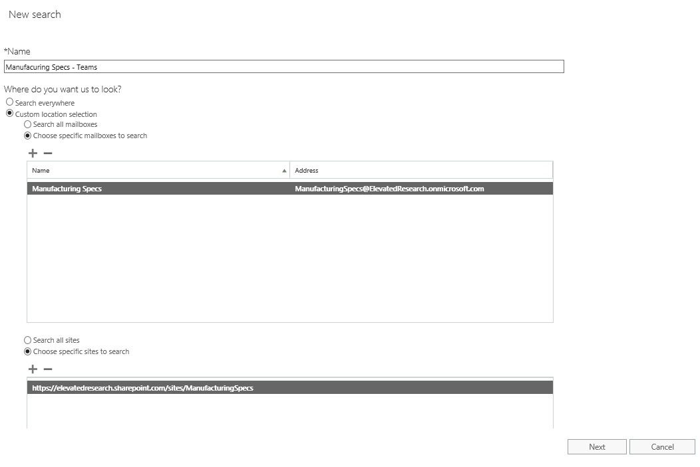

Microsoft Teams のコンテンツ検索を使用する
=====================================

コンテンツ検索は、Exchange、SharePoint Online、OneDrive for Business を含む Microsoft Teams の情報について問い合わせを行うことのできる特別な検索手段です。

次の例では、新規の**コンテンツ検索**を作成し、Manufacturing Specs メールボックスと Manufacturing Specs SharePoint サイトを選択しています。この操作により、Exchange からのチャネル チャット、SharePoint Online からのファイル アップロードやファイルの修正、OneNote での変更を検索できます。

**コンテンツ検索**にクエリ条件を追加して、検索結果を絞り込むこともできます。次の例では、Manufacturing Specs チームが「**New Factory Specs**」というキーワードが使われているコンテンツを見つけるために Exchange と SharePoint の場所を検索しています。

![進行中のキーワード検索が表示されている [クエリ] ダイアログのスクリーンショット。](media/Use_Content_Search_in_Microsoft_Teams_image2.png)

必要に応じて検索条件を追加した後に、そのレポートまたはデータをコンピューターにエクスポートして分析できます。コンテンツ検索について詳しくは、[このリンク](https://support.office.com/en-us/article/Run-a-Content-Search-in-the-Office-365-Security-Compliance-Center-61852fd9-fe8a-4880-a339-cb19ed3bff4a?ui=en-US&rs=en-US&ad=US&fromAR=1)にアクセスしてください。
