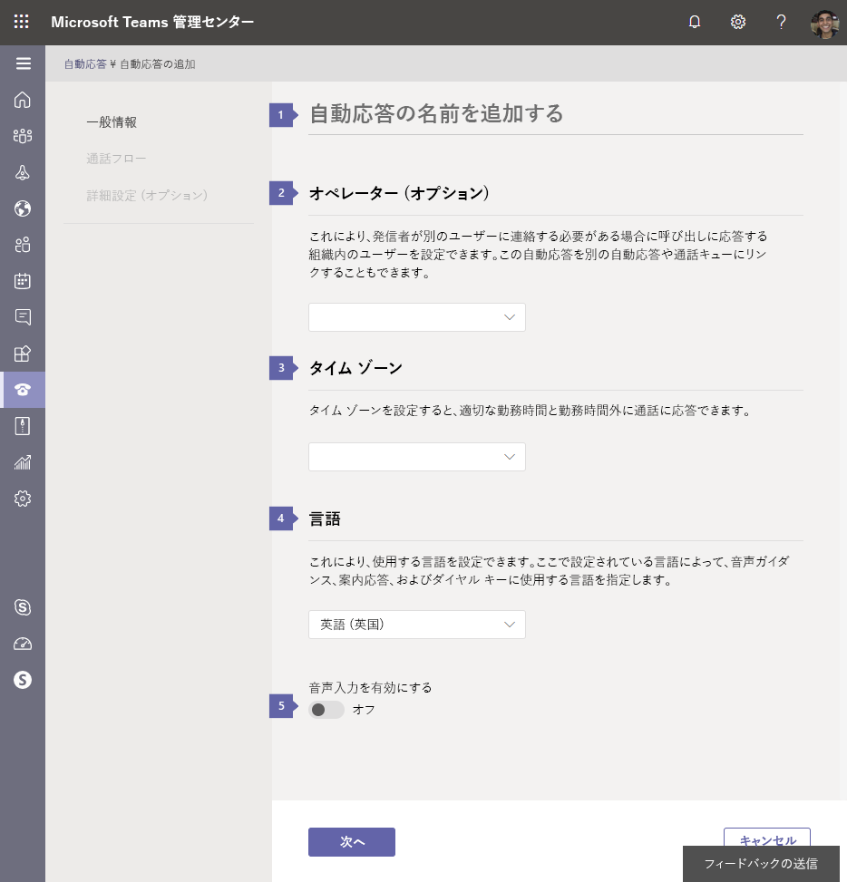
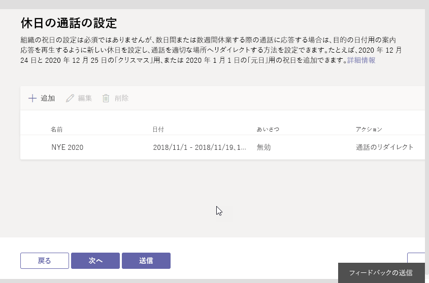
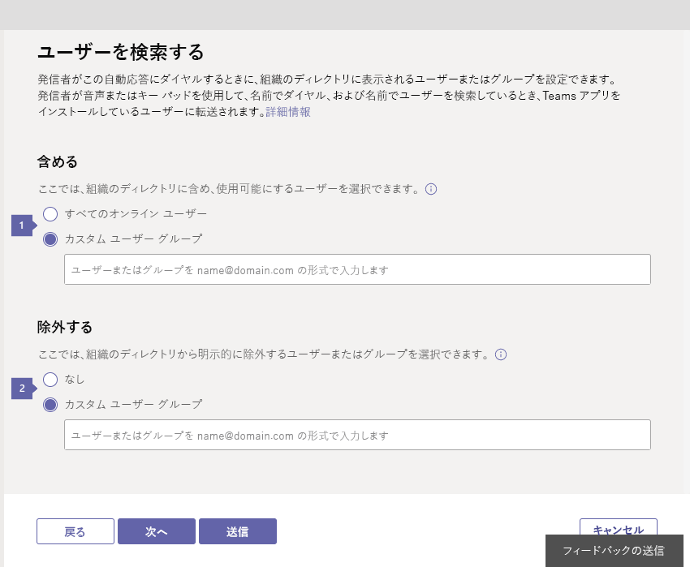

# 電話システムの自動応答をセットアップするSet up a Phone System auto attendant

自動応答は、組織へのコールし、右の部門にそれらを取得するには、キュー、人、または演算子を呼び出すメニュー システムを移動するユーザーを使用できます。Auto attendants let people that call in to your organization and navigate a menu system to get them to the right department, call queue, person, or the operator. マイクロソフトのチーム管理センターを使用して、組織の自動応答を作成できます。You can create an auto attendant for your organization by using the Microsoft Teams admin center. **音声**には、左側のナビゲーションで、**自動応答**を選択し、新しい自動アテンダントを作成する > **新規追加**します。To create a new auto attendant, go to **Voice** in the left navigation, and then select **Auto attendants** > **Add new**.

自動アテンダントの詳細についてはする場合を参照してください[電話システムの自動応答は何ですか?](/microsoftteams/what-are-phone-system-auto-attendants)If you want to learn more about auto attendants, see [What are Phone System auto attendants?](/microsoftteams/what-are-phone-system-auto-attendants)

> [!NOTE]
> この資料は、オンライン ビジネスは、マイクロソフトのチームと Skype の両方に適用されます。This article applies to both Microsoft Teams and Skype for Business Online.

## 手順 1 - 開始します。Step 1 - Get started

- 作成して、自動アテンダントが電話番号を持つ場合は、自動応答を設定する前に (多くの 2 番目のレベルを要求したり、自動アテンダントを入れ子にしないと電話番号を必要とする) を取得または、既存の有料または無料のサービスに転送する必要があります番号.Before you can create and set up your auto attendants, if the auto attendant will have a phone number (and many second-level prompts or nested auto attendants will no require a phone number) you will need to get or transfer your existing toll or toll-free service numbers. **マイクロソフトのチーム管理センター**で表示は有料または無料のサービスの番号を取得した後 > **音声** > **の電話番号**のページです。After you get the toll or toll-free service numbers, they will show up on the **Microsoft Teams admin center** > **Voice** > **Phone numbers** page. サービス番号を取得するには、[サービスの電話番号の取得](https://docs.microsoft.com/SkypeForBusiness/what-is-phone-system-in-office-365/getting-service-phone-numbers?toc=/MicrosoftTeams/toc.json&bc=/microsoftteams/breadcrumb/toc.json)を参照するか、転送し、既存のサービス番号にする場合は、 [Office 365 に電話番号を転送する](transfer-phone-numbers-to-office-365.md)を参照してください。To get your service numbers, see [Getting service phone numbers](https://docs.microsoft.com/SkypeForBusiness/what-is-phone-system-in-office-365/getting-service-phone-numbers?toc=/MicrosoftTeams/toc.json&bc=/microsoftteams/breadcrumb/toc.json), or if you want to transfer and existing service number, see [Transfer phone numbers to Office 365](transfer-phone-numbers-to-office-365.md). **User (subscriber)** numbers can't be assigned to auto attendants.**User (subscriber)** numbers can't be assigned to auto attendants. 米国以外の場合は、サービス番号を取得するのには、マイクロソフトのチーム管理センターを使うことはできません。移動[ここ](manage-phone-numbers-for-your-organization/manage-phone-numbers-for-your-organization.md)。If you are outside the United States, you can't use the Microsoft Teams admin center to get service numbers; go [here](manage-phone-numbers-for-your-organization/manage-phone-numbers-for-your-organization.md).

    > [!CAUTION]
    > 取得し、フリー ダイヤル電話番号を使用して、通信のクレジットを設定する必要があります。To get and use toll-free phone numbers, you need to set up Communications Credits. この参照を行うに[通信のクレジットは何ですか?](what-are-communications-credits.md)し、[組織の通信のクレジットを設定](set-up-communications-credits-for-your-organization.md)。To do this see [What are Communications Credits?](what-are-communications-credits.md) and [Set up Communications Credits for your organization](set-up-communications-credits-for-your-organization.md).
  
- 組織は、エンタープライズの E3 と**電話システム**のライセンスまたはエンタープライズ E5 のライセンス (最低) が必要です。Your organization must have (at a minimum) an Enterprise E3 plus **Phone System** license or an Enterprise E5 license. 自動応答に使用する利用可能なサービス番号の番号を割り当てられている**電話システム**のユーザー ライセンスの数に影響します。The number of **Phone System** user licenses that are assigned affects the number of service numbers that are available to be used for auto attendants. ことが自動応答の数は、組織に割り当てられている番号の**電話システム**と**オーディオ会議**ライセンスに依存します。The numbers of auto attendants you can have is dependent on the number **Phone System** and **Audio Conferencing** licenses that are assigned in your organization. ライセンスに関する詳細については、[アドオン ライセンスのビジネス用の Skype](/skypeforbusiness/skype-for-business-and-microsoft-teams-add-on-licensing/skype-for-business-and-microsoft-teams-add-on-licensing)または[マイクロソフトのチームのアドオンのライセンス](teams-add-on-licensing/microsoft-teams-add-on-licensing.md)を参照してください。To learn more about licensing, see [Skype for Business add-on licensing](/skypeforbusiness/skype-for-business-and-microsoft-teams-add-on-licensing/skype-for-business-and-microsoft-teams-add-on-licensing) or [Microsoft Teams add-on licensing](teams-add-on-licensing/microsoft-teams-add-on-licensing.md). .

    > [!TIP]
    > 演算子または**電話システム**のライセンスを持つオンラインのユーザーは、メニュー ・ オプションへの呼び出しをリダイレクトするには、エンタープライズ VoIP を有効にするか、Office 365 のプランを呼び出すことを割り当てることにする必要があります。To redirect calls to an operator or a menu option that is an Online user with a **Phone System** license, you will need to enable them for Enterprise Voice or assign Calling Plans in Office 365 to them. [ビジネス ライセンスの割り当ての Skype](/skypeforbusiness/skype-for-business-and-microsoft-teams-add-on-licensing/assign-skype-for-business-and-microsoft-teams-licenses)または[マイクロソフトのチームを割り当てるライセンス](assign-teams-licenses.md)を参照してください。See [Assign Skype for Business licenses](/skypeforbusiness/skype-for-business-and-microsoft-teams-add-on-licensing/assign-skype-for-business-and-microsoft-teams-licenses) or [Assign Microsoft Teams licenses](assign-teams-licenses.md). Windows PowerShell を使用することもできます。You can also use Windows PowerShell. などを実行します。`Set-CsUser -identity "Amos Marble" -EnterpriseVoiceEnabled $true`For example, run: `Set-CsUser -identity "Amos Marble" -EnterpriseVoiceEnabled $true`

## ステップ 2 - 新しい自動応答の作成Step 2 - Create a new auto attendant

> [!IMPORTANT]
> 呼び出しのすべてのキューは、関連付けられている[リソースのアカウント](manage-resource-accounts.md)を持っている必要があります。Every call queue is required to have an associated [resource account](manage-resource-accounts.md). 最初に、リソース アカウントを作成する必要がありますし、自動応答に関連付けることができます。You must create the resource account first, then you can associate it to the auto attendant.

### マイクロソフトのチーム管理センターを使用してください。Using the Microsoft Teams admin center

**マイクロソフトのチーム管理センター**の [**音声**] をクリックします > **自動応答**、 **+ 新規**] をクリックします。In the **Microsoft Teams admin center**, click   **Voice** > **Auto attendants**, then click **+ New**:

#### [全般情報] ページGeneral info page

* * *

**名**自動アテンダントのわかりやすい表示名を入力します。**Name** Enter a descriptive display name for your auto attendant. 名前の入力は必須で、空白を含む最大 64 文字を含めることができます。The name is required and can contain up to 64 characters, including spaces. この名前は [ **自動応答**] タブの [ **名前**] 列に表示されます。It will be listed in the **Name** column on the **Auto attendants** tab.

* * *

**リソース アカウント**新しい自動応答に接続する 1 つまたは複数のリソース アカウントを選択するのには、このボタンをクリックします。**Resource account** Click this button to select one or more resource accounts to connect to your new auto attendant. すべての自動応答は、関連付けられているリソース アカウントを持っている必要があります。All auto attendants are required to have an associated resource account. リソース アカウントは、アカウントに関連付けられている電話番号を持つことができますが、その可能性があります。A resource account can have a phone number associated to the account, but it might not. トップレベルの自動応答はほぼ確実にはアカウントを持っているリソース、割り当てられた電話番号を持つが、(最初のレベルの自動応答に接続するレベル 2 のメニューとして使用される) の第 2 の自動応答に割り当てられた電話番号が簡単にない、リソースのアカウントです。A top-level auto attendant would almost certainly would have a resource account with an assigned phone number, but a secondary auto attendant (used as a level 2 menu that the first level auto attendant connects to) might easily not have a phone number assigned to its resource account.

* * *

**タイム ゾーン** 自動応答にはタイム ゾーンを設定する必要があります。ただし、組織のメイン アドレスのタイム ゾーンと一致している必要はありません。各自動応答には、異なるタイム ゾーンを設定できます。自動応答の営業時間の設定は、ここで選択したタイムゾーンに基づきます。**Time zone** You must set the time zone for your auto attendant, but it doesn't need to correspond to the time zone of the main address listed for your organization. Each auto attendant can have a different time zone, and the business hours set for the auto attendant will be set based on the time zone that you select here.

* * *

**言語** 自動応答に使用する言語を、一覧表示されている使用可能な言語の中から選択します。**Language** Select the language that you want to use for your auto attendant from any of the available languages listed. ここで設定した言語は、この自動の応答へのコールの人と対話する自動応答を使用し、この言語ですべてのシステム プロンプトが再生する言語です。The language you set here is the language that the auto attendant will use to interact with people that call in to this auto attendant, and all the system prompts will be played in this language.

* * *

**オペレーター** このオプションは省略可能で、自動応答で設定する必要はありません。**Operator** This is optional and doesn't need to be set for the auto attendant. ただし、電話することを支援してくれる人に話をするメニューを解除することをする人の**オペレーター**のオプションを設定できます。However, you can set the **Operator** option for people that call in to be able to break out of the menus to speak to a person to help them.

オペレーターには、キー 0 が自動的に割り当てられます。The key 0 is automatically assigned to Operator.

このセットアップをした場合、発信者に、[**営業時間の通話ハンドリング**] ページの [**メニュー オプションの編集**] で利用可能なオプションであることを伝える必要もあります。If you set this up, you will also need to tell people who call in that this is an available option in the **Edit menu options** on the **Business hours call handling** page. 自動応答でオペレーターを設定する場合は、 [**発信者が聞く内容**] ボックスに、対応するプロンプト テキストを入力するか、オーディオ ファイルを変更して、このオプションを含める必要があります。If you set an operator on your auto attendant, you will need to enter the corresponding prompt text in the **Callers will hear** box or change your audio file to include this option. たとえば、「オペレーターに繋ぐには、0 を押してください。」などです。For example, "For the Operator, press zero."

次の項目のいずれかをオペレーターとして設定できます。You can set one of the following as Operator:

- Enterprise Voice で有効にされているか、Office 365 の通話プランを割り当てられた**電話システム**を使用している**社内の担当者**。**Person in your company** with a **Phone System** license that is enabled for Enterprise Voice or assigned Calling Plans in Office 365.

     > [!Note]
     > **社内の担当者**は、Online のユーザーか、 Skype for Business Server 2015 または Lync Server 2013 を使用してオンプレミスでホストされたユーザーとなることができます。**Person in your company** can be an Online user or a user hosted on-premises using Skype for Business Server 2015 or Lync Server 2013. Lync Server 2010 はサポートされていません。Lync Server 2010 isn't supported.

- **キューの呼び出し**を設定しました。A **call queue** that you have set up.
- 発信者がボイスメールに送られるように設定できます。You can set it up so the person calling will be sent to voicemail. これを行うには、**あなたの会社の担当者**を選択し、ボイスメールに直接転送するのにはこのメンバーの呼び出しを設定します。To do this, select **Person in your company** and set this person's calls to be forwarded directly to voicemail.

* * *

**音声入力を有効にします。** 音声認識機能では、このオプションが選択されている場合があります。**Enable voice inputs** Speech recognition is available if this option is selected. 人を呼び出すには、[設定した言語](set-auto-attendant-languages-for-audio-conferencing-in-teams.md)で音声入力を使用できます。People that call in can use voice input in the  [language you set](set-auto-attendant-languages-for-audio-conferencing-in-teams.md). のみ、電話のキーパッドを使用してユーザーを許可する場合にオフに設定し、音声認識機能を無効にできます。You can disable speech recognition by setting it to off if you want to only let people use their phone keypad.

* * *

選択が終わったら [**次へ**をクリックします。When you are finished with your selections, click on **Next**.

#### 営業時間ページBusiness hours page

既定では、営業時間は午後 5 時まで、月曜日から金曜日までの 9 am に設定されます。By default, business hours are set to 9am to 5pm, Monday through Friday.  営業時間に含まれない時間は営業時間外として考慮されます。All of the hours that aren't included in business hours are considered after business hours. **24/7 を選択**をするとすべての時間の業務時間をクリックすることができます。You can click on **Select 24/7** to make all hours business hours. **24/7 を選択する**オプションを選択した場合を除き、業務時間終了後、自動アテンダントの処理の呼び出しを構成するのには**時間の設定の呼び出し後**のページが使用されます。Unless you select the **Select 24/7** option, the **After hours call settings** page will be used to configure the call handling for after business hours for the auto attendant.

* * *

既定では、営業時間は月曜日から金曜日、午前 9時 00分 ~ 午後 5時 00分に設定されます。By default, business hours are set to Monday to Friday, 9:00 am-5:00 pm. スケジュール内のすべての時間時間の選択を解除するオプションを**オフにすべての時間**を選択します。Select **Clear all hours** option to unselect all hours hours in the schedule. **既定値にリセット**を選択すると、営業時間は月曜日から金曜日、午前 9時 00分 ~ 午後 5時 00分にリセットされます。When you select **Reset to default**, business hours will be reset to Monday to Friday, 9:00 am-5:00 pm.

* * *

営業時間を変更するには、予定表を使用して設定したい営業時間を選択してください。To change business hours, highlight the business hours you want to set using the calendar. 予定表を使用すると、30 分間隔で営業時間を選択できます。ここで選択する営業時間は、[**全般情報**] ページで設定したタイム ゾーンに基づいて設定されます。The calendar allows you to select business hours in 30-minute intervals, and the business hours you select here will be set based on the time zone that you set on the **General info** page. 休憩 (昼食休憩など) を設定するには、選択解除するか、カレンダーの時間を選択解除にドラッグします。To set up a break (a lunch break, for example), deselect or drag to deselect the time on the calendar. 営業時間内に複数の休憩時間を設定できます。You can set multiple breaks within business hours.

* * *

選択が終わったら [**次へ**をクリックします。When you are finished with your selections, click on **Next**.

#### 営業時間の設定を呼び出すBusiness hours call settings

> [!TIP]
> カスタムの勤務時間のスケジュールを使用する場合**営業時間の設定の呼び出し**と同様のオプションを与える**時間の問い合わせ対応後**ページを使用して、業務時間終了後の処理の呼び出しを設定する必要がありますがもします。If you use a custom business hours schedule, you will also need to set up call handing for after business hours using the **After hours call handling** page, which will give you the same options as **Business hours call settings**.

その人が勤務時間中に、組織の自動応答の電話番号への呼び出しが聞こえますごきげんよう、プロンプト、およびメニューを設定できます。You can set up greetings, prompts, and menus that people who call in to your organization's auto attendant phone number will hear during the business hours.

* * *

**あいさつ文の挿入**業務時間の案内応答は省略可能で**ない応答メッセージ**に設定することができます。**Greeting** A business hours greeting is optional and can be set to **No greeting**. この例では、呼び出し元が鳴らないメッセージまたは応答メッセージで選択したアクションのいずれかの呼び出しを処理する前に。In this case, the caller will hear no message or greeting before the call is handled by one of the actions you select. 音声ファイル (.wav、mp3 または .wma 形式) をアップロードしたり、テキスト読み上げを使用してカスタムの応答メッセージを作成することもできます。You can also upload an audio file (in .wav, mp3 or .wma formats), or create a custom greeting using Text-to-Speech.

- **なしのあいさつ文**自動アテンダントの電話番号への人を呼び出すには、あいさつ文は再生されません。**No greeting** No greeting will be played when people call in to the auto attendant phone number.
- **オーディオ ファイルをアップロード**これを選択する場合は、あいさつ文を記録し、オーディオ (.wav、.mp3 や .wma 形式) でファイルをアップロードしています。**Upload an audio file** If you choose this, record the greeting and then upload your audio file (in a .wav, .mp3 or .wma format).
- **あいさつのメッセージの種類**このオプションを選択する場合は、(1000 文字以内) を読み取るシステムを設定するテキストを入力します。**Type a greeting message** If you choose this option, enter the text you want the system to read (up to 1000 characters). たとえば、「Contoso へようこそ。For example, you might enter "Welcome to Contoso. お電話ありがとうございます。Your call is important to us." などと、[**発信者が聞く内容**] ボックスに入力できます。in the **Callers will hear** box.

* * *

営業時間中に着信する呼び出しに対する動作内容を選択できます。You can select what happens to calls that arrive during business hours. 次のアクションから選択できます。You can chose from the following actions:

- **切断** これを選択すると、発信者が営業時間の応答メッセージを聞いた後に切断されます。**Disconnect** If you select it, the person calling in will be disconnected after hearing a business hours greeting.
- **呼び出しをリダイレクト** 以下に対して呼び出しを自動的に送信するために使用できます。**Redirect call** This can be used to automatically send the call to:
  - エンタープライズ VoIP を有効にするか Office 365 のプランを呼び出すことを割り当てられている**電話システム**のライセンスは、**会社の担当者**です。**Person in company** with a **Phone System** license that is enabled for Enterprise Voice or assigned Calling Plans in Office 365. 発信中のユーザーがボイスメールに送信されるように設定できます。You can set it up so the person calling in can be sent to voicemail. これを行うには、**会社の担当者**を選択し、通話をボイスメールに直接転送されるには、このユーザーを設定します。To do this, select **Person in company** and set this person to have their calls forwarded directly to voicemail.

    > [!Note]
    > **会社の担当者**は、オンラインのユーザーまたはユーザーには、設置がホストされているビジネス サーバー 2015 または Lync Server 2013 の Skype を使用します。**Person in company** can be an Online user or a user hosted on-premises using Skype for Business Server 2015 or Lync Server 2013. Lync Server 2010 はサポートされていません。Lync Server 2010 is not supported.

   - 別**の自動応答**Another **Auto attendant**

   既存の自動応答を使用すると、サブメニューを含むメニューのオプションの 2 番目のレベルを作成します。You can use an existing auto attendant to create a second level of menu options containing a sub-menu. これらは入れ子の自動応答と呼ばれます。These are called nested auto attendants. 入れ子になった自動応答に呼び出しを送信するには、**会社の担当者**を選択し、いずれかの関連付けられた自動応答またはしたら、自動応答と関連するすべてのものが既にある、リソース アカウントを割り当てるこの自動応答を作成します。To send the call to a nested auto attendant, select **Person in company** and assign a resource account, either one that already has an associated auto attendant or one that you will associate to an auto attendant once you are done creating this auto attendant.

- **再生] メニュー オプション**は、再生するプロンプトを設定することにも使用できます。**Play menu options** can also be used to let you set up a prompt you want played.

* * *

**メニュー プロンプト**メイン メニューのプロンプトを作成するには、音声合成を使用するか、オーディオ ファイル (.wav、.mp3 や .wma ファイル) をアップロードします。**Menu prompt** To create main menu prompt, you can either use Text-to-Speech or upload an audio file (.wav, .mp3 or .wma). **呼び出し元に、メニューのナビゲーションの設定**] ボックスに、プロンプトを入力するか、記録、オーディオ ファイルと、たとえば:"販売と言いますか、または 1 を言います。You can type the prompt in the **Set your menu navigation for callers** box or record an audio file and say, for example: "For Sales, say or press or say 1. サービスは、キーを押してまたは 2 を言います。For Services, press or say 2. カスタマー サポートでは、キーを押してまたは 3 と答えるとします。For Customer Support, press or say 3. 演算子を押すか、0 と答えてください。For the operator, press or say 0. このメニューをもう一度聞くには、アスタリスク キーを押しますの繰り返しを言う」To hear this menu again, press the star key or say repeat." **あいさつのメッセージの種類**これを選択した場合 (1000 文字以内) を読み取るシステムを設定するテキストを入力する必要があります。**Type a greeting message** If you chose this, you should enter the text you want the system to read (up to 1000 characters). **オーディオ ファイルをアップロード**これを選択した場合は、応答メッセージを記録し、オーディオ ファイル (.wav、mp3 または .wma 形式) をアップロードし、必要があります。**Upload an audio file** If you chose this, you will need to record the greeting and then upload your audio file (in a .wav, mp3 or .wma format).

* * *

**メニューの [オプション]** キーパッドのキーのボタンを使用してメニュー オプションを追加または削除できます。**Menu options setup** Menu options using key buttons on the keypad can be added or removed. メニュー オプションを追加するを押して**ダイヤル キーを割り当てます**。To add a menu option, press **+ Assign a dial key**. 下のオプションの対応する行が表示されます。A corresponding row of options will appear below. メニュー オプションを削除するには、キーパッド制御に対応するキーの左側にクリックし、上の [削除] アイコンをクリックします。To delete a menu option, simply click to the left of the corresponding key on the keypad control and click on the delete icon above. キー マッピング行が削除されます。The key mapping row will be removed.

> [!TIP]
> メニュー プロンプトのテキストを更新または再録音とは別に既存のメニューのプロンプトを自動的に行われませんので、オプションを削除するのに追加する場合する必要があります。You will have to update menu prompts text or re-record the audio separately when adding to removing options because it won't be automatically done for the existing menu prompt.  
>
>メニュー オプションはどのような順番でも追加、削除でき、キー マッピングは連続的である必要はありません。Any menu option can be added and removed in any order, and the key mappings don't have to be continuous. たとえば、キー 2 を使用せず、キー 0、1、3 をオプションにマッピングしてメニューを作成することが可能です。It is possible, for example, to create a menu with keys 0, 1, and 3 mapped to options, while the key 2 isn't used.

> [!NOTE]
> キー \* (繰り返し) と\#(戻る)、システムによって予約されており、再割り当てすることはできません。The keys \* (Repeat) and \# (Back) are reserved by the system and can't be reassigned. 音声認識が有効になっている場合、\* を押すと「繰り返し」、# を押すと「戻る」の音声コマンドに対応します。If speech recognition is enabled, pressing \* will correspond with "Repeat" and # will correspond with the "Back" voice commands.

ダイヤル キーを選択した後に、メニューのオプションを設定する必要があります。To set up your menu options, after you select the dial key(s), you will need to:

- オプションの**音声コマンド**を入力します。Enter the **Voice command**  of the option. 最大 64 文字を入力でき、これと、「顧客サービス」または「操作土地とします」のように複数の単語を含めることができます。This can be up to 64 characters long, and can contain multiple words like "Customer Service" or "Operations and Grounds." 音声認識を有効にしている場合は、名前は自動的に認識されます。発信者は 3 を押すか、「さん」と音声入力するか、または 「顧客サービス」 と音声入力して、キー 3 にマッピングされたオプションを選択することができます。If speech recognition is enabled, the name will automatically be recognized, and the person calling in will be able to either press 3, say "three," or say "Customer Service" to select the option mapped to key 3.
- 呼び出しのかどうか、対応するキーが押された、またはオプションを選択する音声認識機能を使用して送信する先を選択します。Select where the call is to be sent if the corresponding key is pressed, or the option is selected using speech recognition. 次の場所に呼び出しを送信できます。The call can be sent to:

  - **オペレーター** オペレーターがすでにセットアップされている場合は、キー 0 に自動的にマッピングされますが、削除するか別のキーに割り当てることもできます。**Operator** If operator is already set up, it is automatically mapped to key 0, but it can also be deleted or reassigned to a different key. オペレーターがどのキーにも設定されていない場合は、音声コマンド 「オペレーター」 も無効になります。If operator isn't set to any key, then the voice command "Operator" will be disabled too.
  - Enterprise Voice で有効になっているか、Office 365 の通話プランを割り当てられている、**電話システム**のライセンスをもつ**社内の担当者**A **Person in your company** with a **Phone System** license that is enabled for Enterprise Voice or assigned an Calling Plan in Office 365. 発信中のユーザーがボイスメールに送信されるように設定できます。You can set it up so the person calling in can be sent to voicemail. これを行うには、**社内の担当者**を選択しの呼び出しは、ボイスメールに直接転送するには、このユーザーを設定します。To do this, select **Person in your company** and set this person to have their calls forwarded directly to voicemail.

    > [!Note]
    > **社内の担当者**は、Online のユーザーか、 Skype for Business Server 2015 または Lync Server 2013 を使用してオンプレミスでホストされたユーザーとなることができます。**Person in your company** can be an Online user or a user hosted on-premises using Skype for Business Server 2015 or Lync Server 2013. Lync Server 2010 はサポートされていません。Lync Server 2010 is not supported.
    - 別**の自動応答**Another **Auto attendant**

       既存の自動応答を使用すると、サブメニューを含むメニューのオプションの 2 番目のレベルを作成します。You can use an existing auto attendant to create a second level of menu options containing a sub-menu. これらは入れ子の自動応答と呼ばれます。These are called nested auto attendants. 入れ子になった自動応答に呼び出しを送信するには、**会社の担当者**を選択し、いずれかの関連付けられた自動応答またはしたら、自動応答と関連するすべてのものが既にある、リソース アカウントを割り当てるこの自動応答を作成します。To send the call to a nested auto attendant, select **Person in company** and assign a resource account, either one that already has an associated auto attendant or one that you will associate to an auto attendant once you are done creating this auto attendant.

        > [!Note]
        > 入れ子 (または第 2 レベル) の自動応答の **営業時間** も使用されます。これには、セットアップされた他の自動応答から送信された呼び出しへ向けたものも含まれます。The **Business Hours** of nested (or second-level) auto attendants will also be used, including for the calls sent from other auto attendants that have been set up.

<!--    - **call queue** Using a call queue option allows the call to be transferred to an existing call queue that you have set up. -->

* * *

**名前によるダイヤル** このオプションを選択すると、発信者はディレクトリ検索を使用して組織内の人を検索することができます。**Dial by name** If you choose this option, this will enable people who call in to search for people in your organization using Directory Search. [**ダイヤル スコープ**] ページでこれらのオプションをセットアップすることにより、名前によるダイヤルで誰が対応可能または対応不可として一覧表示されるのかを選択することができます。You can select which people will be listed as available or not available for Dial by Name by setting up those options on the **Dial scope** page. **電話システム** のライセンスをもつオンライン ユーザーか、 Skype for Business Server 2015 または Lync Server 2013 を使用してオンプレミスでホストされているユーザーであれば、名前によるダイヤルで探すことができます。Any online user with a **Phone System** license, or any user hosted on-premises using Skype for Business Server 2015 or Lync Server 2013, can be found with Dial by Name.

> [!WARNING]
> Lync 2010 を使用してオンプレミスでホストされているユーザーは名前によるダイヤルで**探すことはできません**。Users hosted on-premises using Lync 2010 **can't be reached** with Dial by Name.

* * *

選択が終わったら [**次へ**をクリックします。When you are finished with your selections, click on **Next**.

#### 休日呼び出しの設定Holiday call settings

各自動応答には、最大 20 個の決められた休業日を追加できます。You can add up to 20 scheduled holidays to each auto attendant.

> [!TIP]
> 移動することができます、**組織全体の設定**時に画面 > の呼び出しハンドラーを新規作成の一部として、**祝日**を休日、またはを作成するを作成できます。You can go the the screen at **Org-wide settings** > **Holidays** to create Holidays, or you can create them as part of creating a new call handler.

その他の自動応答を既に作成した場合は、オプションを使用するか、このリストに必要な情報を編集するを参照してください可能性があります。If you've already created other auto attendants, you might see an option you can use or edit into what you need on this list. それ以外の場合は、新しい呼び出しハンドラーを作成する必要があります。If not, you'll need to create a new call handler.

新しい呼び出しハンドラーを追加するには、**ハンドラーを呼び出して新規 +** をクリックします。To add a new call handler, click on **+ New call handler**.

* * *

新しいウィンドウで、画面の上部にある新しい呼び出しハンドラーの名前を入力します。In the new window, enter a name for your new Call  handler at the top of the screen.

**休日**のプルダウン ・ リストで既に、休日の名前が存在する場合を使用することができます。If the name of your holiday already exists in the **Holiday** pull-down list, you can use it. 休日の名前をする必要がありますが既に存在しない場合は、プルダウン ・ リストおよび割り当ての名前と新しい画面が表示されたら新しい休日の日付で**新しい祝日を作成する**を選択します。If the holiday name you need does not already exist, select **Create new holiday** in the pull-down list and assign a name and a date for the new holiday in the new screen that appears. 準備ができたら、**保存**をクリックします。Click on **Save** when ready.

休業日名は最大 64 文字で構成でき、同じ自動応答に対して一意である必要があります。Holiday names may consist of up to 64 characters and must be unique for the same auto attendant. たとえば、同じ自動応答で 「感謝祭」という名前の休業日を 2 つもつことはできません。For example, you cannot have two holidays named "Thanksgiving" in the same auto attendant.

**あいさつ文の挿入**あいさつ文は省略可能で**ない応答メッセージ**に設定することができます。**Greeting** The greeting is optional and can be set to **No greeting**. この場合、発信者には選択したオプションによって通話が処理されるまでメッセージまたは応答メッセージは再生されません。In this case, the caller will hear no message or greeting before the call is handled by one of the options you select. 音声ファイル (.wav、mp3 または .wma 形式) をアップロードしたり、テキスト読み上げを使用してカスタムの応答メッセージを作成することもできます。You can also upload an audio file (in .wav, mp3 or .wma formats), or create a custom greeting using Text-to-Speech.

- **なしのあいさつ文**自動アテンダントの電話番号への人を呼び出すには、あいさつ文は再生されません。**No greeting** No greeting will be played when people call in to the auto attendant phone number.
- **オーディオ ファイルをアップロード**これを選択する場合は、時候のあいさつを記録し、オーディオ ファイル (.wav、.mp3 や .wma 形式) をアップロードし、**Upload an audio file** If you choose this, record the holiday greeting and then upload your audio file (in a .wav, .mp3 or .wma format)
- **あいさつのメッセージの種類**このオプションを選択する場合は、(1000 文字以内) を読み取るシステムを設定するテキストを入力します。**Type a greeting message** If you choose this option, enter the text you want the system to read (up to 1000 characters). たとえば、「あけましておめでとうございます。For example, you might enter "Happy New Year! 当社は現在、休業中です。」Our offices are currently closed." **あいさつのメッセージの種類**] ボックスにします。in the **Type a greeting message** box.

**アクション**このホリデー シーズン中に着信した呼び出しの動作を選択します。**Actions** You can select what happens to the calls that arrive during this holiday. 次のオプションから選択できます。You can chose from the following options:

- **切断** 休業日の応答メッセージが流れてから、通話が切断されます。**Disconnect** The person calling in will be disconnected after hearing the holiday greeting.
- **呼び出しをリダイレクト** 以下に対して呼び出しを自動的に送信するために使用できます。**Redirect call** This can be used to automatically send the call to:
  - Enterprise Voice で有効にされているか、Office 365 の通話プランを割り当てられた**電話システム**を使用している**社内の担当者**。A **Person in your company** with a **Phone System** license that is enabled for Enterprise Voice or assigned Calling Plans in Office 365. 発信中のユーザーがボイスメールに送信されるように設定できます。You can set it up so the person calling in can be sent to voicemail. これを行うには、**あなたの会社の人**を選択し、この人を通話をボイスメールに直接転送します。To do this, select **Person in your company**, and set this person to have their calls forwarded directly to voicemail.

    > [!Note]
    > **社内の担当者**は、Online のユーザーか、 Skype for Business Server 2015 または Lync Server 2013 を使用してオンプレミスでホストされたユーザーとなることができます。**Person in your company** can be an Online user or a user hosted on-premises using Skype for Business Server 2015 or Lync Server 2013. Lync Server 2010 はサポートされていません。Lync Server 2010 is not supported.

  - **キューの呼び出し**を設定している既存の呼び出し待ち行列への呼び出しを転送します。A **call queue** to transfer the call to an existing call queue that you have set up.
  - 別**の自動応答**、2 番目のレベルのサブメニューを含むメニュー オプションを作成します。Another **Auto attendant**, to create a second level of menu options containing a sub-menu. これらは入れ子の自動応答と呼ばれます。These are called nested auto attendants.

    > [!Note]
    > 既定では、休業期間中に着信したすべての呼び出しは、応答メッセージの後に切断されます。よって、違うビヘイビアーが望ましい場合には、リダイレクトを指定する必要があります。By default, all calls arriving during a holiday period are set to disconnect after the greeting (if any), so you must specify a redirect if a different behavior is desired.

#### ダイヤルの範囲を選択ページSelect dial scope page

このページには、組織内のどのユーザーになりますディレクトリに一覧表示されているとダイヤルの利用可能な場合で組織を呼び出す人の名前でを設定することができます。On this page, you can set up which users in your organization will be listed in your directory and available for Dial by Name when a person that calls in to your organization.

* * *

を**含める**] オプションを使用すると、2 つのオプションがあります。 Using the **Include** option, you have two options:

- **すべての Online ユーザー** このオプションを使用すると、組織のすべてのユーザーがディレクトリ検索に含められます。**All Online users** Using this option allows all of the people in your organization to be included in directory search. **電話システム** のライセンスをもつすべての Online ユーザーと、Office 365 の通話プランをもつ、Skype for Business Server 2015 または Lync Server 2013 を使用してオンプレミスでホストされたユーザーが一覧表示されます。All Online users with a **Phone System** license, as well as users hosted on-premises using Skype for Business Server 2015 or Lync Server 2013 who have Calling Plans in Office 365, will be listed.
- **カスタム ユーザー グループ**このオプションを使用して、Office 365 のグループ、配布リスト、または組織内で作成されたセキュリティ グループを検索することができます、人がこの Office 365 のグループ、配布リスト、またはいずれかの**は、ユーザー セキュリティ グループにでオンラインのユーザーを追加する場合、電話システムのライセンス**またはオンプレミスでホストされているビジネス サーバー 2015 または Lync Server 2013 の Skype を使用しています。**Custom user group** If you use this option, you can search for an Office 365 Group, distribution list, or security group that has been created in your organization, and the people added to this Office 365 Group, distribution list, or security group who are either **Online users with a Phone System license** or hosted on-premises using Skype for Business Server 2015 or Lync Server 2013. 複数の Office 365 グループ、配布リスト、セキュリティ グループを追加することができます。You can add multiple Office 365 Groups, distribution lists, and security groups.

  > [!Caution]
  > オンプレミス ユーザーが Lync Server 2010 の展開は、名前が他のダイヤルを使用してディレクトリを検索すると表示されません。On-premises users from deployments of Lync Server 2010 won't be listed when someone searches the directory using Dial by Name.

* * *

**除外**オプションを使用すると、2 つのオプションがあります。Using the **Exclude** option, you have two options:

- **なし** このオプションを使用すると、いずれの Online ユーザーもディレクトリ検索から除外しません。**None** Using this option will indicate that no Online users will be excluded from directory search.
- **カスタム ユーザー グループ**このオプションを使用する場合、Office 365 のグループ、配布リスト、または組織内で作成されたセキュリティ グループを検索することができますおよびすべてのユーザーが Office 365、そのグループに配布リストを追加またはセキュリティ グループは、ディレクトリ検索から除外されます。**Custom user group** If you use this option, you can search for an Office 365 Group, distribution list, or security group that has been created in your organization, and all people added to this Office 365 Group, distribution list, or security groups will be excluded from directory search. 複数の Office 365 グループ、配布リスト、セキュリティ グループを追加することができます。You can add multiple Office 365 Groups, distribution lists, and security groups.

  > [!Caution]
  > オンプレミス ユーザーが Lync Server 2010 の展開は、名前が他のダイヤルを使用してディレクトリを検索すると表示されません。On-premises users from deployments of Lync Server 2010 won't be listed when someone searches the directory using Dial by Name.

> [!NOTE]
> ディレクトリに一覧表示、ダイヤルを使用するときに名前で音声認識でその名前を持つ新しいユーザーには、最大で 36 時間がかかる場合があります。It might take up to 36 hours for a new user to have their name listed in the directory when someone uses Dial by Name with speech recognition.

すべての必須フィールドに入力して、メニューとオプションを処理する呼び出しを設定して後、は、[**送信**] をクリックします。After you enter all the required fields and set up call handling menus and options, click **Submit**.

## 編集と自動応答をテストします。Editing and testing auto attendants

自動応答を保存すると、[ **自動応答**] ページに表示されます。After you have saved your auto attendant, it will be listed on the **Auto attendants** page. これによって、迅速にいくつかのオプションを設定するなどの名前、電話番号、言語、およびステータスを参照してください。This will allow you to quickly see some of the options that you have set up, including the name, phone number, language, and status.

自動応答を変更する場合は、自動応答を選択し、操作ウィンドウの [**編集**] をクリックします。If you want to make changes to an auto attendant, select the auto attendant, and then in the Action pane click **Edit**.

アクション ペインで、[**テスト**] ボタンを使用して、自動アテンダントをテストの呼び出しも簡単に配置できます。You can also quickly place a test call to your auto attendant by using the **Test** button in the Action pane.

## 詳細情報Want to know more?

Windows PowerShell を使用して自動応答を作成し、設定することもできます。You can also use Windows PowerShell to create and set up auto attendants.

### 自動応答のコマンドレットAuto attendant cmdlets

自動応答で管理する必要があるコマンドレットを以下に示します。Here are the cmdlets that you need to manage an auto attendant.

|||
|---  |---  |
| [New-CsOrganizationalAutoAttendantNew-CsOrganizationalAutoAttendant](https://technet.microsoft.com/library/mt796493.aspx) | [New-CsOrganizationalAutoAttendantPromptNew-CsOrganizationalAutoAttendantPrompt](https://technet.microsoft.com/library/mt796484.aspx) |
| [Set-CsOrganizationalAutoAttendantSet-CsOrganizationalAutoAttendant](https://technet.microsoft.com/library/mt796486.aspx) | [New-CsOrganizationalAutoAttendantMenuOptionNew-CsOrganizationalAutoAttendantMenuOption](https://technet.microsoft.com/library/mt796485.aspx) |
| [Get-CsOrganizationalAutoAttendantGet-CsOrganizationalAutoAttendant](https://technet.microsoft.com/library/mt796482.aspx) | [Get-CsOrganizationalAutoAttendantHolidaysGet-CsOrganizationalAutoAttendantHolidays](https://docs.microsoft.com/powershell/module/skype/get-csorganizationalautoattendantholidays?view=skype-ps) |
| [Remove-CsOrganizationalAutoAttendantRemove-CsOrganizationalAutoAttendant](https://technet.microsoft.com/library/mt796492.aspx) | [New-CsOrganizationalAutoAttendantMenuNew-CsOrganizationalAutoAttendantMenu](https://technet.microsoft.com/library/mt796488.aspx) |
| [New- CsOnlineAudioFileNew- CsOnlineAudioFile](https://technet.microsoft.com/library/mt796479.aspx) | [New-CsOrganizationalAutoAttendantCallFlowNew-CsOrganizationalAutoAttendantCallFlow](https://technet.microsoft.com/library/mt796489.aspx) |
| [Export-CsOrganizationalAutoAttendantHolidaysExport-CsOrganizationalAutoAttendantHolidays](https://docs.microsoft.com/powershell/module/skype/export-csorganizationalautoattendantholidays?view=skype-ps) | [New-CsOnlineTimeRangeNew-CsOnlineTimeRange](https://technet.microsoft.com/library/mt796491.aspx) |
| [New-CsOnlineDateTimeRangeNew-CsOnlineDateTimeRange](https://docs.microsoft.com/powershell/module/skype/new-csonlinedatetimerange?view=skype-ps) | [New-CsOnlineScheduleNew-CsOnlineSchedule](https://technet.microsoft.com/library/mt796490.aspx) |
| [Get-CsOrganizationalAutoAttendantSupportedTimeZoneGet-CsOrganizationalAutoAttendantSupportedTimeZone](https://technet.microsoft.com/library/mt796483.aspx) | [New-CsOrganizationalAutoAttendantCallHandlingAssociationNew-CsOrganizationalAutoAttendantCallHandlingAssociation](https://technet.microsoft.com/library/mt796487.aspx) |
| [Get-CsOrganizationalAutoAttendantSupportedLanguageGet-CsOrganizationalAutoAttendantSupportedLanguage](https://technet.microsoft.com/library/mt796481.aspx) | [Import-CsOrganizationalAutoAttendantHolidaysImport-CsOrganizationalAutoAttendantHolidays](https://docs.microsoft.com/powershell/module/skype/import-csorganizationalautoattendantholidays?view=skype-ps) |
| [New-CsOrganizationalAutoAttendantCallableEntityNew-CsOrganizationalAutoAttendantCallableEntity](https://technet.microsoft.com/library/mt796480.aspx) | |

### Windows PowerShell の詳細についてMore about Windows PowerShell

- Windows PowerShell は、ユーザーを管理するユーザーを許可または許可されません。Windows PowerShell is all about managing users and what users are allowed or not allowed to do. Windows PowerShell では、Office 365 と一元管理を行う複数のタスクがある場合、日常的な作業を簡素化するを使用してマイクロソフトのチームを管理できます。With Windows PowerShell, you can manage Office 365 and Microsoft Teams using a single point of administration that can simplify your daily work, when you have multiple tasks to do. Windows PowerShell の使用を開始するには、次のトピックを参照してください。To get started with Windows PowerShell, see these topics:

  - [Windows PowerShell と Skype for Business Online の概要An introduction to Windows PowerShell and Skype for Business Online](/SkypeForBusiness/set-up-your-computer-for-windows-powershell/set-up-your-computer-for-windows-powershell)

  - [Office 365 PowerShell を使用する必要がある理由Why you need to use Office 365 PowerShell](https://docs.microsoft.com/en-us/office365/enterprise/powershell/why-you-need-to-use-office-365-powershell)

- Windows PowerShell には、ただ Office 365 管理センターを使用するだけではなく、速度、単純さ、生産性において多くの利点があります。次のトピックでこれらの利点について説明します。Windows PowerShell has many advantages in speed, simplicity, and productivity over only using the Office 365 admin center such as when you are making setting changes for many users at one time. Learn about these advantages in the following topics:

  - [Office 365 の PowerShell では、Office 365 を管理します。Manage Office 365 with Office 365 PowerShell](https://docs.microsoft.com/en-us/office365/enterprise/powershell/manage-office-365-with-office-365-powershell)

  - [Windows PowerShell による Skype for Business Online の管理Using Windows PowerShell to manage Skype for Business Online](/SkypeForBusiness/set-up-your-computer-for-windows-powershell/set-up-your-computer-for-windows-powershell)

## 関連項目Related topics

[Office 365 での電話システムで利用できる機能Here's what you get with Phone System in Office 365](/MicrosoftTeams/here-s-what-you-get-with-phone-system)

[サービス電話番号を取得するGetting service phone numbers](https://docs.microsoft.com/SkypeForBusiness/what-is-phone-system-in-office-365/getting-service-phone-numbers?toc=/MicrosoftTeams/toc.json&bc=/microsoftteams/breadcrumb/toc.json)

[国および地域ごとの電話会議および通話プランの利用可能性Country and region availability for Audio Conferencing and Calling Plans](/microsoftteams/country-and-region-availability-for-audio-conferencing-and-calling-plans/country-and-region-availability-for-audio-conferencing-and-calling-plans)

[New-CsOrganizationalAutoAttendantNew-CsOrganizationalAutoAttendant](https://docs.microsoft.com/en-us/powershell/module/skype/new-csorganizationalautoattendant?view=skype-ps)  

[電話システムの自動応答とはWhat are Phone System auto attendants?](what-are-phone-system-auto-attendants.md)

[小規模ビジネスの例: 自動応答をセットアップするSmall business example - Set up an auto attendant](https://docs.microsoft.com/skypeForBusiness/what-is-phone-system-in-office-365/tutorial-org-aa
)  