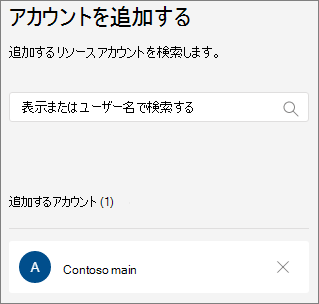

# 自動応答を設定するSet up an auto attendant

自動応答を使うと、ユーザーが組織を呼び出したり、メニューシステムを移動して、適切な部門、通話キュー、人、またはオペレーターと話すことができます。Auto attendants let people call your organization and navigate a menu system to speak to the right department, call queue, person, or an operator. Microsoft Teams 管理センターまたは PowerShell を使用して、組織の自動応答を作成できます。You can create auto attendants for your organization with the Microsoft Teams admin center, or with PowerShell. 

この記事に記載されている手順を実行する前に、「 [Teams の自動応答と通話キューのプラン](plan-auto-attendant-call-queue.md) 」を参照して、 [作業の開始の手順](plan-auto-attendant-call-queue.md#getting-started) に従っていることを確認してください。Be sure you have read [Plan for Teams auto attendants and call queues](plan-auto-attendant-call-queue.md) and followed the [getting started steps](plan-auto-attendant-call-queue.md#getting-started) before you follow the procedures in this article.

自動応答では、発信者の入力に基づいて、次のいずれかの宛先に通話を転送できます。Auto attendants can direct calls, based on callers' input, to one of the following destinations:

- **組織内のユーザー** -音声通話を受信できる組織内のユーザー。**Person in the organization** - a person in your organization who is able to receive voice calls. これは、オンラインユーザーまたは Skype for Business Server を使用してオンプレミスでホストされているユーザーのいずれかになります。This can be an online user or a user hosted on-premises using Skype for Business Server.
- **音声アプリ** -別の自動応答または通話キュー。**Voice app** - another auto attendant or a call queue. (この宛先を選択するときに、自動応答または通話キューに関連付けられているリソースアカウントを選びます。)(Choose the resource account associated with the auto attendant or call queue when choosing this destination.)
- **外部電話番号** -任意の電話番号。**External phone number** - any phone number. (「 [外部転送技術の詳細](create-a-phone-system-auto-attendant.md#external-phone-number-transfers---technical-details)」を参照してください)。(See [external transfer technical details](create-a-phone-system-auto-attendant.md#external-phone-number-transfers---technical-details)).
- **ボイス** メール-指定した Microsoft 365 グループに関連付けられているボイスメールボックス。**Voicemail** - the voice mailbox associated with a Microsoft 365 group that you specify.
- **Operator** -自動応答に対して定義されているオペレーター。**Operator** - the operator defined for the auto attendant. 演算子の定義は省略可能です。Defining an operator is optional. このリストでは、演算子を他の任意の宛先として定義できます。The operator can be defined as any of the other destinations in this list.

自動応答をセットアップするときに、これらのオプションのいずれかを選択するように求められます。You'll be prompted to choose one of these options at various stages as you set up an auto attendant.

自動応答を設定するには、Teams 管理センターで、[ **音声**]、[ **自動応答**]、[ **追加**] の順に展開します。To set up an auto attendant, in the Teams admin center, expand **Voice**, click **Auto attendants**, and then click **Add**.

## 一般的な情報General info

1. 上部のボックスに自動応答の名前を入力します。Type a name for the auto attendant in the box at the top.

2. オペレーターを指定する場合は、オペレーターへの通話の送信先を指定します。If you want to designate an operator, specify the destination for calls to the operator. これはオプションです (ただし推奨)。This is optional (but recommended). [ **オペレーター** ] オプションを設定すると、発信者はメニューから抜け、指定したユーザーに向かって話すことができます。You can set the **Operator** option to allow callers to break out of the menus and speak to a designated person.

3. この自動応答のタイムゾーンを指定します。Specify the time zone for this auto attendant. タイムゾーンは、勤務時間の計算に使用されます。これには、 [時間の経過に応じて個別のコールフローを作成](#call-flow-for-after-hours)します。The time zone is used for calculating business hours if you [create a separate call flow for after hours](#call-flow-for-after-hours).

4. この自動応答の言語を指定します。Specify a language for this auto attendant. これは、システムによって生成される音声プロンプトで使用される言語です。This the language that will be used for system-generated voice prompts.

5. 音声入力を有効にするかどうかを選択します。Choose if you want to enable voice inputs. 有効にすると、すべてのメニューオプションの名前が音声認識のキーワードになります。When enabled, the name of every menu option becomes a speech-recognition keyword. たとえば、発信者は "One" と言って、キー1にマップされているメニューオプションを選ぶか、"売上" という名前のメニューオプションを選ぶために "売上" と言うことができます。For example, callers can say "One" to select the menu option mapped to key 1, or they can say "Sales" to select the menu option named "Sales."

6. **[次へ]** をクリックします。Click **Next**.

## コールフローCall flow

自動応答が着信に応答したときに応答メッセージを再生するかどうかを選びます。Choose if you want to play a greeting when the auto attendant answers a call.

[ **オーディオファイルの再生** ] を選択した場合は、[ **ファイルのアップロード** ] ボタンを使用して、録音したグリーティングメッセージをオーディオとして保存することができます。WAV、。MP3、またはです。WMA 形式。If you select **Play an audio file** you can use the **Upload file** button to upload a recorded greeting message saved as audio in .WAV, .MP3, or .WMA format. 記録は 5 MB 以下でなければなりません。The recording can be no larger than 5 MB.

[ **グリーティングメッセージの入力** ] を選択した場合は、自動応答が着信に応答したときに、入力したテキスト (最大1000文字) のテキストが読み上げられます。If you select **Type a greeting message** the system will read the text you the text that you type (up to 1000 characters) when the auto attendant answers a call.

通話のルーティング方法を選択します。Choose how you want to route the call.

[ **切断**] を選択すると、自動応答が通話を切断します。If you select **Disconnect**, the auto attendant will hang up the call.

[通話の **リダイレクト**] を選択した場合は、いずれかの通話ルーティング先を選ぶことができます。If you select **Redirect call**, you can choose one of the call routing destinations.

[ **再生] メニューのオプション**を選択した場合は、 **オーディオファイルを再生** するか、 **あいさつメッセージを入力** するかを選択して、メニューオプションとディレクトリ検索のいずれかを選択できます。If you select **Play menu options**, you can choose to **Play an audio file** or **Type in a greeting message** and then choose between menu options and directory search.

### メニューオプションMenu options

ダイヤルオプションの場合、電話のキーパッドの0-9 キーをいずれかの通話ルーティング先に割り当てることができます。For dialing options, you can assign the 0-9 keys on the telephone keypad to one of the call routing destinations. (キー \* (繰り返し) と \# (戻る) は、システムによって予約されているため、再割り当てすることはできません。(The keys \* (Repeat) and \# (Back) are reserved by the system and can't be reassigned.)

キーマッピングは、継続的である必要はありません。Key mappings don't have to be continuous. たとえば、キー0、1、3のメニューを作成してオプションにマップし、2つのキーを使用しないことができます。It is possible, for example, to create a menu with keys 0, 1, and 3 mapped to options, while the 2 key isn't used.

構成済みの場合は、オペレーターに0キーをマッピングすることをお勧めします。We recommend mapping the 0 key to the operator if you have configured one. 演算子がいずれのキーにも設定されていない場合は、音声コマンド "Operator" も無効になります。If the operator isn't set to any key, the voice command "Operator" is also disabled. 

各メニューオプションについて、次を指定します。For each menu option, specify the following:

- **ダイヤルキー** : 電話のキーパッドのキーを使用して、このオプションにアクセスします。**Dial key** - the key on the telephone keypad to access this option. 音声入力が利用可能な場合、発信者はこの番号を使ってオプションにアクセスすることもできます。If voice inputs are available, callers can also say this number to access the option.

- **音声コマンド** -音声入力が有効になっている場合に、発信者がこのオプションにアクセスできる音声コマンドを定義します。**Voice command** - defines the voice command that a caller can give to access this option, if voice inputs are enabled. "カスタマーサービス" や "運営および根拠" など、複数の単語を含めることができます。It can contain multiple words like "Customer Service" or "Operations and Grounds." たとえば、発信者は2を押すか、「2」と言って、「売上」と言って2つのキーに対応するオプションを選択できます。For example, the caller can press 2, say "two," or say "Sales" to select the option mapped to the 2 key. このテキストは、サービス確認プロンプトの音声合成によっても表示されます。これは、「売上への通話転送」のようなものである可能性があります。This text is also rendered by text to speech for the service confirmation prompt, which might be something like "Transferring your call to sales."

- [ **Redirect to** ]: 発信者がこのオプションを選択したときに使用される通話ルーティング先。**Redirect to** - the call routing destination used when callers choose this option. 自動応答または通話キューにリダイレクトする場合は、それに関連付けられているリソースアカウントを選択します。If you are redirecting to an auto attendant or call queue, choose the resource account associated with it.

### ディレクトリ検索Directory search

ダイヤルキーを宛先に割り当てる場合は、[**ディレクトリ検索**] で [**なし**] を選ぶことをお勧めします。If you assign dial keys to destinations, we recommend that you choose **None** for **Directory search**. 発信者が、特定の宛先に割り当てられているキーを使用して名前または内線番号をダイヤルしようとした場合、名前または内線番号の入力が完了する前に、送信先に予期せずルーティングされることがあります。If a caller attempts to dial a name or extension using keys that are assigned to specific destinations, they may be unexpectedly routed to a destination before they finish entering the name or extension. ディレクトリ検索用に別の自動応答を作成し、ダイヤルキーを使用して、メインの自動応答へのリンクを設定することをお勧めします。We recommend that you create a separate auto attendant for directory search and have your main auto attendant link to it via a dial key.

ダイヤルキーを割り当てなかった場合は、 **ディレクトリ検索**のオプションを選びます。If you didn't assign dial keys, then choose an option for **Directory search**.

**名前でダイヤル** -このオプションを有効にした場合、発信者は電話のキーパッドでユーザーの名前を読み上げるか、入力することができます。**Dial by name** - If you enable this option, callers can say the user's name or type it on the telephone keypad. 電話システムのライセンスを持っているか、または Skype for Business Server を使用してオンプレミスでホストされているすべてのユーザーは、資格のあるユーザーであり、名前でダイヤルすることができます。Any online user with a Phone System license, or any user hosted on-premises using Skype for Business Server, is an eligible user and can be found with Dial by name. ([ [ダイヤルのスコープ](#dial-scope) ] ページのディレクトリに含まれていないユーザーを設定することができます。)(You can set who is and is not included in the directory on the [Dial scope](#dial-scope) page.)

**内線番号でダイヤル** -このオプションを有効にすると、発信者は電話内線番号をダイヤルして組織内のユーザーに接続できます。**Dial by extension** - If you enable this option, callers can connect with users in your organization by dialing their phone extension. 電話システムのライセンスを持っているか、または Skype for Business Server を使用してオンプレミスでホストされているすべてのユーザーは、資格のあるユーザーであり、 **内線でダイヤル**することができます。Any online user with a Phone System license, or any user hosted on-premises using Skype for Business Server, is an eligible user and can be found with **Dial by extension**. ([ [ダイヤルのスコープ](#dial-scope) ] ページのディレクトリに含まれていないユーザーを設定することができます。)(You can set who is and is not included in the directory on the [Dial scope](#dial-scope) page.)

内線番号を使用できるようにするには、Active Directory または Azure Active Directory で定義されている次のいずれかの電話属性の一部として内線番号を指定する必要があります (詳しくは、「 [ユーザーを個別にまたは一括で追加](https://docs.microsoft.com/microsoft-365/admin/add-users/add-users) する」をご覧ください)。Users you wish to make available for Dial By Extension need to have an extension specified as part of one of the following phone attributes defined in Active Directory or Azure Active Directory (See [Add users individually or in bulk](https://docs.microsoft.com/microsoft-365/admin/add-users/add-users) for more information.)

- OfficePhoneOfficePhone
- HomePhoneHomePhone
- 携帯電話/MobilePhoneMobile/MobilePhone
- TelephoneNumber/PhoneNumberTelephoneNumber/PhoneNumber
- その他の電話OtherTelephone

[ユーザー電話番号] フィールドに内線番号を入力するために必要な形式は、" \* + <phone number> ext = <extension> \* " または " \* + <phone number> x <extension> \*" のどちらかです。The required format to enter the extension in the user phone number field is either *+<phone number>ext=<extension>* or *+<phone number>x<extension>*.

拡張機能は、 [Microsoft 365 管理センター](https://admin.microsoft.com/) または [Azure Active Directory 管理センター](https://aad.portal.azure.com)で設定できます。You can set the extension in the [Microsoft 365 admin center](https://admin.microsoft.com/) or the [Azure Active Directory admin center](https://aad.portal.azure.com). 自動応答と通話キューに対して変更が利用可能になるまでに最大12時間かかることがあります。It can take up to 12 hours before changes are available to auto attendants and call queues.

> [!NOTE]
> [ **名前によるダイヤル** ] と [ **内線番号** ] の両方の機能を使用する場合は、メインの自動応答でダイヤルキーを割り当てることで、 **名前でダイヤル**できる自動応答に到達することができます。If you want to use both the **Dial by name** and **Dial by extension** features, you can assign a dial key on your main auto attendant to reach an auto attendant enabled for **Dial by name**. この自動応答では、 **内線番号** の自動応答に到達するために、1つのキー (文字が関連付けられていないもの) を割り当てることができます。Within that auto attendant, you can assign the 1 key (which has no letters associated with it) to reach the **Dial by extension** auto attendant.

**ディレクトリ検索**オプションを選んだら、[**次へ**] をクリックします。Once you have selected a **Directory search** option, click **Next**.

## 営業時間外の通話フローCall flow for after hours

営業時間は、自動応答ごとに設定できます。Business hours can be set for each auto attendant. 勤務時間が設定されていない場合、24/7 のスケジュールは既定で設定されているため、その日のすべての曜日とすべての時間は営業時間と見なされます。If business hours aren't set, all days and all hours in the day are considered business hours because a 24/7 schedule is set by default. 営業時間は、その日の休暇によって設定できます。また、業務時間として設定されていない時間は、時間の経過に応じて処理されます。Business hours can be set with breaks in time during the day, and all of the hours that are not set as business hours are considered after-hours. 異なる着信通話処理オプションと応答メッセージは、時間経過に応じて設定できます。You can set different incoming call-handling options and greetings for after-hours.

自動応答と通話キューをどのように設定したかに応じて、直通電話番号を使用した自動応答に対して、時間の経過後の通話ルーティングを指定する必要があります。Depending on how you have configured your auto attendants and call queues, you may only need to specify after-hours call routing for auto attendants with direct phone numbers.

発信者に対して個別の通話ルーティングを使用する場合は、各曜日の勤務時間を指定します。If you want separate call routing for after-hours callers, then specify your business hours for each day. [ **新しい日時の追加** ] をクリックして、昼食を指定するなど、特定の日に複数の時間のセットを指定します。Click **Add new time** to specify multiple sets of hours for a given day, for example, to specify a lunch break.

勤務時間を指定したら、時間の経過後に通話ルーティングオプションを選択します。Once you have specified your business hours, then choose your call routing options for after hours. 上記で指定した勤務時間の通話ルーティングの場合と同じオプションを使用できます。The same options are available as for the business hours call routing that you specified above.

完了したら、[ **次へ** ] をクリックします。Click **Next** when you're done.

## 休日中の通話フローCall flows during holidays

自動応答には、設定した [休日](set-up-holidays-in-teams.md)ごとにコールフローを設定することができます。Your auto attendant can have a call flow for each [Holiday you've set up](set-up-holidays-in-teams.md). 各自動応答には、最大 20 個の決められた休業日を追加できます。You can add up to 20 scheduled holidays to each auto attendant.

1. [ホリデー通話の設定] ページで、[ **追加**] をクリックします。On the Holiday call settings page, click **Add**.

2. この祝日設定の名前を入力します。Type a name for this holiday setting.

3. [ **休日** ] ドロップダウンから、使用する休日を選択します。From the **Holiday** dropdown, choose the holiday that you want to use.

4. 使用する応答メッセージの種類を選びます。Choose the type of greeting that you want to use.

    

5. 通話を **切断** するか、または **リダイレクト** するかを選びます。Choose if you want to **Disconnect** or **Redirect** the call.

6. リダイレクトを選択した場合は、通話の通話ルーティング先を選択します。If you chose to redirect, choose the call routing destination for the call.

7. [**保存**] をクリックします。Click **Save**.

追加の休日ごとに、必要に応じて手順を繰り返します。Repeat the procedure as needed for each additional holiday.

すべての祝日を追加したら、[ **次へ**] をクリックします。When you've added all your holidays, click **Next**.

## ダイヤルスコープDial scope

*ダイヤルスコープ*は、発信者がダイヤルバイネームまたはダイヤルバイエクステンションを使用しているときに、どのユーザーがディレクトリで利用できるかを定義します。The *dial scope* defines which users are available in the directory when a caller uses dial-by-name or dial-by-extension. **すべてのオンラインユーザー**の既定値には、電話システムのライセンスを持っているか、または Skype For business Server を使用してオンプレミスでホストされている組織内のすべてのユーザーが含まれます。The default of **All online users** includes all users in your organization that are Online users with a Phone System license or hosted on-premises using Skype for Business Server.

特定のユーザーを含めたり除外したりするには、1つ以上の Microsoft 365 グループ、配布リスト、またはセキュリティグループを**含める**か**除外**するかの下にある [**カスタムユーザーグループ**] を選択します。You can include or exclude specific users by selecting **Custom user group** under **Include** or **Exclude** and choosing one or more Microsoft 365 groups, distribution lists, or security groups. たとえば、組織の役職をダイヤルディレクトリから除外することができます。For example, you might want to exclude executives in your organization from the dialing directory.

> [!NOTE]
> 新しいユーザーの名前がディレクトリに表示されるまでに、最大36時間かかることがあります。It might take up to 36 hours for a new user to have their name listed in the directory.

ダイヤルスコープの設定が完了したら、[ **次へ**] をクリックします。When you're done setting the dial scope, click **Next**.

## リソースアカウントResource accounts

自動応答には、リソースアカウントが関連付けられている必要があります。All auto attendants must have an associated resource account.  第1レベルの自動応答には、サービス番号が関連付けられた少なくとも1つのリソースアカウントが必要です。First level auto attendants will need at least one resource account that has an associated service number. 必要に応じて、複数のリソースアカウントを1つの自動応答に割り当てることができます。それぞれに個別のサービス番号を指定できます。If you wish, you can assign several resource accounts to an auto attendant, each with a separate service number.

リソースアカウントを追加するには、[ **アカウントの追加** ] をクリックして、追加するアカウントを検索します。To add a resource account, click **Add account** and search for the account that you want to add. [ **追加**] をクリックし、[ **追加**] をクリックします。Click **Add**, and then click **Add**.

サービスアカウントの追加が完了したら、[ **送信**] をクリックします。When you have finished adding service accounts, click **Submit**. これで自動応答の構成が完了します。This completes the auto attendant configuration.

## 外部電話番号の転送-技術的な詳細External phone number transfers - technical details

外部電話番号に通話を転送する場合、自動応答または通話キューに関連付けられているリソースアカウントには、電話番号と Microsoft 365 電話システム仮想ユーザーライセンスが必要です。When transferring calls to an external phone number, the resource account associated with the auto attendant or call queue must have a phone number and a Microsoft 365 Phone System - Virtual User license. かつ：Additionally:

- 通話プラン番号を持つリソースアカウントの場合は、 [通話プラン](calling-plans-for-office-365.md) ライセンスを割り当てます。For a resource account with a Calling Plan number, assign a [Calling Plan](calling-plans-for-office-365.md) license.
- 直接ルーティング番号を持つリソースアカウントの場合は、 [オンラインボイスルーティングポリシー](manage-voice-routing-policies.md)を割り当てます。For a resource account with a Direct Routing number, assign an [online voice routing policy](manage-voice-routing-policies.md).

表示される発信電話番号は、次のように決定されます。The outbound phone number that's displayed is determined as follows:

  - プラン番号を呼び出すには、元の発信者の電話番号が表示されます。For Calling Plan numbers, the original caller's phone number is displayed.
  - 直接ルーティング番号の場合、送信された番号は、次のように、SBC の P (PAI) 設定に基づいています。For Direct Routing numbers, the number sent is based on the P-Asserted-Identity (PAI) setting on the SBC, as follows:
    - [無効] に設定すると、元の発信者の電話番号が表示されます。If set to Disabled, the original caller's phone number is displayed. これは既定の推奨設定です。This is the default and recommended setting.
    - [有効] に設定されている場合は、リソースアカウントの電話番号が表示されます。If set to Enabled, the resource account phone number is displayed.

通話プラン trunks と直接ルーティング trunks の間の転送はサポートされていません。Transfers between Calling Plan trunks and Direct Routing trunks aren't supported.

ハイブリッド環境で、Skype for Business PSTN 統合経由で PSTN に自動応答の通話を転送するには、PSTN 番号に設定された通話転送を使用して、新しいオンプレミスユーザーを作成します。In a hybrid environment, to transfer an auto attendant call to the PSTN via Skype for Business PSTN integration, create a new on-premises user with call forwarding set to the PSTN number. ユーザーはエンタープライズ Voip 用に有効になっていて、音声ポリシーが割り当てられている必要があります。The user must be enabled for Enterprise Voice and have a voice policy assigned. 詳細については、「 [自動応答で PSTN に転送](https://docs.microsoft.com/SkypeForBusiness/plan/exchange-unified-messaging-online-migration-support#auto-attendant-call-transfer-to-pstn)する」を参照してください。To learn more, see [Auto attendant call transfer to PSTN](https://docs.microsoft.com/SkypeForBusiness/plan/exchange-unified-messaging-online-migration-support#auto-attendant-call-transfer-to-pstn).

### PowerShell を使用して自動応答を作成するCreate an auto attendant with PowerShell

PowerShell を使用して自動応答を作成し、設定することもできます。You can also use PowerShell to create and set up auto attendants. 自動応答を管理するために必要なコマンドレットを以下に示します。Here are the cmdlets that you need to manage an auto attendant:

- [新しい-CsAutoAttendantNew-CsAutoAttendant](https://docs.microsoft.com/powershell/module/skype/new-csautoattendant?view=skype-ps)  
- [Set-CsAutoAttendantSet-CsAutoAttendant](https://docs.microsoft.com/powershell/module/skype/set-csautoattendant?view=skype-ps)
- [CsAutoAttendant の入手Get-CsAutoAttendant](https://docs.microsoft.com/powershell/module/skype/get-csautoattendant?view=skype-ps)
- [Get-CsAutoAttendantHolidaysGet-CsAutoAttendantHolidays](https://docs.microsoft.com/powershell/module/skype/get-csautoattendantholidays?view=skype-ps)
- [CsAutoAttendant の削除Remove-CsAutoAttendant](https://docs.microsoft.com/powershell/module/skype/remove-csautoattendant?view=skype-ps)
- [新規-CsAutoAttendantMenuNew-CsAutoAttendantMenu](https://docs.microsoft.com/powershell/module/skype/new-csautoattendantmenu?view=skype-ps)
- [新しい-Csonline AudiofileNew-CsOnlineAudioFile](https://docs.microsoft.com/powershell/module/skype/new-CsOnlineAudioFile?view=skype-ps)
- [新規-CsAutoAttendantCallFlowNew-CsAutoAttendantCallFlow](https://docs.microsoft.com/powershell/module/skype/New-CsAutoAttendantCallFlow?view=skype-ps)
- [エクスポート-CsAutoAttendantHolidaysExport-CsAutoAttendantHolidays](https://docs.microsoft.com/powershell/module/skype/export-csorganizationalautoattendantholidays?view=skype-ps)
- [New-CsOnlineTimeRangeNew-CsOnlineTimeRange](https://docs.microsoft.com/powershell/module/skype/new-csonlinetimerange?view=skype-ps)
- [New-CsOnlineDateTimeRangeNew-CsOnlineDateTimeRange](https://docs.microsoft.com/powershell/module/skype/new-csonlinedatetimerange?view=skype-ps)
- [New-CsOnlineScheduleNew-CsOnlineSchedule](https://docs.microsoft.com/powershell/module/skype/New-CsOnlineSchedule?view=skype-ps)
- [Get-CsAutoAttendantSupportedTimeZoneGet-CsAutoAttendantSupportedTimeZone](https://docs.microsoft.com/powershell/module/skype/Get-CsAutoAttendantSupportedTimeZone?view=skype-ps)
- [新規-CsAutoAttendantCallHandlingAssociationNew-CsAutoAttendantCallHandlingAssociation](https://docs.microsoft.com/powershell/module/skype/New-CsAutoAttendantCallHandlingAssociation?view=skype-ps)
- [Get-CsAutoAttendantSupportedLanguageGet-CsAutoAttendantSupportedLanguage](https://docs.microsoft.com/powershell/module/skype/Get-CsAutoAttendantSupportedLanguage?view=skype-ps)
- [インポート-CsAutoAttendantHolidaysImport-CsAutoAttendantHolidays](https://docs.microsoft.com/powershell/module/skype/import-csautoattendantholidays?view=skype-ps)
- [新規-CsAutoAttendantCallableEntityNew-CsAutoAttendantCallableEntity](https://docs.microsoft.com/powershell/module/skype/New-CsAutoAttendantCallableEntity?view=skype-ps)

## 関連項目Related topics

[電話システムで利用できる機能Here's what you get with Phone System](/MicrosoftTeams/here-s-what-you-get-with-phone-system)

[サービス電話番号を取得するGetting service phone numbers](/microsoftteams/getting-service-phone-numbers)

[国および地域ごとの電話会議および通話プランの利用可能性Country and region availability for Audio Conferencing and Calling Plans](/microsoftteams/country-and-region-availability-for-audio-conferencing-and-calling-plans/country-and-region-availability-for-audio-conferencing-and-calling-plans)

[小規模企業の例—自動応答を設定するSmall business example — Set up an auto attendant](/microsoftteams/tutorial-org-aa) 

[Windows PowerShell と Skype for Business Online の概要An introduction to Windows PowerShell and Skype for Business Online](/SkypeForBusiness/set-up-your-computer-for-windows-powershell/set-up-your-computer-for-windows-powershell)
