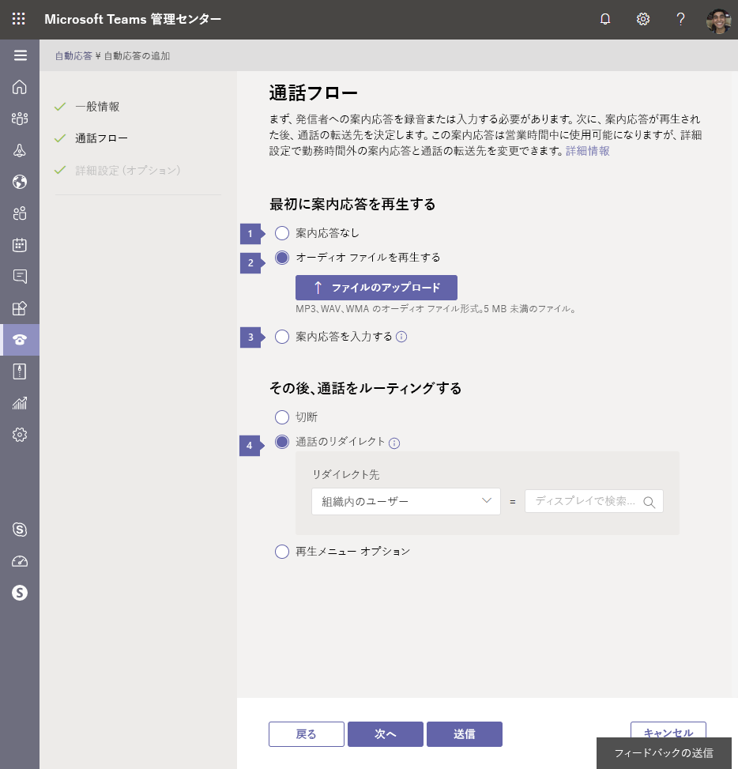
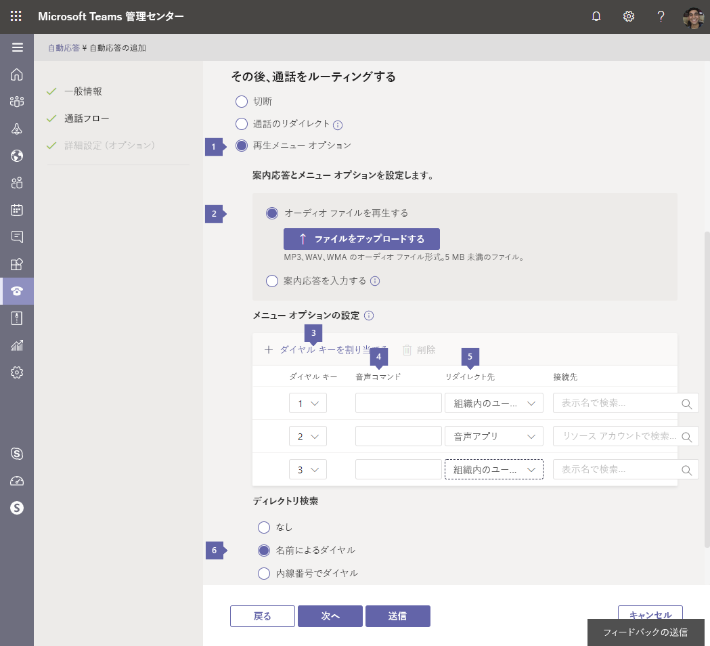
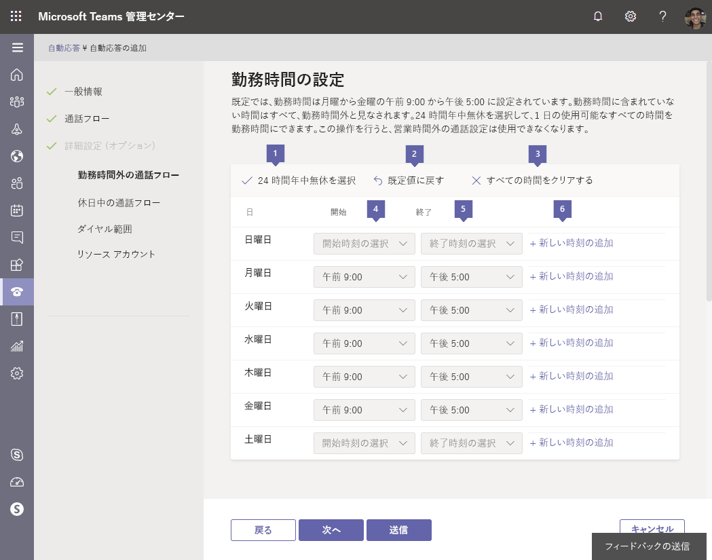
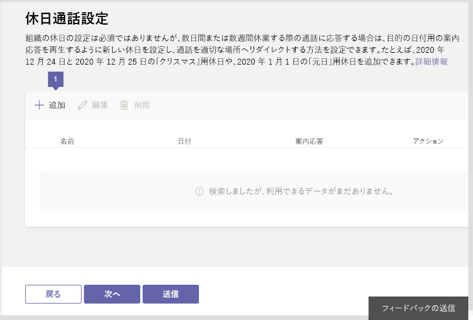
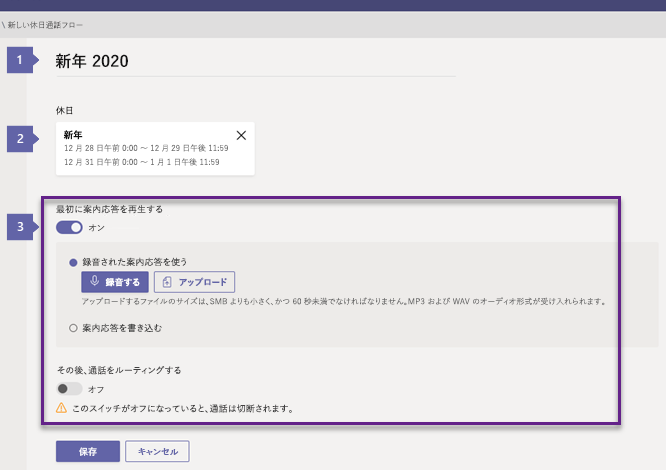
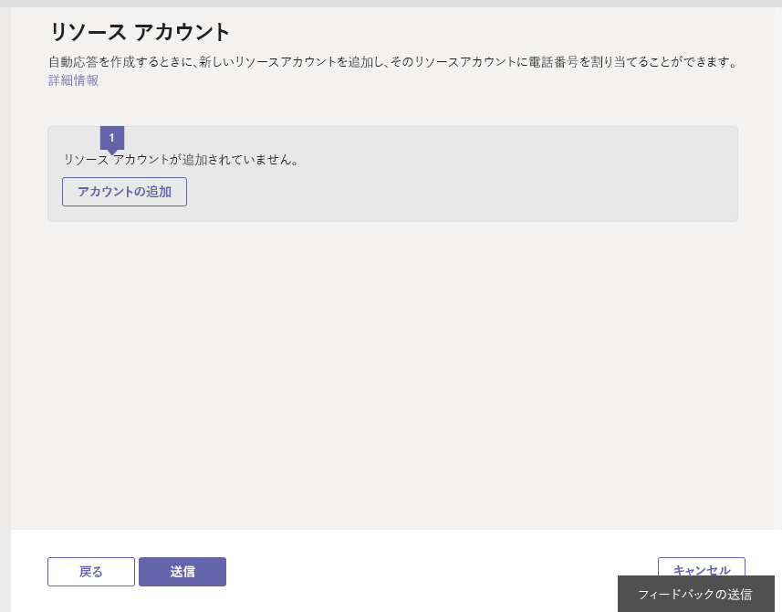
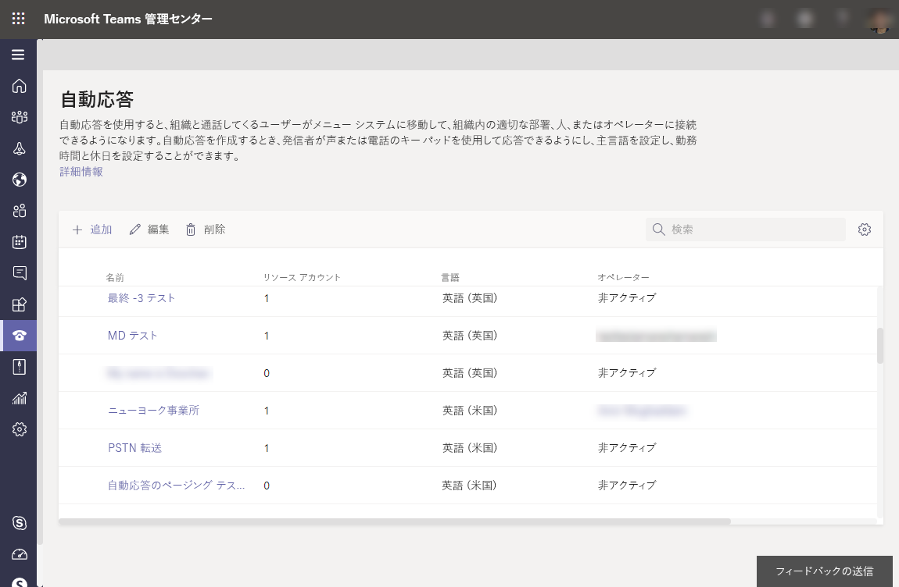
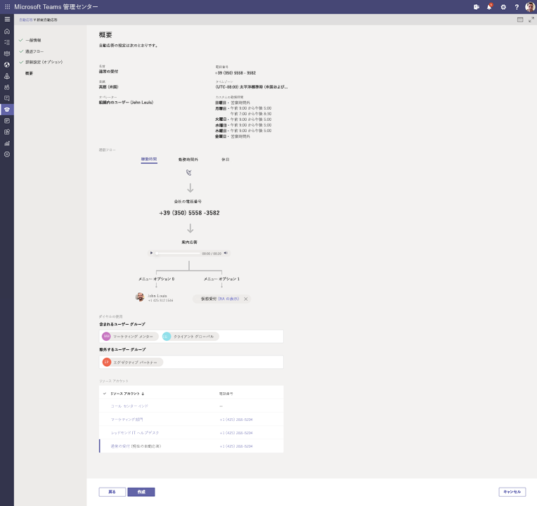

# クラウドの自動応答をセットアップする

自動応答を使うと、ユーザーが組織を呼び出したり、メニューシステムを移動して、適切な部門、通話キュー、人、またはオペレーターと話すことができます。 Microsoft Teams 管理センターまたは Powershell を使用して、組織の自動応答を作成できます。 自動応答を作成するには、左側のナビゲーションで [**音声**] に移動し、[**自動応答** > の**追加**] を選択します。

自動応答の詳細については、「[クラウド自動応答とは何ですか?](/microsoftteams/what-are-phone-system-auto-attendants) 」を参照してください。

> [!NOTE]
> この記事は、Microsoft Teams と Skype for Business Online の両方に適用されます。

電話番号は自動応答に直接割り当てられるのではなく、自動応答に関連付けられている[リソースアカウント](manage-resource-accounts.md)に割り当てられます。

自動応答の実装には、多くの場合、自動応答がいくつか含まれています。 通常、*第1レベル*の自動応答には、電話番号が割り当てられたリソースアカウントがあります。 入れ子になった自動応答は第2レベルのメニューとして使用され、第*1*レベルの自動応答は呼び出しとして接続します。 *入れ子になっ*た自動応答では、リソースアカウントに電話番号を割り当てる必要はありません。

## 手順 1-はじめに

- 自動応答には、関連するリソースアカウントが必要です。 必要なリソースアカウントとすべてのライセンスの詳細については、「 [Teams のリソースアカウントを管理](manage-resource-accounts.md)する」を参照してください。 
 
<!-- When you create a new auto attendant in Teams after October 10th, 2019, the required auto attendant is automatically created and linked with the new auto attendant. -->
 
> [!TIP]
> 電話システムのライセンスを持つオンラインユーザーであるオペレーターまたはメニューオプションへの通話をリダイレクトするには、エンタープライズ Voip に対して通話を有効にする必要があります。 「 [Skype For business ライセンスの割り当て](/skypeforbusiness/skype-for-business-and-microsoft-teams-add-on-licensing/assign-skype-for-business-and-microsoft-teams-licenses)」または「 [Microsoft Teams ライセンスの割り当て](assign-teams-licenses.md)」を参照してください。 Windows PowerShell を使用することもできます。 たとえば、次を実行します。`Set-CsUser -identity "Amos Marble" -EnterpriseVoiceEnabled $true`

## 手順 2-自動応答を作成する

> [!IMPORTANT]
> 各自動応答には、[リソースアカウント](manage-resource-accounts.md)が関連付けられている必要があります。 最初にリソースアカウントを作成してから、自動応答に関連付けることができます。

### Microsoft Teams 管理センターでの操作

**Microsoft Teams 管理センター**で、[**音声** > **自動応答**] をクリックし、[ **+ 追加**] をクリックします。

#### [一般的な情報] ページ

![[自分の自動応答] ページのスクリーンショット](media/edacec94-9384-4a87-be0a-5c49a151287e.png)

* * *

**名**の吹き出しは自動応答の表示名を入力します。 名前の入力は必須で、空白を含む最大 64 文字を含めることができます。 ここで指定した**名前**が、[**自動応答**] タブの列に表示されます。

* * *

  
**演算子**の吹き出し。これは省略可能です (ただし推奨)。 [**オペレーター** ] オプションを設定すると、発信者はメニューから抜け、指定したユーザーに向かって話すことができます。

既定では、0キーがオペレーターに割り当てられます。

オペレーターを設定する場合は、[**通話フロー** ] ページの [**編集] メニューオプション**のオプションについて他のユーザーに連絡してください。 自動応答でオペレーターを設定した場合は、対応するメッセージテキストを [発信者に**聞こえる**] ボックスに入力するか、音声ファイルを変更してこのオプションを含めます。 たとえば、「オペレーターに繋ぐには、0 を押してください。」などです。

オペレーターを設定するには、次のいくつかの方法があります。

- [**演算子なし**] は、"operator" と "Press 0" オプションを無効にします。 これは現在の既定値です。
- **組織内のユーザー**が、Office 365 でエンタープライズボイスまたは割り当てられた通話プランに対応している電話システムのライセンスを持つユーザーを割り当てます。 また、発信者がボイスメールに送信されるように設定することもできます。 発信者をボイスメールに送信するには、[**組織内のユーザー** ] を選択し、そのアカウントの設定でボイスメールに直接通話を送信するように設定します。

     > [!Note]
     > **組織内の**ユーザーは、オンラインユーザーまたは Skype For business Server を使用するオンプレミスでホストされているユーザーになることができます。

- **音声アプリ** 既に作成されている自動応答または通話キューにリンクされているリソースアカウントの名前を選択します。 オペレーターを要求する呼び出し元は、そこにリダイレクトされます。  
<!--   

- **Auto attendant** Select the name of the resource account linked to an auto attendant that has already been created. Callers that request an operator are redirected there.
- **Call queue** Select the name of the resource account linked to a call queue that has already been created. Callers that request an operator are redirected there.

**Phone number (optional)** Enter the service phone number you want to assign to the new resource account this wizard creates and links to the new auto attendant. If you intend this auto attendant to be a nested auto attendant, it doesn't need a phone number. You can add one if for some reason you require several ways to connect to the auto attendant system.

> [!NOTE]
> Auto attendants created after October 10th, 2019 also create a new [resource account](manage-resource-accounts.md) that is associated with the auto attendant. If a phone number is applied to the auto attendant's resource account,  a Phone System - Virtual user license is applied to the resource account if one is available.
-->

* * *

の**タイムゾーン**の吹き出しで、自動応答のタイムゾーンを設定する必要があります。 この設定は、組織の一覧に表示されているメインアドレスのタイムゾーンまたは別のタイムゾーンと同じにすることができます。 各自動応答には、異なるタイムゾーンを割り当てることができます。 自動応答に設定された勤務時間は、このタイムゾーンも使用します。

* * *

  
**言語**の吹き出しで、自動応答に使用する言語を選びます。 自動応答は呼び出し元でその言語を使用し、すべてのシステムプロンプトはこの言語で再生されます。

 * * *

の吹き出しは、このオプションが選択されている場合に音声**入力**音声認識を使用できます。 発信者は、[設定した言語](set-auto-attendant-languages-for-audio-conferencing-in-teams.md)で音声入力を使用できます。 他のユーザーが電話のキーパッドを使って選択できるようにする場合は、音声認識を [**オフ**] に設定したままにすることができます。

* * *  

選択が完了したら、[**次へ**] をクリックします。

#### コールフロー

> [!TIP]
> 独自の勤務時間のスケジュールを設定して、営業時間中および営業時間外にさまざまな通話フロー動作を設定することができます。 ユーザー設定のスケジュールを設定するには、[時間の経過後にオプションのコールフロー](#call-flow-for-after-hours)を設定します。 既定では、自動応答では営業時間の通話フローが使用されます。

ユーザーが自動応答に到着したときに聞こえる、カスタマイズされたあいさつ文、プロンプト、メニューを設定できます。

* * *

**最初にグリーティングメッセージを再生する**応答メッセージは省略可能で**あり、応答なし**に設定したり、**音声ファイルを再生**したり、**あいさつメッセージを入力**したりすることができます。

> [!NOTE]
> 応答メッセージは、第1レベルの自動応答で最も重要です。 入れ子になった自動応答には、多くの場合、応答メッセージは必要ありません。

の吹き出し [あいさつをし**ない**] を選択した場合、発信者は、後で選んだ操作のいずれかによって通話が処理される前に、メッセージまたは応答メッセージを読み上げません。 

<!-- You can also upload an audio file (in .wav, mp3 or .wma formats), or create a custom greeting using Text-to-Speech.-->

の1つのアイコン。 [**オーディオファイルの再生**] を選択すると、[ファイルの**アップロード**] ボタンを使用して、録音したグリーティングメッセージをオーディオとして保存することができます。WAV、。MP3、またはです。WMA 形式。 記録は 5 MB 以下でなければなりません。

の吹き出しテキスト**メッセージを入力**します。このオプションを選択する場合は、提供されたフィールドにシステムで読み上げるテキスト (最大1000文字) を入力します。 たとえば、「Contoso へようこそ」と入力します。 お電話ありがとうございます。 出力は、音声合成ソフトウェアによって作成されます。

* * *

「**通話**」セクションでは、次のアクションからの通話の横に行われる処理を選ぶことができます。 設定は、**切断**、**リダイレクト通話**、**再生メニューのオプション**です。

[**切断**] を選択すると、応答メッセージが再生された後、発信者は切断されます。 

の [**リダイレクト**] を選ぶと、オプションを選択せずに、選択した宛先に発信者が送信されます。 次の設定を使用できます。

  - **組織内のユーザー**選択するアカウントには、エンタープライズ Voip の電話システムライセンスが有効になっているか、Office 365 で通話プランが割り当てられている必要があります。 発信者がボイスメールに送信できるように設定することができます。 [**組織内のユーザー** ] を選択し、ボイスメールに直接通話を転送するようにアカウントを設定します。

  > [!Note]
  > **組織内の**ユーザーは、オンラインユーザーまたは Skype For business Server を使用してオンプレミスでホストされているユーザーになることができます。

  - **音声アプリ**自動応答または設定済みの通話キューを選択します。 サービスに関連付けられているリソースアカウントの名前で、自動応答または通話キューを検索します。

<!-- - **Auto attendant** Select the name of an existing auto attendant.
- **Call queue** Select the name of an auto attendant that has already been created.
- **External phone number** routes the caller to a phone number outside your local system.
- **Operator** directs the call to a user you designate as an Operator. If you haven't previously set up an operator, an option to create one now shows up. The 0 key is assigned to Operator by default. Options for setting an Operator are:

  - **No operator** disables the "Operator" and "Press 0" options.
  - **Person in your organization** can be an Online user or a user hosted on-premises using Skype for Business Server. They must have a Phone System license that is enabled for Enterprise Voice or assigned Calling Plans in Office 365. Search for the operator in the **Destination for your operator** field.
  - **Auto attendant** lets you choose the name of an existing auto attendant.
  - **Call queue** lets you select an existing call queue.
  - **Group Voicemail** routes the call to a voicemail box that you select. -->

 * * *

![[**再生] メニューオプション**を選択すると表示される](media/teamscallout1.png) 、前のスクリーンショットの番号1のアイコン。音声ファイルを使用するか、テキストを入力して、ダイヤルパッドメニューオプションを発信者に与えるかを選択できます。 [**へのリダイレクト**] または [**切断**] のオプションではなく、このオプションを選択します。

の**音声ファイルを再生**すると、発信者が選択できるようにするためのプロンプトとオプションを設定できます。 
- [**オーディオファイルの再生**] を選択した場合は、[**ファイルのアップロード**] ボタンを使用して、録音したグリーティングメッセージをオーディオとして保存することができます。WAV、。MP3、またはです。WMA 形式。 記録は 5 MB 以下でなければなりません。

- **あいさつ文を入力する**このオプションを選択した場合は、表示されるフィールドにシステムで読み取るテキスト (最大1000文字) を入力します。 たとえば、「Contoso へようこそ」と入力します。 お電話ありがとうございます。 出力は、音声合成ソフトウェアによって作成されます。

**メニューオプションを設定**するこのダイアログでは、電話のキーパッドまたは音声コマンドを追加または削除することができます。 メニューオプションを削除するには、音声コマンドのエントリを削除して、 **Redirect**を **[選択]** に設定します。

> [!TIP]
> メニュープロンプトテキストを更新するか、オプションを削除するときに音声メッセージを再記録します。 発信者のメニュープロンプトは、自動的には更新されません。  
>
> メニュー オプションはどのような順番でも追加、削除でき、キー マッピングは連続的である必要はありません。 たとえば、キー 2 を使用せず、キー 0、1、3 をオプションにマッピングしてメニューを作成することが可能です。

> [!NOTE]
> キー \* (繰り返し) と\# (戻る) は、システムによって予約されているため、再割り当てすることはできません。 音声認識が有効になっている場合、* を押すと「繰り返し」、# を押すと「戻る」の音声コマンドに対応します。

の吹き出し。メニューオプションを設定するには、[ **+** ] をクリックして、次のオプションの情報を入力します。

スクリーンショットの**音声コマンド**列には、64文字まで入力でき、"カスタマーサービス" や "操作と根拠" など、複数の単語を含めることができます。   音声認識が有効になっている場合は、その名前が自動的に認識され、発信者は3、「3」と言って、または「カスタマーサービス」と言って、キー3にマップされているオプションを選択できます。 このテキストは、サービス確認プロンプトの音声合成によっても表示されます。これは、「通話をオペレーターに転送する」のようなものである可能性があります。

の吹き出し。対応するキーが押されている場合、または音声認識を使用してオプションを選択した場合に、通話の**転送**先のオプションセットを設定します。 次の場所に呼び出しを送信できます。

<!-- Is the Operator behavior changing here? Looks like operator is only an available option for dial key 0 -->

- **Operator**オペレーターが既に設定されている場合、このオプションは自動的にキー0にマッピングされますが、別のキーに削除したり、再割り当てしたりすることもできます。 このオプションを選択した呼び出し元が指定の演算子に送信されます。 Operator がいずれのキーにも設定されていない場合は、音声コマンド "Operator" も無効になります。 
- **組織内の**ユーザーは、オンラインユーザーまたは Skype For business Server を使用してオンプレミスでホストされているユーザーになることができます。 ユーザーは、Office 365 のエンタープライズボイスまたは割り当てられた通話プランに対して有効になっている電話システムのライセンスを持っている必要があります。 [**検索名**] フィールドでユーザーを検索します。

  - **音声アプリ**自動応答または設定済みの通話キューを選択します。 アプリケーションに関連付けられているリソースアカウントの名前で、自動応答または通話キューを検索します。

<!-- - **Auto attendant** Select the name of an existing auto attendant in the **Search by name** field. You will also have to select a resource account associated to the auto attendant. The caller who selects this option is sent to that auto attendant.
- **Call queue** Select the name of an existing call queue in the **Search by name** field. You will also have to select a resource account associated to the call queue. The caller who selects this option is sent to that call queue, where the call is answered by a call agent.
- **External phone number** routes the caller to a designated phone number outside your local system.<!-- does this have prerequisites like direct routing?
- **Group Voicemail** routes the call to a voicemail box that you select.  -->

**ディレクトリ検索**の吹き出しこのセクションでは、自動応答の**内線番号**による**ダイヤル**を有効にすることができます。   [オプションのダイヤルスコープ] ページでは、これらのサービスに含まれていないユーザーを設定することができます。 [ディレクトリ検索] は、既定では **[なし**] に設定されています。

**名前でダイヤル**このオプションを有効にすると、発信者は**名前でダイヤル**を使用して組織内のユーザーを検索できます。 ユーザー名と音声認識がユーザーに一致していることを示します。 [オプションのダイヤルスコープ] ページでは、これらのサービスに含まれていないユーザーを設定することができます。 電話システムのライセンスを持っているか、または Skype for Business Server を使用してオンプレミスでホストされているすべてのユーザーは、資格のあるユーザーであり、名前でダイヤルすることができます。

[!INCLUDE [preview-feature](includes/preview-feature.md)]

**内線番号でダイヤル**する (このプレビュー機能は、一般公開ではまだ利用できません) このオプションを有効にすると、発信者は電話の内線番号を入力して組織内のユーザーと接続できます。 オプションの [ダイヤルスコープ] ページで、[利用可能] または [**ダイヤルイン] の内線番号**として表示されるユーザーを選ぶことができます。 電話システムのライセンスを持っているか、または Skype for Business Server を使用してオンプレミスでホストされているすべてのユーザーは、資格のあるユーザーであり、内線でダイヤルすることができます。

> [!IMPORTANT]
> 次のことを確認してください。
>- 内線番号を使用できるようにするには、 [Microsoft 365 管理センター](https://docs.microsoft.com/office365/admin/add-users/add-users?view=o365-worldwide#use-the-new-admin-center-to-add-users)で割り当てられている電話番号または携帯電話番号の一部として内線番号が指定されている必要があります。  [ユーザー電話番号] フィールドに拡張子を入力するために必要な形式`+<phonenumber>;ext=<extension>`は`x<extension>`、またはのいずれかです。
>- Teams 管理センターでの内線番号の割り当ては、現在サポートされていません。 [Get-msoluser](https://docs.microsoft.com/powershell/module/msonline/set-msoluser?view=azureadps-1.0) powershell コマンドまたは Microsoft 365 管理センターのいずれかを使用する必要があります。
>- AAD PhoneNumber 属性と MobilePhone 属性の変更が可能になるまでに最大12時間かかることがあります。
>- ユーザーの LineUri の内線番号を定義しないでください。 現在、これはサポートされていません。
>- 自動応答は、ダイヤルの名前または内線番号のいずれかに対して構成することができます。両方は使用できません。

> [!NOTE]
> [**名前によるダイヤル**] 機能と [**内線番号**] 機能の両方を使用する場合は、ユーザーの拡張子がわかっている場合に、呼び出し元**に対して**メニューオプションを選ぶように求めるメインの自動応答を作成し、そのオプションを内線番号を使用できる自動応答に通話を転送します。

* * *

<!--
**Instructions for callers** lets you choose **Use recorded call instructions** or **Write your call instructions**.  

If you choose **Use recorded call instructions**, you have the option to record and upload new or prerecorded sound files to play as menu instructions. The same app used in recording the auto attendant greeting is used here.

If you choose **Write your call instructions**, enter the script  you want the system to read (up to 1000 characters). For example, you might enter text that begins "Please choose from one of the following menu options ... " and provide a script written to reflect your configuration.
* * *  -->

選択が完了したら、[**次へ**] をクリックして詳細設定を変更するか、[**送信**] をクリックして、次のような既定の設定を使用することができます。
- 営業時間外の通話フロー
- 休日のコールフロー
- ダイヤルスコープ
- リソースアカウント

自動応答はリソースアカウントを持つ必要があるため、**リソース**アカウントページに進んで、既に構成したリソースアカウントを関連付けるか、リソースアカウントを作成して自動で関連付けるかを選ぶことができます。「 [Microsoft Teams でリソースアカウントを管理](manage-resource-accounts.md)する」の説明に従って、応答を行います。 この自動応答は、リソースアカウントに関連付けられるまで使用できません。 これを行うには、画面の下部にある [**次へ**] ボタンをクリックし、左のナビゲーションで [**リソース**アカウント] をクリックして、[リソースアカウント] ページに直接移動し、自動応答をリソースアカウントに関連付けます。

#### 詳細設定 (省略可能)

選択した既定値に設定できる追加の画面が4つあります。

##### 営業時間外の通話フロー

既定では、自動応答の営業時間は、月曜日から金曜日までの 9am 5pm に設定されています。  <!--24/7-->通話時間は*勤務時間*と見なされるため、*時間単位*の通話後のコールフローオプションは無効になります。 [**ユーザー設定の勤務時間を設定**する] オプションを選択すると、[**時間経過後の通話フロー** ] ページで、自動応答で使用される通話処理ルールが時間後に構成されます。 利用可能なオプションは同じであるため、異なるメニューや動作のスケジュールを設定する機能も異なります。

自動応答のシステムでは、第1レベルの自動応答の通話処理動作の時間を設定する必要があります。 入れ子になった自動応答は、第1レベルの自動応答によって呼び出されることはありませんが、システムは使用する自動応答ごとに、時間の経過後の動作を定義できます。

最初は、勤務時間が午前12:00 から始まり、日曜日から土曜日までの 12:00 pm で終わるように定義されています。 営業時間外のすべての時間は *、時間の経過後*も考慮されます。

 * * *

の吹き出しである番号1のアイコン。 [24/7 の**選択**] をクリックして、この自動応答の営業時間をすべて時間にすることができます。

の吹き出し [既定の**設定に**戻す] オプションを選択して、スケジュールのすべての変更を元に戻し、勤務時間の既定の定義に 9:00 am から 5:00 Pm の月曜日から金曜日までの既定の定義に戻ります。

の吹き出し [すべての時間を**クリア**] を選んで、スケジュールを完全に消去します。 このチェックボックスをオンにして、[時間] の設定を解除することはお勧めできません。そのため、業務時間を完全に再利用する場合にのみ、このオプションを使用してください。

ショットの1つ目のスクリーンショットアイコンに表示される [開始] または [終了] をクリックして曜日の開始時刻または**** 終了時刻を**** カスタマイズします。表示されるリストから新しい時刻を選択します。   リストでは、15分間隔で事業時間を選ぶことができます。ここで選択する業務時間は、[**一般情報**] ページで設定したタイムゾーンに基づいています。

 <!-- The **Apply to all days** option can be used to reset all days of the week to match the settings for that day. This makes setting weekdays and weekends to different hours easier.-->

で区切りを設定するための吹き出し (たとえば、昼食を設定するなど)、[新しいテーブル行を作成するために、その曜日の**新しい時刻を追加**する] を選択し、[新しい開始時刻] と [終了時刻] を選択します。 営業時間内に複数の休憩時間を設定できます。

時間の後に使用可能な[コールフロー](#call-flow)オプションは、勤務時間内で利用可能なオプションと同じです。 情報の入力ページを下にスクロールして、時間単位の通話のオプションを設定します。

* * *

選択が完了したら、[**次へ**] をクリックします。 左側のナビゲーションで [**リソースアカウント**] をクリックして、[リソースアカウント] ページに直接移動し、自動応答をリソースアカウントに関連付けることもできます。

##### 休日中の通話フロー

各自動応答には、最大 20 個の決められた休業日を追加できます。 組織では、「 [Microsoft Teams で祝日を設定](set-up-holidays-in-teams.md)する」の説明に従って、すでに休日を定義している可能性があります。 見つからない場合は、次の画面が表示されます。 

の吹き出し。自動応答で休日のカスタムコールフローを設定するには、[ **+ Add** **New ホリデー call flow** ] 画面をクリックします。
> [!TIP]
> 休日を作成するには、**組織全体の設定** > の**休日**の画面に移動します。  

* * *

の吹き出しに新しい通話フローの**名前**を入力します。

![[番号 2] のアイコン、前のスクリーンショット](media/teamscallout2.png)の吹き出し (既に祝日を作成している場合は、**休日のプルダウンメニュー**に表示され、それらを選ぶことができます)。 使用されていないオプションが表示されることがあります。必要に応じて編集できます。 表示されていない場合は、プルダウンリストの下部にある [**追加**] をクリックして新しい休日を作成します。  休日の作成に使用した手順については、「 [Microsoft Teams で休日を設定](set-up-holidays-in-teams.md)する」を参照してください。 

休日のコールフローの名前は、最大64文字で、組織に対して一意である必要があります。 たとえば、同じ組織内で "感謝祭" という名前の休日のコールフローを2つ持つことはできません。 自動応答には、設定した各休日のコールフローを設定できますが、カスタマイズされた応答メッセージ以外に計画された共通の動作のセットが必要になる場合もあります。

の吹き出し) 休日の通話フローに使用できる [[グリーティング](#call-flow)] オプションは、勤務時間中に利用可能なオプションと同じです。 応答メッセージが再生された後に実行される**操作**も似ていますが、使用できる操作は**切断**または**リダイレクト**のみです。また、[**リダイレクト先**] オプションでは、演算子は使用できません。. 休日の流れに固有のメニューを設定することはできません。

> [!NOTE]
> 既定では、休日期間中に受信したすべての通話は、応答メッセージ (存在する場合) の後に**切断**されるように設定されているため、カスタム動作を必要とする場合は、リダイレクトを指定する必要があります。

![[休日] ページの通話フローのスクリーンショット](media/50a5ce88-7f39-4210-808a-da7ced969854.png)

[保存] をクリックして、休日の通話フローの作成を終了します。 ホリデーシーズンの通話フローを作成すると、休日の画面に**通話**フローが表示されます。

[**次**へ] をクリック**して [** ダイヤルの範囲] を設定し、[**戻る**] をクリックします。 左側のナビゲーションで [**リソースアカウント**] をクリックして、[リソースアカウント] ページに直接移動し、自動応答をリソースアカウントに関連付けることもできます。

#### ダイヤルスコープ

![[ダイヤルの範囲] ページを示すスクリーンショット](media/1bcb185c-00db-43a7-b5c4-9b021c0627f7.png)

このページでは、ユーザーが組織に発信したときに、自分のディレクトリに一覧表示されていて、名前でダイヤルできるユーザーを設定することができます。 以前の画面では、[名前でダイヤル] は既定で**無効**に設定されています。 内線番号が選択され**て**いる場合は、拡張機能を持つすべてのユーザーが使用できます。

の吹き出しには、すべての**オンラインユーザー**または**カスタムユーザーグループ**のいずれかのオプションが**含ま**れています。

[すべての**オンラインユーザー**] を選択すると、対象ユーザーがすべてディレクトリ検索に含まれます。

**カスタムユーザーグループ**このオプションでは、組織内で既に作成されている Office 365 グループ、配布リスト、またはセキュリティグループを検索して選択することができます。 ユーザーは、選択した Office 365 グループ、配布リスト、またはセキュリティグループに含まれており、**電話システムのライセンスを持つオンラインユーザー**であるか、Skype For business Server を使用してオンプレミスでホストされている場合、ディレクトリに追加されます。 複数の Office 365 グループ、配布リスト、セキュリティグループをディレクトリに追加することができます。

このページでは、組織内のユーザーが自分の組織に電話をかけているユーザーに対して、自分のディレクトリに一覧表示され、名前でダイヤルできるように設定することができます。

の吹き出しは、このセクションのオプションを**除外**することで、特定のユーザーまたはユーザーのグループを組織のディレクトリから除外できるようにします。

[**なし**] を選択すると、対象ユーザーはすべてディレクトリ検索に含まれます。

**カスタムユーザーグループ**組織内で作成された Office 365 グループ、配布リスト、またはセキュリティグループを検索できます。 そのグループ内のユーザーはディレクトリ検索から除外されます。 複数の Office 365 グループ、配布リスト、セキュリティ グループを追加することができます。

[名前でダイヤルする] が有効になっているときに設定を既定のままにすると、対象ユーザーがすべてディレクトリ検索に含まれます。

> [!NOTE]
> 新しいユーザーの名前がディレクトリに表示されるまでに、最大36時間かかることがあります。 他のユーザーが音声認識で名前でダイヤルを使用している場合、この機能では新しいアカウントを使用できない可能性があります。

すべての必要なフィールドを入力し、通話処理のメニューとオプションを設定したら、[**次**へ] をクリックしてリソースアカウントの関連付けに進みます。

#### リソースアカウント

自動応答には、リソースアカウントが関連付けられている必要があります。  第1レベルの自動応答では、少なくとも1つのリソースアカウントにサービス番号が関連付けられている必要があります。 必要に応じて、複数のリソースアカウントを1つの自動応答に割り当てることができます。それぞれに個別のサービス番号を指定できます。

まだリソースアカウントを自動応答に構成していない場合は、次の画面が表示されます。 

 

ていないリソースアカウントを自動応答に追加するための、1つ以上の既存のリソースアカウントと割り当てられていないリソースアカウントを追加するための1つ以上**の [番号**1] のアイコン。

![新しい [応答の概要] ビューのスクリーンショット](media/aa-assigned.png)

の吹き出し。追加のリソースアカウントを追加するには、[ **+ アカウントの追加**] をクリックします。

 この自動応答に割り当てられているリソースアカウントまたはアカウントがリストに表示されます。

## 自動応答の編集

新しい自動応答を保存すると、[**自動応答**] ページに表示されます。 このページでは、[名前]、[関連付けられているリソースアカウント]、[言語]、[割り当てられたオペレーター] など、設定したオプションの一部をすばやく確認できます。

自動応答の設定を変更する場合は、自動応答を選び、操作ウィンドウで [**編集**] をクリックします。

<!-- To quickly place a test call to your auto attendant, click the **Test** button in the Action pane. -->

<!-- ## Summary view

You can use the Summary page to review the settings you've created.

Press the **Create** button to finish setup of your new auto attendant. -->

### Powershell を使用して自動応答を作成する

PowerShell を使用して自動応答を作成し、設定することもできます。 自動応答を管理するために必要なコマンドレットを以下に示します。

- [新しい-CsAutoAttendant](https://docs.microsoft.com/powershell/module/skype/new-csautoattendant?view=skype-ps)  
- [Set-CsAutoAttendant](https://docs.microsoft.com/powershell/module/skype/set-csautoattendant?view=skype-ps)
- [CsAutoAttendant の入手](https://docs.microsoft.com/powershell/module/skype/new-csautoattendant?view=skype-ps)
- [Get-CsAutoAttendantHolidays](https://docs.microsoft.com/powershell/module/skype/get-csautoattendantholidays?view=skype-ps)
- [CsAutoAttendant の削除](https://docs.microsoft.com/powershell/module/skype/remove-csautoattendant?view=skype-ps)
- [新規-CsAutoAttendantMenu](https://docs.microsoft.com/powershell/module/skype/new-csautoattendantmenu?view=skype-ps)
- [新しい-Csonline Audiofile](https://docs.microsoft.com/powershell/module/skype/new-CsOnlineAudioFile?view=skype-ps)
- [新規-CsAutoAttendantCallFlow](https://docs.microsoft.com/powershell/module/skype/New-CsAutoAttendantCallFlow?view=skype-ps)
- [エクスポート-CsAutoAttendantHolidays](https://docs.microsoft.com/powershell/module/skype/export-csorganizationalautoattendantholidays?view=skype-ps)
- [New-CsOnlineTimeRange](https://docs.microsoft.com/powershell/module/skype/new-csonlinetimerange?view=skype-ps)
- [New-CsOnlineDateTimeRange](https://docs.microsoft.com/powershell/module/skype/new-csonlinedatetimerange?view=skype-ps)
- [New-CsOnlineSchedule](https://docs.microsoft.com/powershell/module/skype/New-CsOnlineSchedule?view=skype-ps)
- [Get-CsAutoAttendantSupportedTimeZone](https://docs.microsoft.com/powershell/module/skype/Get-CsAutoAttendantSupportedTimeZone?view=skype-ps)
- [新規-CsAutoAttendantCallHandlingAssociation](https://docs.microsoft.com/powershell/module/skype/New-CsAutoAttendantCallHandlingAssociation?view=skype-ps)
- [Get-CsAutoAttendantSupportedLanguage](https://docs.microsoft.com/powershell/module/skype/Get-CsAutoAttendantSupportedLanguage?view=skype-ps)
- [インポート-CsAutoAttendantHolidays](https://docs.microsoft.com/powershell/module/skype/import-csautoattendantholidays?view=skype-ps)
- [新規-CsAutoAttendantCallableEntity](https://docs.microsoft.com/powershell/module/skype/New-CsAutoAttendantCallableEntity?view=skype-ps)

### Windows PowerShell の詳細について

- Windows PowerShell では、ユーザーの管理と、許可または許可されていないユーザーの操作について説明します。 Windows PowerShell を使用すると、日常業務を簡素化できる単一の管理ポイントから Office 365 および Microsoft Teams を管理することができます。 Windows PowerShell の使用を開始するには、次のトピックを参照してください。

  - [Windows PowerShell と Skype for Business Online の概要](/SkypeForBusiness/set-up-your-computer-for-windows-powershell/set-up-your-computer-for-windows-powershell)

  - [Office 365 PowerShell を使用する必要がある理由](https://docs.microsoft.com/en-us/office365/enterprise/powershell/why-you-need-to-use-office-365-powershell)

- Windows PowerShell には、多くのユーザーの変更を一度に設定するなど、Microsoft 365 管理センターを使用する場合にのみ、速度、シンプルさ、生産性の向上を実現するための多くの利点があります。 次のトピックでこれらの利点について説明します。

  - [Office 365 PowerShell で Office 365 を管理する](https://docs.microsoft.com/en-us/office365/enterprise/powershell/manage-office-365-with-office-365-powershell)

  - [Windows PowerShell による Skype for Business Online の管理](/SkypeForBusiness/set-up-your-computer-for-windows-powershell/set-up-your-computer-for-windows-powershell)

## 関連トピック

[Office 365 の電話システムでできること](/MicrosoftTeams/here-s-what-you-get-with-phone-system)

[サービス電話番号を取得する](/microsoftteams/getting-service-phone-numbers)

[国および地域ごとの電話会議および通話プランの利用可能性](/microsoftteams/country-and-region-availability-for-audio-conferencing-and-calling-plans/country-and-region-availability-for-audio-conferencing-and-calling-plans)

[New-CsOrganizationalAutoAttendant](https://docs.microsoft.com/en-us/powershell/module/skype/new-csorganizationalautoattendant?view=skype-ps)  

[クラウドの自動応答とは](what-are-phone-system-auto-attendants.md)

[小規模企業の例—自動応答を設定する](/microsoftteams/tutorial-org-aa)  
