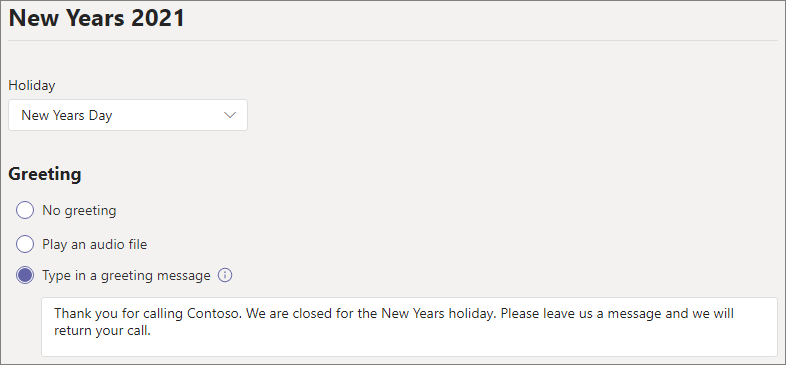

# 自動応答を設定する

自動応答を使うと、ユーザーが組織を呼び出したり、メニューシステムを移動して、適切な部門、通話キュー、人、またはオペレーターと話すことができます。 Microsoft Teams 管理センターまたは PowerShell を使用して、組織の自動応答を作成できます。 

この記事に記載されている手順を実行する前に、「 [Teams の自動応答と通話キューのプラン](plan-auto-attendant-call-queue.md) 」を参照して、 [作業の開始の手順](plan-auto-attendant-call-queue.md#getting-started) に従っていることを確認してください。

自動応答では、発信者の入力に基づいて、次のいずれかの宛先に通話を転送できます。 

- **組織内のユーザー** -音声通話を受信できる組織内のユーザー。 これは、オンラインユーザーまたは Skype for Business Server を使用してオンプレミスでホストされているユーザーのいずれかになります。
- **音声アプリ** -別の自動応答または通話キュー。 (この宛先を選択するときに、自動応答または通話キューに関連付けられているリソースアカウントを選びます。)
- **外部電話番号** -任意の電話番号。 (「 [外部転送技術の詳細](create-a-phone-system-auto-attendant.md#external-phone-number-transfers---technical-details)」を参照してください)。
- **ボイス** メール-指定した Microsoft 365 グループに関連付けられているボイスメールボックス。
- **Operator** -自動応答に対して定義されているオペレーター。 演算子の定義は省略可能です。 このリストでは、演算子を他の任意の宛先として定義できます。

自動応答をセットアップするときに、これらのオプションのいずれかを選択するように求められます。

自動応答を設定するには、Teams 管理センターで、[ **音声** ]、[ **自動応答** ]、[ **追加** ] の順に展開します。

## 一般的な情報

1. 上部のボックスに自動応答の名前を入力します。

2. オペレーターを指定する場合は、オペレーターへの通話の送信先を指定します。 これはオプションです (ただし推奨)。 [ **オペレーター** ] オプションを設定すると、発信者はメニューから抜け、指定したユーザーに向かって話すことができます。

3. この自動応答のタイムゾーンを指定します。 タイムゾーンは、勤務時間の計算に使用されます。これには、 [時間の経過に応じて個別のコールフローを作成](#call-flow-for-after-hours)します。

4. この自動応答の言語を指定します。 これは、システムによって生成される音声プロンプトで使用される言語です。

5. 音声入力を有効にするかどうかを選択します。 有効にすると、すべてのメニューオプションの名前が音声認識のキーワードになります。 たとえば、発信者は "One" と言って、キー1にマップされているメニューオプションを選ぶか、"売上" という名前のメニューオプションを選ぶために "売上" と言うことができます。

6. **[次へ]** をクリックします。

## コールフロー

自動応答が着信に応答したときに応答メッセージを再生するかどうかを選びます。

[ **オーディオファイルの再生** ] を選択した場合は、[ **ファイルのアップロード** ] ボタンを使用して、録音したグリーティングメッセージをオーディオとして保存することができます。WAV、。MP3、またはです。WMA 形式。 記録は 5 MB 以下でなければなりません。

[ **グリーティングメッセージの入力** ] を選択した場合は、自動応答が着信に応答したときに、入力したテキスト (最大1000文字) のテキストが読み上げられます。

通話のルーティング方法を選択します。

[ **切断** ] を選択すると、自動応答が通話を切断します。

[通話の **リダイレクト** ] を選択した場合は、いずれかの通話ルーティング先を選ぶことができます。

[ **再生] メニューのオプション** を選択した場合は、 **オーディオファイルを再生** するか、 **あいさつメッセージを入力** するかを選択して、メニューオプションとディレクトリ検索のいずれかを選択できます。

### メニューオプション

ダイヤルオプションの場合、電話のキーパッドの0-9 キーをいずれかの通話ルーティング先に割り当てることができます。 (キー \* (繰り返し) と \# (戻る) は、システムによって予約されているため、再割り当てすることはできません。

キーマッピングは、継続的である必要はありません。 たとえば、キー0、1、3のメニューを作成してオプションにマップし、2つのキーを使用しないことができます。

構成済みの場合は、オペレーターに0キーをマッピングすることをお勧めします。 演算子がいずれのキーにも設定されていない場合は、音声コマンド "Operator" も無効になります。 

各メニューオプションについて、次を指定します。

- **ダイヤルキー** : 電話のキーパッドのキーを使用して、このオプションにアクセスします。 音声入力が利用可能な場合、発信者はこの番号を使ってオプションにアクセスすることもできます。

- **音声コマンド** -音声入力が有効になっている場合に、発信者がこのオプションにアクセスできる音声コマンドを定義します。 "カスタマーサービス" や "運営および根拠" など、複数の単語を含めることができます。 たとえば、発信者は2を押すか、「2」と言って、「売上」と言って2つのキーに対応するオプションを選択できます。 このテキストは、サービス確認プロンプトの音声合成によっても表示されます。これは、「売上への通話転送」のようなものである可能性があります。

- [ **Redirect to** ]: 発信者がこのオプションを選択したときに使用される通話ルーティング先。 自動応答または通話キューにリダイレクトする場合は、それに関連付けられているリソースアカウントを選択します。

### ディレクトリ検索

ダイヤルキーを宛先に割り当てる場合は、[ **ディレクトリ検索** ] で [ **なし** ] を選ぶことをお勧めします。 発信者が、特定の宛先に割り当てられているキーを使用して名前または内線番号をダイヤルしようとした場合、名前または内線番号の入力が完了する前に、送信先に予期せずルーティングされることがあります。 ディレクトリ検索用に別の自動応答を作成し、ダイヤルキーを使用して、メインの自動応答へのリンクを設定することをお勧めします。

ダイヤルキーを割り当てなかった場合は、 **ディレクトリ検索** のオプションを選びます。

**名前でダイヤル** -このオプションを有効にした場合、発信者は電話のキーパッドでユーザーの名前を読み上げるか、入力することができます。 電話システムのライセンスを持っているか、または Skype for Business Server を使用してオンプレミスでホストされているすべてのユーザーは、資格のあるユーザーであり、名前でダイヤルすることができます。 ([ [ダイヤルのスコープ](#dial-scope) ] ページのディレクトリに含まれていないユーザーを設定することができます。)

**内線番号でダイヤル** -このオプションを有効にすると、発信者は電話内線番号をダイヤルして組織内のユーザーに接続できます。 電話システムのライセンスを持っているか、または Skype for Business Server を使用してオンプレミスでホストされているすべてのユーザーは、資格のあるユーザーであり、 **内線でダイヤル** することができます。 ([ [ダイヤルのスコープ](#dial-scope) ] ページのディレクトリに含まれていないユーザーを設定することができます。)

内線番号を使用できるようにするには、Active Directory または Azure Active Directory で定義されている次のいずれかの電話属性の一部として内線番号を指定する必要があります (詳しくは、「 [ユーザーを個別にまたは一括で追加](https://docs.microsoft.com/microsoft-365/admin/add-users/add-users) する」をご覧ください)。

- OfficePhone
- HomePhone
- 携帯電話/MobilePhone
- TelephoneNumber/PhoneNumber
- その他の電話

[ユーザー電話番号] フィールドに内線番号を入力するために必要な形式は、" *+ <phone number> ext = <extension>* " または " *+ <phone number> x <extension>* " のどちらかです。

拡張機能は、 [Microsoft 365 管理センター](https://admin.microsoft.com/) または [Azure Active Directory 管理センター](https://aad.portal.azure.com)で設定できます。 自動応答と通話キューに対して変更が利用可能になるまでに最大12時間かかることがあります。

> [!NOTE]
> [ **名前によるダイヤル** ] と [ **内線番号** ] の両方の機能を使用する場合は、メインの自動応答でダイヤルキーを割り当てることで、 **名前でダイヤル** できる自動応答に到達することができます。 この自動応答では、 **内線番号** の自動応答に到達するために、1つのキー (文字が関連付けられていないもの) を割り当てることができます。

**ディレクトリ検索** オプションを選んだら、[ **次へ** ] をクリックします。

## 営業時間外の通話フロー

営業時間は、自動応答ごとに設定できます。 勤務時間が設定されていない場合、24/7 のスケジュールは既定で設定されているため、その日のすべての曜日とすべての時間は営業時間と見なされます。 営業時間は、その日の休暇によって設定できます。また、業務時間として設定されていない時間は、時間の経過に応じて処理されます。 異なる着信通話処理オプションと応答メッセージは、時間経過に応じて設定できます。

自動応答と通話キューをどのように設定したかに応じて、直通電話番号を使用した自動応答に対して、時間の経過後の通話ルーティングを指定する必要があります。

発信者に対して個別の通話ルーティングを使用する場合は、各曜日の勤務時間を指定します。 [ **新しい日時の追加** ] をクリックして、昼食を指定するなど、特定の日に複数の時間のセットを指定します。

勤務時間を指定したら、時間の経過後に通話ルーティングオプションを選択します。 上記で指定した勤務時間の通話ルーティングの場合と同じオプションを使用できます。

完了したら、[ **次へ** ] をクリックします。

## 休日中の通話フロー

自動応答には、設定した [休日](set-up-holidays-in-teams.md)ごとにコールフローを設定することができます。 各自動応答には、最大 20 個の決められた休業日を追加できます。

1. [ホリデー通話の設定] ページで、[ **追加** ] をクリックします。

2. この祝日設定の名前を入力します。

3. [ **休日** ] ドロップダウンから、使用する休日を選択します。

4. 使用する応答メッセージの種類を選びます。

    

5. 通話を **切断** するか、または **リダイレクト** するかを選びます。

6. リダイレクトを選択した場合は、通話の通話ルーティング先を選択します。

7. [ **保存** ] をクリックします。

追加の休日ごとに、必要に応じて手順を繰り返します。

すべての祝日を追加したら、[ **次へ** ] をクリックします。

## ダイヤルスコープ

*ダイヤルスコープ* は、発信者がダイヤルバイネームまたはダイヤルバイエクステンションを使用しているときに、どのユーザーがディレクトリで利用できるかを定義します。 **すべてのオンラインユーザー** の既定値には、電話システムのライセンスを持っているか、または Skype For business Server を使用してオンプレミスでホストされている組織内のすべてのユーザーが含まれます。

特定のユーザーを含めたり除外したりするには、1つ以上の Microsoft 365 グループ、配布リスト、またはセキュリティグループを **含める** か **除外** するかの下にある [ **カスタムユーザーグループ** ] を選択します。 たとえば、組織の役職をダイヤルディレクトリから除外することができます。 (両方のリストに含まれているユーザーは、ディレクトリから除外されます)。

> [!NOTE]
> 新しいユーザーの名前がディレクトリに表示されるまでに、最大36時間かかることがあります。

ダイヤルスコープの設定が完了したら、[ **次へ** ] をクリックします。

## リソースアカウント

自動応答には、リソースアカウントが関連付けられている必要があります。  第1レベルの自動応答には、サービス番号が関連付けられた少なくとも1つのリソースアカウントが必要です。 必要に応じて、複数のリソースアカウントを1つの自動応答に割り当てることができます。それぞれに個別のサービス番号を指定できます。

![リソースアカウントの [アカウントの追加] パネルのスクリーンショット](media/auto-attendant-add-resource-account.png)

リソースアカウントを追加するには、[ **アカウントの追加** ] をクリックして、追加するアカウントを検索します。 [ **追加** ] をクリックし、[ **追加** ] をクリックします。

サービスアカウントの追加が完了したら、[ **送信** ] をクリックします。 これで自動応答の構成が完了します。

## 外部電話番号の転送-技術的な詳細

外部電話番号に通話を転送する場合、自動応答または通話キューに関連付けられているリソースアカウントには、電話番号と Microsoft 365 電話システム仮想ユーザーライセンスが必要です。 かつ：

- 通話プラン番号を持つリソースアカウントの場合は、 [通話プラン](calling-plans-for-office-365.md) ライセンスを割り当てます。
- 直接ルーティング番号を持つリソースアカウントの場合は、 [オンラインボイスルーティングポリシー](manage-voice-routing-policies.md)を割り当てます。

表示される発信電話番号は、次のように決定されます。

  - プラン番号を呼び出すには、元の発信者の電話番号が表示されます。
  - 直接ルーティング番号の場合、送信された番号は、次のように、SBC の P (PAI) 設定に基づいています。
    - [無効] に設定すると、元の発信者の電話番号が表示されます。 これは既定の推奨設定です。
    - [有効] に設定されている場合は、リソースアカウントの電話番号が表示されます。

通話プラン trunks と直接ルーティング trunks の間の転送はサポートされていません。

ハイブリッド環境で、Skype for Business PSTN 統合経由で PSTN に自動応答の通話を転送するには、PSTN 番号に設定された通話転送を使用して、新しいオンプレミスユーザーを作成します。 ユーザーはエンタープライズ Voip 用に有効になっていて、音声ポリシーが割り当てられている必要があります。 詳細については、「 [自動応答で PSTN に転送](https://docs.microsoft.com/SkypeForBusiness/plan/exchange-unified-messaging-online-migration-support#auto-attendant-call-transfer-to-pstn)する」を参照してください。

### PowerShell を使用して自動応答を作成する

PowerShell を使用して自動応答を作成し、設定することもできます。 自動応答を管理するために必要なコマンドレットを以下に示します。

- [新しい-CsAutoAttendant](https://docs.microsoft.com/powershell/module/skype/new-csautoattendant)  
- [Set-CsAutoAttendant](https://docs.microsoft.com/powershell/module/skype/set-csautoattendant)
- [CsAutoAttendant の入手](https://docs.microsoft.com/powershell/module/skype/get-csautoattendant)
- [Get-CsAutoAttendantHolidays](https://docs.microsoft.com/powershell/module/skype/get-csautoattendantholidays)
- [CsAutoAttendant の削除](https://docs.microsoft.com/powershell/module/skype/remove-csautoattendant)
- [新規-CsAutoAttendantMenu](https://docs.microsoft.com/powershell/module/skype/new-csautoattendantmenu)
- [新しい-Csonline Audiofile](https://docs.microsoft.com/powershell/module/skype/new-CsOnlineAudioFile)
- [新規-CsAutoAttendantCallFlow](https://docs.microsoft.com/powershell/module/skype/New-CsAutoAttendantCallFlow)
- [エクスポート-CsAutoAttendantHolidays](https://docs.microsoft.com/powershell/module/skype/export-csorganizationalautoattendantholidays)
- [New-CsOnlineTimeRange](https://docs.microsoft.com/powershell/module/skype/new-csonlinetimerange)
- [New-CsOnlineDateTimeRange](https://docs.microsoft.com/powershell/module/skype/new-csonlinedatetimerange)
- [New-CsOnlineSchedule](https://docs.microsoft.com/powershell/module/skype/New-CsOnlineSchedule)
- [Get-CsAutoAttendantSupportedTimeZone](https://docs.microsoft.com/powershell/module/skype/Get-CsAutoAttendantSupportedTimeZone)
- [新規-CsAutoAttendantCallHandlingAssociation](https://docs.microsoft.com/powershell/module/skype/New-CsAutoAttendantCallHandlingAssociation)
- [Get-CsAutoAttendantSupportedLanguage](https://docs.microsoft.com/powershell/module/skype/Get-CsAutoAttendantSupportedLanguage)
- [インポート-CsAutoAttendantHolidays](https://docs.microsoft.com/powershell/module/skype/import-csautoattendantholidays)
- [新規-CsAutoAttendantCallableEntity](https://docs.microsoft.com/powershell/module/skype/New-CsAutoAttendantCallableEntity)

## 関連項目

[電話システムで利用できる機能](/MicrosoftTeams/here-s-what-you-get-with-phone-system)

[サービス電話番号を取得する](/microsoftteams/getting-service-phone-numbers)

[国および地域ごとの電話会議および通話プランの利用可能性](/microsoftteams/country-and-region-availability-for-audio-conferencing-and-calling-plans/country-and-region-availability-for-audio-conferencing-and-calling-plans)

[小規模企業の例—自動応答を設定する](/microsoftteams/tutorial-org-aa) 

[Windows PowerShell と Skype for Business Online の概要](/SkypeForBusiness/set-up-your-computer-for-windows-powershell/set-up-your-computer-for-windows-powershell)
