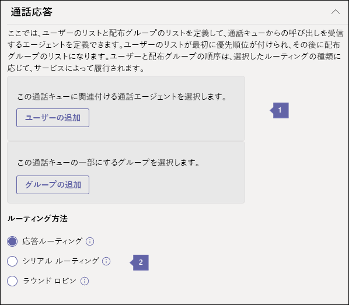

# <a name="create-a-cloud-call-queue"></a><span data-ttu-id="e7b0d-103">クラウドの通話キューを作成する</span><span class="sxs-lookup"><span data-stu-id="e7b0d-103">Create a Cloud call queue</span></span>

<span data-ttu-id="e7b0d-104">クラウド通話キューでは次の情報を提供できます。</span><span class="sxs-lookup"><span data-stu-id="e7b0d-104">Cloud call queues can provide:</span></span>

- <span data-ttu-id="e7b0d-105">あいさつメッセージ。</span><span class="sxs-lookup"><span data-stu-id="e7b0d-105">A greeting message.</span></span>
- <span data-ttu-id="e7b0d-106">通話の保留中に再生される保留音。</span><span class="sxs-lookup"><span data-stu-id="e7b0d-106">Music while people are waiting on hold.</span></span>
- <span data-ttu-id="e7b0d-107">メール対応配布リストとセキュリティ グループを使用した、コール エージェントへの通話のリダイレクト。</span><span class="sxs-lookup"><span data-stu-id="e7b0d-107">Redirecting calls to call agents in mail-enabled distribution lists and security groups.</span></span>
- <span data-ttu-id="e7b0d-108">キューの最大サイズ、タイムアウト、通話処理オプションなどのさまざまなパラメーターを設定します。</span><span class="sxs-lookup"><span data-stu-id="e7b0d-108">Setting different parameters such as queue maximum size, timeout, and call handling options.</span></span>
- <span data-ttu-id="e7b0d-109">発信者が組織のメッセージを残すための共有ボイスメール。</span><span class="sxs-lookup"><span data-stu-id="e7b0d-109">Shared voicemail for callers to leave a message for an organization.</span></span>

<span data-ttu-id="e7b0d-110">[リソースアカウント](manage-resource-accounts.md)を使用して、電話番号を通話キューに関連付けることができます。</span><span class="sxs-lookup"><span data-stu-id="e7b0d-110">You would associate a phone number to a call queue using a [resource account](manage-resource-accounts.md).</span></span> <span data-ttu-id="e7b0d-111">通話キューには、自動応答の選択によって直接ダイヤルするか、アクセスすることができます。</span><span class="sxs-lookup"><span data-stu-id="e7b0d-111">A call queue can be dialed directly or accessed by a selection on an auto attendant.</span></span>

<span data-ttu-id="e7b0d-112">発信者は、保留中の音楽を聞くことができます。通話は、*先入れ先出し*(FIFO) の順序で通話エージェントに接続します。</span><span class="sxs-lookup"><span data-stu-id="e7b0d-112">The caller hears music while they are on hold, and the call connects to the call agents in *First In, First Out* (FIFO) order.</span></span>

<span data-ttu-id="e7b0d-113">キュー内のすべての通話は、次のいずれかの方法でエージェントに送信されます。</span><span class="sxs-lookup"><span data-stu-id="e7b0d-113">All calls in the queue are sent to agents by one of the following methods:</span></span>

- <span data-ttu-id="e7b0d-114">アテンダントルーティングを使用すると、キューの最初の呼び出しですべてのエージェントが同時に呼び出されます。</span><span class="sxs-lookup"><span data-stu-id="e7b0d-114">With attendant routing, the first call in the queue  rings all agents at the same time.</span></span>
- <span data-ttu-id="e7b0d-115">シリアルルーティングでは、キューにある最初の呼び出しによって、すべてのコールエージェントが1つずつリングされます。</span><span class="sxs-lookup"><span data-stu-id="e7b0d-115">With serial routing, the first call in the queue rings all call agents one by one.</span></span>
- <span data-ttu-id="e7b0d-116">ラウンドロビンでは、着信のルーティングが分散され、各通話エージェントがキューから同じ数の通話を取得できるようになります。</span><span class="sxs-lookup"><span data-stu-id="e7b0d-116">With round robin, routing of incoming calls is balanced so that each call agent gets the same number of calls from the queue.</span></span>

    > [!NOTE]
    > <span data-ttu-id="e7b0d-117">**オフライン**の通話エージェントは、自分のプレゼンスが [**応答不可]** に設定されています。または、通話キューを無効にしても、通話を受けることはできません。</span><span class="sxs-lookup"><span data-stu-id="e7b0d-117">Call agents who are **Offline**, have set their presence to **Do not Disturb,** or have opted out of the call queue will not recieve calls.</span></span>

- <span data-ttu-id="e7b0d-118">一度に1つの着信通知 (キューの先頭にある通話用) のみが通話エージェントに送信されます。</span><span class="sxs-lookup"><span data-stu-id="e7b0d-118">Only one incoming call notification (for the call at the head of the queue) at a time goes to the call agents.</span></span>
- <span data-ttu-id="e7b0d-119">コール エージェントが通話を受けると、キューにある次の着信がコール エージェントを呼び出します。</span><span class="sxs-lookup"><span data-stu-id="e7b0d-119">After a call agent accepts the call, the next incoming call in the queue will start ringing call agents.</span></span>

> [!NOTE]
> <span data-ttu-id="e7b0d-120">この記事は、Microsoft Teams と Skype for Business Online の両方に適用されます。</span><span class="sxs-lookup"><span data-stu-id="e7b0d-120">This article applies to both Microsoft Teams and Skype for Business Online.</span></span>

## <a name="step-1--get-started"></a><span data-ttu-id="e7b0d-121">手順 1-はじめに</span><span class="sxs-lookup"><span data-stu-id="e7b0d-121">Step 1 — Get started</span></span>

<span data-ttu-id="e7b0d-122">通話キューを使用する場合は、次の重要な点について留意してください。</span><span class="sxs-lookup"><span data-stu-id="e7b0d-122">To get started using call queues, it's important to remember a few things:</span></span>

- <span data-ttu-id="e7b0d-123">通話キューには、関連するリソースアカウントが必要です。</span><span class="sxs-lookup"><span data-stu-id="e7b0d-123">A call queue is required to have an associated resource account.</span></span> <span data-ttu-id="e7b0d-124">リソースアカウントの詳細については、「[チームのリソースアカウントを管理](manage-resource-accounts.md)する」を参照してください。</span><span class="sxs-lookup"><span data-stu-id="e7b0d-124">See [Manage resource accounts in Teams](manage-resource-accounts.md) for details on resource accounts.</span></span>
- <span data-ttu-id="e7b0d-125">リソースアカウントに電話番号を割り当てると、無料電話システムの[仮想ユーザーライセンス](teams-add-on-licensing/virtual-user.md)を使用できるようになります。</span><span class="sxs-lookup"><span data-stu-id="e7b0d-125">When you assign a phone number to a resource account, you can now use the cost-free Phone System [Virtual User license](teams-add-on-licensing/virtual-user.md).</span></span> <span data-ttu-id="e7b0d-126">電話システムでは、低コストの自動応答と通話キューサービスを使用するために、組織レベルで電話番号を使うことができます。</span><span class="sxs-lookup"><span data-stu-id="e7b0d-126">Phone System allows phone numbers at the organizational level for use with low-cost auto attendant and call queue services.</span></span>

> [!NOTE]
> <span data-ttu-id="e7b0d-127">通話キューの直接ルーティングサービス番号は、Microsoft Teams ユーザーとエージェントに対してのみサポートされています。</span><span class="sxs-lookup"><span data-stu-id="e7b0d-127">Direct Routing service numbers for call queues are supported for Microsoft Teams users and agents only.</span></span>

> [!NOTE]
> <span data-ttu-id="e7b0d-128">インターネットに接続している組織内のユーザーに通話をリダイレクトするには、**電話システム**のライセンスが必要です。また、エンタープライズ voip に対応しているか、Office 365 の通話プランを使用している必要があります。</span><span class="sxs-lookup"><span data-stu-id="e7b0d-128">To redirect calls to people in your organization who are Online, they must have a **Phone System** license and be enabled for Enterprise Voice or have Office 365 Calling Plans.</span></span> <span data-ttu-id="e7b0d-129">「 [Skype For business ライセンスの割り当て](/Skype/SfbOnline/skype-for-business-and-microsoft-teams-add-on-licensing/assign-skype-for-business-and-microsoft-teams-licenses.md)」または「 [Microsoft Teams ライセンスの割り当て](assign-teams-licenses.md)」を参照してください。</span><span class="sxs-lookup"><span data-stu-id="e7b0d-129">See [Assign Skype for Business licenses](/Skype/SfbOnline/skype-for-business-and-microsoft-teams-add-on-licensing/assign-skype-for-business-and-microsoft-teams-licenses.md) or [Assign Microsoft Teams licenses](assign-teams-licenses.md).</span></span> <span data-ttu-id="e7b0d-130">エンタープライズ VoIP を有効にするには、Windows PowerShell を使用できます。</span><span class="sxs-lookup"><span data-stu-id="e7b0d-130">To enable them for Enterprise Voice, you can use Windows PowerShell.</span></span> <span data-ttu-id="e7b0d-131">たとえば、次のように実行します。`Set-CsUser -identity "Amos Marble" -EnterpriseVoiceEnabled $true`</span><span class="sxs-lookup"><span data-stu-id="e7b0d-131">For example run: `Set-CsUser -identity "Amos Marble" -EnterpriseVoiceEnabled $true`</span></span>

- <span data-ttu-id="e7b0d-132">Office 365 の通話プランの詳細については、「[電話システムと通話プラン](calling-plan-landing-page.md)」および「 [Office 365 の通話プラン](calling-plans-for-office-365.md)」を参照してください。</span><span class="sxs-lookup"><span data-stu-id="e7b0d-132">To learn more about Office 365 Calling Plans, see [Phone System and Calling Plans](calling-plan-landing-page.md) and [Calling Plans for Office 365](calling-plans-for-office-365.md).</span></span>

- <span data-ttu-id="e7b0d-133">クラウド通話キューを割り当てることができるのは、 **Microsoft Teams 管理センター**で取得した、または別のサービスプロバイダーから転送された有料またはフリーダイヤルのサービス電話番号だけです。</span><span class="sxs-lookup"><span data-stu-id="e7b0d-133">You can only assign Cloud call queues toll and toll-free service phone numbers that you got in the **Microsoft Teams admin center** or transferred from another service provider.</span></span> <span data-ttu-id="e7b0d-134">無料サービス番号には、通信クレジットが必要です。</span><span class="sxs-lookup"><span data-stu-id="e7b0d-134">Communications Credits are required for toll-free service numbers.</span></span>

    > [!NOTE]
    > <span data-ttu-id="e7b0d-135">ユーザー (購読者) の電話番号を通話キューに割り当てることはできません。サービスの有料電話番号または無料電話番号のみを使用できます。</span><span class="sxs-lookup"><span data-stu-id="e7b0d-135">User (subscriber) phone numbers can't be assigned to call queues - only service toll or toll-free phone numbers can be used.</span></span>

- <span data-ttu-id="e7b0d-136">クラウドの通話キューに関連付けられた通話エージェントは、次のクライアントでサポートされます。</span><span class="sxs-lookup"><span data-stu-id="e7b0d-136">The following clients are supported for call agents associated to a Cloud call queue:</span></span>

  - <span data-ttu-id="e7b0d-137">Skype for Business デスクトップクライアント 2016 (32 ビットバージョンと64ビットバージョン)</span><span class="sxs-lookup"><span data-stu-id="e7b0d-137">Skype for Business desktop client 2016 (32-bit and 64-bit versions)</span></span>

  - <span data-ttu-id="e7b0d-138">Lync デスクトップクライアント 2013 (32 ビットバージョンと64ビットバージョン)</span><span class="sxs-lookup"><span data-stu-id="e7b0d-138">Lync desktop client 2013 (32-bit and 64-bit versions)</span></span>

  - <span data-ttu-id="e7b0d-139">Microsoft Teams でサポートされているすべての IP 電話モデル。</span><span class="sxs-lookup"><span data-stu-id="e7b0d-139">All IP phone models supported for Microsoft Teams.</span></span> <span data-ttu-id="e7b0d-140">「 [Skype For Business Online の電話を取得する」を](/skypeforbusiness/what-is-phone-system-in-office-365/getting-phones-for-skype-for-business-online/getting-phones-for-skype-for-business-online)参照してください。</span><span class="sxs-lookup"><span data-stu-id="e7b0d-140">See [Getting phones for Skype for Business Online](/skypeforbusiness/what-is-phone-system-in-office-365/getting-phones-for-skype-for-business-online/getting-phones-for-skype-for-business-online).</span></span>

  - <span data-ttu-id="e7b0d-141">Mac版  Skype for Business クライアント (バージョン 16.8.196 以降)</span><span class="sxs-lookup"><span data-stu-id="e7b0d-141">Mac Skype for Business Client (version 16.8.196 and later)</span></span>

  - <span data-ttu-id="e7b0d-142">Aandroid Skype for Business クライアント (バージョン 6.16.0.9 以降)</span><span class="sxs-lookup"><span data-stu-id="e7b0d-142">Android Skype for Business Client (version 6.16.0.9 and later)</span></span>

  - <span data-ttu-id="e7b0d-143">iPhone Skype for Business Client クライアント(バージョン 6.16.0 以降)</span><span class="sxs-lookup"><span data-stu-id="e7b0d-143">iPhone Skype for Business Client (version 6.16.0 and later)</span></span>

  - <span data-ttu-id="e7b0d-144">Mac版  Skype for Business クライアント (バージョン 6.16.0 以降)</span><span class="sxs-lookup"><span data-stu-id="e7b0d-144">iPad Skype for Business Client (version 6.16.0 and later)</span></span>

  - <span data-ttu-id="e7b0d-145">Microsoft Teams Windows クライアント (32 ビット版と64ビット版)</span><span class="sxs-lookup"><span data-stu-id="e7b0d-145">Microsoft Teams Windows client (32-bit and 64-bit versions)</span></span>

  - <span data-ttu-id="e7b0d-146">Microsoft Teams Mac クライアント</span><span class="sxs-lookup"><span data-stu-id="e7b0d-146">Microsoft Teams Mac client</span></span>

  - <span data-ttu-id="e7b0d-147">Microsoft Teams iPhone アプリ</span><span class="sxs-lookup"><span data-stu-id="e7b0d-147">Microsoft Teams iPhone app</span></span>

  - <span data-ttu-id="e7b0d-148">Microsoft Teams Android アプリ</span><span class="sxs-lookup"><span data-stu-id="e7b0d-148">Microsoft Teams Android app</span></span>

    > [!NOTE]
    > <span data-ttu-id="e7b0d-149">直接ルーティング番号が割り当てられた通話キューは、Skype for Business クライアント、Lync クライアント、または Skype for Business IP 電話をエージェントとしてサポートしません。</span><span class="sxs-lookup"><span data-stu-id="e7b0d-149">Call queues that are assigned a direct routing number will not support Skype for Business clients, Lync clients, or Skype for Business IP Phones as agents.</span></span> 

## <a name="step-2--getting-or-transferring-toll-or-toll-free-service-phone-numbers"></a><span data-ttu-id="e7b0d-150">手順 2-有料またはフリーダイヤルのサービス電話番号を取得または移行する</span><span class="sxs-lookup"><span data-stu-id="e7b0d-150">Step 2 — Getting or transferring toll or toll-free service phone numbers</span></span>

<span data-ttu-id="e7b0d-151">通話キューを作成して設定する前に、既存の有料または無料のサービス番号を取得または移行する必要があります。</span><span class="sxs-lookup"><span data-stu-id="e7b0d-151">Before you can create and set up your call queues, you need to get or transfer your existing toll or toll-free service numbers.</span></span> <span data-ttu-id="e7b0d-152">有料またはフリーダイヤルのサービス電話番号を取得した後は、 **Microsoft Teams 管理センター** > **ボイス** > **電話番号** > **で > が**表示され、番号の**種類**は [**サービス**] と表示されます。無料で利用できます。</span><span class="sxs-lookup"><span data-stu-id="e7b0d-152">After you get the toll or toll-free service phone numbers, they will show up in **Microsoft Teams admin center** > **Voice** > **Phone numbers** > **ADD** >, and the **Number type** will be listed as **Service — Toll-Free**.</span></span> <span data-ttu-id="e7b0d-153">サービス番号を取得するには、「[サービスの電話番号を取得](getting-service-phone-numbers.md)する」または「既存のサービス番号を移行する」を参照してください。「 [Office 365 に電話番号を転送](phone-number-calling-plans/transfer-phone-numbers-to-teams.md)する」を参照してください。</span><span class="sxs-lookup"><span data-stu-id="e7b0d-153">To get your service numbers, see [Getting service phone numbers](getting-service-phone-numbers.md) or if you want to transfer an existing service number, see [Transfer phone numbers to Office 365](phone-number-calling-plans/transfer-phone-numbers-to-teams.md).</span></span>

> [!NOTE]
> <span data-ttu-id="e7b0d-154">米国外の場合は、Microsoft Teams 管理センターを使用してサービス番号を取得することはできません。</span><span class="sxs-lookup"><span data-stu-id="e7b0d-154">If you are outside the United States, you can't use the Microsoft Teams admin center to get service numbers.</span></span> <span data-ttu-id="e7b0d-155">「[組織の電話番号を管理](manage-phone-numbers-for-your-organization/manage-phone-numbers-for-your-organization.md)する」に移動して、米国以外の地域での実行方法を確認します。</span><span class="sxs-lookup"><span data-stu-id="e7b0d-155">Go to [Manage phone numbers for your organization](manage-phone-numbers-for-your-organization/manage-phone-numbers-for-your-organization.md) instead to see how to do it from the outside of the United States.</span></span>

<span data-ttu-id="e7b0d-156">複数の自動応答を設定すると、メインの自動応答のリソースアカウントに電話番号を割り当てることができます。これにより、発信者は通話キューまたはネストされた自動応答になります。</span><span class="sxs-lookup"><span data-stu-id="e7b0d-156">When setting up multiple auto attendants you may only assign a phone number to the main auto attendant's resource account, which can direct callers to your call queues or nested auto attendants.</span></span> <span data-ttu-id="e7b0d-157">このような場合は、ダイヤルパッドオプションを割り当てずに、システムですべての自動応答と通話キューを作成し、後で設定を編集します。</span><span class="sxs-lookup"><span data-stu-id="e7b0d-157">In those situations, you create all auto attendants and call queues in your system without assigning dialpad options, and then edit the settings later.</span></span> <span data-ttu-id="e7b0d-158">このことが必要になるのは、まだ存在していない通話キューまたは自動応答にリンクするオプションを作成できないためです。</span><span class="sxs-lookup"><span data-stu-id="e7b0d-158">This is necessary because you aren't allowed to create an option linking to a call queue or auto attendant that does not yet exist.</span></span>

## <a name="step-3--create-a-new-call-queue"></a><span data-ttu-id="e7b0d-159">手順 3-新しい通話キューを作成する</span><span class="sxs-lookup"><span data-stu-id="e7b0d-159">Step 3 — Create a new call queue</span></span>

[!INCLUDE [updating-admin-interfaces](includes/updating-admin-interfaces.md)]

> [!IMPORTANT]
> <span data-ttu-id="e7b0d-160">すべての通話キューには、[リソースアカウント](manage-resource-accounts.md)が関連付けられている必要があります。</span><span class="sxs-lookup"><span data-stu-id="e7b0d-160">Every call queue is required to have an associated [resource account](manage-resource-accounts.md).</span></span> <span data-ttu-id="e7b0d-161">最初にリソースアカウントを作成してから、それを通話キューに関連付けることができます。</span><span class="sxs-lookup"><span data-stu-id="e7b0d-161">You must create the resource account first, then you can associate it to the call queue.</span></span>

### <a name="using-the-microsoft-teams-admin-center"></a><span data-ttu-id="e7b0d-162">Microsoft Teams 管理センターの使用</span><span class="sxs-lookup"><span data-stu-id="e7b0d-162">Using the Microsoft Teams admin center</span></span>

<span data-ttu-id="e7b0d-163">**Microsoft Teams 管理センター**の [**音声** > **通話キュー**] で、[ **+ Add new**] をクリックします。</span><span class="sxs-lookup"><span data-stu-id="e7b0d-163">In the **Microsoft Teams admin center**, **Voice** > **Call queues**, then click **+ Add new**:</span></span>

### <a name="set-the-call-queue-display-name-and-resource-account"></a><span data-ttu-id="e7b0d-164">通話キューの表示名とリソースアカウントを設定する</span><span class="sxs-lookup"><span data-stu-id="e7b0d-164">Set the call queue display name and resource account</span></span>


* * *

<span data-ttu-id="e7b0d-166">
**名**で吹き出しを参照する通話キューのわかりやすい表示名を入力します。</span><span class="sxs-lookup"><span data-stu-id="e7b0d-166">
**Name** Enter a descriptive display name for the call queue.</span></span> <span data-ttu-id="e7b0d-167">この名前は必須であり、スペースなどの最大64文字を含めることができます。</span><span class="sxs-lookup"><span data-stu-id="e7b0d-167">This name is required and can contain up to 64 characters, including spaces.</span></span>

 <span data-ttu-id="e7b0d-168">この名前は、着信通話の通知に表示されます。</span><span class="sxs-lookup"><span data-stu-id="e7b0d-168">This name is displayed in the notification for the incoming call.</span></span>

* * *


<span data-ttu-id="e7b0d-170">**アカウントを追加**するリソースアカウントを選択します。</span><span class="sxs-lookup"><span data-stu-id="e7b0d-170">**Add Accounts** Select a resource account.</span></span> <span data-ttu-id="e7b0d-171">リソースアカウントは、通話キューの有料または無料の電話番号と関連付けられている場合と関連付けられていない場合もありますが、各通話キューには関連するリソースアカウントが必要です。</span><span class="sxs-lookup"><span data-stu-id="e7b0d-171">The resource account may or may not be associated with a service toll or toll-free phone number for the call queue, but each call queue requires an associated resource account.</span></span>

<span data-ttu-id="e7b0d-172">リストが表示されない場合は、前に説明したように、サービス番号を取得してリソースアカウントに割り当てておく必要があります。</span><span class="sxs-lookup"><span data-stu-id="e7b0d-172">If there aren't any listed, you need to get service numbers and assign them to a Resource account before you can create this call queue, as described earlier.</span></span> <span data-ttu-id="e7b0d-173">サービス番号を取得するには、「[サービスの電話番号を取得](getting-service-phone-numbers.md)する」を参照してください。</span><span class="sxs-lookup"><span data-stu-id="e7b0d-173">To get your service numbers, see [Getting service phone numbers](getting-service-phone-numbers.md).</span></span> <span data-ttu-id="e7b0d-174">通話キューに関連付けられた電話番号が必要な場合は、「 [Teams のリソースアカウントを管理](manage-resource-accounts.md)する」の説明に従ってリソースアカウントを作成します。</span><span class="sxs-lookup"><span data-stu-id="e7b0d-174">You create a resource account as described in [Manage resource accounts in Teams](manage-resource-accounts.md) if you want your call queue to have an associated phone number.</span></span>

> [!NOTE]
> <span data-ttu-id="e7b0d-175">**ドメイン**を割り当てる必要がある場合は、それを呼び出しキューのリソースアカウントに割り当てます。</span><span class="sxs-lookup"><span data-stu-id="e7b0d-175">If you want or need to assign a **Domain** you would do so by assigning it to the resource account for the call queue.</span></span>

### <a name="set-the-greeting-and-music-played-while-on-hold"></a><span data-ttu-id="e7b0d-176">応答メッセージおよび保留中の保留音を設定する</span><span class="sxs-lookup"><span data-stu-id="e7b0d-176">Set the greeting and music played while on hold</span></span>

![[応答メッセージ] と [音楽] オプションのスクリーンショット。番号付き吹き出し](media/1d395a93-7cab-4178-9295-12d5379e20de.png)

* * *


<span data-ttu-id="e7b0d-179">**応答メッセージ**は省略可能です。</span><span class="sxs-lookup"><span data-stu-id="e7b0d-179">**Greeting** is optional.</span></span> <span data-ttu-id="e7b0d-180">これは、通話キュー番号にコールインした相手に対して再生される応答メッセージです。</span><span class="sxs-lookup"><span data-stu-id="e7b0d-180">This is the greeting that is played for people who call in to the call queue number.</span></span>

<span data-ttu-id="e7b0d-181">オーディオファイル (.wav、.mp3、または .wma 形式) をアップロードできます。</span><span class="sxs-lookup"><span data-stu-id="e7b0d-181">You can upload an audio file (.wav, .mp3, or .wma formats).</span></span>


<span data-ttu-id="e7b0d-183">**保留中の音楽**通話キューで提供される既定の保留中の音楽を使用するか、または .wav、mp3、または .wma 形式のオーディオファイルをアップロードして、カスタム音楽を保留にすることができます。</span><span class="sxs-lookup"><span data-stu-id="e7b0d-183">**Music on hold** You can either use the default Music on Hold provided with the call queue, or you can upload an audio file in .wav, mp3, or .wma formats to use as your custom Music on Hold.</span></span>

* * *

### <a name="select-the-call-answering-options"></a><span data-ttu-id="e7b0d-184">通話応答のオプションを選択する</span><span class="sxs-lookup"><span data-stu-id="e7b0d-184">Select the call answering options</span></span>

 

<span data-ttu-id="e7b0d-186">個々のエージェントをグループに追加せずに直接追加するには、[**ユーザーの追加**] をクリックします。</span><span class="sxs-lookup"><span data-stu-id="e7b0d-186">To add individual agents directly, without adding them to a group, click **Add users**.</span></span> <span data-ttu-id="e7b0d-187">通話を受ける順序に個々のエージェントを追加します。</span><span class="sxs-lookup"><span data-stu-id="e7b0d-187">Put individual agents in the order in which you want them to receive the call.</span></span> <span data-ttu-id="e7b0d-188">最大20の個別のエージェントを追加できます (20 を超える場合は、1つのグループにまとめることができます)。</span><span class="sxs-lookup"><span data-stu-id="e7b0d-188">You can add up to 20 individual agents (to add more than 20, put them in a group).</span></span>

<span data-ttu-id="e7b0d-189">通話は最初に個々のエージェントにルーティングされ、その後、グループ内のエージェントに送信されます。</span><span class="sxs-lookup"><span data-stu-id="e7b0d-189">Calls are routed first to individual agents, then to the agents in groups.</span></span> 

<span data-ttu-id="e7b0d-190">以下のメーリングリストまたはグループのいずれかに属する、最大200の通話エージェントを選択できます。</span><span class="sxs-lookup"><span data-stu-id="e7b0d-190">You can select up to 200 call agents who belong to any of the following mailing lists or groups:</span></span>

- <span data-ttu-id="e7b0d-191">Office 365 グループ</span><span class="sxs-lookup"><span data-stu-id="e7b0d-191">Office 365 group</span></span>
- <span data-ttu-id="e7b0d-192">セキュリティグループ</span><span class="sxs-lookup"><span data-stu-id="e7b0d-192">Security group</span></span>
- <span data-ttu-id="e7b0d-193">配布リスト</span><span class="sxs-lookup"><span data-stu-id="e7b0d-193">Distribution list</span></span>

<span data-ttu-id="e7b0d-194">選択されているコールエージェントは、次のいずれかである必要があります。</span><span class="sxs-lookup"><span data-stu-id="e7b0d-194">Call agents selected must be one of the following:</span></span> 

- <span data-ttu-id="e7b0d-195">電話システムのライセンスを持つオンラインユーザーとエンタープライズ Voip が有効になっている</span><span class="sxs-lookup"><span data-stu-id="e7b0d-195">Online users with a Phone System license and Enterprise Voice enabled</span></span> 
- <span data-ttu-id="e7b0d-196">通話プランを使用するオンラインユーザー</span><span class="sxs-lookup"><span data-stu-id="e7b0d-196">Online users with a Calling Plan</span></span>
- <span data-ttu-id="e7b0d-197">オンプレミスの Skype for Business Server ユーザー</span><span class="sxs-lookup"><span data-stu-id="e7b0d-197">On-premises Skype for Business Server users</span></span>

  > [!NOTE]
  > <span data-ttu-id="e7b0d-198">これは、オンラインの組織内のユーザーに通話をリダイレクトする場合にも該当します。</span><span class="sxs-lookup"><span data-stu-id="e7b0d-198">This also applies if you want to redirect calls to people in your organization who are online.</span></span> <span data-ttu-id="e7b0d-199">これらの個人は、**電話システム**のライセンスとエンタープライズボイスを有効にしている**か**、通話プランを利用している必要があります。</span><span class="sxs-lookup"><span data-stu-id="e7b0d-199">These individuals must have a **Phone System** license and Enterprise Voice enabled **or** have a Calling Plan.</span></span> <span data-ttu-id="e7b0d-200">詳細については、「 [Skype For business ライセンスの割り当て](/Skype/SfbOnline/skype-for-business-and-microsoft-teams-add-on-licensing/assign-skype-for-business-and-microsoft-teams-licenses.md)、 [Microsoft Teams ライセンスの割り当て](https://docs.microsoft.com/microsoftteams/assign-teams-licenses)、または[適切な通話プラン](https://docs.microsoft.com/microsoftteams/calling-plan-landing-page)」を参照してください。</span><span class="sxs-lookup"><span data-stu-id="e7b0d-200">For more information, see [Assign Skype for Business licenses](/Skype/SfbOnline/skype-for-business-and-microsoft-teams-add-on-licensing/assign-skype-for-business-and-microsoft-teams-licenses.md), [Assign Microsoft Teams licenses](https://docs.microsoft.com/microsoftteams/assign-teams-licenses), or [Which Calling Plan is right for you?](https://docs.microsoft.com/microsoftteams/calling-plan-landing-page)</span></span>

 <span data-ttu-id="e7b0d-201">エンタープライズ Voip のエージェントを有効にするには、Windows PowerShell を使用します。</span><span class="sxs-lookup"><span data-stu-id="e7b0d-201">To enable an agent for Enterprise Voice, you can use Windows PowerShell.</span></span> <span data-ttu-id="e7b0d-202">たとえば、次を実行します。`Set-CsUser -identity "Amos Marble" -EnterpriseVoiceEnabled $true`</span><span class="sxs-lookup"><span data-stu-id="e7b0d-202">For example, run: `Set-CsUser -identity "Amos Marble" -EnterpriseVoiceEnabled $true`</span></span>

- <span data-ttu-id="e7b0d-203">**電話システム**のライセンスを持っているか、Office 365 グループに追加された通話プランを持っているユーザーメールが有効な配布リストまたはセキュリティグループ。</span><span class="sxs-lookup"><span data-stu-id="e7b0d-203">Users with a **Phone System** license or a Calling Plan that are added to either an Office 365 Group; a mail-enabled Distribution List; or a Security Group.</span></span> <span data-ttu-id="e7b0d-204">配布リストまたはセキュリティグループに新しく追加されたエージェントが、通話キューからの着信の受信を開始するまでに最大3時間かかることがあります。</span><span class="sxs-lookup"><span data-stu-id="e7b0d-204">It might take up to three hours for a newly added agent in a distribution list, or a security group, to start receiving calls from a call queue.</span></span> <span data-ttu-id="e7b0d-205">新しく作成した分配リストまたはセキュリティ グループでは、通話キューで使用可能になるまで最大で48時間を要する場合があります。</span><span class="sxs-lookup"><span data-stu-id="e7b0d-205">A newly created distribution list or security group might take up to 48 hours to become available to be used with call queues.</span></span> <span data-ttu-id="e7b0d-206">新しく作成された Office 365 グループは、ほぼ瞬時にご利用可能です。</span><span class="sxs-lookup"><span data-stu-id="e7b0d-206">Newly created Office 365 Groups are available almost immediately.</span></span>

- <span data-ttu-id="e7b0d-207">担当者が Microsoft Teams アプリを使って通話キューの呼び出しを実行している場合は、チームメンバーが Teams Sonly モードである必要があります。</span><span class="sxs-lookup"><span data-stu-id="e7b0d-207">If your agents are using Microsoft Teams App to take call queue calls, they need to be in TeamsOnly mode.</span></span>

![[コールエージェントの追加] ウィンドウのスクリーンショット](media/skype-for-business-add-agents-to-call-queue.png)


<span data-ttu-id="e7b0d-210">**ルーティング方法**通話キューの配布方法には、**アテンダント**、**シリアル**、または**ラウンドロビン**のいずれかを選ぶことができます。</span><span class="sxs-lookup"><span data-stu-id="e7b0d-210">**Routing method** You can choose either **Attendant**, **Serial**, or **Round Robin** for your call queue distribution method.</span></span> <span data-ttu-id="e7b0d-211">新規および既存のすべての通話キューは、応答のルーティングが既定値で選択されます。</span><span class="sxs-lookup"><span data-stu-id="e7b0d-211">All new and existing call queues will have attendant routing selected by default.</span></span> <span data-ttu-id="e7b0d-212">アテンダントルーティングを使うと、キューの最初の呼び出しによって、すべてのコールエージェントが同時に呼び出されます。</span><span class="sxs-lookup"><span data-stu-id="e7b0d-212">When attendant routing is used, the first call in the queue rings all call agents at the same time.</span></span> <span data-ttu-id="e7b0d-213">通話を受ける最初のコールエージェントは、通話を受け取ります。</span><span class="sxs-lookup"><span data-stu-id="e7b0d-213">The first call agent to pick up the call gets the call.</span></span>

- <span data-ttu-id="e7b0d-214">**アテンダントルーティング**を行うと、キュー内の最初の呼び出しがすべてのコールエージェントを同時に呼び出します。</span><span class="sxs-lookup"><span data-stu-id="e7b0d-214">**Attendant routing** causes the first call in the queue to ring all call agents at the same time.</span></span> <span data-ttu-id="e7b0d-215">通話を受ける最初のコールエージェントは、通話を受け取ります。</span><span class="sxs-lookup"><span data-stu-id="e7b0d-215">The first call agent to pick up the call gets the call.</span></span>
- <span data-ttu-id="e7b0d-216">**シリアルルーティング**着信エージェントの一覧の先頭から1つずつ呼び出しエージェントが呼び出されます。</span><span class="sxs-lookup"><span data-stu-id="e7b0d-216">**Serial routing** incoming calls ring call agents one by one, starting from the beginning of the call agent list.</span></span> <span data-ttu-id="e7b0d-217">通話エージェントの一覧内では、エージェントを注文することはできません。</span><span class="sxs-lookup"><span data-stu-id="e7b0d-217">Agents cannot be ordered within the call agent list.</span></span> <span data-ttu-id="e7b0d-218">エージェントが退出中、または応答しない場合、リスト上の次のエージェントを呼び出し、キューで待機中の発信が応答するかタイムアウトになるまで、すべてのエージェントの呼び出しを 1 件ずつ試みます。</span><span class="sxs-lookup"><span data-stu-id="e7b0d-218">If an agent dismisses or does not pick up a call, the call will ring the next agent on the list and will try all agents one by one until it is picked up or times out waiting in the queue.</span></span>
  > [!NOTE]
  > <span data-ttu-id="e7b0d-219">**オフライン**中、**取り込み中**表示、またはこのキューからの着信を **オプトアウト** したエージェントは、シリアルルーティングからスキップされます。</span><span class="sxs-lookup"><span data-stu-id="e7b0d-219">Serial routing will skip agents who are **Offline**, have set their presence to **Do not Disturb**, or have **opted out** of getting calls from this queue.</span></span>
- <span data-ttu-id="e7b0d-220">**ラウンドロビン**は、着信呼び出しのルーティングを分散し、各呼び出しエージェントがキューから同じ数の通話を取得できるようにします。</span><span class="sxs-lookup"><span data-stu-id="e7b0d-220">**Round robin** balances routing of incoming calls so that each call agent gets the same number of calls from the queue.</span></span> <span data-ttu-id="e7b0d-221">これは、すべての通話エージェントで同一の営業案件を確保するために、着信の販売環境で望ましい場合があります。</span><span class="sxs-lookup"><span data-stu-id="e7b0d-221">This may be desirable in an inbound sales environment to assure equal opportunity among all the call agents.</span></span>

### <a name="select-an-agent-opt-out-option"></a><span data-ttu-id="e7b0d-222">エージェントのオプトアウトオプションを選択する</span><span class="sxs-lookup"><span data-stu-id="e7b0d-222">Select an agent opt-out option</span></span>


* * *


<span data-ttu-id="e7b0d-225">**エージェントが通話を受けることができ**ないこのオプションを有効にすると、通話キューエージェントが特定のキューからの呼び出しを行わないようにすることができます。</span><span class="sxs-lookup"><span data-stu-id="e7b0d-225">**Agent can opt out of getting calls** You can choose to allow call queue agents to opt-out of taking calls from a particular queue by enabling this option.</span></span>

<span data-ttu-id="e7b0d-226">このオプションを有効にすると、このキュー内のすべてのエージェントは、この通話キューからの着信の受信を開始または停止することができます。</span><span class="sxs-lookup"><span data-stu-id="e7b0d-226">Enabling this option allows all agents in this queue to start or stop receiving calls from this call queue at will.</span></span> <span data-ttu-id="e7b0d-227">チェックボックスの削除することによっていつでもオプトアウトの取消しが可能で、オプトアウトされたエージェントはこの通話キューへ自動的にもう一度オプトインされます。 (すべてのエージェントの初期設定)</span><span class="sxs-lookup"><span data-stu-id="e7b0d-227">You can revoke the agent opt-out privilege at any time by clearing the check box, causing agents to become automatically opted in for this queue again (the default setting for all agents).</span></span>

<span data-ttu-id="e7b0d-228">エージェントは次の操作を行うと、オプトアウトのオプションにアクセスできます:</span><span class="sxs-lookup"><span data-stu-id="e7b0d-228">To access the opt-out option, agents can do the following:</span></span>

 1. <span data-ttu-id="e7b0d-229">Skype for Business クライアントデスクトップで、 **オプション** を開きます。</span><span class="sxs-lookup"><span data-stu-id="e7b0d-229">Open **Options** in their desktop Skype for Business client.</span></span>
 2. <span data-ttu-id="e7b0d-230">**[通話転送]** タブで、 **[オンライン編集の設定]** リンクをクリックします。</span><span class="sxs-lookup"><span data-stu-id="e7b0d-230">On the **Call Forwarding** tab, click the **Edit settings online** link.</span></span>
 3. <span data-ttu-id="e7b0d-231">[ユーザー設定] ページで、[**通話キュー**] をクリックし、脱退するキューのチェックボックスをオフにします。</span><span class="sxs-lookup"><span data-stu-id="e7b0d-231">On the user settings page, click **Call Queues**, and then clear the check boxes for any queues for which they want to opt-out.</span></span>

    > [!NOTE]
    > <span data-ttu-id="e7b0d-232">Skype for Business デスクトップ以外のアプリまたはエンドポイントを使用するエージェントは、ユーザー設定ポータル[https://aka.ms/cqsettings](https://aka.ms/cqsettings)から脱退オプションにアクセスできます。</span><span class="sxs-lookup"><span data-stu-id="e7b0d-232">Agents using apps or endpoints other than Skype for Business Desktop can access the opt-out option from the user settings portal [https://aka.ms/cqsettings](https://aka.ms/cqsettings).</span></span>
    >
    > <span data-ttu-id="e7b0d-233">エージェントが Microsoft Teams のデスクトップクライアントにある場合は、通話設定を使用してそのエージェントを除外することができます。</span><span class="sxs-lookup"><span data-stu-id="e7b0d-233">If the agents are in Microsoft Teams desktop clients, then they can opt-out by using the Call Settings.</span></span> 


<span data-ttu-id="e7b0d-235">
の**通知設定**で吹き出しを参照している番号2のアイコン</span><span class="sxs-lookup"><span data-stu-id="e7b0d-235">
**Agent Alert setting**</span></span>

<span data-ttu-id="e7b0d-236">これは、シリアルまたはラウンドロビンルーティングメソッドが次のエージェントに移動する前に、通話の通知を受けるエージェントの期間を定義します。</span><span class="sxs-lookup"><span data-stu-id="e7b0d-236">This defines the duration of an agent being notified of a call before the Serial or Round Robin routing methods move to the next agent.</span></span>

<span data-ttu-id="e7b0d-237">既定の設定は30秒ですが、最大3分に設定することができます。</span><span class="sxs-lookup"><span data-stu-id="e7b0d-237">The default setting is 30 seconds, but it can be set for up to 3 minutes.</span></span>

* * *

### <a name="set-the-call-overflow-and-timeout-handling-options"></a><span data-ttu-id="e7b0d-238">通話のオーバーフローとタイムアウト処理のオプションを設定する</span><span class="sxs-lookup"><span data-stu-id="e7b0d-238">Set the call overflow and timeout handling options</span></span>


* * *


<span data-ttu-id="e7b0d-241">**キュー内の最大通話数** この項目を使用して、同時に通話がキュー内で待機できる最大通話数を設定します。</span><span class="sxs-lookup"><span data-stu-id="e7b0d-241">**Maximum calls in the queue** Use this to set the maximum calls that can wait in the queue at the same time.</span></span> <span data-ttu-id="e7b0d-242">既定値は50ですが、0 ~ 200 の範囲で指定できます。</span><span class="sxs-lookup"><span data-stu-id="e7b0d-242">The default is 50, but it can range from 0 to 200.</span></span> <span data-ttu-id="e7b0d-243">この制限に達すると、通話は以下の [**通話の最大数に達した場合**] 設定で設定した方法で処理されます。</span><span class="sxs-lookup"><span data-stu-id="e7b0d-243">When this limit is reached, the call is handled in the way you set on the **When the maximum number of calls is reached** setting below.</span></span>

* * *


<span data-ttu-id="e7b0d-245">**通話の最大数に達した場合**通話キューが最大サイズ (**キュー設定の最大の通話**を使用して設定) に達すると、新しい着信呼び出しに何が起こるかを選ぶことができます。</span><span class="sxs-lookup"><span data-stu-id="e7b0d-245">**When the maximum number of calls is reached** When the call queue reaches its maximum size (set using the **Maximum calls in the queue** setting), you can choose what happens to new incoming calls.</span></span>

- <span data-ttu-id="e7b0d-246">**切断**通話が切断されます。</span><span class="sxs-lookup"><span data-stu-id="e7b0d-246">**Disconnect** The call is disconnected.</span></span>
- <span data-ttu-id="e7b0d-247">**リダイレクト先**選択する場合は、次のいずれかを選択します。</span><span class="sxs-lookup"><span data-stu-id="e7b0d-247">**Redirect to** When you choose this, select one of the following:</span></span>

  - <span data-ttu-id="e7b0d-248">**社内のユーザー** **電話システム** のライセンスを持つオンラインのユーザーそしてエンタープライズ ボイス を有効にするか通話プランを取得する必要があります。</span><span class="sxs-lookup"><span data-stu-id="e7b0d-248">**Person in your company** An Online user with a **Phone System** license and be enabled for Enterprise Voice or have a Calling Plan.</span></span> <span data-ttu-id="e7b0d-249">発信者がボイスメールに送信できるように設定できます。</span><span class="sxs-lookup"><span data-stu-id="e7b0d-249">You can set it up so the caller can be sent to voicemail.</span></span> <span data-ttu-id="e7b0d-250">これを行うには、**社内のユーザ**を選択して、そのユーザが直接ボイスメールに転送するように設定します。</span><span class="sxs-lookup"><span data-stu-id="e7b0d-250">To do this, select a **Person in your company** and set this person to have their calls forwarded directly to voicemail.</span></span>

  <span data-ttu-id="e7b0d-251">ボイスメールに必要なライセンスについては、「[クラウドボイスメールのセットアップ](set-up-phone-system-voicemail.md)」をご覧ください。</span><span class="sxs-lookup"><span data-stu-id="e7b0d-251">To learn about licenses required for voicemail, see [Set up Cloud Voicemail](set-up-phone-system-voicemail.md).</span></span>

  - <span data-ttu-id="e7b0d-252">**音声アプリケーション**既に作成されている通話キューまたは自動応答に関連付けられているリソースアカウントの名前を選択します。</span><span class="sxs-lookup"><span data-stu-id="e7b0d-252">**Voice application** Select the name of a resource account associated to either a call queue or auto attendant that has already been created.</span></span>

* * *


<span data-ttu-id="e7b0d-254">**通話タイムアウト: 最大待機時間**また、通話がタイムアウトとなり、リダイレクトまたは切断する必要があるときに、通話を保留する時間を決定することもできます。</span><span class="sxs-lookup"><span data-stu-id="e7b0d-254">**Call Timeout: maximum wait time** You can also decide how much time a call can be on hold in the queue before it times out and needs to be redirected or disconnected.</span></span> <span data-ttu-id="e7b0d-255">リダイレクトされる場所は、**通話**のタイムアウト設定を設定する方法に基づいています。</span><span class="sxs-lookup"><span data-stu-id="e7b0d-255">Where it is redirected is based on how you set the **When a call times out** setting.</span></span> <span data-ttu-id="e7b0d-256">0 から 45 分に設定できます。</span><span class="sxs-lookup"><span data-stu-id="e7b0d-256">You can set a time from 0 to 45 minutes.</span></span>

<span data-ttu-id="e7b0d-257">タイムアウト値は秒単位で、 15 秒間隔で設定することができます。</span><span class="sxs-lookup"><span data-stu-id="e7b0d-257">The timeout value can be set in seconds, at 15-second intervals.</span></span> <span data-ttu-id="e7b0d-258">これにより、通話フローを細かく操作することができます。</span><span class="sxs-lookup"><span data-stu-id="e7b0d-258">This allows you to manipulate the call flow with finer granularity.</span></span> <span data-ttu-id="e7b0d-259">たとえば、エージェントによって応答されないすべての通話を30秒以内に指定して、ディレクトリ検索の自動応答に移動することができます。</span><span class="sxs-lookup"><span data-stu-id="e7b0d-259">For example, you could specify that any calls that are not answered by an agent within 30 seconds go to a Directory Search auto attendant.</span></span>


<span data-ttu-id="e7b0d-261">**通話がタイムアウトになったとき**通話が [キュー] 設定で、通話の**待ち時間**として設定した限度額に達した場合は、この通話に対する処理を選択できます。</span><span class="sxs-lookup"><span data-stu-id="e7b0d-261">**When call times out** When the call reaches the limit you set on the **How long a call can wait in the queue** setting, you can choose what happens to this call:</span></span>

- <span data-ttu-id="e7b0d-262">**切断**通話が切断されます。</span><span class="sxs-lookup"><span data-stu-id="e7b0d-262">**Disconnect** The call is disconnected.</span></span>
- <span data-ttu-id="e7b0d-263">**この通話のリダイレクト先**このオプションを選択すると、次のオプションが表示されます。</span><span class="sxs-lookup"><span data-stu-id="e7b0d-263">**Redirect this call to** When you choose this, you have these options:</span></span>
  - <span data-ttu-id="e7b0d-264">**社内のユーザー** **電話システム** のライセンスを持つオンラインユーザーで、エンタープライズ ボイス が有効化されているまたは、通話プランを取得済みである必要があります。</span><span class="sxs-lookup"><span data-stu-id="e7b0d-264">**Person in your company** An Online user with a **Phone System** license and be enabled for Enterprise Voice or have Calling Plans.</span></span> <span data-ttu-id="e7b0d-265">発信中のユーザーがボイスメールに送信されるように設定できます。</span><span class="sxs-lookup"><span data-stu-id="e7b0d-265">You can set it up so the person calling in can be sent to voicemail.</span></span> <span data-ttu-id="e7b0d-266">これを行うには、**社内のユーザ**を選択して、そのユーザが直接ボイスメールに転送するように設定します。</span><span class="sxs-lookup"><span data-stu-id="e7b0d-266">To do this, select a **Person in your company** and set this person to have their calls forwarded directly to voicemail.</span></span>

  <span data-ttu-id="e7b0d-267">ボイスメールに必要なライセンスについては、「[クラウドボイスメール](set-up-phone-system-voicemail.md)をセットアップする」をご覧ください。</span><span class="sxs-lookup"><span data-stu-id="e7b0d-267">To learn about licensing required for voicemail, see [Set up Cloud Voicemail](set-up-phone-system-voicemail.md).</span></span>

  - <span data-ttu-id="e7b0d-268">**音声アプリケーション**既に作成されている通話キューまたは自動応答のいずれかに関連付けられているリソースアカウントの名前を選択します。</span><span class="sxs-lookup"><span data-stu-id="e7b0d-268">**Voice application** Select the name of a resource account associated with either a call queue or auto attendant that has already been created.</span></span>

## <a name="change-a-users-caller-id-for-outbound-calls"></a><span data-ttu-id="e7b0d-269">発信通話のユーザーの発信者番号認識を変更する</span><span class="sxs-lookup"><span data-stu-id="e7b0d-269">Change a user's Caller ID for outbound calls</span></span>

<span data-ttu-id="e7b0d-270">ユーザーの id を保護するには、 **CsCallingLineIdentity**コマンドレットを使用する代わりに、通話キュー、自動応答、または任意のサービス番号への発信通話の発信者番号を変更します。</span><span class="sxs-lookup"><span data-stu-id="e7b0d-270">You can protect a user's identity by changing their caller ID for outbound calls to a call queue, auto attendant, or any service number instead using the **New-CsCallingLineIdentity** cmdlet.</span></span>

<span data-ttu-id="e7b0d-271">これを行う場合は、次を実行します。</span><span class="sxs-lookup"><span data-stu-id="e7b0d-271">To do this, run:</span></span>

``` Powershell
New-CsCallingLineIdentity -Identity "UKSalesQueue" -CallingIdSubstitute "Service" -ServiceNumber 14258828080 -EnableUserOverride $False -Verbose
```

<span data-ttu-id="e7b0d-272">**Grant-CallingLineIdentity** コマンドレットを使用してユーザーのポリシーを適用します。</span><span class="sxs-lookup"><span data-stu-id="e7b0d-272">Then apply the policy to the user using the **Grant-CallingLineIdentity** cmdlet.</span></span> <span data-ttu-id="e7b0d-273">これを行う場合は、次を実行します。</span><span class="sxs-lookup"><span data-stu-id="e7b0d-273">To do this, run:</span></span>

``` Powershell
Grant-CsCallingLineIdentity -PolicyName UKSalesQueue -Identity "AmosMarble@contoso.com"
```

<span data-ttu-id="e7b0d-274">組織で発信者番号の設定を行う方法については、「[組織での発信者番号の使用方法](/microsoftteams/how-can-caller-id-be-used-in-your-organization)」を参照してください。</span><span class="sxs-lookup"><span data-stu-id="e7b0d-274">You can get more information on how to set caller ID settings in your organization in the article [How can caller ID be used in your organization](/microsoftteams/how-can-caller-id-be-used-in-your-organization).</span></span>

## <a name="call-queue-cmdlets"></a><span data-ttu-id="e7b0d-275">通話キューのコマンドレット</span><span class="sxs-lookup"><span data-stu-id="e7b0d-275">Call queue cmdlets</span></span>

<span data-ttu-id="e7b0d-276">Windows PowerShell を使用して通話キューを作成し、設定することもできます。</span><span class="sxs-lookup"><span data-stu-id="e7b0d-276">You can also use Windows PowerShell to create and set up call queues.</span></span> <span data-ttu-id="e7b0d-277">通話キューを管理するために使用するコマンドレットを以下に示します。</span><span class="sxs-lookup"><span data-stu-id="e7b0d-277">Here are the cmdlets that you use to manage a call queue.</span></span>

- [<span data-ttu-id="e7b0d-278">新規-CsCallQueue</span><span class="sxs-lookup"><span data-stu-id="e7b0d-278">New-CsCallQueue</span></span>](https://docs.microsoft.com/powershell/module/skype/new-CsCallQueue?view=skype-ps)

- [<span data-ttu-id="e7b0d-279">Set-CsCallQueue</span><span class="sxs-lookup"><span data-stu-id="e7b0d-279">Set-CsCallQueue</span></span>](https://docs.microsoft.com/powershell/module/skype/set-CsCallQueue?view=skype-ps)

- [<span data-ttu-id="e7b0d-280">Get-CsCallQueue</span><span class="sxs-lookup"><span data-stu-id="e7b0d-280">Get-CsCallQueue</span></span>](https://docs.microsoft.com/powershell/module/skype/get-CsCallQueue?view=skype-ps)

- [<span data-ttu-id="e7b0d-281">Remove-CsCallQueue</span><span class="sxs-lookup"><span data-stu-id="e7b0d-281">Remove-CsCallQueue</span></span>](https://docs.microsoft.com/powershell/module/skype/remove-CsCallQueue?view=skype-ps)

### <a name="more-about-windows-powershell"></a><span data-ttu-id="e7b0d-282">Windows PowerShell の詳細について</span><span class="sxs-lookup"><span data-stu-id="e7b0d-282">More about Windows PowerShell</span></span>

- <span data-ttu-id="e7b0d-283">Windows PowerShell では、ユーザーの管理と、許可または許可されていないユーザーの操作について説明します。</span><span class="sxs-lookup"><span data-stu-id="e7b0d-283">Windows PowerShell is all about managing users and what users are allowed or not allowed to do.</span></span> <span data-ttu-id="e7b0d-284">Windows PowerShell を使用すると、複数のタスクがある場合に、1つの管理ポイントを使用して Office 365 および Microsoft Teams を管理し、日常的な作業を簡略化することができます。</span><span class="sxs-lookup"><span data-stu-id="e7b0d-284">With Windows PowerShell, you can manage Office 365 and Microsoft Teams with a single point of administration that can simplify your daily work, when you have multiple tasks to do.</span></span> <span data-ttu-id="e7b0d-285">Windows PowerShell の使用を開始するには、次のトピックを参照してください。</span><span class="sxs-lookup"><span data-stu-id="e7b0d-285">To get started with Windows PowerShell, see these topics:</span></span>

  - [<span data-ttu-id="e7b0d-286">Windows PowerShell と Skype for Business Online の概要</span><span class="sxs-lookup"><span data-stu-id="e7b0d-286">An introduction to Windows PowerShell and Skype for Business Online</span></span>](/SkypeForBusiness/set-up-your-computer-for-windows-powershell/set-up-your-computer-for-windows-powershell)

  - [<span data-ttu-id="e7b0d-287">Office 365 PowerShell を使用する必要がある理由</span><span class="sxs-lookup"><span data-stu-id="e7b0d-287">Why you need to use Office 365 PowerShell</span></span>](https://docs.microsoft.com/office365/enterprise/powershell/why-you-need-to-use-office-365-powershell)

- <span data-ttu-id="e7b0d-288">Windows PowerShell には、多くのユーザーに対して同時に設定を変更する場合など、Microsoft Teams 管理センターでの速度、シンプルさ、生産性を高めるためのさまざまな利点があります。</span><span class="sxs-lookup"><span data-stu-id="e7b0d-288">Windows PowerShell has many advantages in speed, simplicity, and productivity over the Microsoft Teams admin center such as when you are making setting changes for many users at one time.</span></span> <span data-ttu-id="e7b0d-289">次のトピックでこれらの利点について説明します。</span><span class="sxs-lookup"><span data-stu-id="e7b0d-289">Learn about these advantages in the following topics:</span></span>

  - [<span data-ttu-id="e7b0d-290">Windows PowerShell を使用して Office 365 を管理する</span><span class="sxs-lookup"><span data-stu-id="e7b0d-290">Manage Office 365 with Windows PowerShell</span></span>](https://docs.microsoft.com/office365/enterprise/powershell/manage-office-365-with-office-365-powershell)

  - [<span data-ttu-id="e7b0d-291">Windows PowerShell 用にコンピューターをセットアップする</span><span class="sxs-lookup"><span data-stu-id="e7b0d-291">Set up your computer for Windows PowerShell</span></span>](https://docs.microsoft.com/SkypeForBusiness/set-up-your-computer-for-windows-powershell/set-up-your-computer-for-windows-powershell)

## <a name="related-topics"></a><span data-ttu-id="e7b0d-292">関連トピック</span><span class="sxs-lookup"><span data-stu-id="e7b0d-292">Related topics</span></span>

[<span data-ttu-id="e7b0d-293">Office 365 の電話システムでできること</span><span class="sxs-lookup"><span data-stu-id="e7b0d-293">Here's what you get with Phone System in Office 365</span></span>](here-s-what-you-get-with-phone-system.md)

[<span data-ttu-id="e7b0d-294">サービス電話番号を取得する</span><span class="sxs-lookup"><span data-stu-id="e7b0d-294">Getting service phone numbers</span></span>](getting-service-phone-numbers.md)

[<span data-ttu-id="e7b0d-295">国および地域ごとの電話会議および通話プランの利用可能性</span><span class="sxs-lookup"><span data-stu-id="e7b0d-295">Country and region availability for Audio Conferencing and Calling Plans</span></span>](country-and-region-availability-for-audio-conferencing-and-calling-plans/country-and-region-availability-for-audio-conferencing-and-calling-plans.md)

[<span data-ttu-id="e7b0d-296">新しい Csonline Applicationinstance</span><span class="sxs-lookup"><span data-stu-id="e7b0d-296">New-CsOnlineApplicationInstance</span></span>](https://docs.microsoft.com/powershell/module/skype/new-csonlineapplicationinstance?view=skype-ps)
