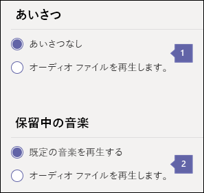

# <a name="create-a-phone-system-call-queue"></a><span data-ttu-id="d8c06-104">電話システムの呼び出しキューを作成する</span><span class="sxs-lookup"><span data-stu-id="d8c06-104">Create a Phone System call queue</span></span>

<span data-ttu-id="d8c06-p102">Phone System call queues include greetings that are used when someone calls in to a phone number for your organization, the ability to automatically put the calls on hold, and the ability to search for the next available call agent to handle the call while the people who call are listening to music on hold. You can create single or multiple call queues for your organization.</span><span class="sxs-lookup"><span data-stu-id="d8c06-p102">Phone System call queues include greetings that are used when someone calls in to a phone number for your organization, the ability to automatically put the calls on hold, and the ability to search for the next available call agent to handle the call while the people who call are listening to music on hold. You can create single or multiple call queues for your organization.</span></span>
  
<span data-ttu-id="d8c06-107">電話システムの通話キューは次の機能を提供します:</span><span class="sxs-lookup"><span data-stu-id="d8c06-107">Phone System call queues can provide:</span></span>
  
- <span data-ttu-id="d8c06-108">組織の応答メッセージ。</span><span class="sxs-lookup"><span data-stu-id="d8c06-108">An organizational greeting.</span></span>
- <span data-ttu-id="d8c06-109">通話の保留中に再生される保留音。</span><span class="sxs-lookup"><span data-stu-id="d8c06-109">Music while people are waiting on hold.</span></span>
- <span data-ttu-id="d8c06-110">メールが有効な配布リストおよびセキュリティ グループ内のエージェントを呼び出しへの呼び出しをリダイレクトします。</span><span class="sxs-lookup"><span data-stu-id="d8c06-110">Redirecting of calls to call agents in mail-enabled distribution lists and security groups.</span></span>
- <span data-ttu-id="d8c06-111">呼び出しキューの最大サイズ、タイムアウト、および呼び出しの処理オプションの設定を行っています。</span><span class="sxs-lookup"><span data-stu-id="d8c06-111">Making settings for call queue maximum size, timeout, and call handling options.</span></span>

<span data-ttu-id="d8c06-112">あいさつのメッセージを聞くを呼び出し、[リソース アカウント](manage-resource-accounts.md)を使用してキューに関連付けられている電話番号呼び出し、(いずれかの設定されている) 場合、その後に、キューを保存して、次の呼び出しを使用可能なエージェントを待機します。</span><span class="sxs-lookup"><span data-stu-id="d8c06-112">When someone calls in to a phone number that is associated  with a call queue via a [resource account](manage-resource-accounts.md), they will hear a greeting first (if any is set up), and then they will be put in the queue and wait for the next available call agent.</span></span> <span data-ttu-id="d8c06-113">待機中、保留中であるし、呼び出し*最初に、先入れ先出し*(FIFO) の順序で呼び出しエージェントに提供するときに、相手呼び出しは音楽を聞きます。</span><span class="sxs-lookup"><span data-stu-id="d8c06-113">The person calling in will hear music while they are on hold waiting, and the calls will be offered to the call agents in *First In, First Out* (FIFO) order.</span></span>
  
<span data-ttu-id="d8c06-114">キューで待機しているすべての呼び出しは、次の方法のいずれかを使用して配布されます。</span><span class="sxs-lookup"><span data-stu-id="d8c06-114">All calls waiting in the queue will be distributed using one of the following methods:</span></span>
  
- <span data-ttu-id="d8c06-115">応答のルーティングでは、キュー内の最初の呼び出しを同時にすべてのエージェントが呼び出されます。</span><span class="sxs-lookup"><span data-stu-id="d8c06-115">With attendant routing, the first call in the queue will ring all agents at the same time.</span></span>
- <span data-ttu-id="d8c06-116">シリアル・ルーティングでは、キュー内の最初の呼び出しがすべてのコールエージェントを一件ずつ呼び出します。</span><span class="sxs-lookup"><span data-stu-id="d8c06-116">With serial routing, the first call in the queue will ring all call agents one by one.</span></span>
- <span data-ttu-id="d8c06-117">ラウンド ・ ロビン、着信通話のルーティングのバランスがとれて各担当者は、キューから同じ呼び出しの数を取得できるようにします。</span><span class="sxs-lookup"><span data-stu-id="d8c06-117">With round robin, routing of incoming calls is balanced so that each call agent will get the same number of calls from the queue.</span></span>

    > [!NOTE]
    > <span data-ttu-id="d8c06-118">**オフライン**中のコールエージェントは、 **取り込み中** のプレゼンスを設定するか、通話キューからの呼び出しをオプトアウトしてください。</span><span class="sxs-lookup"><span data-stu-id="d8c06-118">Call agents who are **Offline**, have set their presence to **Do not Disturb,** or have opted out of the call queue won't be called.</span></span>
  
- <span data-ttu-id="d8c06-119">一度に 1 回のみの着信通知 (キューの最初にある通話) がコール エージェントに送信されます。</span><span class="sxs-lookup"><span data-stu-id="d8c06-119">Only one incoming call notification (for the call at the head of the queue) at a time will be sent to the call agents.</span></span>
- <span data-ttu-id="d8c06-120">コール エージェントが通話を受けると、キューにある次の着信がコール エージェントを呼び出します。</span><span class="sxs-lookup"><span data-stu-id="d8c06-120">After a call agent accepts the call, the next incoming call in the queue will start ringing call agents.</span></span>

> [!NOTE]
> <span data-ttu-id="d8c06-121">この資料は、オンライン ビジネスは、マイクロソフトのチームと Skype の両方に適用されます。</span><span class="sxs-lookup"><span data-stu-id="d8c06-121">This article applies to both Microsoft Teams and Skype for Business Online.</span></span>

## <a name="step-1---get-started"></a><span data-ttu-id="d8c06-122">手順 1 - 開始します。</span><span class="sxs-lookup"><span data-stu-id="d8c06-122">Step 1 - Get started</span></span>

<span data-ttu-id="d8c06-123">通話キューを使用する場合は、次の重要な点について留意してください。</span><span class="sxs-lookup"><span data-stu-id="d8c06-123">To get started using call queues, it's important to remember a few things:</span></span>
  
- <span data-ttu-id="d8c06-124">自動応答は、関連付けられているリソース アカウントを持っている必要があります。</span><span class="sxs-lookup"><span data-stu-id="d8c06-124">An auto attendant is required to have an associated resource account.</span></span> <span data-ttu-id="d8c06-125">リソース アカウントの詳細については、[チーム内のリソース アカウントの管理](manage-resource-accounts.md)を参照してください。</span><span class="sxs-lookup"><span data-stu-id="d8c06-125">See [Manage resource accounts in Teams](manage-resource-accounts.md) for details on resource accounts.</span></span>
- <span data-ttu-id="d8c06-126">取得し、リソース アカウントに次のライセンスを割り当てる必要があります直接ルーティング番号を割り当てる場合は、 \(Office 365 エンタープライズ E1、E3、E5、電話システムのアドオンを\)。</span><span class="sxs-lookup"><span data-stu-id="d8c06-126">If you plan to assign a Direct Routing number, you need to acquire and assign the following licenses to your resource accounts \(Office 365 Enterprise E1, E3 or E5, with the Phone System add-on\).</span></span>
- <span data-ttu-id="d8c06-127">取得し、リソース アカウントに次のライセンスを割り当てる必要がある場合は代わりに、マイクロソフトのサービス番号を割り当てることは、 \(Office 365 エンタープライズ E1、E3、E5、電話システムのアドオンを呼び出す計画と\)。</span><span class="sxs-lookup"><span data-stu-id="d8c06-127">If you are assigning a Microsoft service number instead, you need to acquire and assign the following licenses to your resource account \(Office 365 Enterprise E1, E3 or E5, with the Phone System add-on and a Calling Plan\).</span></span>

> [!NOTE] 
> <span data-ttu-id="d8c06-128">マイクロソフトは、ユーザー数ライセンス モデルを使用する必要がありますのクラウドの自動応答、通話キューなどのアプリケーションの適切なライセンス ・ モデルの中です。</span><span class="sxs-lookup"><span data-stu-id="d8c06-128">Microsoft is working on an appropriate licensing model for applications such as Cloud auto attendants and call queues, for now you need to use the user-licensing model.</span></span>

> [!NOTE]
> <span data-ttu-id="d8c06-129">オンラインにいる人が、組織内への呼び出しをリダイレクトするには、エンタープライズ VoIP を有効にするし、Office 365 のプランを呼び出すことがある、**電話システム**のライセンスが必要です。</span><span class="sxs-lookup"><span data-stu-id="d8c06-129">To redirect calls to people in your organization who are Online, they must have a **Phone System** license and be enabled for Enterprise Voice or have Office 365 Calling Plans.</span></span> <span data-ttu-id="d8c06-130">[ビジネス ライセンスの割り当ての Skype](/skypeforbusiness/skype-for-business-and-microsoft-teams-add-on-licensing/assign-skype-for-business-and-microsoft-teams-licenses.md)または[マイクロソフトのチームを割り当てるライセンス](assign-teams-licenses.md)を参照してください。</span><span class="sxs-lookup"><span data-stu-id="d8c06-130">See  [Assign Skype for Business licenses](/skypeforbusiness/skype-for-business-and-microsoft-teams-add-on-licensing/assign-skype-for-business-and-microsoft-teams-licenses.md) or [Assign Microsoft Teams licenses](assign-teams-licenses.md).</span></span> <span data-ttu-id="d8c06-131">エンタープライズ VoIP を有効にするには、Windows PowerShell を使用できます。</span><span class="sxs-lookup"><span data-stu-id="d8c06-131">To enable them for Enterprise Voice, you can use Windows PowerShell.</span></span> <span data-ttu-id="d8c06-132">たとえば、次を実行します。</span><span class="sxs-lookup"><span data-stu-id="d8c06-132">For example run:  `Set-CsUser -identity "Amos Marble" -EnterpriseVoiceEnabled $true`</span></span>
  
- <span data-ttu-id="d8c06-133">Office 365 のプランを呼び出す方法の詳細については、[電話システムを呼び出すことを計画](calling-plan-landing-page.md)し、 [Office 365 のプランを呼び出す](calling-plans-for-office-365.md)を参照してください。</span><span class="sxs-lookup"><span data-stu-id="d8c06-133">To learn more about Office 365 Calling Plans, see [Phone System and Calling Plans](calling-plan-landing-page.md) and [Calling Plans for Office 365](calling-plans-for-office-365.md).</span></span>

- <span data-ttu-id="d8c06-134">有料電話番号と**マイクロソフトのチーム管理センター**でまたは別のサービス プロバイダーからの呼び出しの電話システムのキューに転送する電話番号をフリー ダイヤル サービスをのみ割り当てることができます。</span><span class="sxs-lookup"><span data-stu-id="d8c06-134">You can only assign toll and toll-free service phone numbers that you got in the **Microsoft Teams admin center** or transferred from another service provider to Phone System call queues.</span></span> <span data-ttu-id="d8c06-135">取得し、サービスのフリー ダイヤル番号を使用して、通信のクレジットを設定する必要があります。</span><span class="sxs-lookup"><span data-stu-id="d8c06-135">To get and use toll-free service numbers, you need to set up Communications Credits.</span></span>

    > [!NOTE]
    > <span data-ttu-id="d8c06-136">ユーザー (購読者) の電話番号を通話キューに割り当てることはできません。サービスの有料電話番号または無料電話番号のみを使用できます。</span><span class="sxs-lookup"><span data-stu-id="d8c06-136">User (subscriber) phone numbers can't be assigned to call queues - only service toll or toll-free phone numbers can be used.</span></span>
  
- <span data-ttu-id="d8c06-137">電話システム呼び出しキューからの着信呼び出しを配布するときは、コール エージェントのこれらのクライアントがサポートされます。</span><span class="sxs-lookup"><span data-stu-id="d8c06-137">When you are distributing the incoming calls from an Phone System call queue, these clients are supported for call agents:</span></span>

  - <span data-ttu-id="d8c06-138">Skype for Business デスクトップ クライアント 2016 (32 および 64 ビット バージョン)</span><span class="sxs-lookup"><span data-stu-id="d8c06-138">Skype for Business desktop client 2016 (32 and 64-bit versions)</span></span>

  - <span data-ttu-id="d8c06-139">Lync デスクトップ クライアント 2013 (32 および 64 ビット バージョン)</span><span class="sxs-lookup"><span data-stu-id="d8c06-139">Lync desktop client 2013 (32 and 64-bit versions)</span></span>

  - <span data-ttu-id="d8c06-140">マイクロソフトのチームでサポートされているすべての IP 電話モデル。</span><span class="sxs-lookup"><span data-stu-id="d8c06-140">All IP phone models supported for Microsoft Teams.</span></span> <span data-ttu-id="d8c06-141">[ビジネス オンラインの Skype の電話を取得](/skypeforbusiness/what-is-phone-system-in-office-365/getting-phones-for-skype-for-business-online/getting-phones-for-skype-for-business-online)を参照してください。</span><span class="sxs-lookup"><span data-stu-id="d8c06-141">See [Getting phones for Skype for Business Online](/skypeforbusiness/what-is-phone-system-in-office-365/getting-phones-for-skype-for-business-online/getting-phones-for-skype-for-business-online).</span></span>

  - <span data-ttu-id="d8c06-142">Mac版  Skype for Business クライアント (バージョン 16.8.196 以降)</span><span class="sxs-lookup"><span data-stu-id="d8c06-142">Mac Skype for Business Client (version 16.8.196 and later)</span></span>

  - <span data-ttu-id="d8c06-143">Aandroid Skype for Business クライアント (バージョン 6.16.0.9 以降)</span><span class="sxs-lookup"><span data-stu-id="d8c06-143">Android Skype for Business Client (version 6.16.0.9 and later)</span></span>

  - <span data-ttu-id="d8c06-144">iPhone Skype for Business Client クライアント(バージョン 6.16.0 以降)</span><span class="sxs-lookup"><span data-stu-id="d8c06-144">iPhone Skype for Business Client (version 6.16.0 and later)</span></span>

  - <span data-ttu-id="d8c06-145">Mac版  Skype for Business クライアント (バージョン 6.16.0 以降)</span><span class="sxs-lookup"><span data-stu-id="d8c06-145">iPad Skype for Business Client (version 6.16.0 and later)</span></span>

  - <span data-ttu-id="d8c06-146">Microsoft Teams Windows クライアント (バージョン 32 および 64 ビット)</span><span class="sxs-lookup"><span data-stu-id="d8c06-146">Microsoft Teams Windows client (32 and 64-bit versions)</span></span>

  - <span data-ttu-id="d8c06-147">Microsoft Teams Mac クライアント</span><span class="sxs-lookup"><span data-stu-id="d8c06-147">Microsoft Teams Mac client</span></span>

  - <span data-ttu-id="d8c06-148">マイクロソフト チームの iPhone アプリ</span><span class="sxs-lookup"><span data-stu-id="d8c06-148">Microsoft Teams iPhone app</span></span>

  - <span data-ttu-id="d8c06-149">マイクロソフト チーム Android アプリ</span><span class="sxs-lookup"><span data-stu-id="d8c06-149">Microsoft Teams Android app</span></span>

## <a name="step-2---getting-or-transferring-toll-or-toll-free-service-phone-numbers"></a><span data-ttu-id="d8c06-150">ステップ 2 - 有料またはフリーダイヤルのサービス電話番号の取得または移行</span><span class="sxs-lookup"><span data-stu-id="d8c06-150">Step 2 - Getting or transferring toll or toll-free service phone numbers</span></span>

<span data-ttu-id="d8c06-151">通話キューを作成し設定する前に、既存の有料または無料のサービス番号を取得もしくは転送する必要があります。</span><span class="sxs-lookup"><span data-stu-id="d8c06-151">Before you can create and set up your call queues, you will need to get or transfer your existing toll or toll-free service numbers.</span></span> <span data-ttu-id="d8c06-152">有料または無料のサービスの電話番号を取得した後表示されます**マイクロソフトのチーム管理センター**の > **音声** > **の電話番号**、および記述されている**数値型**は、**サービスのフリー ダイヤル**として一覧表示されます。</span><span class="sxs-lookup"><span data-stu-id="d8c06-152">After you get the toll or toll-free service phone numbers, they will show up in **Microsoft Teams admin center** > **Voice** > **Phone numbers**, and the **Number type** listed will be listed as **Service - Toll-Free**.</span></span> <span data-ttu-id="d8c06-153">サービス番号を取得するには、[取得サービスの電話番号](https://docs.microsoft.com/SkypeForBusiness/what-is-phone-system-in-office-365/getting-service-phone-numbers?toc=/MicrosoftTeams/toc.json&bc=/microsoftteams/breadcrumb/toc.json)を参照するか、既存のサービス番号に転送する場合は、 [Office 365 に転送電話の番号](transfer-phone-numbers-to-office-365.md)を参照してください。</span><span class="sxs-lookup"><span data-stu-id="d8c06-153">To get your service numbers, see [Getting service phone numbers](https://docs.microsoft.com/SkypeForBusiness/what-is-phone-system-in-office-365/getting-service-phone-numbers?toc=/MicrosoftTeams/toc.json&bc=/microsoftteams/breadcrumb/toc.json) or if you want to transfer an existing service number, see [Transfer phone numbers to Office 365](transfer-phone-numbers-to-office-365.md).</span></span>
  
> [!NOTE]
> <span data-ttu-id="d8c06-154">米国以外のユーザーは、サービス番号を取得するマイクロソフトのチームの管理センターを使うことはできません。</span><span class="sxs-lookup"><span data-stu-id="d8c06-154">If you are outside the United States, you can't use the Microsoft Teams admin center to get service numbers.</span></span> <span data-ttu-id="d8c06-155">[組織の電話番号を管理](manage-phone-numbers-for-your-organization/manage-phone-numbers-for-your-organization.md)する代わりに、米国の外側から行う方法を参照してください。</span><span class="sxs-lookup"><span data-stu-id="d8c06-155">Go to [Manage phone numbers for your organization](manage-phone-numbers-for-your-organization/manage-phone-numbers-for-your-organization.md) instead to see how to do it from the outside of the United States.</span></span>

<span data-ttu-id="d8c06-156">設定する場合も自動応答をメインの自動アテンダントのリソースのアカウントに電話番号を割り当てると、直接の呼び出し元、呼び出しキューに必要がありますだけです。</span><span class="sxs-lookup"><span data-stu-id="d8c06-156">If you are also setting up auto attendants, you may only need to assign a phone number to the main auto attendant's resource account, and then have it direct callers to your call queue.</span></span> <span data-ttu-id="d8c06-157">この場合は、呼び出しキュー呼び出しキューを選択する自動応答のオプションを作成する前に作成する必要があります。</span><span class="sxs-lookup"><span data-stu-id="d8c06-157">If that's the case, the call queue will need to be created before you can create an option in the auto attendant that selects the call queue.</span></span>
  
## <a name="step-3---create-a-new-call-queue"></a><span data-ttu-id="d8c06-158">手順 3 - 新しい呼び出しキューを作成します。</span><span class="sxs-lookup"><span data-stu-id="d8c06-158">Step 3 - Create a new call queue</span></span>

[!INCLUDE [updating-admin-interfaces](includes/updating-admin-interfaces.md)]

> [!IMPORTANT]
> <span data-ttu-id="d8c06-159">呼び出しのすべてのキューは、関連付けられている[リソースのアカウント](manage-resource-accounts.md)を持っている必要があります。</span><span class="sxs-lookup"><span data-stu-id="d8c06-159">Every call queue is required to have an associated [resource account](manage-resource-accounts.md).</span></span> <span data-ttu-id="d8c06-160">最初に、リソース アカウントを作成する必要がありますし、呼び出しのキューに関連付けることができます。</span><span class="sxs-lookup"><span data-stu-id="d8c06-160">You must create the resource account first, then you can associate it to the call queue.</span></span>

### <a name="using-the-microsoft-teams-admin-center"></a><span data-ttu-id="d8c06-161">マイクロソフトのチーム管理センターを使用してください。</span><span class="sxs-lookup"><span data-stu-id="d8c06-161">Using the Microsoft Teams admin center</span></span>

<span data-ttu-id="d8c06-162">で**マイクロソフトのチーム管理センター**、**音声** >  **キューを呼び出す**には、 **+ 新規追加**] をクリックします。</span><span class="sxs-lookup"><span data-stu-id="d8c06-162">In the **Microsoft Teams admin center**, **Voice** >  **Call queues**, then click **+ Add new**:</span></span>

### <a name="set-the-call-queue-display-name-and-resource-account"></a><span data-ttu-id="d8c06-163">呼び出しキューの表示名とリソース アカウントを設定します。</span><span class="sxs-lookup"><span data-stu-id="d8c06-163">Set the call queue display name and resource account</span></span>


* * *

<span data-ttu-id="d8c06-165">
**名**呼び出しキューの説明的な表示名を入力します。</span><span class="sxs-lookup"><span data-stu-id="d8c06-165">
**Name** Enter a descriptive display name for the call queue.</span></span> <span data-ttu-id="d8c06-166">この項目は必須で、空白を含む最大 64 文字を含めることができます。</span><span class="sxs-lookup"><span data-stu-id="d8c06-166">This is required and can contain up to 64 characters, including spaces.</span></span>

 <span data-ttu-id="d8c06-167">この名前は着信の通知に表示されます。</span><span class="sxs-lookup"><span data-stu-id="d8c06-167">This name will be displayed in the notification for the incoming call.</span></span>

* * *


<span data-ttu-id="d8c06-169">**アカウントを追加します。** リソース アカウントを選択します。</span><span class="sxs-lookup"><span data-stu-id="d8c06-169">**Add Accounts** Select a resource account.</span></span> <span data-ttu-id="d8c06-170">リソース アカウントは、有料のサービスや、呼び出しキューの無料電話番号に関連付けられていない場合がありますが、各呼び出しキューに関連付けられているリソース アカウントが必要です。</span><span class="sxs-lookup"><span data-stu-id="d8c06-170">The resource account may or may not be associated with a service toll or toll-free phone number for the call queue, but each call queue requires an associated resource account.</span></span>

<span data-ttu-id="d8c06-171">いずれかを使用する必要がある場合は、一覧に表示する必要がありますサービスの番号を取得し、割り当てるリソース アカウントに、この呼び出しキューを作成する前に前述のとおりです。</span><span class="sxs-lookup"><span data-stu-id="d8c06-171">If there aren't any listed, you need to get service numbers and assign them to a Resource account before you can create this call queue, as described earlier.</span></span> <span data-ttu-id="d8c06-172">サービス番号を取得するには、[サービスの電話番号の取得](https://docs.microsoft.com/SkypeForBusiness/what-is-phone-system-in-office-365/getting-service-phone-numbers?toc=/MicrosoftTeams/toc.json&bc=/microsoftteams/breadcrumb/toc.json)を参照してください。</span><span class="sxs-lookup"><span data-stu-id="d8c06-172">To get your service numbers, see [Getting service phone numbers](https://docs.microsoft.com/SkypeForBusiness/what-is-phone-system-in-office-365/getting-service-phone-numbers?toc=/MicrosoftTeams/toc.json&bc=/microsoftteams/breadcrumb/toc.json).</span></span> <span data-ttu-id="d8c06-173">に従って[チームにリソース アカウントを管理](manage-resource-accounts.md)する場合は、呼び出しのキューに関連付けられている電話番号は、リソース アカウントを作成する必要があります。</span><span class="sxs-lookup"><span data-stu-id="d8c06-173">You'll need to create a resource account as described in [Manage resource accounts in Teams](manage-resource-accounts.md) if you want your call queue to have an associated phone number.</span></span>

> [!NOTE]
> <span data-ttu-id="d8c06-174">**ドメイン**を割り当てる必要のある場合で行う呼び出しキューのリソース アカウントに割り当てるとします。</span><span class="sxs-lookup"><span data-stu-id="d8c06-174">If you want or need to assign a **Domain** you would do so by assigning it to the resource account for the call queue.</span></span>

### <a name="set-the-greeting-and-music-played-while-on-hold"></a><span data-ttu-id="d8c06-175">応答メッセージおよび保留中の保留音を設定する</span><span class="sxs-lookup"><span data-stu-id="d8c06-175">Set the greeting and music played while on hold</span></span>


  
* * *


<span data-ttu-id="d8c06-178">**応答メッセージ**は省略可能です。</span><span class="sxs-lookup"><span data-stu-id="d8c06-178">**Greeting** is optional.</span></span> <span data-ttu-id="d8c06-179">これは、応答メッセージが、キューの番号に電話通話する相手を再生します。</span><span class="sxs-lookup"><span data-stu-id="d8c06-179">This is the greeting that is played for people who call in to the call queue number.</span></span>

<span data-ttu-id="d8c06-180">オーディオ ファイル (.wav、.mp3、.wma 形式) をアップロードすることができます。</span><span class="sxs-lookup"><span data-stu-id="d8c06-180">You can upload an audio file (.wav, .mp3, or .wma formats).</span></span>


<span data-ttu-id="d8c06-182">**上の音楽を保持**呼び出しキューで提供されている保留中のデフォルトの音楽を使用するか、または保留中のカスタムの音楽として使用する .wav、mp3、または .wma ファイルの形式でのオーディオ ファイルをアップロードすることができます。</span><span class="sxs-lookup"><span data-stu-id="d8c06-182">**Music on hold** You can either use the default Music on Hold provided with the call queue, or you can upload an audio file in .wav, mp3, or .wma formats to use as your custom Music on Hold.</span></span>

* * *

### <a name="select-the-call-answering-options"></a><span data-ttu-id="d8c06-183">呼び出しへの応答のオプションを選択します。</span><span class="sxs-lookup"><span data-stu-id="d8c06-183">Select the call answering options</span></span>


<span data-ttu-id="d8c06-186">指定されたメーリング リストまたはグループに属する 200 人までのコール エージェントを選択します。</span><span class="sxs-lookup"><span data-stu-id="d8c06-186">You can select up to 200 call agents belonging to specified mailing lists or groups.</span></span> <span data-ttu-id="d8c06-187">コール エージェントは、いずれかの方法である必要があります。</span><span class="sxs-lookup"><span data-stu-id="d8c06-187">Call agents must be either:</span></span>

- <span data-ttu-id="d8c06-188">**電話システム** のライセンスを持つオンラインのユーザーとして、エンタープライズ ボイスまたは 通話の計画を有効にします。</span><span class="sxs-lookup"><span data-stu-id="d8c06-188">An Online user with a **Phone System** license and enabled for Enterprise Voice or with a Calling Plan.</span></span>

  > [!NOTE]
  > <span data-ttu-id="d8c06-189">オンラインにいる人が、組織内への呼び出しをリダイレクトするのには、**電話システム**のライセンスが必要しエンタープライズ VoIP を有効にすることも計画を呼び出します。</span><span class="sxs-lookup"><span data-stu-id="d8c06-189">To redirect calls to people in your organization who are Online, they must have a **Phone System** license and be enabled for Enterprise Voice or have a Calling Plan.</span></span> <span data-ttu-id="d8c06-190">[ビジネス ライセンスの割り当ての Skype](/skypeforbusiness/skype-for-business-and-microsoft-teams-add-on-licensing/assign-skype-for-business-and-microsoft-teams-licenses)または[マイクロソフトのチームを割り当てるライセンス](assign-teams-licenses.md)を参照してください。</span><span class="sxs-lookup"><span data-stu-id="d8c06-190">See [Assign Skype for Business licenses](/skypeforbusiness/skype-for-business-and-microsoft-teams-add-on-licensing/assign-skype-for-business-and-microsoft-teams-licenses) or [Assign Microsoft Teams licenses](assign-teams-licenses.md).</span></span>

 <span data-ttu-id="d8c06-191">エンタープライズ VoIP を有効にするには、Windows PowerShell を使用できます。</span><span class="sxs-lookup"><span data-stu-id="d8c06-191">To enable them for Enterprise Voice, you can use Windows PowerShell.</span></span> <span data-ttu-id="d8c06-192">たとえば、次を実行します。</span><span class="sxs-lookup"><span data-stu-id="d8c06-192">For example run:  `Set-CsUser -identity "Amos Marble" -EnterpriseVoiceEnabled $true`</span></span>

- <span data-ttu-id="d8c06-193">**電話システム** ライセンスおよび通話プランを取得しているオンラインユーザーは、計画を呼び出すと、Office 365 グループ、有効なメールの分配リスト、またはセキュリティ グループに追加されます。</span><span class="sxs-lookup"><span data-stu-id="d8c06-193">Online users with a **Phone System** license and a Calling Plan that are added to an Office 365 Group, a mail-enabled Distribution List, or a Security Group.</span></span> <span data-ttu-id="d8c06-194">分配リストまたはセキュリティグループに追加された新しいエージェントは、通話キューからの受信を開始するのには最大 30 分かかる場合があります。</span><span class="sxs-lookup"><span data-stu-id="d8c06-194">It might take up to 30 minutes for a new agent added for a distribution list or a security group to start receiving calls from a call queue.</span></span> <span data-ttu-id="d8c06-195">新しく作成した分配リストまたはセキュリティ グループでは、通話キューで使用可能になるまで最大で48時間を要する場合があります。</span><span class="sxs-lookup"><span data-stu-id="d8c06-195">A newly created distribution list or security group might take up to 48 hours to become available to be used with call queues.</span></span> <span data-ttu-id="d8c06-196">新しく作成された Office 365 グループは、ほぼ瞬時にご利用可能です。</span><span class="sxs-lookup"><span data-stu-id="d8c06-196">Newly created Office 365 Groups are available almost immediately.</span></span>


<span data-ttu-id="d8c06-199">**ルーティングの方法**呼び出しキューの配布方法を**アテンダント**、**シリアル**、または**ラウンド ロビン方式**を選択できます。</span><span class="sxs-lookup"><span data-stu-id="d8c06-199">**Routing method** You can choose either **Attendant**,  **Serial**, or **Round Robin** for your call queue distribution method.</span></span> <span data-ttu-id="d8c06-200">新規および既存のすべての通話キューは、応答のルーティングが既定値で選択されます。</span><span class="sxs-lookup"><span data-stu-id="d8c06-200">All new and existing call queues will have attendant routing selected by default.</span></span> <span data-ttu-id="d8c06-201">応答のルーティングを使用すると、キューの最初の呼び出しはリング コール エージェントのすべてを同時に。</span><span class="sxs-lookup"><span data-stu-id="d8c06-201">When attendant routing is used, the first call in the queue will ring all of the call agents at the same time.</span></span> <span data-ttu-id="d8c06-202">呼び出しを取得する最初の呼び出しエージェントは、呼び出しを取得します。</span><span class="sxs-lookup"><span data-stu-id="d8c06-202">The first call agent to pick up the call gets the call.</span></span>

- <span data-ttu-id="d8c06-203">**応答ルーティング**の呼び出しのすべてのエージェントを同時にリングにキュー内の最初の呼び出しが発生します。</span><span class="sxs-lookup"><span data-stu-id="d8c06-203">**Attendant routing** causes the first call in the queue to ring all call agents at the same time.</span></span> <span data-ttu-id="d8c06-204">呼び出しを取得する最初の呼び出しエージェントは、呼び出しを取得します。</span><span class="sxs-lookup"><span data-stu-id="d8c06-204">The first call agent to pick up the call gets the call.</span></span>
- <span data-ttu-id="d8c06-205">**シリアル ルーティング**着信呼び出しエージェントによって 1 つのコール エージェント] ボックスの一覧の先頭から開始するのには、着信呼び出しが発生します。</span><span class="sxs-lookup"><span data-stu-id="d8c06-205">**Serial routing** causes incoming calls to ring call agents one by one, starting from the beginning of the call agent list.</span></span> <span data-ttu-id="d8c06-206">エージェントが退出中、または応答しない場合、リスト上の次のエージェントを呼び出し、キューで待機中の発信が応答するかタイムアウトになるまで、すべてのエージェントの呼び出しを 1 件ずつ試みます。</span><span class="sxs-lookup"><span data-stu-id="d8c06-206">If an agent dismisses or does not pick up a call, the call will ring the next agent on the list and will try all agents one by one until it is picked up or times out waiting in the queue.</span></span>
  > [!NOTE]
  > <span data-ttu-id="d8c06-207">**オフライン**中、**取り込み中**表示、またはこのキューからの着信を **オプトアウト** したエージェントは、シリアルルーティングからスキップされます。</span><span class="sxs-lookup"><span data-stu-id="d8c06-207">Serial routing will skip agents who are **Offline**, have set their presence to **Do not Disturb**, or have **opted out** of getting calls from this queue.</span></span>
- <span data-ttu-id="d8c06-208">**ラウンド ロビン方式**では、各担当者は、キューから同じ呼び出しの数を取得できるように、着信通話のルーティングを分散します。</span><span class="sxs-lookup"><span data-stu-id="d8c06-208">**Round robin** balances routing of incoming calls so that each call agent will get the same number of calls from the queue.</span></span> <span data-ttu-id="d8c06-209">着信呼び出しのすべてのエージェントの間で平等な機会を確保するために販売環境で非常に望ましいことがあります。</span><span class="sxs-lookup"><span data-stu-id="d8c06-209">This may be very desirable in an inbound sales environment to assure equal opportunity among all the call agents.</span></span>

### <a name="select-an-agent-opt-out-option"></a><span data-ttu-id="d8c06-210">エージェントのオプトアウトのオプションを選択する</span><span class="sxs-lookup"><span data-stu-id="d8c06-210">Select an agent opt out option</span></span>


  
* * *


<span data-ttu-id="d8c06-213">**エージェント オプトアウト オプション** **エージェントのオプトアウト オプション**選択して特定のキューからの着信をオプトアウトすることができます。</span><span class="sxs-lookup"><span data-stu-id="d8c06-213">**Agent Opt out option** You can choose to allow call queue agents to opt out of taking calls from a particular queue by selecting **Agent Opt out option**.</span></span>

<span data-ttu-id="d8c06-214">このオプションを有効にすると、このキュー内のすべてのエージェントを開始または停止するのには、この呼び出しキューからの呼び出しを受信するには使用できます。</span><span class="sxs-lookup"><span data-stu-id="d8c06-214">Enabling this option allows all agents in this queue to start or stop receiving calls from this call queue at will.</span></span> <span data-ttu-id="d8c06-215">チェックボックスの削除することによっていつでもオプトアウトの取消しが可能で、オプトアウトされたエージェントはこの通話キューへ自動的にもう一度オプトインされます。 (すべてのエージェントの初期設定)</span><span class="sxs-lookup"><span data-stu-id="d8c06-215">You can revoke the agent opt-out privilege at any time by clearing the check box, causing agents to become automatically opted in for this queue again (the default setting for all agents).</span></span>

<span data-ttu-id="d8c06-216">エージェントは次の操作を行うと、オプトアウトのオプションにアクセスできます:</span><span class="sxs-lookup"><span data-stu-id="d8c06-216">To access the opt-out option, agents can do the following:</span></span>

 1. <span data-ttu-id="d8c06-217">Skype for Business クライアントデスクトップで、 **オプション** を開きます。</span><span class="sxs-lookup"><span data-stu-id="d8c06-217">Open **Options** in their desktop Skype for Business client.</span></span>
 2. <span data-ttu-id="d8c06-218">**[通話転送]** タブで、 **[オンライン編集の設定]** リンクをクリックします。</span><span class="sxs-lookup"><span data-stu-id="d8c06-218">On the **Call Forwarding** tab, click the **Edit settings online** link.</span></span>
 3. <span data-ttu-id="d8c06-219">ユーザー設定ページで、 **通話キュー**をクリックし、次にオプトアウトしたいキューのチェック ボックスを削除します。</span><span class="sxs-lookup"><span data-stu-id="d8c06-219">On the user settings page, click **Call Queues**, and then clear the check boxes for any queues for which they want to opt out.</span></span>

    > [!NOTE]
    > <span data-ttu-id="d8c06-220">以外のアプリケーションまたはエンドポイントを使用してエージェント ビジネス用デスクトップの Skype からアクセスできる、opt オプションをユーザー設定のポータル[https://aka.ms/cqsettings](https://aka.ms/cqsettings)。</span><span class="sxs-lookup"><span data-stu-id="d8c06-220">Agents using apps or endpoints other than Skype for Business Desktop can access the opt out option from the user settings portal [https://aka.ms/cqsettings](https://aka.ms/cqsettings).</span></span>

<span data-ttu-id="d8c06-221">
**エージェント ・ アラートの設定**</span><span class="sxs-lookup"><span data-stu-id="d8c06-221">
**Agent Alert setting**</span></span>

<span data-ttu-id="d8c06-222">これはシリアル ポートの前に呼び出しの通知エージェントの期間を定義またはラウンド ロビンのルーティング方法は、次のエージェントに移動します。</span><span class="sxs-lookup"><span data-stu-id="d8c06-222">This defines the duration of an agent being notified of a call before the Serial or Round Robin routing methods move to the next agent.</span></span>

<span data-ttu-id="d8c06-223">既定の設定は 30 秒ですが、最大 3 分間に設定できます。</span><span class="sxs-lookup"><span data-stu-id="d8c06-223">The default setting is 30 seconds, but it can be set for up to 3 minutes.</span></span>

* * *

### <a name="set-the-call-overflow-and-timeout-handling-options"></a><span data-ttu-id="d8c06-224">処理オプションを使用した呼び出しのオーバーフローやタイムアウトの設定します。</span><span class="sxs-lookup"><span data-stu-id="d8c06-224">Set the call overflow and timeout handling options</span></span>


  
* * *


<span data-ttu-id="d8c06-227">**キュー内の最大通話数** この項目を使用して、同時に通話がキュー内で待機できる最大通話数を設定します。</span><span class="sxs-lookup"><span data-stu-id="d8c06-227">**Maximum calls in the queue** Use this to set the maximum calls that can wait in the queue at the same time.</span></span> <span data-ttu-id="d8c06-228">デフォルトは 50 ですが、それの範囲は 0 から 200 です。</span><span class="sxs-lookup"><span data-stu-id="d8c06-228">The default is 50, but it can range from 0 to 200.</span></span> <span data-ttu-id="d8c06-229">この制限に達すると、通話は次の [ **呼び出しの最大数に達した場合**] 設定で指定した方法で処理されます。</span><span class="sxs-lookup"><span data-stu-id="d8c06-229">When this limit is reached, the call will be handled in way you have set on the **When the maximum number of calls is reached** setting below.</span></span>

* * *


<span data-ttu-id="d8c06-231">**呼び出しの最大数に達したとき**呼び出しキューでは、(**キューの最大数を呼び出す**設定を使用して設定) の最大のサイズに達すると、新しくかかってきた呼び出しの動作を選択します。</span><span class="sxs-lookup"><span data-stu-id="d8c06-231">**When the maximum number of calls is reached** When the call queue reaches its maximum size (set using the **Maximum calls in the queue** setting), you can choose what happens to new incoming calls.</span></span>

- <span data-ttu-id="d8c06-232">**切断** 通話は切断されます。</span><span class="sxs-lookup"><span data-stu-id="d8c06-232">**Disconnect** The call will be disconnected.</span></span>
- <span data-ttu-id="d8c06-233">**リダイレクト**これを選択するときは、次のいずれかを選択します。</span><span class="sxs-lookup"><span data-stu-id="d8c06-233">**Redirect to** When you choose this, select one of the following:</span></span>

  - <span data-ttu-id="d8c06-234">**社内のユーザー** **電話システム** のライセンスを持つオンラインのユーザーそしてエンタープライズ ボイス を有効にするか通話プランを取得する必要があります。</span><span class="sxs-lookup"><span data-stu-id="d8c06-234">**Person in your company** An Online user with a **Phone System** license and be enabled for Enterprise Voice or have a Calling Plan.</span></span> <span data-ttu-id="d8c06-235">発信中のユーザーがボイスメールに送信されるように設定できます。</span><span class="sxs-lookup"><span data-stu-id="d8c06-235">You can set it up so the person calling in can be sent to voicemail.</span></span> <span data-ttu-id="d8c06-236">これを行うは、 **、会社の担当者**を選択し、通話をボイスメールに直接転送されるには、このユーザーを設定します。</span><span class="sxs-lookup"><span data-stu-id="d8c06-236">To do this, select a **Person in your company** and set this person to have their calls forwarded directly to voicemail.</span></span>

  <span data-ttu-id="d8c06-237">ボイスメールに必要なライセンスについては、[クラウドのボイス メールの設定](set-up-phone-system-voicemail.md)を参照してください。</span><span class="sxs-lookup"><span data-stu-id="d8c06-237">To learn about licensing required for voicemail, see [Set up Cloud Voicemail](set-up-phone-system-voicemail.md).</span></span>

  - <span data-ttu-id="d8c06-238">**音声アプリケーション**呼び出しキューのいずれかの名前を選択または自動アテンダントが既に作成されています。</span><span class="sxs-lookup"><span data-stu-id="d8c06-238">**Voice application** Select the name of either a call queue or auto attendant that has already been created.</span></span>

* * *


<span data-ttu-id="d8c06-240">**の呼び出しのタイムアウト: 最大待機時間**できます、キュー内の保留中の呼び出しにかかった時間は、前にタイムアウトし、リダイレクトするか、切断する必要があります。</span><span class="sxs-lookup"><span data-stu-id="d8c06-240">**Call Timeout: maximum wait time** You can also decide how much time a call can be on hold in the queue before it times out and needs to be redirected or disconnected.</span></span> <span data-ttu-id="d8c06-241">リダイレクト先は [ **通話がタイムアウトした場合**] 設定に基づきます。</span><span class="sxs-lookup"><span data-stu-id="d8c06-241">Where it will be redirected is based on how you set the **When a call times out** setting.</span></span> <span data-ttu-id="d8c06-242">0 から 45 分に設定できます。</span><span class="sxs-lookup"><span data-stu-id="d8c06-242">You can set a time from 0 to 45 minutes.</span></span>

<span data-ttu-id="d8c06-243">タイムアウト値は秒単位で、 15 秒間隔で設定することができます。</span><span class="sxs-lookup"><span data-stu-id="d8c06-243">The timeout value can be set in seconds, at 15-second intervals.</span></span> <span data-ttu-id="d8c06-244">これにより、通話フローを細かく操作することができます。</span><span class="sxs-lookup"><span data-stu-id="d8c06-244">This allows you to manipulate the call flow with finer granularity.</span></span> <span data-ttu-id="d8c06-245">たとえば、ディレクトリ検索の自動応答を 30 秒以内に、エージェントが応答しないすべての呼び出しを移動することを指定できます。</span><span class="sxs-lookup"><span data-stu-id="d8c06-245">For example, you could specify that any calls that are not answered by an agent within 30 seconds go to a Directory Search auto attendant.</span></span>


<span data-ttu-id="d8c06-247">**呼び出しがタイムアウトしたとき**呼び出しは、**呼び出しがキューで待機できる時間**の設定で設定した制限に達すると、この呼び出しの動作を選択できます。</span><span class="sxs-lookup"><span data-stu-id="d8c06-247">**When call times out** When the call reaches the limit you set on the **How long a call can wait in the queue** setting, you can choose what happens to this call:</span></span>

- <span data-ttu-id="d8c06-248">**切断** 通話は切断されます。</span><span class="sxs-lookup"><span data-stu-id="d8c06-248">**Disconnect** The call will be disconnected.</span></span>
- <span data-ttu-id="d8c06-249">**呼び出しをリダイレクトします。** これを選択するとこれらのオプションが用意されます。</span><span class="sxs-lookup"><span data-stu-id="d8c06-249">**Redirect this call to** When you choose this, you will have these options:</span></span>
  - <span data-ttu-id="d8c06-250">**社内のユーザー** **電話システム** のライセンスを持つオンラインユーザーで、エンタープライズ ボイス が有効化されているまたは、通話プランを取得済みである必要があります。</span><span class="sxs-lookup"><span data-stu-id="d8c06-250">**Person in your company** An Online user with a **Phone System** license and be enabled for Enterprise Voice or have Calling Plans.</span></span> <span data-ttu-id="d8c06-251">発信中のユーザーがボイスメールに送信されるように設定できます。</span><span class="sxs-lookup"><span data-stu-id="d8c06-251">You can set it up so the person calling in can be sent to voicemail.</span></span> <span data-ttu-id="d8c06-252">これを行うは、 **、会社の担当者**を選択し、通話をボイスメールに直接転送されるには、このユーザーを設定します。</span><span class="sxs-lookup"><span data-stu-id="d8c06-252">To do this, select a **Person in your company** and set this person to have their calls forwarded directly to voicemail.</span></span>

  <span data-ttu-id="d8c06-253">ボイスメールに必要なライセンスについては、[クラウドのボイス メールの設定](set-up-phone-system-voicemail.md)を参照してください。</span><span class="sxs-lookup"><span data-stu-id="d8c06-253">To learn about licensing required for voicemail, see [Set up Cloud Voicemail](set-up-phone-system-voicemail.md).</span></span>

  - <span data-ttu-id="d8c06-254">**音声アプリケーション**呼び出しキューのいずれかの名前を選択または自動アテンダントが既に作成されています。</span><span class="sxs-lookup"><span data-stu-id="d8c06-254">**Voice application** Select the name of either a call queue or auto attendant that has already been created.</span></span>

## <a name="changing-a-users-caller-id-for-outbound-calls"></a><span data-ttu-id="d8c06-255">発信呼のユーザーの呼び出し元の ID を変更します。</span><span class="sxs-lookup"><span data-stu-id="d8c06-255">Changing a user's Caller ID for outbound calls</span></span> 

<span data-ttu-id="d8c06-256">**新規 CsCallingLineIdentity**コマンドレットを使用してポリシーを作成して代わりに呼び出しキュー、自動応答、または、サービス番号への発信コールを呼び出し側の ID を変更することによって、ユーザーの id を保護できます。</span><span class="sxs-lookup"><span data-stu-id="d8c06-256">You can protect a user's identity by changing their caller ID for outbound calls to a call queue, auto attendant, or any service number instead by creating a policy using the **New-CsCallingLineIdentity** cmdlet.</span></span>

<span data-ttu-id="d8c06-257">これを行う場合は、次を実行します。</span><span class="sxs-lookup"><span data-stu-id="d8c06-257">To do this, run:</span></span>

``` Powershell
New-CsCallingLineIdentity -Identity "UKSalesQueue" -CallingIdSubstitute "Service" -ServiceNumber 14258828080 -EnableUserOverride $False -Verbose
```

<span data-ttu-id="d8c06-258">**Grant-CallingLineIdentity** コマンドレットを使用してユーザーのポリシーを適用します。</span><span class="sxs-lookup"><span data-stu-id="d8c06-258">Then apply the policy to the user using the **Grant-CallingLineIdentity** cmdlet.</span></span> <span data-ttu-id="d8c06-259">これを行う場合は、次を実行します。</span><span class="sxs-lookup"><span data-stu-id="d8c06-259">To do this, run:</span></span>
  
``` Powershell
Grant-CsCallingLineIdentity -PolicyName UKSalesQueue -Identity "AmosMarble@contoso.com"
```

<span data-ttu-id="d8c06-260">[呼び出し元 ID 利用する方法、組織内](/skypeforbusiness/what-are-calling-plans-in-office-365/how-can-caller-id-be-used-in-your-organization)の記事で、組織内の呼び出し元 ID の設定を変更する方法の詳細を取得できます。</span><span class="sxs-lookup"><span data-stu-id="d8c06-260">You can get more information on how to make changes to caller ID settings in your organization in the article [How can caller ID be used in your organization](/skypeforbusiness/what-are-calling-plans-in-office-365/how-can-caller-id-be-used-in-your-organization).</span></span>
  
## <a name="want-to-know-more"></a><span data-ttu-id="d8c06-261">詳細情報</span><span class="sxs-lookup"><span data-stu-id="d8c06-261">Want to know more?</span></span>

<span data-ttu-id="d8c06-262">Windows PowerShell を使用して通話キューを作成し、設定することもできます。</span><span class="sxs-lookup"><span data-stu-id="d8c06-262">You can also use Windows PowerShell to create and set up call queues.</span></span>
  
### <a name="call-queue-cmdlets"></a><span data-ttu-id="d8c06-263">通話キューのコマンドレット</span><span class="sxs-lookup"><span data-stu-id="d8c06-263">Call queue cmdlets</span></span>

<span data-ttu-id="d8c06-264">通話キューの管理で必要なコマンドレットを以下に示します。</span><span class="sxs-lookup"><span data-stu-id="d8c06-264">Here are the cmdlets that you need to manage a call queue.</span></span>
  
- [<span data-ttu-id="d8c06-265">新しい-CsCallQueue</span><span class="sxs-lookup"><span data-stu-id="d8c06-265">New-CsCallQueue</span></span>](https://docs.microsoft.com/powershell/module/skype/new-CsCallQueue?view=skype-ps)

- [<span data-ttu-id="d8c06-266">セット CsCallQueue</span><span class="sxs-lookup"><span data-stu-id="d8c06-266">Set-CsCallQueue</span></span>](https://docs.microsoft.com/powershell/module/skype/set-CsCallQueue?view=skype-ps)

- [<span data-ttu-id="d8c06-267">Get CsCallQueue</span><span class="sxs-lookup"><span data-stu-id="d8c06-267">Get-CsCallQueue</span></span>](https://docs.microsoft.com/powershell/module/skype/get-CsCallQueue?view=skype-ps)

- [<span data-ttu-id="d8c06-268">削除 CsCallQueue</span><span class="sxs-lookup"><span data-stu-id="d8c06-268">Remove-CsCallQueue</span></span>](https://docs.microsoft.com/powershell/module/skype/remove-CsCallQueue?view=skype-ps)

### <a name="more-about-windows-powershell"></a><span data-ttu-id="d8c06-269">Windows PowerShell の詳細について</span><span class="sxs-lookup"><span data-stu-id="d8c06-269">More about Windows PowerShell</span></span>

- <span data-ttu-id="d8c06-270">Windows PowerShell は、ユーザーを管理するユーザーを許可または許可されません。</span><span class="sxs-lookup"><span data-stu-id="d8c06-270">Windows PowerShell is all about managing users and what users are allowed or not allowed to do.</span></span> <span data-ttu-id="d8c06-271">Windows PowerShell では、Office 365 と一元管理を行う複数のタスクがある場合、日常的な作業を簡素化するを使用してマイクロソフトのチームを管理できます。</span><span class="sxs-lookup"><span data-stu-id="d8c06-271">With Windows PowerShell, you can manage Office 365 and Microsoft Teams using a single point of administration that can simplify your daily work, when you have multiple tasks to do.</span></span> <span data-ttu-id="d8c06-272">Windows PowerShell の使用を開始するには、次のトピックを参照してください。</span><span class="sxs-lookup"><span data-stu-id="d8c06-272">To get started with Windows PowerShell, see these topics:</span></span>

  - [<span data-ttu-id="d8c06-273">Windows PowerShell と Skype for Business Online の概要</span><span class="sxs-lookup"><span data-stu-id="d8c06-273">An introduction to Windows PowerShell and Skype for Business Online</span></span>](/SkypeForBusiness/set-up-your-computer-for-windows-powershell/set-up-your-computer-for-windows-powershell)

  - [<span data-ttu-id="d8c06-274">Office 365 PowerShell を使用する必要がある理由</span><span class="sxs-lookup"><span data-stu-id="d8c06-274">Why you need to use Office 365 PowerShell</span></span>](https://docs.microsoft.com/en-us/office365/enterprise/powershell/why-you-need-to-use-office-365-powershell)

- <span data-ttu-id="d8c06-275">Windows PowerShell には、実行しようとする設定の変更多くのユーザーを一度に 1 つなどのマイクロソフトのチーム管理センターを使用するだけでスピード、シンプルさと生産性に多くの利点があります。</span><span class="sxs-lookup"><span data-stu-id="d8c06-275">Windows PowerShell has many advantages in speed, simplicity, and productivity over only using the Microsoft Teams admin center such as when you are making setting changes for many users at one time.</span></span> <span data-ttu-id="d8c06-276">次のトピックでこれらの利点について説明します。</span><span class="sxs-lookup"><span data-stu-id="d8c06-276">Learn about these advantages in the following topics:</span></span>

  - [<span data-ttu-id="d8c06-277">Windows PowerShell では、Office 365 を管理します。</span><span class="sxs-lookup"><span data-stu-id="d8c06-277">Manage Office 365 with Windows PowerShell</span></span>](https://docs.microsoft.com/en-us/office365/enterprise/powershell/manage-office-365-with-office-365-powershell)

  - [<span data-ttu-id="d8c06-278">Windows PowerShell 用にコンピューターをセットアップする</span><span class="sxs-lookup"><span data-stu-id="d8c06-278">Set up your computer for Windows PowerShell</span></span>](https://docs.microsoft.com/en-us/SkypeForBusiness/set-up-your-computer-for-windows-powershell/set-up-your-computer-for-windows-powershell)

## <a name="related-topics"></a><span data-ttu-id="d8c06-279">関連項目</span><span class="sxs-lookup"><span data-stu-id="d8c06-279">Related topics</span></span>

[<span data-ttu-id="d8c06-280">Office 365 での電話システムで利用できる機能</span><span class="sxs-lookup"><span data-stu-id="d8c06-280">Here's what you get with Phone System in Office 365</span></span>](here-s-what-you-get-with-phone-system.md)

[<span data-ttu-id="d8c06-281">サービス電話番号を取得する</span><span class="sxs-lookup"><span data-stu-id="d8c06-281">Getting service phone numbers</span></span>](https://docs.microsoft.com/SkypeForBusiness/what-is-phone-system-in-office-365/getting-service-phone-numbers?toc=/MicrosoftTeams/toc.json&bc=/microsoftteams/breadcrumb/toc.json)

[<span data-ttu-id="d8c06-282">国および地域ごとの電話会議および通話プランの利用可能性</span><span class="sxs-lookup"><span data-stu-id="d8c06-282">Country and region availability for Audio Conferencing and Calling Plans</span></span>](country-and-region-availability-for-audio-conferencing-and-calling-plans/country-and-region-availability-for-audio-conferencing-and-calling-plans.md)

[<span data-ttu-id="d8c06-283">新しい-CsOnlineApplicationInstance</span><span class="sxs-lookup"><span data-stu-id="d8c06-283">New-CsOnlineApplicationInstance</span></span>](https://docs.microsoft.com/powershell/module/skype/new-csonlineapplicationinstance?view=skype-ps)
