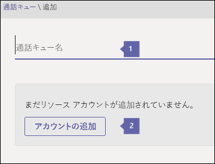
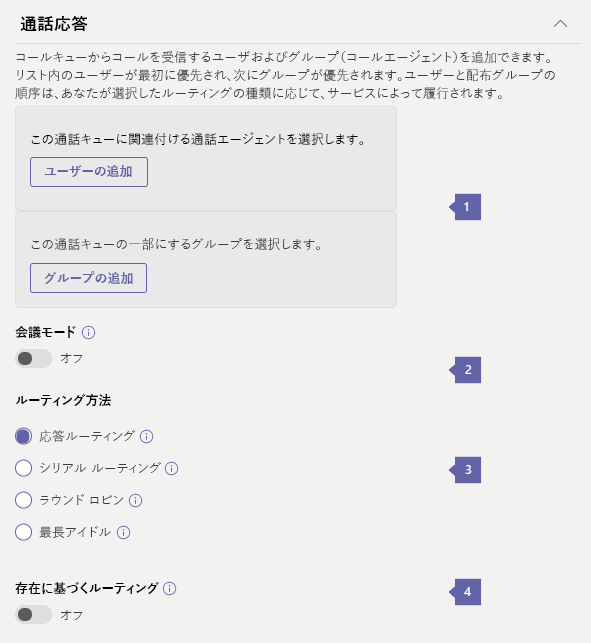
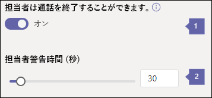
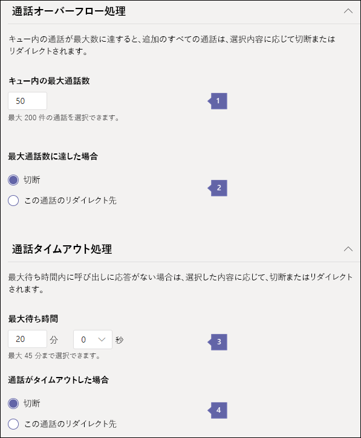

# <a name="create-a-cloud-call-queue"></a><span data-ttu-id="52939-103">クラウドの通話キューを作成する</span><span class="sxs-lookup"><span data-stu-id="52939-103">Create a Cloud call queue</span></span>

<span data-ttu-id="52939-104">クラウド通話キューでは次の情報を提供できます。</span><span class="sxs-lookup"><span data-stu-id="52939-104">Cloud call queues can provide:</span></span>

- <span data-ttu-id="52939-105">あいさつメッセージ。</span><span class="sxs-lookup"><span data-stu-id="52939-105">A greeting message.</span></span>
- <span data-ttu-id="52939-106">通話の保留中に再生される保留音。</span><span class="sxs-lookup"><span data-stu-id="52939-106">Music while people are waiting on hold.</span></span>
- <span data-ttu-id="52939-107">メール対応配布リストとセキュリティ グループを使用した、コール エージェントへの通話のリダイレクト。</span><span class="sxs-lookup"><span data-stu-id="52939-107">Redirecting calls to call agents in mail-enabled distribution lists and security groups.</span></span>
- <span data-ttu-id="52939-108">キューの最大サイズ、タイムアウト、通話処理オプションなどのさまざまなパラメーターを設定します。</span><span class="sxs-lookup"><span data-stu-id="52939-108">Setting different parameters such as queue maximum size, timeout, and call handling options.</span></span>
- <span data-ttu-id="52939-109">発信者が組織のメッセージを残すための共有ボイスメール。</span><span class="sxs-lookup"><span data-stu-id="52939-109">Shared voicemail for callers to leave a message for an organization.</span></span>

<span data-ttu-id="52939-110">電話番号を通話キューに直接関連付けないでください。電話番号は[リソースアカウント](manage-resource-accounts.md)に関連付けられています。</span><span class="sxs-lookup"><span data-stu-id="52939-110">You don't directly associate a phone number to a call queue, instead the phone number is associated to a [resource account](manage-resource-accounts.md).</span></span> <span data-ttu-id="52939-111">通話キューには、自動応答の選択によって直接ダイヤルするか、アクセスすることができます。</span><span class="sxs-lookup"><span data-stu-id="52939-111">A call queue can be dialed directly or accessed by a selection on an auto attendant.</span></span>

<span data-ttu-id="52939-112">発信者は、保留中の音楽を聞くことができます。通話は、*先入れ先出し*(FIFO) の順序で通話エージェントに接続します。</span><span class="sxs-lookup"><span data-stu-id="52939-112">The caller hears music while they are on hold, and the call connects to the call agents in *First In, First Out* (FIFO) order.</span></span>

<span data-ttu-id="52939-113">キュー内のすべての通話は、次のいずれかの方法でエージェントに送信されます。</span><span class="sxs-lookup"><span data-stu-id="52939-113">All calls in the queue are sent to agents by one of the following methods:</span></span>

- <span data-ttu-id="52939-114">アテンダントルーティングを使用すると、キューの最初の呼び出しですべてのエージェントが同時に呼び出されます。</span><span class="sxs-lookup"><span data-stu-id="52939-114">With attendant routing, the first call in the queue rings all agents at the same time.</span></span>
- <span data-ttu-id="52939-115">シリアルルーティングでは、キューにある最初の呼び出しによって、すべてのコールエージェントが1つずつリングされます。</span><span class="sxs-lookup"><span data-stu-id="52939-115">With serial routing, the first call in the queue rings all call agents one by one.</span></span>
- <span data-ttu-id="52939-116">アイドル状態のルーティングが最長でアイドル状態になると、アイドル状態になった通話エージェントは、次に使用可能な通話を受け取ります。</span><span class="sxs-lookup"><span data-stu-id="52939-116">With longest idle routing, the call agent whose has been idle the longest time receives the next available call.</span></span> <span data-ttu-id="52939-117">アイドル時間は、通話のときに、通話エージェントのプレゼンス状態が [**利用可能**] または [**退席**中] (10 分未満) に設定されている時間の長さとして定義されます。</span><span class="sxs-lookup"><span data-stu-id="52939-117">The idle time is defined as the length of time a call agent's presence state is set to **Available** or **Away** (if less than 10 minutes), at the time of the call.</span></span> <span data-ttu-id="52939-118">通話エージェントのプレゼンスが10分以上**退席**中の場合は、アイドルタイマーがリセットされます。</span><span class="sxs-lookup"><span data-stu-id="52939-118">If a call agent's presence is **Away** for more than 10 minutes, the idle timer resets.</span></span>
- <span data-ttu-id="52939-119">ラウンドロビンでは、着信のルーティングが分散され、各通話エージェントがキューから同じ数の通話を取得できるようになります。</span><span class="sxs-lookup"><span data-stu-id="52939-119">With round robin, routing of incoming calls is balanced so that each call agent gets the same number of calls from the queue.</span></span>

<span data-ttu-id="52939-120">上のいずれかの方法を使用して、エージェントのオプトイン/オプトアウト、プレゼンスベースのルーティング、通話待ち時間、通話タイムアウトオプションなどの通話処理オプションを設定できます。</span><span class="sxs-lookup"><span data-stu-id="52939-120">You can set call handling options, such as agent opt-in/opt-out, presence-based routing, call wait time, and call time-out options with any of the above methods.</span></span>

<span data-ttu-id="52939-121">一度に1つの着信通知 (キューの先頭にある通話用) のみが通話エージェントに送信されます。</span><span class="sxs-lookup"><span data-stu-id="52939-121">Only one incoming call notification (for the call at the head of the queue) at a time goes to the call agents.</span></span> <span data-ttu-id="52939-122">コール エージェントが通話を受けると、キューにある次の着信がコール エージェントを呼び出します。</span><span class="sxs-lookup"><span data-stu-id="52939-122">After a call agent accepts the call, the next incoming call in the queue will start ringing call agents.</span></span>

> [!NOTE]
> <span data-ttu-id="52939-123">この記事は、Microsoft Teams と Skype for Business Online の両方に適用されます。</span><span class="sxs-lookup"><span data-stu-id="52939-123">This article applies to both Microsoft Teams and Skype for Business Online.</span></span>

## <a name="step-1--get-started"></a><span data-ttu-id="52939-124">手順 1-はじめに</span><span class="sxs-lookup"><span data-stu-id="52939-124">Step 1 — Get started</span></span>

<span data-ttu-id="52939-125">通話キューを使用する場合は、次の重要な点について留意してください。</span><span class="sxs-lookup"><span data-stu-id="52939-125">To get started using call queues, it's important to remember a few things:</span></span>

- <span data-ttu-id="52939-126">通話キューには、関連するリソースアカウントが必要です。</span><span class="sxs-lookup"><span data-stu-id="52939-126">A call queue is required to have an associated resource account.</span></span> <span data-ttu-id="52939-127">リソースアカウントの詳細については、「[チームのリソースアカウントを管理](manage-resource-accounts.md)する」を参照してください。</span><span class="sxs-lookup"><span data-stu-id="52939-127">See [Manage resource accounts in Teams](manage-resource-accounts.md) for details on resource accounts.</span></span>
- <span data-ttu-id="52939-128">リソースアカウントに電話番号を割り当てると、無料電話システムの[仮想ユーザーライセンス](teams-add-on-licensing/virtual-user.md)を使用できるようになります。</span><span class="sxs-lookup"><span data-stu-id="52939-128">When you assign a phone number to a resource account, you can now use the cost-free Phone System [Virtual User license](teams-add-on-licensing/virtual-user.md).</span></span> <span data-ttu-id="52939-129">電話システムでは、低コストの自動応答と通話キューサービスを使用するために、組織レベルで電話番号を使うことができます。</span><span class="sxs-lookup"><span data-stu-id="52939-129">Phone System allows phone numbers at the organizational level for use with low-cost auto attendant and call queue services.</span></span>

  > [!NOTE]
  > <span data-ttu-id="52939-130">通話キューの直接ルーティングサービス番号は、Microsoft Teams ユーザーとエージェントに対してのみサポートされています。</span><span class="sxs-lookup"><span data-stu-id="52939-130">Direct Routing service numbers for call queues are supported for Microsoft Teams users and agents only.</span></span>

> [!NOTE]
> <span data-ttu-id="52939-131">インターネットに接続している組織内のユーザーに通話をリダイレクトするには、**電話システム**のライセンスが必要です。また、エンタープライズボイスに対して有効になっているか、Microsoft 365 または Office 365 の通話プランを使用している必要があります。</span><span class="sxs-lookup"><span data-stu-id="52939-131">To redirect calls to people in your organization who are Online, they must have a **Phone System** license and be enabled for Enterprise Voice or have Microsoft 365 or Office 365 Calling Plans.</span></span> <span data-ttu-id="52939-132">「 [Microsoft Teams のアドオンライセンスを割り当てる](teams-add-on-licensing/assign-teams-add-on-licenses.md)」を参照してください。</span><span class="sxs-lookup"><span data-stu-id="52939-132">See [Assign Microsoft Teams add-on licenses](teams-add-on-licensing/assign-teams-add-on-licenses.md).</span></span> <span data-ttu-id="52939-133">エンタープライズ VoIP を有効にするには、Windows PowerShell を使用できます。</span><span class="sxs-lookup"><span data-stu-id="52939-133">To enable them for Enterprise Voice, you can use Windows PowerShell.</span></span> <span data-ttu-id="52939-134">たとえば、次を実行します。`Set-CsUser -identity "Amos Marble" -EnterpriseVoiceEnabled $true`</span><span class="sxs-lookup"><span data-stu-id="52939-134">For example, run: `Set-CsUser -identity "Amos Marble" -EnterpriseVoiceEnabled $true`</span></span>

- <span data-ttu-id="52939-135">通話プランの詳細については、「[電話システムと通話プラン](calling-plan-landing-page.md)」および「 [Microsoft 365 または Office 365 の通話](calling-plans-for-office-365.md)プラン」を参照してください。</span><span class="sxs-lookup"><span data-stu-id="52939-135">To learn more about Calling Plans, see [Phone System and Calling Plans](calling-plan-landing-page.md) and [Calling Plans for Microsoft 365 or Office 365](calling-plans-for-office-365.md).</span></span>

- <span data-ttu-id="52939-136">クラウド通話キューを割り当てることができるのは、 **Microsoft Teams 管理センター**で取得した、または別のサービスプロバイダーから転送された有料またはフリーダイヤルのサービス電話番号だけです。</span><span class="sxs-lookup"><span data-stu-id="52939-136">You can only assign Cloud call queues toll and toll-free service phone numbers that you got in the **Microsoft Teams admin center** or transferred from another service provider.</span></span> <span data-ttu-id="52939-137">無料サービス番号には、通信クレジットが必要です。</span><span class="sxs-lookup"><span data-stu-id="52939-137">Communications Credits are required for toll-free service numbers.</span></span>

    > [!NOTE]
    > <span data-ttu-id="52939-138">ユーザー (購読者) の電話番号を通話キューに割り当てることはできません。サービスの有料電話番号または無料電話番号のみを使用できます。</span><span class="sxs-lookup"><span data-stu-id="52939-138">User (subscriber) phone numbers can't be assigned to call queues - only service toll or toll-free phone numbers can be used.</span></span>

- <span data-ttu-id="52939-139">クラウドの通話キューに関連付けられた通話エージェントは、次のクライアントでサポートされます。</span><span class="sxs-lookup"><span data-stu-id="52939-139">The following clients are supported for call agents associated to a Cloud call queue:</span></span>

  - <span data-ttu-id="52939-140">Skype for Business デスクトップクライアント 2016 (32 ビットバージョンと64ビットバージョン)</span><span class="sxs-lookup"><span data-stu-id="52939-140">Skype for Business desktop client 2016 (32-bit and 64-bit versions)</span></span>
  - <span data-ttu-id="52939-141">Lync デスクトップクライアント 2013 (32 ビットバージョンと64ビットバージョン)</span><span class="sxs-lookup"><span data-stu-id="52939-141">Lync desktop client 2013 (32-bit and 64-bit versions)</span></span>
  - <span data-ttu-id="52939-142">Microsoft Teams でサポートされているすべての IP 電話モデル。</span><span class="sxs-lookup"><span data-stu-id="52939-142">All IP phone models supported for Microsoft Teams.</span></span> <span data-ttu-id="52939-143">「 [Skype For Business Online の電話を取得する」を](/skypeforbusiness/what-is-phone-system-in-office-365/getting-phones-for-skype-for-business-online/getting-phones-for-skype-for-business-online)参照してください。</span><span class="sxs-lookup"><span data-stu-id="52939-143">See [Getting phones for Skype for Business Online](/skypeforbusiness/what-is-phone-system-in-office-365/getting-phones-for-skype-for-business-online/getting-phones-for-skype-for-business-online).</span></span>
  - <span data-ttu-id="52939-144">Mac版  Skype for Business クライアント (バージョン 16.8.196 以降)</span><span class="sxs-lookup"><span data-stu-id="52939-144">Mac Skype for Business Client (version 16.8.196 and later)</span></span>
  - <span data-ttu-id="52939-145">Aandroid Skype for Business クライアント (バージョン 6.16.0.9 以降)</span><span class="sxs-lookup"><span data-stu-id="52939-145">Android Skype for Business Client (version 6.16.0.9 and later)</span></span>
  - <span data-ttu-id="52939-146">iPhone Skype for Business Client クライアント(バージョン 6.16.0 以降)</span><span class="sxs-lookup"><span data-stu-id="52939-146">iPhone Skype for Business Client (version 6.16.0 and later)</span></span>
  - <span data-ttu-id="52939-147">Mac版  Skype for Business クライアント (バージョン 6.16.0 以降)</span><span class="sxs-lookup"><span data-stu-id="52939-147">iPad Skype for Business Client (version 6.16.0 and later)</span></span>
  - <span data-ttu-id="52939-148">Microsoft Teams Windows クライアント (32 ビット版と64ビット版)</span><span class="sxs-lookup"><span data-stu-id="52939-148">Microsoft Teams Windows client (32-bit and 64-bit versions)</span></span>
  - <span data-ttu-id="52939-149">Microsoft Teams Mac クライアント</span><span class="sxs-lookup"><span data-stu-id="52939-149">Microsoft Teams Mac client</span></span>
  - <span data-ttu-id="52939-150">Microsoft Teams iPhone アプリ</span><span class="sxs-lookup"><span data-stu-id="52939-150">Microsoft Teams iPhone app</span></span>
  - <span data-ttu-id="52939-151">Microsoft Teams Android アプリ</span><span class="sxs-lookup"><span data-stu-id="52939-151">Microsoft Teams Android app</span></span>

    > [!NOTE]
    > <span data-ttu-id="52939-152">直接ルーティング番号が割り当てられている通話キューは、Skype for Business クライアント、Lync クライアント、または Skype for Business の IP 電話をエージェントとしてサポートしません。</span><span class="sxs-lookup"><span data-stu-id="52939-152">Call queues that are assigned a direct routing number don't support Skype for Business clients, Lync clients, or Skype for Business IP Phones as agents.</span></span>

## <a name="step-2--get-or-transfer-toll-or-toll-free-service-phone-numbers"></a><span data-ttu-id="52939-153">手順 2-有料または無料のサービス電話番号を取得または移行する</span><span class="sxs-lookup"><span data-stu-id="52939-153">Step 2 — Get or transfer toll or toll-free service phone numbers</span></span>

<span data-ttu-id="52939-154">通話キューを作成して設定する前に、既存の有料または無料のサービス番号を取得または移行する必要があります。</span><span class="sxs-lookup"><span data-stu-id="52939-154">Before you can create and set up your call queues, you need to get or transfer your existing toll or toll-free service numbers.</span></span> <span data-ttu-id="52939-155">サービス番号を取得するには、「[サービスの電話番号を取得](getting-service-phone-numbers.md)する」または「既存のサービス番号を移行する」を参照してください。「[チームに電話番号を移行](phone-number-calling-plans/transfer-phone-numbers-to-teams.md)する」をご覧ください。</span><span class="sxs-lookup"><span data-stu-id="52939-155">To get your service numbers, see [Getting service phone numbers](getting-service-phone-numbers.md) or if you want to transfer an existing service number, see [Transfer phone numbers to Teams](phone-number-calling-plans/transfer-phone-numbers-to-teams.md).</span></span> <span data-ttu-id="52939-156">有料またはフリーダイヤルのサービス電話番号を取得すると、 **Microsoft Teams 管理センター**の  >  **ボイス**  >  **電話番号**に表示されます。</span><span class="sxs-lookup"><span data-stu-id="52939-156">After you get the toll or toll-free service phone numbers, they will show up in **Microsoft Teams admin center** > **Voice** > **Phone numbers**.</span></span> <span data-ttu-id="52939-157">無料電話番号には、無料の電話**番号**が付い**ています**。</span><span class="sxs-lookup"><span data-stu-id="52939-157">Toll free numbers will be listed with a **Number type** of **Service — Toll-Free**.</span></span>

> [!NOTE]
> <span data-ttu-id="52939-158">米国外の場合は、Microsoft Teams 管理センターを使用してサービス番号を取得することはできません。</span><span class="sxs-lookup"><span data-stu-id="52939-158">If you are outside the United States, you can't use the Microsoft Teams admin center to get service numbers.</span></span> <span data-ttu-id="52939-159">「[組織の電話番号を管理](manage-phone-numbers-for-your-organization/manage-phone-numbers-for-your-organization.md)する」に移動して、米国以外の地域での実行方法を確認します。</span><span class="sxs-lookup"><span data-stu-id="52939-159">Go to [Manage phone numbers for your organization](manage-phone-numbers-for-your-organization/manage-phone-numbers-for-your-organization.md) instead to see how to do it from the outside of the United States.</span></span>

<span data-ttu-id="52939-160">複数の自動応答を設定する場合、通常は、メインの自動応答のリソースアカウントに電話番号を割り当てます。</span><span class="sxs-lookup"><span data-stu-id="52939-160">When you set up multiple auto attendants, you would usually assign a phone number to the main auto attendant's resource account.</span></span> <span data-ttu-id="52939-161">入れ子になった自動応答または通話キューに関連付けられているリソースアカウントには、電話番号は必要ありません。</span><span class="sxs-lookup"><span data-stu-id="52939-161">Resource accounts associated to nested auto attendants or call queues often don't need phone numbers.</span></span> <span data-ttu-id="52939-162">この自動応答では、電話番号がない場合でも、通話キューまたはネストされた自動応答に発信者を誘導することができます。</span><span class="sxs-lookup"><span data-stu-id="52939-162">That auto attendant can direct callers to your call queues or nested auto attendants even if they don't have a phone number.</span></span> <span data-ttu-id="52939-163">このような場合は、ダイヤルパッドオプションを割り当てずに、システムですべての自動応答と通話キューを作成し、後で設定を編集することができます。</span><span class="sxs-lookup"><span data-stu-id="52939-163">In those situations, you can create all auto attendants and call queues in your system without assigning dialpad options, and then edit the settings later.</span></span> <span data-ttu-id="52939-164">メニューオプションとして設定するには、通話キューまたは自動応答が存在している必要があります。</span><span class="sxs-lookup"><span data-stu-id="52939-164">A call queue or auto attendant must exist to set it as a menu option.</span></span>

## <a name="step-3--create-a-call-queue"></a><span data-ttu-id="52939-165">手順3—通話キューを作成する</span><span class="sxs-lookup"><span data-stu-id="52939-165">Step 3 — Create a call queue</span></span>

[!INCLUDE [updating-admin-interfaces](includes/updating-admin-interfaces.md)]

> [!IMPORTANT]
> <span data-ttu-id="52939-166">すべての通話キューには、[リソースアカウント](manage-resource-accounts.md)が関連付けられている必要があります。</span><span class="sxs-lookup"><span data-stu-id="52939-166">Every call queue is required to have an associated [resource account](manage-resource-accounts.md).</span></span> <span data-ttu-id="52939-167">最初にリソースアカウントを作成してから、それを通話キューに関連付けることができます。</span><span class="sxs-lookup"><span data-stu-id="52939-167">You must create the resource account first, then you can associate it to the call queue.</span></span>

### <a name="use-the-microsoft-teams-admin-center"></a><span data-ttu-id="52939-168">Microsoft Teams 管理センターを使用する</span><span class="sxs-lookup"><span data-stu-id="52939-168">Use the Microsoft Teams admin center</span></span>

<span data-ttu-id="52939-169">**Microsoft Teams 管理センター**の [**音声**  >  **通話キュー**] で、[ **+ Add new**] をクリックします。</span><span class="sxs-lookup"><span data-stu-id="52939-169">In the **Microsoft Teams admin center**, **Voice** > **Call queues**, then click **+ Add new**:</span></span>

### <a name="set-the-display-name-and-resource-account"></a><span data-ttu-id="52939-170">表示名とリソースアカウントを設定する</span><span class="sxs-lookup"><span data-stu-id="52939-170">Set the display name and resource account</span></span>



* * *

<span data-ttu-id="52939-172">
 **Name**ます。通話キューのわかりやすい表示名を入力します。</span><span class="sxs-lookup"><span data-stu-id="52939-172">
**Name** Enter a descriptive display name for the call queue.</span></span> <span data-ttu-id="52939-173">この名前は必須であり、スペースなどの最大64文字を含めることができます。</span><span class="sxs-lookup"><span data-stu-id="52939-173">This name is required and can contain up to 64 characters, including spaces.</span></span>

 <span data-ttu-id="52939-174">この名前は、着信通話の通知に表示されます。</span><span class="sxs-lookup"><span data-stu-id="52939-174">This name is displayed in the notification for the incoming call.</span></span>

* * *

<span data-ttu-id="52939-175">
 **アカウントを追加**するリソースアカウントを選択します。</span><span class="sxs-lookup"><span data-stu-id="52939-175">
**Add Accounts** Select a resource account.</span></span> <span data-ttu-id="52939-176">すべての通話キューには、リソースアカウントが必要です。</span><span class="sxs-lookup"><span data-stu-id="52939-176">All call queues are required to have a resource account.</span></span> <span data-ttu-id="52939-177">リソースアカウントには、有料または無料の電話番号が必要です。</span><span class="sxs-lookup"><span data-stu-id="52939-177">Resource accounts aren't required to have a service toll or toll-free phone number.</span></span>

<span data-ttu-id="52939-178">リストが表示されない場合は、前に説明したように、通話キューを作成する前に、サービス番号を取得してリソースアカウントに割り当てます。</span><span class="sxs-lookup"><span data-stu-id="52939-178">If there aren't any listed,  get service numbers and assign them to a Resource account before you create the call queue, as described earlier.</span></span> <span data-ttu-id="52939-179">サービス番号を取得するには、「[サービスの電話番号を取得](getting-service-phone-numbers.md)する」を参照してください。</span><span class="sxs-lookup"><span data-stu-id="52939-179">To get your service numbers, see [Getting service phone numbers](getting-service-phone-numbers.md).</span></span> <span data-ttu-id="52939-180">電話番号の割り当て方法の詳細については、「 [Teams のリソースアカウントを管理](manage-resource-accounts.md)する」を参照してください。</span><span class="sxs-lookup"><span data-stu-id="52939-180">See [Manage resource accounts in Teams](manage-resource-accounts.md) for specifics on how to assign a phone number.</span></span>

> [!NOTE]
> <span data-ttu-id="52939-181">必要に応じて、またはドメインを割り当てる必要がある場合は、その**ドメイン**を通話キューのリソースアカウントに割り当てます。</span><span class="sxs-lookup"><span data-stu-id="52939-181">If you want or need to assign a **Domain** you would  assign it to the resource account for the call queue.</span></span>

### <a name="set-the-greeting-and-music-played-while-on-hold"></a><span data-ttu-id="52939-182">応答メッセージおよび保留中の保留音を設定する</span><span class="sxs-lookup"><span data-stu-id="52939-182">Set the greeting and music played while on hold</span></span>

![[応答メッセージ] と [音楽] オプションのスクリーンショット。番号付き吹き出し](media/1d395a93-7cab-4178-9295-12d5379e20de.png)

* * *

<span data-ttu-id="52939-184">
 います通話キューの番号を呼び出すユーザーに対して、オプションの応答**メッセージを**表示します。</span><span class="sxs-lookup"><span data-stu-id="52939-184">
**Greeting** the optional greeting played for people who call the call queue number.</span></span>

<span data-ttu-id="52939-185">オーディオファイル (.wav、.mp3、または .wma 形式) をアップロードできます。</span><span class="sxs-lookup"><span data-stu-id="52939-185">You can upload an audio file (.wav, .mp3, or .wma formats).</span></span>

<span data-ttu-id="52939-186">
 **Music on hold**する通話キューで提供される既定の音楽を保留にすることができます。</span><span class="sxs-lookup"><span data-stu-id="52939-186">
**Music on hold** You can use the default Music on Hold provided with the call queue.</span></span> <span data-ttu-id="52939-187">.Wav、mp3、または .wma 形式のオーディオファイルをアップロードして、カスタム音楽として保留にすることもできます。</span><span class="sxs-lookup"><span data-stu-id="52939-187">You can also upload an audio file in .wav, mp3, or .wma formats to use as your custom Music on hold.</span></span>

* * *

### <a name="select-the-call-answering-options"></a><span data-ttu-id="52939-188">通話応答のオプションを選択する</span><span class="sxs-lookup"><span data-stu-id="52939-188">Select the call answering options</span></span>



<span data-ttu-id="52939-190">
 **コールエージェントとグループ**の吹き出しを参照して、個々のエージェントをグループに追加してから、[**ユーザーの追加**] をクリックします。</span><span class="sxs-lookup"><span data-stu-id="52939-190">
**Call agents and groups** To add individual agents directly, without adding them to a group, click **Add users**.</span></span> <span data-ttu-id="52939-191">通話を受ける順序に個々のエージェントを追加します。</span><span class="sxs-lookup"><span data-stu-id="52939-191">Put individual agents in the order in which you want them to receive the call.</span></span> <span data-ttu-id="52939-192">最大20の個別のエージェントを追加できます (20 を超える場合は、1つのグループにまとめることができます)。</span><span class="sxs-lookup"><span data-stu-id="52939-192">You can add up to 20 individual agents (to add more than 20, put them in a group).</span></span>

<span data-ttu-id="52939-193">通話は最初に個々のエージェントにルーティングされ、その後、グループ内のエージェントに送信されます。</span><span class="sxs-lookup"><span data-stu-id="52939-193">Calls are routed first to individual agents, then to the agents in groups.</span></span> 

<span data-ttu-id="52939-194">以下のメーリングリストまたはグループのいずれかに属する、最大200の通話エージェントを選択できます。</span><span class="sxs-lookup"><span data-stu-id="52939-194">You can select up to 200 call agents who belong to any of the following mailing lists or groups:</span></span>

- <span data-ttu-id="52939-195">Microsoft 365 グループ</span><span class="sxs-lookup"><span data-stu-id="52939-195">Microsoft 365 group</span></span>
- <span data-ttu-id="52939-196">セキュリティグループ</span><span class="sxs-lookup"><span data-stu-id="52939-196">Security group</span></span>
- <span data-ttu-id="52939-197">配布リスト</span><span class="sxs-lookup"><span data-stu-id="52939-197">Distribution list</span></span>

<span data-ttu-id="52939-198">選択されているコールエージェントは、次のいずれかである必要があります。</span><span class="sxs-lookup"><span data-stu-id="52939-198">Call agents selected must be one of the following:</span></span> 

- <span data-ttu-id="52939-199">電話システムのライセンスを持つオンラインユーザーとエンタープライズ Voip が有効になっている</span><span class="sxs-lookup"><span data-stu-id="52939-199">Online users with a Phone System license and Enterprise Voice enabled</span></span>
- <span data-ttu-id="52939-200">通話プランを使用するオンラインユーザー</span><span class="sxs-lookup"><span data-stu-id="52939-200">Online users with a Calling Plan</span></span>
- <span data-ttu-id="52939-201">オンプレミスの Skype for Business Server ユーザー</span><span class="sxs-lookup"><span data-stu-id="52939-201">On-premises Skype for Business Server users</span></span>

  > [!NOTE]
  > <span data-ttu-id="52939-202">これは、オンラインの組織内のユーザーに通話をリダイレクトする場合にも該当します。</span><span class="sxs-lookup"><span data-stu-id="52939-202">This also applies if you want to redirect calls to people in your organization who are online.</span></span> <span data-ttu-id="52939-203">これらの個人は、**電話システム**のライセンスとエンタープライズボイスを有効にしている*か*、通話プランを利用している必要があります。</span><span class="sxs-lookup"><span data-stu-id="52939-203">These individuals must have a **Phone System** license and Enterprise Voice enabled *or* have a Calling Plan.</span></span> <span data-ttu-id="52939-204">詳細については、「 [Skype For business ライセンスの割り当て](https://docs.microsoft.com/skypeforbusiness/skype-for-business-and-microsoft-teams-add-on-licensing/assign-skype-for-business-and-microsoft-teams-licenses)、 [Microsoft Teams ライセンスの割り当て](https://docs.microsoft.com/microsoftteams/teams-add-on-licensing/assign-teams-add-on-licenses)、または[適切な通話プラン](https://docs.microsoft.com/microsoftteams/calling-plan-landing-page)」を参照してください。</span><span class="sxs-lookup"><span data-stu-id="52939-204">For more information, see [Assign Skype for Business licenses](https://docs.microsoft.com/skypeforbusiness/skype-for-business-and-microsoft-teams-add-on-licensing/assign-skype-for-business-and-microsoft-teams-licenses), [Assign Microsoft Teams licenses](https://docs.microsoft.com/microsoftteams/teams-add-on-licensing/assign-teams-add-on-licenses), or [Which Calling Plan is right for you?](https://docs.microsoft.com/microsoftteams/calling-plan-landing-page)</span></span>

   <span data-ttu-id="52939-205">エンタープライズ Voip のエージェントを有効にするには、Windows PowerShell を使用します。</span><span class="sxs-lookup"><span data-stu-id="52939-205">To enable an agent for Enterprise Voice, you can use Windows PowerShell.</span></span> <span data-ttu-id="52939-206">たとえば、次を実行します。`Set-CsUser -identity "Amos Marble" -EnterpriseVoiceEnabled $true`</span><span class="sxs-lookup"><span data-stu-id="52939-206">For example, run: `Set-CsUser -identity "Amos Marble" -EnterpriseVoiceEnabled $true`</span></span>

- <span data-ttu-id="52939-207">**電話システム**のライセンスを持っているか、Microsoft 365 グループ、メールが有効な配布リスト、またはセキュリティグループに追加された通話プランを持っているユーザー。</span><span class="sxs-lookup"><span data-stu-id="52939-207">Users with a **Phone System** license or a Calling Plan that are added to a Microsoft 365 Group, a mail-enabled Distribution List, or a Security Group.</span></span> <span data-ttu-id="52939-208">配布リストまたはセキュリティグループのエージェントを呼び出しキューエージェントとして追加する場合、最初の呼び出しが到着するまでに最大3時間かかることがあります。</span><span class="sxs-lookup"><span data-stu-id="52939-208">When you add an agent in a distribution list or a security group as a call queue agent, it can take up to three hours for the first call to arrive.</span></span> <span data-ttu-id="52939-209">新しく作成した分配リストまたはセキュリティ グループでは、通話キューで使用可能になるまで最大で48時間を要する場合があります。</span><span class="sxs-lookup"><span data-stu-id="52939-209">A newly created distribution list or security group might take up to 48 hours to become available to be used with call queues.</span></span> <span data-ttu-id="52939-210">新しく作成された Microsoft 365 グループは、ほぼ瞬時に利用できます。</span><span class="sxs-lookup"><span data-stu-id="52939-210">Newly created Microsoft 365 Groups are available almost immediately.</span></span>

- <span data-ttu-id="52939-211">使用しているエージェントで、Microsoft Teams アプリを呼び出しキューとして使用している場合は、そのモードである必要があります。</span><span class="sxs-lookup"><span data-stu-id="52939-211">If your agents are using the Microsoft Teams app for call queue calls, they need to be in TeamsOnly mode.</span></span>

<span data-ttu-id="52939-212">
 ます。**会議モード**の会議モードでは、エージェントが通話を受け入れた後に、発信者がエージェントに接続するのにかかる時間が大幅に短縮されます。</span><span class="sxs-lookup"><span data-stu-id="52939-212">
**Conference mode** Conference mode significantly reduces the amount of time it takes for a caller to be connected to an agent, after the agent accepts the call.</span></span> <span data-ttu-id="52939-213">複数の通話キューがある場合は、一部またはすべての通話キューで会議モードを有効にすることができます。1つの通話キューで会議モードを有効または無効にしても、他の通話キューに影響はありません。</span><span class="sxs-lookup"><span data-stu-id="52939-213">If you have more than one call queue, you can enable conference mode on some or all of your call queues; enabling or disabling conference mode on one call queue doesn't impact any other call queues.</span></span>

<span data-ttu-id="52939-214">会議モードは既定で無効になっていますが、次の要件が満たされている場合はいつでも有効にすることができます。</span><span class="sxs-lookup"><span data-stu-id="52939-214">Conference mode is disabled by default but can be enabled at any time if the following requirements are met:</span></span>

- <span data-ttu-id="52939-215">通話キューに追加されたエージェントは、次のいずれかのクライアントを使用する必要があります。</span><span class="sxs-lookup"><span data-stu-id="52939-215">Agents added to the call queue need to use one of the following clients:</span></span>
  - <span data-ttu-id="52939-216">最新バージョンの Microsoft Teams デスクトップクライアント、Android アプリ、または iOS アプリ</span><span class="sxs-lookup"><span data-stu-id="52939-216">The latest version of the Microsoft Teams desktop client, Android app, or iOS app</span></span>
  - <span data-ttu-id="52939-217">Microsoft Teams phone バージョン 1449/1.0.94.2020051601 以降</span><span class="sxs-lookup"><span data-stu-id="52939-217">Microsoft Teams phone version 1449/1.0.94.2020051601 or later</span></span>
- <span data-ttu-id="52939-218">エージェントの Teams アカウントをチーム専用モードに設定する必要がある</span><span class="sxs-lookup"><span data-stu-id="52939-218">Agents' Teams accounts need to be set to Teams-only mode</span></span>

> [!IMPORTANT]
> <span data-ttu-id="52939-219">上記のエージェント要件が満たされておらず、通話キューで会議モードが有効になっている場合、要件を満たしていないエージェントは通話ルーティングリストに含まれません。</span><span class="sxs-lookup"><span data-stu-id="52939-219">If the agent requirements above aren't met and conference mode is enabled on a call queue, agents who don't meet the requirements aren't included in the call routing list.</span></span> <span data-ttu-id="52939-220">通話ルーティングリストに含まれていないエージェントは、通話を受信できません。</span><span class="sxs-lookup"><span data-stu-id="52939-220">Agents who aren't in the call routing list won't receive calls.</span></span> <span data-ttu-id="52939-221">上記のエージェント要件を満たしていないエージェントがある場合は、通話キューで会議モードを有効にしないようにします。</span><span class="sxs-lookup"><span data-stu-id="52939-221">If you have agents who don't meet the agent requirements above, don't enable conference mode on the call queue.</span></span>

<span data-ttu-id="52939-222">通話キューで電話会議モードが有効になると、次のいずれかの方法で通話を受信すると、接続時間が短縮されます。</span><span class="sxs-lookup"><span data-stu-id="52939-222">After conference mode is enabled on a call queue, calls will benefit from the faster connection time if they're received via one of the following methods:</span></span>

- <span data-ttu-id="52939-223">他の Microsoft Teams デスクトップクライアントからの VoIP 通話</span><span class="sxs-lookup"><span data-stu-id="52939-223">VoIP calls from another Microsoft Teams desktop client</span></span>
- <span data-ttu-id="52939-224">通話プラン PSTN 通話</span><span class="sxs-lookup"><span data-stu-id="52939-224">Calling Plan PSTN calls</span></span>
- <span data-ttu-id="52939-225">PSTN 通話のダイレクトルーティング</span><span class="sxs-lookup"><span data-stu-id="52939-225">Direct Routing PSTN calls</span></span>

<span data-ttu-id="52939-226">通話の大半は、上記のいずれかの方法で受信します。</span><span class="sxs-lookup"><span data-stu-id="52939-226">The majority of calls are received via one of the methods listed above.</span></span> <span data-ttu-id="52939-227">別の方法 (Skype for Business クライアントからの VoIP 通話など) 経由で通話を受信した場合でも、通話は通話キューに追加されますが、接続時間が短縮されることはありません。</span><span class="sxs-lookup"><span data-stu-id="52939-227">If a call is received via another method (such as a VoIP call from a Skype for Business client), the call will still be added to the call queue, however, it won't benefit from the faster connection time.</span></span>

<span data-ttu-id="52939-228">
 **Routing method**ています。これは、配布方法として、**アテンダント**、**シリアル**、**アイドル**、または**ラウンドロビン**のいずれかを選ぶことができます。</span><span class="sxs-lookup"><span data-stu-id="52939-228">
**Routing method** You can choose either **Attendant**, **Serial**, **Longest idle**, or **Round Robin** as the distribution method.</span></span> <span data-ttu-id="52939-229">すべての新規および既存の通話キューには、既定で [アテンダントルーティング] が選択されています。</span><span class="sxs-lookup"><span data-stu-id="52939-229">All new and existing call queues have attendant routing selected by default.</span></span> <span data-ttu-id="52939-230">アテンダントルーティングを使うと、キューの最初の呼び出しによって、すべてのコールエージェントが同時に呼び出されます。</span><span class="sxs-lookup"><span data-stu-id="52939-230">When attendant routing is used, the first call in the queue rings all call agents at the same time.</span></span> <span data-ttu-id="52939-231">通話を受ける最初のコールエージェントは、通話を受け取ります。</span><span class="sxs-lookup"><span data-stu-id="52939-231">The first call agent to pick up the call gets the call.</span></span>

- <span data-ttu-id="52939-232">**アテンダントルーティング**を行うと、キュー内の最初の呼び出しがすべてのコールエージェントを同時に呼び出します。</span><span class="sxs-lookup"><span data-stu-id="52939-232">**Attendant routing** causes the first call in the queue to ring all call agents at the same time.</span></span> <span data-ttu-id="52939-233">通話を受ける最初のコールエージェントは、通話を受け取ります。</span><span class="sxs-lookup"><span data-stu-id="52939-233">The first call agent to pick up the call gets the call.</span></span>
- <span data-ttu-id="52939-234">**シリアルルーティング**着信エージェントリストの先頭から、すべての通話エージェントを1つずつ呼び出します。</span><span class="sxs-lookup"><span data-stu-id="52939-234">**Serial routing** incoming calls ring all call agents one by one, from the beginning of the call agent list.</span></span> <span data-ttu-id="52939-235">通話エージェントの一覧内では、エージェントを注文することはできません。</span><span class="sxs-lookup"><span data-stu-id="52939-235">Agents can't be ordered within the call agent list.</span></span> <span data-ttu-id="52939-236">エージェントが終了した場合、または通話を受信しなかった場合、通話は次のエージェントを呼び出し、それが処理されるかタイムアウトするまで、すべてのエージェントを試します。</span><span class="sxs-lookup"><span data-stu-id="52939-236">If an agent dismisses or does not pick up a call, the call will ring the next agent and will try all agents until it is picked up or times out.</span></span>
- <span data-ttu-id="52939-237">[**最長アイドル**] は、アイドル状態になっている通話エージェントへの次の使用可能な通話をルーティングします。</span><span class="sxs-lookup"><span data-stu-id="52939-237">**Longest idle** routes the next available call to the call agent whose has been idle the longest time.</span></span> <span data-ttu-id="52939-238">アイドル時間は、通話のときに、通話エージェントのプレゼンス状態が [**利用可能**] または [**退席**中] (10 分未満) に設定されている時間の長さとして定義されます。</span><span class="sxs-lookup"><span data-stu-id="52939-238">The idle time is defined as the length of time a call agent's presence state is set to **Available** or **Away** (if less than 10 minutes), at the time of the call.</span></span> <span data-ttu-id="52939-239">10分以上経過すると、通話エージェントのプレゼンスが [**退席**中] に設定されていると、アイドルタイマーがリセットされます。</span><span class="sxs-lookup"><span data-stu-id="52939-239">If a call agent's presence is set to **Away** for more than 10 minutes, the idle timer resets.</span></span> <span data-ttu-id="52939-240">ユーザーのプレゼンス状態は、1分ごとに照会されます。</span><span class="sxs-lookup"><span data-stu-id="52939-240">Presence states of users are queried every minute.</span></span>

    <span data-ttu-id="52939-241">この設定を有効にすると、**プレゼンスベースのルーティング**も有効になることを知っておくことが重要です。</span><span class="sxs-lookup"><span data-stu-id="52939-241">It's important to know that enabling this setting forces **Presence-based routing** to also be enabled.</span></span>

    > [!IMPORTANT]
    > <span data-ttu-id="52939-242">Skype for Business クライアントを使用するエージェントは、最長アイドル設定が有効になっていると、通話を受信できません。</span><span class="sxs-lookup"><span data-stu-id="52939-242">Agents who use the Skype for Business client won't receive calls when the longest idle setting is enabled.</span></span> <span data-ttu-id="52939-243">担当者が Skype または Business を使用している場合は、この設定を有効にしないでください。</span><span class="sxs-lookup"><span data-stu-id="52939-243">If you have agents who use Skype or Business, don't enable this setting.</span></span>
- <span data-ttu-id="52939-244">**ラウンドロビン**は、着信呼び出しのルーティングを分散し、各呼び出しエージェントがキューから同じ数の通話を取得できるようにします。</span><span class="sxs-lookup"><span data-stu-id="52939-244">**Round robin** balances routing of incoming calls so that each call agent gets the same number of calls from the queue.</span></span> <span data-ttu-id="52939-245">これは、すべての通話エージェントで同一の営業案件を確保するために、着信の販売環境で望ましい場合があります。</span><span class="sxs-lookup"><span data-stu-id="52939-245">This may be desirable in an inbound sales environment to assure equal opportunity among all the call agents.</span></span>

<span data-ttu-id="52939-246">
 **Presence-based routing**選択したルーティングメソッドの呼び出しルーティングリストにエージェントを含める必要があるかどうかを特定します。</span><span class="sxs-lookup"><span data-stu-id="52939-246">
**Presence-based routing** Presence-based routing uses the availability status of call agents to determine whether an agent should be included in the call routing list for the selected routing method.</span></span> <span data-ttu-id="52939-247">連絡可能状態が [**利用可能**] に設定されている通話エージェントは、通話ルーティングリストに含まれており、着信を受け取ることができます。</span><span class="sxs-lookup"><span data-stu-id="52939-247">Call agents whose availability status is set to **Available** are included in the call routing list and can receive calls.</span></span> <span data-ttu-id="52939-248">可用性の状態が「その他」の状態に設定されているエージェントは、通話ルーティングリストから除外され、その状態が [連絡**可能**] に戻るまでは通話を受信しません。</span><span class="sxs-lookup"><span data-stu-id="52939-248">Agents whose availability status is set to any other status are excluded from the call routing list and won't receive calls until their availability status changes back to **Available**.</span></span>  

<span data-ttu-id="52939-249">任意のルーティング方法を使って、プレゼンスベースの通話ルーティングを有効にすることができます。</span><span class="sxs-lookup"><span data-stu-id="52939-249">You can enable presence-based call routing with any of the routing methods.</span></span>

<span data-ttu-id="52939-250">エージェントによって通話が発信されない場合、その状態がどのように設定されているかにかかわらず、通話ルーティングリストに含まれません。</span><span class="sxs-lookup"><span data-stu-id="52939-250">If an agent opts out of getting calls, they won't be included in the call routing list regardless of what their availability status is set to.</span></span> 

> [!IMPORTANT]
> <span data-ttu-id="52939-251">Skype for Business クライアントを使用するエージェントは、可用性の状態に関係なく、プレゼンスベースのルーティングが有効になっている場合、通話ルーティングリストに含まれません。</span><span class="sxs-lookup"><span data-stu-id="52939-251">Agents who use the Skype for Business client aren't included in the call routing list when presence-based routing is enabled, regardless of their availability status.</span></span> <span data-ttu-id="52939-252">通話ルーティングリストに含まれていないエージェントは、通話を受信できません。</span><span class="sxs-lookup"><span data-stu-id="52939-252">Agents who aren't in the call routing list won't receive calls.</span></span> <span data-ttu-id="52939-253">Skype for Business を使用するエージェントがある場合は、プレゼンスベースの通話ルーティングを有効にしないでください。</span><span class="sxs-lookup"><span data-stu-id="52939-253">If you have agents who use Skype for Business, don't enable presence-based call routing.</span></span>

### <a name="select-an-agent-opt-out-option"></a><span data-ttu-id="52939-254">エージェントのオプトアウトオプションを選択する</span><span class="sxs-lookup"><span data-stu-id="52939-254">Select an agent opt-out option</span></span>



* * *

<span data-ttu-id="52939-256">
 **Agent can opt out of getting calls**ます。</span><span class="sxs-lookup"><span data-stu-id="52939-256">
**Agent can opt out of getting calls** You can choose to allow call queue agents to opt-out of taking calls from a particular queue by enabling this option.</span></span>

<span data-ttu-id="52939-257">このオプションを有効にすると、このキュー内のすべてのエージェントは、この通話キューからの着信の受信を開始または停止することができます。</span><span class="sxs-lookup"><span data-stu-id="52939-257">Enabling this option allows all agents in this queue to start or stop receiving calls from this call queue at will.</span></span> <span data-ttu-id="52939-258">チェックボックスの削除することによっていつでもオプトアウトの取消しが可能で、オプトアウトされたエージェントはこの通話キューへ自動的にもう一度オプトインされます。 (すべてのエージェントの初期設定)</span><span class="sxs-lookup"><span data-stu-id="52939-258">You can revoke the agent opt-out privilege at any time by clearing the check box, causing agents to become automatically opted in for this queue again (the default setting for all agents).</span></span>

<span data-ttu-id="52939-259">脱退オプションにアクセスするには、次の操作を行います。</span><span class="sxs-lookup"><span data-stu-id="52939-259">To access the opt-out option, agents can:</span></span>

 1. <span data-ttu-id="52939-260">Skype for Business クライアントデスクトップで、 **オプション** を開きます。</span><span class="sxs-lookup"><span data-stu-id="52939-260">Open **Options** in their desktop Skype for Business client.</span></span>
 2. <span data-ttu-id="52939-261">**[通話転送]** タブで、 **[オンライン編集の設定]** リンクをクリックします。</span><span class="sxs-lookup"><span data-stu-id="52939-261">On the **Call Forwarding** tab, click the **Edit settings online** link.</span></span>
 3. <span data-ttu-id="52939-262">[ユーザー設定] ページで、[**通話キュー**] をクリックし、[キューの停止] チェックボックスをオフにします。</span><span class="sxs-lookup"><span data-stu-id="52939-262">On the user settings page, click **Call Queues**, and then clear the check boxes to opt-out of queues.</span></span>

    > [!NOTE]
    > <span data-ttu-id="52939-263">Skype for Business デスクトップ以外のアプリまたはエンドポイントを使用するエージェントは、ユーザー設定ポータルから脱退オプションにアクセスでき [https://aka.ms/cqsettings](https://aka.ms/cqsettings) ます。</span><span class="sxs-lookup"><span data-stu-id="52939-263">Agents using apps or endpoints other than Skype for Business Desktop can access the opt-out option from the user settings portal [https://aka.ms/cqsettings](https://aka.ms/cqsettings).</span></span>
    >
    > <span data-ttu-id="52939-264">エージェントが Microsoft Teams のデスクトップクライアントにある場合は、通話設定を使用してそのエージェントを除外することができます。</span><span class="sxs-lookup"><span data-stu-id="52939-264">If the agents are in Microsoft Teams desktop clients, then they can opt-out by using the Call Settings.</span></span> 

<span data-ttu-id="52939-265">
 **通知設定**で吹き出しを参照します。</span><span class="sxs-lookup"><span data-stu-id="52939-265">
**Agent Alert setting**</span></span>

<span data-ttu-id="52939-266">これは、シリアルまたはラウンドロビンルーティングメソッドが次のエージェントに移動する前に、通話の通知を受けるエージェントの期間を定義します。</span><span class="sxs-lookup"><span data-stu-id="52939-266">This defines the duration of an agent being notified of a call before the Serial or Round Robin routing methods move to the next agent.</span></span>

<span data-ttu-id="52939-267">既定の設定は30秒ですが、最大3分に設定することができます。</span><span class="sxs-lookup"><span data-stu-id="52939-267">The default setting is 30 seconds, but it can be set for up to 3 minutes.</span></span>

* * *

### <a name="set-the-call-overflow-and-timeout-handling-options"></a><span data-ttu-id="52939-268">通話のオーバーフローとタイムアウト処理のオプションを設定する</span><span class="sxs-lookup"><span data-stu-id="52939-268">Set the call overflow and timeout handling options</span></span>



* * *

<span data-ttu-id="52939-270">
 。**キュー内の最大の呼び出し**は、同時にキュー内で待機できる最大呼び出しを設定するために使用されます。</span><span class="sxs-lookup"><span data-stu-id="52939-270">
**Maximum calls in the queue** Use this to set the maximum calls that can wait in the queue at the same time.</span></span> <span data-ttu-id="52939-271">既定値は50ですが、0 ~ 200 の範囲で指定できます。</span><span class="sxs-lookup"><span data-stu-id="52939-271">The default is 50, but it can range from 0 to 200.</span></span> <span data-ttu-id="52939-272">この制限に達すると、通話は以下の [**通話の最大数に達した場合**] 設定で設定した方法で処理されます。</span><span class="sxs-lookup"><span data-stu-id="52939-272">When this limit is reached, the call is handled in the way you set on the **When the maximum number of calls is reached** setting below.</span></span>

* * *

<span data-ttu-id="52939-273">
 通話キューが最大サイズ (キュー設定の**最大呼び出し**を使用して設定されている場合) で**の通話の最大数に達し**たときに、前のスクリーンショットの吹き出しを参照しているため、新しい着信呼び出しに何が起こるかを選ぶことができます。</span><span class="sxs-lookup"><span data-stu-id="52939-273">
**When the maximum number of calls is reached** When the call queue reaches its maximum size (set using the **Maximum calls in the queue** setting), you can choose what happens to new incoming calls.</span></span>

- <span data-ttu-id="52939-274">**切断**通話が切断されます。</span><span class="sxs-lookup"><span data-stu-id="52939-274">**Disconnect** The call is disconnected.</span></span>
- <span data-ttu-id="52939-275">**リダイレクト先**選択する場合は、次のいずれかを選択します。</span><span class="sxs-lookup"><span data-stu-id="52939-275">**Redirect to** When you choose this, select one of the following:</span></span>

  - <span data-ttu-id="52939-276">**組織内のユーザー\*\*\*\*電話システム**のライセンスを持ち、エンタープライズ voip を有効にする、または通話プランがあるオンラインユーザー。</span><span class="sxs-lookup"><span data-stu-id="52939-276">**Person in organization** An Online user with a **Phone System** license and be enabled for Enterprise Voice or have a Calling Plan.</span></span> <span data-ttu-id="52939-277">発信者がボイスメールに送信できるように設定できます。</span><span class="sxs-lookup"><span data-stu-id="52939-277">You can set it up so the caller can be sent to voicemail.</span></span> <span data-ttu-id="52939-278">これを行うには、組織内のユーザーを選択して、このユーザーが直接ボイスメールに転送するように設定します。</span><span class="sxs-lookup"><span data-stu-id="52939-278">To do this, select a person in your organization and set this person to have their calls forwarded directly to voicemail.</span></span>

  <span data-ttu-id="52939-279">ボイスメールに必要なライセンスについては、「[クラウドボイスメールのセットアップ](set-up-phone-system-voicemail.md)」をご覧ください。</span><span class="sxs-lookup"><span data-stu-id="52939-279">To learn about licenses required for voicemail, see [Set up Cloud Voicemail](set-up-phone-system-voicemail.md).</span></span>

  - <span data-ttu-id="52939-280">**音声アプリ**既に作成されている通話キューまたは自動応答に関連付けられているリソースアカウントの名前を選択します。</span><span class="sxs-lookup"><span data-stu-id="52939-280">**Voice app** Select the name of a resource account associated to either a call queue or auto attendant that has already been created.</span></span>

* * *

<span data-ttu-id="52939-281">
 **ます。通話タイムアウト: 最長待機時間**は、通話がタイムアウトになり、リダイレクトまたは切断する必要がある時間を決定することもできます。</span><span class="sxs-lookup"><span data-stu-id="52939-281">
**Call Timeout: maximum wait time** You can also decide how much time a call can be on hold in the queue before it times out and needs to be redirected or disconnected.</span></span> <span data-ttu-id="52939-282">リダイレクトされる場所は、**通話**のタイムアウト設定を設定する方法に基づいています。</span><span class="sxs-lookup"><span data-stu-id="52939-282">Where it is redirected is based on how you set the **When a call times out** setting.</span></span> <span data-ttu-id="52939-283">0 から 45 分に設定できます。</span><span class="sxs-lookup"><span data-stu-id="52939-283">You can set a time from 0 to 45 minutes.</span></span>

<span data-ttu-id="52939-284">タイムアウト値は秒単位で、 15 秒間隔で設定することができます。</span><span class="sxs-lookup"><span data-stu-id="52939-284">The timeout value can be set in seconds, at 15-second intervals.</span></span> <span data-ttu-id="52939-285">これにより、通話フローを細かく操作することができます。</span><span class="sxs-lookup"><span data-stu-id="52939-285">This allows you to manipulate the call flow with finer granularity.</span></span> <span data-ttu-id="52939-286">たとえば、エージェントによって応答されないすべての通話を30秒以内に指定して、ディレクトリ検索の自動応答に移動することができます。</span><span class="sxs-lookup"><span data-stu-id="52939-286">For example, you could specify that any calls that are not answered by an agent within 30 seconds go to a Directory Search auto attendant.</span></span>

<span data-ttu-id="52939-287">
 **When call times out**ため、通話に対する処理を選択できます。 **How long a call can wait in the queue**</span><span class="sxs-lookup"><span data-stu-id="52939-287">
**When call times out** When the call reaches the limit you set on the **How long a call can wait in the queue** setting, you can choose what happens to the call:</span></span>

- <span data-ttu-id="52939-288">**切断**通話が切断されます。</span><span class="sxs-lookup"><span data-stu-id="52939-288">**Disconnect** The call is disconnected.</span></span>
- <span data-ttu-id="52939-289">**この通話のリダイレクト先**このオプションを選択すると、次のオプションが表示されます。</span><span class="sxs-lookup"><span data-stu-id="52939-289">**Redirect this call to** When you choose this, you have these options:</span></span>
  - <span data-ttu-id="52939-290">**組織内のユーザー\*\*\*\*電話システム**のライセンスを持ち、エンタープライズ voip を有効にする、または通話プランが必要なオンラインユーザー。</span><span class="sxs-lookup"><span data-stu-id="52939-290">**Person in organization** An Online user with a **Phone System** license and be enabled for Enterprise Voice or have Calling Plans.</span></span> <span data-ttu-id="52939-291">通話相手がボイスメールに送信されるように設定するには、組織内のユーザを選択して、このユーザが直接ボイスメールに転送するように設定します。</span><span class="sxs-lookup"><span data-stu-id="52939-291">To set it up so the person calling in can be sent to voicemail, select a person in your organization and set this person to have their calls forwarded directly to voicemail.</span></span>

  <span data-ttu-id="52939-292">ボイスメールに必要なライセンスについては、「[クラウドボイスメールのセットアップ](set-up-phone-system-voicemail.md)」をご覧ください。</span><span class="sxs-lookup"><span data-stu-id="52939-292">To learn about licenses required for voicemail, see [Set up Cloud Voicemail](set-up-phone-system-voicemail.md).</span></span>

  - <span data-ttu-id="52939-293">**音声アプリ**既に作成した通話キューまたは自動応答のいずれかに関連付けられているリソースアカウントの名前を選択します。</span><span class="sxs-lookup"><span data-stu-id="52939-293">**Voice app** Select the name of a resource account associated with either a call queue or auto attendant that you already created.</span></span>

## <a name="change-caller-id-for-outbound-calls"></a><span data-ttu-id="52939-294">発信通話の発信者番号認識を変更する</span><span class="sxs-lookup"><span data-stu-id="52939-294">Change Caller ID for outbound calls</span></span>

<span data-ttu-id="52939-295">通話エージェントの id を保護するには、次の例のように、 **CsCallingLineIdentity**コマンドレットを使用して、発信通話の発信者番号を、通話キュー、自動応答、または任意のサービス番号に変更します。</span><span class="sxs-lookup"><span data-stu-id="52939-295">To protect a call agent's identity, change their caller ID for outbound calls to a call queue, auto attendant, or any service number with the **New-CsCallingLineIdentity** cmdlet as in the following example:</span></span>

``` Powershell
New-CsCallingLineIdentity -Identity "UKSalesQueue" -CallingIdSubstitute "Service" -ServiceNumber 14258828080 -EnableUserOverride $False -Verbose
```

<span data-ttu-id="52939-296">次の例のように、 **、callinglineidentity**コマンドレットを使用してユーザーにポリシーを適用します。</span><span class="sxs-lookup"><span data-stu-id="52939-296">Then apply the policy to the user with the **Grant-CallingLineIdentity** cmdlet as in the following example:</span></span> 

``` Powershell
Grant-CsCallingLineIdentity -PolicyName UKSalesQueue -Identity "AmosMarble@contoso.com"
```

<span data-ttu-id="52939-297">詳細については、「[組織での発信者番号の使用方法](/microsoftteams/how-can-caller-id-be-used-in-your-organization)」を参照してください。</span><span class="sxs-lookup"><span data-stu-id="52939-297">For more information, see [How can caller ID be used in your organization](/microsoftteams/how-can-caller-id-be-used-in-your-organization).</span></span>

## <a name="call-queue-cmdlets"></a><span data-ttu-id="52939-298">通話キューのコマンドレット</span><span class="sxs-lookup"><span data-stu-id="52939-298">Call queue cmdlets</span></span>

<span data-ttu-id="52939-299">Windows PowerShell を使用して通話キューを作成し、設定することもできます。</span><span class="sxs-lookup"><span data-stu-id="52939-299">You can also use Windows PowerShell to create and set up call queues.</span></span> <span data-ttu-id="52939-300">通話キューを管理するために使用するコマンドレットを以下に示します。</span><span class="sxs-lookup"><span data-stu-id="52939-300">Here are the cmdlets that you use to manage a call queue.</span></span>

- [<span data-ttu-id="52939-301">新規-CsCallQueue</span><span class="sxs-lookup"><span data-stu-id="52939-301">New-CsCallQueue</span></span>](https://docs.microsoft.com/powershell/module/skype/new-CsCallQueue?view=skype-ps)

- [<span data-ttu-id="52939-302">Set-CsCallQueue</span><span class="sxs-lookup"><span data-stu-id="52939-302">Set-CsCallQueue</span></span>](https://docs.microsoft.com/powershell/module/skype/set-CsCallQueue?view=skype-ps)

- [<span data-ttu-id="52939-303">Get-CsCallQueue</span><span class="sxs-lookup"><span data-stu-id="52939-303">Get-CsCallQueue</span></span>](https://docs.microsoft.com/powershell/module/skype/get-CsCallQueue?view=skype-ps)

- [<span data-ttu-id="52939-304">Remove-CsCallQueue</span><span class="sxs-lookup"><span data-stu-id="52939-304">Remove-CsCallQueue</span></span>](https://docs.microsoft.com/powershell/module/skype/remove-CsCallQueue?view=skype-ps)

### <a name="more-about-windows-powershell"></a><span data-ttu-id="52939-305">Windows PowerShell の詳細について</span><span class="sxs-lookup"><span data-stu-id="52939-305">More about Windows PowerShell</span></span>

- <span data-ttu-id="52939-306">Windows PowerShell では、ユーザーの管理と、許可または許可されていないユーザーの操作について説明します。</span><span class="sxs-lookup"><span data-stu-id="52939-306">Windows PowerShell is all about managing users and what users are allowed or not allowed to do.</span></span> <span data-ttu-id="52939-307">Windows PowerShell を使用すると、1つの管理ポイントで Microsoft 365 または Office 365 および Microsoft Teams を管理することができます。</span><span class="sxs-lookup"><span data-stu-id="52939-307">With Windows PowerShell, you can manage Microsoft 365 or Office 365 and Microsoft Teams with a single point of administration.</span></span> <span data-ttu-id="52939-308">複数のタスクがある場合は、日常業務を簡素化できます。</span><span class="sxs-lookup"><span data-stu-id="52939-308">It can simplify your daily work, when you have multiple tasks to do.</span></span> <span data-ttu-id="52939-309">Windows PowerShell の使用を開始するには、次のトピックを参照してください。</span><span class="sxs-lookup"><span data-stu-id="52939-309">To get started with Windows PowerShell, see these topics:</span></span>

  - [<span data-ttu-id="52939-310">Windows PowerShell と Skype for Business Online の概要</span><span class="sxs-lookup"><span data-stu-id="52939-310">An introduction to Windows PowerShell and Skype for Business Online</span></span>](/SkypeForBusiness/set-up-your-computer-for-windows-powershell/set-up-your-computer-for-windows-powershell)

  - [<span data-ttu-id="52939-311">Office 365 PowerShell を使用する必要がある理由</span><span class="sxs-lookup"><span data-stu-id="52939-311">Why you need to use Office 365 PowerShell</span></span>](https://docs.microsoft.com/office365/enterprise/powershell/why-you-need-to-use-office-365-powershell)

- <span data-ttu-id="52939-312">複数のユーザーに対して同時に変更を加える場合、Windows PowerShell では、Microsoft Teams 管理センターでの速度、シンプルさ、生産性の向上について多くの利点があります。</span><span class="sxs-lookup"><span data-stu-id="52939-312">Windows PowerShell has many advantages in speed, simplicity, and productivity over the Microsoft Teams admin center when you make changes for many users at once.</span></span> <span data-ttu-id="52939-313">次のトピックでこれらの利点について説明します。</span><span class="sxs-lookup"><span data-stu-id="52939-313">Learn about these advantages in the following topics:</span></span>

  - [<span data-ttu-id="52939-314">Windows PowerShell を使用して Microsoft 365 または Office 365 を管理する</span><span class="sxs-lookup"><span data-stu-id="52939-314">Manage Microsoft 365 or Office 365 with Windows PowerShell</span></span>](https://docs.microsoft.com/office365/enterprise/powershell/manage-office-365-with-office-365-powershell)

  - [<span data-ttu-id="52939-315">Windows PowerShell 用にコンピューターをセットアップする</span><span class="sxs-lookup"><span data-stu-id="52939-315">Set up your computer for Windows PowerShell</span></span>](https://docs.microsoft.com/SkypeForBusiness/set-up-your-computer-for-windows-powershell/set-up-your-computer-for-windows-powershell)

## <a name="related-topics"></a><span data-ttu-id="52939-316">関連項目</span><span class="sxs-lookup"><span data-stu-id="52939-316">Related topics</span></span>

[<span data-ttu-id="52939-317">電話システムで利用できる機能</span><span class="sxs-lookup"><span data-stu-id="52939-317">Here's what you get with Phone System</span></span>](here-s-what-you-get-with-phone-system.md)

[<span data-ttu-id="52939-318">サービス電話番号を取得する</span><span class="sxs-lookup"><span data-stu-id="52939-318">Getting service phone numbers</span></span>](getting-service-phone-numbers.md)

[<span data-ttu-id="52939-319">国および地域ごとの電話会議および通話プランの利用可能性</span><span class="sxs-lookup"><span data-stu-id="52939-319">Country and region availability for Audio Conferencing and Calling Plans</span></span>](country-and-region-availability-for-audio-conferencing-and-calling-plans/country-and-region-availability-for-audio-conferencing-and-calling-plans.md)

[<span data-ttu-id="52939-320">新しい Csonline Applicationinstance</span><span class="sxs-lookup"><span data-stu-id="52939-320">New-CsOnlineApplicationInstance</span></span>](https://docs.microsoft.com/powershell/module/skype/new-csonlineapplicationinstance?view=skype-ps)
