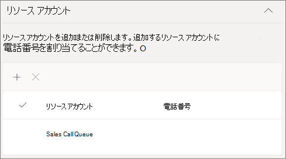
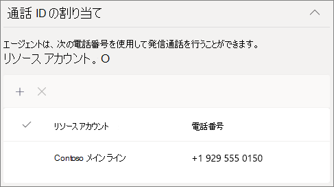
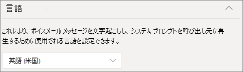

# 呼び出しキューを作成する

通話キューは、特定の問題や質問に対応できる組織内のユーザーに呼び出し元をルーティングする方法を提供します。 呼び出しは、キュー内のユーザー ( *エージェント* と呼ばれる) に一度に 1 つずつ配布されます。 

> [!TIP]
> この記事は、大規模な組織向けです。 組織が小規模ビジネスの場合は、代わりに [「通話キューの作成 - 小規模ビジネスのチュートリアル」](/microsoftteams/business-voice/create-a-phone-system-call-queue-smb) を参照してください。

呼び出しキューでは、次の情報が提供されます。

- あいさつメッセージ。

- ユーザーがキューで保留状態で待機している間の音楽。

- エージェントへの呼び出しルーティング ( *First In、First Out* (FIFO) 順)。

- キューオーバーフローとタイムアウトの処理オプション。

この記事の手順に従う前に[、Teams自動応答と通話キューの計画](plan-auto-attendant-call-queue.md)を読み、[作業の開始手順](plan-auto-attendant-call-queue.md#getting-started)に従っていることを確認してください。

**詳細については、以下の [通話キュー機能互換性](#call-queue-feature-compatibility) マトリックスを参照してください。**

## ビデオデモンストレーション

このビデオでは、Teamsで通話キューを作成する方法の基本的な例を示します。

> [!VIDEO https://www.microsoft.com/videoplayer/embed/RWCF23?autoplay=false]

## 呼び出しキューを作成する

通話キューを設定するには、Teams管理センターで **[音声**] を展開し、[**通話キュー**] をクリックして、[**追加**] をクリックします。

呼び出しキューの名前を入力します。

## リソース アカウント

[ **アカウントの追加]** をクリックし、この通話キューで使用するリソース アカウントを検索し、[ **追加**] をクリックして、[ **追加**] をクリックします。 (エージェントは、着信呼び出しを受け取ったときにリソース アカウント名を表示します)。

詳細については、「[Teams リソース アカウントの管理](manage-resource-accounts.md)」を参照してください。

## 動的呼び出し元 ID

**Teams チャネル/コラボレーション通話デスクトップ ユーザーと、標準通話キューを持つモバイル クライアント ユーザー Teams使用可能**

エージェントの発信発信者番号を割り当てるには、電話番号で 1 つ以上のリソース アカウントを指定します。 エージェントは、発信呼び出しのたびに使用する発信発信者番号を選択できます。

[ **追加]** をクリックし、発信通話を行う際にエージェントが発信者 ID に使用できるようにするリソース アカウントを検索し、[ **追加**] をクリックして、[ **追加**] をクリックします。

**標準呼び出しキュー**

デスクトップ ユーザーと標準通話キュー Teams、通話キューのメンバーの発信者 ID を呼び出しキューまたは適切な自動応答のサービス番号に直接設定することを検討してください。 詳細については、「[Microsoft Teamsでの呼び出し元 ID ポリシーの管理](caller-id-policies.md)」を参照してください。

> [!NOTE]
> 呼び出し ID の目的で使用されるリソース アカウントには、Microsoft Teams 電話 System Virtual User ライセンスがあり、次のいずれかが割り当てられている必要があります。
>
> - 通話プランのライセンスと電話番号が割り当てられている
> - オペレーター接続電話番号が割り当てられている
> - オンライン音声ルーティング ポリシー (直接ルーティングを使用する場合は電話番号の割り当ては省略可能)

## 言語

[サポートされている言語](create-a-phone-system-call-queue-languages.md)を選択します。 この言語は、システム生成の音声プロンプトとボイスメールの文字起こしに使用されます (有効にした場合)。

## キュー内の保留状態のあいさつと音楽

呼び出し元がキューに到着したときに、呼び出し元へのあいさつを再生するかどうかを指定します。 再生するあいさつ文を含む MP3、WAV、または WMA ファイルをアップロードする必要があります。 アップロードされた記録は、5 MB を超えてはなりません。

Teamsは、キューで保留されている発信者に既定の音楽を提供します。 Teams通話キューで提供される既定の音楽には、組織が支払う使用料は無料です。 特定のオーディオ ファイルを再生する場合は、[ **オーディオ ファイルの再生** ] を選択し、MP3、WAV、または WMA ファイルをアップロードします。

> [!NOTE]
> お客様は、Microsoft Teams サービスで音楽またはオーディオ ファイルを使用するために必要なすべての権利とアクセス許可を個別にクリアし、セキュリティで保護する責任を負います。これには、すべての関連する権利保有者 (アーティスト、アクターを含む) のオーディオ ファイル内の音楽、サウンド エフェクト、オーディオ、ブランド、名前、およびその他のコンテンツに関する知的財産権やその他の権利が含まれる場合があります。 パフォーマー、音楽家、作詞家、作曲家、レコード ラベル、音楽発行元、ユニオン、ギルド、権利団体、集合管理組織、音楽著作権、サウンド エフェクト、オーディオ、その他の知的財産権を所有、管理、ライセンスするその他の当事者。

## エージェントを呼び出す

エージェントを [呼び出しキューに追加するための前提条件を確認します](plan-auto-attendant-call-queue.md#prerequisites)。

##### Teams チャネル

Teams チャネルを介して最大 200 個のエージェントを追加できます。 キューにチャネルを追加するには、チームのメンバーであるか、チャネルの作成者または所有者である必要があります。

[Teams チャネルを使用してキューを管理する](https://support.microsoft.com/office/9f07dabe-91c6-4a9b-a545-8ffdddd2504e)場合は、[**チームの選択**] オプションを選択し、[**チャネルの追加**] をクリックします。 使用するチームを検索して選択し、[ **追加**] をクリックします。 使用するチャネル (標準チャネルのみがサポートされています) を選択し、[ **適用**] をクリックします。 

呼び出しキューにTeams チャネルを使用する場合、次のクライアントがサポートされます。 

  - Microsoft Teams Windows クライアント
  - Microsoft Teams Mac クライアント

> [!NOTE]
> このオプションを使用すると、呼び出しキューが完全に動作するまでに最大で 24 時間かかる場合があります。

##### ユーザーとグループ

グループを介して、最大 20 個のエージェントを個別に追加し、最大 200 個のエージェントを追加できます。

個々のユーザーまたはグループをキューに追加する場合は、[ **ユーザーとグループの選択** ] オプションを選択します。 

キューにユーザーを追加するには、[ユーザーの **追加]** をクリックし、ユーザーを検索して [ **追加]** をクリックし、[ **追加**] をクリックします。

グループをキューに追加するには、[グループの **追加]** をクリックし、グループを検索して [ **追加]** をクリックし、[ **追加**] をクリックします。 配布リスト、セキュリティ グループ、Microsoft 365 グループ、またはMicrosoft Teams チームを使用できます。

> [!NOTE]
> グループに追加された新しいユーザーは、最初の呼び出しが到着するまでに最大 8 時間かかる場合があります。

## 通話ルーティング

**会議モード** では、エージェントが呼び出しを受け入れた後に、発信者がエージェントに接続されるまでにかかる時間が大幅に短縮されます。 会議モードを機能させるには、通話キュー内のエージェントが次のいずれかのクライアントを使用する必要があります。

  - Microsoft Teams デスクトップ クライアント、Android アプリ、または iOS アプリの最新バージョン
  - Microsoft Teams 電話 バージョン 1449/1.0.94.2020051601 以降
  
エージェントのTeams アカウントは、Teams専用モードに設定する必要があります。 要件を満たしていないエージェントは、通話ルーティングリストに含まれません。 エージェントがすべて互換性のあるクライアントを使用している場合は、通話キューの電話会議モードを有効にすることをお勧めします。

> [!NOTE]
> 通話が、場所ベースのルーティングが有効になっているダイレクト ルーティング ゲートウェイからキューにルーティングされる場合、会議モードはサポートされません。

> [!TIP]
> **会議モード** を **[オン]** に設定することをお勧めします。

**ルーティングメソッド** は、エージェントがキューから呼び出しを受信する順序を決定します。 次のオプションから選択します。

- **アテンダント ルーティング** では、キュー内のすべてのエージェントが同時にリングされます。 呼び出しを受け取る最初の呼び出しエージェントが呼び出しを取得します。

- **シリアル ルーティング** では、通話エージェントの一覧で指定された順序ですべての **呼び出しエージェント** が 1 つずつリングされます。 エージェントが呼び出しを閉じるか、または呼び出しを受け取らない場合、呼び出しは次のエージェントを呼び出します。 これは、呼び出しが取り上げられるかタイムアウトするまで繰り返されます。

- **ラウンド ロビンは** 、各呼び出しエージェントがキューから同じ数の呼び出しを取得するように、着信呼び出しのルーティングのバランスを取ります。 このルーティング方法は、受信販売環境で、すべての通話エージェント間で機会が均等になるようにすることが望ましい場合があります。

- **最長アイドル時間は、最も長い** 時間アイドル状態になっているエージェントに各呼び出しをルーティングします。 エージェントのプレゼンス状態が使用可能な場合、エージェントはアイドル状態と見なされます。 プレゼンス状態が [使用可能] でないエージェントは、プレゼンスを [利用可能] に変更するまで通話を受信できません。 

> [!TIP]
> **ルーティング方法** を **ラウンド ロビン** または **最長アイドル状態** に設定することをお勧めします。

> [!NOTE]
> コンプライアンス [記録](teams-recording-policy.md) がエージェントで有効になっている場合、 **会議モード** と **アテンダント ルーティング** の組み合わせはサポートされません。 **会議モード** を使用する必要がある場合は、ルーティング **方法** として **シリアル ルーティング**、**ラウンド ロビン**、または **最長アイドル** 状態を選択します。 **アテンダント ルーティング** を使用する必要がある場合は、**会議モード** を **[オフ]** に設定します。
> 
> **最長アイドル状態** を使用していて、使用可能なエージェントよりもキュー内の呼び出しが少ない場合は、最初の 2 つの最長アイドル エージェントのみがキューからの呼び出しで表示されます。
> 
> **最長アイドル状態** を使用する場合、エージェントが使用できなくなった直後にキューから呼び出しを受信したり、使用可能になった後にキューからの呼び出しを受信する時間が短い場合があります。
> 
> エージェントへの通話キュー呼び出しプレゼンテーションは、場所ベースのルーティングの制限と競合する可能性があります。 この場合、エージェントは通話トーストを受け取りますが、通話に応答できません。 この状態は、別のエージェントが呼び出しに応答できるようになるか、呼び出し元がハングアップするか、通話キューのタイムアウト状態が発生するまで続行されます。  

**プレゼンス ベースのルーティング** では、呼び出しエージェントの可用性状態を使用して、選択したルーティング方法の呼び出しルーティング リストにエージェントを含める必要があるかどうかを判断します。 可用性の状態が **[使用可能]** に設定されている通話エージェントは、通話ルーティングリストに含まれ、通話を受信できます。 可用性の状態が他の状態に設定されているエージェントは、呼び出しルーティング リストから除外され、可用性の状態が **[使用可能**] に戻るまで呼び出しを受け取りません。 

任意のルーティング方法を使用して、プレゼンス ベースの呼び出しルーティングを有効にすることができます。

エージェントが呼び出しの取得をオプトアウトした場合、可用性の状態が設定されているかどうかに関係なく、エージェントは呼び出しルーティング リストに含まれません。 

> [!NOTE]
> ルーティング方法として **[最長アイドル時間** ] が選択されている場合、プレゼンス ベースのルーティングトグルが **オフ** で淡色表示になっている場合でも、プレゼンスベースのルーティングが必要であり、自動的に有効になります。
>
> プレゼンス ベースのルーティングが有効にされておらず、キューに複数の呼び出しがある場合、システムはプレゼンス状態に関係なく、これらの呼び出しをエージェントに同時に表示します。 これにより、特に一部のエージェントがエージェントに提示された最初の呼び出しに応答しない場合は、エージェントに対して複数の呼び出し通知が送信されます。
>
> **プレゼンス ベースのルーティング** を使用する場合、エージェントが利用できなくなった直後にキューからの呼び出しを受信したり、使用可能になった後にキューからの呼び出しを受信する時間が短い場合があります。
> 
> プレゼンス ベースのルーティングが有効になっている場合、Skype for Business クライアントを使用するエージェントは呼び出しルーティングリストに含まれません。 Skype for Businessを使用するエージェントがある場合は、プレゼンス ベースの呼び出しルーティングを有効にしないでください。

> [!TIP]
> **プレゼンス ベースのルーティング** を **[オン]** に設定することをお勧めします。

**エージェントアラート時間** は、キューが次のエージェントに呼び出しをリダイレクトするまでにエージェントの電話が鳴る時間を指定します。

> [!TIP]
> **エージェントのアラート時間** を **20 秒** に設定することをお勧めします。

> [!NOTE]
> [呼び出しタイムアウト処理](#call-timeout-handling)設定は、エージェントのアラート時間よりも優先されます。 呼び出しタイムアウト処理用に構成された最大キュー時間に達した場合、エージェントアラート時間の制限に達していない場合でも、呼び出しはエージェントからプルバックされます。

## 呼び出しオーバーフロー処理

**キュー内の最大呼び出し** 数は、任意の時点でキュー内で待機できる呼び出しの最大数を指定します。 既定値は 50 ですが、範囲は 0 ~ 200 です。 この制限に達すると、[呼び出しの最大数に達したとき] 設定で指定されたとおり **に呼び出しが** 処理されます。

呼び出しを切断するか、呼び出しルーティング先のいずれかにリダイレクトするかを選択できます。 たとえば、呼び出し元がキュー内のエージェントのボイスメールを残す場合があります。 外部転送については、「前提条件と[外部電話番号の転送 -](create-a-phone-system-auto-attendant.md#external-phone-number-transfers---technical-details) 番号の書式設定に関する技術的な詳細」を参照[してください](plan-auto-attendant-call-queue.md#prerequisites)。

> [!NOTE]
> 呼び出しの最大数が 0 に設定されている場合、あいさつメッセージは再生されません。

## 呼び出しタイムアウト処理

**呼び出しタイムアウト: 最大待機時間** は、呼び出しがリダイレクトまたは切断されるまでのキュー内で保留できる最大時間を指定します。 0 秒から 45 分の値を指定できます。

呼び出しを切断するか、呼び出しルーティング先のいずれかにリダイレクトするかを選択できます。 たとえば、呼び出し元がキュー内のエージェントのボイスメールを残す場合があります。 外部転送については、「前提条件と[外部電話番号の転送 - 番号の書式設定に関する技術的な詳細](create-a-phone-system-auto-attendant.md#external-phone-number-transfers---technical-details)」を参照[してください](plan-auto-attendant-call-queue.md#prerequisites)。

通話タイムアウト オプションを選択したら、[ **保存]** をクリックします。

## 推奨される通話キュー設定の概要

次の設定をお勧めします。

- **会議モード** を **オンにする**
- **ラウンド ロビン** または **最長アイドル** 状態への **ルーティング方法**
- **プレゼンス ベースのルーティング** から **On** へのルーティング
- **エージェントのアラート時間:** **20 秒** まで

## 通話キュー機能の互換性

|機能                          |Teams Desktop1 |Teams Mobile2 |Lync |IP 電話 | 標準呼び出しキュー |チャネル ベースの呼び出しキュー | コメント |
|:--------------------------------|:------------------------:|:-----------------------:|:---:|:--------:|:--------------------:|:------------------------:|:-------------|
|**エージェント ルーティング方法**        |                          |                         |     |          |                      |                          |              |
|`Attendant Routing`              |Y                         |Y                        |Y    |Y         |Y                     |Y                         |*既定値*     |
|`Longest Idle`3       |Y                         |Y                        |N    |Y         |Y                     |Y                         |*推奨* |
|`Round Robin`                    |Y                         |Y                        |Y    |Y         |Y                     |Y                         |*推奨* |
|`Serial`                         |Y                         |Y                        |Y    |Y         |Y4         |Y4             |              |
|**転送モード**               |                          |                         |     |          |                      |                          |              |
|`Conference Mode`5    |Y                         |Y                        |N    |Y6|Y                  |Y                         |*推奨* |
|`Transfer Mode`                  |Y                         |Y                        |Y    |Y         |Y                     |Y                         |              |
|プレゼンス ベースのルーティング 3|Y                        |Y                        |N    |Y         |Y                     |Y                         |*推奨* |
|エージェントはオプトアウトできます               |Y                         |Y                        |Y7|Y7|Y          |Y                         |*既定値*     |
|チャネル ベースのキュー             |Y                         |N                        |N    |N         |N/a                   |Y8             |              |
|通話トーストにリソース アカウント名が表示される |Y9       |Y                        |Y    |          |Y                     |Y                         |              |
|**動的呼び出し元 ID**            |                          |                         |     |          |                      |                          |              |
|`Standard call queue`            |N                         |Y                        |N    |N         |Y                     |N/a                       |              |
|`Channel based call queue`       |Y                         |N/a                      |N/a  |N/a       |N/a                   |Y                         |              |
|**PSTN 接続方法**    |                          |                         |     |          |                      |                          |注 10 を参照してください   |
|`Calling Plans`                  |Y                         |Y                        |Y    |Y         |Y                     |Y                         |              |
|`Direct Routing`                 |Y                         |Y                        |N    |N         |Y                     |Y                         |              |
|`Operator Connect`               |Y                         |Y                        |     |          |Y                     |Y                         |              |

注:
1. Microsoft Teams Windows クライアント、Microsoft Teams Mac クライアント、仮想化デスクトップ インフラストラクチャ上のMicrosoft Teams、web クライアントMicrosoft Teams。
2. Microsoft Teams iPhone アプリ、Android アプリMicrosoft Teams。
3. エージェント ルーティング方法で [最長アイドル時間] を選択すると、プレゼンス ベースのルーティングが自動的に有効になります。
4. 個々のユーザーを標準呼び出しキューの一部として追加する場合にのみ、順序を設定できます。 配布リストまたはTeams チャネルが使用されている場合、順序はアルファベット順になります。
5. 通話が、場所ベースのルーティングが有効になっているダイレクト ルーティング ゲートウェイからキューにルーティングされる場合、会議モードはサポートされません。
6. Microsoft Teams電話のみ。
7. [ユーザー 設定 ポータル] ページhttps://aka.ms/vmsettings
8. パブリック チャネルのみがサポートされます。
9. Teams Web クライアントを除く。
10. 自動応答と通話キューでは、PSTN 接続方法間で通話を転送できません。

## サポートされるクライアント

呼び出しキュー内の呼び出しエージェントでは、次のクライアントがサポートされています。

  - Skype for Business デスクトップ クライアント 2016 (32 ビットバージョンと 64 ビット バージョン)
  - Lync デスクトップ クライアント 2013 (32 ビットおよび 64 ビット バージョン)
  - Microsoft Teamsでサポートされているすべての IP 電話モデル。 [「Skype for Business Online の電話を取得する](/skypeforbusiness/what-is-phone-system-in-office-365/getting-phones-for-skype-for-business-online/getting-phones-for-skype-for-business-online)」を参照してください。
  - Mac版  Skype for Business クライアント (バージョン 16.8.196 以降)
  - Aandroid Skype for Business クライアント (バージョン 6.16.0.9 以降)
  - iPhone Skype for Business Client クライアント(バージョン 6.16.0 以降)
  - Mac版  Skype for Business クライアント (バージョン 6.16.0 以降)
  - Microsoft Teams Windows クライアント (32 ビットバージョンと 64 ビット バージョン)
  - Microsoft Teams Mac クライアント
  - [仮想化デスクトップ インフラストラクチャ](/microsoftteams/teams-for-vdi)のMicrosoft Teams (仮想デスクトップ、Citrix、VMware Windows)
  - Microsoft Teams iPhone アプリ
  - Microsoft Teams Android アプリ

    > [!NOTE]
    > ダイレクト ルーティング番号が割り当てられた通話キューでは、クライアント、Lync クライアント、またはエージェントとしての ip Phone Skype for Business Skype for Businessサポートされません。 Teams クライアントは、[共存モードが [Teamsのみ] でのみ](/microsoftteams/setting-your-coexistence-and-upgrade-settings)サポートされます。

## 通話キューのコマンドレット

Windows PowerShellでは、コマンド ラインを使用して、バッチまたはプログラムによる方法で呼び出しキューを作成および管理できます。

次のコマンドレットを使用すると、通話キューを管理できます。

- [New-CsCallQueue](/powershell/module/skype/New-CsCallQueue)
- [Get-CsCallQueue](/powershell/module/skype/Get-CsCallQueue)
- [Set-CsCallQueue](/powershell/module/skype/Set-CsCallQueue)
- [Remove-CsCallQueue](/powershell/module/skype/Remove-CsCallQueue)

また、通話キューで使用されるユーザー、リソース アカウント、Microsoft Teams 電話 ライセンス、電話番号、オーディオ ファイル、サポートされている言語を管理するには、次の追加コマンドレットも必要です。

Users/Teams

- ユーザー
- - [Get-CsOnlineUser](/powershell/module/skype/Get-CsOnlineUser)

- Teams: 
- - [Get-Team](/powershell/module/teams/Get-Team)
- - [Get-TeamChannel](/powershell/module/teams/Get-TeamChannel)

リソース アカウント:

- [New-CsOnlineApplicationInstance](/powershell/module/skype/New-CsOnlineApplicationInstance)
- [Find-CsOnlineApplicationInstance](/powershell/module/skype/Find-CsOnlineApplicationInstance)
- [Get-CsOnlineApplicationInstance](/powershell/module/skype/Get-CsOnlineApplicationInstance)
- [Set-CsOnlineApplicationInstance](/powershell/module/skype/Set-CsOnlineApplicationInstance)
- [New-CsOnlineApplicationInstanceAssociation](/powershell/module/skype/New-CsOnlineApplicationInstanceAssociation)
- [Get-CsOnlineApplicationInstanceAssociation](/powershell/module/skype/Get-CsOnlineApplicationInstanceAssociation)
- [Remove-CsOnlineApplicationInstanceAssociation](/powershell/module/skype/Remove-CsOnlineApplicationInstanceAssociation)
- [Get-CsOnlineApplicationInstanceAssociationStatus](/powershell/module/skype/Get-CsOnlineApplicationInstanceAssociationStatus)

仮想Teams 電話 ライセンス:

- [Get-MsolAccountSku](/powershell/module/msonline/get-msolaccountsku)
- [Set-MsolUserLicense](/powershell/module/msonline/set-msoluserlicense)

電話番号の割り当て:

- [Get-CsOnlineTelephoneNumber](/powershell/module/skype/Get-CsOnlineTelephoneNumber)
- [Set-CsPhoneNumberAssignment](/powershell/module/teams/Set-csphonenumberassignment)

オーディオ ファイル

- [Get-CsOnlineAudioFile](/powershell/module/skype/Get-CsOnlineAudioFile)
- [Import-CsOnlineAudioFile](/powershell/module/skype/Import-CsOnlineAudioFile)
- [Export-CsOnlineAudioFile](/powershell/module/skype/Export-CsOnlineAudioFile)
- [Remove-CsOnlineAudioFile](/powershell/module/skype/Remove-CsOnlineAudioFile)

サポート言語リスト

- [Get-CsAutoAttendantSupportedLanguage](/powershell/module/skype/Get-CsAutoAttendantSupportedLanguage)

PowerShell を使用して通話キューを作成する手順については、「PowerShell [コマンドレットを使用した通話キューの作成](create-a-phone-system-call-queue-via-cmdlets.md)」を参照してください。

## キュー診断ツールの呼び出し

管理者の場合は、次の診断ツールを使用して、通話キューが通話を受信できることを検証できます。

1. 以下の **[テストの実行]** を選択すると、診断が Microsoft 365 管理センターに表示されます。 

   > [!div class="nextstepaction"]
   > [テストの実行: Teams呼び出しキュー](https://aka.ms/TeamsCallQueueDiag)

2. [実行] 診断ウィンドウで、[ **ユーザー名] または [電子メール** ] フィールドにリソース アカウントを入力し、[ **テストの実行**] を選択します。

3. テストでは、テナント、ポリシー、リソース アカウントの構成に対処するための最適な次の手順が返され、呼び出しキューが呼び出しを受信できることを検証します。

## 関連項目

[Microsoft Teams 電話で得られる内容を次に示します。](here-s-what-you-get-with-phone-system.md)

[サービス電話番号を取得する](getting-service-phone-numbers.md)

[国および地域ごとの電話会議および通話プランの利用可能性](country-and-region-availability-for-audio-conferencing-and-calling-plans/country-and-region-availability-for-audio-conferencing-and-calling-plans.md)
