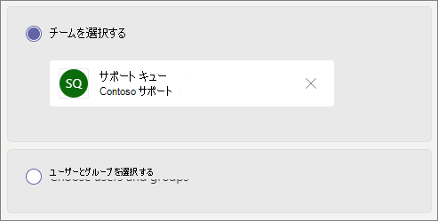
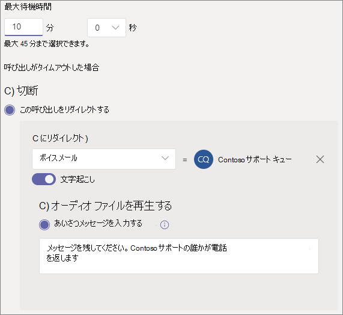

# 呼び出しキューを作成するCreate a call queue

通話キューは、特定の問題や質問に役立つ組織内のユーザーに発信者をルーティングする方法を提供します。Call queues provide a method of routing callers to people in your organization who can help with a particular issue or question. 呼び出しは、キュー内のユーザー (エージェントと呼ばれる) に一度に 1 回配布 *されます*。Calls are distributed one at a time to the people in the queue (who are known as *agents*). 

呼び出しキューには、次の機能が提供されます。Call queues provide:

- あいさつメッセージ。A greeting message.

- ユーザーがキューで保留を待機している間の音楽。Music while people are waiting on hold in a queue.

- 通話ルーティング - *First In、First Out* (FIFO) の順序でエージェントに送信します。Call routing - in *First In, First Out* (FIFO) order - to agents.

- キュー オーバーフローとタイムアウトの処理オプション。Handling options for queue overflow and timeout.

この記事の手順に従う前に[、「Teams](plan-auto-attendant-call-queue.md)の自動応答と通話キューの計画」を読み、開始手順に従ってください。Be sure you have read [Plan for Teams auto attendants and call queues](plan-auto-attendant-call-queue.md) and followed the [getting started steps](plan-auto-attendant-call-queue.md#getting-started) before you follow the procedures in this article.

通話キューを設定するには、Teams 管理センターで [Voice] を展開し、[通話キュー] をクリックし、[追加] を **クリックします**。 To set up a call queue, in the Teams admin center, expand **Voice**, click **Call queues**, and then click **Add**.

## リソース アカウントと言語Resource account and language

1. 呼び出しキューの名前を入力します。Type a name for the call queue.

2. [**アカウントの追加]** をクリックし、この呼び出しキューで使用するリソースアカウントを検索し、[追加] をクリックし、[追加] を **クリックします**。Click **Add accounts**, search for the resource account that you want to use with this call queue, click **Add**, and then click **Add**. (エージェントは、着信呼び出しを受信すると、リソース アカウント名が表示されます)。(Agents will see the resource account name when they receive an incoming call.)

3. サポートされている言語 [を選択します](create-a-phone-system-call-queue-languages.md)。Choose a [supported language](create-a-phone-system-call-queue-languages.md). この言語は、システムで生成された音声プロンプトとボイスメールの文字起こし (有効にした場合) に使用されます。This language will be used for system-generated voice prompts and voicemail transcription (if you enable them).

## キュー内のグリーティングと保留の音楽Greetings and music on hold in queue

発信者がキューに到着するときに、発信者にあいさつを再生する場合に指定します。Specify if you want to play a greeting to callers when they arrive in the queue. 再生するあいさつを含む MP3、WAV、または WMA ファイルをアップロードする必要があります。You must upload an MP3, WAV, or WMA file containing the greeting that you want to play.

Teams は、キューで保留の間、呼び出し元に既定の音楽を提供します。Teams provides default music to callers while they are on hold in a queue. 特定のオーディオ ファイルを再生する場合は、[オーディオ ファイルの再生] を選択し、MP3、WAV、または WMA ファイルをアップロードします。If you want to play a specific audio file, choose **Play an audio file** and upload an MP3, WAV, or WMA file.

> [!NOTE]
> アップロードされた記録は、5 MB 以下に設定できます。The uploaded recording can be no larger than 5 MB.
> Teams 呼び出しキューで提供される既定の音楽には、組織が支払うロイヤリティは無料です。The default music supplied in Teams call queues is free of any royalties payable by your organization. 

## エージェントを呼び出すCall agents

エージェントを [呼び出しキューに追加するための前提条件を確認します](plan-auto-attendant-call-queue.md#prerequisites)。Review the [prerequisites for adding agents to a call queue](plan-auto-attendant-call-queue.md#prerequisites).

##### Teams チャネルTeams channel

Teams チャネルを使用して最大 200 人のエージェントを追加できます。You can add up to 200 agents via a Teams channel.

Teams チャネルを使用 [してキューを](https://support.microsoft.com/office/9f07dabe-91c6-4a9b-a545-8ffdddd2504e)管理する場合は、[チームの選択] オプションを選択し、[チャネルの追加 **] をクリックします**。If you want to [use a Teams channel to manage the queue](https://support.microsoft.com/office/9f07dabe-91c6-4a9b-a545-8ffdddd2504e), select the **Choose a team** option and click **Add a channel**. 使用するチームを検索して選択し、[追加] を **クリックします**。Search for the team that you want to use, select it, and click **Add**. 使用するチャネルを選択し、[適用] を **クリックします**。Select the channel that you want to use and click **Apply**.

次のクライアントは、通話キューに Teams チャネルを使用する場合にサポートされます。The following clients are supported when using a Teams channel for call queues: 

  - Microsoft Teams Windows クライアントMicrosoft Teams Windows client
  - Microsoft Teams Mac クライアントMicrosoft Teams Mac client

##### ユーザーとグループUsers and groups

最大 20 人のエージェントを個別に追加し、最大 200 人のエージェントをグループ経由で追加できます。You can add up to 20 agents individually and up to 200 agents via groups.

キューに個々のユーザーまたはグループを追加する場合は、[ユーザーとグループの選択] オプション **を選択** します。If you want to add individual users or groups to the queue, select the **Choose users and groups** option. 

キューにユーザーを追加するには、[ユーザーの追加] をクリックし、ユーザーを検索し、[追加] をクリックし、[追加] を **クリックします**。To add a user to the queue, click **Add users**, search for the user, click **Add**, and then click **Add**.

キューにグループを追加するには、[グループの追加] をクリックし、グループを検索し、[追加] をクリックし、[追加] を **クリックします**。To add a group to the queue, click **Add groups**, search for the group, click **Add**, and then click **Add**. 配布リスト、セキュリティ グループ、および Microsoft 365 グループまたは Microsoft Teams チームを使用できます。You can use distribution lists, security groups, and Microsoft 365 groups or Microsoft Teams teams.

> [!NOTE]
> グループに追加された新しいユーザーは、最初の呼び出しが到着するために最大 8 時間かかる場合があります。New users added to a group can take up to eight hours for their first call to arrive.

## 通話ルーティングCall routing

**会議モード** では、エージェントが呼び出しを受け入れる後に、呼び出し元がエージェントに接続するのにかかる時間が大幅に短縮されます。**Conference mode** significantly reduces the amount of time it takes for a caller to be connected to an agent, after the agent accepts the call. 会議モードを機能するには、通話キュー内のエージェントが次のいずれかのクライアントを使用する必要があります。For conference mode to work, agents in the call queue must use one of the following clients:

  - Microsoft Teams デスクトップ クライアント、Android アプリ、または iOS アプリの最新バージョンThe latest version of the Microsoft Teams desktop client, Android app, or iOS app
  - Microsoft Teams の電話バージョン 1449/1.0.94.2020051601 以降Microsoft Teams phone version 1449/1.0.94.2020051601 or later
  
エージェントの Teams アカウントは、Teams 専用モードに設定する必要があります。Agents' Teams accounts need to be set to Teams-only mode. 要件を満たしていないエージェントは、通話ルーティング リストに含まれません。Agents who don't meet the requirements aren't included in the call routing list. エージェントが互換性のあるクライアントを使用している場合は、通話キューの会議モードを有効にすることをお勧めします。We recommend enabling conference mode for your call queues if your agents are all using compatible clients.

> [!NOTE]
> 場所に基づくルーティングが有効になっているダイレクト ルーティング ゲートウェイから電話がキューにルーティングされる場合、会議モードはサポートされません。Conference mode is not supported if phone calls are routed to the queue from a Direct Routing gateway that is enabled for Location Based Routing.

**ルーティング方法は** 、エージェントがキューから呼び出しを受信する順序を決定します。**Routing method** determines the order in which agents receive calls from the queue. 次のオプションから選択します。Choose from these options:

- **アテンダント ルーティング** では、キュー内のすべてのエージェントが同時に呼び出されます。**Attendant routing** rings all agents in the queue at the same time. 呼び出しを受け取る最初の呼び出しエージェントは、呼び出しを取得します。The first call agent to pick up the call gets the call.

- **シリアル ルーティングでは** 、すべての呼び出しエージェントが[エージェントの呼び出し] リストで指定された順序 **で 1 つ 1 つリング** されます。**Serial routing** rings all call agents one by one in the order specified in the **Call agents** list. エージェントが通話を却下または取り上げない場合、呼び出しは次のエージェントを呼び出し、そのエージェントが取り上げられるか、または時間が切れるまですべてのエージェントを試します。If an agent dismisses or does not pick up a call, the call will ring the next agent and will try all agents until it is picked up or times out.

- **ラウンド ロビンは** 、着信呼び出しのルーティングのバランスを取り、各呼び出しエージェントがキューから同じ数の呼び出しを取得します。**Round robin** balances the routing of incoming calls so that each call agent gets the same number of calls from the queue. これは、すべての通話エージェント間で均等な機会を確保するために、受信販売環境で望ましい場合があります。This may be desirable in an inbound sales environment to assure equal opportunity among all the call agents.

- **アイドル時間が** 最も長いエージェントに各呼び出しがルーティングされます。**Longest idle** routes each call to the agent who has been idle the longest time. エージェントのプレゼンス状態が [使用可能] である場合、またはプレゼンス状態が 10 分未満離れた場合、エージェントはアイドル状態と見なされます。An agent is considered idle if their presence state is Available or if their presence state has been Away for less than 10 minutes. プレゼンス状態が 10 分以上離れたエージェントはアイドル状態とは見なされません。プレゼンスを [利用可能] に変更するまで、通話を受信する資格は得られません。Agents whose presence state has been Away for more than 10 minutes are not considered idle and will not be eligible to receive calls until they change their presence to Available. 

**プレゼンス ベースのルーティングでは** 、呼び出しエージェントの可用性状態を使用して、エージェントを選択したルーティング方法の呼び出しルーティング リストに含める必要があるかどうかを判断します。**Presence-based routing** uses the availability status of call agents to determine whether an agent should be included in the call routing list for the selected routing method. 可用性の状態が [利用可能] に設定されている通話エージェント **は、通話** ルーティング リストに含まれており、呼び出しを受信できます。Call agents whose availability status is set to **Available** are included in the call routing list and can receive calls. 可用性の状態が他の状態に設定されているエージェントは、通話ルーティング リストから除外され、可用性の状態が [利用可能] に戻るまで呼び出しを受信 **しません**。Agents whose availability status is set to any other status are excluded from the call routing list and won't receive calls until their availability status changes back to **Available**. 

任意のルーティング方法でプレゼンス ベースの呼び出しルーティングを有効にできます。You can enable presence-based call routing with any of the routing methods.

エージェントが通話の受け取りをオプトアウトした場合、エージェントの可用性の状態が設定されている状況に関係なく、通話ルーティング リストに含まれません。If an agent opts out of getting calls, they won't be included in the call routing list regardless of what their availability status is set to. 

> [!NOTE]
> プレゼンス ベースのルーティングが有効になっている場合、Skype for Business クライアントを使用するエージェントは、通話ルーティング リストに含まれません。Agents who use the Skype for Business client aren't included in the call routing list when presence-based routing is enabled. Skype for Business を使用するエージェントがある場合は、プレゼンス ベースの通話ルーティングを有効にしない。If you have agents who use Skype for Business, don't enable presence-based call routing.

**エージェントアラート時間は** 、キューが呼び出しを次のエージェントにリダイレクトする前にエージェントの電話が鳴る時間を指定します。**Agent alert time** specifies how long an agent's phone will ring before the queue redirects the call to the next agent.

次の設定をお勧めします。The following settings are recommended:

- **会議モードを** [自動] **に設定する****Conference mode** to **Auto**
- **ラウンド ロビンまたは\*\*\*\*最長アイドルへの\*\*\*\*ルーティング方法****Routing method** to **Round robin** or **Longest idle**
- **プレゼンス ベースのルーティングを** **On に設定する****Presence-based routing** to **On**
- **エージェントのアラート時間:** **20 秒****Agent alert time:** to **20 seconds**

> [!NOTE]
> プレゼンス ベースのルーティングが有効ではなく、キュー内に複数の呼び出しがある場合、システムはプレゼンス状態に関係なく、これらの呼び出しをエージェントに同時に表示します。If presence-based routing is not enabled and there are multiple calls in the queue, the system will present these calls simultaneously to the agents regardless of their presence status. これにより、エージェントに対して複数の通話通知が送信されます。特に、一部のエージェントがエージェントに提示された最初の呼び出しに応答しない場合。This will result in multiple call notifications to agents, particularly if some agents don’t answer the initial call presented to them.

## 呼び出しオーバーフロー処理Call overflow handling

**キュー内の最大呼び** 出し数は、任意の時点でキューで待機できる呼び出しの最大数を指定します。**Maximum calls in the queue** specifies the maximum number of calls that can wait in the queue at any given time. 既定値は 50 ですが、0 から 200 の範囲で指定できます。The default is 50, but it can range from 0 to 200. この制限に達すると、呼び出しは [呼び出しの最大数に達した場合] 設定で指定された通 **り処理** されます。When this limit is reached, the call is handled as specified by the **When the maximum number of calls is reached** setting.

通話を切断するか、任意の呼び出しルーティング先にリダイレクトすることができます。You can choose to disconnect the call or redirect it to any of the call routing destinations. たとえば、発信者がキュー内のエージェントのボイスメールを残す場合があります。For example, you might have the caller leave a voicemail for the agents in the queue. 外部転送については、「前提条件」と「外部電話番号の転送[-](create-a-phone-system-auto-attendant.md#external-phone-number-transfers---technical-details)番号の書式設定に関する技術的な詳細」を参照してください。For external transfers, please refer to [Prerequisites](plan-auto-attendant-call-queue.md#prerequisites) and the [external phone number transfers - technical details](create-a-phone-system-auto-attendant.md#external-phone-number-transfers---technical-details) for number formatting.

> [!NOTE]
> 呼び出しの最大数が 0 に設定されている場合、あいさつメッセージは再生されません。If the maximum number of calls is set to 0 then the greeting message will not play.

## 呼び出しタイムアウト処理Call timeout handling

**呼び出しタイムアウト:** 最大待機時間は、呼び出しがリダイレクトまたは切断される前にキューで保留にできる最大時間を指定します。**Call Timeout: maximum wait time** specifies the maximum time a call can be on hold in the queue before it is redirected or disconnected. 0 秒から 45 分の値を指定できます。You can specify a value from 0 seconds to 45 minutes.

通話を切断するか、または呼び出しルーティング先の 1 つにリダイレクトすることができます。You can choose to disconnect the call or redirect it to one of the call routing destinations. たとえば、発信者がキュー内のエージェントのボイスメールを残す場合があります。For example, you might have the caller leave a voicemail for the agents in the queue. 外部転送については、「前提条件」と「外部電話番号の転送[-](create-a-phone-system-auto-attendant.md#external-phone-number-transfers---technical-details)番号の書式設定に関する技術的な詳細」を参照してください。For external transfers, please refer to [Prerequisites](plan-auto-attendant-call-queue.md#prerequisites) and the [external phone number transfers - technical details](create-a-phone-system-auto-attendant.md#external-phone-number-transfers---technical-details) for number formatting.

通話タイムアウト オプションを選択した場合は、[保存] を **クリックします**。When you have selected your call timeout options, click **Save**.

## 発信呼び出しの呼び出し元 IDCaller ID for outbound calls

通話キュー内のエージェントがダイヤルアウトして顧客の通話を返す場合があります。通話キューのメンバーの発信者 ID を、適切な自動応答のサービス番号に設定してください。Since agents in a call queue may dial out to return a customer call, consider setting the caller ID for members of a call queue to the service number of an appropriate auto attendant. 詳細については [、「Microsoft Teams で発信者 ID ポリシーを管理する」](caller-id-policies.md) を参照してください。See [Manage caller ID policies in Microsoft Teams](caller-id-policies.md) for more information.

## サポートされるクライアントSupported clients

呼び出しキューの呼び出しエージェントでは、次のクライアントがサポートされます。The following clients are supported for call agents in a call queue:

  - Skype for Business デスクトップ クライアント 2016 (32 ビット版と 64 ビット版)Skype for Business desktop client 2016 (32-bit and 64-bit versions)
  - Lync デスクトップ クライアント 2013 (32 ビット版と 64 ビット版)Lync desktop client 2013 (32-bit and 64-bit versions)
  - Microsoft Teams でサポートされているすべての IP フォン モデル。All IP phone models supported for Microsoft Teams. 「Skype for Business [Online の電話を取得する」を参照してください](/skypeforbusiness/what-is-phone-system-in-office-365/getting-phones-for-skype-for-business-online/getting-phones-for-skype-for-business-online)。See [Getting phones for Skype for Business Online](/skypeforbusiness/what-is-phone-system-in-office-365/getting-phones-for-skype-for-business-online/getting-phones-for-skype-for-business-online).
  - Mac版  Skype for Business クライアント (バージョン 16.8.196 以降)Mac Skype for Business Client (version 16.8.196 and later)
  - Aandroid Skype for Business クライアント (バージョン 6.16.0.9 以降)Android Skype for Business Client (version 6.16.0.9 and later)
  - iPhone Skype for Business Client クライアント(バージョン 6.16.0 以降)iPhone Skype for Business Client (version 6.16.0 and later)
  - Mac版  Skype for Business クライアント (バージョン 6.16.0 以降)iPad Skype for Business Client (version 6.16.0 and later)
  - Microsoft Teams Windows クライアント (32 ビット版と 64 ビット版)Microsoft Teams Windows client (32-bit and 64-bit versions)
  - Microsoft Teams Mac クライアントMicrosoft Teams Mac client
  - Microsoft Teams on [Virtualed Desktop Infrastructure](/microsoftteams/teams-for-vdi) (Windows Virtual Desktop、Citrix、VMware)Microsoft Teams on [Virtualized Desktop Infrastructure](/microsoftteams/teams-for-vdi) (Windows Virtual Desktop, Citrix, and VMware)
  - Microsoft Teams iPhone アプリMicrosoft Teams iPhone app
  - Microsoft Teams Android アプリMicrosoft Teams Android app

    > [!NOTE]
    > 直接ルーティング番号が割り当てられている通話キューは、Skype for Business クライアント、Lync クライアント、または Skype for Business IP Phone をエージェントとしてサポートしません。Call queues that are assigned a direct routing number don't support Skype for Business clients, Lync clients, or Skype for Business IP Phones as agents.

## 通話キューのコマンドレットCall queue cmdlets

Windows PowerShell を使用して通話キューを作成し、設定することもできます。You can also use Windows PowerShell to create and set up call queues. 呼び出しキューの管理に使用するコマンドレットを次に示します。Here are the cmdlets that you use to manage a call queue.

- [New-CsCallQueueNew-CsCallQueue](/powershell/module/skype/new-CsCallQueue)

- [Set-CsCallQueueSet-CsCallQueue](/powershell/module/skype/set-CsCallQueue)

- [Get-CsCallQueueGet-CsCallQueue](/powershell/module/skype/get-CsCallQueue)

- [Remove-CsCallQueueRemove-CsCallQueue](/powershell/module/skype/remove-CsCallQueue)

## 関連項目Related topics

[電話システムで利用できる機能Here's what you get with Phone System](here-s-what-you-get-with-phone-system.md)

[サービス電話番号を取得するGetting service phone numbers](getting-service-phone-numbers.md)

[国および地域ごとの電話会議および通話プランの利用可能性Country and region availability for Audio Conferencing and Calling Plans](country-and-region-availability-for-audio-conferencing-and-calling-plans/country-and-region-availability-for-audio-conferencing-and-calling-plans.md)

[New-CsOnlineApplicationInstanceNew-CsOnlineApplicationInstance](/powershell/module/skype/new-csonlineapplicationinstance)

[Windows PowerShell と Skype for Business Online の概要An introduction to Windows PowerShell and Skype for Business Online](/SkypeForBusiness/set-up-your-computer-for-windows-powershell/set-up-your-computer-for-windows-powershell)
