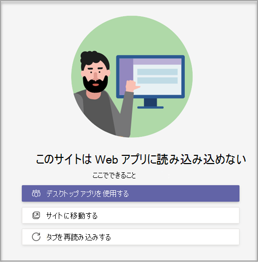

# カスタム チーム テンプレートを作成する Microsoft TeamsCreate a custom team template in Microsoft Teams

**カスタム テンプレートは、EDU のお客様にはまだサポートされていません。****Custom templates are not yet supported for EDU customers.**

カスタム チーム テンプレートは、チャネル、タブ、アプリのセットを含む定義済みのチーム構造です。A custom team template is a predefined team structure with a set of channels, tabs, and apps. 適切なコラボレーション スペースをすばやく作成するのに役立つテンプレートを開発できます。You can develop a template that helps you create the right collaboration space quickly. カスタム チーム テンプレートでは、お好みの設定を使用します。Your custom team template uses your preferred settings.  

使用を開始するには:To get started:

1. Teams 管理センターにサインインします。Sign in to the Teams admin center.

2. 左側のナビゲーションで、[チーム テンプレート **] Teams**  >  **展開します**。In the left navigation, expand **Teams** > **Team templates**.

3. **[追加]** を選択します。Select **Add**.

    ![[追加] が強調表示された [チーム テンプレート] ダイアログの画像。](media/team-templates-new.png)

4. [ **チーム テンプレート] セクションで、[** 新しいテンプレート **の作成] を選択します**。In the **Team templates** section, select **Create a brand new template**.

5. [テンプレートの **設定] セクション** で、次のフィールドに入力し、[次へ] を **選択します**。In the **Template settings** section, complete the following fields and then select **Next**:
    - テンプレート名Template name
    - テンプレートの短い説明と長い説明Template short and long descriptions
    - ロケールの可視性Locale visibility  

    

6. [チャネル **、タブ、アプリ] セクションで** 、チームに必要なチャネルとアプリを追加します。In the **channels, tabs, and apps** section, add any channels and apps that your team needs.

    1. [チャネル] **セクションで** 、[追加] を **選択します**。In the **Channels** section, select **Add**.
    2. [追加 **] ダイアログ** で、チャネルに名前を付きます。In the **Add** dialog, name the channel.
    3. 説明を追加します。Add a description.
    4. チャネルを既定で表示する必要がある場合に決定します。Decide if the channel should be shown by default.
    5. チャネルに追加するアプリ名を検索します。Search for an app name that you want to add to the channel.
    6. 完了したら **、[適用** ] を選択します。Select **Apply** when finished.

    

8. 完了したら **、[送信** ] を選択します。Select **Submit** when completed.

新しいテンプレートが [チーム テンプレート] **の一覧に表示** されます。Your new template is displayed in the **Team templates** list. テンプレートを使用して、チームを作成し、Teams。The template can be used to create a team in Teams.

> [!Note]
> チーム ユーザーがギャラリーにカスタム テンプレートを表示するには、最大で 24 時間かかる場合があります。It can take up to 24 hours for teams users to see a custom template in the gallery.

## Web サイト タブ アプリのカスタマイズCustomizing Website Tab apps

> [!Note]
> この機能は早期プレビュー段階ですThis feature is in early preview

カスタム チーム テンプレートでは、チャネルの Web サイト タブの URL を指定できます。You might want to specify URLs for website tabs for channels in custom team templates. テンプレートを使用してチームを作成するエンド ユーザーには、指定したサイト URL にプリセットされた Web サイト タブが表示されます。End users who create teams with templates will have website tabs that are preset to the specified site URL.

使用を開始するには:To get started:

1. 新しいチーム テンプレートを作成するか、既存のチーム テンプレートを編集します。Create a new team template or edit an existing team template.

2. [チャネル] セクションで、新しいチャネルを追加するか、既存のチャネルを選択し、[編集] を **選択します**。In the Channels section, add a new channel or select an existing channel and select **Edit**.

3. [この **テンプレート用のアプリを追加する] セクションで** 、Web サイト アプリを追加します。In the **Add an app for this template** section, add a Website app.

    

4. 編集アイコンを選択し、選択した URL を入力します。Select the edit icon and input the URL of your choice.

    

5. タブ アプリ **の** 編集で [保存] を選択し、[適用 **] を選択して** 変更を保存します。Select **Save** for your tab app edits, and then select **Apply** to save your changes.

## 既知の問題Known issues

**問題**: 追加のカスタム タブを含むカスタム テンプレートからチームを作成した場合、カスタム タブ アプリの代に空白のタブが表示される場合があります。**Problem**: If you've created a team from a custom template that contained additional custom tabs, you might see blank tabs in place of your custom tab apps. 既定のタブ **([投稿]、[\*\*\*\*ファイル]、\*\*\*\*および [Wiki]** など) が期待通り表示されます。Your default tabs (such as **Posts**, **Files**, and **Wiki**) will appear as expected.

**解決策**: この問題を解決するには、カスタム タブを削除し、同じアプリで新しいタブを追加します。**Solution**: To fix this issue, remove the custom tab and add a new tab with the same app. カスタム タブを削除して新しいタブを追加するアクセス許可を持たなかった場合は、チームの所有者に問い合わせてください。If you don't have permissions to remove the custom tab and add a new tab, contact the team owner for assistance.

現在、カスタム テンプレートから作成された将来のチームの修正に取り組み中です。We're currently working on a fix for future teams created from custom templates.

**問題**: ブラウザーでTeamsを使用している場合、一部の Web サイトでは、一部の Web サイトが [Teamsされます。**Problem**: When using Teams in the browser, some websites don't support being rendered within a Teams tab.

**解決策**: [Web サイト] タブの内容の表示に問題がある場合は、別の Web ページでタブを開くか、代わりにデスクトップ アプリで Teams を開き、Web サイト タブ アプリを表示します。**Solution**: If you have trouble viewing the contents of the website tab, you'll be redirected to either open the tab in a separate webpage, or open Teams in the desktop app instead to view your website tab app.

## 関連トピックRelated topics

- [管理センターでチーム テンプレートの使用を開始するGet started with team templates in the admin center](get-started-with-teams-templates-in-the-admin-console.md)
- [既存のチームからテンプレートを作成するCreate a template from an existing team](create-template-from-existing-team.md)
- [既存のチーム テンプレートからチーム テンプレートを作成するCreate a team template from an existing team template](create-template-from-existing-template.md)
