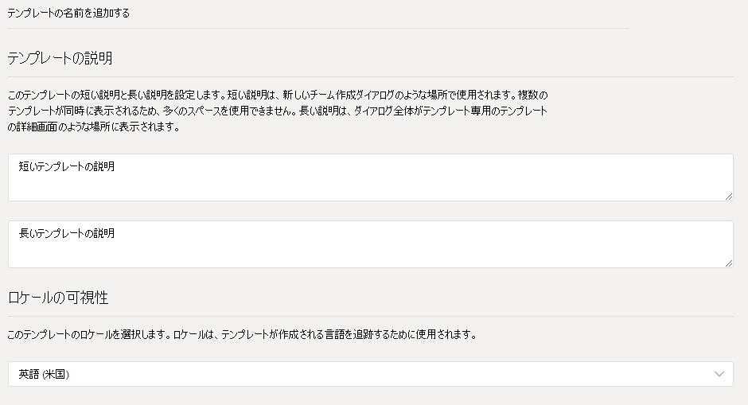
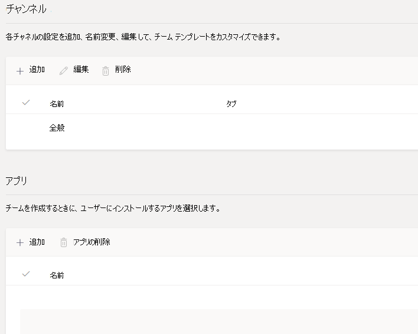
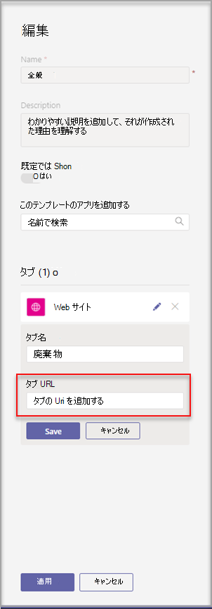

# Microsoft Teams でカスタム チーム テンプレートを作成する

**EDU ユーザー向けカスタム テンプレートはまだサポートされていません。**

カスタム チーム テンプレートは、チャネル、タブ、アプリのセットを含む定義済みのチーム構造です。 適切なコラボレーション スペースをすばやく作成するのに役立つテンプレートを作成できます。 カスタム チーム テンプレートでは、お好みの設定が使用されます。  

使用を開始するには:

1. Teams 管理センターにサインインします。

2. 左側のナビゲーションで **、[Teams** チーム]  >  **テンプレートを展開します**。

3. **[追加]** を選択します。

    ![[追加] が強調表示された [チーム テンプレート] ダイアログの画像。](media/team-templates-new.png)

4. [チーム **テンプレート] セクションで、[** 新しい **テンプレートの作成] を選択します**。

5. [テンプレートの **設定] セクションで** 、次のフィールドに入力し、[次へ] を **選択します**。
    - テンプレート名
    - テンプレートの短い説明と長い説明
    - ロケールの表示  

    

6. [チャネル **、タブ、アプリ** ] セクションで、チームに必要なチャネルとアプリを追加します。

    1. [チャネル] **セクションで** 、[追加] を **選択します**。
    2. [追加] **ダイアログ** ボックスで、チャネルに名前を付きます。
    3. 説明を追加します。
    4. チャネルを既定で表示する必要がある場合に決定します。
    5. チャネルに追加するアプリ名を検索します。
    6. 完了したら **[適用** ] を選択します。

    

8. 完了したら **[送信** ] を選択します。

新しいテンプレートがチーム テンプレートの **一覧に表示** されます。 テンプレートを使用して、Teams でチームを作成できます。

> [!Note]
> チーム ユーザーがギャラリーにカスタム テンプレートを表示するには、最大で 24 時間かかる場合があります。

## Web サイト タブ アプリのカスタマイズ

> [!Note]
> この機能は、早期プレビューで提供されています

カスタム チーム テンプレートでは、チャネルの Web サイト タブの URL を指定できます。 テンプレートを使用してチームを作成するエンド ユーザーには、指定したサイト URL にあらかじめ設定された Web サイト タブが表示されます。

使用を開始するには:

1. 新しいチーム テンプレートを作成するか、既存のチーム テンプレートを編集します。

2. [チャネル] セクションで、新しいチャネルを追加するか、既存のチャネルを選択し、[編集] を **選択します**。

3. [この **テンプレート用のアプリを追加する** ] セクションで、Web サイト アプリを追加します。

    

4. 編集アイコンを選択し、選択した URL を入力します。

    

5. タブ **アプリの** 編集のために [保存] を選択し、[適用 **]** を選択して変更を保存します。

## 既知の問題

**問題**: 追加のカスタム タブを含むカスタム テンプレートからチームを作成した場合、カスタム タブ アプリの代ねに空白のタブが表示される場合があります。 既定のタブ (投稿、**ファイル****、Wiki** など) が期待通り表示されます。

**解決** 方法: 追加のカスタム タブを含むカスタム テンプレートからチームを作成した場合、カスタム タブ アプリの代に空白のタブが表示される場合があります。 既定のタブ (投稿、ファイル、Wiki など) が期待通り表示されます。

この問題を解決するには、カスタム タブを削除し、同じアプリで新しいタブを追加します。 カスタム タブを削除して新しいタブを追加するアクセス許可を持たなかった場合は、チームの所有者に問い合わせてください。

現在、カスタム テンプレートから作成された将来のチームの修正に取り組み中です。

## 関連トピック

- [管理センターでチーム テンプレートの使用を開始する](get-started-with-teams-templates-in-the-admin-console.md)
- [既存のチームからテンプレートを作成する](create-template-from-existing-team.md)
- [既存のチーム テンプレートからチーム テンプレートを作成する](create-template-from-existing-template.md)
