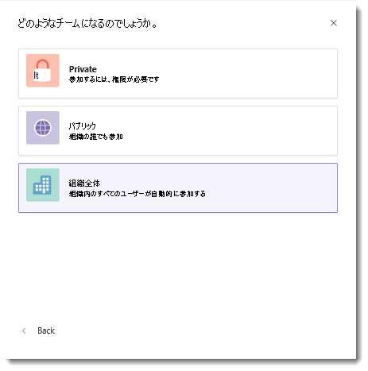

# マイクロソフトのチームで、組織全体にわたるチームを作成します。Create an org-wide team in Microsoft Teams

組織全体にわたるチームの小規模から中規模の組織の 1 つのチームの共同作業の一環として、すべてのユーザーを自動的に手段を提供します。Org-wide teams provide an automatic way for everyone in a small to medium-sized organization to be a part of a single team for collaboration. 
 
組織全体にわたるチームでは、グローバル管理者はパブリックのチームでは、組織内のすべてのユーザーと最新のメンバーシップ ユーザーの結合と Active Directory の組織のままにするを簡単に作成できます。With org-wide teams, global administrators can easily create a public team that pulls in every user in the organization and keeps the membership up to date with Active Directory as users join and leave the organization. グローバル管理者のみが組織全体にわたるチームを作成でき、現在、組織全体にわたるチームは、1,000 未満のユーザーを持つ組織に限定します。Only global admins can create org-wide teams and currently an org-wide team is limited to organizations with no more than 1,000 users. これらの要件を満たしている場合の [**プライバシー** ] でオプションとして、チームを作成するときに管理者に**組織全体**が表示されます。If these requirements are met, admins will see **Org-wide** as an option under **Privacy** when creating a team.

![組織全体にわたるチームを作成するのには [組織全体] オプションのスクリーン ショット](media/create-org-wide-team.png "組織全体にわたるチームを作成するのには [組織全体] オプションのスクリーン ショット")

> [!NOTE]
> チームを作成するときに、[**組織全体**] オプションが表示されないし、あなたは、グローバル管理者、機能のロール アウトするも可能性がありますか、組織が 1000 のメンバーの現在のサイズ制限を超える必要があります。If you don't see the **Org-wide** option when creating a team and you're a global admin, the feature might still be rolling out or your organization might have more than the current size limit of 1000 members. 将来的にこの制限を大きくには求めています。We're looking to increase this limit in future.

組織全体にわたるチームを作成してすべてのグローバル管理者は、チームの所有者として追加されますすべてのアクティブなユーザーは、チームのメンバーとして追加されます。When an org-wide team is created, all global admins are added as team owners and all active users are added as team members. チーム、ゲスト ユーザー、およびほとんどの部屋を無効にするユーザーは、チームに追加されません。Users who are disabled for Teams, guest users, and most rooms aren't added to the team. 組織のディレクトリが新しいアクティブなユーザーを含むように更新または変更は自動的に、ユーザーが社内で機能しなく、自分のチームのライセンスが無効になっている場合は、同期とユーザーの追加やチームから削除します。As your organization's directory is updated to include new active users or if users no longer work at your company and their Teams license is disabled, changes are automatically synced and the users are added or removed from the team. チーム メンバーには、組織全体にわたるチームをできないままにします。Team members can't leave an org-wide team. チームの所有者は、手動で追加または、必要な場合にユーザーを削除することができます。As a team owner, you can manually add or remove users if needed.

> [!NOTE]
> ルームの一覧、機材、およびリソースのアカウントの一部でない会議室を追加または組織全体にわたるチームを同期可能性があります。Rooms that aren't a part of a room list, equipment, and resource accounts might be added or synced to the org-wide team. チームの所有者は、チームから、これらのアカウントを簡単に削除できます。Team owners can easily remove these accounts from the team.

## ベスト ・ プラクティスBest practices
組織全体にわたるチームを最大限に活用、チームの所有者は、次の操作をお勧めします。To get the most out of your org-wide team, we recommend team owners do the following.
### チームの所有者のみが一般的なチャネルへの投稿Allow only team owners to post to the General channel
チャンネルのノイズを軽減するには、チームの所有者は、一般的なチャネルに投稿だけのこと。Reduce channel noise by having only team owners post to the General channel. チームに移動し、**その他のオプション (...)** をクリックします。 > **チームを管理**します。Go to the team and click **More options (…)** > **Manage Team**. [**設定**] タブの [**メンバーのアクセス許可**] をクリックします >**所有者だけがメッセージを投稿**を選択します。On the **Settings** tab, click **Member permissions** > select **Only owners can post messages**.
### @Team をオフにし、@ 参照投稿の [チーム名]Turn off @team and @[team name] mentions
 組織全体をオーバー ロードしないように、@mentions を削減します。Reduce @mentions to keep them from overloading the entire organization. チームに移動し、**その他のオプション (...)** をクリックします。 > **チームを管理**します。Go to the team and click **More options (…)** > **Manage Team**. [**設定**] タブの [ **@mentions** ] をクリックします > をオフに**メンバー @team するためのオプションを表示するか、@[チーム名]**。On the **Settings** tab, click **@mentions** > turn off **Show members the option to @team or @[team name]**. 
### 自動的にお気に入りの重要なチャネルAutomatically favorite important channels
 特定の会話を実施しており、組織内のすべてのユーザーを確認するお気に入りの重要なチャンネルです。Favorite important channels to ensure everyone in your organization engages in specific conversations. 詳細については、[チーム全体の自動-お気に入りのチャンネル](https://support.office.com/article/auto-favorite-channels-for-the-whole-team-a948272c-5aa5-429c-863c-4e1e1cd6b0f6)を参照してください。To learn more, see [Auto-favorite channels for the whole team](https://support.office.com/article/auto-favorite-channels-for-the-whole-team-a948272c-5aa5-429c-863c-4e1e1cd6b0f6).
