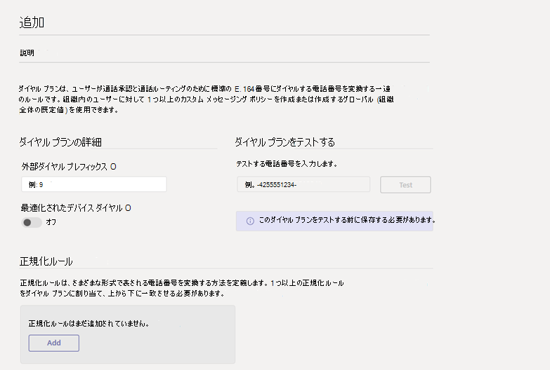

# <a name="create-and-manage-dial-plans"></a><span data-ttu-id="3f19b-103">ダイヤル プランを作成および管理する</span><span class="sxs-lookup"><span data-stu-id="3f19b-103">Create and manage dial plans</span></span>

<span data-ttu-id="3f19b-104">組織のダイヤルプランを計画し、通話ルーティング用に作成する必要があるすべての正規化ルールを把握したら、ダイヤルプランを作成することができます。</span><span class="sxs-lookup"><span data-stu-id="3f19b-104">After you plan the dial plans for your organization and figured out all the normalization rules that need to be created for call routing, you're ready to create the dial plans.</span></span> <span data-ttu-id="3f19b-105">Microsoft Teams 管理センターまたは Windows PowerShell を使用して、ダイヤルプランを作成し、管理することができます。</span><span class="sxs-lookup"><span data-stu-id="3f19b-105">You can use the Microsoft Teams admin center or Windows PowerShell to create and manage dial plans.</span></span>  

## <a name="using-the-microsoft-teams-admin-center"></a><span data-ttu-id="3f19b-106">Microsoft Teams 管理センターの使用</span><span class="sxs-lookup"><span data-stu-id="3f19b-106">Using the Microsoft Teams admin center</span></span>

### <a name="create-a-dial-plan"></a><span data-ttu-id="3f19b-107">ダイヤルプランを作成する</span><span class="sxs-lookup"><span data-stu-id="3f19b-107">Create a dial plan</span></span>

1. <span data-ttu-id="3f19b-108">Microsoft Teams 管理センターの左のナビゲーションで、[**ボイス** > **ダイヤルプラン**] に移動します。</span><span class="sxs-lookup"><span data-stu-id="3f19b-108">In the left navigation of the Microsoft Teams admin center, go to **Voice** > **Dial plan**.</span></span>
2. <span data-ttu-id="3f19b-109">[**追加**] をクリックして、ダイヤルプランの名前と説明を入力します。</span><span class="sxs-lookup"><span data-stu-id="3f19b-109">Click **Add**, and then enter a name and description for the dial plan.</span></span>
    <span data-ttu-id="3f19b-110">![ダイヤルプランを作成するための [追加] ページを示すスクリーンショット](media/create-dial-plan.png)</span><span class="sxs-lookup"><span data-stu-id="3f19b-110"></span></span>
3. <span data-ttu-id="3f19b-111">[**ダイヤルプランの詳細**] で、ユーザーが1つまたは複数の追加の先頭の数字 (9 など) をダイヤルする必要がある場合は、外部ダイヤルのプレフィックスを指定します。</span><span class="sxs-lookup"><span data-stu-id="3f19b-111">Under **Dial plan details**, specify an external dialing prefix if users need to dial one or more additional leading digits (for example, 9) to get an external line.</span></span> <span data-ttu-id="3f19b-112">その手順は次のとおりです。</span><span class="sxs-lookup"><span data-stu-id="3f19b-112">To do this:</span></span>
    1. <span data-ttu-id="3f19b-113">[外線**発信**番号] ボックスに、外線発信番号を入力します。</span><span class="sxs-lookup"><span data-stu-id="3f19b-113">In the **External dialing prefix** box, enter an external dialing prefix.</span></span> <span data-ttu-id="3f19b-114">プレフィックスは、最大4文字 (#、\*、0-9) にすることができます。</span><span class="sxs-lookup"><span data-stu-id="3f19b-114">The prefix can be up to four characters (#,\*, and 0-9).</span></span>
    2. <span data-ttu-id="3f19b-115">最適化された**デバイスダイヤル**をオンにします。</span><span class="sxs-lookup"><span data-stu-id="3f19b-115">Turn on **Optimized device dialing**.</span></span> <span data-ttu-id="3f19b-116">外線発信番号を指定する場合は、組織外に通話を発信できるようにプレフィックスを適用するには、この設定を有効にする必要もあります。</span><span class="sxs-lookup"><span data-stu-id="3f19b-116">If you specify an external dialing prefix, you must also turn on this setting to apply the prefix so calls can be made outside your organization.</span></span>
4. <span data-ttu-id="3f19b-117">[**正規化ルール**] で、ダイヤルプランに1つまたは複数の[正規化ルール](what-are-dial-plans.md#normalization-rules)を構成して関連付けます。</span><span class="sxs-lookup"><span data-stu-id="3f19b-117">Under **Normalization rules**, configure and associate one or more [normalization rules](what-are-dial-plans.md#normalization-rules) for the dial plan.</span></span> <span data-ttu-id="3f19b-118">各ダイヤルプランには、少なくとも1つの正規化ルールが関連付けられている必要があります。</span><span class="sxs-lookup"><span data-stu-id="3f19b-118">Each dial plan must have at least one normalization rule associated with it.</span></span>  <span data-ttu-id="3f19b-119">この操作を行うには、次の操作のいずれか、または複数の操作を行います。</span><span class="sxs-lookup"><span data-stu-id="3f19b-119">To do this, do one or more of the following:</span></span>
    - <span data-ttu-id="3f19b-120">新しい正規化ルールを作成してダイヤルプランに関連付けるには、[**追加**] をクリックして、ルールを定義します。</span><span class="sxs-lookup"><span data-stu-id="3f19b-120">To create a new normalization rule and associate it with the dial plan, click **Add**, and then define the rule.</span></span>
    - <span data-ttu-id="3f19b-121">既にダイヤルプランに関連付けられている正規化ルールを編集するには、ルール名の左側をクリックしてルールを選択し、[**編集**] をクリックします。</span><span class="sxs-lookup"><span data-stu-id="3f19b-121">To edit a normalization rule that's already associated with the dial plan, select the rule by clicking to the left of the rule name, and then click **Edit**.</span></span> <span data-ttu-id="3f19b-122">必要な変更を加えて、[**保存**] をクリックします。</span><span class="sxs-lookup"><span data-stu-id="3f19b-122">Make the changes you want, and then click **Save**.</span></span>
    - <span data-ttu-id="3f19b-123">ダイヤルプランから正規化ルールを削除するには、ルール名の左側をクリックしてルールを選択し、[**削除**] をクリックします。</span><span class="sxs-lookup"><span data-stu-id="3f19b-123">To remove a normalization rule from the dial plan, select the rule by clicking to the left of the rule name, and then click **Remove**.</span></span>
5. <span data-ttu-id="3f19b-124">目的の順序で正規化ルールを配置します。</span><span class="sxs-lookup"><span data-stu-id="3f19b-124">Arrange the normalization rules in the order that you want.</span></span> <span data-ttu-id="3f19b-125">一覧のルールの位置を変更するには、[**上へ移動**] または [**下**へ移動] をクリックします。</span><span class="sxs-lookup"><span data-stu-id="3f19b-125">Click **Move up** or **Move down** to change the position of rules in the list.</span></span>

    > [!NOTE]
    > <span data-ttu-id="3f19b-126">チームは正規化ルールの一覧を上から下に移動し、ダイヤルされた番号に一致する最初のルールを使用します。</span><span class="sxs-lookup"><span data-stu-id="3f19b-126">Teams traverses the list of normalization rules from the top down and uses the first rule that matches the dialed number.</span></span> <span data-ttu-id="3f19b-127">ダイヤルプランを設定して、ダイヤルした番号が複数の正規化ルールと一致するようにする場合は、制限の少ない制限を超えて、より制限されたルールが並べ替えられるようにします。</span><span class="sxs-lookup"><span data-stu-id="3f19b-127">If you set up a dial plan so that a dialed number can match more than one normalization rule, make sure the more restrictive rules are sorted above the less restrictive ones.</span></span>

6. <span data-ttu-id="3f19b-128">**[保存]** をクリックします。</span><span class="sxs-lookup"><span data-stu-id="3f19b-128">Click **Save**.</span></span>
7. <span data-ttu-id="3f19b-129">ダイヤルプランをテストするには、[**ダイヤルプランのテスト**] で電話番号を入力し、[**テスト**] をクリックします。</span><span class="sxs-lookup"><span data-stu-id="3f19b-129">If you want to test the dial plan, under **Test dial plan**, enter a phone number, and then click **Test**.</span></span>

### <a name="edit-a-dial-plan"></a><span data-ttu-id="3f19b-130">ダイヤルプランを編集する</span><span class="sxs-lookup"><span data-stu-id="3f19b-130">Edit a dial plan</span></span>

1. <span data-ttu-id="3f19b-131">Microsoft Teams 管理センターの左のナビゲーションで、[**ボイス** > **ダイヤルプラン**] に移動します。</span><span class="sxs-lookup"><span data-stu-id="3f19b-131">In the left navigation of the Microsoft Teams admin center, go to **Voice** > **Dial plan**.</span></span>
2. <span data-ttu-id="3f19b-132">ダイヤルプラン名の左側をクリックして、[**編集**] をクリックして、ダイヤルプランを選択します。</span><span class="sxs-lookup"><span data-stu-id="3f19b-132">Select the dial plan by clicking to the left of the dial plan name, and then click **Edit**.</span></span>
3. <span data-ttu-id="3f19b-133">必要な変更を加えて、[**保存**] をクリックします。</span><span class="sxs-lookup"><span data-stu-id="3f19b-133">Make the changes that you want, and then click **Save**.</span></span>

### <a name="add-users-to-a-dial-plan"></a><span data-ttu-id="3f19b-134">ダイヤルプランにユーザーを追加する</span><span class="sxs-lookup"><span data-stu-id="3f19b-134">Add users to a dial plan</span></span>

1. <span data-ttu-id="3f19b-135">Microsoft Teams 管理センターの左側のナビゲーションで、[**ユーザー**] に移動します。</span><span class="sxs-lookup"><span data-stu-id="3f19b-135">In the left navigation of the Microsoft Teams admin center, go to **Users**.</span></span>
2. <span data-ttu-id="3f19b-136">表示名をクリックしてユーザーを選びます。</span><span class="sxs-lookup"><span data-stu-id="3f19b-136">Select the user by clicking the display name.</span></span>
3. <span data-ttu-id="3f19b-137">[**ポリシー** ] タブを選択します。</span><span class="sxs-lookup"><span data-stu-id="3f19b-137">Select the **Policies** tab.</span></span>
4. <span data-ttu-id="3f19b-138">[割り当てられたポリシー] の右にある [**編集**] をクリックします。</span><span class="sxs-lookup"><span data-stu-id="3f19b-138">Click **Edit** to the right of Assigned policies.</span></span>
5. <span data-ttu-id="3f19b-139">[ **Dial plan** ] ドロップダウンメニューで、ユーザーに割り当てるダイヤルプランを選択し、[**適用**] をクリックします。</span><span class="sxs-lookup"><span data-stu-id="3f19b-139">From the **Dial plan** drop-down menu, select the dial plan you want to assign to the user and then click **Apply**.</span></span>

## <a name="using-powershell"></a><span data-ttu-id="3f19b-140">PowerShell を使用する場合</span><span class="sxs-lookup"><span data-stu-id="3f19b-140">Using PowerShell</span></span>
  
### <a name="verify-and-start-remote-powershell"></a><span data-ttu-id="3f19b-141">リモート PowerShell を確認して開始する</span><span class="sxs-lookup"><span data-stu-id="3f19b-141">Verify and start Remote PowerShell</span></span>

 <span data-ttu-id="3f19b-142">**Windows PowerShell バージョン3.0 以降を実行していることを確認する**</span><span class="sxs-lookup"><span data-stu-id="3f19b-142">**Check that you are running Windows PowerShell version 3.0 or later**</span></span>
  
1. <span data-ttu-id="3f19b-143">バージョン3.0 以降を実行していることを確認するには、「**Windows PowerShell**を**開始する」** > をご覧ください。</span><span class="sxs-lookup"><span data-stu-id="3f19b-143">To verify that you're running version 3.0 or higher: **Start Menu** > **Windows PowerShell**.</span></span>
    
2. <span data-ttu-id="3f19b-144">[ _Windows PowerShell_] ウィンドウに「 **Get-Host**」と入力して、バージョンを確認します。</span><span class="sxs-lookup"><span data-stu-id="3f19b-144">Check the version by typing  _Get-Host_ in the **Windows PowerShell** window.</span></span>
    
3. <span data-ttu-id="3f19b-145">バージョン3.0 以降を使っていない場合は、Windows PowerShell に更新プログラムをダウンロードしてインストールします。</span><span class="sxs-lookup"><span data-stu-id="3f19b-145">If you don't have version 3.0 or later, download and install updates to Windows PowerShell.</span></span> <span data-ttu-id="3f19b-146">Windows PowerShell をバージョン4.0 にダウンロードして更新するには、「 [Windows Management Framework 4.0](https://go.microsoft.com/fwlink/?LinkId=716845) 」を参照してください。</span><span class="sxs-lookup"><span data-stu-id="3f19b-146">See [Windows Management Framework 4.0](https://go.microsoft.com/fwlink/?LinkId=716845) to download and update Windows PowerShell to version 4.0.</span></span> <span data-ttu-id="3f19b-147">メッセージが表示されたら、コンピューターを再起動します。</span><span class="sxs-lookup"><span data-stu-id="3f19b-147">Restart your computer when you're prompted.</span></span>
    
4. <span data-ttu-id="3f19b-148">また、skype for business online に接続するリモート Windows PowerShell セッションを作成できるようにする、Skype for Business Online 用の Windows PowerShell モジュールをインストールする必要もあります。</span><span class="sxs-lookup"><span data-stu-id="3f19b-148">You'll also need to install the Windows PowerShell module for Skype for Business Online that enables you to create a remote Windows PowerShell session that connects to Skype for Business Online.</span></span> <span data-ttu-id="3f19b-149">このモジュールは、64ビットのコンピューターでのみサポートされていますが、 [Skype For Business Online 用の Windows PowerShell モジュール](https://go.microsoft.com/fwlink/?LinkId=294688)でダウンロードできます。</span><span class="sxs-lookup"><span data-stu-id="3f19b-149">You can download this module, which is supported only on 64-bit computers, at [Windows PowerShell Module for Skype for Business Online](https://go.microsoft.com/fwlink/?LinkId=294688).</span></span> <span data-ttu-id="3f19b-150">メッセージが表示されたら、コンピューターを再起動します。</span><span class="sxs-lookup"><span data-stu-id="3f19b-150">Restart your computer if you're prompted.</span></span>
    
<span data-ttu-id="3f19b-151">詳細については、「[単一の Windows PowerShell ウィンドウですべての Office 365 サービスに接続する](https://docs.microsoft.com/office365/enterprise/powershell/connect-to-all-office-365-services-in-a-single-windows-powershell-window)」を参照してください。</span><span class="sxs-lookup"><span data-stu-id="3f19b-151">To learn more, see [Connect to all Office 365 services in a single Windows PowerShell window](https://docs.microsoft.com/office365/enterprise/powershell/connect-to-all-office-365-services-in-a-single-windows-powershell-window).</span></span>
  
 <span data-ttu-id="3f19b-152">**Windows PowerShell セッションを開始する**</span><span class="sxs-lookup"><span data-stu-id="3f19b-152">**Start a Windows PowerShell session**</span></span>
  
1. <span data-ttu-id="3f19b-153">[ **Start** > **Windows PowerShell**を起動します] をクリックします。</span><span class="sxs-lookup"><span data-stu-id="3f19b-153">Click **Start** > **Windows PowerShell**.</span></span>
    
2. <span data-ttu-id="3f19b-154">[ **Windows PowerShell**] ウィンドウで、次を実行して、Office 365 の組織に接続します。</span><span class="sxs-lookup"><span data-stu-id="3f19b-154">In the **Windows PowerShell** window, connect to your Office 365 organization by running:</span></span>
    
    > [!NOTE]
    > <span data-ttu-id="3f19b-155">Skype for Business Online Windows PowerShell モジュールを初めて使用するときに、 **Import-Module** コマンドを実行するだけです。</span><span class="sxs-lookup"><span data-stu-id="3f19b-155">You only have to run the **Import-Module** command the first time you use the Skype for Business Online Windows PowerShell module.</span></span>
  

    ```PowerShell
    Import-Module "C:\\Program Files\\Common Files\\Skype for Business Online\\Modules\\SkypeOnlineConnector\\SkypeOnlineConnector.psd1"
    $credential = Get-Credential
    $session = New-CsOnlineSession -Credential $credential
    Import-PSSession $session
    ```
  
### <a name="create-and-manage-your-dial-plans"></a><span data-ttu-id="3f19b-156">ダイヤルプランを作成して管理する</span><span class="sxs-lookup"><span data-stu-id="3f19b-156">Create and manage your dial plans</span></span>

<span data-ttu-id="3f19b-157">テナント ダイヤル プランを作成および管理するために単一のコマンドレットまたは PowerShell スクリプトのいずれかを使用できます。</span><span class="sxs-lookup"><span data-stu-id="3f19b-157">You can either use a single cmdlet or a PowerShell script to create and manage tenant dial plans.</span></span>
  
#### <a name="using-single-cmdlets"></a><span data-ttu-id="3f19b-158">単一のコマンドレットの使用</span><span class="sxs-lookup"><span data-stu-id="3f19b-158">Using single cmdlets</span></span>

- <span data-ttu-id="3f19b-159">ダイヤル プランを新規作成するには、次を実行します。</span><span class="sxs-lookup"><span data-stu-id="3f19b-159">To create a new dial plan, run:</span></span>
    
  ```PowerShell
  New-CsTenantDialPlan -Identity RedmondDialPlan -Description "Dial Plan for Redmond" -NormalizationRules <pslistmodifier> -ExternalAccessPrefix 9 -SimpleName "Dial-Plan-for-Redmond"
  ```

    <span data-ttu-id="3f19b-160">その他の例とパラメーターについては、「[New-CsTenantDialPlan](https://docs.microsoft.com/powershell/module/skype/new-cstenantdialplan)」をご覧ください。</span><span class="sxs-lookup"><span data-stu-id="3f19b-160">For other examples and parameters, see [New-CsTenantDialPlan](https://docs.microsoft.com/powershell/module/skype/new-cstenantdialplan).</span></span>
    
- <span data-ttu-id="3f19b-161">既存のダイヤルプランの設定を編集するには、次を実行します。</span><span class="sxs-lookup"><span data-stu-id="3f19b-161">To edit the settings of an existing dial plan, run:</span></span>
    
  ```PowerShell
  Set-CsTenantDialPlan -Identity RedmondDialPlan  -NormalizationRules <pslistmodifier> -ExternalAccessPrefix 9
    -SimpleName "Dial-Plan-for-Redmond"
  ```

    <span data-ttu-id="3f19b-162">その他の例とパラメータについては、「[Set-CsTenantDialPlan](https://docs.microsoft.com/powershell/module/skype/set-cstenantdialplan)」をご覧ください。</span><span class="sxs-lookup"><span data-stu-id="3f19b-162">For other examples and parameters, see [Set-CsTenantDialPlan](https://docs.microsoft.com/powershell/module/skype/set-cstenantdialplan).</span></span>
    
- <span data-ttu-id="3f19b-163">ユーザーをダイヤル プランに追加するには、次を実行します。</span><span class="sxs-lookup"><span data-stu-id="3f19b-163">To add users to a dial plan, run:</span></span>
    
  ```PowerShell
  Grant-CsTenantDialPlan -Identity amos.marble@contoso.com -PolicyName RedmondDialPlan
  ```

    <span data-ttu-id="3f19b-164">その他の例とパラメータについては、「[Grant-CsTenantDialPlan](https://docs.microsoft.com/powershell/module/skype/grant-cstenantdialplan)」をご覧ください。</span><span class="sxs-lookup"><span data-stu-id="3f19b-164">For other examples and parameters, see [Grant-CsTenantDialPlan](https://docs.microsoft.com/powershell/module/skype/grant-cstenantdialplan).</span></span>
    
- <span data-ttu-id="3f19b-165">ダイヤル プランの設定を表示するには、次を実行します。</span><span class="sxs-lookup"><span data-stu-id="3f19b-165">To view the settings on a dial plan, run:</span></span>
    
  ```PowerShell
  Get-CsTenantDialPlan -Identity RedmondDialPlan
  ```

    <span data-ttu-id="3f19b-166">その他の例とパラメータについては、「[Get-CsTenantDialPlan](https://docs.microsoft.com/powershell/module/skype/get-cstenantdialplan?view=skype-ps)」をご覧ください。</span><span class="sxs-lookup"><span data-stu-id="3f19b-166">For other examples and parameters, see [Get-CsTenantDialPlan](https://docs.microsoft.com/powershell/module/skype/get-cstenantdialplan?view=skype-ps).</span></span>
    
- <span data-ttu-id="3f19b-167">ダイヤル プランを削除するには、次を実行します。</span><span class="sxs-lookup"><span data-stu-id="3f19b-167">To delete a dial plan, run:</span></span>
    
  ```PowerShell
  Remove-CsTenantDialPlan -Identity RedmondDialPlan -force
  ```

    <span data-ttu-id="3f19b-168">その他の例とパラメータについては、「[Remove-CsTenantDialPlan](https://docs.microsoft.com/powershell/module/skype/remove-cstenantdialplan?view=skype-ps)」をご覧ください。</span><span class="sxs-lookup"><span data-stu-id="3f19b-168">For other examples and parameters, see [Remove-CsTenantDialPlan](https://docs.microsoft.com/powershell/module/skype/remove-cstenantdialplan?view=skype-ps).</span></span>
    
- <span data-ttu-id="3f19b-169">有効なダイヤル プランの設定を表示するには、次を実行します。</span><span class="sxs-lookup"><span data-stu-id="3f19b-169">To see the settings of the effective dial plan, run:</span></span>
    
  ```PowerShell
  Get-CsEffectiveTenantDialPlan -Identity amos.marble@contoso.com
  ```

    <span data-ttu-id="3f19b-170">その他の例とパラメータについては、「[Get-CsEffectiveTenantDialPlan](https://docs.microsoft.com/powershell/module/skype/get-cseffectivetenantdialplan)」をご覧ください。</span><span class="sxs-lookup"><span data-stu-id="3f19b-170">For other examples and parameters, see [Get-CsEffectiveTenantDialPlan](https://docs.microsoft.com/powershell/module/skype/get-cseffectivetenantdialplan).</span></span>
    
- <span data-ttu-id="3f19b-171">ダイヤル プランの有効な設定をテストするには、次を実行します。</span><span class="sxs-lookup"><span data-stu-id="3f19b-171">To test the effective settings of a dial plan, run:</span></span>
    
  ```PowerShell
  Test-CsEffectiveTenantDialPlan -DialedNumber 14255550199 -Identity amos.marble@contoso.com
  ```

    <span data-ttu-id="3f19b-172">その他の例とパラメータについては、「[Test-CsEffectiveTenantDialPlan](https://docs.microsoft.com/powershell/module/skype/test-cseffectivetenantdialplan?view=skype-ps)」をご覧ください。</span><span class="sxs-lookup"><span data-stu-id="3f19b-172">For other examples and parameters, see [Test-CsEffectiveTenantDialPlan](https://docs.microsoft.com/powershell/module/skype/test-cseffectivetenantdialplan?view=skype-ps).</span></span>
    
#### <a name="using-a-powershell-script"></a><span data-ttu-id="3f19b-173">PowerShell スクリプトの使用</span><span class="sxs-lookup"><span data-stu-id="3f19b-173">Using a PowerShell script</span></span>

<span data-ttu-id="3f19b-174">これを実行して、最初にテナントダイヤルプランを削除することなく、テナントダイヤルプランに関連付けられている正規化ルールを削除します。</span><span class="sxs-lookup"><span data-stu-id="3f19b-174">Run this to delete a normalization rule that is associated with a tenant dial plan without needing to delete the tenant dial plan first:</span></span>
```PowerShell
$b1=New-CsVoiceNormalizationRule -Identity Global/NR4 -InMemory
Set-CsTenantDialPlan -Identity RedmondDialPlan -NormalizationRules @{add=$b1}
(Get-CsTenantDialPlan -Identity RedmondDialPlan).NormalizationRules
$b2=New-CsVoiceNormalizationRule -Identity Global/NR4 -InMemory
Set-CsTenantDialPlan -Identity RedmondDialPlan -NormalizationRules @{remove=$b2}
```
<span data-ttu-id="3f19b-175">これを実行して、次の正規化ルールを RedmondDialPlan という名前の既存のテナント ダイヤル プランに追加します。</span><span class="sxs-lookup"><span data-stu-id="3f19b-175">Run this to add the following normalization rule to the existing tenant dial plan named RedmondDialPlan.</span></span>
```PowerShell
$nr1=New-CsVoiceNormalizationRule -Parent Global -Description 'Organization extension dialing' -Pattern '^(\\d{3})$' -Translation '+14255551$1' -Name NR1 -IsInternalExtension $false -InMemory
Set-CsTenantDialPlan -Identity RedmondDialPlan -NormalizationRules @{add=$nr1}
```
<span data-ttu-id="3f19b-176">これを実行して、次の正規化ルールを RedmondDialPlan という名前の既存のテナント ダイヤル プランから削除します。</span><span class="sxs-lookup"><span data-stu-id="3f19b-176">Run this to remove the following normalization rule from the existing tenant dial plan named RedmondDialPlan.</span></span>
```PowerShell
$nr1=New-CsVoiceNormalizationRule -Parent Global/NR1 -InMemory
Set-CsTenantDialPlan -Identity RedmondDialPlan -NormalizationRules @{remove=$nr1}
```

<span data-ttu-id="3f19b-p112">既存の正規化ルールを調べて、どれを削除するかを決定し、そのインデックスを使用して削除するときには、次を実行します。正規化ルールの配列は、インデックス 0 で開始します。インデックス 1 である、3 桁の正規化ルールを削除する必要があります。</span><span class="sxs-lookup"><span data-stu-id="3f19b-p112">Run the following when you want to also examine the existing normalization rules, determine which one you want to delete, and then use its index to remove it. The array of normalization rules starts with index 0. We would like to remove the 3-digit normalization rule, so that is index 1.</span></span>
  
```PowerShell
Get-CsTenantDialPlan RedmondDialPlan).NormalizationRules
Description         : 4-digit
Pattern             : ^(\\d{4})$
Translation         : +1426666$1
Name                : NR2
IsInternalExtension : False

Description         : 3-digit
Pattern             : ^(\\d{3})$
Translation         : +14255551$1
Name                : NR12
IsInternalExtension : False

$nr1=(Get-CsTenantDialPlan RedmondDialPlan).NormalizationRules[1]
Set-CsTenantDialPlan -Identity RedmondDialPlan -NormalizationRules @{remove=$nr1}
```

<span data-ttu-id="3f19b-180">これを実行して、RedmondDialPlan テナント ダイヤル プランが付与されているすべてのユーザーを見つけます。</span><span class="sxs-lookup"><span data-stu-id="3f19b-180">Run this to find all users who have been granted the RedmondDialPlan tenant dial plan.</span></span>
  
```PowerShell
Get-CsOnlineUser | Where-Object {$_.TenantDialPlan -eq "RedmondDialPlan"}
```

<span data-ttu-id="3f19b-181">これを実行して、HostingProvider の sipfed.online.lync.com を持つすべてのユーザーから割り当てられている TenantDialPlan を削除します。</span><span class="sxs-lookup"><span data-stu-id="3f19b-181">Run this to remove any assigned TenantDialPlan from all users who have a HostingProvider of sipfed.online.lync.com.</span></span>
```PowerShell
Get-CsOnlineUser -Filter {HostingProvider -eq “sipfed.online.lync.com”} | Grant-CsTenantDialPlan -policyname $null
```

<span data-ttu-id="3f19b-p113">これらを実行して、OPDP1 という名前の既存のオンプレミス ダイヤル プランを組織のテナント ダイヤル プランとして追加します。まずオンプレミス ダイヤル プランを xml ファイルに保存してから、それを使用して新しいテナント ダイヤル プランを作成する必要があります。</span><span class="sxs-lookup"><span data-stu-id="3f19b-p113">Run these to add the existing on-premises dial plan named OPDP1 as a tenant dial plan for your organization. You need to first save the on-premises dial plan to an .xml file, and then use it to create the new tenant dial plan.</span></span>
  
<span data-ttu-id="3f19b-184">これを実行して、オンプレミス ダイヤル プランを xml ファイルに保存します。</span><span class="sxs-lookup"><span data-stu-id="3f19b-184">Run this to save the on-premises dial plan to the .xml file.</span></span>
  
```PowerShell
$DPName = "OPDP1"
$DPFileName = "dialplan.xml"
Get-CsDialplan $DPName | Export-Clixml $DPFileName
```

<span data-ttu-id="3f19b-185">これを実行して、新しいテナント ダイヤル プランを作成します。</span><span class="sxs-lookup"><span data-stu-id="3f19b-185">Run this to create the new tenant dial plan.</span></span>
  
```PowerShell
$DPFileName = "dialplan.xml"
$dp = Import-Clixml $DPFileName
$NormRules = @()
ForEach($nr in $dp.NormalizationRules)
{
 $id1 = "Global/" + $nr.Name
 $nr2 = New-CsVoiceNormalizationRule -Identity $id1 -Description $nr.Description -Pattern $nr.Pattern -Translation $nr.Translation -IsInternalExtension $nr.IsInternalExtension -InMemory
 $NormRules += $nr2
}
New-CsTenantDialPlan -Identity $dp.SimpleName -ExternalAccessPrefix $dp.ExternalAccessPrefix -Description $dp.Description -OptimizeDeviceDialing $dp.OptimizeDeviceDialing -SimpleName $dp.SimpleName -NormalizationRules $NormRules
```
    
## <a name="related-topics"></a><span data-ttu-id="3f19b-186">関連項目</span><span class="sxs-lookup"><span data-stu-id="3f19b-186">Related topics</span></span>

- [<span data-ttu-id="3f19b-187">ダイヤル プランについて</span><span class="sxs-lookup"><span data-stu-id="3f19b-187">What are dial plans?</span></span>](what-are-dial-plans.md)
- [<span data-ttu-id="3f19b-188">電話番号の移行に関するよくある質問</span><span class="sxs-lookup"><span data-stu-id="3f19b-188">Transferring phone numbers common questions</span></span>](transferring-phone-numbers-common-questions.md)
- [<span data-ttu-id="3f19b-189">通話プランで使用されるさまざまな種類の電話番号</span><span class="sxs-lookup"><span data-stu-id="3f19b-189">Different kinds of phone numbers used for Calling Plans</span></span>](different-kinds-of-phone-numbers-used-for-calling-plans.md)
- [<span data-ttu-id="3f19b-190">組織の電話番号を管理する</span><span class="sxs-lookup"><span data-stu-id="3f19b-190">Manage phone numbers for your organization</span></span>](manage-phone-numbers-for-your-organization/manage-phone-numbers-for-your-organization.md)
- [<span data-ttu-id="3f19b-191">緊急通話の利用条件</span><span class="sxs-lookup"><span data-stu-id="3f19b-191">Emergency calling terms and conditions</span></span>](emergency-calling-terms-and-conditions.md)
- <span data-ttu-id="3f19b-192">[緊急通話の免責事項ラベル](https://github.com/MicrosoftDocs/OfficeDocs-SkypeForBusiness/blob/live/Teams/downloads/emergency-calling/emergency-calling-label-(en-us)-(v.1.0).zip?raw=true)</span><span class="sxs-lookup"><span data-stu-id="3f19b-192">[Emergency calling disclaimer label](https://github.com/MicrosoftDocs/OfficeDocs-SkypeForBusiness/blob/live/Teams/downloads/emergency-calling/emergency-calling-label-(en-us)-(v.1.0).zip?raw=true)</span></span>
- [<span data-ttu-id="3f19b-193">Teams での PowerShell の概要</span><span class="sxs-lookup"><span data-stu-id="3f19b-193">Teams PowerShell overview</span></span>](teams-powershell-overview.md)
