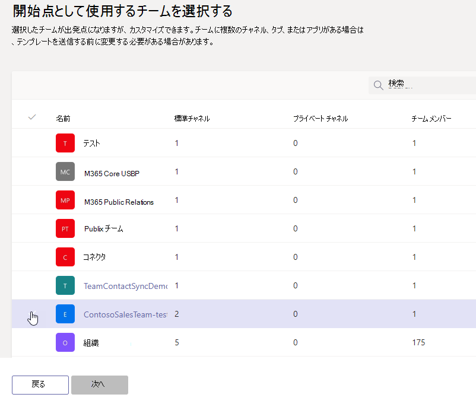

# Microsoft Teams で既存のチームからテンプレートを作成する

[!INCLUDE [template](includes/preview-feature.md)]

**カスタムテンプレートは、EDU のユーザーに対してまだサポートされていません。**

Microsoft Teams を使用すると、特定の組織のニーズに合わせて保存したり変更したりできる既存のチームからテンプレートを作成できます。

1. Teams 管理センターにサインインします。

2. 左側のナビゲーションで、[**チーム**  >  **チームテンプレート**] を展開します。

3. [ **追加**] を選びます。

4. [ **既存のチームをテンプレートとして使用する**] を選択し、[ **次へ**] を選択します。

 ![[既存のチームをテンプレートとして使用する] が強調表示された [チームテンプレートの開始位置] 画面の画像。](media/team-existing-team-as-template.png)

5. 開始点として使用するチームを選択するには、チーム名の横にあるを選択し、[ **次へ**] を選択します。

6. [ **テンプレートの設定** ] セクションで、次のフィールドに情報を入力し、[ **次へ**] を選択します。
    - テンプレート名
    - テンプレートの短い説明と長い説明
    - ロケールの表示  
  
7. [ **チャネル]、[タブ]、[アプリ** ] セクションで、チームに必要なチャネルとアプリを追加します。

    1. [ **チャネル** ] セクションで、[ **追加**] を選択します。
    2. [ **追加** ] ダイアログで、チャネルの名前を入力します。
    3. 説明を追加します。
    4. チャネルを既定で表示するかどうかを決定します。
    5. チャネルに追加するアプリ名を検索します。
    6. 完了したら [ **適用** ] を選択します。

8. [ **送信** ] を選択して変更内容を保存します。

新しいテンプレートが [ **チームテンプレート** ] の一覧に表示されます。 このテンプレートを使用して、Teams でチームを作成できます。

## 関連記事

- [管理センターでチームテンプレートの使用を開始する](get-started-with-teams-templates-in-the-admin-console.md)
- [既存のチームテンプレートからテンプレートを作成する](create-template-from-existing-template.md)
- [チームテンプレートを作成する](create-a-team-template.md)
