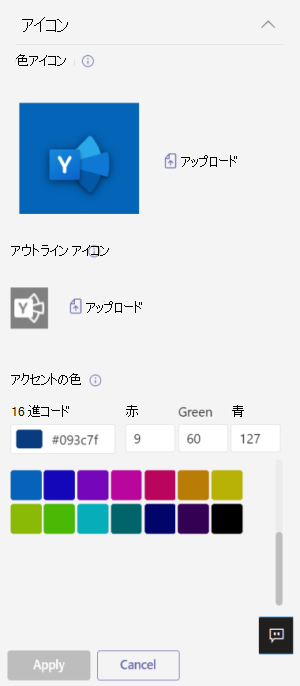
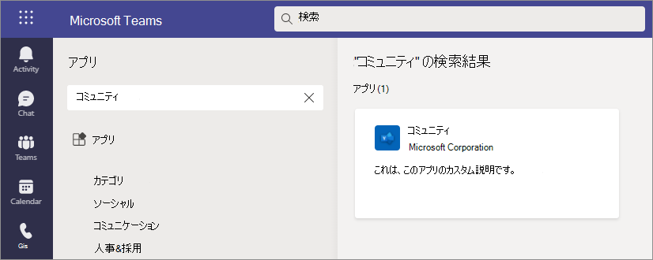
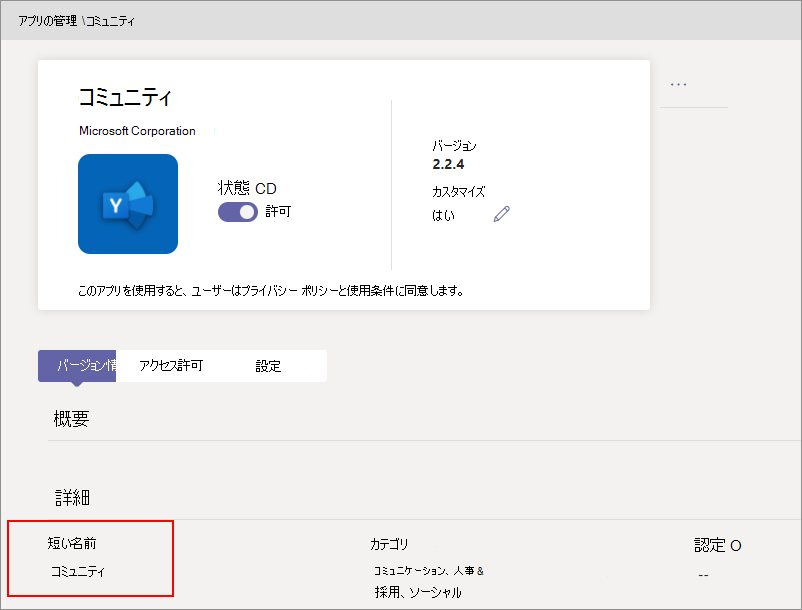

# Microsoft Teams でアプリをカスタマイズするCustomize apps in Microsoft Teams

[!INCLUDE [preview-feature](includes/preview-feature.md)]

 Microsoft Teams では、Teams のエクスペリエンスを向上させるアプリのカスタマイズが提供されます。Microsoft Teams provides app customization to enhance the Teams experience. 一部のアプリ開発者は、Teams 管理者によってアプリをカスタマイズできます。管理者は、Teams 管理センターの [アプリの管理] ページを使用して、組織のニーズに基づいてアプリのプロパティをカスタマイズまたは再 **ブランド** 化できます。Some app developers allow an app to be customized by the Teams admin. The admin can customize or rebrand the app properties based on the organizational needs using the Teams admin center **Manage apps** page. カスタマイズできる詳細は次のとおりです。The details you can customize are:

- 短い名前Short name
- 簡単な説明Short description
- 完全な説明Full description
- プライバシー ポリシーの URLPrivacy policy URL
- Web サイトの URLWebsite URL
- 利用規約の URLTerms of use URL
- [色] アイコンColor icon
- [アウトライン] アイコンOutline icon
- アクセントの色Accent color

カスタマイズできる [フィールドの詳細については](https://docs.microsoft.com/microsoftteams/platform/resources/schema/manifest-schema) 、Teams マニフェスト スキーマを参照してください。See the [Teams Manifest schema](https://docs.microsoft.com/microsoftteams/platform/resources/schema/manifest-schema) for details about the fields that you can customize.

> [!NOTE]
> 現時点では、Government Community Cloud High (GCCH) または国防総省 (DoD) では、アプリのカスタマイズはサポートされていません。Customizing apps isn't supported in Government Community Cloud High (GCCH) or Department of Defense (DoD) at this time.

## アプリの詳細をカスタマイズするCustomize the app's details

アプリのカスタマイズを開始するには、次の手順を実行します。To start customizing an app, complete the following steps:

1. Teams 管理センターにサインインします。Sign in to the Teams admin center.
2. [Teams **Apps] を展開し** 、[アプリの **管理] を選択します**。Expand **Teams Apps** and select **Manage apps**.
3. アプリの **一覧の** [カスタマイズ可能] 列を確認し、カスタマイズ可能なアプリで並べ替えを行います。Check the **Customizable** column of the apps list and sort by apps that are customizable.

   

   カスタマイズ機能にアクセスするには、次の 3 つのエントリ ポイントがあります。There are three entry points to access the customize feature:

   - カスタマイズするアプリの横で選択し、[カスタマイズ] を **選択します**。Select next to the app that you want to customize, and then select **Customize**.

     ![[選択のカスタマイズ] オプション 1](media/select-app-to-customize1.png)

   - アプリ名を選択し、[カスタマイズ可能 **] を選択します**。Select the app name and then **Customizable**.

     ![[選択のカスタマイズ] オプション 2](media/app-details-customizable.png)

   - アプリ名を選択し、[アクション] ドロップダウン **から [カスタマイズ** ] **を選択** します。Select the app name, and then select **Customize** from the **Actions** dropdown.

     ![[選択のカスタマイズ] オプション 3](media/customize-action-menu.png)

4. [詳細] **セクションを** 展開し、次のフィールドをカスタマイズします。Expand the **Details** section and customize the following fields:

    - 短い名前Short name
    - 簡単な説明Short description
    - 完全な説明Full description
    - Web サイトWebsite
    - プライバシー ポリシーの URLPrivacy policy URL
    - 利用規約の URLTerms of use URL

   

> [!Note]
> アプリ開発者がカスタマイズ可能として割り当てたフィールドだけが表示されます。Only the fields that the app developer has assigned as customizable will be visible.

5. [アイコン] **セクションを展開** します。Expand the **Icon** section.

   a.a. アイコンをアップロードします。Upload an icon. 1 つのフルカラー アイコン (192x192) ピクセルを PNG 形式で使用します。Use one full-color icon (192x192) pixel in PNG format.

   b.b. アイコンのアウトラインの色を選択します。Choose an icon outline color. PNG 形式で 1 つの透明なアウトライン (32x32) ピクセルを使用します。Use one transparent outline (32x32) pixel in PNG format.

   c.c. アイコンに一致するアプリのアクセントカラーを選択します。Select an app accent color that matches the icon.

    

6. アプリをカスタマイズしたら、[適用] を **選択します**。Once your app has been customized, select **Apply**.

7. [発行 **] を** 選択して、カスタマイズしたアプリを発行します。Select **Publish** to publish the customized app.

   カスタマイズしたアプリが [アプリの管理] ページ **に表示** されます。The customized app is now listed in your **Manage apps** page. アプリの機能をカスタマイズしてもアプリのコピーは作成できないので、アプリのバージョンは 1 つのみです。You'll have only one version of the app, since customizing the app features doesn't create a copy of the app.

これで、Teams エンド ユーザーは Teams クライアントを開き、カスタマイズされたアプリを表示できます。Now your Teams end users can open their Teams client to see the customized app.

   

### アプリをカスタマイズするための特別な考慮事項Special considerations for customizing an app

次のノートには、アプリのカスタマイズに関する重要な詳細が含まれています。The following note includes important details about customizing an app.

> [!Note]
> - アプリとアプリに関連する説明をカスタマイズする場合は、アプリの発行元がドキュメントまたは使用条件で提供する場合は、カスタマイズガイドラインに従ってください。When you customize apps, and any description related to an app, ensure that you follow any customization guidelines if provided by the app publisher in their documentation or terms of use. また、使用する可能性のあるサードパーティの画像に関して、他のユーザーの権利を尊重する責任も負います。You're also responsible for respecting the rights of others regarding any third-party images you might use.
> - 管理者が指定したカスタマイズ データは、最も近いリージョンに格納されます。Admin-provided customization data is stored in the nearest region.
> - 利用規約またはプライバシー ポリシーへのリンクが有効な場合は、お客様が責任を負います。You are responsible for ensuring that links to terms of use or privacy policy are valid.
> - アプリ発行元がフィールドをカスタマイズできなくなった場合は、アプリの詳細ページに、カスタマイズできないフィールドについて管理者に通知するメッセージが表示されます。In case the app publisher no longer allows a field to be customizable, a message appears on the app details page notifying the admin about the fields that can't be customized any longer. そのフィールドに加えた変更はすべて、元の値に戻されます。All the changes made to that field will be reverted to the original values.
> - ユーザーが変更を表示するには、ブランドの変更に最大 24 時間が必要になる場合があります。Changes to branding might require up to 24 hours for the users to see the changes.

## アプリの詳細を確認するReview app details

アプリの詳細を確認して情報を確認したい場合があります。You might want to see the app details to review the information.

1. Teams 管理センターにサインインします。Sign in to the Teams admin center.

2. ［**Teams アプリ**］ を開き、［**アプリの管理**］ を選択します。Expand **Teams apps** and select **Manage apps**.

3. アプリ名を選択します。Select the app name.

4. 元のアプリ名を含むアプリの詳細を表示 **するパブリッシャーからの短い名前**。View the app details, including the original app name **Short name from publisher**.

   

   [ **発行元からの短い** 名前] フィールドは、アプリの短い名前を変更した場合にのみ表示されます。The **Short name from publisher** field is only visible if you've changed the app's short name.

## アプリの詳細を既定にリセットするReset app details to default

アプリの詳細は、いつでも元の設定にリセットできます。At any time, you can reset the app details to the original settings.

1. Teams 管理センターにサインインします。Sign in to the Teams admin center.

2. [Teams **Apps] を展開し** 、[アプリの **管理] を選択します**。Expand **Teams Apps** and select **Manage apps**.

3. アプリ名を選択します。Select the app name.

4. [アクション **] ドロップダウンから [既定値に** リセット] **を選択** します。Select **Reset to default** from the **Actions** dropdown.

   ![[リセット] を選択して既定の強調表示に戻す](media/select-reset.png)

## よく寄せられる質問Frequently asked questions

**ユーザーがカスタマイズしたアプリを表示するにはどのくらいの時間が必要ですか?****How long will it take for my users to see the customized app?**

管理者は Teams 管理センターで変更をすぐに確認することができますが、エンド ユーザーが変更を確認するには、最大で 24 時間かかる場合があります。Although the admin can immediately see the changes in Teams Admin Center, it might take up to 24 hours for the end users to see the changes.  

**アプリ プロバイダーは、顧客向けアプリをカスタマイズできますか?****Can the app provider customize the app for its customers?**

 いいえ、テナントの管理者は、Teams 管理センターを使用してテナントのアプリをカスタマイズする必要があります。No, the admin of a tenant needs to customize the app for their tenant using the Teams Admin Center.

**テナント内の現在のカスタム アプリを置き換えるカスタマイズされたアプリは自動的にデプロイされますか?****Will the customized app automatically get deployed to replace my current custom app in a tenant?**

いいえ、テナント管理者はカスタム アプリを手動で削除し、カスタマイズされたバージョンのアプリを発行する必要があります。No, the tenant admins will have to manually remove any custom app and publish the customized version of the app. アプリをカスタマイズし、カスタム アプリとして発行した場合、アプリのカスタマイズ機能を使用してカスタマイズされた新しいアプリは、現在のカスタム アプリに置き換えされません。If you have customized an app and published it as a custom app, the new app customized using the app customization feature won't replace the current custom app.  

**アプリ使用状況レポートには、カスタマイズされた短い名前などのカスタマイズされた値も表示されますか。****Will the app usage report also show the customized values such as customized short name?**

 いいえ、アプリ使用状況レポートには、発行元から送信されたアプリの元の名前が引き続き表示されます。No, the app usage report will still show the original name of the app sent from the publisher.

**アプリのカスタマイズ機能を使用してカスタマイズできるアプリ****Which apps can I customize using the app customization feature?**

カスタマイズできるのは、アプリ発行元がカスタマイズが許可されているアプリのみです。You can only customize apps that have been allowed to be customizable by the app publisher. アプリの発行元は、顧客がアプリをカスタマイズすることを許可するためにオプトインする必要があります。The app publisher will need to opt in to allow its customers to customize the app.

**カスタマイズされたプロパティは、グラフのアクセス許可の同意画面に表示されますか?****Will the customized properties show up on the graph permission consent screen?**

いいえ、アクセス許可の同意画面には、発行元から送信された元の値が引き続き表示されます。No, the permission consent screen will still show the original value sent by the publisher.

## 関連記事Related article

- [アプリを管理するManage apps](manage-apps.md)
- [アプリ ストアをカスタマイズするCustomize your app store](customize-your-app-store.md)
