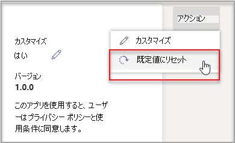

# アプリをカスタマイズMicrosoft Teams

 Microsoft Teamsは、アプリのカスタマイズを提供して、エクスペリエンスをTeamsします。 一部のアプリ開発者は、管理者がアプリをカスタマイズTeamsします。管理者は、管理センターの [アプリの管理] ページを使用して、組織のニーズに基づいてTeamsのカスタマイズまたはブランド変更 **を行** えます。 カスタマイズできる詳細は次のとおりです。

- 短い名前
- 簡単な説明
- 完全な説明
- プライバシー ポリシーの URL
- Web サイトの URL
- 使用条件 URL
- [色] アイコン
- アウトライン アイコン
- アクセント カラー

カスタマイズできる[Teamsの詳細については](https://docs.microsoft.com/microsoftteams/platform/resources/schema/manifest-schema)、マニフェスト スキーマに関するページを参照してください。

> [!NOTE]
> 現時点では、Government Community Cloud High (GCCH) または国防総省 (DoD) では、アプリのカスタマイズはサポートされていません。

## アプリの詳細をカスタマイズする

アプリのカスタマイズを開始するには、次の手順を実行します。

1. Teams 管理センターにサインインします。
2. [アプリ **Teams展開し、[** アプリの管理]**を選択します**。
3. アプリの **一覧の [** カスタマイズ可能] 列を確認し、カスタマイズ可能なアプリで並べ替えを行います。

   

   カスタマイズ機能にアクセスするには、次の 3 つのエントリ ポイントがあります。

   - カスタマイズするアプリの横にある を選択し、[カスタマイズ] を **選択します**。

     

   - アプリ名を選択し、[カスタマイズ可能] **を選択します**。

     

   - アプリ名を選択し、[アクション] ドロップダウン **から [カスタマイズ** ] **を選択** します。

     

4. [詳細] **セクションを** 展開し、次のフィールドをカスタマイズします。

    - 短い名前
    - 簡単な説明
    - 完全な説明
    - Web サイト
    - プライバシー ポリシーの URL
    - 使用条件 URL

   

> [!Note]
> アプリ開発者がカスタマイズ可能として割り当てたフィールドだけが表示されます。

5. [アイコン] **セクションを** 展開します。

   a. アップロードをクリックします。 1 つのフルカラー アイコン (192x192) ピクセルを PNG 形式で使用します。

   b. アイコンのアウトラインの色を選択します。 PNG 形式で 1 つの透明なアウトライン (32x32) ピクセルを使用します。

   c. アイコンに一致するアプリのアクセント カラーを選択します。

    

6. アプリがカスタマイズされた後、[適用] を **選択します**。

7. [発行 **] を** 選択して、カスタマイズしたアプリを発行します。

   カスタマイズしたアプリが [アプリの管理] ページ **に表示** されます。 アプリの機能をカスタマイズしてもアプリのコピーは作成されていないので、アプリのバージョンは 1 つのみです。

これで、Teamsエンド ユーザーは、カスタマイズされたアプリをTeamsクライアントを開き、カスタマイズされたアプリを表示できます。

   

### アプリをカスタマイズするための特別な考慮事項

次のメモには、アプリのカスタマイズに関する重要な詳細が含まれています。

> [!Note]
> - アプリとアプリに関連する説明をカスタマイズする場合は、アプリの発行元がドキュメントまたは使用条件で提供する場合は、カスタマイズ ガイドラインに従ってください。 また、使用するサード パーティのイメージに関する他のユーザーの権利を尊重する責任もあります。
> - 管理者が提供するカスタマイズ データは、最も近いリージョンに格納されます。
> - 使用条件またはプライバシー ポリシーへのリンクが有効な場合は、お客様が責任を負います。
> - アプリの発行元がフィールドのカスタマイズを許可しなくなった場合は、アプリの詳細ページに、カスタマイズできないフィールドについて管理者に通知するメッセージが表示されます。 そのフィールドに加えた変更はすべて、元の値に戻されます。
> - ユーザーが変更を確認するには、ブランドの変更に最大 24 時間が必要になる場合があります。

## アプリの詳細を確認する

情報を確認するために、アプリの詳細を表示したい場合があります。

1. Teams 管理センターにサインインします。

2. ［**Teams アプリ**］ を開き、［**アプリの管理**］ を選択します。

3. アプリ名を選択します。

4. 元のアプリ名を含むアプリの詳細を表示する 発行元からの **短い名前**。

   

   [ **発行元の短い** 名前] フィールドは、アプリの短い名前を変更した場合にのみ表示されます。

## アプリの詳細を既定にリセットする

アプリの詳細は、いつでも元の設定にリセットできます。

1. Teams 管理センターにサインインします。

2. [アプリ **Teams展開し、[** アプリの管理]**を選択します**。

3. アプリ名を選択します。

4. [アクション **] ドロップダウンから [リセット] を** 選択して既定値 **を設定** します。

   

## よく寄せられる質問

**ユーザーがカスタマイズしたアプリを表示するには、どのくらいの時間が必要ですか?**

管理者は管理センターで変更をすぐに確認Teams、エンド ユーザーが変更を確認するには最大 24 時間かかる場合があります。  

**アプリ プロバイダーは、顧客のためにアプリをカスタマイズできますか。**

 いいえ。テナントの管理者は、管理センターでテナントのアプリをカスタマイズTeams必要があります。

**テナント内の現在のカスタム アプリを置き換えるカスタマイズされたアプリは自動的にデプロイされますか?**

いいえ。テナント管理者は、カスタム アプリを手動で削除し、カスタマイズされたバージョンのアプリを発行する必要があります。 アプリをカスタマイズし、カスタム アプリとして発行した場合、アプリのカスタマイズ機能を使用してカスタマイズされた新しいアプリは、現在のカスタム アプリに置き換えされません。  

**アプリ使用状況レポートには、カスタマイズされた短い名前などのカスタマイズされた値も表示されますか。**

 いいえ。アプリ使用状況レポートには、発行元から送信されたアプリの元の名前が引き続き表示されます。

**アプリのカスタマイズ機能を使用してカスタマイズできるアプリ**

カスタマイズできるのは、アプリの発行元がカスタマイズできるアプリのみです。 アプリの発行元は、顧客がアプリをカスタマイズするためにオプトインする必要があります。

**カスタマイズしたプロパティは、グラフのアクセス許可の同意画面に表示されますか?**

いいえ。アクセス許可の同意画面には、発行元から送信された元の値が引き続き表示されます。

## 関連記事

- [アプリを管理する](manage-apps.md)
- [アプリ ストアをカスタマイズする](customize-your-app-store.md)
