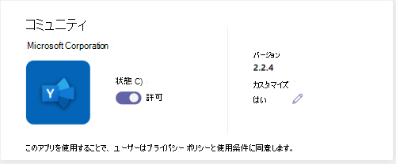

# 組織の Teams ストア内のアプリの外観をカスタマイズする

Microsoft Teams を使用すると、管理者は Teams アプリをカスタマイズしてストア エクスペリエンスを強化し、組織のブランディングを進めることができます。 アプリ開発者は、Teams 管理者がアプリをカスタマイズできるようにします。その後、Teams 管理センターの [アプリの管理] ページで、組織のニーズに基づいてアプリのプロパティを更新できます。 カスタマイズできる詳細は次のとおりです。

* 短い形式の名前
* 簡潔な説明
* 詳細な説明
* プライバシー ポリシーの URL
* Web サイトの URL
* 使用条件の URL
* アプリ アイコン
* アイコンのアウトラインの色
* アクセント カラー

アプリのさまざまなメタデータ フィールドの詳細については、開発者向けドキュメントの [Teams マニフェスト スキーマ](/microsoftteams/platform/resources/schema/manifest-schema) を参照してください。

> [!NOTE]
> サイドロードされたアプリは、どの組織でもカスタマイズできません。 Government Community Cloud High (GCCH) または米国国防総省 (DoD) クラウドのアプリをカスタマイズすることはできません。

## アプリの詳細のカスタマイズ

アプリをカスタマイズするには、次の手順を実行します。

1. Teams 管理センターにサインインします。

1. **［Teams アプリ］** を開き、**[［アプリの管理］](https://admin.teams.microsoft.com/policies/manage-apps)** を選択します。

1. アプリの一覧の **[カスタマイズ可能]** 列を確認し、カスタマイズ可能なアプリごとに並べ替えます。

   ![管理センターの [カスタマイズ] 列は、カスタマイズ可能なアプリを表示するのに役立ちます。](media/customizable-apps-in-tac.png)

   カスタマイズ機能にアクセスするには、次の 3 つのエントリ ポイントがあります。

   * カスタマイズするアプリの横を選択し、**[カスタマイズ]** を選択します。

     

   * アプリ名を選択し、**[カスタマイズ可能]** で編集アイコンを選択します。

     

   * アプリ名を選択し、**[アクション]** で **[オーバーフロー]** メニューをクリックし、[カスタマイズ] を選択します。

     

1. **[詳細]** セクションを展開し、次の 1 つ以上のフィールドをカスタマイズします。 開発者がカスタマイズ可能として割り当てたフィールドが表示されます。

    * 短い形式の名前
    * 簡潔な説明
    * 詳細な説明
    * Web サイト
    * プライバシー ポリシーの URL
    * 使用条件の URL

   

1. **[アイコン]** セクションを展開します。

1. アイコンをアップロードします。 PNG 形式で 1 つのアイコン (192 x 192) ピクセルを使用します。

1. アイコンのアウトラインの色を選択します。 PNG 形式で 1 つの透明なアウトライン (32x32) ピクセルを使用します。

1. アイコンに一致するアプリのアクセント カラーを選択します。

   

1. アプリをカスタマイズしたら、**[適用]** を選択します。

1. **[発行]** を選択して、カスタマイズしたアプリを発行します。

   カスタマイズしたアプリが **[アプリの管理]** ページに一覧表示されます。 アプリの機能をカスタマイズしてもアプリのコピーは作成されないため、アプリのバージョンは 1 つだけです。

これで、Teams のエンド ユーザーは、カスタマイズされたアプリをクライアントに表示できるようになります。

   

アプリのカスタマイズに関する次の詳細に注意してください。

* アプリをカスタマイズする場合、およびアプリに関連する任意の説明は、アプリ発行元がドキュメントまたは利用規約で提供する場合は、カスタマイズ ガイドラインに従っていることを確認します。 また、お客様は、使用する可能性があるサードパーティの画像に関する他者の権利を尊重する責任も負います。

* 管理者から提供されたカスタマイズ データは、最も近い地域に格納されます。

* お客様は、利用規約またはプライバシー ポリシーへのリンクが有効であることを確認する責任があります。

* アプリ発行元がフィールドのカスタマイズを許可しなくなった場合、アプリの詳細ページにメッセージが表示され、カスタマイズできなくなるフィールドについて管理者に通知されます。 そのフィールドに加えられたすべての変更は、元の値に戻されます。

* 運用環境でこれらの変更を行う前に、Teams テスト テナントでアプリのカスタマイズ変更をテストすることをお勧めします。

* ブランドの変更は、すべてのユーザーに反映されるまでに最大 24 時間かかる場合があります。

* アプリをカスタマイズ可能にする場合、開発者は新しいバージョンのアプリを提供できます。 新しいバージョンをアップロードし、以前のバージョンのアプリを削除します。 アプリをカスタマイズして発行した場合、アプリ カスタマイズ機能を使用してカスタマイズされた新しいアプリは、現在のアプリに置き換わることはありません。

* [アプリの使用状況レポート](teams-analytics-and-reports/app-usage-report.md)には、発行元によって提供されたアプリの元の名前が表示されます。

* Microsoft Graph のアクセス許可の同意ダイアログには、発行元によって提供されたアプリの元の名前が表示されます。 これは、アプリにアクセス許可を提供しながら、アプリを正確に識別するのに役立ちます。

## アプリの詳細を確認する

アプリの詳細を表示して情報を確認することもできます。

1. Teams 管理センターにサインインします。

1. **［Teams アプリ］** を開き、**[［アプリの管理］](https://admin.teams.microsoft.com/policies/manage-apps)** を選択します。

1. アプリ名を選択します。

1. アプリの詳細 (元のアプリ名などの **発行元の短い名前**) を表示します。

   

   **[発行元の短い名前]** フィールドは、アプリの短い名前を変更した場合にのみ表示されます。

## アプリの詳細を既定値にリセットする

アプリの詳細は、アプリ開発者が提供する元の値にリセットできます。 このオプションは、カスタマイズしたアプリでのみ使用できます。

1. Teams 管理センターで、**[Teams アプリ]** >  **[[管理アプリ]](https://admin.teams.microsoft.com/policies/manage-apps)** の順にアクセスします。

1. アプリ名を選択します。

1. **[アクション]** メニューで **[既定値にリセット]** を選択します。

   ![[既定値にリセット] の選択が強調表示されます。](media/select-reset.png)

## 関連記事

* [アプリを管理する](manage-apps.md)
* [組織のアプリ ストアをカスタマイズする](customize-your-app-store.md)
* [アプリのブランドを変更する](https://techcommunity.microsoft.com/t5/microsoft-teams-blog/rebrand-apps-to-your-own-organization-s-branding-with-app/ba-p/2376296)
