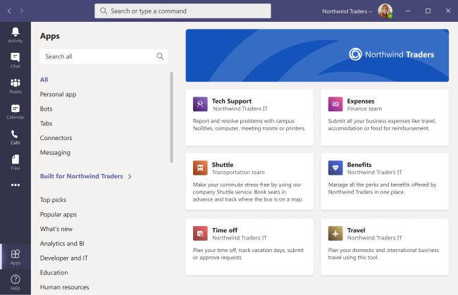

# カスタム アプリは、Microsoft Teams

ロゴ、ユーザー設定の背景、カスタム テキストの色を追加して、Teams の組織のアプリ ストアをカスタマイズし、エンド ユーザーにより魅力的にできます。

> [!Note]
> ブランドの変更を有効にするには、24 時間が必要です。

管理センターで [ストアのカスタマイズ] にアクセスするには、[ストアのカスタマイズ] Teams **を**  >  **選択します**。

  

この記事では、カスタム アプリストアの機能とそれらを使用する方法について説明します。

## 組織のロゴをカスタマイズする

<!-- Bookmark used by Context Sensitive Help (CSH). Do not delete. -->

<!-- Do not remove the bookmark link above. -->

ここで、組織のロゴをアップロードできます。 選択したロゴは、[テナント用のアプリTeamsクライアント  >  **] ページに表示** されます。

[画像の選択 **] オプションを選択** すると、選択したファイルをアップロードできます。 ロゴは 240x60 である必要があります。または、そのサイズにスケーリングされます。 5 MB 以下にしてください。 サポートされている形式は次のとおりです。

- .svg
- .png
- .jpg

ロゴは、テナント ストアのテナント アプリ カタログの右上隅Teamsされます。

## 小さなロゴをカスタマイズする

<!-- Bookmark used by Context Sensitive Help (CSH). Do not delete. -->

<!-- Do not remove the bookmark link above. -->

組織のロゴマークまたは小さなロゴは、組織のブランドを表す画像または記号であり、会社名は含まれます。 lovemark は、チーム メンバーがアプリ ストアを識別するのに役立ちます。 選択したロゴは、[アプリ] ページTeamsクライアントに表示されます。

[画像の選択 **] オプションを選択** すると、選択したファイルをアップロードできます。 logomark は 32x32 ピクセルである必要があります。または、そのサイズにスケーリングされます。 5 MB 以下にしてください。 サポートされている形式は次のとおりです。

- .svg
- .png
- .jpg

小さなロゴは、ストアのランディングページの [テナント用に構築Teams表示されます。

## 背景色をカスタマイズする

<!-- Bookmark used by Context Sensitive Help (CSH). Do not delete. -->

<!-- Do not remove the bookmark link above. -->

ユーザーがテキストを明確に読み取れるので、背景とテキストのコントラストが十分に高い必要があります。 バックグラウンドは、テナント ヘッダー用Teamsアプリビルドのクライアント  >  **に表示** されます。

オプションは次のとおりです。

- 既定のTeamsテーマを使用する
- 画像を選択します。 背景画像を選択すると、選択したファイルをアップロードできます。 背景は 1212x100 ピクセルである必要があります。または、そのサイズにスケーリングされます。 5 MB 以下にしてください。 サポートされている形式は次のとおりです。
  - .svg
  - .png
  - .jpg
- ユーザー設定の背景を選択します。 [ユーザー設定の **色の選択] を選択すると**、色の選択が開きます。 カラー 選択のスケールを調整して、目的の色を選択します。

背景の画像または色は、テナント アプリ カタログの上部バナーの背景Teams使用されます。

## 名前のテキストの色をカスタマイズする

<!-- Bookmark used by Context Sensitive Help (CSH). Do not delete. -->

<!-- Do not remove the bookmark link above. -->

ユーザーが組織の名前を明確に読み取れるので、テキストの色と背景とのコントラストが十分に高い必要があります。 テキストは、テナント ヘッダーの Teams クライアントに  >  **表示** されます。

[ユーザー設定の **色の選択] を選択すると**、色の選択が開きます。 カラー 選択のスケールを調整して、目的の色を選択します。

 

## チーム アプリ ストアのカスタマイズを完了する

アプリ ストアのカスタマイズが完了したら、必ず [保存] を選択 **して** 変更を保存します。
変更をプレビューするには、[アプリ ストア **のプレビュー] を選択** して、カスタマイズしたアプリ ストアの表現を表示します。

> [!Note]
> 一部の既定の色はユーザーのバージョンのカスタム クライアントに基づくため、カスタマイズされたアプリ ストアの最終バージョンと異なるTeamsがあります。

## 関連記事

[アプリを管理する](manage-apps.md)
