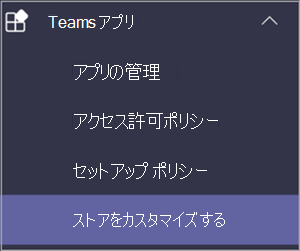

# Microsoft Teams のカスタムアプリストアCustom apps store in Microsoft Teams

これで、ロゴ、ユーザー設定の背景、ユーザー設定のテキストの色を追加して、組織のブランド化されたチームで組織のアプリストアをカスタマイズして、エンドユーザーに招待することができます。Now you can customize your organization's apps store in Teams with your company branding by adding your logo, custom backgrounds, and custom text colors to make it more inviting to end users.

> [!Note]
> ブランドを変更するには、24時間かかる場合があります。Changes to branding will require 24 hours to take effect.

管理センターで [ **Teams アプリ**]  >  **カスタマイズストア** にアクセスすると、カスタマイズストアにアクセスできます。You can access the customize store in the admin center by selecting **Teams apps** > **Customize store**.

  

この記事では、カスタムアプリストア機能とその使用方法について説明します。This article describes the Custom apps store features and how to use them.

## 組織のロゴをカスタマイズするCustomize your organization logo

<!-- Bookmark used by Context Sensitive Help (CSH). Do not delete. -->

<!-- Do not remove the bookmark link above. -->

ここでは、組織のロゴをアップロードすることができます。Here you can upload your organization logo. 選択されたロゴは、[   >  **テナント用に作成** されたアプリ] の Teams クライアントに表示されます。The logo selected will appear in the Teams client in **Apps** > **Built for your tenant** page.

[ **画像の選択** ] オプションを選択すると、選択したファイルをアップロードできます。When you select the **Choose a picture** option, you can upload the file of your choice. ロゴは240x60 であるか、そのサイズに拡大縮小されます。The logo should be 240x60, or it will be scaled to that size. 5 MB 以下である必要があります。It should be no larger than 5 MB. サポートされている形式は次のとおりです。The supported formats are:

- svg.svg
- .png.png
- .jpg.jpg

ロゴは、Teams ストアのテナントアプリカタログの右上隅に表示されます。The logo is shown in the top, right corner of the tenant app catalog in the Teams store.

## 小さいロゴをカスタマイズするCustomize your small logo

<!-- Bookmark used by Context Sensitive Help (CSH). Do not delete. -->

<!-- Do not remove the bookmark link above. -->

組織の logomark または小さなロゴは、組織のブランドを表す画像または記号であり、会社名は含まれていません。Your organization logomark or small logo is an image or symbol that represents your organization brand and doesn't include your company name. Lovemark は、チームメンバーがアプリストアを特定するのに役立ちます。The lovemark helps team members identify the Apps store. 選択したロゴが [アプリの Teams クライアント] ページに表示されます。The logo selected will appear in the Teams client in Apps page.

[ **画像の選択** ] オプションを選択すると、選択したファイルをアップロードできます。When you select the **Choose a picture** option, you can upload the file of your choice. Logomark は32x32 ピクセルである必要があります。または、そのサイズに拡大縮小されます。The logomark should be 32x32 pixels, or it will be scaled to that size. 5 MB 以下である必要があります。It should be no larger than 5 MB. サポートされている形式は次のとおりです。The supported formats are:

- svg.svg
- .png.png
- .jpg.jpg

小さいロゴは、Teams ストアのランディングページの [ **テナント用に作成** する] セクションタイトルの横に表示されます。The small logo is shown next to the **Built for tenant** section title in the Teams store landing page.

## 背景色をカスタマイズするCustomize the background color

<!-- Bookmark used by Context Sensitive Help (CSH). Do not delete. -->

<!-- Do not remove the bookmark link above. -->

背景にテキストとのコントラストが十分であることを確認します。これにより、ユーザーはテキストを見やすくすることができます。Make sure that the background has enough contrast with the text so the users can read the text clearly. バックグラウンドは、   >  **テナントのヘッダー用に構築** されたアプリの Teams クライアントに表示されます。The background will appear in the Teams client in **Apps** > **Built for your tenant** header.

オプションは次のとおりです。Your options are:

- Teams クライアントの既定の背景テーマを使用するUse Teams client default background theme
- 画像を選択します。Choose a picture. 背景画像を選択すると、選択したファイルをアップロードできます。When you select the background picture, you can upload the file of your choice. 背景は1212x100 ピクセルである必要があります。または、そのサイズに拡大縮小されます。The background should be 1212x100 pixels, or it will be scaled to that size. 5 MB 以下である必要があります。It should be no larger than 5 MB. サポートされている形式は次のとおりです。The supported formats are:
  - svg.svg
  - .png.png
  - .jpg.jpg
- ユーザー設定の背景を選択します。Choose a custom background. [ **ユーザー設定の色を選択**] を選ぶと、色の選択ウィンドウが開きます。When you select **Choose a custom color**, a color chooser opens. 色の選択の倍率を調整して、目的の色を選びます。Select the color that you want by adjusting the scale of the color chooser.

背景画像または背景色は、Teams テナントアプリカタログのトップバナーの背景として使用されます。The background image or color is used as the background for the top banner in the Teams tenant app catalog.

## 自分の名前のテキストの色をカスタマイズするCustomize the text color of your name

<!-- Bookmark used by Context Sensitive Help (CSH). Do not delete. -->

<!-- Do not remove the bookmark link above. -->

テキストの色に背景とのコントラストが十分であることを確認します。これにより、ユーザーは組織の名前を明確に読み取ることができるようになります。Make sure the text color has enough contrast with the background so that the users can read the name of your organization clearly. テキストは、   >  **テナントのヘッダー用に作成** されたアプリの Teams クライアントに表示されます。The text will appear in the Teams client in **Apps** > **Built for your tenant** header.

[ **ユーザー設定の色を選択**] を選ぶと、色の選択ウィンドウが開きます。When you select **Choose a custom color**, a color chooser opens. 色の選択の倍率を調整して、目的の色を選びます。Select the color that you want by adjusting the scale of the color chooser.

 

## チームアプリストアのカスタマイズを完了するComplete the customization of your team apps store

アプリストアのカスタマイズが完了したら、[ **保存** ] を選んで変更を保存します。When you've finished customizing your apps store, be sure to select **Save** to save your changes.
変更をプレビューするには、[ **アプリストアのプレビュー** ] を選択して、カスタマイズされたアプリストアの表示を確認します。To preview your changes, select **Preview apps store** to see a representation of your customized apps store.

 

> [!Note]
> この表現は、カスタマイズされたアプリストアの最終的なバージョンとは異なる場合があります。一部の既定の色はユーザーの Teams クライアントに基づいているためです。The representation might vary from the final version of your customized apps store because some default colors are based on your users' version of Teams client.

## 関連記事Related article

[アプリを管理するManage your apps](manage-apps.md)
