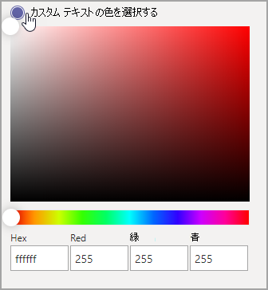

# Microsoft Teams のカスタムアプリストア

[!INCLUDE [template](includes/preview-feature.md)]

これで、ロゴ、カスタム背景、ユーザー設定のテキストの色を追加して、組織のブランドを持つ Teams アプリストアをカスタマイズして、エンドユーザーに招待することができます。

> [!Note]
> ブランドを変更するには、24時間かかる場合があります。

## 組織のロゴをカスタマイズする

<!-- Bookmark used by Context Sensitive Help (CSH). Do not delete. -->

<!-- Do not remove the bookmark link above. -->

ここでは、組織のロゴをアップロードすることができます。 選択されたロゴは、[ **Apps**  >  **テナント用に作成**されたアプリ] の Teams クライアントに表示されます。

[ **画像の選択** ] オプションを選択すると、選択したファイルをアップロードできます。 ロゴは240x60 であるか、そのサイズに拡大縮小されます。 5 MB 以下である必要があります。 サポートされている形式は次のとおりです。

- svg
- .png
- .jpg

ロゴは、Teams ストアのテナントアプリカタログの右上隅に表示されます。

## 小さいロゴをカスタマイズする

<!-- Bookmark used by Context Sensitive Help (CSH). Do not delete. -->

<!-- Do not remove the bookmark link above. -->

組織の lovemark または小さなロゴは、組織のブランドを表す画像または記号であり、会社名は含まれていません。 Logomark は、チームメンバーがアプリストアを特定するのに役立ちます。 選択したロゴが [アプリの Teams クライアント] ページに表示されます。

[ **画像の選択** ] オプションを選択すると、選択したファイルをアップロードできます。 Logomark は32x32 ピクセルである必要があります。または、そのサイズに拡大縮小されます。 5 MB 以下である必要があります。 サポートされている形式は次のとおりです。

- svg
- .png
- .jpg

小さいロゴは、Teams ストアのランディングページの [ **テナント用に作成** する] セクションタイトルの横に表示されます。

## 背景色をカスタマイズする

<!-- Bookmark used by Context Sensitive Help (CSH). Do not delete. -->

<!-- Do not remove the bookmark link above. -->

背景にはテキストとのコントラストが十分であり、ユーザーがテキストを見やすいようにします。 バックグラウンドは、 **Apps**  >  **テナントのヘッダー用に構築**されたアプリの Teams クライアントに表示されます。

オプションは次のとおりです。

- Teams クライアントの既定の背景テーマを使用する
- 画像を選択します。 背景画像を選択すると、選択したファイルをアップロードできます。 背景は1212x100 ピクセルである必要があります。または、そのサイズに拡大縮小されます。 5 MB 以下である必要があります。 サポートされている形式は次のとおりです。
  - svg
  - .png
  - .jpg
- ユーザー設定の背景を選択します。 [ **ユーザー設定の色を選択**] を選ぶと、色の選択ウィンドウが開きます。 色の選択の倍率を調整して、目的の色を選びます。

背景画像または背景色は、Teams テナントアプリカタログのトップバナーの背景として使用されます。

## 自分の名前のテキストの色をカスタマイズする

<!-- Bookmark used by Context Sensitive Help (CSH). Do not delete. -->

<!-- Do not remove the bookmark link above. -->

テキストの色には、ユーザーが組織の名前を明確に読み取ることができる背景とのコントラストが十分である必要があります。 テキストは、 **Apps**  >  **テナントのヘッダー用に作成**されたアプリの Teams クライアントに表示されます。

[ **ユーザー設定の色を選択**] を選ぶと、色の選択ウィンドウが開きます。 色の選択の倍率を調整して、目的の色を選びます。

 

## チームアプリストアのカスタマイズを完了する

アプリストアのカスタマイズが完了したら、[ **保存** ] を選んで変更を保存します。
変更をプレビューするには、[ **アプリストアのプレビュー** ] を選択して、カスタマイズされたアプリストアの表示を確認します。

> [!Note]
> この表現は、カスタマイズされたアプリストアの最終的なバージョンとは異なる場合があります。一部の既定の色はユーザーの Teams クライアントに基づいているためです。

## 関連記事

[アプリを管理する](manage-apps.md)
