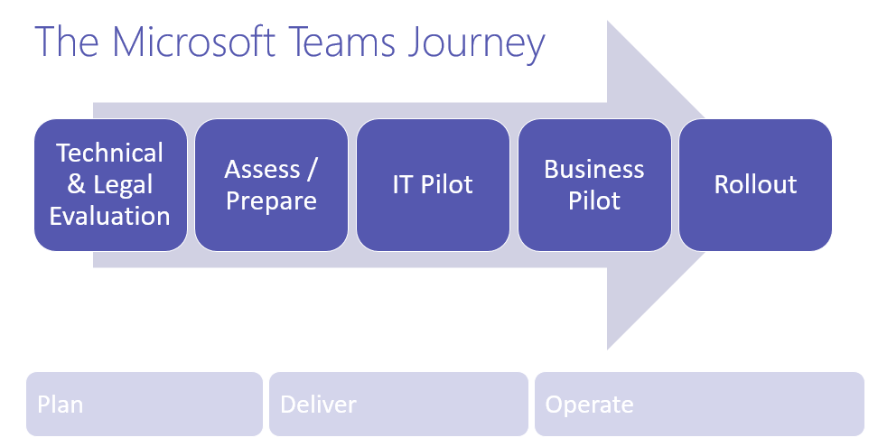
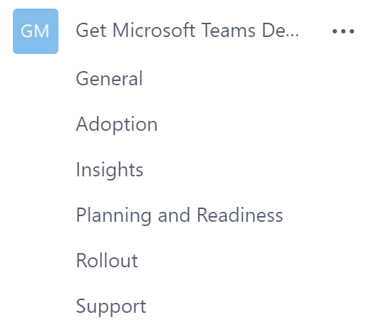

Microsoft Teams の展開の概要
========================================

Microsoft Teams の新規ユーザーの場合は、 操作や機能を速やかに理解するために、最初に[概要](teams-overview.md)をお読みください。

Microsoft Teams の典型的な展開手順を次に示します。

1.  初期段階で技術的および法的な評価を実施し、組織で Microsoft Teams を実装するために必要な規制を特定、定義します。

2.  ネットワークの評価とロールアウトの準備に取り組みます。この時点で、導入と変更管理の戦略の作成、ロールアウト時とその後においてユーザー エンゲージメントを促す主なユーザー ストーリーの作成に取りかかります。

3.  IT パイロットで変更管理と導入の戦略をテストします。

4.  これらの戦略を使用して、1 つ以上のビジネス ユニットでビジネス パイロットを改良し、実行します。

5.  より広範なロールアウト向けの戦略と学習内容を改良し、活用します。

Microsoft Teams の展開では、環境でその使用を開始するに当たって最初に使用する項目に IT パイロットがあります。パイロットを使用すると、Microsoft Teams の計画、提供、運営、さらにビジネス ユーザーへの提供に向けた取り組みを開始できるようチームを支援できます。

チーム/チャネル構造をセットアップして、Microsoft Teams をエンド ユーザーに提供する方法の一例を次に示します。ビジネス ユニットが独自のチームとチャネルをセットアップできるようにするため、チーム/チャネルをセットアップした過去の実例を共有し、ビジネス ユニットで次のような表を作成させてセットアップに関する会話を促進します。

|チーム名 |チャネル  |タブ  |
|---------|---------|---------|
|チームの展開  メンバー:<ul><li>プロジェクト スポンサー</li><li>ビジネス アナリスト</li><li>プロジェクト マネージャー</li><li>コラボレーション IT 専門家</li><li>ネットワーク IT 専門家</li><li>導入リード </li><li>サポート リード</li></ul>所有者: <ul><li>プロジェクト マネージャー</li><li>コラボレーション IT 専門家</li></ul>      |計画と準備   導入   ロールアウト   サポート   洞察                        |Microsoft Teams の Web ページの実践的なガイドのリンク ([https://docs.microsoft.com/MicrosoftTeams](https://docs.microsoft.com/MicrosoftTeams))                               |

このセットアップの Microsoft Teams は次のようになります。

||||
|---------|---------|---------|
|     |判断ポイント         |IT パイロット用に作成する最初のチームとチャネルを教えてください。         |
|     |次のステップ         |IT パイロットの最初のチームとチャネルを文書化します。         |

 

*判断ポイントを追跡する場合は、[Decision Points Summary](https://www.microsoft.com/en-us/download/55981) をダウンロードしてください。*
