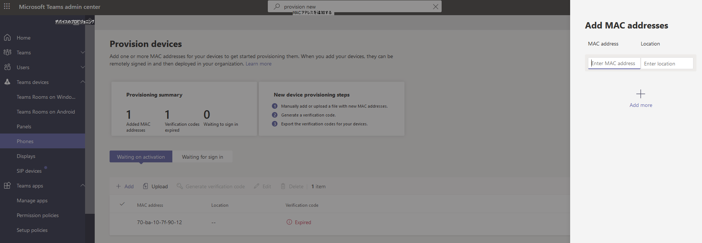

# Android デバイスのリモート プロビジョニングTeamsサインイン

IT 管理者は、Android デバイスを使用してリモートでプロビジョニングTeamsサインインできます。 デバイスをリモートでプロビジョニングするには、管理者がプロビジョニングするデバイスの MAC の ID をアップロードし、確認コードを作成する必要があります。 プロセス全体は、管理センターからリモートTeams完了できます。

## サポートされているデバイスを確認する

次の一覧は、Android デバイスファームウェアの要件を示しています。

|デバイス カテゴリ|デバイス モデル|ファームウェアのバージョン|
|-|-|-|
|Teams電話|Yealink T55/T56/T58|58.15.0.124|
|Teams電話|Yealink VP59|91.15.0.58|
|Teams電話|Yealink CP960|73.15.0.117|
|Teams電話|Yealink MP56/MP54/MP58|122.15.0.36|
|Teams電話|クレスロン UC-2|1.0.3.52|
|Teams電話|  Poly Trio C60|  7.0.2.1071|
|Teams電話|  CCX400/CCX500/CCX600    |7.0.2.1072|
|Teams電話|  オーディオ コード C448HD/C450HD/C470HD|   1.10.120|
|Teams パネル|  クレスロン 770/1070|  1.004.0115|
|TeamsAndroid の会議室|Logitech Rally Bar Mini|1.2.982|
|TeamsAndroid の会議室|Logitech Rally Bar|1.2.982|
|TeamsAndroid の会議室|AudioCodes RXV80|1.13.361|
|TeamsAndroid の会議室|EPOS EXPAND Vision 3T|1.2.2.21182.10|
|TeamsAndroid の会議室|Yealink MeetingBar A30|133.15.0.60|
|TeamsAndroid の会議室|Yealink MeetingBar A20|133.15.0.60|
|TeamsAndroid の会議室|Yealink CTP18 タッチ コンソール|137.15.0.37|
|TeamsAndroid の会議室|Poly Studio X30|3.5.0.344025|
|TeamsAndroid の会議室|Poly Studio X50|3.5.0.344025|
|TeamsAndroid の会議室|Poly TC8 タッチ コンソール |3.5.0.210489|
|TeamsAndroid の会議室|Yealink VC210|118.15.0.54|

## デバイスの MAC アドレスを追加する

新しいデバイスをプロビジョニングするには、次の手順を実行します。

1. Teams 管理センターにサインインします。
2. [デバイスTeams 展開 **します**。
3. [アクション **] タブから [新しい** デバイスのプロビジョニング **] を** 選択します。

[新 **しいデバイスのプロビジョニング]** ウィンドウで、MAC アドレスを手動で追加するか、ファイルをアップロードできます。

### デバイスの MAC アドレスを手動で追加する

1. [アクティブ化 **待ち] タブで****、[MAC ID の追加] を選択します**。

   

1. MAC ID を入力します。
1. 場所を入力します。これは、技術者がデバイスをインストールする場所を特定するのに役立ちます。
1. 完了したら **、[適用** ] を選択します。

### アップロード MAC アドレスを追加するファイルを作成する

1. [アクティブ **化待ち]** タブで、[MAC **アップロード を選択します**。
2. ファイル テンプレートをダウンロードします。
3. MAC ID と場所を入力し、ファイルを保存します。
4. **ファイル を選択** し、[ファイル]**をアップロード。**

## 確認コードを生成する

デバイスの確認コードが必要です。 確認コードは、一括またはデバイス レベルで生成され、24 時間有効です。

1. [アクティブ **化待ち] タブ** で、既存の MAC ID を選択します。
   MAC アドレスのパスワードが作成され、[確認コード] 列 **に表示** されます。

2. MAC の一覧と確認コードを現場の技術者に提供します。 ファイル内の詳細を直接エクスポートし、実際のインストール作業を行っている技術者とファイルを共有できます。

## デバイスをプロビジョニングする

デバイスの電源が入り、ネットワークに接続されると、技術者がデバイスをプロビジョニングします。 これらの手順は、デバイス上でTeamsされます。

1. 技術者が[デバイスの **プロビジョニング] を****選択設定。**  

   ![[アクション] タブから新しいデバイス オプションをプロビジョニングします。](../media/provision-device1.png)
  
2. 技術者は、指定された入力フィールドにデバイス固有の確認コードを入力します。

   

   デバイスが正常にプロビジョニングされると、テナント名がサインイン ページに表示されます。

   

## リモートでサインインする

プロビジョニングされたデバイスが [サインインの待機中 **] タブに表示** されます。個々のデバイスを選択して、リモート サインイン プロセスを開始します。

1. [サインイン待ち] **タブからデバイスを選択** します。

   

2. 「ユーザーにサインインする」 **の指示に従って、[** 閉じる] を **選択します**。

   ![個々のデバイスの [ユーザーのサインイン] ウィンドウ。](../media/sign-in-user.png)

## 関連記事

- [Teams でのデバイスの管理](device-management.md)
- [デバイスTeamsをリモートで更新する](remote-update.md)
