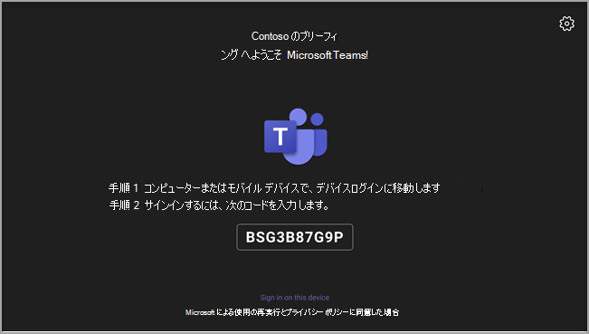
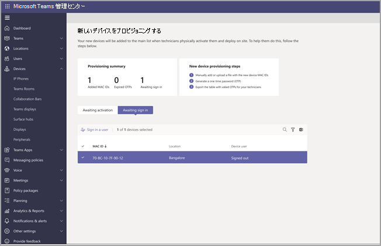

# Android デバイスのリモート プロビジョニングTeamsサインインRemote provisioning and sign in for Teams Android devices

IT 管理者は、リモートでプロビジョニングし、Teams Android デバイスにサインインできます。IT admins can remotely provision and sign in to a Teams Android device. デバイスをリモートでプロビジョニングするには、管理者がプロビジョニングするデバイスの MAC の ID をアップロードし、確認コードを作成する必要があります。To provision a device remotely, the admin needs to upload the MAC IDs of the devices being provisioned and create a verification code. プロセス全体は、管理センターからリモートTeams完了できます。The entire process can be completed remotely from the Teams admin center.

## サポートされているデバイスを確認するReview the supported devices

次の一覧は、Android デバイスのファームウェア要件を示しています。The following list shows the Android device firmware requirements.

|デバイス カテゴリDevice category|デバイス モデルDevice model|ファームウェアのバージョンFirmware version|
|-|-|-|
|Teams電話Teams phones|Yealink T55/T56/T58Yealink T55/T56/T58|58.15.0.12458.15.0.124|
|Teams電話Teams phones|Yealink VP59Yealink VP59|91.15.0.5891.15.0.58|
|Teams電話Teams phones|Yealink CP960Yealink CP960|73.15.0.11773.15.0.117|
|Teams電話Teams phones|Yealink MP56/MP54/MP58Yealink MP56/MP54/MP58|122.15.0.36122.15.0.36|
|Teams電話Teams phones|クレスロン UC-2Crestron UC-2|1.0.3.521.0.3.52|
|Teams電話Teams phones|  Poly Trio C60Poly Trio C60|  7.0.2.10717.0.2.1071|
|Teams電話Teams phones|  CCX400/CCX500/CCX600CCX400/CCX500/CCX600    |7.0.2.10727.0.2.1072|
|Teams電話Teams phones|  オーディオ コード C448HD/C450HD/C470HDAudio Codes C448HD/C450HD/C470HD|   1.10.1201.10.120|

## デバイスの MAC アドレスを追加するAdd a device MAC address

新しいデバイスをプロビジョニングするには、次の手順を実行します。Complete the following steps to provision a new device.

1. Teams 管理センターにサインインします。Sign in to the Teams admin center.
2. [デバイス] **を展開します**。Expand **Devices**.
3. [アクション **] タブから [新しい** デバイスのプロビジョニング **] を** 選択します。Select **Provision new device** from the **Actions** tab.

[新 **しいデバイスのプロビジョニング]** ウィンドウで、MAC アドレスを手動で追加するか、ファイルをアップロードできます。In the **Provision new devices** window, you can either add the MAC address manually or upload a file.

### デバイスの MAC アドレスを手動で追加するManually add a device MAC address

1. [アクティブ化 **を待っている] タブで\*\*\*\*、[MAC ID の追加] を選択します**。From the **Awaiting Activation** tab, select **Add MAC ID**.

   

1. MAC ID を入力します。Enter the MAC ID.
1. 場所を入力します。これは、技術者がデバイスをインストールする場所を特定するのに役立ちます。Enter a location, which helps technicians identify where to install the devices.
1. 完了したら **、[適用** ] を選択します。Select **Apply** when finished.

### アップロード MAC アドレスを追加するファイルを作成するUpload a file to add a device MAC address

1. [アクティブ **化を待っている]** タブで、[MAC **アップロード を選択します**。From the **Awaiting Activation** tab, select **Upload MAC IDs**.
2. ファイル テンプレートをダウンロードします。Download the file template.
3. MAC ID と場所を入力し、ファイルを保存します。Enter the MAC ID and location, and then save the file.
4. **ファイル を選択** し、[ファイル]**をアップロード。****Select file**, and then select **Upload**.

## 確認コードを生成するGenerate a verification code

デバイスの確認コードが必要です。You need a verification code for the devices. 確認コードは、一括またはデバイス レベルで生成され、24 時間有効です。The verification code is generated in bulk or at the device level and is valid for 24 hours.

1. [アクティブ **化を待っている] タブ** で、既存の MAC ID を選択します。From the **Awaiting Activation** tab, select an existing MAC ID.
   MAC アドレスのパスワードが作成され、[確認コード] 列 **に表示** されます。A password is created for the MAC address and is shown in the **Verification Code** column.

2. MAC の一覧と確認コードを現場の技術者に提供します。Provide the list of MAC IDs and verification codes to the field technicians. ファイル内の詳細を直接エクスポートし、実際のインストール作業を行っている技術者とファイルを共有できます。You can export the detail directly in a file and share the file with the technician who is doing the actual installation work.

## デバイスをプロビジョニングするProvision the device

デバイスの電源が入り、ネットワークに接続されると、技術者がデバイスをプロビジョニングします。When the device is powered on and connected to the network, the technician provisions the device. これらの手順は、デバイスのTeamsされます。These steps are completed on the Teams device.

1. 技術者が[デバイスの **プロビジョニング] を\*\*\*\*選択設定。**The technician selects **Provision device** from the **Settings**.  

   ![[アクション] タブから新しいデバイス オプションをプロビジョニングする](../media/provision-device1.png)
  
2. 技術者は、指定された入力フィールドにデバイス固有の確認コードを入力します。The technician enters the device-specific verification code in the provided input field.

   

   デバイスが正常にプロビジョニングされると、テナント名がサインイン ページに表示されます。Once the device is provisioned successfully, the tenant name appears on the sign-in page.

   

## リモートでサインインするSign in remotely

プロビジョニングされたデバイスが [サインイン待ち] **タブに表示** されます。個々のデバイスを選択して、リモート サインイン プロセスを開始します。The provisioned device appears in the **Awaiting sign in** tab. Start the remote sign-in process by selecting the individual device.

1. [サインイン待ち] **タブからデバイスを選択** します。Select a device from the **Awaiting sign in** tab.

   

2. 「ユーザーにサインインする」 **の指示に従って、[** 閉じる] を **選択します**。Follow the instructions in **Sign in a user**, and then select **Close**.

   ![個々のデバイスの [ユーザーのサインイン] ウィンドウ](../media/sign-in-user.png)

## 関連記事Related article

- [Teams でのデバイスの管理Manage your devices in Teams](device-management.md)
- [デバイスTeamsをリモートで更新するUpdate Teams devices remotely](remote-update.md)
