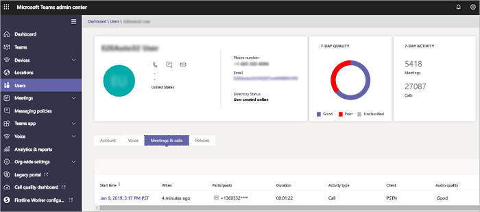

# 通話分析および通話品質ダッシュボード

マイクロソフトのチームとビジネス用の Skype が得を監視し、通話品質の問題をトラブルシューティングするための 2 つの方法: 分析の呼び出しと呼び出し品質ダッシュ ボード (救難)。 この記事では、これらの両方について説明し、どのような場合にそれぞれの方法を使用するべきかを示します。

呼び出しの分析と救難が並列で実行し、個別にまたは一緒に使用することができます。 たとえば、サポート ・ スペシャ リストは、呼び出しに関する問題のトラブルシューティング ヘルプが必要があることを決定する通信があるとします。 通信のサポート担当者は、分析機能の呼び出しで通信スペシャ リストのサポートの詳細については、アクセス権を持つ通信サポート ・ エンジニアへの呼び出しを渡します。 さらに、通信のサポート ・ エンジニアは、ネットワーク ・ エンジニアの問題を警告できます。 ネットワーク エンジニア リングは、全体的なサイトに関連する問題が呼び出しに関する問題の原因の原因になる可能性があるかどう救難をチェックします。

## 通話分析とは何ですか? どのような場合に使用するものですか?

**呼び出しの分析は、[マイクロソフトのチーム管理センター](https://admin.teams.microsoft.com)でされています。** すべてのコール情報とユーザーのデータを表示するには、[**呼び出し履歴**] タブを使用します。ダッシュ ボードからユーザーを検索するか、[プロファイル] ページでユーザーの検索、または左側のナビゲーションで、**ユーザー**からユーザーを検索してこれを行うことができます。

分析機能の呼び出しは、デバイス、ネットワーク、および特定のコールとビジネス アカウントに、マイクロソフトのチームまたは Skype では、各ユーザーが会議に関連する接続に関する詳細情報を示しています。 このユーザーは午後の不適切な呼び出しを理由がでしたか。 分析機能の呼び出しを使用して、Office 365 の管理者またはヘルプデスクの訓練を受けたエージェント調べることができます、デバイス、ネットワーク、接続、およびマイクロソフトのチームとビジネス用の Skype の通話品質と接続の問題をトラブルシューティングするのには彼の呼び出しに関連するその他の要因です。

マイクロソフトのチームの管理センターでユーザーにこの情報を表示するには、すべての通話や会議を表示してそのユーザーが過去 30 日間の参加しているユーザーの詳細ページで、そのユーザーの [**通話履歴**] タブをクリックします。

メディアの詳細を含む、ネットワークの統計情報の特定のセッションに関する追加情報を取得するには、詳細を表示するセッションをクリックします。

管理者以外が、外部の仕入先からのヘルプデスク担当者などをする場合は分析機能の呼び出しを使用することができますアクセス許可を割り当てる分析機能の呼び出しを使用することができますが、マイクロソフトのチームの管理センターの残りの部分にアクセスすることはできません。 
  
- **ヘルプデスク エージェント通信のスペシャ リストのアクセス許可をサポートする**: エージェントは、限られたデータと分析の呼び出しで、個人を特定できる情報 (PII) を参照してください。 呼び出しをトラブルシューティングすることができますが、通信のサポート ・ エンジニアに会議の問題を渡します。
    
- **通信ヘルプデスク担当者は、エンジニア リングのアクセス許可をサポート**: エージェントは、分析機能の呼び出しで使用可能なすべてのデータを参照してくださいし、通話や会議の両方のトラブルシューティングを行います。 通話ログやユーザー情報に対するフル アクセスが付与されています。

> [!NOTE]
> 通信のサポート ・ スペシャ リストの役割第 1 層のサポートの役割をプレビュー ポータルからと同じ通信のサポート ・ エンジニアの役割は、プレビュー ポータルから第 2 層のサポートの役割と同じです。

サポート担当者との通信通信の詳細については、エンジニアの役割をサポートして、[チームを管理する管理者の役割を使用してマイクロソフトのチーム](using-admin-roles.md)を参照してください。

> [!IMPORTANT]
> ヘルプデスク エージェントのアクセス許可およびネットワーク トポロジのアップロードは、マイクロソフトのチームの管理センターでは可能です。 通信のサポート ・ スペシャ リストとの通信のサポート エンジニアは、分析機能の呼び出しと呼び出し品質のダッシュ ボードにアクセスするのにはこのポータルを使用できます。
    
通話分析のセットアップの詳細については、「[Skype for Business の通話分析のセットアップ](set-up-call-analytics.md)」をご覧ください。 ヘルプデスクの担当者が分析機能の呼び出しを機能させる方法の詳細については、[品質の低い呼び出しのトラブルシューティングを行うコール分析機能の使用](use-call-analytics-to-troubleshoot-poor-call-quality.md)を参照してください。
  
## 通話品質ダッシュボードとは何ですか? どのような場合に使用するものですか?
  
分析機能の呼び出しは、管理者のために設計されています。 一方、特定の呼び出しを使用して通話品質の問題のトラブルシューティングを行うヘルプデスク担当者、コール品質ダッシュ ボード (救難) は、チームの管理者、ビジネス管理者、Skype のために設計されています。 と、ネットワーク ・ エンジニアは、ネットワークを最適化します。 救難フォーカスを特定のユーザーからして代わりに全体の情報を集計チームまたは Skype ビジネス組織の。 詳細については、[チーム、およびオンライン ビジネス用の Skype のコール品質のダッシュ ボードの機能](turning-on-and-using-call-quality-dashboard.md#BKMKFeaturesOfTheCQD)を参照してください。
  
ユーザーの不適切な通話の音質が他の多くのユーザーにも影響を与えることはネットワークの問題のためかもしれません。 個々 の呼び出し場合救難で表示されているですが、マイクロソフトのチームまたは Skype を使用してビジネスのための呼び出しの全体的な品質を取得します。 CQD では、全体のパターンが明らかに示され、ネットワーク エンジニアは確かな情報に基づく通話品質の評価を行えるようになります。 救難の洞察を提供する通話品質測定基準のレポートを呼び出す全体的な品質、ストリームをサーバーからクライアント、クライアント ストリーム、および音声品質の[SLA](https://go.microsoft.com/fwlink/p/?linkid=846252)を提供します。
  

救難の Location-Enhanced のレポートで、集計の通話品質と信頼性のユーザーの建物内で評価できます問題は 1 人のユーザーかユーザーの大規模なセグメントに影響を与えるかを確認します。

> [!NOTE]
> 救難の構築またはエンドポイントに固有のビューを有効にするには、管理者は救難のテナントのデータのアップロード] ページの[建物またはエンドポイントの情報をアップロード](turning-on-and-using-call-quality-dashboard.md#upload-tenant-data-information)する必要があります。 

非管理者、ヘルプデスクの担当者などをする場合は品質ダッシュ ボードの呼び出しを使用するのには割り当てることができますそれらのユーザー**通信のサポート ・ エンジニアのチーム**、**チーム ・ コミュニケーション ・ サポート ・ スペシャ リスト**、または**レポートの閲覧者**の役割。 次のロールを持つユーザーは、品質のダッシュ ボードの呼び出しでアクセスできます。

- グローバル管理者
- Skype のビジネス管理者
- Teams サービス管理者
- Teams 通信管理者
- Teams 通信サポート エンジニア
- Teams 通信サポート スペシャリスト
- レポート リーダー

> [!NOTE]
> 通信サポート ・ エンジニアのチーム、チーム コミュニケーションのサポート ・ スペシャ リスト、およびレポートの閲覧者の役割は、救難のテナントのデータのアップロード] ページでファイルを変更も、テナントの救難をアクティブにすることはできません。

これらの役割の詳細については、 [Office 365 の管理者の役割](/office365/admin/add-users/about-admin-roles)を参照してください。

救難に関する詳細について[を有効にしてマイクロソフトのチームとビジネス オンラインの Skype の品質ダッシュ ボードの呼び出しを使用して](turning-on-and-using-call-quality-dashboard.md)、[ディメンションとメジャーのマイクロソフトのチームとビジネス オンラインの Skype の品質ダッシュ ボードの呼び出しで使用可能な](dimensions-and-measures-available-in-call-quality-dashboard.md)を参照してください。
  
## 関連トピック

[ビデオ: 通話品質の概要](https://aka.ms/teams-quality)

[通話分析をセットアップする](set-up-call-analytics.md)

[通話分析を使用して低品質の通話をトラブルシューティングする](use-call-analytics-to-troubleshoot-poor-call-quality.md)

[有効にして、マイクロソフトのチームと Skype のオンライン ビジネスの品質のダッシュ ボードの呼び出しを使用して](turning-on-and-using-call-quality-dashboard.md)
