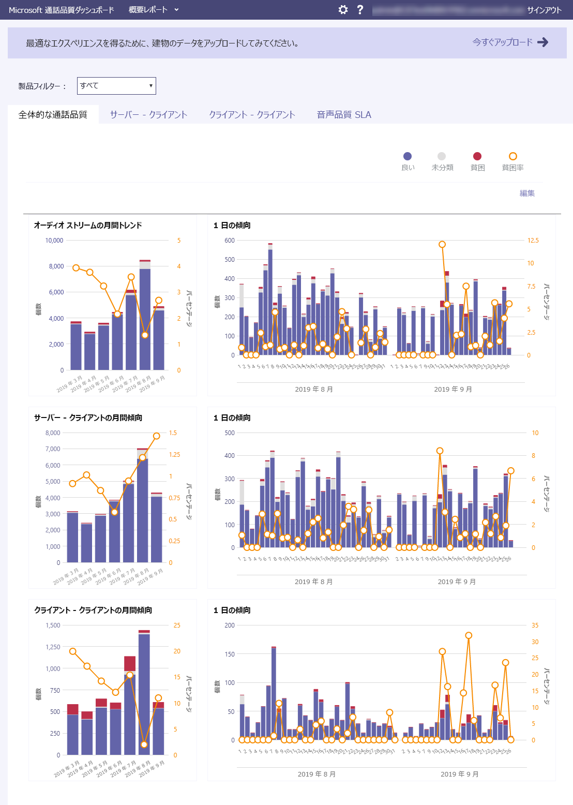

# 通話分析および通話品質ダッシュボードCall Analytics and Call Quality Dashboard

マイクロソフトのチームとビジネス用の Skype が得を監視し、通話品質の問題をトラブルシューティングするための 2 つの方法: 呼び出しの分析と品質のダッシュ ボードを呼び出します。Microsoft Teams and Skype for Business give you two ways to monitor and troubleshoot call-quality problems: Call Analytics and Call Quality Dashboard. この記事では、これらの両方について説明し、どのような場合にそれぞれの方法を使用するべきかを示します。This article describes both and tells you when to use each one.

呼び出しの分析と救難が並列で実行し、個別にまたは一緒に使用することができます。Call Analytics and CQD run in parallel and can be used independently or together. たとえば、サポート ・ スペシャ リストは、呼び出しに関する問題のトラブルシューティング ヘルプが必要があることを決定する通信があるとします。For example, say a communications support specialist determines that they need more help troubleshooting a call problem. 通信のサポート担当者は、分析機能の呼び出しで通信スペシャ リストのサポートの詳細については、アクセス権を持つ通信サポート ・ エンジニアへの呼び出しを渡します。The communications support specialist passes the call to a communications support engineer, who has access to more information in Call Analytics than the communications support specialist. さらに、通信のサポート ・ エンジニアは、ネットワーク ・ エンジニアの問題を警告できます。In turn, the communications support engineer can alert a network engineer to an issue. ネットワーク エンジニア リングは、全体的なサイトに関連する問題が呼び出しに関する問題の原因の原因になる可能性があるかどう救難をチェックします。The network engineer might check CQD to see if an overall site-related issue could be a contributing cause of call problems.

## 通話分析とは何ですか? どのような場合に使用するものですか?What's Call Analytics, and when should I use it?

**呼び出しの分析は、[マイクロソフトのチーム管理センター](https://admin.teams.microsoft.com)でされています。****Call Analytics is now available in the [Microsoft Teams admin center](https://admin.teams.microsoft.com).** すべてのコール情報とユーザーのデータを表示するには、[**呼び出し履歴**] タブを使用します。ダッシュ ボードからユーザーを検索するか、[プロファイル] ページでユーザーの検索、または左側のナビゲーションで、**ユーザー**からユーザーを検索してこれを行うことができます。To see all of the call information and data for a user, use the **Call History** tab. You can do this by looking on the user's profile page by either searching for the user from the dashboard or finding the user from **Users** in the left navigation.

分析機能の呼び出しは、デバイス、ネットワーク、および特定のコールとビジネス アカウントに、マイクロソフトのチームまたは Skype では、各ユーザーが会議に関連する接続に関する詳細情報を示しています。Call Analytics shows detailed information about the devices, networks, and connectivity related to the specific calls and meetings for each user in a Microsoft Teams or Skype for Business account. このユーザーは午後の不適切な呼び出しを理由がでしたか。Why did this user have a poor call this afternoon? 分析機能の呼び出しを使用して、Office 365 の管理者またはヘルプデスクの訓練を受けたエージェント調べることができます、デバイス、ネットワーク、接続、およびマイクロソフトのチームとビジネス用の Skype の通話品質と接続の問題をトラブルシューティングするのには彼の呼び出しに関連するその他の要因です。Using Call Analytics, an Office 365 admin or trained helpdesk agent can investigate the device, network, connectivity, and other factors related to his call to troubleshoot call quality and connection problems in Microsoft Teams and Skype for Business.

マイクロソフトのチームの管理センターでユーザーにこの情報を表示するには、すべての通話や会議を表示してそのユーザーが過去 30 日間の参加しているユーザーの詳細ページで、そのユーザーの [**通話履歴**] タブをクリックします。To see this information for a user in the Microsoft Teams admin center, click the **Call History** tab for that user in the user detail page, showing all the calls and meetings that user has participated in for the last 30 days.

メディアの詳細を含む、ネットワークの統計情報の特定のセッションに関する追加情報を取得するには、詳細を表示するセッションをクリックします。To get additional information about a given session including detailed media and networking statistics, click on a session to see the details.

管理者以外が、外部の仕入先からのヘルプデスク担当者などをする場合は分析機能の呼び出しを使用することができますアクセス許可を割り当てる分析機能の呼び出しを使用することができますが、マイクロソフトのチームの管理センターの残りの部分にアクセスすることはできません。If you want non-admins, such as helpdesk agents from an external vendor, to use Call Analytics, you can assign permissions so that they can use Call Analytics, but they can't access the rest of the Microsoft Teams admin center: 
  
- **ヘルプデスク エージェント通信のスペシャ リストのアクセス許可をサポートする**: エージェントは、限られたデータと分析の呼び出しで、個人を特定できる情報 (PII) を参照してください。**Helpdesk agents with communications support specialist permissions**: Agents see a limited set of data and personally identifiable information (PII) in Call Analytics. 呼び出しをトラブルシューティングすることができますが、通信のサポート ・ エンジニアに会議の問題を渡します。They can troubleshoot calls, but they will hand off problems with meetings to a communications support engineer.
    
- **通信ヘルプデスク担当者は、エンジニア リングのアクセス許可をサポート**: エージェントは、分析機能の呼び出しで使用可能なすべてのデータを参照してくださいし、通話や会議の両方のトラブルシューティングを行います。**Helpdesk agents with communications support engineer permissions**: Agents see all available data in Call Analytics and troubleshoot both calls and meetings. 通話ログやユーザー情報に対するフル アクセスが付与されています。They have full access to call logs and customer information.

> [!NOTE]
> 通信のサポート ・ スペシャ リストの役割第 1 層のサポートの役割をプレビュー ポータルからと同じ通信のサポート ・ エンジニアの役割は、プレビュー ポータルから第 2 層のサポートの役割と同じです。The communications support specialist role is equivalent to tier 1 support role from the preview portal and the communications support engineer role is equivalent to tier 2 support role from the preview portal.

サポート担当者との通信通信の詳細については、エンジニアの役割をサポートして、[チームを管理する管理者の役割を使用してマイクロソフトのチーム](using-admin-roles.md)を参照してください。For more information about the communications support specialist and communications support engineer roles, see [Use Microsoft Teams admin roles to manage teams](using-admin-roles.md).

> [!IMPORTANT]
> ヘルプデスク エージェントのアクセス許可およびネットワーク トポロジのアップロードは、マイクロソフトのチームの管理センターでは可能です。Helpdesk agent permissions and network topology upload are available in the Microsoft Teams admin center. 通信のサポート ・ スペシャ リストとの通信のサポート エンジニアは、分析機能の呼び出しと呼び出し品質のダッシュ ボードにアクセスするのにはこのポータルを使用できます。Communications Support Specialists and Communications Support Engineers can use this portal to access Call Analytics and the Call Quality Dashboard.
    
通話分析のセットアップの詳細については、「[Skype for Business の通話分析のセットアップ](set-up-call-analytics.md)」をご覧ください。For details about setting up Call Analytics, see [Set up Skype for Business Call Analytics](set-up-call-analytics.md). ヘルプデスクの担当者が分析機能の呼び出しを機能させる方法の詳細については、[品質の低い呼び出しのトラブルシューティングを行うコール分析機能の使用](use-call-analytics-to-troubleshoot-poor-call-quality.md)を参照してください。For more information about how Helpdesk agents can work with Call Analytics, see [Use Call Analytics to troubleshoot poor call quality](use-call-analytics-to-troubleshoot-poor-call-quality.md).
  
## 通話品質ダッシュボードとは何ですか? どのような場合に使用するものですか?What's the Call Quality Dashboard, and when should I use it?
  
CA は、管理者のために設計されています。 ヘルプデスク エージェントが特定の呼び出しでは、通話品質の問題をトラブルシューティング呼び出し品質ダッシュ ボード (救難) は、マイクロソフトのチームの管理者、ビジネス管理者、Skype のために設計されています。 とネットワーク ・ エンジニアは、ネットワークを最適化します。Where CA is designed to help admins and helpdesk agents troubleshoot call quality problems with specific calls, the Call Quality Dashboard (CQD) is designed to help Microsoft Teams admins, Skype for Business admins, and network engineers optimize a network. 救難フォーカスを特定のユーザーから、代わりに次の全体の集計情報をマイクロソフトのチームまたは Skype ビジネス組織のCQD shifts focus from specific users and instead looks at aggregate information for an entire Microsoft Teams or Skype for Business organization. 詳細については、「[Skype for Business Online の通話品質ダッシュボードの機能](turning-on-and-using-call-quality-dashboard.md#BKMKFeaturesOfTheCQD)」をご覧ください。For more details, see [Features of the Call Quality Dashboard for Skype for Business Online](turning-on-and-using-call-quality-dashboard.md#BKMKFeaturesOfTheCQD).
  
ユーザーの不適切な通話の音質が他の多くのユーザーにも影響を与えることはネットワークの問題のためかもしれません。Maybe the user's poor call quality is due to a network issue that's also affecting many other users. 個々 の呼び出し場合救難で表示されているですが、マイクロソフトのチームまたは Skype を使用してビジネスのための呼び出しの全体的な品質を取得します。The individual call experience isn't visible in CQD, but the overall quality of calls made using Microsoft Teams or Skype for Business is captured. CQD では、全体のパターンが明らかに示され、ネットワーク エンジニアは確かな情報に基づく通話品質の評価を行えるようになります。With the CQD, overall patterns may become apparent, allowing network engineers to make informed assessments of call quality. 救難の洞察を提供する通話品質測定基準のレポートを呼び出す全体的な品質、ストリームをサーバーからクライアント、クライアント ストリーム、および音声品質の[SLA](https://go.microsoft.com/fwlink/p/?linkid=846252)を提供します。CQD provides reports of call quality metrics that give you insights into overall call quality, server-client streams, client-client streams, and voice quality [SLA](https://go.microsoft.com/fwlink/p/?linkid=846252).
  

救難の Location-Enhanced のレポートで、集計の通話品質と信頼性のユーザーの建物内で評価できます問題は 1 人のユーザーかユーザーの大規模なセグメントに影響を与えるかを確認します。With the help of CQD's Location-Enhanced Reports, aggregate call quality and reliability within the user's building can be assessed to determine if the problem is isolated to a single user or affects a larger segment of users.

> [!NOTE]
> 救難の建物固有のビューを有効にするには、管理者は救難のテナントのデータのアップロード] ページの[建物の情報をアップロード](turning-on-and-using-call-quality-dashboard.md#BKMKBuildingInformationUpload)する必要があります。To enable building-specific views in CQD, an admin must [upload building information](turning-on-and-using-call-quality-dashboard.md#BKMKBuildingInformationUpload) on CQD's Tenant Data Upload page.

非管理者、ヘルプデスクの担当者などをする場合は品質ダッシュ ボードの呼び出しを使用するのには割り当てることができますそれらのユーザー**通信のサポート ・ エンジニアのチーム**、**チーム ・ コミュニケーション ・ サポート ・ スペシャ リスト**、または**レポートの閲覧者**の役割。If you want non-admins, such as helpdesk agents, to use Call Quality Dashboard, you can assign those users the **Teams Communications Support Engineer**, **Teams Communications Support Specialist**, or **Reports Reader** role. 次のロールを持つユーザーは、品質のダッシュ ボードの呼び出しでアクセスできます。Users with the following roles can access Call Quality Dashboard:

- グローバル管理者Global Administrator
- Skype のビジネス管理者Skype for Business Administrator
- Teams サービス管理者Teams Service Administrator
- Teams 通信管理者Teams Communications Administrator
- Teams 通信サポート エンジニアTeams Communications Support Engineer
- チーム ・ コミュニケーション ・ サポート ・ スペシャ リストTeams Communications Support Specialist
- レポート リーダーReports Reader

> [!NOTE]
> 通信サポート ・ エンジニアのチーム、チーム コミュニケーションのサポート ・ スペシャ リスト、およびレポートの閲覧者の役割は、救難のテナントのデータのアップロード] ページでファイルを変更も、テナントの救難をアクティブにすることはできません。The Teams Communications Support Engineer, Teams Communications Support Specialist, and Reports Reader roles cannot modify files on CQD's Tenant Data Upload page nor activate CQD for a tenant.

これらの役割の詳細については、 [Office 365 の管理者の役割](/office365/admin/add-users/about-admin-roles)を参照してください。For more information about these roles, see [About Office 365 admin roles](/office365/admin/add-users/about-admin-roles).

救難に関する詳細について[を有効にしてマイクロソフトのチームとビジネス オンラインの Skype の品質ダッシュ ボードの呼び出しを使用して](turning-on-and-using-call-quality-dashboard.md)、[ディメンションとメジャーのマイクロソフトのチームとビジネス オンラインの Skype の品質ダッシュ ボードの呼び出しで使用可能な](dimensions-and-measures-available-in-call-quality-dashboard.md)を参照してください。For more information about CQD, see [Turning on and using Call Quality Dashboard for Microsoft Teams and Skype for Business Online](turning-on-and-using-call-quality-dashboard.md) and [Dimensions and measures available in Call Quality Dashboard for Microsoft Teams and Skype for Business Online](dimensions-and-measures-available-in-call-quality-dashboard.md).
  
## 関連トピックRelated topics

[ビデオ: 通話品質の概要Video: Call Quality Overview](https://aka.ms/teams-quality)

[通話分析をセットアップするSet up Call Analytics](set-up-call-analytics.md)

[通話分析を使用して低品質の通話をトラブルシューティングするUse Call Analytics to troubleshoot poor call quality](use-call-analytics-to-troubleshoot-poor-call-quality.md)

[有効にして、マイクロソフトのチームと Skype のオンライン ビジネスの品質のダッシュ ボードの呼び出しを使用してTurning on and using Call Quality Dashboard for Microsoft Teams and Skype for Business Online](turning-on-and-using-call-quality-dashboard.md)
