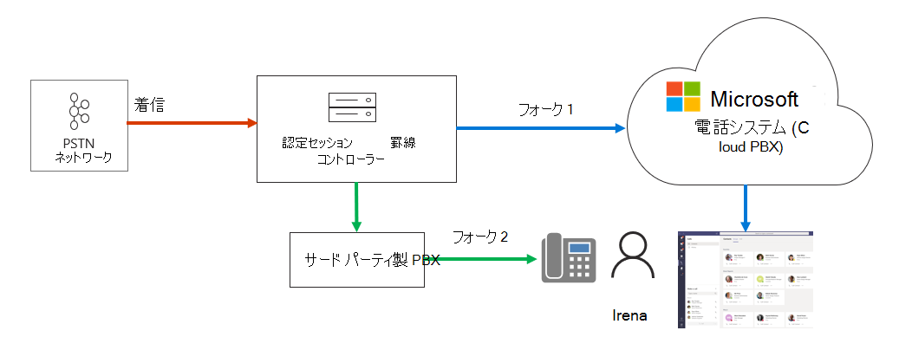
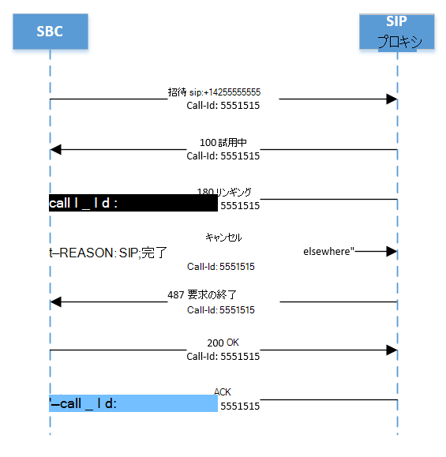

# 着信通知の管理

この記事では、ユーザーの通話通知を管理する方法について説明します。 通話エンドポイントは、Teams とサードパーティの構内交換 (PBX) またはセッションボーダーコントローラー (SBC) の両方に対して構成できます。  これは、たとえば、ユーザーのモバイルおよび卓上電話に同時に通話を送信する場合に便利です。   

次の図では、ユーザー Irena に2つのエンドポイントがあります。

- Teams のエンドポイント
- サードパーティの SBC に接続された SIP 電話

通話が着信すると、SBC は、電話システムのダイレクトルーティングとサードパーティの SBC の間の通話をフォークします。

通話が Fork 2 (サードパーティの SBC) で受け入れられた場合、Teams は「不在着信」の通知を生成します。  

次のようにして、Fork 1 でキャンセルを送信するように SBC を設定すると、"不在着信" の通知を防ぐことができます。

理由: SIP;原因 = 200; テキスト "通話がどこかで完了しました" 

通話は、Microsoft 電話システムの通話の詳細レコードに正常に通話として登録されないことに注意してください。 通話は "試行" として登録されます。これには、最終 SIP コード "487"、最終的な Microsoft コードの "540200"、最終 SIP コードフレーズ "通話はどこかで完了しました" となります。  (通話の詳細レコードを表示するには、Teams 管理ポータル、分析とレポート、利用状況レポート、[PSTN の利用状況] を選択します)。

次の図は、Fork 1 での SIP のはしごを示しています。通話フローと、キャンセルメッセージで想定される理由について説明しています。 

