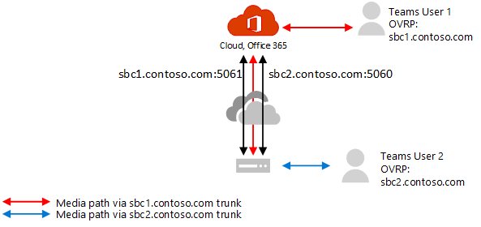

# ダイレクト ルーティングでメディア バイパスを構成する

ダイレクト ルーティングを使用してメディア バイパスを構成する前に、「 [ダイレクト ルーティングを使用したメディア バイパスの計画](direct-routing-plan-media-bypass.md)」を必ず参照してください。

メディア バイパスを有効にするには、次の条件を満たす必要があります。

1.    選択したセッション ボーダー コントローラー (SBC) ベンダーがメディア バイパスをサポートし、SBC でバイパスを構成する方法について説明していることを確認します。 メディア バイパスをサポートする SBC と手順については、認定ページを参照してください。

2.    トランクでメディア バイパスを有効にする必要があります。  **Set-CSOnlinePSTNGateway -Identity <sbc_FQDN> -MediaBypass $true**。

3.    必要なポートが開かれていることを確認します。 

## バイパスされていないトランクからバイパスが有効なトランクに移行する

すべてのユーザーを一度に切り替えたり、段階的なアプローチ (推奨) を実装したりできます。

- **すべてのユーザーを一度に切り替えます。** すべての条件が満たされている場合は、バイパス モードをオンにすることができます。 ただし、すべての運用ユーザーは同時に切り替えられます。 トランクとポートを構成すると、最初にいくつかの問題が発生する可能性があるため、運用ユーザー エクスペリエンスが影響を受ける可能性があります。 

- **段階的なアプローチ。(推奨)**。  同じ SBC の新しいトランクを (別のポートを使用して) 作成し、テストし、ユーザーが新しいトランクを指すようにオンライン音声ルーティング ポリシーを変更します。 

  これは、スムーズな移行と中断のないユーザー エクスペリエンスを可能にするため、推奨されるアプローチです。 この方法では、SBC の構成、新しい FQDN 名、ファイアウォールの構成が必要です。 証明書が両方のトランクをサポートしていることを確認する必要があることに注意してください。 SAN では、2 つの名前 (**sbc1.contoso.com** と **sbc2.contoso.com**) またはワイルドカード証明書が必要です。

トランクを構成して移行を実行する方法については、SBC ベンダーのドキュメントを参照してください。

- [AudioCodes のデプロイに関するドキュメント](https://www.audiocodes.com/solutions-products/products/products-for-microsoft-365/direct-routing-for-microsoft-teams)
- [Oracle デプロイのドキュメント](https://www.oracle.com/industries/communications/enterprise-session-border-controller/microsoft.html)
- [リボン 通信の展開に関するドキュメント](https://ribboncommunications.com/solutions/enterprise-solutions/microsoft-solutions/direct-routing-microsoft-teams-calling)
- [TE-Systems (anynode) の展開に関するドキュメント](https://www.anynode.de/anynode-and-microsoft-teams/)

ダイレクト ルーティング用に認定されたセッション ボーダー コントローラー (SBC) の一覧については、「 [ダイレクト ルーティングで認定されたセッション Broder コントローラーの一覧」を](direct-routing-border-controllers.md)参照してください。

## 関連項目

[ダイレクト ルーティングを使用してメディア バイパスを計画する](direct-routing-plan-media-bypass.md)

