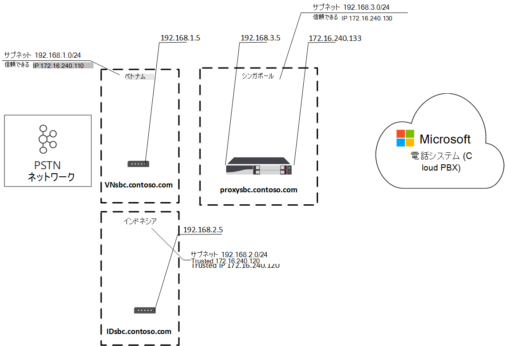
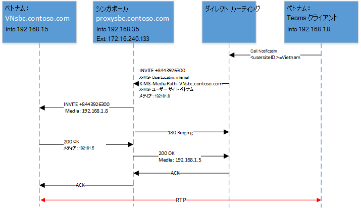
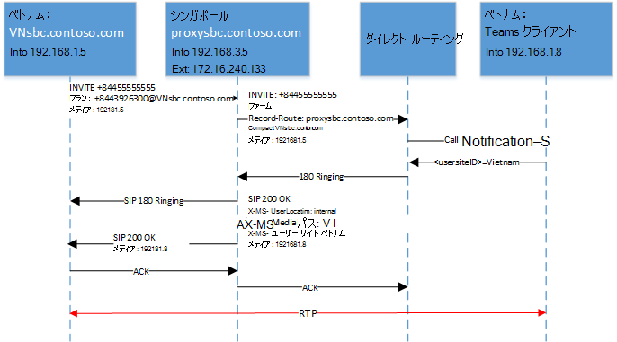
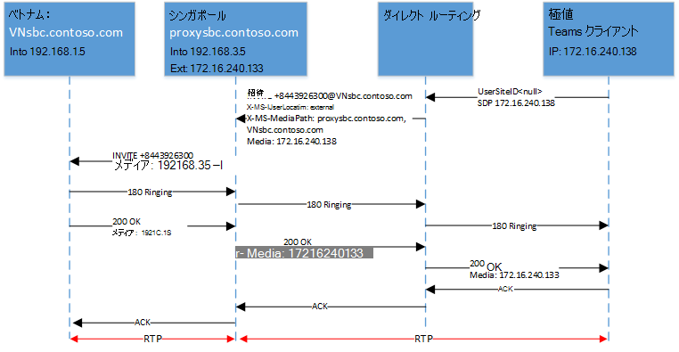
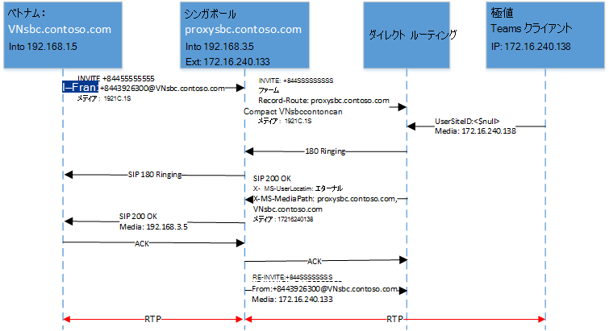
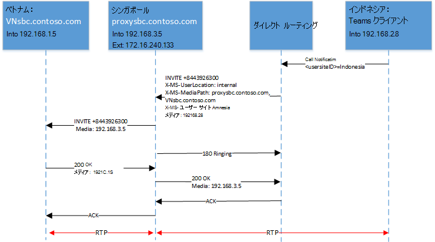
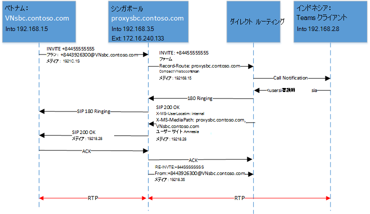

# <a name="configure-local-media-optimization-for-direct-routing"></a>直接ルーティング用のローカルメディア最適化を構成する

ローカルメディア最適化の構成は、場所に基づくルーティングや動的な緊急通話など、他のクラウド音声機能に共通するネットワーク設定に基づいています。 ネットワーク領域、ネットワークサイト、ネットワークサブネット、および信頼された IP アドレスの詳細については、「[クラウド音声機能のネットワーク設定](cloud-voice-network-settings.md)」を参照してください。

ローカルメディア最適化を構成する前に、「[直接ルーティング用のローカルメディアの最適化](direct-routing-media-optimization.md)」をご覧ください。  

ローカルメディア最適化を構成するには、次の手順を実行する必要があります。 Teams 管理センターまたは PowerShell を使うことができます。 詳細については、「[ネットワークトポロジを管理する](manage-your-network-topology.md)」を参照してください。

1. ユーザーと SBC サイトを構成します (この記事で説明します)。
2. (SBC ベンダー仕様に従って) ローカルメディア最適化用に SBCs を構成します。

次の図は、この記事の例で使用されているネットワークセットアップを示しています。




## <a name="configure-the-user-and-the-sbc-sites"></a>ユーザーと SBC サイトを構成する

ユーザーと SBC サイトを構成するには、次のことを行う必要があります。

1. [外部の信頼できる IP アドレスを管理](#manage-external-trusted-ip-addresses)する。  

2. ネットワークの領域、ネットワークサイト、ネットワークサブネットを構成して、[ネットワークトポロジを定義](#define-the-network-topology)します。

3. 関連するモードとプロキシの SBC 値を使って、サイトに SBC (s) を割り当てることで[、仮想ネットワークトポロジを定義](#define-the-virtual-network-topology)します。


## <a name="configure-sbcs-for-local-media-optimization-according-to-the-sbc-vendor-specification"></a>SBC ベンダー仕様に従って、ローカルメディア最適化用に SBC を構成する

この記事では、Microsoft コンポーネントの構成について説明します。 SBC 構成の詳細については、SBC ベンダーの documenation を参照してください。

ローカルメディア最適化は、次の SBC ベンダーによってサポートされています。

| 仕入先 | Product |    ソフトウェアのバージョン |
|:------------|:-------|:-------| :-------|
| [AudioCodes](https://www.audiocodes.com/media/13253/connecting-audiocodes-sbc-to-microsoft-teams-direct-routing-enterprise-model-configuration-note.pdf) |    Mediant 500 SBC |   7.20 a. 256 | 
|            |  Mediant 800 SBC |   7.20 a. 256 | 
|            |  Mediant 2600 SBC |  7.20 a. 256 | 
|            |  Mediant 4000 SBC |  7.20 a. 256 | 
|            |  Mediant 1000B SBC | 7.20 a. 256 | 
|            |  Mediant 9000 SBC |  7.20 a. 256 | 
|            |  Mediant Virtual Edition SBC |   7.20 a. 256 | 
|            |  Mediant Cloud Edition SBC | 7.20 a. 256 |
| [リボンの SBC コア](https://support.sonus.net/display/ALLDOC/SBC+8.2+-+Configure+Local+Media+Optimization)  |  SBC 5110         | 8.2  |
|            |  SBC 5210         | 8.2  |
|            |  SBC 5400         | 8.2  |
|            |  SBC 7000         | 8.2  |
|            |  SBC SWe          | 8.2  |
| [TE-SYSTEMS](https://www.anynode.de/local_media_optimization/) |  anynode          | 4.0.1 + |
| [Oracle](https://www.oracle.com/industries/communications/enterprise-communications/session-border-controller/microsoft.html) | AP 1100 | 8.4.0.0.0 |
|        | AP 3900 | 8.4.0.0.0 |
|        | AP 4600 | 8.4.0.0.0 | 
|        | AP 6300 | 8.4.0.0.0 |
|        | AP 6350 | 8.4.0.0.0 | 
|        | VME     | 8.4.0.0.0 |


## <a name="manage-external-trusted-ip-addresses"></a>外部の信頼できる IP アドレスを管理する

外部の信頼できる Ip は、エンタープライズネットワークのインターネット外部 Ip です。 これらの IP アドレスは、microsoft Teams クライアントが Microsoft 365 に接続したときに使用される IP アドレスです。 ユーザーがローカルメディア最適化を使用しているサイトごとに、これらの外部 Ip を追加する必要があります。

各サイトのパブリック IP アドレスを追加するには、CsTenantTrustedIPAddress コマンドレットを使用します。 1つのテナントに対して無制限の数の信頼できる IP アドレスを定義できます。 Microsoft 365 によって表示される外部 Ip が IPv4 アドレスと IPv6 アドレスの両方である場合は、両方の種類の IP アドレスを追加する必要があります。 IPv4 の場合は、マスク32を使用します。 IPv6 の場合は、マスク128を使用します。 コマンドレットで異なる MaskBits を指定することで、個々の外部 IP アドレスと外部 IP サブネットの両方を追加できます。

```
New-CsTenantTrustedIPAddress -IPAddress <External IP address> -MaskBits <Subnet bitmask> -Description <description>
```


信頼された IP アドレスを追加する例。

```
New-CsTenantTrustedIPAddress -IPAddress 172.16.240.110 -MaskBits 32 -Description "Vietnam site trusted IP"
New-CsTenantTrustedIPAddress -IPAddress 172.16.240.120 -MaskBits 32 -Description "Indonesia site trusted IP"
New-CsTenantTrustedIPAddress -IPAddress 172.16.240.130 -MaskBits 32 -Description "Singapore site trusted IP"
```


## <a name="define-the-network-topology"></a>ネットワークトポロジを定義する

このセクションでは、ネットワークトポロジのネットワーク領域、ネットワークサイト、ネットワークサブネットを定義する方法について説明します。

すべてのパラメーターは大文字と小文字を区別するため、セットアップ時に使用したのと同じケースを確実に使用する必要があります。  (たとえば、GatewaySiteID の値 "ベトナム" と "ベトナム" は、別のサイトとして扱われます)。

### <a name="define-network-regions"></a>ネットワーク領域を定義する

ネットワーク領域を定義するには、CsTenantNetworkRegion コマンドレットを使用します。 RegionID パラメーターは、地域の地理を表す論理名であり、依存関係または制限がありません。 CentralSite <site ID>パラメーターは省略可能です。

```
New-CsTenantNetworkRegion -NetworkRegionID <region ID>  
```

次の例では、APAC という名前のネットワーク領域を作成します。

```
New-CsTenantNetworkRegion -NetworkRegionID "APAC"  
```

###  <a name="define-network-sites"></a>ネットワークサイトを定義する

ネットワークサイトを定義するには、CsTenantNetworkSite コマンドレットを使用します。 各ネットワークサイトは、ネットワーク領域に関連付けられている必要があります。

```
New-CsTenantNetworkSite -NetworkSiteID <site ID> -NetworkRegionID <region ID>
```

次の例では、APAC 地域で3つの新しいネットワークサイト、ベトナム、インドネシア、シンガポールを作成します。

```
New-CsTenantNetworkSite -NetworkSiteID "Vietnam" -NetworkRegionID "APAC"
New-CsTenantNetworkSite -NetworkSiteID "Indonesia" -NetworkRegionID "APAC"
New-CsTenantNetworkSite -NetworkSiteID "Singapore" -NetworkRegionID "APAC"
```

### <a name="define-network-subnets"></a>ネットワークサブネットを定義する

ネットワークサブネットを定義してネットワークサイトに関連付けるには、CsTenantNetworkSubnet コマンドレットを使用します。 各ネットワークサブネットは、1つのサイトにのみ関連付けることができます。 

```
New-CsTenantNetworkSubnet -SubnetID <Subnet IP address> -MaskBits <Subnet bitmask> -NetworkSiteID <site ID>
```

次の例では、3つのネットワークサブネットを定義し、それをベトナム、インドネシア、シンガポールという3つのネットワークサイトに関連付けます。

```
New-CsTenantNetworkSubnet -SubnetID 192.168.1.0 -MaskBits 24 -NetworkSiteID “Vietnam”
New-CsTenantNetworkSubnet -SubnetID 192.168.2.0 -MaskBits 24 -NetworkSiteID “Indonesia”
New-CsTenantNetworkSubnet -SubnetID 192.168.3.0 -MaskBits 24 -NetworkSiteID “Singapore”
```

## <a name="define-the-virtual-network-topology"></a>仮想ネットワークトポロジを定義する 

まず、テナント管理者は、CsOnlinePSTNGateway コマンドレットを使用して、関連する SBC ごとに新しい SBC 構成を作成します。
テナント管理者は、CsOnlinePSTNGateway コマンドレットを使用して、PSTN ゲートウェイオブジェクトのネットワークサイトを指定することで、仮想ネットワークトポロジを定義します。

```
PS C:\> Set-CsOnlinePSTNGateway -Identity <Identity> -GatewaySiteID <site ID> -MediaBypass <true/false> -BypassMode <Always/OnlyForLocalUsers> -ProxySBC  <proxy SBC FQDN or $null>
```

次の点に注意してください。 
   - 顧客が1つの SBC を使用している場合は、-ProxySBC パラメーターは必須 $null または SBC FQDN 値 (集中型 trunks シナリオを持つ集中型 SBC) である必要があります。
   - ローカルメディアの最適化をサポートするには、-MediaBypass ・・・・・バイのパラメーターが $true に設定されている必要があります。
   - SBC に-BypassMode パラメーターが設定されていない場合、X ミリ秒のヘッダーは送信されません。 
   - すべてのパラメーターは大文字と小文字を区別するため、セットアップ時に使用したのと同じケースを確実に使用する必要があります。  (たとえば、GatewaySiteID の値 "ベトナム" と "ベトナム" は、別のサイトとして扱われます)。

次の例では、APAC 領域の2つの SBCs をネットワークサイトに追加します。これは、モードが常にバイパスされます。

```
Set-CSOnlinePSTNGateway -Identity “proxysbc.contoso.com” -GatewaySiteID “Singapore” -MediaBypass $true -BypassMode “Always” -ProxySBC $null

Set-CSOnlinePSTNGateway -Identity “VNsbc.contoso.com” -GatewaySiteID “Vietnam” -MediaBypass $true -BypassMode “Always” -ProxySBC “proxysbc.contoso.com”

Set-CSOnlinePSTNGateway -Identity “IDsbc.contoso.com” -GatewaySiteID “Indonesia” -MediaBypass $true -BypassMode “Always” -ProxySBC “proxysbc.contoso.com”
```

注: ローカルメディア最適化と位置情報に基づくルーティング (LBR) を同時に構成するときに中断のない操作を行うには、GatewaySiteLbrEnabled パラメーターを各下流の SBC の $true に設定して、下位の SBCs を LBR に対して有効にする必要があります。 (この設定はプロキシ SBC には必須ではありません)。

上記の情報に基づいて、次の表に示すように、直接ルーティングを行うと、SIP の招待に対しては3つの専用 SIP ヘッダーが含まれます。

BypassMode が定義されている場合に、招待と再招待の際に直接ルーティングで導入された X-MS ヘッダー。

| ヘッダー名 | Values | 注釈 | 
|:------------|:-------|:-------|
| エックス--UserLocation | 内部/外部 | ユーザーが内部と外部のどちらであるかを示します |
| 要求-URI 招待 sip: + 84439263000@VNsbc.contoso.com SIP/2.0 | SBC FQDN | SBC が直接ルーティングに直接接続されていない場合でも、通話の対象となる FQDN |
| MediaPath | 例: proxysbc.contoso.com、VNsbc.contoso.com | ユーザーとターゲットの間のメディアパスに使用する SBCs の順序です。 最後の SBC は常に最終です |
| -MS-UserSite | usersiteID | テナント管理者によって定義された文字列 |

## <a name="call-flows"></a>コールフロー 

次に、2つのモードのコールフローを示します。

- [常にバイパス](#always-bypass-mode)
- [ローカルユーザーのみ](#only-for-local-users-mode)

### <a name="always-bypass-mode"></a>常にバイパスモード

[常にバイパス] モードは、構成するのに最も簡単なオプションです。 テナント管理者は、すべてのユーザーに対して1つのサイトを構成することができます。すべてのサイトからすべての SBCs に到達可能である場合は、SBCs になります。

次のシナリオでは、この例では常にバイパスモードが表示されます。

- [発信通話とユーザーは SBC と同じ場所にあります。](#outbound-calls-and-the-user-is-in-the-same-location-as-the-sbc-with-always-bypass)
- [着信通話とユーザーは SBC と同じ場所にあります。](#inbound-calls-and-the-user-is-in-the-same-location-as-the-sbc-with-always-bypass)
- [発信通話とユーザーは外部です](#outbound-calls-and-the-user-is-external-with-always-bypass)
- [着信通話とユーザーは外部](#inbound-calls-and-the-user-is-external-with-always-bypass)

次の表は、例で使用される FQDN と IP アドレスを示しています。

| FQDN | SBC 外部 IP アドレス | SBC 内部 IP アドレス | 内部サブネット | 場所 | 外部 NAT (信頼できる IP) |
|:------------|:-------|:-------|:-------|:-------|:-------|
| VNsbc.contoso.com | なし | 192.168.1.5 | 192.168.1.0/24 | ベトナム | 172.16.240.110 |
| IDsbc.contoso.com | なし | 192.168.2.5 | 192.168.2.0/24 | インドネシア | 172.16.240.120 |
| proxysbc.contoso.com | 172.16.240.133 | 192.168.3.5 | 192.168.3.0/24 | シンガポール | 172.16.240.130 |


#### <a name="outbound-calls-and-the-user-is-in-the-same-location-as-the-sbc-with-always-bypass"></a>発信通話とユーザーは、常にバイパスの SBC と同じ場所にあります

| モード |    ユーザー |  場所 |  通話の方向 |
|:------------|:-------|:-------| :-------|
| 常にバイパス |    内部 |  SBC と同じサイト |  発信 |

次の表は、エンドユーザーの構成とアクションを示しています。

| ユーザーの物理的な場所| ユーザーが電話番号を発信または受信した場合 | ユーザの電話番号  | オンラインボイスルーティングポリシー | SBC 用に構成されたモード |
|:------------|:-------|:-------|:-------|:-------|
| ベトナム | + 84 4 3926 3000 | + 84 4 5555 5555   | 優先度 1:\+^ 84 ({9}\d) $-VNsbc.contoso.com <br> 優先度 2:. *-proxysbc.contoso.com   | VNsbc.contoso.com –常にバイパス <br> proxysbc.contoso.com –常にバイパス


次の図は、常にバイパスモードを使用した発信通話の SIP のはしごと、SBC と同じ場所にいるユーザーを示しています。



次の表は、直接ルーティングによって送信された X-MS ヘッダーを示しています。

| パラメーター | 説明 |
|:------------|:-------|
| 招待 + 8443926300@VNsbc.contoso.com | オンラインボイスルーティングポリシーで定義された SBC のターゲット名は、要求 URI で送信されます | 
| X--UserLocation: internal | このフィールドは、ユーザーが企業ネットワーク内に配置されていることを示しています |
| MediaPath: VNsbc.contoso.com |   クライアントがターゲット SBC にどの SBC を通過する必要があるかを指定します。 この例では、常にバイパスしているため、クライアントはヘッダーで唯一の名前として送信されるターゲット名です。 | 
|----UserSite: ベトナム |   ユーザーが配置されているサイトで示されているフィールド。 |


#### <a name="inbound-calls-and-the-user-is-in-the-same-location-as-the-sbc-with-always-bypass"></a>着信通話とユーザーは、常にバイパスの SBC と同じ場所にあります

| モード |    ユーザー |  場所 |  通話の方向 |
|:------------|:-------|:-------|:-------|:-------|
| 常にバイパス |    内部 | SBC と同じサイト | トラフィック |


着信通話では、ユーザーの場所が不明であり、SBC はユーザーがどこにいるかを推測する必要があります。 推測が正しくない場合は、再招待が必要になります。 この例では、ユーザーが内部であることを前提としています。メディアは直接流れることができ、それ以上の操作は必要ありません (再招待)。
ダイレクトルーティングサービスに接続された SBC は、レコードルーティングと連絡先フィールドを提供して、送信元の SBC の位置情報を報告します。 これらのフィールドに基づいて、メディアパスはダイレクトルーティングによって計算されます。

注: ユーザーが複数のエンドポイントを持つことができる場合、183のサポートはできません。 この場合、直接ルーティングでは常に180呼び出しが使用されます。 

次の図は、Always バイパスモードの着信呼び出しでの SIP のはしごを示しています。ユーザーは SBC と同じ場所にあります。




#### <a name="outbound-calls-and-the-user-is-external-with-always-bypass"></a>発信通話とユーザーは外部であり、常にバイパスする

| モード |    ユーザー |  サイト |  通話の方向
|:------------|:-------|:-------|:-------|
常にバイパス |  外部 |  該当なし | 発信 |


次の図は、常にバイパスモードの発信通話に関する SIP のはしごを示しています。ユーザーは外部であることを示しています。



次の表は、ダイレクトルーティングサービスによって送信された X ミリ秒のヘッダーを示しています。

| パラメーター |   説明 |
|:------------|:-------|
|招待 + 8443926300@VNsbc.contoso.com | オンラインボイスルーティングポリシーで定義された SBC のターゲット名は、要求 URI で送信されます。|
| X--UserLocation: external | このフィールドは、ユーザーが企業ネットワークの外部にあることを示しています。 |
| MediaPath: proxysbc.contoso.com、VNsbc.contoso.com    | クライアントがターゲット SBC にどの SBC を通過する必要があるかを指定します。 この例では、常にバイパスしており、クライアントは外部です。 |

#### <a name="inbound-calls-and-the-user-is-external-with-always-bypass"></a>着信通話とユーザーは外部であり、常にバイパスする

| モード | ユーザー | サイト |  通話の方向 |
|:------------|:-------|:-------|:-------|
常にバイパス |  外部 |  該当なし |   トラフィック |

着信通話の場合、直接ルーティングに接続された SBC は、ユーザーの場所が外部である場合は、再招待を送信する必要があります (既定では、ローカルメディア候補は常に提供されています)。  X-MediaPath は、指定されたレコードルートと SBC ユーザーに基づいて計算されます。

次の図は、常にバイパスモードの着信呼び出しに対する SIP のはしごを示しています。また、ユーザーは外部であることを示しています。




### <a name="only-for-local-users-mode"></a>ローカルユーザーモードに対してのみ

ターゲット SBC のローカルメディア候補は、ユーザーが SBC と同じ場所にいる場合にのみ提供されます。 それ以外の場合、メディアはプロキシ SBC の内部または外部 IP 経由で送信されます。

次のシナリオについて説明します。

- [発信通話とユーザーは SBC と同じ場所にあります。](#outbound-calls-and-the-user-is-in-the-same-location-as-the-sbc-with-only-for-local-users)
- [着信通話とユーザーは SBC と同じ場所にあります。](#inbound-calls-and-the-user-is-in-the-same-location-as-the-sbc-with-only-for-local-users)
- [ユーザーは SBC と同じ場所にありませんが、企業ネットワーク内にある](#user-is-not-at-the-same-location-as-the-sbc-but-is-in-the-corporate-network-with-only-for-local-users)
- [着信通話とユーザーは内部にありますが、SBC と同じ場所にありません。](#inbound-call-and-the-user-is-internal-but-is-not-at-the-same-location-as-the-sbc-with-only-for-local-users)

次の表は、エンドユーザーによる構成とアクションを示しています。

| ユーザーの物理的な場所 |  ユーザーが電話番号を発信または受信した場合 |  ユーザの電話番号 | オンラインボイスルーティングポリシー |   SBC 用に構成されたモード |
|:------------|:-------|:-------|:-------|:-------|
| ベトナム | + 84 4 3926 3000 |  + 84 4 5555 5555 | 優先度 1:\+^ 84 ({9}\d) $-VNsbc.contoso.com <br> 優先度 2:. *-proxysbc.contoso.com | VNsbc.contoso.com – OnlyForLocalUsers Proxysbc.contoso.com –常にバイパス |

#### <a name="outbound-calls-and-the-user-is-in-the-same-location-as-the-sbc-with-only-for-local-users"></a>発信通話とユーザーは、ローカルユーザーに対してのみ、SBC と同じ場所にあります。

| モード | ユーザー | サイト | 通話の方向 |
|:------------|:-------|:-------|:-------|
| OnlyForLocalUsers |   内部 |SBC と同じ   | 発信 |

次の図は、OnlyForLocalUsers モードを使った発信通話と、ユーザーが SBC と同じ場所にいることを示しています。 これは、[ユーザーが SBC と同じ場所にいるとき](#outbound-calls-and-the-user-is-in-the-same-location-as-the-sbc-with-always-bypass)の、[送信中の通話と同じフローを示します。


#### <a name="inbound-calls-and-the-user-is-in-the-same-location-as-the-sbc-with-only-for-local-users"></a>着信通話とユーザーは、ローカルユーザーに対してのみ、SBC と同じ場所にあります。

| モード | ユーザー | サイト | 通話の方向 |
|:------------|:-------|:-------|:-------|
| OnlyForLocalUsers |   内部 | SBC と同じ | トラフィック |

次の図は、OnlyForLocalUsers モードを使った着信通話と、ユーザーが SBC と同じ場所にいることを示しています。 これは、[ユーザーが SBC と同じ場所にいるときに、着信通話](#inbound-calls-and-the-user-is-in-the-same-location-as-the-sbc-with-always-bypass)に表示されるフローと同じです。


#### <a name="user-is-not-at-the-same-location-as-the-sbc-but-is-in-the-corporate-network-with-only-for-local-users"></a>ユーザーは SBC と同じ場所にありませんが、社内ネットワーク内にあるのはローカルユーザーのみです。

| モード | ユーザー | サイト |通話の方向 |
|:------------|:-------|:-------|:-------|
| OnlyForLocalUsers  | 内部 |   SBC と異なる | 発信 |

直接ルーティングでは、SBC で構成されたユーザーとモードの報告された場所に基づいて、X-MediaPath が計算されます。


次の図は、OnlyForLocalUsers モードを使った発信通話と、SBC と同じ場所にない内部ユーザーを示しています。




#### <a name="inbound-call-and-the-user-is-internal-but-is-not-at-the-same-location-as-the-sbc-with-only-for-local-users"></a>着信通話とユーザーは内部ですが、ローカルユーザーのみを含む SBC と同じ場所にありません。

| モード |    ユーザー |  サイト |  通話の方向 |
|:------------|:-------|:-------|:-------|
| OnlyForLocalUsers | 内部 |    SBC と異なる |    トラフィック |

次の図は、OnlyForLocalUsers モードの着信呼び出しと、SBC と同じ場所にない内部ユーザーを示しています。




