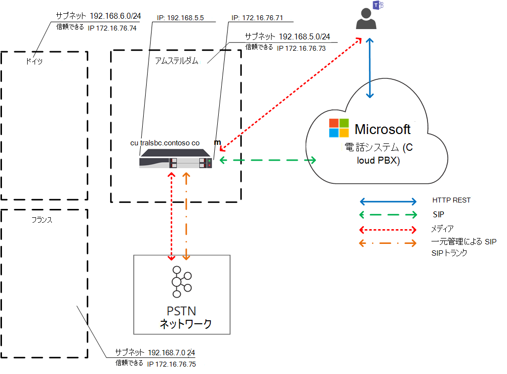
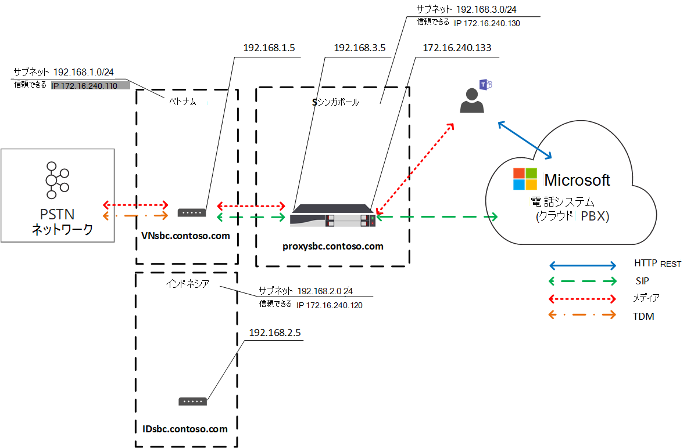

# ダイレクトルーティング用のローカルメディアの最適化

公衆交換電話網 (PSTN) ボイスは、音声品質に高い期待を持つビジネスクリティカルなアプリケーションと見なされます。 ダイレクトルーティングを使用すると、世界中のさまざまな企業向けの多数のネットワークトポロジとローカルのテレフォニーセットアップに対応するようにメディアトラフィックフローを制御できます。 

ダイレクトルーティング用のローカルメディア最適化では、次の方法で音声品質を管理できます。

-   チームクライアントと顧客セッション境界コントローラー (SBCs) との間でメディアトラフィックが流れる方法を制御します。
-   会社のネットワークサブネットの境界内でメディアをローカルに保持します。
-   SBCs が企業のファイアウォールの背後にあり、プライベート Ip を使っていても、Microsoft に直接表示されない場合でも、Teams クライアントと SBCs の間でメディアストリームを許可します。

ローカルメディア最適化では、次の2つのシナリオがサポートされます。

- すべてのローカル trunks を一元管理するために、メインのセッション開始プロトコル (SIP) トランクに接続して、社内のすべての支店にテレフォニーサービスを提供します。

-   SBCs の仮想ネットワークトポロジを構築します。これは、地方の支社が、外部の IP アドレスを使って、Microsoft 電話システムに表示され、通信できる一元プロキシ SBC に接続されている場合です。 仮想ネットワークトポロジでは、下流の SBCs は内部 Ip 経由で通信しており、電話システムに直接表示されません。

この記事では、機能の機能、およびお客様のシナリオと解決策について説明します。 構成の詳細については、「 [ローカルメディアの最適化を構成する](direct-routing-media-optimization-configure.md)」を参照してください。 

  > [!NOTE]
  > イントラネットの境界内にメディアのローカルを保持する場合は、ローカルメディアの最適化をお勧めします。 メディアのバイパスを既に行っていて、SBCs のパブリック IP アドレスのみを使用している場合は、ローカルメディア最適化に移動することは必須ではありません。 引き続きメディアのバイパスを使用することができます。 詳細については、「 [メディアバイパスの計画](direct-routing-plan-media-bypass.md)」を参照してください。

## サポートされているお客様のシナリオ

このディスカッションでは、Contoso が次のように複数の企業を地球で実行していることを前提としています。 (ヨーロッパと APAC の地域は例としてのみ使用されていることに注意してください。 会社によっては、同じような要件を持つ複数の異なる地域がある場合があります。)
 
- **ヨーロッパで** は、Contoso には約30ヶ国の支社があります。 各 office には、専用の構内交換会社 (PBX) があります。 

  Contoso には、trunks を1ヶ所で一元管理するオプションが用意されています。すべてのヨーロッパ支社が対象となります。 Contoso は、一元管理された場所を経由して通話を実行するのに十分な帯域幅を提供し、中央 SIP トランクを1か所に接続して、すべてのヨーロッパすべての場所からアムステルダムへのサービスを開始しました。 

- **APAC 地域で** は、Contoso にはさまざまな国の複数のオフィスがあります。 

  多くの国では、地方の支店でのタイムディビジョン多重化 (TDM) trunks が引き続き利用されています。 TDM trunks の集中化は、APAC 地域のオプションではないため、SIP に切り替えることはできません。 APAC 地域に、数百のゲートウェイ (SBCs) で 50 Contoso 支社以上の支社があるものとします。 このシナリオでは、パブリック IP アドレスまたはローカルのインターネット breakouts の不足が原因で、すべてのゲートウェイを直接ルーティングインターフェイスにペアリングすることはできません。 また、一部の国では、ローカルの PSTN ネットワーク接続を使わずに満たすことができない規制要件を満たしています。

ビジネス要件に基づいて、Contoso は、ダイレクトルーティング用のローカルメディア最適化を使用して2つのソリューションを実装しています。

- **ヨーロッパで** は、すべての trunks が一元管理され、ユーザーの位置に基づいて中央の SBC とユーザーの間でメディアが流れます。 

  - ユーザーが企業ネットワークのローカルサブネット (つまり、ユーザー) に接続されている場合は、中央の SBC の内部 IP とユーザーの Teams クライアントの間でメディアが流れるようになります。 
  
  - ユーザーが企業ネットワークの境界を超えている場合: たとえば、ユーザーがパブリックワイヤレスインターネット接続を使用している場合、ユーザーは外部と見なされます。 この場合、メディアは、中央の SBC と Teams クライアントの外部 IP 間で流れるようになります。

- **APAC 地域で** は、一元プロキシ SBC は Microsoft ダイレクトルーティングとペアリングされており、ダイレクトルーティングインターフェイスと、ローカルブランチオフィス内の下流の SBCs の間でメディアを送信します。 

  国内支店の下流の SBCs は、APAC で直接ルーティングするために直接は表示されませんが、Set-CSOnlinePSTNGateway コマンドレットを使用して、Microsoft 電話システム内に仮想ネットワークトポロジを作成することによって対応することができます。 メディアは可能な限り常にローカルのままです。 外部ユーザーは、Teams クライアントとプロキシのパブリック IP の間でメディアが流れるようになりました。

## 中央の SBC と一元 trunks

接続された一元 SIP トランクを使って1つの中央 SBC で PSTN サービスが提供されるソリューションを構築するには、Contoso のテナント管理者が1つの SBC (centralsbc.contoso.com) をサービスにペアリングします。SBC には、一元管理された SIP トランクが接続されています。 

- ユーザーが会社の内部ネットワークにいる場合、SBC は、メディアの SBC の内部 IP を提供します。

- ユーザーが企業ネットワークの外部にいる場合、SBC は、SBC の外部 (パブリック) IP を提供します。

注: 例、表、または図のすべての値は、図の目的でのみ表示されます。

表 1. SBCs のネットワークパラメーターの例 

| 場所 | SBC FQDN | 内部サブネット | 外部 NAT (信頼できる IP) | SBC 外部 IP アドレス | SBC 内部 IP アドレス |
|:------------|:-------|:-------|:-------|:-------|:-------|
| アムステルダム | centralsbc.contoso.com | 192.168.5.0/24 | 172.16.76.73 | 172.16.76.71 | 192.168.5.5 |
| ドイツ | 展開されていない | 192.168.6.0/24 | 172.16.76.74 | 展開されていない |  展開されていない |
| フランス | 展開されていない | 192.168.7.0/24 | 172.16.76.75 | 展開されていない |  展開されていない ||||

### 内部ユーザー

次の図は、ユーザーが社内ネットワークに接続している場合のトラフィックフローを示しています。 

オンプレミスのユーザーは、ドイツの市内支店に割り当てられます。 ユーザーは、チームを通じて直接ルーティングする電話を発信します。

- ユーザーのチームクライアントは、REST API を通じて直接電話システムと通信しますが、通話中に生成されたメディアは、中央の SBC の内部 IP アドレスに転送されます。 

- SBC は、フローを電話システムと接続されている PSTN ネットワークにリダイレクトします。 

- 中央の SBC は、電話システムでは外部 IP アドレスのみを使用して表示できます。 

図1 中央の SBC と接続された一元的な SIP トランクを使用して、ユーザーが「ホーム」サイトにいるときのトラフィックフロー

### 外部ユーザー

次の図は、ユーザーがオンプレミスではなく、企業ネットワークに接続されていない場合 (つまり、ユーザーのデバイスがモバイルデバイスまたは公共の Wi-fi 経由でインターネットに接続されている場合) のトラフィックフローを示しています。 ユーザーは、チームを通じて直接ルーティングする電話を発信します。

- ユーザーのチームクライアントは、REST API を通じて直接電話システムと通信しますが、この場合、通話中に生成されたメディアは、中央の SBC の外部 IP アドレスに転送されます。 

- SBC は、フローを電話システムと接続されている PSTN ネットワークにリダイレクトします。 

- 中央の SBC は、電話システムでは外部 IP アドレスのみを使用して表示できます。 

この場合、この動作は、ユーザーがドイツの支店または他の支店に対してローカルであるかどうかに似ています。 ユーザーが企業ネットワークの境界外であるため、ユーザーは外部と見なされます。

図2 ユーザーが中央の SBC と接続された集中化 SIP トランクを持つ外部の場合のトラフィックフロー

## 接続されている下流の SBCs でのプロキシ SBC

TDM trunks の集中化ができない APAC 地域のすべてのローカルブランチオフィスで PSTN サービスが提供されているソリューションを構築するには、Contoso 管理者が、プロキシ SBC とも呼ばれる1つの SBC (proxysbc.contoso.com) を直接ルーティングサービスにペアリングします。 

その後、Contoso 管理者が、プロキシ SBC proxysbc.contoso.com を通じて到達できることを示す下流の SBCs を追加します。 下流の SBCs にはパブリック Ip はありませんが、音声ルートに割り当てることができます。 次の表は、ネットワークパラメーターと構成の例を示しています。

下流の SBC が配置されている地方支店にいるユーザーの場合、メディアトラフィックはユーザーとローカルの下流の SBC の間で直接流れるようになります。 ユーザーが (公開インターネット上の) 外部のユーザーである場合、メディアは、ユーザーからプロキシ SBC のパブリック IP に転送されます。これは、関連する下流の SBC にプロキシを指定します。

表 2. SBC ネットワーク情報の例

| 場所 | SBC FQDN | 内部サブネット | 外部 NAT (信頼できる IP) | SBC 外部 IP アドレス  | SBC 内部 IP アドレス |
|:------------|:-------|:-------|:-------|:-------|:-------|
| ベトナム | VNsbc.contoso.com | 192.168.1.0/24 | 172.16.240.110 | なし |  192.168.1.5 |
| インドネシア  | IDsbc.contoso.com | 192.168.2.0/24 | 172.16.240.120 | なし |  192.168.2.5 |
| シンガポール | proxysbc.contoso.com |   192.168.3.0/24 | 172.16.240.130 | 172.16.240.133 | 192.168.3.5 |

### 内部ユーザー 

次の図は、ユーザーが APAC 地域のオフィス内にいる場合の、そのシナリオの上位レベルのトラフィックフローを示しています。 ユーザーは、ベトナムの地方支店に割り当てられており、オンプレミスであるため、チームを通じて直接ルーティングする電話を発信します。 

- ユーザーのチームクライアントは、REST API を通じて直接電話システムと通信しますが、通話中に生成されたメディアは、ローカルの SBC の内部 IP アドレスに転送されます。

- ローカルの SBC は、流れを Singapore のプロキシ SBC に、接続されているローカル PSTN ネットワークにリダイレクトします。

-  プロキシの SBC は、電話システムには外部 IP アドレスのみを通じて表示されます。また、下流の SBC (この場合はローカルの SBC でのローカル SBC) から電話システムに転送します。 

- ローカルブランチオフィスのダウンストリームの SBC は、電話システムに直接表示されませんが、ローカルメディア最適化のセットアップ中に、Contoso 管理者によって定義された仮想ネットワークトポロジ内にマップされます。

注: 設定されているローカルメディア最適化モードによっては、ローカルユーザーとローカル以外のユーザーでは動作が異なる場合があります。 

使用できるモードと関連する動作の詳細については、「ローカルメディア最適化を構成する」を参照してください。

図3 ユーザーがプロキシの SBC と接続された下流の SBCs を使って "ホーム" ネットワークにいるときのトラフィックフロー 

### 外部ユーザー

次の図は、ユーザーが企業ネットワークの境界を超えている場合のトラフィックフローを示しています。 このユーザーはオンプレミスではありません (企業ネットワークの境界内にありません)。 ユーザーは、チームを通じて、ベトナムの電話番号に直接ルーティングする電話を発信します。 

- ユーザーのチームクライアントは、REST API を通じて直接電話システムと通信しますが、通話中に生成されたメディアは、最初に Singapore のプロキシ SBC の外部 IP アドレスに転送されます。 

- 構成と音声ポリシーに基づいて (詳細については、「 [ローカルメディア最適化を構成](direct-routing-media-optimization-configure.md) する」をご覧ください)、プロキシ SBC は、フローをベトナムの下流の SBC にリダイレクトします。 

- ベトナムの下流の SBC は、接続されているローカル PSTN ネットワークにフローをリダイレクトします。 

- プロキシの SBC は、電話システムの外部 IP アドレスのみを通じて表示されます。

-  ローカルブランチオフィスのダウンストリームの SBC は、電話システムに直接表示されませんが、ローカルメディア最適化のセットアップ中に、Contoso 管理者によって定義された仮想ネットワークトポロジ内にマップされます。 この例では、ユーザーが企業ネットワークの境界外であるため、ユーザーは外部と見なされます。 

図4 ユーザーがプロキシの SBC と、接続された下流の SBCs を使っている場合のトラフィックフロー

## ローカルメディア最適化モード

ローカルメディア最適化では、次の2つのモードがサポートされます。

- **モード 1: 常にバイパス** します。 この場合、ユーザーが内部の場合、メディアは、内部ユーザーの実際の場所に関係なく、ローカルの下流の SBC の内部 IP アドレスを通過します。たとえば、下流の SBC が配置されている、または他の支店内の同じ支店内。

- **モード 2: ローカルユーザーのみ** 。 このモードでは、メディアは、下流の SBC と同じ支店にある内部ユーザーによって生成された場合にのみ、ローカルの下流の SBC の内部 IP アドレスに直接フローします。 

ローカルメディア最適化モードを区別するには、テナント管理者は、Set-CSonlinePSTNGateway コマンドレットを使用して、すべての SBC の-BypassMode パラメーターを [Always] または [OnlyForLocalUsers] に設定する必要があります。 詳細については、「 [ローカルメディアの最適化を構成する](direct-routing-media-optimization-configure.md)」を参照してください。  

### モード 1: 常にバイパスする

支店間の接続が良好な場合、推奨モードは常にバイパスされます。

たとえば、会社のアムステルダムに1つの集中化された SIP トランクがあるとします。これは30ヶ国であり、30つのサイトとローカルユーザーの間の接続性は良好です。 また、国内の SBC が配備されているドイツ支社もあります。

ドイツの SBC は、"常にバイパス" モードで構成できます。 ユーザーは、場所に関係なく、sbc の内部 IP アドレス (たとえば、フランスからドイツへ) に直接接続します。参照については、次の図を参照してください。

次に、2つのシナリオについて説明します。

- シナリオ1。 ユーザーは、オンラインボイスルーティングポリシーで定義されている SBC と同じ場所にあります。

- シナリオ2 ユーザーとゲートウェイは、別のサイトにあります。

#### シナリオ1。 ユーザーは、オンラインボイスルーティングポリシーで定義されている SBC と同じ場所にあります

アムステルダムでの SBC は、ドイツのローカル下流の SBC に対するプロキシとして構成されています。 ユーザーは、国内の SBC の企業ネットワークと同じサブネット内でドイツにいます。 SBCs (プロキシと下流) の両方が、常にバイパスモードに設定されています。 オンラインボイスルーティングポリシーは、ドイツ内での通話の場合 (市外局番 + 49)、ドイツのローカル SBC にルーティングされることを指定します。 その他のすべての通話--ドイツの SBC が失敗した場合は、ドイツでのお電話でのお問い合わせは、「アムステルダムでの SBC」にルーティングする必要があります。 次の表は、構成の例をまとめたものです。 

表3 シナリオ1の構成例

| ユーザーの物理的な場所 | ユーザーが電話番号に通話を発信する | オンラインボイスルーティングポリシー | SBC 用に構成されたモード | メディアフロー | 
|:------------|:-------|:-------|:-------|:-------|
| ドイツ | + 49 1 437 2800 | 優先度 1: ^ \+ 49 (\d {8} ) $-DEsbc.contoso.com 優先度 2:. *-proxysbc.contoso.com| DEsbc.contoso.com –常にバイパス  proxysbc.contoso.com –常にバイパス | Teams ユーザー < – > DEsbc.contoso.com |

以下の図は、ドイツの内部ユーザー向けの高レベルのトラフィックフローを示しています。この図では、ドイツ国内の国内の電話番号に対して直接ルーティングすることができます。 

- ユーザーのチームクライアントは、REST API を通じて直接電話システムと通信します。 

- 通話中に生成されたメディアは、ローカルの SBC の内部 IP アドレスに転送されます。 

- ローカルの SBC は、流れをアムステルダムのプロキシ SBC に、接続されているローカル PSTN ネットワークにリダイレクトします。 

- プロキシ SBC は、電話システムに対しては外部 IP アドレスのみを通じて表示され、通話は下流の SBC (この場合は国内の SBC) から電話システムにルーティングされます。 

- ローカルブランチオフィスのダウンストリームの SBC は、電話システムに直接表示されませんが、ローカルメディア最適化のセットアップ中に、Contoso 管理者によって定義された仮想ネットワークトポロジ内にマップされます。

図5  "常にバイパス" モードで、ユーザーが "ホーム" サイトにあるトラフィックフロー

#### シナリオ 2: ユーザーとゲートウェイが異なるサイトにある

アムステルダムでの SBC は、ドイツのローカル下流の SBC に対するプロキシとして構成されています。 SBCs (プロキシと下流) の両方が、常にバイパスモードに設定されています。 地元の支店にあるフランスの内部ユーザーは、ドイツへの直接ルーティング通話を行います。 オンラインボイスルーティングポリシーでは、ドイツ (市外局番 + 49) への通話をドイツのローカル SBC にルーティングすることを指定します。 その他のすべての通話--ドイツの SBC が不合格になった場合は、ドイツのお持ちの SBC にルーティングする必要があります。 次の表は、構成の例をまとめたものです。 

表4。 シナリオ2の構成例

| ユーザーの物理的な場所 | ユーザーが電話番号に通話を発信する | オンラインボイスルーティングポリシー | SBC 用に構成されたモード | メディアフロー | 
|:------------|:-------|:-------|:-------|:-------|
| フランス | + 49 1 437 2800 | 優先度 1: ^ \+ 49 (\d {8} ) $-DEsbc.contoso.com  優先度 2:. *-proxysbc.contoso.com |  DEsbc.contoso.com –常にバイパス proxysbc.contoso.com –常にバイパス | Teams ユーザー < – > DEsbc.contoso.com  |

次の図は、フランスに在住するドイツの内部ユーザーが、ドイツの電話番号に対して直接ルーティングする電話を発信する場合の、高レベルのトラフィックフローを示しています。 

- ユーザーのチームクライアントは、REST API を通じて直接電話システムと通信します。

- 通話中に生成されたメディアは、ドイツの内部 IP アドレスの SBC に直接流れます。 

- ドイツの SBC は、流れをアムステルダムのプロキシ SBC に、接続されているローカル PSTN ネットワークにリダイレクトします。 

図6  "常にバイパス" モードのトラフィックフローと、ユーザーが "ホーム" サイトではなく、内部ネットワーク内にある場合

### モード 2: ローカルユーザーのみ

ローカル支店間の接続に問題があり、各支店と地域のオフィス間の接続が適切である場合は、推奨モードは [ローカルユーザーのみ] です。

たとえば、APAC 地域では、Contoso には異なる国の複数の支社があるとします。 多くの国では、お客様が多くの地方支店に TDM trunks を持っているため、SIP に切り替えることはできません。 TDM trunks の集中化は、APAC 地域のオプションではありません。 さらに、APAC 地域には、数百のゲートウェイ (SBCs) で 50 Contoso 支社以上の支社があります。 

TDM trunks の集中化ができない APAC 地域のすべてのローカルブランチオフィスで PSTN サービスが提供されているソリューションを構築するために、Contoso 管理者はシンガポールの1つの地域 SBC をプロキシの SBC としてダイレクトルーティングサービスにペアリングします。 地元の支店間の直接接続は良好ではありませんが、各支店とシンガポールの地域の SBC の間に適切なつながりがあります。 地域の SBC の場合、管理者は、[常にバイパス] モードを選び、ローカルの下流の SBCs では、管理者は [ローカルユーザー] モードのみを選択します。

次に、2つのシナリオについて説明します。

- シナリオ1。 ユーザーは、オンラインボイスルーティングポリシーで定義されている SBC と同じ場所にあります

- シナリオ2 ユーザーとゲートウェイが異なるサイトにある

#### シナリオ1。 ユーザーは、オンラインボイスルーティングポリシーで定義された SBC と同じ場所にあります

シンガポールの SBC が、ベトナムとインドネシアのローカルの下流 SBCs のプロキシ SBC として構成されているものとします。 ユーザーは、ローカル SBC と同じ場所にベトナムられています。 オンラインボイスルーティングポリシーは、ベトナム (市外局番 + 84 を含む) の通話を、ベトナムのローカル SBC にルーティングすることを指定します。 その他の通話-------(ベトナムの SBC が失敗した場合は、ベトナムでの通話) は、シンガポールのプロキシ SBC にルーティングする必要があります。 次の表は、構成の例をまとめたものです。 

表5 ローカルユーザーの場合にのみ使用できる構成の例1

| ユーザーの物理的な場所 | ユーザーが電話番号に通話を発信する | オンラインボイスルーティングポリシー | SBC 用に構成されたモード | メディアフロー | 
|:------------|:-------|:-------|:-------|:-------|
| ベトナム | + 84 4 3926 3000 | 優先度 1: ^ \+ 84 (\d {9} ) $-VNsbc.contoso.com  優先度 2:. *-proxysbc.contoso.com | VNsbc.contoso.com –ローカルユーザーのみ   proxysbc.contoso.com –常にバイパス | Teams ユーザー < – > VNsbc.contoso.com |

次の図では、オンプレミスの社内支店 (ベトナム) に割り当てられているユーザーが、チームを通じて直接ルーティングする電話を発信しています。 

- ユーザーのチームクライアントは、REST API を通じて直接電話システムと通信します。 

- 通話中に生成されたメディアは、ローカル SBC の内部 IP アドレスに転送されます。 

- ローカルの SBC は、流れを Singapore のプロキシ SBC に、接続されているローカル PSTN ネットワークにリダイレクトします。 

- プロキシ SBC は、電話システムに対しては外部 IP アドレスのみを通じて表示され、通話は下流の SBC (この場合はローカル SBC) から電話システムにルーティングされます。 

- ローカルブランチオフィスのダウンストリームの SBC は、電話システムから直接は見えませんが、仮想ネットワークトポロジ内にマップされます。

図7 [ローカルユーザーのみ] モードとユーザーが "ホーム" サイトにあるトラフィックフロー

#### シナリオ2 ユーザーとゲートウェイが異なるサイトにある

シンガポールの SBC が、ベトナムとインドネシアのローカルの下流 SBCs のプロキシ SBC として構成されているものとします。 国内の支店である内部ユーザーは、ベトナムへの直接ルーティング通話を行います。 オンラインボイスルーティングポリシーは、ベトナム (市外局番 + 84) への通話を、ベトナムのローカル SBC にルーティングすることを指定します。 その他のすべての通話--(ベトナムの SBC が失敗した場合は、ベトナムへの通話は、シンガポールのプロキシ SBC にルーティングする必要があります)。 シンガポールのプロキシの SBC は、「常にバイパス」モードに設定され、ベトナムのローカルの SBC は「ローカルユーザ」モードに設定されています。 次の表は、構成の例をまとめたものです。 

表6 ユーザー構成

| ユーザーの物理的な場所 | ユーザーが電話番号に通話を発信する | オンラインボイスルーティングポリシー | SBC 用に構成されたモード | メディアフロー | 
|:------------|:-------|:-------|:-------|:-------|
| インドネシア | + 84 4 3926 3000 | 優先度 1: ^ \+ 84 (\d {9} ) $-VNsbc.contoso.com   優先度 2:. *-proxysbc.contoso.com |VNsbc.contoso.com –ローカルユーザーのみ   proxysbc.contoso.com –常にバイパス | Teams ユーザー < – > proxysbc.contoso.com < – > VNsbc.contoso.com |

次の図の内部ユーザー (インドネシア支社のオンプレミス) では、チームを通じて、ベトナムの電話番号に直接ルーティングすることができます。 

- ユーザーのチームクライアントは、REST API を通じて直接電話システムと通信します。

- 通話フロー中に生成されたメディア。 SBC の内部 IP アドレスを最初にプロキシとします。 

- シンガポールのプロキシ SBC は、ベトナムと電話システムの間で、流れを下流の SBC の内部 IP アドレスにリダイレクトします。 

- ベトナムのダウンストリームの SBC は、接続されているローカル PSTN ネットワークにフローをルーティングします。 

- プロキシの SBC は、電話システムの外部 IP アドレスのみを通じて表示されます。

- ローカル支店の下流の SBCs は、電話システムから直接は表示されませんが、仮想ネットワークトポロジ内にマップされます。

図8  [ローカルユーザーのみ] モードのトラフィックフローと、ユーザーが "ホーム" サイトではなく、内部ネットワーク内にある場合

")

## 既知の問題

次に、ローカルメディア最適化に現在存在する既知の問題の一覧を示します。 Microsoft は、これらの問題の解決に取り組んでいます。

| 問題 | ところ |
| :--- | :--- |
| Teams クライアントのパブリック IP が顧客の信頼できる IP リストと一致すると、teams クライアントは **内部** として識別されません。 | ローカルメディア最適化を行うには、Teams クライアントサブネットがテナントで構成された[ネットワークサブネット](https://docs.microsoft.com/powershell/module/skype/new-cstenantnetworksubnet?view=skype-ps)と一致する必要がある|
| エスカレーションは、Teams クライアントが内部として識別されたときに、通話が切断される結果となります。| 直接ルーティングの SBC で、ローカルメディアの最適化を無効にします。|

