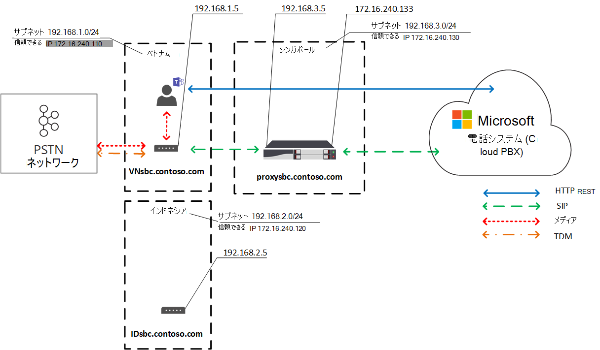
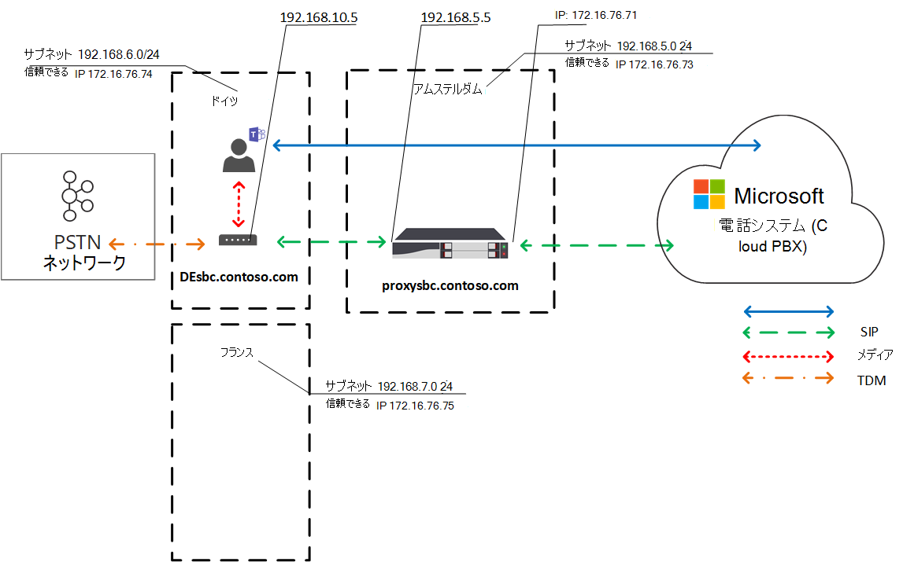
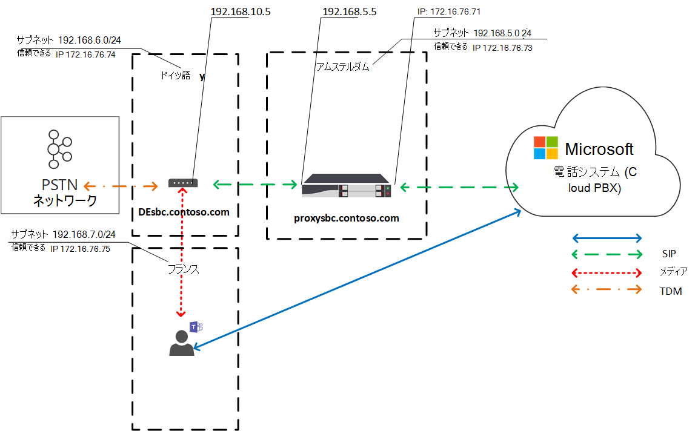
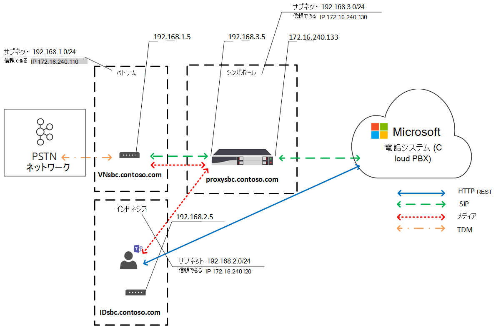

# 直接ルーティングのためのローカル メディアの最適化

公衆交換電話網 (PSTN) 音声は、音声品質に大きな期待を持つビジネスクリティカルなアプリケーションと見なされます。 ダイレクト ルーティングを使用すると、メディア トラフィック フローを制御して、世界中のさまざまな企業向けの多数のネットワーク トポロジとローカル テレフォニーのセットアップに対応できます。 

直接ルーティングのためのローカル メディアの最適化では、次の方法で音声品質を管理できます。

-   クライアントと顧客のセッション ボーダー コントローラー (SBC) Teams間のメディア トラフィックの流れ方法を制御します。
-   企業ネットワーク サブネットの境界内でメディアをローカルに維持する。
-   SPC がプライベート TEAMS の企業ファイアウォールの背後にいて、Microsoft から直接見えない場合でも、クライアントと SBC の間でメディア ストリームを許可します。

ローカル メディアの最適化では、次の 2 つのシナリオがサポートされます。

- メインのセッション開始プロトコル (SIP) トランクに接続された一元的な SBC を通じてすべてのローカル トランクを一元化します。会社のすべてのローカル ブランチ オフィスにテレフォニー サービスを提供します。

-   SBC の仮想ネットワーク トポロジを構築します。ローカルブランチ オフィスの SBC は、外部 IP アドレスを介して Microsoft 電話 System に表示され、Microsoft 電話 System と通信する一元的なプロキシ SBC に接続されます。 仮想ネットワーク トポロジでは、ダウンストリームの SBC は内部の IPS を介して通信を行っていますが、内部ネットワークから直接電話システム。

この記事では、機能、および顧客のシナリオとソリューションについて説明します。 構成の詳細については、ローカル メディアの最適化 [の構成に関するページを参照してください](direct-routing-media-optimization-configure.md)。 

  > [!NOTE]
  > イントラネットの境界内でメディアをローカルに保持する場合は、ローカル メディアの最適化をお勧めします。 Media Bypass が既に存在し、SBC のパブリック IP アドレスのみを使用している場合は、ローカル メディアの最適化に移行する必要があります。 メディア バイパスは引き続き使用できます。 詳細については、「メディア バイパスの [計画」を参照してください](direct-routing-plan-media-bypass.md)。

## サポートされる顧客シナリオ

この説明では、Contoso が次のように世界中で複数のビジネスを行っている場合を想定します。 (ヨーロッパリージョンと APAC リージョンは例としてのみ使用されます。 1 つの会社には、同様の要件を持つ複数の異なる地域がある場合があります)。
 
- **ヨーロッパでは**、Contoso は約 30 か国にオフィスを持っています。 各オフィスには、専用のプライベート ブランチ Exchange (PBX) があります。 

  Contoso は、ヨーロッパの 30 か所のオフィスすべてについて、1 つの場所 (アムステルダム) でトランクを一元化するオプションを提供されました。 Contoso はアムステルダムに SBC を展開し、一元化された場所を通じて通話を実行するのに十分な帯域幅を提供し、中央 SIP トランクを一元的な場所に接続し、アムステルダムからヨーロッパのすべての場所にサービスを提供し始めました。 

- **APAC リージョンでは、Contoso** は異なる国に複数のオフィスを持っています。 

  多くの国では、現地のブランチ オフィスにタイムディビジョン 多重化 (TDM) トランクが残っています。 TDM トランクの集中化は、APAC リージョンではオプションではないので、SIP に切り替えはできません。 何百ものゲートウェイ (SBC) が含む APAC リージョン全体に 50 を超える Contoso ブランチ オフィスがある場合を想定します。 このシナリオでは、パブリック IP アドレスやローカル インターネット ブレークアウトが不足している場合、すべてのゲートウェイをダイレクト ルーティング インターフェイスとペアリングできません。 さらに、一部の国では、ローカル PSTN ネットワーク接続なしでは満たすことのできない規制要件が課されます。

Contoso は、ビジネス要件に基づいて、直接ルーティング用のローカル メディア最適化を使用して次の 2 つのソリューションを実装しました。

- **ヨーロッパでは**、すべてのトランクが一元化され、ユーザーの場所に基づいて中央 SBC とユーザーの間でメディア フローが行います。 

  - ユーザーが企業ネットワークのローカル サブネット (つまり、ユーザーは内部) に接続されている場合、中央 SBC の内部 IP とユーザーの Teams クライアントの間でメディアが流れます。 
  
  - ユーザーが企業ネットワークの境界を超える場合 (たとえば、ユーザーがパブリック ワイヤレス インターネット接続を使用している場合)、ユーザーは外部と見なされます。 この場合、中央 SBC の外部 IP とクライアントの間でメディアTeamsされます。

- **APAC リージョン** では、一元化されたプロキシ SBC が Microsoft ダイレクト ルーティングとペアになります。これは、ダイレクト ルーティング インターフェイスとローカル ブランチ オフィスのダウンストリーム SBC の間でメディアを転送します。 

  ローカルブランチ オフィスのダウンストリーム SPC は APAC のダイレクト ルーティングに直接表示されませんが、Set-CSOnlinePSTNGateway コマンドレットを使用してペアにされ、Microsoft 電話 System 内に仮想ネットワーク トポロジが作成されます。 メディアは可能な限り常にローカルのままです。 外部ユーザーは、クライアントとプロキシ SBC Teams IP の間を流れるメディアを持っています。

## 中央の SBC と一元化されたトランク

一元化された SIP トランクが接続された単一中央 SBC を介して PSTN サービスがすべてのローカル ブランチ オフィスに提供されるソリューションを構築するには、Contoso テナント管理者がサービスに 1 つの SBC (centralsbc.contoso.com) をペアにします。SBC には、一元化された SIP トランクが接続されています。 

- ユーザーが会社の内部ネットワーク内にある場合、SBC はメディア用の SBC の内部 IP を提供します。 

- ユーザーが企業ネットワークの外部にある場合、SBC は SBC の外部 (パブリック) IP を提供します。

注: 例、テーブル、または図内のすべての値は、説明目的でのみ表示されます。

表 1. SBC のネットワーク パラメーターの例 

| 場所 | SBC FQDN | 内部サブネット | 外部 NAT (信頼済み IP) | SBC 外部 IP アドレス | SBC 内部 IP アドレス |
|:------------|:-------|:-------|:-------|:-------|:-------|
| アムステルダム | centralsbc.contoso.com | 192.168.5.0/24 | 172.16.76.73 | 172.16.76.71 | 192.168.5.5 |
| ドイツ | デプロイされていない | 192.168.6.0/24 | 172.16.76.74 | デプロイされていない |  デプロイされていない |
| フランス | デプロイされていない | 192.168.7.0/24 | 172.16.76.75 | デプロイされていない |  デプロイされていない ||||

### 内部ユーザー

次の図は、ユーザーがユーザーのホーム ブランチ オフィスまたはサイトの企業ネットワークに接続されている場合のトラフィック フローを示しています。 

オンプレミスでは、ユーザーはドイツのローカル ブランチ オフィスに割り当てられます。 ユーザーが直接ルーティング電話を行う場合は、Teams。

- ユーザーの Teams クライアントは REST API を介して 電話システム と直接通信しますが、呼び出し中に生成されたメディアは中央 SBC の内部 IP アドレスに流れます。 

- SBC は、接続された PSTN ネットワーク電話システムにフローをリダイレクトします。 

- 中央の SBC は、外部 IP 電話システムを通じてのみ表示されます。 

図 1. 一元化された SBC と接続された一元化された SIP トランクを使用してユーザーが "ホーム" サイトに入っている場合のトラフィック フロー

### 外部ユーザー

次の図は、ユーザーがオンプレミスではなく、企業ネットワークに接続されていない (つまり、ユーザーのデバイスがモバイル デバイスまたはパブリック Wi-Fi を介してインターネットに接続されている) 場合のトラフィック フローを示しています。 ユーザーは、次の手順で直接ルーティングの電話Teams。

- ユーザーの Teams クライアントは REST API を介して 電話システム と直接通信しますが、この場合、呼び出し中に生成されたメディアは中央 SBC の外部 IP アドレスに流れます。 

- SBC は、接続された PSTN ネットワーク電話システムにフローをリダイレクトします。 

- 中央の SBC は、外部 IP 電話システムを通じてのみ表示されます。 

この場合、ユーザーがドイツのブランチ オフィスにローカルか、他のブランチ オフィスに対しても、動作は似ています。 ユーザーが企業ネットワークの境界を超える場合、ユーザーは外部と見なされます。

図 2. ユーザーが一元化された SBC を使用し、接続された一元化された SIP トランクを使用して外部にある場合のトラフィック フロー

## ダウンストリーム SBC に接続されたプロキシ SBC

TDM トランクの集中化がオプションではない APAC リージョン内のすべてのローカル ブランチ オフィスで PSTN サービスが提供されるソリューションを構築するために、Contoso 管理者はプロキシ SBC とも呼ばれる 1 つの SBC (proxysbc.contoso.com) を直接ルーティング サービスにペアにします。 

その後、Contoso 管理者は、プロキシ SBC サーバーからアクセス可能であることを示すダウンストリーム SBC を追加 proxysbc.contoso.com。 ダウンストリームの SBC にはパブリック IP は含められていないが、音声ルートに割り当て可能である。 次の表は、ネットワーク パラメーターと構成の例を示しています。

ユーザーがダウンストリーム SBC があるローカル ブランチ オフィスに移動すると、メディア トラフィックはユーザーとローカルダウンストリーム SBC の間を直接流れます。 ユーザーがオフィスの外部 (パブリック インターネット上) にある場合、メディアはユーザーからプロキシ SBC のパブリック IP に送信され、関連するダウンストリーム SBC にプロキシされます。

表 2. SBC ネットワーク情報の例

| 場所 | SBC FQDN | 内部サブネット | 外部 NAT (信頼済み IP) | SBC 外部 IP アドレス  | SBC 内部 IP アドレス |
|:------------|:-------|:-------|:-------|:-------|:-------|
| ベトナム | VNsbc.contoso.com | 192.168.1.0/24 | 172.16.240.110 | なし |  192.168.1.5 |
| インドネシア  | IDsbc.contoso.com | 192.168.2.0/24 | 172.16.240.120 | なし |  192.168.2.5 |
| シンガポール | proxysbc.contoso.com |   192.168.3.0/24 | 172.16.240.130 | 172.16.240.133 | 192.168.3.5 |

### 内部ユーザー 

次の図は、ユーザーが APAC リージョンのオフィス内にある場合のシナリオの大きなトラフィック フローを示しています。 ベトナムのローカル ブランチ オフィスに割り当て、オンプレミスのユーザーは、直接ルーティングの電話で通話を行Teams。 

- ユーザーの Teams クライアントは REST API を介して 電話システム と直接通信しますが、呼び出し中に生成されたメディアはローカル SBC の内部 IP アドレスに流れます。

- ローカル SBC は、シンガポールのプロキシ SBC と接続されたローカル PSTN ネットワークにフローをリダイレクトします。

-  プロキシ SBC は外部 IP アドレス電話システム 経由でのみ 電話システム に表示され、ダウンストリーム SBC (この場合はベトナムのローカル SBC) から 電話システム にフローをルーティングします。 

- ローカル ブランチ オフィスのダウンストリーム SBC は 電話システム に直接表示されませんが、ローカル メディアの最適化の設定中に Contoso 管理者によって定義されている仮想ネットワーク トポロジ内にマップされます。

注: ローカル ユーザーと非ローカル ユーザーの動作は、構成済みのローカル メディア最適化モードによって異なる場合があります。 

可能なモードと関連する動作の詳細については、「ローカル メディアの最適化を構成する」を参照してください。

図 3. ユーザーがプロキシ SBC とダウンストリーム SBC に接続された "ホーム" ネットワーク内にある場合のトラフィック フロー 

### 外部ユーザー

次の図は、ユーザーが企業ネットワーク境界の外にある場合のトラフィック フローを示しています。 ユーザーがオンプレミスに存在しない (企業ネットワークの境界内に存在しない)。 ユーザーは、ベトナムの電話番号に直接ルーティングTeams通話を行います。 

- ユーザーの Teams クライアントは REST API を介して 電話システム と直接通信しますが、呼び出し中に生成されたメディアは、最初にシンガポールのプロキシ SBC の外部 IP アドレスに流れます。 

- 構成と音声ポリシー (詳細については「ローカル メディアの最適化の構成」を参照) に基づいて、プロキシ SBC はベトナムのダウンストリーム SBC にフローをリダイレクトします。 

- ベトナムのダウンストリーム SBC は、接続されたローカル PSTN ネットワークにフローをリダイレクトします。 

- プロキシ SBC は、外部 IP 電話システム経由でのみ表示されます。

-  ローカル ブランチ オフィスのダウンストリーム SBC は 電話システム に直接表示されませんが、ローカル メディアの最適化の設定中に Contoso 管理者によって定義されている仮想ネットワーク トポロジ内にマップされます。 この例では、ユーザーが企業ネットワークの境界を超えたため、ユーザーは外部と見なされます。 

図 4. ユーザーがプロキシ SBC と接続されたダウンストリーム SBC を使用して外部にある場合のトラフィック フロー

## ローカル メディアの最適化モード

ローカル メディアの最適化では、次の 2 つのモードがサポートされます。

- **モード 1: 常に をバイパスします**。 この場合、ユーザーが内部の場合、内部ユーザーの実際の場所に関係なく、メディアはローカルダウンストリーム SBC の内部 IP アドレスを通過します。たとえば、ダウンストリーム SBC がある同じブランチ オフィス内、または他のブランチ オフィス内などです。  

- **モード 2: ローカル ユーザーの場合のみ**。 このモードでは、メディアは、ダウンストリーム SBC と同じブランチ オフィスに位置する内部ユーザーによって生成された場合にのみ、ローカル ダウンストリーム SBC の内部 IP アドレスに直接送信されます。 

ローカル メディア最適化モードを区別するには、テナント管理者が Set-CSonlinePSTNGateway コマンドレットを使用して、すべての SBC に対して -BypassMode パラメーターを 'Always' または 'OnlyForLocalUsers' に設定する必要があります。 詳細については、ローカル メディアの最適化 [の構成に関するページを参照してください](direct-routing-media-optimization-configure.md)。  

 > [!NOTE]
  > ユーザーが内部の場合は、内部 IP アドレスを使用したユーザーと SBC の間のメディア接続が必要 **です**。 この場合、SBC はメディア接続用の内部 IP を提供する予定で、メディアのパブリック トランスポート リレーにフォールバックする必要はありません。 

### モード 1: 常にバイパスする

ブランチ オフィス間の接続が良好な場合は、常にバイパスするモードをお勧めします。
 
たとえば、30 か国にサービスを提供し、30 のサイトとローカル ユーザーの間で良好な接続を提供する、一元的な SIP トランクがアムステルダムにあるとします。 ドイツには、ローカル SBC がデプロイされているブランチも用意されています。

ドイツの SBC は、"Always bypass" モードで構成できます。 ユーザーは、場所に関係なく、SBC の内部 IP アドレス (フランスからドイツなど) を介して SBC に直接接続します。参照については、次の図を参照してください。

次に、2 つのシナリオについて説明します。

- シナリオ 1. ユーザーは、オンライン音声ルーティング ポリシーで定義されている SBC と同じ場所にいます。

- シナリオ 2. ユーザーとゲートウェイは、異なるサイトにいます。

#### シナリオ 1. ユーザーは、オンライン音声ルーティング ポリシーで定義されている SBC と同じ場所にいます。

アムステルダムの SBC は、ドイツのローカル ダウンストリーム SBC のプロキシ SBC として構成されています。 ユーザーは、ローカル SBC の企業ネットワークと同じサブネット内のドイツにいます。 SBC (プロキシとダウンストリーム) の両方が、Always Bypass モード用に構成されます。 オンライン音声ルーティング ポリシーでは、ドイツ内で (市中コード + 49 を使用して) 通話の場合は、ドイツのローカル SBC にルーティングする必要があります。 その他のすべての呼び出し (ドイツの SBC で障害が発生した場合) は、ドイツでの呼び出しをアムステルダムのプロキシ SBC にルーティングする必要があります。 次の表に、構成例の概要を示します。 

表 3. シナリオ 1 の構成例

| ユーザーの物理的な場所 | ユーザーが番号を呼び出す | オンライン音声ルーティング ポリシー | SBC 用に構成されたモード | メディアFlow | 
|:------------|:-------|:-------|:-------|:-------|
| ドイツ | +49 1 437 2800 | 優先度 1: ^ \+ 49(\d {8} )$ -DEsbc.contoso.com 優先度 2: .* - proxysbc.contoso.com| DEsbc.contoso.com – Always Bypass  proxysbc.contoso.com – 常にバイパス | TeamsUser <–> DEsbc.contoso.com |

次の図は、ドイツの内部ユーザーが、Teams 経由でドイツの番号に直接ルーティングする電話を行う内部ユーザーの大きなトラフィック フローを示しています。 

- ユーザーのクライアントはTeams REST API を電話システム直接通信します。 

- 呼び出し中に生成されたメディアは、ローカル SBC の内部 IP アドレスに流れます。 

- ローカル SBC は、フローをアムステルダムのプロキシ SBC と接続されたローカル PSTN ネットワークにリダイレクトします。 

- プロキシ SBC は外部 IP アドレス電話システム経由でのみ 電話システム に表示され、ダウンストリーム SBC (この場合はドイツのローカル SBC) から 電話システム にフローをルーティングします。 

- ローカル ブランチ オフィスのダウンストリーム SBC は 電話システム に直接表示されませんが、ローカル メディアの最適化の設定中に Contoso 管理者によって定義されている仮想ネットワーク トポロジ内にマップされます。

図 5.  "Always Bypass" モードでユーザーが "ホーム" サイトに入るトラフィック フロー

#### シナリオ 2: ユーザーとゲートウェイが異なるサイトにある

アムステルダムの SBC は、ドイツのローカル ダウンストリーム SBC のプロキシ SBC として構成されています。 SBC (プロキシとダウンストリーム) の両方が、Always Bypass モード用に構成されます。 現地のブランチ オフィスにあるフランスの内部ユーザーが、ドイツへの直接ルーティング呼び出しを行っています。 オンライン音声ルーティング ポリシーでは、ドイツへの呼び出し (市中コード + 49) をドイツのローカル SBC にルーティングする必要があります。 ドイツの SBC で障害が発生した場合に備え、他のすべての呼び出しは、アムステルダムのプロキシ SBC にルーティングする必要があります。 次の表に、構成例の概要を示します。 

表 4. シナリオ 2 の構成例

| ユーザーの物理的な場所 | ユーザーが番号を呼び出す | オンライン音声ルーティング ポリシー | SBC 用に構成されたモード | メディアFlow | 
|:------------|:-------|:-------|:-------|:-------|
| フランス | +49 1 437 2800 | 優先度 1: ^ \+ 49(\d {8} )$ -DEsbc.contoso.com  優先度 2: .* - proxysbc.contoso.com |  DEsbc.contoso.com – Always Bypass proxysbc.contoso.com – Always Bypass | Teamsユーザー < – > DEsbc.contoso.com  |

次の図は、フランスに位置するドイツの内部ユーザーが、Teams 経由でドイツの番号に直接ルーティング電話を行う場合の大きなトラフィック フローを示しています。 

- ユーザーのクライアントはTeams REST API を電話システム直接通信します。

- 通話中に生成されたメディアは、ドイツの内部 IP アドレスの SBC に直接送信されます。 

- ドイツの SBC は、アムステルダムのプロキシ SBC と接続されたローカル PSTN ネットワークにフローをリダイレクトします。 

図 6.  "Always Bypass" モードで、ユーザーが "ホーム" サイトではなく内部ネットワーク内にあるトラフィック フロー

### モード 2: ローカル ユーザーのみ

ローカル ブランチ オフィス間に接続が悪く、各ローカル ブランチ オフィスと地域オフィスの間に良好な接続がある場合、推奨モードは "ローカル ユーザーのみ" です。

たとえば、APAC リージョンでは、Contoso が異なる国に複数のオフィスを持つとします。 多くの国では、SIP への切り替えは、多くの地元のブランチ オフィスに TDM トランクが残っているためです。 TDM トランクの集中化は、APAC リージョンではオプションではありません。 さらに、何百ものゲートウェイ (SBC) が含む APAC リージョン全体に 50 を超える Contoso ブランチ オフィスがあります。 

TDM トランクの集中化がオプションではない APAC リージョン内のすべてのローカル ブランチ オフィスで PSTN サービスが提供されるソリューションを構築するために、Contoso 管理者はシンガポールの 1 つのリージョン SBC をプロキシ SBC として直接ルーティング サービスにペアにします。 ローカル ブランチ オフィス間の直接接続は良好ではありません。ただし、各支店とシンガポールの地域 SBC の間には良好な接続があります。 リージョン SBC では、管理者は "Always Bypass" モードを選択し、ローカルダウンストリーム SBC の場合、管理者は [ローカル ユーザーのみ] モードを選択します。

次に、2 つのシナリオについて説明します。

- シナリオ 1. ユーザーは、オンライン音声ルーティング ポリシーで定義されている SBC と同じ場所にいます。

- シナリオ 2. ユーザーとゲートウェイが異なるサイトにある

#### シナリオ 1. ユーザーがオンライン音声ルーティング ポリシーで定義されている SBC と同じ場所にある

シンガポールの SBC が、ベトナムとインドネシアのローカルダウンストリーム SBC のプロキシ SBC として構成されていることを前提とします。 ユーザーは、ローカル SBC と同じ場所にベトナムにいます。 オンライン音声ルーティング ポリシーでは、ベトナムでの通話 (市中コード +84) をベトナムのローカル SBC にルーティングする必要があります。 ベトナムの SBC が失敗した場合、その他すべての呼び出しは、シンガポールのプロキシ SBC にルーティングする必要があります。 次の表に、構成例の概要を示します。 

表 5. "ローカル ユーザーのみ" モードの構成例シナリオ 1

| ユーザーの物理的な場所 | ユーザーが番号を呼び出す | オンライン音声ルーティング ポリシー | SBC 用に構成されたモード | メディアFlow | 
|:------------|:-------|:-------|:-------|:-------|
| ベトナム | +84 4 3926 3000 | 優先度 1: ^ \+ 84(\d {9} )$ -VNsbc.contoso.com  優先度 2: .* - proxysbc.contoso.com | VNsbc.contoso.com – ローカル ユーザーのみ   proxysbc.contoso.com – 常にバイパス | TeamsUser <–> VNsbc.contoso.com |

次の図では、ベトナムのローカル ブランチ オフィスに割り当てられたユーザーが、オンプレミスで直接ルーティングの通話を行い、Teams。 

- ユーザーのクライアントはTeams REST API を電話システム直接通信します。 

- 呼び出し中に生成されたメディアは、ローカル SBC の内部 IP アドレスに流れます。 

- ローカル SBC は、シンガポールのプロキシ SBC と接続されたローカル PSTN ネットワークにフローをリダイレクトします。 

- プロキシ SBC は外部 IP アドレスを介して 電話システム に表示され、ダウンストリーム SBC (この場合はベトナムのローカル SBC) から 電話システム にフローをルーティングします。 

- ローカル ブランチ オフィスのダウンストリーム SBC は、直接表示電話システム、仮想ネットワーク トポロジ内でマップされます。

図 7. "ローカル ユーザーのみ" モードでユーザーが "ホーム" サイトに入るトラフィック フロー

#### シナリオ 2. ユーザーとゲートウェイが異なるサイトにある

シンガポールの SBC が、ベトナムとインドネシアのローカルダウンストリーム SBC のプロキシ SBC として構成されていることを前提とします。 現地のブランチ オフィスに位置するインドネシアの内部ユーザーが、ベトナムへの直接ルーティング通話を行っています。 オンライン音声ルーティング ポリシーでは、ベトナムへの通話 (市中コード +84) をベトナムのローカル SBC にルーティングする必要があります。 ベトナムの SBC で障害が発生した場合に備え、他のすべての呼び出しは、シンガポールのプロキシ SBC にルーティングする必要があります。 シンガポールのプロキシ SBC は "Always Bypass" モードに設定され、ベトナムのローカル SBC は "ローカル ユーザーのみ" モードに設定されます。 次の表に、構成例の概要を示します。 

表 6. ユーザー構成

| ユーザーの物理的な場所 | ユーザーが番号を呼び出す | オンライン音声ルーティング ポリシー | SBC 用に構成されたモード | メディアFlow | 
|:------------|:-------|:-------|:-------|:-------|
| インドネシア | +84 4 3926 3000 | 優先度 1: ^ \+ 84(\d {9} )$ -VNsbc.contoso.com   優先度 2: .* - proxysbc.contoso.com |VNsbc.contoso.com – ローカル ユーザーのみ   proxysbc.contoso.com – 常にバイパス | TeamsUser <–> proxysbc.contoso.com <–> VNsbc.contoso.com |

次の図では、内部ユーザーは、インドネシアのブランチ オフィスのオンプレミスで、ベトナムの番号に対して Teams を介して直接ルーティング電話を行います。 

- ユーザーのクライアントはTeams REST API を電話システム直接通信します。

- 呼び出し中に生成されたメディアは、最初にプロキシ SBC の内部 IP アドレスに流れます。 

- シンガポールのプロキシ SBC は、フローをベトナムのダウンストリーム SBC の内部 IP アドレスにリダイレクトし、電話システム。 

- ベトナムのダウンストリーム SBC は、接続されたローカル PSTN ネットワークにフローをルーティングします。 

- プロキシ SBC は、外部 IP 電話システム経由でのみ表示されます。

- ローカル ブランチ オフィスのダウンストリーム SPC は、直接電話システム表示されませんが、仮想ネットワーク トポロジ内でマップされます。

図 8.  "ローカル ユーザーのみ" モードのトラフィック フロー。ユーザーは "ホーム" サイトではなく、内部ネットワーク内にある

## 既知の問題

ローカル メディアの最適化に現在存在する既知の問題の一覧を次に示します。 Microsoft は、これらの問題に対処する作業を行っています。

| 問題 | 回避策 |
| :--- | :--- |
| Teamsパブリック IP が顧客の信頼済み IP リストと一致Teams、クライアントは内部として識別されません。 | ローカル メディアの最適化では、クライアント サブネットTeamsテナントで構成されたネットワーク サブネットと一致[する必要があります。](https://docs.microsoft.com/powershell/module/skype/new-cstenantnetworksubnet?view=skype-ps)|
| 呼び出しエスカレーションでは、クライアントが内部としてTeams呼び出しが破棄されます。| ダイレクト ルーティング SBC でローカル メディアの最適化を無効にします。|
| 内部顧客間で 1 から 1 回の呼び出しから外部の顧客/リソースとのマルチパーティ通話への呼び出しのエスカレーションにより、呼び出しが破棄される | 修正プログラムの進行中。 または、ダイレクト ルーティング SBC でローカル メディアの最適化を無効にします。|

