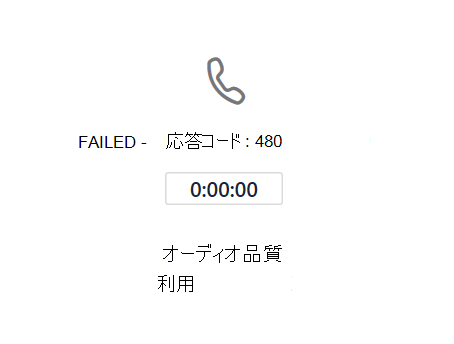

# ダイレクト ルーティングの監視とトラブルシューティング

この記事では、ダイレクトルーティング構成の監視とトラブルシューティングを行う方法について説明します。 

ダイレクトルーティングを使用して通話の発信と受信を行うには、次のコンポーネントが必要です。 

- セッション境界コントローラー (SBCs) 
- Microsoft Cloud でのダイレクトルーティングコンポーネント 
- 電気通信 trunks 

問題のトラブルシューティングで問題が発生した場合は、SBC ベンダーまたは Microsoft とのサポートケースを開くことができます。 

Microsoft は、トラブルシューティングと監視のためのより多くのツールを提供するための作業を進めています。 アップデートについてはドキュメントを定期的にチェックしてください。 

## セッション開始プロトコル (SIP) オプションメッセージを使用してセッション境界コントローラーの可用性を監視する

ダイレクトルーティングでは、セッション境界コントローラーによって送信される SIP オプションを使用して、SBC ヘルスを監視します。 SIP オプションの監視を有効にするには、テナント管理者からの操作は必要ありません。 収集された情報は、ルーティング決定が行われるときに考慮されます。 

たとえば、特定のユーザーに対して、通話のルーティングに使用できる複数の SBCs がある場合、直接ルーティングでは、各 SBC から受信した SIP オプション情報がルーティングを決定します。 

次の図は、構成の例を示しています。 

ユーザーが数字 + 1 425 \<への任意の 7> 桁の通話を発信すると、ダイレクトルーティングによってルートが評価されます。 ルートには、sbc1.contoso.com と sbc2.contoso.com の2つの SBCs があります。 SBCs は両方ともルートの優先度が同じです。 SBC を選ぶ前に、SBC が SIP オプションを最後に送信した場合に基づく SBCs の正常性が評価されます。 

通話を送信するときに、SBC がオプションを1分おきに送信することを示している場合は、SBC は良好であると見なされます。  

通話が行われると、次のロジックが適用されます。

- SBC は、11:00 AM でペアリングされました。  
- SBC は、11:01 AM、11:02 AM などでオプションを送信します。  
- 11:15 では、ユーザーが通話を発信し、ルーティングメカニズムによってこの SBC が選択されます。 

[直接ルーティング] は、通常の間隔オプションを3回行います (通常の間隔は1分です)。 残り3分間にオプションが送信された場合は、SBC は正常であると見なされます。

この例の SBC が、11:12 AM と 11:15 AM (通話が発信された時刻) の間に任意の期間にオプションを送信した場合は、正常であると見なされます。 それ以外の場合は、SBC がルートから降格されます。 

降格とは、SBC が最初に試されないことを意味します。 たとえば、sbc1.contoso.com と sbc2.contoso.com は同じ優先度で設定されています。  

前に説明したように、sbc1.contoso.com が SIP オプションを通常の間隔で送信しない場合は、降格されます。 次に、sbc2.contoso.com が通話を試みます。 Sbc2 で通話を発信できない場合、エラーが発生する前に、sbc1.contoso.com (降格) がもう一度試行されます。 

1つ以上の SBCs の1つのルートが正常で等しいと見なされた場合は、SBCs 間の通話を分散するために、フィッシャーのシャッフルが適用されます。

## 通話品質分析ダッシュボードと SBC ログを監視する 
 
場合によっては、最初のペアリングの際に、SBCs またはダイレクトルーティングサービスの構成の誤りに関連して問題が発生する可能性があります。 

以下のツールを使用して、構成を監視できます。  
 
- 通話品質ダッシュボード 
- SBC ログ 

ダイレクトルーティングサービスには、通話分析または SBC ログのどちらかに報告される非常にわかりやすいエラーコードが含まれています。 

通話音質ダッシュボードには、通話品質と信頼性に関する情報が記載されています。 通話分析を使用して問題を解決する方法の詳細については、「 [Microsoft Teams および Skype For Business Online で通話品質ダッシュボードをオンにして使用](https://docs.microsoft.com/SkypeForBusiness/using-call-quality-in-your-organization/turning-on-and-using-call-quality-dashboard)する」および「[通話分析を使用して低品質の通話品質をトラブルシューティングする」を](https://docs.microsoft.com/SkypeForBusiness/using-call-quality-in-your-organization/use-call-analytics-to-troubleshoot-poor-call-quality)参照してください。 

通話が失敗した場合、通話分析では、トラブルシューティングに役立つ標準的な SIP コードが提供されます。 

ただし、通話分析は、通話が直接ルーティングの内部コンポーネントに到達して失敗した場合にのみ役立ちます。 SBC ペアリング、または SIP "Invite" が拒否された問題がある場合 (たとえば、トランク FQDN の名前が正しく構成されていない場合)、通話分析はサポートされません。 この場合は、SBC ログを参照してください。 直接ルーティングでは、問題の詳細な説明が SBCs に送信されます。これらの問題は、SBC ログから読み取ることができます。 
