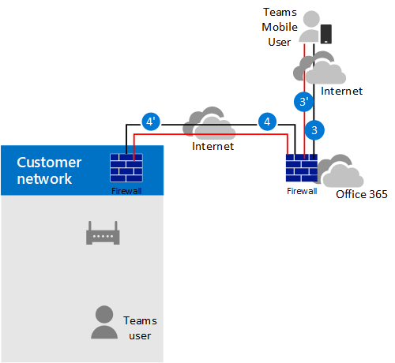

# ダイレクト ルーティングでメディア バイパスを計画する

## ダイレクト ルーティングを使用したメディア バイパスについて

メディア バイパスを使用すると、メディア トラフィックのパスを短縮し、転送中のホップ数を減らしてパフォーマンスを向上させることができます。 メディア バイパスを使用すると、メディアは、セッション ボーダー コントローラー (SBC) とクライアントの間で、Microsoft 電話されます。 メディア バイパスを構成するには、SBC とクライアントが同じ場所またはネットワークにある必要があります。

**-MediaBypass** パラメーターを true または false に設定した **Set-CSOnlinePSTNGateway** コマンドを使用して、各 SBC のメディア バイパスを制御できます。 メディア バイパスを有効にした場合、すべてのメディア トラフィックが企業ネットワーク内に残るという意味ではありません。 この記事では、さまざまなシナリオでの呼び出しフローについて説明します。

次の図は、メディア バイパスの場合とメディア バイパスなしの呼び出しフローの違いを示しています。

次の図に示すように、メディア バイパスを使用しない場合、クライアントが呼び出しを行った場合または受信すると、SBC、Microsoft 電話 システム、Teams クライアントの間で信号とメディアの両方が流れる。

> [!div class="mx-imgBorder"]
> 

ただし、ユーザーが SBC と同じビルまたはネットワーク内にあるとします。 たとえば、フランクフルトのビルに入っているユーザーが PSTN ユーザーに通話を発信するとします。 

- **メディア バイパスを使用** しない場合、メディアはアムステルダムまたはダブリン (Microsoft データセンターが展開されている場所) を経由し、フランクフルトの SBC に戻されます。 

  ヨーロッパのデータセンターは、SBC がヨーロッパに存在し、Microsoft が SBC に最も近いデータセンターを使用するために選択されます。 この方法は、ほとんどの地域で Microsoft ネットワーク内のトラフィック フローを最適化するために呼び出し品質に影響しませんが、トラフィックには不必要なループがあります。     

- **メディア バイパスでは**、次の図に示すように、Teams ユーザーと SBC の間でメディアが直接保持されます。

  > [!div class="mx-imgBorder"]
  > 

メディア バイパスは、SBC 上のクライアントと ICE lite の Teams接続確立 (ICE) と呼ばれるプロトコルを利用します。 これらのプロトコルにより、ダイレクト ルーティングは最適な品質のために最も直接的なメディア パスを使用できます。 ICE と ICE Lite は WebRTC 標準です。 これらのプロトコルの詳細については、RFC 5245 を参照してください。

## 呼び出しフローとファイアウォールの計画

呼び出しフローとファイアウォールの計画は、ユーザーが SBC のパブリック IP アドレスに直接アクセスできるかどうか、およびユーザーがネットワークの内部か外部かによって異なります。

### ユーザーが SBC のパブリック IP アドレスに直接アクセスできる場合の呼び出しフロー

ユーザーが SBC のパブリック IP アドレスに直接アクセスできる場合、呼び出しフローは次のようになります。

- メディア バイパスの場合、Teamsクライアントは、内部ネットワークからでも SBC のパブリック IP アドレスにアクセスできる必要があります。 ダイレクト メディアが必要ない場合、メディアはトランスポート リレー経由で流れる可能性があります。

- これは、ユーザーが SBC と同じ建物やネットワーク内にある場合に推奨されるソリューションです。メディア パスから Microsoft Cloud コンポーネントを削除します。

- シグナルは常に Microsoft クラウド経由で流れます。

次の図は、メディア バイパスが有効で、クライアントが内部であり、クライアントが SBC (ダイレクト メディア) のパブリック IP アドレスに到達できる場合の呼び出しフローを示しています。 

- パスの矢印と数値は、呼び出しフローのMicrosoft Teams[に従います](./microsoft-teams-online-call-flows.md)。

- SIP シグナルは、(トラフィックの方向に応じて) 常にパス 4 と 4' を受け取ります。 メディアはローカルのままで、パス 5b を受け取る。

> [!div class="mx-imgBorder"]
> 

### ユーザーが SBC のパブリック IP アドレスにアクセスできない場合の呼び出しフロー

ユーザーが SBC のパブリック IP アドレスにアクセスできない場合の呼び出しフローを次に示します。 

たとえば、ユーザーが外部のユーザーであり、テナント管理者が SBC のパブリック IP アドレスをインターネット内のすべてのユーザーに対して開くのではなく、Microsoft Cloud に対して開くことを決定したとします。 トラフィックの内部コンポーネントは、トランスポート リレーを介Teamsできます。 次の状況について検討しましょう。

- Teamsトランスポート リレーが使用されます。

- メディア バイパスの場合、Microsoft は、Teams トランスポート リレーと SBC の間でポート 50 000 から 59 999 を開く必要があるトランスポート リレーのバージョンを使用します (将来、3478 - 3481 ポートが必要なバージョンに移行する予定です)。

次の図は、メディア バイパスが有効で、クライアントが外部であり、クライアントがセッション ボーダー コントローラーのパブリック IP アドレスに到達できない場合の呼び出しフローを示しています (メディアは Teams トランスポート リレーによって中継されます)。

- パスの矢印と数値は、呼び出しフローのMicrosoft Teams[に従います](./microsoft-teams-online-call-flows.md)。

- メディアは、パス 3、3、4、4' を介してリレーされます。

> [!div class="mx-imgBorder"]
> 

### ユーザーがネットワークの外部にいて、SBC のパブリック IP にアクセスできる場合の呼び出しフロー

> [!NOTE]
> この構成は、トランスポート リレーの機能を利用Teamsされていません。 代わりに、ユーザーが SBC のパブリック IP アドレスにアクセスできない前のシナリオを検討する必要があります。 

次の図は、メディア バイパスが有効で、クライアントが外部であり、クライアントが SBC (ダイレクト メディア) のパブリック IP アドレスに到達できる場合の呼び出しフローを示しています。

- パスの矢印と数値は、呼び出しフローに関する記事Microsoft Teams[従](./microsoft-teams-online-call-flows.md)っています。

- SIP シグナルは、(トラフィックの方向に応じて) 常にパス 3 と 3' を受け取ります。 パス 2 を使用したメディア フロー。

> [!div class="mx-imgBorder"]
> 

## メディア プロセッサとトランスポート リレーの使用

Microsoft Cloud には、メディア トラフィックのパスに含め可能な 2 つのコンポーネントがあります。メディア プロセッサとトランスポート リレーです。 

- メディア プロセッサは、バイパスしないケースでメディアを処理し、音声アプリケーションのメディアを処理する公開コンポーネントです。

   メディア プロセッサは常にエンド ユーザーのバイパスされていない呼び出しのパスに入っていますが、バイパスされた呼び出しのパスには含めずにいます。 メディア プロセッサは常に、コール パーク、組織の管理、通話キューなどのすべての音声自動応答パスに配置されます。

- トランスポート リレーは、最も近いトランスポート サービスに接続してリアルタイム トラフィックを送信するために使用されます。

   トランスポート リレーは、ユーザーの場所とネットワークの構成方法に応じて、エンド ユーザーからの呼び出しやエンド ユーザー宛てのバイパスされた呼び出しのパス内にある場合と存在しない場合があります。

次の図は、2 つの呼び出しフローを示しています。1 つはメディア バイパスが有効で、もう 1 つはメディア バイパスが無効です。

> [!NOTE]
> この図は、エンド ユーザーから送信されるトラフィックまたはエンド ユーザー宛てのトラフィックのみを示しています。  

- メディア コントローラーは、メディア プロセッサを割り当て、セッション記述プロトコル (SDP) オファーを作成する Azure のマイクロサービスです。

- SIP プロキシは、アプリケーションで使用される HTTP REST シグナルを SIP にTeamsコンポーネントです。    

> [!div class="mx-imgBorder"]
> 

次の表は、メディア プロセッサとトランスポート リレーの違いをまとめたものです。

|    | メディア プロセッサ | トランスポート リレー|
| :--------------|:---------------|:------------|
エンド ユーザーのバイパスされていない呼び出しのメディア パス内 | いつも | クライアントがメディア プロセッサに直接到達できない場合 | 
エンド ユーザーのバイパスされた呼び出しのメディア パス内 | ぜんぜん | クライアントがパブリック IP アドレスで SBC に到達できない場合 | 
音声アプリケーションのメディア パス内 | いつも | ぜんぜん | 
コード変換を実行できる (B2BUA)\* | はい | いいえ、エンドポイント間でのみオーディオをリレーします | 
世界中のインスタンスの数と場所 | 合計 10: 米国東部と西部に 2。アムステルダムとダブリンの 2;香港、シンガポールの 2 つ。2 in Japan ;オーストラリア東部と南東部の 2 | 複数

IP 範囲は次のとおりです。
- 52.112.0.0/14 (52.112.0.1 から 52.115.255.254 の IP アドレス)
- 52.120.0.0/14 (52.120.0.1 から 52.123.255.254 の IP アドレス)

\* コード変換の説明: 

- メディア プロセッサは B2BUA です。つまり、コーデック (たとえば、SILK を Teams クライアントから MP と G.711 に MP と SBC の間で変更できます)。

- トランスポート リレーは B2BUA ではありません。つまり、トラフィックがリレー経由で流れる場合でも、クライアントと SBC の間でコーデックが変更されません。

### トランクがメディア Teams構成されている場合のメディア プロセッサの使用

Teamsメディア プロセッサは、次のシナリオでは常にメディア パスに挿入されます。

- 通話は 1:1 からグループ通話にエスカレートされます
- フェデレーション ユーザーへの呼び出Teamsしています
- 通話がユーザーに転送または転送Skype for Businessされます

以下で説明するように、SBC がメディア プロセッサとトランスポート リレーの範囲にアクセスできる必要があります。    

## SIP シグナル: FQDN

SIP シグナルの場合、FQDN とファイアウォールの要件はバイパスされていない場合と同じです。 

ダイレクト ルーティングは、次の環境またはMicrosoft 365でOffice 365されます。
- Microsoft 365またはOffice 365
- Office 365 GCC
- Office 365 GCC High
- Office 365DoD Office 365、GCC [High、DoD](/office365/servicedescriptions/office-365-platform-service-description/office-365-us-government/office-365-us-government)などの米国政府GCC環境の詳細について学習します。

### Microsoft 365、Office 365、Office 365 GCC 環境

ダイレクト ルーティングの接続ポイントは、次の 3 つの FQDN です。

- **sip.pstnhub.microsoft.com** – グローバル FQDN – 最初に試す必要があります。 SBC がこの名前を解決する要求を送信すると、Microsoft Azure DNS サーバーは、SBC に割り当てられているプライマリ Azure データセンターを指す IP アドレスを返します。 この割り当ては、データセンターのパフォーマンス メトリックと SBC に対する地理的な近接性に基づいて行われます。 返される IP アドレスは、プライマリ FQDN に対応します。

- **sip2.pstnhub.microsoft.com** – セカンダリ FQDN – 第 2 の優先度のリージョンに地理的にマップされます。

- **sip3.pstnhub.microsoft.com** – 第 3 の FQDN – 第 3 の優先度のリージョンに地理的にマップされます。

次の手順を実行するには、これら 3 つの FQDN を配置する必要があります。

- 最適なエクスペリエンスを提供します (読み込み量が少なく、最初の FQDN を照会することで割り当てられた SBC データセンターに最も近い)。

- 一時的な問題が発生しているデータセンターへの SBC からの接続が確立された場合は、フェールオーバーを提供します。 詳細については、以下の「フェールオーバー メカニズム」を参照してください。

FQDN  **sip.pstnhub.microsoft.com、sip2.pstnhub.microsoft.com、****および** sip3.pstnhub.microsoft.com は、次のいずれかの IP アドレスに解決されます。
- 52.114.148.0
- 52.114.132.46 
- 52.114.75.24 
- 52.114.76.76 
- 52.114.7.24 
- 52.114.14.70
- 52.114.16.74
- 52.114.20.29
- 52.114.36.156 
- 52.114.32.169

これらのすべての IP アドレスのポートをファイアウォールで開いて、アドレス間の着信トラフィックと発信トラフィックを許可して、信号を送信する必要があります。 ファイアウォールで DNS 名がサポートされている場合 **、FQDN** sip-all.pstnhub.microsoft.com すべての IP アドレスに解決されます。 

### Office 365 GCC DoD 環境

ダイレクト ルーティングの接続ポイントは、次の FQDN です。

**sip.pstnhub.dod.teams.microsoft.us** – グローバル FQDN。 DoD 環境Office 365米国のデータ センターにのみ存在する場合、第 2 および第 3 の FQDN はありません。

FQDN – sip.pstnhub.dod.teams.microsoft.us 次のいずれかの IP アドレスに解決されます。

- 52.127.64.33
- 52.127.68.34

これらのすべての IP アドレスのポートをファイアウォールで開いて、アドレス間の着信トラフィックと発信トラフィックを許可して、信号を送信する必要があります。  ファイアウォールで DNS 名がサポートされている場合、FQDN sip.pstnhub.dod.teams.microsoft.us これらの IP アドレスすべてに解決されます。 

### Office 365 GCC High Environment

ダイレクト ルーティングの接続ポイントは、次の FQDN です。

**sip.pstnhub.gov.teams.microsoft.us** – グローバル FQDN。 High 環境GCC米国のデータ センターにのみ存在する場合、第 2 および第 3 の FQDN はありません。

FQDN – sip.pstnhub.gov.teams.microsoft.us 次のいずれかの IP アドレスに解決されます。

- 52.127.88.59
- 52.127.92.64

これらのすべての IP アドレスのポートをファイアウォールで開いて、アドレス間の着信トラフィックと発信トラフィックを許可して、信号を送信する必要があります。  ファイアウォールで DNS 名がサポートされている場合、FQDN sip.pstnhub.gov.teams.microsoft.us これらの IP アドレスすべてに解決されます。 

## SIP シグナル: ポート

ポート要件は、ダイレクト ルーティングが提供Office 365環境で同じです。
- Microsoft 365またはOffice 365
- Office 365 GCC
- Office 365 GCC High
- Office 365DoD

次のポートを使用する必要があります。

| トラフィック | 開始 | 終了 | 送信元ポート | 宛先ポート|
| :-------- | :-------- |:-----------|:--------|:---------|
SIP/TLS| SIP プロキシ | SBC | 1024 - 65535 | SBC で定義 |
| SIP/TLS | SBC | SIP プロキシ | SBC で定義 | 5061 |

## メディア トラフィック: IP とポートの範囲

直接接続が使用可能な場合、またはクライアントがパブリック IP アドレスを使用して SBC に到達できない場合は Teams トランスポート リレーを介して、SBC と Teams クライアントの間でメディア トラフィックが流れます。

### ダイレクト メディア トラフィックの要件 (Teams クライアントと SBC の間) 

クライアントは、SBC のパブリック IP アドレスで指定されたポート (表を参照) にアクセスできる必要があります。 

> [!NOTE]
> クライアントが内部ネットワーク内にある場合、メディアは SBC のパブリック IP アドレスに流れます。 NAT デバイスで、トラフィックがエンタープライズ ネットワーク機器から出て行かねない、という構成が可能です。

| トラフィック | 開始 | 終了 | 送信元ポート | 宛先ポート|
| :-------- | :-------- |:-----------|:--------|:---------|
UDP/SRTP | クライアント | SBC | 3478-3481 および 49152 – 53247| SBC で定義 |
| UDP/SRTP | SBC | クライアント | SBC で定義 | 3478-3481 および 49152 – 53247  |

> [!NOTE]
> クライアントのソース ポートを変換するネットワーク デバイスがある場合は、変換されたポートがネットワーク機器と SBC の間で開いているか確認してください。 

### トランスポート リレーを使用する場合の要件

トランスポート リレーは、メディア プロセッサと同じ範囲内です (バイパス以外の場合): 

### Microsoft 365、Office 365、Office 365 GCC 環境

- 52.112.0.0 /14 (52.112.0.1 から 52.115.255.254 の IP アドレス)

### Office 365 GCC DoD 環境

- 52.127.64.0/21

### Office 365 GCC High Environment

- 52.127.88.0/21

次の表に、Teams トランスポート リレーのポート範囲 (すべての環境に適用) を示します。

| トラフィック | 開始 | 終了 | 送信元ポート | 宛先ポート|
| :-------- | :-------- |:-----------|:--------|:---------|
UDP/SRTP | トランスポート リレー | SBC | 50 000 -59 999    | SBC で定義 |
| UDP/SRTP | SBC | トランスポート リレー | SBC で定義 | 50 000 – 59 999, 3478, 3479     |

> [!NOTE]
> Microsoft では、SBC での同時呼び出しごとに少なくとも 2 つのポートを推奨しています。 Microsoft には 2 つのバージョンのトランスポート リレーが含まれています。次が必要です。
> 
> - v4:ポート範囲 50 000 ~ 59 999 でのみ動作可能
> 
> - v6。ポート 3478、3479 で動作します。

現時点では、メディア バイパスは v4 バージョンのトランスポート リレーのみをサポートしています。 今後、v6 のサポートを導入する予定です。 

移行するには、ポート 3478 と 3479 を開く必要があります。 Microsoft がメディア バイパスを使用した v6 トランスポート リレーのサポートを導入した場合、ネットワーク機器や SBC を再構成する必要が生じ得ない。 

### メディア プロセッサを使用する場合の要件

メディア プロセッサは、音声アプリケーションと Web クライアントのメディア パスに常に含Teams Edge や Google Chrome のクライアントなどです。 要件は、バイパス以外の構成の場合と同じです。

メディア トラフィックの IP 範囲は次の通り 

### Office 365環境Office 365 GCC環境

- 52.112.0.0 /14 (52.112.0.1 から 52.115.255.254 の IP アドレス)

### Office 365 GCC DoD 環境

- 52.127.64.0/21

### Office 365 GCC High Environment

- 52.127.88.0/21

メディア プロセッサのポート範囲 (すべての環境に適用) を次の表に示します。

| トラフィック | 開始 | 終了 | 送信元ポート | 宛先ポート|
| :-------- | :-------- |:-----------|:--------|:---------|
UDP/SRTP | メディア プロセッサ | SBC | 3478、3479、49 152 – 53 247    | SBC で定義 |
| UDP/SRTP | SBC | メディア プロセッサ | SBC で定義 | 3478、3479、49 152 – 53 247     |

## メディア バイパスと非メディア バイパス用に個別のトランクを構成する  

メディア バイパスからメディア バイパスに移行し、すべての使用状況をメディア バイパスに移行する前に機能を確認する場合は、メディア バイパス トランクにルーティングして特定のユーザーに割り当てる個別のトランクと個別のオンライン音声ルーティング ポリシーを作成できます。 

大レベルの構成手順:

- メディア バイパスをテストするユーザーを特定します。

- FQDN が異なる 2 つの個別のトランクを作成します。1 つはメディア バイパスが有効です。もう 1 つではありません。 

  両方のトランクが同じ SBC を指します。 TLS SIP シグナルのポートは異なる必要があります。 メディアのポートは同じである必要があります。

- 新しいオンライン音声ルーティング ポリシーを作成し、このポリシーの PSTN 使用法に関連付けられている対応するルートにメディア バイパス トランクを割り当てる。

- メディア バイパスをテストするために特定したユーザーに新しいオンライン音声ルーティング ポリシーを割り当てる。

次の例は、このロジックを示しています。

| 一連のユーザー | ユーザー数 | OVRP で割り当てられたトランク FQDN | メディア バイパスが有効 |
| :------------ |:----------------- |:--------------|:--------------|
メディア バイパス 以外のトランクを持つユーザー | 980 | sbc1.contoso.com:5061 | false |
メディア バイパス トランクを持つユーザー | 20 | sbc2.contoso.com:5060 | true | 

両方のトランクが、同じパブリック IP アドレスを持つ同じ SBC をポイントできます。 次の図に示すように、SBC 上の TLS シグナル ポートは異なる必要があります。 証明書が両方のトランクをサポートしている必要があります。 SAN では、2 つの名前 **(sbc1.contoso.com** と **sbc2.contoso.com)** を持つ必要があります。または、ワイルドカード証明書を持っている必要があります。

> [!div class="mx-imgBorder"]
> 

同じ SBC で 2 つのトランクを構成する方法については、SBC ベンダーが提供するドキュメントを参照してください。

 - [AudioCodes デプロイのドキュメント](https://www.audiocodes.com/solutions-products/products/products-for-microsoft-365/direct-routing-for-microsoft-teams)
- [Oracle デプロイのドキュメント](https://www.oracle.com/industries/communications/enterprise-session-border-controller/microsoft.html)
- [リボンコミュニケーションの展開に関するドキュメント](https://ribboncommunications.com/solutions/enterprise-solutions/microsoft-solutions/direct-routing-microsoft-teams-calling)
- [TE-Systems (anynode) のデプロイに関するドキュメント](https://www.anynode.de/anynode-and-microsoft-teams/)

## メディア バイパスでサポートされるクライアント エンドポイント

メディア バイパスは、デスクトップ クライアント、Android Teams iOS クライアント、および Teams 電話 デバイスでサポートされています。 

メディア バイパスをサポートしていない他のすべてのエンドポイントでは、バイパス呼び出しとして開始された場合でも、呼び出しを非バイパスに変換します。 これは自動的に行われます。管理者からのアクションは必要とされません。 これには、Skype for Business 3PIP Phone と、ダイレクト ルーティング呼び出し (Microsoft Edge、Google Chrome、Mozilla Firefox で実行される WebRTC ベースのクライアント) をサポートする Teams Web クライアントが含まれます。 
 
## 関連項目

[ダイレクト ルーティングでメディア バイパスを構成する](direct-routing-configure-media-bypass.md)
