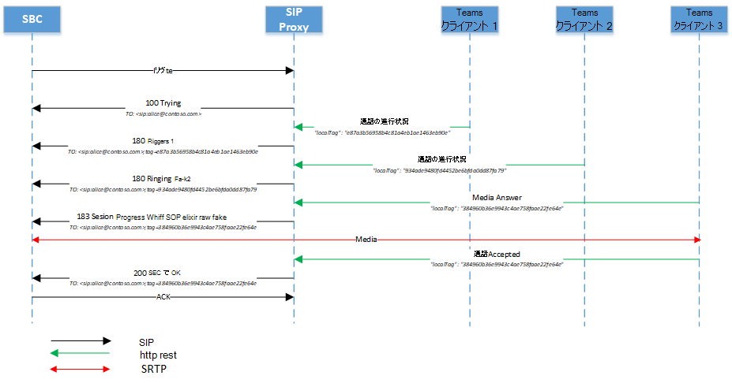
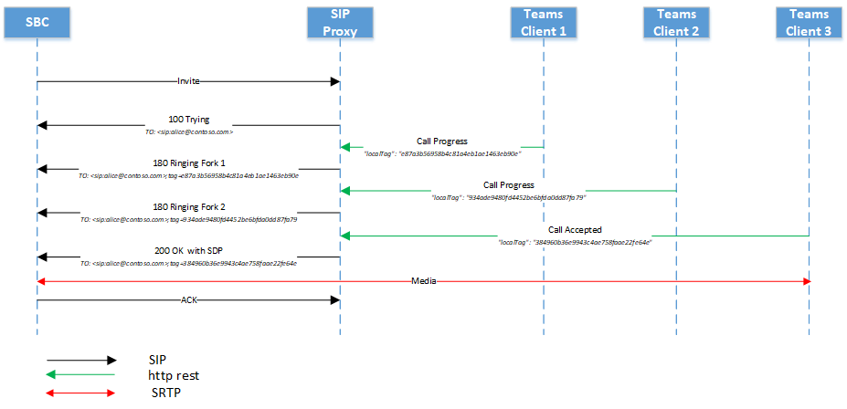
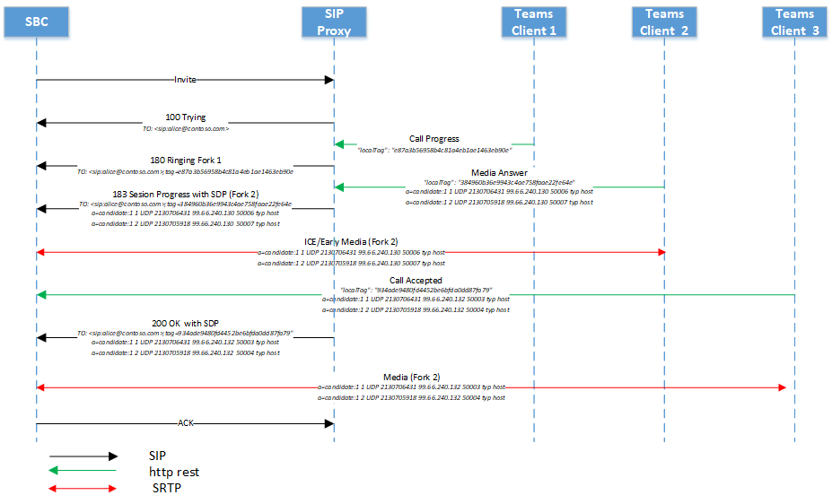

# <a name="direct-routing---sip-protocol"></a><span data-ttu-id="22c83-103">ダイレクトルーティング-SIP プロトコル</span><span class="sxs-lookup"><span data-stu-id="22c83-103">Direct Routing - SIP protocol</span></span>

<span data-ttu-id="22c83-104">この記事では、ダイレクトルーティングでセッション開始プロトコル (SIP) を実装する方法について説明します。</span><span class="sxs-lookup"><span data-stu-id="22c83-104">This article describes how Direct Routing implements the Session Initiation Protocol (SIP).</span></span> <span data-ttu-id="22c83-105">セッションボーダーコントローラー (SBC) と SIP プロキシの間でトラフィックを適切にルーティングするには、一部の SIP パラメーターに特定の値を指定する必要があります。</span><span class="sxs-lookup"><span data-stu-id="22c83-105">To properly route traffic between a Session Border Controller (SBC) and the SIP proxy, some SIP parameters must have specific values.</span></span> <span data-ttu-id="22c83-106">この記事は、オンプレミスの SBC と SIP プロキシサービス間の接続を構成する責任を負うボイス管理者を対象としています。</span><span class="sxs-lookup"><span data-stu-id="22c83-106">This article is intended for voice administrators who are responsible for configuring the connection between the on-premises SBC and the SIP proxy service.</span></span>

## <a name="processing-the-incoming-request-finding-the-tenant-and-user"></a><span data-ttu-id="22c83-107">着信要求の処理: テナントとユーザーの検索</span><span class="sxs-lookup"><span data-stu-id="22c83-107">Processing the incoming request: finding the tenant and user</span></span>

<span data-ttu-id="22c83-108">着信時に SIP プロキシは、通話の宛先となっているテナントを検索し、このテナント内の特定のユーザーを検索する必要があります。</span><span class="sxs-lookup"><span data-stu-id="22c83-108">On an incoming call, the SIP proxy needs to find the tenant to which the call is destined and find the specific user within this tenant.</span></span> <span data-ttu-id="22c83-109">テナント管理者は、複数のテナントで、(たとえば、+ 1001 のような) ない番号を構成する場合があります。</span><span class="sxs-lookup"><span data-stu-id="22c83-109">The tenant administrator might configure non-DID numbers, for example +1001, in multiple tenants.</span></span> <span data-ttu-id="22c83-110">このため、数値の参照を実行する特定のテナントを見つけることが重要です。この番号は、複数の Office 365 組織では同じではない場合があるためです。</span><span class="sxs-lookup"><span data-stu-id="22c83-110">Therefore, it is important to find the specific tenant on which to perform the number lookup because the non-DID numbers might be the same in multiple Office 365 organizations.</span></span>  

<span data-ttu-id="22c83-111">このセクションでは、SIP プロキシでテナントとユーザーを検索し、着信接続の SBC の認証を実行する方法について説明します。</span><span class="sxs-lookup"><span data-stu-id="22c83-111">This section describes how the SIP proxy finds the tenant and the user, and performs authentication of the SBC on the incoming connection.</span></span>

<span data-ttu-id="22c83-112">着信時の SIP Invite メッセージの例を次に示します。</span><span class="sxs-lookup"><span data-stu-id="22c83-112">The following is an example of the SIP Invite message on an incoming call:</span></span>

| <span data-ttu-id="22c83-113">パラメーター名</span><span class="sxs-lookup"><span data-stu-id="22c83-113">Parameter name</span></span> | <span data-ttu-id="22c83-114">値の例</span><span class="sxs-lookup"><span data-stu-id="22c83-114">Example of the value</span></span> | 
| :---------------------  |:---------------------- |
| <span data-ttu-id="22c83-115">要求-URI</span><span class="sxs-lookup"><span data-stu-id="22c83-115">Request-URI</span></span> | <span data-ttu-id="22c83-116">Sip:+18338006777@sip.pstnhub.microsoft.com SIP/2.0 を招待する</span><span class="sxs-lookup"><span data-stu-id="22c83-116">INVITE sip:+18338006777@sip.pstnhub.microsoft.com SIP /2.0</span></span> |
| <span data-ttu-id="22c83-117">ヘッダー経由</span><span class="sxs-lookup"><span data-stu-id="22c83-117">Via Header</span></span> | <span data-ttu-id="22c83-118">Via: SIP/2.0/TLS sbc1: 5058; alias; branch = z9hG4bKac2121518978</span><span class="sxs-lookup"><span data-stu-id="22c83-118">Via: SIP/2.0/TLS sbc1.adatum.biz:5058;alias;branch=z9hG4bKac2121518978</span></span> | 
| <span data-ttu-id="22c83-119">最大転送ヘッダー</span><span class="sxs-lookup"><span data-stu-id="22c83-119">Max-Forwards header</span></span> | <span data-ttu-id="22c83-120">最大転送:68</span><span class="sxs-lookup"><span data-stu-id="22c83-120">Max-Forwards:68</span></span> |
| <span data-ttu-id="22c83-121">ヘッダーから</span><span class="sxs-lookup"><span data-stu-id="22c83-121">From Header</span></span> | <span data-ttu-id="22c83-122">ヘッダーの差出人: <sip: 7168712781@sbc1 の場合、トランスポート = udp; タグ = 1c747237679</span><span class="sxs-lookup"><span data-stu-id="22c83-122">From Header From: <sip:7168712781@sbc1.adatum.biz;transport=udp;tag=1c747237679</span></span> |
| <span data-ttu-id="22c83-123">ヘッダーへ</span><span class="sxs-lookup"><span data-stu-id="22c83-123">To Header</span></span> | <span data-ttu-id="22c83-124">宛先: sip:+183338006777@sbc1.adatum.biz</span><span class="sxs-lookup"><span data-stu-id="22c83-124">To: sip:+183338006777@sbc1.adatum.biz</span></span> | 
| <span data-ttu-id="22c83-125">CSeq ヘッダー</span><span class="sxs-lookup"><span data-stu-id="22c83-125">CSeq header</span></span> | <span data-ttu-id="22c83-126">CSeq: 1 INVITE</span><span class="sxs-lookup"><span data-stu-id="22c83-126">CSeq: 1 INVITE</span></span> | 
| <span data-ttu-id="22c83-127">連絡先のヘッダー</span><span class="sxs-lookup"><span data-stu-id="22c83-127">Contact Header</span></span> | <span data-ttu-id="22c83-128">連絡先: <sip: 68712781@sbc1 adatum、transport = tls></span><span class="sxs-lookup"><span data-stu-id="22c83-128">Contact: <sip: 68712781@sbc1.adatum.biz;transport=tls></span></span> | 

<span data-ttu-id="22c83-129">SIP プロキシは、招待状の受信時に次の手順を実行します。</span><span class="sxs-lookup"><span data-stu-id="22c83-129">On receiving the invite, the SIP proxy performs the following steps:</span></span>

1. <span data-ttu-id="22c83-130">証明書を確認します。</span><span class="sxs-lookup"><span data-stu-id="22c83-130">Check the certificate.</span></span> <span data-ttu-id="22c83-131">最初の接続では、直接ルーティングサービスは、連絡先ヘッダーに示されている FQDN 名を受け取り、表示されている証明書の共通名またはサブジェクトの代替名と一致させます。</span><span class="sxs-lookup"><span data-stu-id="22c83-131">On the initial connection, the Direct Routing service takes the FQDN name presented in the Contact header and matches it to the Common Name or Subject Alternative name of the presented certificate.</span></span> <span data-ttu-id="22c83-132">SBC 名は、次のいずれかのオプションと一致する必要があります。</span><span class="sxs-lookup"><span data-stu-id="22c83-132">The SBC name must match one of the following options:</span></span>

   - <span data-ttu-id="22c83-133">オプション 1。</span><span class="sxs-lookup"><span data-stu-id="22c83-133">Option 1.</span></span> <span data-ttu-id="22c83-134">連絡先ヘッダーに表示される完全な FQDN 名は、記載されている証明書の共通名/サブジェクトの別名と一致する必要があります。</span><span class="sxs-lookup"><span data-stu-id="22c83-134">The full FQDN name presented in the Contact header must match the Common Name/Subject Alternative name of the presented certificate.</span></span>  

   - <span data-ttu-id="22c83-135">オプション2。</span><span class="sxs-lookup"><span data-stu-id="22c83-135">Option 2.</span></span> <span data-ttu-id="22c83-136">連絡先ヘッダーに表示される FQDN 名のドメイン部分 (たとえば、FQDN 名 sbc1.adatum.biz) は、一般的な名前/サブジェクトの代替名 (\* adatum.biz など) のワイルドカード値と一致する必要があります。</span><span class="sxs-lookup"><span data-stu-id="22c83-136">The domain portion of the FQDN name presented in the Contact header (for example adatum.biz of the FQDN name sbc1.adatum.biz) must match the wildcard value in Common Name/Subject Alternative Name (for example \*.adatum.biz).</span></span>

2. <span data-ttu-id="22c83-137">連絡先ヘッダーに示されている完全な FQDN 名を使用して、テナントを検索してみてください。</span><span class="sxs-lookup"><span data-stu-id="22c83-137">Try to find a tenant using the full FQDN name presented in the Contact header.</span></span>  

   <span data-ttu-id="22c83-138">連絡先ヘッダー (sbc1.adatum.biz) の FQDN 名が、いずれかの Office 365 組織で DNS 名として登録されているかどうかを確認します。</span><span class="sxs-lookup"><span data-stu-id="22c83-138">Check if the FQDN name from the Contact header (sbc1.adatum.biz) is registered as a DNS name in any Office 365 organization.</span></span> <span data-ttu-id="22c83-139">見つかった場合、ユーザーの参照は、ドメイン名として SBC FQDN が登録されているテナントで実行されます。</span><span class="sxs-lookup"><span data-stu-id="22c83-139">If found, the lookup of the user is performed in the tenant that has the SBC FQDN registered as a Domain name.</span></span> <span data-ttu-id="22c83-140">見つからない場合は、手順3が適用されます。</span><span class="sxs-lookup"><span data-stu-id="22c83-140">If not found, Step 3 applies.</span></span>   

3. <span data-ttu-id="22c83-141">手順3は、手順2に失敗した場合にのみ適用されます。</span><span class="sxs-lookup"><span data-stu-id="22c83-141">Step 3 only applies if Step 2 failed.</span></span> 

   <span data-ttu-id="22c83-142">連絡先ヘッダーに表示されている FQDN からホスト部分を削除します (adatum.biz)。この名前が Office 365 組織の DNS 名として登録されているかどうかを確認します。</span><span class="sxs-lookup"><span data-stu-id="22c83-142">Remove the host portion from the FQDN, presented in the Contact header (FQDN: sbc12.adatum.biz, after removing the host portion: adatum.biz), and check if this name is registered as a DNS name in any Office 365 organization.</span></span> <span data-ttu-id="22c83-143">見つかった場合、ユーザー検索はこのテナントで実行されます。</span><span class="sxs-lookup"><span data-stu-id="22c83-143">If found, the user lookup is performed in this tenant.</span></span> <span data-ttu-id="22c83-144">見つからなかった場合は、通話は失敗します。</span><span class="sxs-lookup"><span data-stu-id="22c83-144">If not found, the call fails.</span></span>

4. <span data-ttu-id="22c83-145">要求-URI に示されている電話番号を使用して、手順2または3で検出されたテナント内の番号の逆引き参照を実行します。</span><span class="sxs-lookup"><span data-stu-id="22c83-145">Using the phone number presented in the Request-URI, perform the reverse number lookup within the tenant found in Step 2 or 3.</span></span> <span data-ttu-id="22c83-146">表示されている電話番号と、前の手順で見つけたテナント内のユーザー SIP URI を照合します。</span><span class="sxs-lookup"><span data-stu-id="22c83-146">Match the presented phone number to a user SIP URI within the tenant found on the previous step.</span></span>

5. <span data-ttu-id="22c83-147">トランクの設定を適用します。</span><span class="sxs-lookup"><span data-stu-id="22c83-147">Apply trunk settings.</span></span> <span data-ttu-id="22c83-148">この SBC のテナント管理者によって設定されたパラメーターを見つけます。</span><span class="sxs-lookup"><span data-stu-id="22c83-148">Find the parameters set by the tenant admin for this SBC.</span></span>

   <span data-ttu-id="22c83-149">Microsoft は、Microsoft SIP プロキシとペアリングされた SBC の間でサードパーティの SIP プロキシまたはユーザーエージェントサーバーを使用することをサポートしていません。これにより、ペアリングされた SBC によって作成された要求 URI を変更する可能性があります。</span><span class="sxs-lookup"><span data-stu-id="22c83-149">Microsoft does not support having a third-party SIP proxy or User Agent Server between the Microsoft SIP proxy and the paired SBC, which might modify the Request URI created by the paired SBC.</span></span>

   <span data-ttu-id="22c83-150">1つの SBC が多くのテナント (搬送業者シナリオ) に連結されているシナリオに必要な2つの参照 (手順2と 3) の要件については、この記事の後半で説明します。</span><span class="sxs-lookup"><span data-stu-id="22c83-150">The requirements for the two lookups (steps 2 and 3) needed for the scenario where one SBC is interconnected to many tenants (carrier scenario) are covered later in this article.</span></span>

### <a name="detailed-requirements-for-contact-header-and-request-uri"></a><span data-ttu-id="22c83-151">連絡先ヘッダーと要求 URI の詳細要件</span><span class="sxs-lookup"><span data-stu-id="22c83-151">Detailed requirements for Contact header and Request-URI</span></span>

#### <a name="contact-header"></a><span data-ttu-id="22c83-152">連絡先のヘッダー</span><span class="sxs-lookup"><span data-stu-id="22c83-152">Contact header</span></span>

<span data-ttu-id="22c83-153">Microsoft SIP プロキシへのすべての着信通話について、連絡先ヘッダーは、次のように URI hostname の SBC FQDN とペアリングされている必要があります。</span><span class="sxs-lookup"><span data-stu-id="22c83-153">For all incoming calls to the Microsoft SIP proxy, the Contact header must have the paired SBC FQDN in the URI hostname as follows:</span></span>

<span data-ttu-id="22c83-154">書式: Contact: <sip: SBC; transport = tls> の電話または sip address@FQDN</span><span class="sxs-lookup"><span data-stu-id="22c83-154">Syntax: Contact:  <sip:phone or sip address@FQDN of the SBC;transport=tls></span></span> 

<span data-ttu-id="22c83-155">この名前は、表示されている証明書の [共通名] または [サブジェクト代替名] フィールドにも含まれている必要があります。</span><span class="sxs-lookup"><span data-stu-id="22c83-155">This name must also be in the Common Name or Subject Alternative name field(s) of the presented certificate.</span></span> <span data-ttu-id="22c83-156">Microsoft は、証明書の [共通名] または [サブジェクト代替名] フィールドで、名前のワイルドカード値を使用することをサポートしています。</span><span class="sxs-lookup"><span data-stu-id="22c83-156">Microsoft supports using wildcard values of the name(s) in the Common Name or Subject Alternative Name fields of the certificate.</span></span>   

<span data-ttu-id="22c83-157">ワイルドカードのサポートについては、 [RFC 2818 の「3.1」を参照](https://tools.ietf.org/html/rfc2818#section-3.1)してください。</span><span class="sxs-lookup"><span data-stu-id="22c83-157">The support for wildcards is described in [RFC 2818, section 3.1](https://tools.ietf.org/html/rfc2818#section-3.1).</span></span> <span data-ttu-id="22c83-158">具体的には：</span><span class="sxs-lookup"><span data-stu-id="22c83-158">Specifically:</span></span>

<span data-ttu-id="22c83-159">*"名前にはワイルドカード文字\*を含めることができます。これは、単一のドメイン名コンポーネントまたはコンポーネントフラグメントと一致すると見なされます。たとえば、a.com \*は foo.a.com に一致しますが、bar.foo.a.com は検索されません。\*foo.com は、bar.com ではなく、と一致します。 "*</span><span class="sxs-lookup"><span data-stu-id="22c83-159">*"Names may contain the wildcard character \* which is considered to match any single domain name component or component fragment. E.g., \*.a.com matches foo.a.com but not bar.foo.a.com. f\*.com matches foo.com but not bar.com."*</span></span>

<span data-ttu-id="22c83-160">SIP メッセージに表示されたコンタクトヘッダーの複数の値が SBC によって送信される場合は、コンタクトヘッダーの最初の値の FQDN 部分だけが使用されます。</span><span class="sxs-lookup"><span data-stu-id="22c83-160">If more than one value in the Contact header presented in a SIP message is sent by the SBC, only the FQDN portion of the first value of the Contact header is used.</span></span>

#### <a name="request-uri"></a><span data-ttu-id="22c83-161">要求-URI</span><span class="sxs-lookup"><span data-stu-id="22c83-161">Request-URI</span></span> 

<span data-ttu-id="22c83-162">すべての着信通話について、要求-URI は、電話番号をユーザーに照合するために使われます。</span><span class="sxs-lookup"><span data-stu-id="22c83-162">For all incoming calls, the Request-URI is used to match the phone number to a user.</span></span>   

<span data-ttu-id="22c83-163">現在、電話番号には、次の例に示すように、プラス記号 (+) が含まれている必要があります。</span><span class="sxs-lookup"><span data-stu-id="22c83-163">Currently The phone number must contain a plus sign (+) as shown in the following example.</span></span> 

```console
INVITE sip:+18338006777@sip.pstnhub.microsoft.com SIP /2.0
```

## <a name="contact-and-record-route-headers-considerations"></a><span data-ttu-id="22c83-164">連絡先とレコード-ルートヘッダーに関する考慮事項</span><span class="sxs-lookup"><span data-stu-id="22c83-164">Contact and Record-Route headers considerations</span></span>

<span data-ttu-id="22c83-165">SIP プロキシは、新しいダイアログ内のクライアントトランザクション (Bye または再招待など) に対して次のホップ FQDN を計算する必要があります。また、SIP オプションに返信するときにも使用できます。</span><span class="sxs-lookup"><span data-stu-id="22c83-165">The SIP proxy needs to calculate the next hop FQDN for new in-dialog client transactions (for example Bye or Re-Invite), and when replying to SIP Options.</span></span> <span data-ttu-id="22c83-166">連絡先またはレコード-ルートのいずれかが使用されます。</span><span class="sxs-lookup"><span data-stu-id="22c83-166">Either Contact or Record-Route are used.</span></span> 

<span data-ttu-id="22c83-167">RFC 3261 によれば、連絡先ヘッダーは、新しいダイアログで発生する可能性があるすべての要求で必要です。</span><span class="sxs-lookup"><span data-stu-id="22c83-167">According to RFC 3261, Contact header is required in any request that can result in a new dialog.</span></span> <span data-ttu-id="22c83-168">レコードルーティングが必要になるのは、プロキシがダイアログで将来の要求のパスを維持したい場合のみです。</span><span class="sxs-lookup"><span data-stu-id="22c83-168">The Record-Route is only required if a proxy wants to stay on the path of future requests in a dialog.</span></span> 

<span data-ttu-id="22c83-169">Microsoft は、次の理由で連絡先ヘッダーのみを使用することをお勧めします。</span><span class="sxs-lookup"><span data-stu-id="22c83-169">Microsoft recommends using only Contact header for the following reasons:</span></span>

- <span data-ttu-id="22c83-170">RFC 3261 ごとに記録-ルートは、プロキシが今後の要求のパスをダイアログでそのままにしたい場合に使用されます。これは、すべてのトラフィックが Microsoft SIP プロキシとペアリングされた SBC の間にある場合には重要ではありません。</span><span class="sxs-lookup"><span data-stu-id="22c83-170">Per RFC 3261, Record-Route is used if a proxy wants to stay on the path of future requests in a dialog, which is not essential as all traffic goes between the Microsoft SIP proxy and the paired SBC.</span></span> <span data-ttu-id="22c83-171">SBC と Microsoft SIP プロキシの間に中継プロキシサーバーを使用する必要はありません。</span><span class="sxs-lookup"><span data-stu-id="22c83-171">There is no need for an intermediate proxy server between the SBC and Microsoft SIP proxy.</span></span>

- <span data-ttu-id="22c83-172">Microsoft SIP プロキシでは、送信 ping オプションを送信するときに、連絡先ヘッダーのみを使用します (レコードルーティングではありません)。</span><span class="sxs-lookup"><span data-stu-id="22c83-172">The Microsoft SIP proxy uses only Contact header (not Record-Route) to determine the next hop when sending outbound ping Options.</span></span> <span data-ttu-id="22c83-173">2つ (連絡先およびレコードルーティング) ではなく、1つのパラメーター (連絡先) のみを構成すると、管理が簡単になります。</span><span class="sxs-lookup"><span data-stu-id="22c83-173">Configuring only one parameter (Contact) instead of two (Contact and Record-Route) simplifies the administration.</span></span>

<span data-ttu-id="22c83-174">SIP プロキシでは次のホップを計算するために、次のものが使用されます。</span><span class="sxs-lookup"><span data-stu-id="22c83-174">To calculate the next hop, the SIP proxy uses:</span></span>

- <span data-ttu-id="22c83-175">優先度1。</span><span class="sxs-lookup"><span data-stu-id="22c83-175">Priority 1.</span></span> <span data-ttu-id="22c83-176">トップレベルのレコードルーティング。</span><span class="sxs-lookup"><span data-stu-id="22c83-176">Top-level Record-Route.</span></span> <span data-ttu-id="22c83-177">トップレベルのレコードルートに FQDN 名または IP アドレスが含まれている場合は、FQDN 名または IP を使って、送信中のダイアログに発信する接続を作成します。</span><span class="sxs-lookup"><span data-stu-id="22c83-177">If the top-level Record-Route contains the FQDN name or IP, the FQDN name or IP is used to make the outbound in-dialog connection.</span></span>

- <span data-ttu-id="22c83-178">優先度2</span><span class="sxs-lookup"><span data-stu-id="22c83-178">Priority 2.</span></span> <span data-ttu-id="22c83-179">連絡先ヘッダー。</span><span class="sxs-lookup"><span data-stu-id="22c83-179">Contact header.</span></span> <span data-ttu-id="22c83-180">レコードルーティングが存在しない場合、SIP プロキシは、送信接続を行う連絡先ヘッダーの値を検索します。</span><span class="sxs-lookup"><span data-stu-id="22c83-180">If Record-Route does not exist, the SIP proxy will look up the value of the Contact header to make the outbound connection.</span></span> <span data-ttu-id="22c83-181">(これは推奨される構成です)</span><span class="sxs-lookup"><span data-stu-id="22c83-181">(This is the recommended configuration.)</span></span>

<span data-ttu-id="22c83-182">連絡先とレコードの両方が使用されている場合、SBC 管理者はその値を同一に保つ必要があります。これにより、管理のオーバーヘッドが発生します。</span><span class="sxs-lookup"><span data-stu-id="22c83-182">If both Contact and Record-Route are used, the SBC administrator must keep their values identical, which causes administrative overhead.</span></span> 

### <a name="use-of-fqdn-name-in-contact-or-record-route"></a><span data-ttu-id="22c83-183">連絡先またはレコードルーティングでの FQDN の使用</span><span class="sxs-lookup"><span data-stu-id="22c83-183">Use of FQDN name in Contact or Record-Route</span></span>

<span data-ttu-id="22c83-184">IP アドレスの使用は、レコードルーティングまたは連絡先ではサポートされていません。</span><span class="sxs-lookup"><span data-stu-id="22c83-184">Use of an IP address is not supported in either Record-Route or Contact.</span></span> <span data-ttu-id="22c83-185">サポートされている唯一のオプションは FQDN です。これは、共通名または SBC 証明書のサブジェクト代替名のいずれかに一致する必要があります (証明書のワイルドカード値はサポートされています)。</span><span class="sxs-lookup"><span data-stu-id="22c83-185">The only supported option is an FQDN, which must match either the Common Name or Subject Alternative Name of the SBC certificate (wildcard values in the certificate are supported).</span></span>

- <span data-ttu-id="22c83-186">IP アドレスがレコードルーティングまたは連絡先に表示される場合、証明書のチェックは失敗し、通話は失敗します。</span><span class="sxs-lookup"><span data-stu-id="22c83-186">If an IP address is presented in Record-route or Contact, the certificate check fails and the call fails.</span></span>

- <span data-ttu-id="22c83-187">FQDN が、表示されている証明書の共通またはサブジェクトの代替名の値と一致しない場合、通話は失敗します。</span><span class="sxs-lookup"><span data-stu-id="22c83-187">If the FQDN does not match the value of the Common or Subject Alternative Name in the presented certificate, the call fails.</span></span> 

## <a name="inbound-call-sip-dialog-description"></a><span data-ttu-id="22c83-188">着信通話: SIP ダイアログの説明</span><span class="sxs-lookup"><span data-stu-id="22c83-188">Inbound call: SIP dialog description</span></span>

<span data-ttu-id="22c83-189">次の表は、非表示モードとバイパスモードでのコールフローの相違点と類似点をまとめたものです。</span><span class="sxs-lookup"><span data-stu-id="22c83-189">The following table below summarizes the call flow differences and similarities between non-bypass and bypass modes:</span></span>

| <span data-ttu-id="22c83-190">パラメーター名</span><span class="sxs-lookup"><span data-stu-id="22c83-190">Parameter name</span></span> | <span data-ttu-id="22c83-191">非バイパスモード</span><span class="sxs-lookup"><span data-stu-id="22c83-191">Non-bypass mode</span></span> | <span data-ttu-id="22c83-192">バイパスモード</span><span class="sxs-lookup"><span data-stu-id="22c83-192">Bypass mode</span></span>
| :---------------------  |:---------------------- |:----------------|
| <span data-ttu-id="22c83-193">183のメディア候補と200メッセージの受信者</span><span class="sxs-lookup"><span data-stu-id="22c83-193">Media candidates in 183 and 200 messages coming from</span></span> | <span data-ttu-id="22c83-194">メディアプロセッサ</span><span class="sxs-lookup"><span data-stu-id="22c83-194">Media processors</span></span> | <span data-ttu-id="22c83-195">クライアント</span><span class="sxs-lookup"><span data-stu-id="22c83-195">Clients</span></span> | 
| <span data-ttu-id="22c83-196">SBC が受け取ることができる183メッセージの数</span><span class="sxs-lookup"><span data-stu-id="22c83-196">Number of 183 messages SBC can receive</span></span> | <span data-ttu-id="22c83-197">セッションあたり1回</span><span class="sxs-lookup"><span data-stu-id="22c83-197">One per session</span></span> | <span data-ttu-id="22c83-198">多数</span><span class="sxs-lookup"><span data-stu-id="22c83-198">Multiple</span></span> | 
| <span data-ttu-id="22c83-199">通話は、仮応答で行うことができます (183)</span><span class="sxs-lookup"><span data-stu-id="22c83-199">Call can be with provisional answer (183)</span></span> | <span data-ttu-id="22c83-200">はい</span><span class="sxs-lookup"><span data-stu-id="22c83-200">Yes</span></span> | <span data-ttu-id="22c83-201">はい</span><span class="sxs-lookup"><span data-stu-id="22c83-201">Yes</span></span> |
| <span data-ttu-id="22c83-202">仮応答なしで通話を発信できます (183)</span><span class="sxs-lookup"><span data-stu-id="22c83-202">Call can be without provisional answer (183)</span></span> | <span data-ttu-id="22c83-203">はい</span><span class="sxs-lookup"><span data-stu-id="22c83-203">Yes</span></span> | <span data-ttu-id="22c83-204">はい</span><span class="sxs-lookup"><span data-stu-id="22c83-204">Yes</span></span> |

###  <a name="non-media-bypass-flow"></a><span data-ttu-id="22c83-205">メディア以外のバイパスフロー</span><span class="sxs-lookup"><span data-stu-id="22c83-205">Non-media bypass flow</span></span>

<span data-ttu-id="22c83-206">Teams ユーザーは、同時に複数のエンドポイントを持つことができます。</span><span class="sxs-lookup"><span data-stu-id="22c83-206">A Teams user might have multiple endpoints at the same time.</span></span> <span data-ttu-id="22c83-207">たとえば、Windows クライアントの Teams、iPhone クライアントの teams、チーム電話 (Teams Android クライアント) などです。</span><span class="sxs-lookup"><span data-stu-id="22c83-207">For example, Teams for Windows client, Teams for iPhone client, and Teams Phone (Teams Android client).</span></span> <span data-ttu-id="22c83-208">各エンドポイントは、次のように HTTP rest を通知する可能性があります。</span><span class="sxs-lookup"><span data-stu-id="22c83-208">Each endpoint might signal an HTTP rest as follows:</span></span>

-   <span data-ttu-id="22c83-209">通話の進行状況– SIP プロキシによって SIP メッセージ180に変換されます。</span><span class="sxs-lookup"><span data-stu-id="22c83-209">Call progress – converted by the SIP proxy to the SIP message 180.</span></span> <span data-ttu-id="22c83-210">180メッセージの受信時に、SBC はローカル呼び出しを生成する必要があります。</span><span class="sxs-lookup"><span data-stu-id="22c83-210">On receiving message 180, the SBC must generate local ringing.</span></span>

-   <span data-ttu-id="22c83-211">メディアの回答– SIP プロキシによって、セッション記述プロトコル (SDP) でメディア候補を使ってメッセージ183に変換されます。</span><span class="sxs-lookup"><span data-stu-id="22c83-211">Media answer – converted by the SIP proxy to message 183 with media candidates in Session Description Protocol (SDP).</span></span> <span data-ttu-id="22c83-212">183メッセージを受信するときに、SBC は SDP メッセージで受信したメディアの候補に接続することを想定しています。</span><span class="sxs-lookup"><span data-stu-id="22c83-212">On receiving message 183, the SBC expects to connect to the media candidates received in the SDP message.</span></span> <span data-ttu-id="22c83-213">メディアの応答が生成されないことがあります。また、終了点が「承諾されました」というメッセージで応答する可能性があることに注意してください。</span><span class="sxs-lookup"><span data-stu-id="22c83-213">Note that in some cases the Media answer might not be generated, and the end point might answer with “Call Accepted” message.</span></span>

-   <span data-ttu-id="22c83-214">通話受付– SIP プロキシによって SDP と SIP メッセージ200に変換されます。</span><span class="sxs-lookup"><span data-stu-id="22c83-214">Call accepted – converted by the SIP proxy to SIP message 200 with SDP.</span></span> <span data-ttu-id="22c83-215">200メッセージの受信時に、SBC は、指定された SDP 候補者との間でメディアを送受信することを前提としています。</span><span class="sxs-lookup"><span data-stu-id="22c83-215">On receiving message 200, the SBC is expected to send and receive media to and from the provided SDP candidates.</span></span>

#### <a name="multiple-endpoints-ringing-with-provisional-answer"></a><span data-ttu-id="22c83-216">複数のエンドポイントが暫定応答で呼び出される</span><span class="sxs-lookup"><span data-stu-id="22c83-216">Multiple endpoints ringing with provisional answer</span></span>

1.  <span data-ttu-id="22c83-217">SBC からの最初の招待状を受け取る際、SIP プロキシは "SIP SIP/2.0 100 試行中" というメッセージを送信し、すべてのエンドユーザーエンドポイントに着信通話を通知します。</span><span class="sxs-lookup"><span data-stu-id="22c83-217">On receiving the first Invite from the SBC, the SIP proxy sends the message "SIP SIP/2.0 100 Trying" and notifies all end user endpoints about the incoming call.</span></span> 

2.  <span data-ttu-id="22c83-218">通知が表示されると、各エンドポイントが SIP プロキシへの "通話の進行状況" メッセージの呼び出しと送信を開始します。</span><span class="sxs-lookup"><span data-stu-id="22c83-218">Upon notification, each endpoint will start ringing and sending "Call progress” messages to the SIP proxy.</span></span> <span data-ttu-id="22c83-219">Teams ユーザーは複数のエンドポイントを持つことができるため、SIP プロキシは複数の通話進行状況メッセージを受信することがあります。</span><span class="sxs-lookup"><span data-stu-id="22c83-219">Because a Teams user can have multiple end points, the SIP proxy might receive multiple Call Progress messages.</span></span>

3.  <span data-ttu-id="22c83-220">クライアントから受信したすべての通話進行状況メッセージについて、SIP プロキシは通話の進行状況メッセージを SIP メッセージ "SIP SIP/2.0 180 試行中" に変換します。</span><span class="sxs-lookup"><span data-stu-id="22c83-220">For every Call Progress message received from the clients, the SIP proxy converts the Call Progress message to the SIP message "SIP SIP/2.0 180 Trying".</span></span> <span data-ttu-id="22c83-221">このようなメッセージを送信する間隔は、通話コントローラーから受信するメッセージの間隔によって定義されます。</span><span class="sxs-lookup"><span data-stu-id="22c83-221">The interval for sending such messages is defined by the interval of the receiving messages from the Call Controller.</span></span> <span data-ttu-id="22c83-222">次の図では、SIP プロキシによって生成される 2 180 メッセージがあります。</span><span class="sxs-lookup"><span data-stu-id="22c83-222">In the following diagram, there are two 180 messages generated by the SIP proxy.</span></span> <span data-ttu-id="22c83-223">これらのメッセージは、ユーザーの2つのチームエンドポイントから送信されます。</span><span class="sxs-lookup"><span data-stu-id="22c83-223">These messages come from the two Teams endpoints of the user.</span></span> <span data-ttu-id="22c83-224">各クライアントには、一意のタグ ID があります。</span><span class="sxs-lookup"><span data-stu-id="22c83-224">The clients each have a unique Tag ID.</span></span>  <span data-ttu-id="22c83-225">別のエンドポイントからのすべてのメッセージは、個別のセッションになります ([宛先] フィールドの "tag" パラメーターは異なります)。</span><span class="sxs-lookup"><span data-stu-id="22c83-225">Every message coming from a different endpoint will be a separate session (the parameter “tag” in the “To” field will be different).</span></span> <span data-ttu-id="22c83-226">ただし、次の図に示すように、エンドポイントではメッセージ180が生成されず、直ちに183メッセージが送信されることがあります。</span><span class="sxs-lookup"><span data-stu-id="22c83-226">But an endpoint might not generate message 180 and send message 183 right away as shown in the following diagram.</span></span>

4.  <span data-ttu-id="22c83-227">エンドポイントのメディア候補の IP アドレスでメディア応答メッセージが生成されると、SIP プロキシによって「SIP 183 セッションの進行状況」というメッセージが表示されます。これは、メディアプロセッサから SDP によって置き換えられたクライアントから SDP へのメッセージです。</span><span class="sxs-lookup"><span data-stu-id="22c83-227">Once an endpoint generates a Media Answer message with the IP addresses of endpoint’s media candidates, the SIP proxy converts the message received to a "SIP 183 Session Progress" message with the SDP from the client replaced by the SDP from the Media Processor.</span></span> <span data-ttu-id="22c83-228">次の図では、Fork 2 のエンドポイントが呼び出しに応答しました。</span><span class="sxs-lookup"><span data-stu-id="22c83-228">In the following diagram, the endpoint from Fork 2 answered the call.</span></span> <span data-ttu-id="22c83-229">トランクがバイパスされない場合、183 SIP メッセージは1回だけ生成されます (Ring ボットまたはクライアントエンドポイントのいずれか)。</span><span class="sxs-lookup"><span data-stu-id="22c83-229">If the trunk is non-bypassed, the 183 SIP message is generated only once (either Ring Bot or Client End Point).</span></span> <span data-ttu-id="22c83-230">183は、既存のフォークに到着したり、新しいフォークを開始したりする場合があります。</span><span class="sxs-lookup"><span data-stu-id="22c83-230">The 183 might come on an existing fork or start a new one.</span></span>

5.  <span data-ttu-id="22c83-231">通話受付メッセージは、通話を受け付けるエンドポイントの最終的な候補と共に送信されます。</span><span class="sxs-lookup"><span data-stu-id="22c83-231">A Call Acceptance message is sent with the final candidates of the endpoint that accepted the call.</span></span> <span data-ttu-id="22c83-232">通話受付メッセージが SIP メッセージ200に変換されます。</span><span class="sxs-lookup"><span data-stu-id="22c83-232">The Call Acceptance message is converted to SIP message 200.</span></span> 



#### <a name="multiple-endpoints-ringing-without-provisional-answer"></a><span data-ttu-id="22c83-234">複数のエンドポイントが暫定応答なしで呼び出される</span><span class="sxs-lookup"><span data-stu-id="22c83-234">Multiple endpoints ringing without provisional answer</span></span>

1.  <span data-ttu-id="22c83-235">SBC からの最初の招待状を受け取る際、SIP プロキシは "SIP SIP/2.0 100 試行中" というメッセージを送信し、すべてのエンドユーザーエンドポイントに着信通話を通知します。</span><span class="sxs-lookup"><span data-stu-id="22c83-235">On receiving the first Invite from the SBC, the SIP proxy sends the message "SIP SIP/2.0 100 Trying" and notifies all end user endpoints about the incoming call.</span></span> 

2.  <span data-ttu-id="22c83-236">通知が表示されると、各エンドポイントが SIP プロキシに "通話の進行状況" というメッセージを受信して送信します。</span><span class="sxs-lookup"><span data-stu-id="22c83-236">Upon notification, each endpoint will start ringing and sending the message "Call progress” to the SIP proxy.</span></span> <span data-ttu-id="22c83-237">Teams ユーザーは複数のエンドポイントを持つことができるため、SIP プロキシは複数の通話進行状況メッセージを受信することがあります。</span><span class="sxs-lookup"><span data-stu-id="22c83-237">Because a Teams user can have multiple end points, the SIP proxy might receive multiple Call Progress messages.</span></span>

3.  <span data-ttu-id="22c83-238">クライアントから受信したすべての通話進行状況メッセージについて、SIP プロキシは通話の進行状況メッセージを SIP メッセージ "SIP SIP/2.0 180 試行中" に変換します。</span><span class="sxs-lookup"><span data-stu-id="22c83-238">For every Call Progress message received from the clients, the SIP proxy converts the Call Progress message to the SIP message "SIP SIP/2.0 180 Trying".</span></span>  <span data-ttu-id="22c83-239">メッセージの送信間隔は、通話コントローラーからのメッセージを受信する間隔によって定義されます。</span><span class="sxs-lookup"><span data-stu-id="22c83-239">The interval for sending the messages is defined by the interval of receiving the messages from the Call Controller.</span></span> <span data-ttu-id="22c83-240">下の図では、SIP プロキシによって生成される 2 180 メッセージがあります。これは、ユーザーが3つのチームクライアントにログインし、各クライアントが通話の進行状況を送信することを意味します。</span><span class="sxs-lookup"><span data-stu-id="22c83-240">On the picture below there are two 180 messages generated by the SIP proxy, meaning that user logged into three Teams clients and each client send the call progress.</span></span> <span data-ttu-id="22c83-241">各メッセージは個別のセッションになります ("To" フィールドのパラメーター "タグ" は異なります)。</span><span class="sxs-lookup"><span data-stu-id="22c83-241">Every message will be a separate session (parameter “tag” in “To” field is different)</span></span>

4.  <span data-ttu-id="22c83-242">通話受付メッセージは、通話を受け付けるエンドポイントの最終的な候補と共に送信されます。</span><span class="sxs-lookup"><span data-stu-id="22c83-242">A Call Acceptance message is sent with the final candidates of the endpoint that accepted the call.</span></span> <span data-ttu-id="22c83-243">通話受付メッセージが SIP メッセージ200に変換されます。</span><span class="sxs-lookup"><span data-stu-id="22c83-243">The Call Acceptance message is converted to SIP message 200.</span></span> 



### <a name="media-bypass-flow"></a><span data-ttu-id="22c83-245">メディアバイパスのフロー</span><span class="sxs-lookup"><span data-stu-id="22c83-245">Media bypass flow</span></span>

<span data-ttu-id="22c83-246">メディアのバイパスシナリオでは、同じメッセージ (100 試行、180、183) が使用されます。</span><span class="sxs-lookup"><span data-stu-id="22c83-246">The same messages (100 Trying, 180, 183) are used in the media bypass scenario.</span></span> 

<span data-ttu-id="22c83-247">次のスキーマは、バイパスの呼び出しフローの例を示しています。</span><span class="sxs-lookup"><span data-stu-id="22c83-247">The schema below shows an example of the bypass call flow.</span></span> <span data-ttu-id="22c83-248">メディア候補は、さまざまなエンドポイントから取得できます。</span><span class="sxs-lookup"><span data-stu-id="22c83-248">Note that the media candidates can come from different endpoints.</span></span> 



## <a name="replaces-option"></a><span data-ttu-id="22c83-250">[置換] オプション</span><span class="sxs-lookup"><span data-stu-id="22c83-250">Replaces option</span></span>

<span data-ttu-id="22c83-251">SBC は、置き換えによる招待をサポートしている必要があります。</span><span class="sxs-lookup"><span data-stu-id="22c83-251">The SBC must support Invite with Replaces.</span></span>

## <a name="size-of-sdp-considerations"></a><span data-ttu-id="22c83-252">SDP のサイズに関する考慮事項</span><span class="sxs-lookup"><span data-stu-id="22c83-252">Size of SDP considerations</span></span>

<span data-ttu-id="22c83-253">ダイレクトルーティングインターフェイスでは、1500バイトを超える SIP メッセージが送信されることがあります。</span><span class="sxs-lookup"><span data-stu-id="22c83-253">The Direct Routing interface might send a SIP message exceeding 1,500 bytes.</span></span>  <span data-ttu-id="22c83-254">SDP のサイズは主にこれによって発生します。</span><span class="sxs-lookup"><span data-stu-id="22c83-254">The size of SDP primarily causes this.</span></span> <span data-ttu-id="22c83-255">ただし、SBC の背後に UDP トランクが含まれている場合は、そのメッセージが Microsoft SIP プロキシからトランクに転送された場合に、そのメッセージが拒否されることがあります。</span><span class="sxs-lookup"><span data-stu-id="22c83-255">However, if there is a UDP trunk behind the SBC, it might reject the message if it is forwarded from the Microsoft SIP proxy to the trunk unmodified.</span></span> <span data-ttu-id="22c83-256">Microsoft は、メッセージを UDP trunks に送信するときに、SBC の SDP の一部の値を除去することをお勧めします。</span><span class="sxs-lookup"><span data-stu-id="22c83-256">Microsoft recommends stripping some values in SDP on the SBC when sending the message to the UDP trunks.</span></span> <span data-ttu-id="22c83-257">たとえば、氷の候補や使用されていないコーデックは削除することができます。</span><span class="sxs-lookup"><span data-stu-id="22c83-257">For example, the ICE candidates or unused codecs can be removed.</span></span>

## <a name="call-transfer"></a><span data-ttu-id="22c83-258">通話転送</span><span class="sxs-lookup"><span data-stu-id="22c83-258">Call transfer</span></span>

<span data-ttu-id="22c83-259">ダイレクトルーティングでは、次の2つの方法で通話転送できます。</span><span class="sxs-lookup"><span data-stu-id="22c83-259">Direct Routing supports two methods for call transfer:</span></span>

- <span data-ttu-id="22c83-260">オプション 1。</span><span class="sxs-lookup"><span data-stu-id="22c83-260">Option 1.</span></span> <span data-ttu-id="22c83-261">SIP プロキシプロセスは、クライアントをローカルで参照し、RFC 3892 のセクション7.1 で説明されているように Referee として動作します。</span><span class="sxs-lookup"><span data-stu-id="22c83-261">SIP proxy processes Refer from the client locally and acts as a Referee as described in section 7.1 of RFC 3892.</span></span>

  <span data-ttu-id="22c83-262">このオプションを使用すると、SIP プロキシは転送を終了し、新しい招待を追加します。</span><span class="sxs-lookup"><span data-stu-id="22c83-262">With this option, the SIP proxy terminates the transfer and adds a new Invite.</span></span> 


- <span data-ttu-id="22c83-263">オプション2。</span><span class="sxs-lookup"><span data-stu-id="22c83-263">Option 2.</span></span> <span data-ttu-id="22c83-264">SIP プロキシは、SBC を参照し、Transferor して機能し、RFC 5589 のセクション6で説明します。</span><span class="sxs-lookup"><span data-stu-id="22c83-264">SIP proxy sends the Refer to the SBC and acts as a Transferor as describing in Section 6 of RFC 5589.</span></span>

  <span data-ttu-id="22c83-265">このオプションを使うと、SIP プロキシは SBC を参照し、SBC は完全にトランスファーを処理します。</span><span class="sxs-lookup"><span data-stu-id="22c83-265">With this option, the SIP proxy sends a Refer to the SBC and expects the SBC to handle the Transfer fully.</span></span>

<span data-ttu-id="22c83-266">SIP プロキシは、SBC によって報告される機能に基づいて、このメソッドを選択します。</span><span class="sxs-lookup"><span data-stu-id="22c83-266">The SIP proxy selects the method based on the capabilities reported by the SBC.</span></span> <span data-ttu-id="22c83-267">SBC が、"参照" というメソッドをサポートしていることを示している場合、SIP プロキシは、通話転送に対してオプション2を使用します。</span><span class="sxs-lookup"><span data-stu-id="22c83-267">If the SBC indicates that it supports the method “Refer”, the SIP proxy will use Option 2 for call transfers.</span></span>

<span data-ttu-id="22c83-268">次に示すのは、参照メソッドがサポートされているというメッセージを送信する SBC の例です。</span><span class="sxs-lookup"><span data-stu-id="22c83-268">The following is an example of an SBC sending the message that the Refer method is supported:</span></span>

```console
ALLOW: INVITE, OPTIONS, INFO, BYE, CANCEL, ACK, PRACK, UPDATE, REFER, SUBSCRIBE, NOTIFY
```

<span data-ttu-id="22c83-269">サポートされているメソッドとして参照することが SBC で示されていない場合は、ダイレクトルーティングはオプション1を使用します (SIP プロキシは Referee として機能します)。</span><span class="sxs-lookup"><span data-stu-id="22c83-269">If the SBC doesn’t indicate that Refer as a supported method, Direct Routing will use Option 1 (SIP proxy acts as a Referee) .</span></span> <span data-ttu-id="22c83-270">SBC は、通知方法をサポートしていることも通知する必要があります。</span><span class="sxs-lookup"><span data-stu-id="22c83-270">The SBC  must also signal that it supports the Notify method:</span></span>

<span data-ttu-id="22c83-271">参照メソッドがサポートされていないことを示す SBC の例:</span><span class="sxs-lookup"><span data-stu-id="22c83-271">Example of SBC indicating that Refer method is not supported:</span></span>

```console
ALLOW: INVITE, ACK, CANCEL, BYE, INFO, NOTIFY, PRACK, UPDATE, OPTIONS
```

### <a name="sip-proxy-processes-refer-from-the-client-locally-and-acts-as-a-referee"></a><span data-ttu-id="22c83-272">SIP プロキシプロセスはクライアントからローカルに参照され、Referee として機能します。</span><span class="sxs-lookup"><span data-stu-id="22c83-272">SIP proxy processes Refer from the client locally and acts as a Referee</span></span>

<span data-ttu-id="22c83-273">SBC で、参照方法がサポートされていないことを示している場合、SIP プロキシは Referee として機能します。</span><span class="sxs-lookup"><span data-stu-id="22c83-273">If the SBC indicated that the Refer method is not supported, the SIP proxy acts as a Referee.</span></span> 

<span data-ttu-id="22c83-274">クライアントから取得された参照要求は、SIP プロキシで終了します。</span><span class="sxs-lookup"><span data-stu-id="22c83-274">The Refer request that comes from the client will be terminated on the SIP proxy.</span></span> <span data-ttu-id="22c83-275">(クライアントからの参照要求は、次の図の "Dave への着信転送" として表示されます。</span><span class="sxs-lookup"><span data-stu-id="22c83-275">(The Refer request from the client is shown as “Call transfer to Dave” in the following diagram.</span></span>  <span data-ttu-id="22c83-276">詳細については、「 [RFC 3892](https://www.ietf.org/rfc/rfc3892.txt)のセクション7.1」を参照してください。</span><span class="sxs-lookup"><span data-stu-id="22c83-276">For more information, see section 7.1 of [RFC 3892](https://www.ietf.org/rfc/rfc3892.txt).</span></span> 


### <a name="sip-proxy-send-the-refer-to-the-sbc-and-acts-as-a-transferor"></a><span data-ttu-id="22c83-278">SIP プロキシは、SBC を参照し、Transferor して機能します。</span><span class="sxs-lookup"><span data-stu-id="22c83-278">SIP proxy send the Refer to the SBC and acts as a Transferor</span></span>

<span data-ttu-id="22c83-279">これは、通話転送に推奨される方法であり、メディアをスキップするデバイスには必須です。</span><span class="sxs-lookup"><span data-stu-id="22c83-279">This is the preferred method for call transfers, and it is mandatory for devices seeking media bypass certification.</span></span> <span data-ttu-id="22c83-280">SBC がハンドルを処理できない場合の通話転送は、メディアバイパスモードではサポートされていません。</span><span class="sxs-lookup"><span data-stu-id="22c83-280">Call Transfer without the SBC being able to handle Refer is not supported in media bypass mode.</span></span> 

<span data-ttu-id="22c83-281">標準は、RFC 5589 のセクション6で説明されています。</span><span class="sxs-lookup"><span data-stu-id="22c83-281">The standard is explained in Section 6 of RFC 5589.</span></span> <span data-ttu-id="22c83-282">関連する Rfc は次のとおりです。</span><span class="sxs-lookup"><span data-stu-id="22c83-282">The related RFCs are:</span></span>

- [<span data-ttu-id="22c83-283">セッション開始プロトコル (SIP) 通話コントロール転送</span><span class="sxs-lookup"><span data-stu-id="22c83-283">Session Initiation Protocol (SIP) Call Control - Transfer</span></span>](https://tools.ietf.org/html/rfc5589)

- [<span data-ttu-id="22c83-284">セッション開始プロトコル (SIP) "の置き換え" のヘッダー</span><span class="sxs-lookup"><span data-stu-id="22c83-284">Session Initiation Protocol (SIP) "Replaces" Header</span></span>](https://tools.ietf.org/html/rfc3891)

- [<span data-ttu-id="22c83-285">セッション開始プロトコル (SIP) "参照先" メカニズム</span><span class="sxs-lookup"><span data-stu-id="22c83-285">Session Initiation Protocol (SIP) "Referred-By" mechanism</span></span>](https://tools.ietf.org/html/rfc3892)

<span data-ttu-id="22c83-286">このオプションは、SIP プロキシが Transferor して機能していることを前提としており、SBC への参照メッセージを送信します。</span><span class="sxs-lookup"><span data-stu-id="22c83-286">This option assumes that the SIP proxy acts as a Transferor and sends a Refer message to the SBC.</span></span> <span data-ttu-id="22c83-287">SBC は Transferee として機能し、「振替用の新しいキャンペーンを生成する」を処理します。</span><span class="sxs-lookup"><span data-stu-id="22c83-287">The SBC acts as a Transferee and handles the Refer to generate a new offer for transfer.</span></span> <span data-ttu-id="22c83-288">次の2つの場合が考えられます。</span><span class="sxs-lookup"><span data-stu-id="22c83-288">There are two possible cases:</span></span>

- <span data-ttu-id="22c83-289">通話は、外部 PSTN 参加者に転送されます。</span><span class="sxs-lookup"><span data-stu-id="22c83-289">The call is transferred to an external PSTN participant.</span></span> 
- <span data-ttu-id="22c83-290">この通話は、1つの Teams ユーザーから、SBC を介して同じテナント内の別の Teams ユーザーに転送されます。</span><span class="sxs-lookup"><span data-stu-id="22c83-290">The call is transferred from one Teams user to another Teams user in the same tenant via the SBC.</span></span> 

<span data-ttu-id="22c83-291">お客による通話が SBC を通じて別の Teams ユーザーに転送された場合は、SBC は、参照メッセージで受け取った情報を使って、転送先 (Teams ユーザー) に新しい招待 (新しいダイアログを開始) を発行することを想定しています。</span><span class="sxs-lookup"><span data-stu-id="22c83-291">If the call is transferred from one Teams user to another via the SBC, the SBC is expected to issue a new invite (start a new dialog) for the transfer target (the Teams user) using the information received in the Refer message.</span></span> 

<span data-ttu-id="22c83-292">要求のトランザクションの To/Transferor は fields を内部で設定するには、SIP プロキシは、この情報を参照先/参照先のヘッダー内に伝える必要があります。</span><span class="sxs-lookup"><span data-stu-id="22c83-292">To populate the To/Transferor fields for the transaction of the request internally, the SIP proxy needs to convey this information  inside the REFER-TO/REFERRED-BY headers.</span></span> 

<span data-ttu-id="22c83-293">Sip プロキシは、sip プロキシ FQDN で構成される sip URI として、ホスト名と、次のいずれかのどちらかで構成される sip URI として表示されます。</span><span class="sxs-lookup"><span data-stu-id="22c83-293">The SIP proxy will form the REFER-TO as a SIP URI comprised of a SIP proxy FQDN in the hostname and either one of the following:</span></span>

- <span data-ttu-id="22c83-294">転送先が電話番号の場合の URI のユーザー名部分に含まれる電子電話番号 (164)、または</span><span class="sxs-lookup"><span data-stu-id="22c83-294">An E.164 phone number in the username part of the URI in case the transfer target is a phone number, or</span></span>

- <span data-ttu-id="22c83-295">x-m パラメーターと x-t パラメーターで、完全転送ターゲットの MRI とテナント ID をそれぞれエンコードします。</span><span class="sxs-lookup"><span data-stu-id="22c83-295">x-m and x-t parameters encoding the full transfer target MRI and tenant ID respectively</span></span> 

<span data-ttu-id="22c83-296">参照ヘッダーは、次の表に示すように、transferor は MRI、または transferor はテナント ID やその他の転送コンテキストパラメーターと共に、transferor は MRI がエンコードされた SIP URI です。</span><span class="sxs-lookup"><span data-stu-id="22c83-296">The REFERRED-BY header is a SIP URI with transferor MRI encoded in it as well as transferor tenant ID and other transfer context parameters as shown in the following table:</span></span>

| <span data-ttu-id="22c83-297">パラメーター</span><span class="sxs-lookup"><span data-stu-id="22c83-297">Parameter</span></span> | <span data-ttu-id="22c83-298">値</span><span class="sxs-lookup"><span data-stu-id="22c83-298">Value</span></span> | <span data-ttu-id="22c83-299">説明</span><span class="sxs-lookup"><span data-stu-id="22c83-299">Description</span></span> |  
|:---------------------  |:---------------------- |:---------------------- |
| <span data-ttu-id="22c83-300">x-m</span><span class="sxs-lookup"><span data-stu-id="22c83-300">x-m</span></span> | <span data-ttu-id="22c83-301">MRI</span><span class="sxs-lookup"><span data-stu-id="22c83-301">MRI</span></span> | <span data-ttu-id="22c83-302">CC によって設定された transferor は transfer target の完全な MRI</span><span class="sxs-lookup"><span data-stu-id="22c83-302">Full MRI of transferor/transfer target as populated by CC</span></span> |
| <span data-ttu-id="22c83-303">x-t</span><span class="sxs-lookup"><span data-stu-id="22c83-303">x-t</span></span> | <span data-ttu-id="22c83-304">テナント ID</span><span class="sxs-lookup"><span data-stu-id="22c83-304">Tenant ID</span></span> | <span data-ttu-id="22c83-305">CC で入力された x-t テナント ID オプションのテナント Id</span><span class="sxs-lookup"><span data-stu-id="22c83-305">x-t Tenant ID Optional Tenant Id as populated by CC</span></span> |
| <span data-ttu-id="22c83-306">x-ti</span><span class="sxs-lookup"><span data-stu-id="22c83-306">x-ti</span></span> | <span data-ttu-id="22c83-307">Transferor は関連付け Id</span><span class="sxs-lookup"><span data-stu-id="22c83-307">Transferor Correlation Id</span></span> | <span data-ttu-id="22c83-308">Transferor への通話の関連付け Id</span><span class="sxs-lookup"><span data-stu-id="22c83-308">Correlation Id of the call to the transferor</span></span> |
| <span data-ttu-id="22c83-309">x-tt</span><span class="sxs-lookup"><span data-stu-id="22c83-309">x-tt</span></span> | <span data-ttu-id="22c83-310">ターゲット呼び出しの URI を転送する</span><span class="sxs-lookup"><span data-stu-id="22c83-310">Transfer target call URI</span></span> | <span data-ttu-id="22c83-311">エンコードされた通話置換 URI</span><span class="sxs-lookup"><span data-stu-id="22c83-311">Encoded call replacement URI</span></span> |

<span data-ttu-id="22c83-312">この場合、参照ヘッダーのサイズは最大で400のシンボルにすることができます。</span><span class="sxs-lookup"><span data-stu-id="22c83-312">The size of the Refer Header can be up to 400 symbols in this case.</span></span> <span data-ttu-id="22c83-313">SBC は、400シンボルまでのサイズのメッセージ参照をサポートしている必要があります。</span><span class="sxs-lookup"><span data-stu-id="22c83-313">The SBC must support handling Refer messages with size up to 400 symbols.</span></span>


## <a name="session-timer"></a><span data-ttu-id="22c83-315">セッションタイマー</span><span class="sxs-lookup"><span data-stu-id="22c83-315">Session timer</span></span>

<span data-ttu-id="22c83-316">SIP プロキシは、バイパス以外の通話に対してセッションタイマーをサポートしますが、通話をバイパスすることはできません。</span><span class="sxs-lookup"><span data-stu-id="22c83-316">The SIP proxy supports (always offers) the Session Timer on non-bypass calls but does not offer it on bypass calls.</span></span> <span data-ttu-id="22c83-317">SBC でのセッションタイマーの使用は必須ではありません。</span><span class="sxs-lookup"><span data-stu-id="22c83-317">Use of the Session Timer by the SBC is not mandatory.</span></span>

##  <a name="use-of-request-uri-parameter-userphone"></a><span data-ttu-id="22c83-318">要求-URI パラメーター user = phone を使用する</span><span class="sxs-lookup"><span data-stu-id="22c83-318">Use of Request-URI parameter user=phone</span></span>

<span data-ttu-id="22c83-319">SIP プロキシは要求の URI を解析し、パラメーター user = phone が存在する場合、サービスは要求の URI を電話番号として処理し、ユーザーに対して番号を照合します。</span><span class="sxs-lookup"><span data-stu-id="22c83-319">The SIP proxy analyses the Request-URI and if the parameter user=phone is present, the service will handle the Request-URI as a phone number, matching the number to a user.</span></span> <span data-ttu-id="22c83-320">パラメーターが存在しない場合、SIP プロキシはヒューリスティックを適用して要求 URI のユーザーの種類 (電話番号または SIP アドレス) を決定します。</span><span class="sxs-lookup"><span data-stu-id="22c83-320">If parameter is not present the SIP proxy applies heuristics to determine  the Request-URI user type (phone number or a SIP address).</span></span>

<span data-ttu-id="22c83-321">通話のセットアッププロセスを簡略化するために、常に user = phone パラメーターを適用することをお勧めします。</span><span class="sxs-lookup"><span data-stu-id="22c83-321">Microsof recommends always applying the user=phone parameter to simplify the call setup process.</span></span>

## <a name="history-info-header"></a><span data-ttu-id="22c83-322">履歴-情報ヘッダー</span><span class="sxs-lookup"><span data-stu-id="22c83-322">History-Info header</span></span>

<span data-ttu-id="22c83-323">History-Info ヘッダーは、retargeting SIP 要求に使用され、要求履歴情報をキャプチャするための標準的なメカニズムであり、ネットワークとエンドユーザーにさまざまなサービスを提供します。</span><span class="sxs-lookup"><span data-stu-id="22c83-323">The History-Info header is used for retargeting SIP requests and “provide(s) a standard mechanism for capturing the request history information to enable a wide variety of services for networks and end-users.”</span></span> <span data-ttu-id="22c83-324">詳細については、「 [RFC 4244 –セクション1.1」](http://www.ietf.org/rfc/rfc4244.txt)を参照してください。</span><span class="sxs-lookup"><span data-stu-id="22c83-324">For more information, see [RFC 4244 – Section 1.1](http://www.ietf.org/rfc/rfc4244.txt).</span></span> <span data-ttu-id="22c83-325">Microsoft 電話システムの場合、このヘッダーは、Simulring と着信の転送シナリオで使用されます。</span><span class="sxs-lookup"><span data-stu-id="22c83-325">For Microsoft Phone System, this header is used in Simulring and Call Forwarding scenarios.</span></span>  

<span data-ttu-id="22c83-326">送信する場合、履歴情報は次のように有効になります。</span><span class="sxs-lookup"><span data-stu-id="22c83-326">If sending, the History-Info is enabled as follows:</span></span>

- <span data-ttu-id="22c83-327">SIP プロキシは、関連付けられた電話番号を含むパラメーターを、PSTN コントローラーに送信される履歴情報ヘッダーを構成する個別の履歴情報エントリに挿入します。</span><span class="sxs-lookup"><span data-stu-id="22c83-327">The SIP proxy will insert a parameter containing the associated phone number in individual History-Info entries that comprise the History-Info header sent to the PSTN Controller.</span></span>  <span data-ttu-id="22c83-328">電話番号パラメーターを持つエントリのみを使用して、PSTN コントローラーは新しい履歴情報ヘッダーを再作成し、SIP プロキシ経由で SIP トランクプロバイダーに渡します。</span><span class="sxs-lookup"><span data-stu-id="22c83-328">Using only entries that have the phone number parameter, the PSTN Controller will rebuild a new History-Info header, and pass it on to the SIP trunk provider via SIP proxy.</span></span>

- <span data-ttu-id="22c83-329">[履歴-情報] ヘッダーは、同時呼び出しと着信転送ケースに追加されます。</span><span class="sxs-lookup"><span data-stu-id="22c83-329">History-Info header will be added for simultaneous ring and call forwarding cases.</span></span>

- <span data-ttu-id="22c83-330">履歴-情報ヘッダーは、通話転送ケースには追加されません。</span><span class="sxs-lookup"><span data-stu-id="22c83-330">History-Info header will not be added for call transfer cases.</span></span>

- <span data-ttu-id="22c83-331">再構築された History-Info ヘッダーの個々の履歴エントリには、URI のホスト部分として設定された Direct Routing FQDN (sip.pstnhub.microsoft.com) と組み合わせた電話番号パラメーターが提供されています。"user = phone" のパラメーターは、SIP URI の一部として追加されます。</span><span class="sxs-lookup"><span data-stu-id="22c83-331">An individual history entry in the reconstructed History-Info header will have the phone number parameter provided combined with the Direct Routing FQDN (sip.pstnhub.microsoft.com) set as the host part of the URI; a parameter of ‘user=phone’ will be added as part of the SIP URI.</span></span>  <span data-ttu-id="22c83-332">電話のコンテキストパラメーターを除き、元の履歴情報ヘッダーに関連付けられたその他のすべてのパラメーターは、再構築された履歴情報ヘッダーから渡されます。</span><span class="sxs-lookup"><span data-stu-id="22c83-332">Any other parameters associated with the original History-Info header, except for phone context parameters, will be passed through in the re-constructed History-Info header.</span></span>  <span data-ttu-id="22c83-333">SIP トランクプロバイダーは信頼されるピアであるため、非公開のエントリ (RFC 4244 のセクション3.3 で定義されているメカニズムによって決定される) は、として転送されることに注意してください。</span><span class="sxs-lookup"><span data-stu-id="22c83-333">Note that entries that are private (as determined by the mechanisms defined in Section 3.3 of RFC 4244) will be forwarded as is because  the SIP trunk provider is a trusted peer.</span></span>

- <span data-ttu-id="22c83-334">受信履歴-情報は無視されます。</span><span class="sxs-lookup"><span data-stu-id="22c83-334">Inbound History-Info is ignored.</span></span>

<span data-ttu-id="22c83-335">SIP プロキシによって送信される履歴情報ヘッダーの形式は、次のようになります。</span><span class="sxs-lookup"><span data-stu-id="22c83-335">Following is the format of the History-info header sent by the SIP proxy:</span></span>

```console
<sip:UserB@sip.pstnhub.microsoft.com?Privacy=history&Reason=SIP%3B\cause%3D486>;index=1.2,
```

<span data-ttu-id="22c83-336">通話が何度もリダイレクトされた場合は、すべてのリダイレクトに関する情報が時系列順に適切な理由で含まれています。</span><span class="sxs-lookup"><span data-stu-id="22c83-336">If the call was redirected several times, information about every redirect is included with the appropriate reason in chronological order.</span></span>


<span data-ttu-id="22c83-337">ヘッダーの例:</span><span class="sxs-lookup"><span data-stu-id="22c83-337">Header Example:</span></span>

```console
History-info: 
<sip:+14257123456@sip.pstnhub.microsoft.com;user=phone?Reason=SIP;cause=302;text=”Move Temporarily”>;index=1
<sip:+14257123457@sip.pstnhub.microsoft.com;user=phone?Reason=SIP;cause=496;text=”User Busy”>;index=1.1
```

<span data-ttu-id="22c83-338">履歴情報は、必須の TLS メカニズムによって保護されます。</span><span class="sxs-lookup"><span data-stu-id="22c83-338">The History-Info is protected by a mandatory TLS mechanism.</span></span> 

## <a name="sbc-connection-to-direct-routing-and-failover-mechanism"></a><span data-ttu-id="22c83-339">ルーティングとフェールオーバーのメカニズムを直接制御するための SBC 接続</span><span class="sxs-lookup"><span data-stu-id="22c83-339">SBC connection to Direct Routing and failover mechanism</span></span>

<span data-ttu-id="22c83-340">[ダイレクトルーティングの計画](direct-routing-plan.md#failover-mechanism-for-sip-signaling)での SIP シグナリングのセクションフェールオーバーメカニズムをご覧ください。</span><span class="sxs-lookup"><span data-stu-id="22c83-340">See the section Failover mechanism for SIP signaling in [Plan for Direct Routing](direct-routing-plan.md#failover-mechanism-for-sip-signaling).</span></span>

## <a name="retry-after"></a><span data-ttu-id="22c83-341">再試行後</span><span class="sxs-lookup"><span data-stu-id="22c83-341">Retry-After</span></span>

<span data-ttu-id="22c83-342">直接ルーティングデータセンターがビジー状態の場合、サービスは、SBC に1秒間隔の後に再試行メッセージを送信できます。</span><span class="sxs-lookup"><span data-stu-id="22c83-342">If a Direct Routing datacenter is busy, the service can send a Retry-After message with a one-second interval to the SBC.</span></span> <span data-ttu-id="22c83-343">SBC は、招待に応答して再試行ヘッダー付きの503メッセージを受信すると、その接続を終了して、次に利用可能な Microsoft datacenter を試す必要があります。</span><span class="sxs-lookup"><span data-stu-id="22c83-343">When the SBC receives a 503 message with a Retry-After header in response to an INVITE, the SBC must terminate that connection and try the next available Microsoft datacenter.</span></span> 

## <a name="ice-restart-media-bypass-call-transferred-to-an-endpoint-that-does-not-support-media-bypass"></a><span data-ttu-id="22c83-344">ICE Restart: メディアのバイパスをサポートしていないエンドポイントに転送されたメディアバイパス通話</span><span class="sxs-lookup"><span data-stu-id="22c83-344">ICE Restart: Media bypass call transferred to an endpoint that does not support media bypass</span></span>

<span data-ttu-id="22c83-345">SBC は[、RFC 5245、セクション 9.1.1.1](https://tools.ietf.org/html/rfc5245#section-9.1.1.1)の説明に従って、ICE 再起動をサポートしている必要があります。</span><span class="sxs-lookup"><span data-stu-id="22c83-345">The SBC must support ICE restarts as described in [RFC 5245, section 9.1.1.1](https://tools.ietf.org/html/rfc5245#section-9.1.1.1).</span></span>

<span data-ttu-id="22c83-346">直接ルーティングでの再起動は、RFC の次の段落に従って実装されます。</span><span class="sxs-lookup"><span data-stu-id="22c83-346">The restart in Direct Routing is implemented according to the following paragraphs of the RFC:</span></span>

<span data-ttu-id="22c83-347">*ICE を再起動するには、エージェントは、ufrag でメディアストリームの ice-pwd と ice-を両方とも変更する必要があります。 1つのオファーでセッションレベルの属性を使用することは許されますが、それ以降のプランでは、メディアレベルの属性として同じ ice-pwd または ufrag を提供する必要があることに注意してください。 これはパスワードの変更ではなく、表示の変更のみで、ICE 再起動は発生しません。*</span><span class="sxs-lookup"><span data-stu-id="22c83-347">*To restart ICE, an agent MUST change both the ice-pwd and the ice-ufrag for the media stream in an offer.  Note that it is permissible to use a session-level attribute in one offer, but to provide the same ice-pwd or ice-ufrag as a media-level attribute in a subsequent offer.  This is not a change in password, just a change in its representation, and does not cause an ICE restart.*</span></span>

<span data-ttu-id="22c83-348">*エージェントは、このメディアストリームの SDP 内の残りのフィールドを設定します (セクション4.3 を参照してください)。 したがって、一連の候補には、そのストリームの以前の候補者の一部、またはすべてが含まれている可能性があります。また、「4.1.1」で説明されているように、完全に新しい候補セットを収集することもできます。*</span><span class="sxs-lookup"><span data-stu-id="22c83-348">*An agent sets the rest of the fields in the SDP for this media stream as it would in an initial offer of this media stream (see Section 4.3).  Consequently, the set of candidates MAY include some, none, or all of the previous candidates for that stream and MAY include a totally new set of candidates gathered as described in Section 4.1.1.*</span></span>

<span data-ttu-id="22c83-349">通話がメディアバイパスで初めて確立された場合に、通話が Skype for Business クライアントに転送されると、直接ルーティングはメディアプロセッサを挿入する必要があります。これは、メディアをバイパスする Skype for Business クライアントで直接ルーティングを使用できないためです。</span><span class="sxs-lookup"><span data-stu-id="22c83-349">If the call was initially established with media bypass, and the call is transferred to a Skype for Business client, Direct Routing needs to insert a Media Processor--this is because Direct Routing cannot be used with a Skype for Business client with media bypass.</span></span> <span data-ttu-id="22c83-350">ダイレクトルーティングでは、ice-pwd と ice-ufrag を変更して、reinvite で新しいメディア候補を提供することで、氷の再起動プロセスを開始します。</span><span class="sxs-lookup"><span data-stu-id="22c83-350">Direct Routing starts the ICE restart process by  changing the ice-pwd and ice-ufrag and offering new media candidates in a reinvite.</span></span> 


