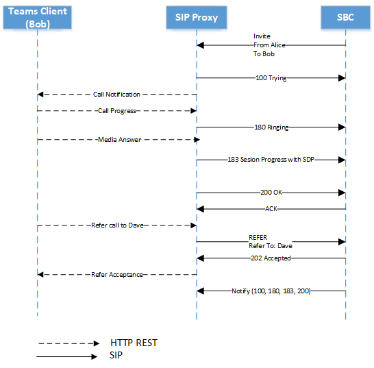

# <a name="direct-routing---sip-protocol"></a>ダイレクト ルーティング - SIP プロトコル

この記事では、ダイレクト ルーティングでセッション開始プロトコル (SIP) を実装する方法について説明します。 セッション ボーダー コントローラー (SBC) と SIP プロキシの間でトラフィックを適切にルーティングするには、一部の SIP パラメーターに特定の値が必要です。 この記事は、オンプレミスの SBC と SIP プロキシ サービスの間の接続の構成を担当する音声管理者を対象としています。

## <a name="processing-the-incoming-request-finding-the-tenant-and-user"></a>受信要求の処理: テナントとユーザーを検索する

着信または送信の呼び出しを処理する前に、SIP プロキシと SBC の間で OPTIONS メッセージが交換されます。 これらのオプション メッセージを使用すると、SIP プロキシは SBC に許可される機能を提供できます。 OPTIONS ネゴシエーションを成功させるには重要です (200OK 応答)。SBC と SIP プロキシ間で通話を確立するためのさらなる通信が可能になります。 SIP プロキシへの OPTIONS メッセージの SIP ヘッダーは、次の例として提供されます。

| パラメーター名 | 値の例 | 
| :---------------------  |:---------------------- |
| Request-URI | OPTIONS sip:sip.pstnhub.microsoft.com:5061 SIP /2.0 |
| ヘッダー経由 | 経由: SIP/2.0/TLS sbc1.adatum.biz:5058;alias;branch=z9hG4bKac2121518978 | 
| Max-Forwardsヘッダー | Max-Forwards:68 |
| ヘッダーから | From Header From: <sip:sbc1.adatum.biz:5058> |
| ヘッダーへ | 宛先： <sip:sip.pstnhub.microsoft.com:5061> |
| CSeq ヘッダー | CSeq: 1 INVITE | 
| 連絡先ヘッダー | 連絡先： <sip:sbc1.adatum.biz:50588;transport=tls> |

> [!NOTE]
> SIP ヘッダーには、使用中の SIP URI に userinfo が含まれていません。 [RFC 3261 のセクション 19.1.1](https://tools.ietf.org/html/rfc3261#section-19.1.1) に従って、URI の userinfo 部分は省略可能であり、宛先ホストにユーザーの概念がない場合や、hosst 自体が識別されるリソースである場合は存在しない可能性があります。 @記号が SIP URI に存在する場合は、ユーザー フィールドを空にしないでください。
> SIPS URI はサポートされていないため、ダイレクト ルーティングでは使用しないでください。
> セッション ボーダー コントローラーの構成を確認し、SIP 要求で "Replaces" ヘッダーを使用していないことを確認します。 ダイレクト ルーティングは、置換ヘッダーが定義されている SIP 要求を拒否します。

着信呼び出しでは、SIP プロキシは、通話の送信先となるテナントを検索し、このテナント内の特定のユーザーを見つける必要があります。 テナント管理者は、複数のテナントで DID 以外の番号 (+1001 など) を構成できます。 そのため、複数の Microsoft 365 またはOffice 365組織では DID 以外の番号が同じである可能性があるため、番号参照を実行する特定のテナントを見つけることが重要です。  

このセクションでは、SIP プロキシがテナントとユーザーを検索し、受信接続で SBC の認証を実行する方法について説明します。

着信呼び出しの SIP 招待メッセージの例を次に示します。

| パラメーター名 | 値の例 | 
| :---------------------  |:---------------------- |
| Request-URI | INVITE sip:+18338006777@sip.pstnhub.microsoft.com SIP /2.0 |
| ヘッダー経由 | 経由: SIP/2.0/TLS sbc1.adatum.biz:5058;alias;branch=z9hG4bKac2121518978 | 
| Max-Forwardsヘッダー | Max-Forwards:68 |
| ヘッダーから | From Header From: <sip:+17168712781@sbc1.adatum.biz;transport=udp;tag=1c747237679 |
| ヘッダーへ | To: sip:+183338006777@sbc1.adatum.biz | 
| CSeq ヘッダー | CSeq: 1 INVITE | 
| 連絡先ヘッダー | 連絡先: <sip: 68712781@sbc1.adatum.biz:5058;transport=tls> | 

招待を受信すると、SIP プロキシは次の手順を実行します。

1. 証明書を確認します。 最初の接続では、ダイレクト ルーティング サービスは Contact ヘッダーに表示される FQDN 名を受け取り、提示された証明書の共通名またはサブジェクトの別名と一致します。 SBC 名は、次のいずれかのオプションと一致する必要があります。

   - オプション 1。 Contact ヘッダーに表示される完全な FQDN 名は、提示された証明書の共通名/サブジェクトの別名と一致する必要があります。  

   - オプション 2。 Contact ヘッダーに表示される FQDN 名のドメイン部分 (たとえば、FQDN 名 sbc1.adatum.biz の adatum.biz) は、共通名/サブジェクト代替名 (例: *.adatum.biz) のワイルドカード値と一致する必要があります。

2. 連絡先ヘッダーに表示されている完全な FQDN 名を使用してテナントを探してみてください。  

   連絡先ヘッダー (sbc1.adatum.biz) の FQDN 名が、Microsoft 365 またはOffice 365組織の DNS 名として登録されているかどうかを確認します。 見つかった場合、SBC FQDN がドメイン名として登録されているテナントで、ユーザーの参照が実行されます。 見つからない場合は、手順 3 が適用されます。   

3. 手順 3 は、手順 2 に失敗した場合にのみ適用されます。 

   連絡先ヘッダーに表示されている FQDN からホスト部分を削除します (FQDN: sbc12.adatum.biz、ホスト部分を削除した後、adatum.biz)、この名前が Microsoft 365 またはOffice 365組織で DNS 名として登録されているかどうかを確認します。 見つかった場合は、このテナントでユーザー参照が実行されます。 見つからない場合、呼び出しは失敗します。

4. Request-URI に表示されている電話番号を使用して、手順 2 または 3 で見つかったテナント内で逆引き番号の参照を実行します。 表示された電話番号を、前の手順で見つかったテナント内のユーザー SIP URI と照合します。

5. トランク設定を適用します。 この SBC のテナント管理者によって設定されたパラメーターを見つけます。

   Microsoft では、Microsoft SIP プロキシとペアの SBC の間にサード パーティの SIP プロキシまたはユーザー エージェント サーバーを持つことはサポートされていません。これにより、ペアの SBC によって作成された要求 URI が変更される可能性があります。

   1 つの SBC が多くのテナント (キャリア シナリオ) と相互接続されるシナリオに必要な 2 つのルックアップ (手順 2 と 3) の要件については、この記事の後半で説明します。

### <a name="detailed-requirements-for-contact-header-and-request-uri"></a>Contact ヘッダーと Request-URI の詳細な要件

#### <a name="contact-header"></a>連絡先ヘッダー

Microsoft SIP プロキシへのすべての受信 SIP メッセージ (OPTIONS、INVITE) の場合、Contact ヘッダーには、次のように URI ホスト名に SBC FQDN がペアになっている必要があります。

構文: 連絡先: SBC の sip:phone または sip address@FQDN<;transport=tls> 

[RFC 3261 セクション 11.1](https://tools.ietf.org/html/rfc3261#section-11.1) に従って、連絡先ヘッダー フィールドが OPTIONS メッセージに表示される場合があります。 ダイレクト ルーティングでは、連絡先ヘッダーが必要です。 上記の形式の INVITE メッセージの場合、OPTIONS メッセージの場合、ユーザー情報は SIP URI から削除でき、次のような形式で送信された FQDN のみを使用できます。

構文: 連絡先: <sip:SBC の FQDN;transport=tls>

この名前 (FQDN) は、提示された証明書の [共通名] フィールドまたは [サブジェクトの別名] フィールドにも含まれている必要があります。 Microsoft では、証明書の [共通名] フィールドまたは [サブジェクトの別名] フィールドで、名前のワイルドカード値を使用できます。   

ワイルドカードのサポートについては、 [RFC 2818 のセクション 3.1](https://tools.ietf.org/html/rfc2818#section-3.1) を参照してください。 具体的には：

*"名前には、単一のドメイン名コンポーネントまたはコンポーネント フラグメントと一致すると見なされるワイルドカード文字 \* が含まれている場合があります。たとえば、 \*.a.com は foo.a.com に一致しますが、bar.foo.a.com は一致しません。f.com\* は foo.com に一致しますが、bar.com は一致しません。*

SIP メッセージに表示される連絡先ヘッダーの複数の値が SBC によって送信される場合、Contact ヘッダーの最初の値の FQDN 部分のみが使用されます。

ダイレクト ルーティングの経験則として、FQDN を使用して IP ではなく SIP URI を設定することが重要です。 ホスト名が FQDN ではなく IP で表される連絡先ヘッダーを持つ SIP プロキシへの着信 INVITE または OPTIONS メッセージ。接続は 403 Forbidden で拒否されます。

#### <a name="request-uri"></a>Request-URI 

すべての着信呼び出しに対して、Request-URI を使用して電話番号をユーザーに一致させます。   

現在、次の例に示すように、電話番号にはプラス記号 (+) が含まれている必要があります。 

```console
INVITE sip:+18338006777@sip.pstnhub.microsoft.com SIP /2.0
```
#### <a name="from-header"></a>ヘッダーから

すべての着信呼び出しに対して、From ヘッダーは呼び出し元の電話番号と呼び出し先のブロックされた電話番号リストを照合するために使用されます。

次の例に示すように、電話番号には + が含まれている必要があります。

```console
From: <sip:+17168712781@sbc1.adatum.biz;transport=udp;tag=1c747237679
```

## <a name="contact-and-record-route-headers-considerations"></a>連絡先とRecord-Routeヘッダーに関する考慮事項

SIP プロキシは、新しいダイアログ内クライアント トランザクション (Bye や Re-Invite など) と SIP オプションに応答するときに、次ホップ FQDN を計算する必要があります。 連絡先またはRecord-Routeが使用されます。 

[RFC 3261 のセクション 8.1.1.8](https://tools.ietf.org/html/rfc3261#section-8.1.1.8) によると、新しいダイアログが生成される可能性がある要求では、Contact ヘッダーが必要です。 Record-Routeは、プロキシがダイアログ内の将来の要求のパスを維持する場合にのみ必要です。 プロキシ SBC が [ダイレクト ルーティング用のローカル メディア最適化](./direct-routing-media-optimization.md)と共に使用されている場合は、プロキシ SBC がルート内にとどまる必要があるため、レコード ルートを構成する必要があります。 

プロキシ SBC が使用されていない場合は、連絡先ヘッダーのみを使用することをお勧めします。

- [RFC 3261 セクション 20.30](https://tools.ietf.org/html/rfc3261#section-20.30) に従って、プロキシがダイアログ内の将来の要求のパスを維持する場合にRecord-Routeが使用されます。これは、すべてのトラフィックが Microsoft SIP プロキシとペアの SBC の間で行われるのでプロキシ SBC が構成されていない場合は必須ではありません。 

- Microsoft SIP プロキシでは、送信 ping オプションの送信時に次ホップを決定するために Contact ヘッダー (レコード ルートではなく) のみが使用されます。 プロキシ SBC が使用されていない場合、2 つのパラメーター (Contact と Record-Route) ではなく 1 つのパラメーター (Contact) のみを構成すると、管理が簡略化されます。 

次ホップを計算するために、SIP プロキシは次を使用します。

- 優先度 1。 最上位レベルのレコード ルート。 最上位レベルのRecord-Routeに FQDN 名が含まれている場合は、FQDN 名を使用して送信ダイアログ内接続を行います。

- 優先度 2。 連絡先ヘッダー。 Record-Routeが存在しない場合、SIP プロキシは Contact ヘッダーの値を検索して送信接続を行います。 (これは推奨される構成です。)

連絡先とRecord-Routeの両方を使用する場合、SBC 管理者は値を同じにしておく必要があります。これにより、管理オーバーヘッドが発生します。 

### <a name="use-of-fqdn-name-in-contact-or-record-route"></a>連絡先またはRecord-Routeでの FQDN 名の使用

IP アドレスの使用は、Record-Routeまたは連絡先ではサポートされていません。 サポートされているオプションは FQDN のみです。これは、SBC 証明書の共通名またはサブジェクト代替名のいずれかと一致する必要があります (証明書のワイルドカード値がサポートされています)。

- レコード ルートまたは連絡先に IP アドレスが表示されている場合、証明書のチェックは失敗し、呼び出しは失敗します。

- FQDN が提示された証明書の Common または Subject 代替名の値と一致しない場合、呼び出しは失敗します。 

## <a name="inbound-call-sip-dialog-description"></a>受信呼び出し: SIP ダイアログの説明

次の表は、非バイパス モードとバイパス モードの呼び出しフローの相違点と類似点をまとめたものです。

| パラメーター名 | バイパスモード以外 | バイパス モード
| :---------------------  |:---------------------- |:----------------|
| 183 メッセージと 200 件のメッセージのメディア候補 | メディア プロセッサ | クライアント | 
| SBC が受信できる 183 個のメッセージの数 | セッションごとに 1 つ | 複数 | 
| 通話は暫定的な回答で行うことができます (183) | Yes | Yes |
| 通話は、暫定的な回答なしで行うことができます (183) | Yes | Yes |

###  <a name="non-media-bypass-flow"></a>メディア以外のバイパス フロー

Teams ユーザーは、同時に複数のエンドポイントを持つ場合があります。 たとえば、Teams for Windows クライアント、Teams for iPhone クライアント、Teams Phone (Teams Android クライアント) などです。 各エンドポイントは、次のように HTTP 残りを通知する場合があります。

-   通話の進行状況 – SIP プロキシによって SIP メッセージ 180 に変換されます。 メッセージ 180 を受信すると、SBC はローカル 呼び出し音を生成する必要があります。

-   メディアの回答 – セッション記述プロトコル (SDP) のメディア候補を含むメッセージ 183 に SIP プロキシによって変換されます。 メッセージ 183 を受信すると、SBC は SDP メッセージで受信したメディア候補に接続することを想定しています。 

    > [!NOTE]
    > 場合によっては、Media 応答が生成されず、エンド ポイントが "Call Accepted" メッセージで応答する場合があります。

-   受け入れられた呼び出し - SDP を使用して SIP プロキシによって SIP メッセージ 200 に変換されます。 メッセージ 200 を受信すると、SBC は指定された SDP 候補との間でメディアを送受信することが想定されます。

    > [!NOTE]
    > ダイレクト ルーティングでは、遅延オファーの招待 (SDP を使用しない招待) はサポートされていません。

#### <a name="multiple-endpoints-ringing-with-provisional-answer"></a>暫定的な回答で複数のエンドポイントが呼び出される

1.  SBC から最初の招待を受信すると、SIP プロキシは "SIP SIP/2.0 100 Trying" というメッセージを送信し、着信呼び出しに関するすべてのエンド ユーザー エンドポイントに通知します。 

2.  通知されると、各エンドポイントが呼び出しを開始し、"通話の進行状況" メッセージを SIP プロキシに送信します。 Teams ユーザーは複数のエンドポイントを持つ可能性があるため、SIP プロキシは複数の通話進行状況メッセージを受信する可能性があります。

3.  クライアントから受信したすべての通話進行状況メッセージについて、SIP プロキシは通話進行状況メッセージを SIP メッセージ "SIP SIP/2.0 180 Ringing" に変換します。 このようなメッセージを送信する間隔は、通話コントローラーからの受信メッセージの間隔によって定義されます。 次の図では、SIP プロキシによって生成された 2 つの 180 個のメッセージがあります。 これらのメッセージは、ユーザーの 2 つの Teams エンドポイントから送信されます。 クライアントにはそれぞれ一意のタグ ID があります。  異なるエンドポイントから送信されるすべてのメッセージは、個別のセッションになります ("To" フィールドのパラメーター "タグ" は異なります)。 ただし、エンドポイントでは、次の図に示すように、メッセージ 180 が生成されず、メッセージ 183 がすぐに送信されない場合があります。

4.  エンドポイントがエンドポイントのメディア候補の IP アドレスを含む Media Answer メッセージを生成すると、SIP プロキシは、受信したメッセージを "SIP 183 セッション進行状況" メッセージに変換し、クライアントからの SDP をメディア プロセッサの SDP に置き換えました。 次の図では、Fork 2 のエンドポイントが呼び出しに応答しました。 トランクがバイパスされない場合、183 SIP メッセージは 1 回だけ生成されます (リング ボットまたはクライアント エンドポイントのいずれか)。 183 は、既存のフォークに付属しているか、新しいフォークを開始する可能性があります。

5.  呼び出しを受け入れたエンドポイントの最終的な候補と共に、通話受け入れメッセージが送信されます。 通話受付メッセージは SIP メッセージ 200 に変換されます。 

> [!div class="mx-imgBorder"]
> 

#### <a name="multiple-endpoints-ringing-without-provisional-answer"></a>暫定的な回答なしで複数のエンドポイントが呼び出し音を鳴らしている

1.  SBC から最初の招待を受信すると、SIP プロキシは "SIP SIP/2.0 100 Trying" というメッセージを送信し、着信呼び出しに関するすべてのエンド ユーザー エンドポイントに通知します。 

2.  通知されると、各エンドポイントが呼び出しを開始し、メッセージ "通話の進行状況" を SIP プロキシに送信します。 Teams ユーザーは複数のエンドポイントを持つ可能性があるため、SIP プロキシは複数の通話進行状況メッセージを受信する可能性があります。

3.  クライアントから受信したすべての通話進行状況メッセージについて、SIP プロキシは通話進行状況メッセージを SIP メッセージ "SIP SIP/2.0 180 Trying" に変換します。  メッセージを送信する間隔は、通話コントローラーからメッセージを受信する間隔によって定義されます。 下の図には、SIP プロキシによって生成された 2 つの 180 個のメッセージがあります。つまり、ユーザーは 3 つの Teams クライアントにログインし、各クライアントは通話の進行状況を送信します。 すべてのメッセージは個別のセッションになります ("To" フィールドのパラメーター "タグ" は異なります)

4.  呼び出しを受け入れたエンドポイントの最終的な候補と共に、通話受け入れメッセージが送信されます。 通話受付メッセージは SIP メッセージ 200 に変換されます。 

> [!div class="mx-imgBorder"]
> 

### <a name="media-bypass-flow"></a>メディア バイパス フロー

メディア バイパス シナリオでは、同じメッセージ (100 Trying、180、183) が使用されます。 

次のスキーマは、バイパス呼び出しフローの例を示しています。 

> [!NOTE]
> メディア候補は、異なるエンドポイントから取得できます。 

> [!div class="mx-imgBorder"]
> 

## <a name="replaces-option"></a>置換オプション

SBC では、置換を使用した招待がサポートされている必要があります。

## <a name="size-of-sdp-considerations"></a>SDP に関する考慮事項のサイズ

ダイレクト ルーティング インターフェイスは、1,500 バイトを超える SIP メッセージを送信する場合があります。  SDP のサイズは、主にこれを引き起こします。 ただし、SBC の背後に UDP トランクがある場合は、変更されていないトランクに Microsoft SIP プロキシから転送されたメッセージが拒否される可能性があります。 MICROSOFT では、UDP トランクにメッセージを送信するときに、SBC の SDP で一部の値を削除することをお勧めします。 たとえば、ICE 候補または未使用のコーデックを削除できます。

## <a name="call-transfer"></a>呼び出し転送

ダイレクト ルーティングでは、呼び出し転送の 2 つのメソッドがサポートされます。

- オプション 1。 SIP プロキシ プロセス は、クライアントからローカルに参照し、RFC 3892 のセクション 7.1 で説明されているように、レフェリーとして機能します。

  このオプションを使用すると、SIP プロキシは転送を終了し、新しい招待を追加します。 


- オプション 2。 SIP プロキシは、SBC に対して参照を送信し、RFC 5589 のセクション 6 で説明されているように Transferor として機能します。

  このオプションを使用すると、SIP プロキシは SBC に参照を送信し、SBC が転送を完全に処理することを想定します。

SIP プロキシは、SBC によって報告される機能に基づいてメソッドを選択します。 SBC が "参照" メソッドをサポートしていることを示す場合、SIP プロキシは通話転送にオプション 2 を使用します。

次に示すのは、Refer メソッドがサポートされているメッセージを送信する SBC の例です。

```console
ALLOW: INVITE, OPTIONS, INFO, BYE, CANCEL, ACK, PRACK, UPDATE, REFER, SUBSCRIBE, NOTIFY
```

SBC がサポートされている方法として参照することを示していない場合、ダイレクト ルーティングはオプション 1 を使用します (SIP プロキシはレフェリーとして機能します)。 SBC は、Notify メソッドをサポートしていることを通知する必要もあります。

Refer メソッドがサポートされないことを示す SBC の例:

```console
ALLOW: INVITE, ACK, CANCEL, BYE, INFO, NOTIFY, PRACK, UPDATE, OPTIONS
```

### <a name="sip-proxy-processes-refer-from-the-client-locally-and-acts-as-a-referee"></a>SIP プロキシ プロセス クライアントからローカルに参照し、レフェリーとして機能する

SBC が Refer メソッドがサポートされていないと示した場合、SIP プロキシはレフェリーとして機能します。 

クライアントから送信された Refer 要求は、SIP プロキシで終了します。 (クライアントからの参照要求は、次の図に "Dave への呼び出し転送" として示されています。  詳細については、 [RFC 3892](https://www.ietf.org/rfc/rfc3892.txt) のセクション 7.1 を参照してください。 

> [!div class="mx-imgBorder"]
> 

### <a name="sip-proxy-send-the-refer-to-the-sbc-and-acts-as-a-transferor"></a>SIP プロキシは、SBC に参照を送信し、Transferor として機能します。

これは呼び出し転送に推奨される方法であり、メディア バイパス認定を求めるデバイスでは必須です。 SBC が Refer を処理できない通話転送は、メディア バイパス モードではサポートされていません。 

この標準については、RFC 5589 のセクション 6 で説明されています。 関連する RFC は次のとおりです。

- [セッション開始プロトコル (SIP) 呼び出し制御 - 転送](https://tools.ietf.org/html/rfc5589)

- [セッション開始プロトコル (SIP) "Replaces" ヘッダー](https://tools.ietf.org/html/rfc3891)

- [セッション開始プロトコル (SIP) "参照者" メカニズム](https://tools.ietf.org/html/rfc3892)

このオプションは、SIP プロキシが Transferor として機能し、SBC に参照メッセージを送信することを前提としています。 SBC は譲渡先として機能し、参照を処理して転送用の新しいオファーを生成します。 次の 2 つのケースが考えられます。

- 通話は外部 PSTN 参加者に転送されます。 
- 呼び出しは、SBC を介して、同じテナント内の別の Teams ユーザーに 1 つの Teams ユーザーから転送されます。 

通話が SBC を介して Teams ユーザー間で転送される場合、SBC は、参照メッセージで受信した情報を使用して、転送ターゲット (Teams ユーザー) に対して新しい招待を発行する (新しいダイアログを開始する) 必要があります。 

要求のトランザクションの To/Transferor フィールドを内部的に設定するには、SIP プロキシは REFER-TO/REFERRED-BY ヘッダー内でこの情報を伝達する必要があります。 

SIP プロキシは、ホスト名と次のいずれかの SIP プロキシ FQDN で構成される SIP URI として REFER-TO を形成します。

- 転送先が電話番号の場合、または URI のユーザー名部分の E.164 電話番号

- 完全転送ターゲットの MRI とテナント ID をそれぞれエンコードする x-m パラメーターと x-t パラメーター 

REFERRED-BY ヘッダーは、次の表に示すように、転送元のテナント ID およびその他の転送コンテキスト パラメーターと同様に、転送元の MRI がエンコードされた SIP URI です。

| パラメーター | 値 | 説明 |  
|:---------------------  |:---------------------- |:---------------------- |
| x-m | Mri | CC によって設定された転送元/転送ターゲットの完全なMRI |
| x-t | テナント ID | CC によって設定された x-t テナント ID 省略可能なテナント ID |
| x-ti | Transferor Correlation Id | 転送元への呼び出しの関連付け ID |
| x-tt | 転送先呼び出し URI | エンコードされた呼び出し置換 URI |

この場合、参照ヘッダーのサイズは最大 400 個のシンボルにすることができます。 SBC では、最大 400 個のシンボルのサイズを持つ参照メッセージの処理がサポートされている必要があります。

> [!div class="mx-imgBorder"]
> 

## <a name="session-timer"></a>セッション タイマー

SIP プロキシは、バイパス以外の呼び出しではセッション タイマーをサポート (常に提供) しますが、バイパス呼び出しでは提供しません。 SBC によるセッション タイマーの使用は必須ではありません。

##  <a name="use-of-request-uri-parameter-userphone"></a>Request-URI パラメーター user=phone の使用

SIP プロキシは Request-URI を分析し、パラメーター user=phone が存在する場合、サービスは Request-URI を電話番号として処理し、その番号をユーザーに一致させます。 パラメーターが存在しない場合、SIP プロキシはヒューリスティックを適用して Request-URI ユーザーの種類 (電話番号または SIP アドレス) を決定します。

Microsoft では、通話セットアップ プロセスを簡略化するために、user=phone パラメーターを常に適用することをお勧めします。

## <a name="history-info-header"></a>History-Infoヘッダー

History-Info ヘッダーは、SIP 要求の再ターゲットに使用され、「要求履歴情報をキャプチャするための標準メカニズムを提供して、ネットワークとエンド ユーザーに対してさまざまなサービスを有効にする」ためです。 詳細については、 [RFC 4244 – セクション 1.1 を](http://www.ietf.org/rfc/rfc4244.txt)参照してください。 Microsoft Phone System の場合、このヘッダーは Simulring および Call Forwarding のシナリオで使用されます。  

送信する場合、History-Infoは次のように有効になります。

- SIP プロキシは、PSTN コントローラーに送信されるHistory-Info ヘッダーを構成する個々のHistory-Info エントリに、関連付けられた電話番号を含むパラメーターを挿入します。  電話番号パラメーターを持つエントリのみを使用して、PSTN コントローラーは新しいHistory-Info ヘッダーを再構築し、SIP プロキシ経由で SIP トランク プロバイダーに渡します。

- History-Infoヘッダーは、同時のリングと通話転送のケースに追加されます。

- History-Infoヘッダーは、呼び出し転送ケースには追加されません。

- 再構築されたHistory-Info ヘッダー内の個々の履歴エントリには、電話番号パラメーターが指定され、直接ルーティング FQDN (sip.pstnhub.microsoft.com) が URI のホスト部分として設定されます。"user=phone" のパラメーターが SIP URI の一部として追加されます。  元のHistory-Info ヘッダーに関連付けられているその他のパラメーター (電話コンテキスト パラメーターを除く) は、再構築されたHistory-Info ヘッダーで渡されます。  

  > [!NOTE]
  > プライベートであるエントリ (RFC 4244 のセクション 3.3 で定義されているメカニズムによって決まります) は、SIP トランク プロバイダーが信頼されたピアであるため、そのまま転送されます。

- 受信History-Infoは無視されます。

SIP プロキシによって送信される History-info ヘッダーの形式を次に示します。

```console
<sip:UserB@sip.pstnhub.microsoft.com?Privacy=history&Reason=SIP%3B\cause%3D486>;index=1.2,
```

呼び出しが複数回リダイレクトされた場合、すべてのリダイレクトに関する情報が、適切な理由に時系列順に含まれます。


ヘッダーの例:

```console
History-info: 
<sip:+14257123456@sip.pstnhub.microsoft.com;user=phone?Reason=SIP;cause=302;text=”Move Temporarily”>;index=1
<sip:+14257123457@sip.pstnhub.microsoft.com;user=phone?Reason=SIP;cause=496;text=”User Busy”>;index=1.1
```

History-Infoは、必須の TLS メカニズムによって保護されます。 

## <a name="sbc-connection-to-direct-routing-and-failover-mechanism"></a>ダイレクト ルーティングとフェールオーバー メカニズムへの SBC 接続

[「ダイレクト ルーティングの計画](direct-routing-plan.md#failover-mechanism-for-sip-signaling)」の「SIP シグナリングのフェールオーバー メカニズム」セクションを参照してください。

## <a name="retry-after"></a>Retry-After

ダイレクト ルーティング データセンターがビジー状態の場合、サービスは 1 秒間隔のRetry-After メッセージを SBC に送信できます。 SBC が INVITE に応答して Retry-After ヘッダーを含む 503 メッセージを受信した場合、SBC はその接続を終了し、次に利用可能な Microsoft データセンターを試す必要があります。

## <a name="handling-retries-603-response"></a>再試行の処理 (603 応答)
エンド ユーザーが、着信を拒否した後に 1 回の呼び出しに対して複数の不在着信が発生した場合、SBC または PSTN トランク プロバイダーの再試行メカニズムが正しく構成されていないことを意味します。 SBC は、603 応答での再試行を停止するように再構成する必要があります。

## <a name="ice-restart-media-bypass-call-transferred-to-an-endpoint-that-does-not-support-media-bypass"></a>ICE 再起動: メディア バイパスをサポートしていないエンドポイントに転送されたメディア バイパス呼び出し

[SBC は、RFC 5245 のセクション 9.1.1.1](https://tools.ietf.org/html/rfc5245#section-9.1.1.1) で説明されているように ICE 再起動をサポートする必要があります。

ダイレクト ルーティングでの再起動は、RFC の次の段落に従って実装されます。

*ICE を再起動するには、エージェントがオファー内のメディア ストリームの ice-pwd と ice-ufrag の両方を変更する必要があります。 セッション レベルの属性は 1 つのオファーで使用できますが、後続のオファーでメディア レベルの属性と同じ ice-pwd または ice-ufrag を提供することは許容されることに注意してください。 これはパスワードの変更ではなく、その表現の変更に過ぎず、ICE の再起動は発生しません。*

*エージェントは、このメディア ストリームの最初のオファーと同様に、このメディア ストリームの SDP 内の残りのフィールドを設定します (セクション 4.3 を参照)。 その結果、一連の候補には、そのストリームの以前の候補の一部、なし、またはすべての候補が含まれ、MAY にはセクション 4.1.1 で説明されているように収集されたまったく新しい候補セットが含まれます。*

呼び出しが最初にメディア バイパスで確立され、呼び出しがSkype for Business クライアントに転送された場合、ダイレクト ルーティングはメディア プロセッサを挿入する必要があります。これは、メディア バイパスを使用するSkype for Business クライアントではダイレクト ルーティングを使用できないためです。 ダイレクト ルーティングでは、ice-pwd と ice-ufrag を変更し、新しいメディア候補を再び提供することで、ICE 再起動プロセスを開始します。
