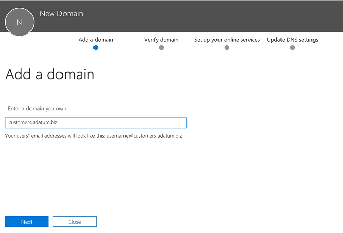
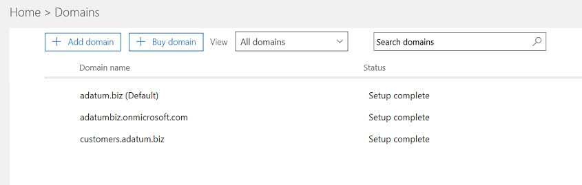
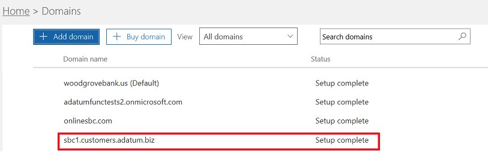
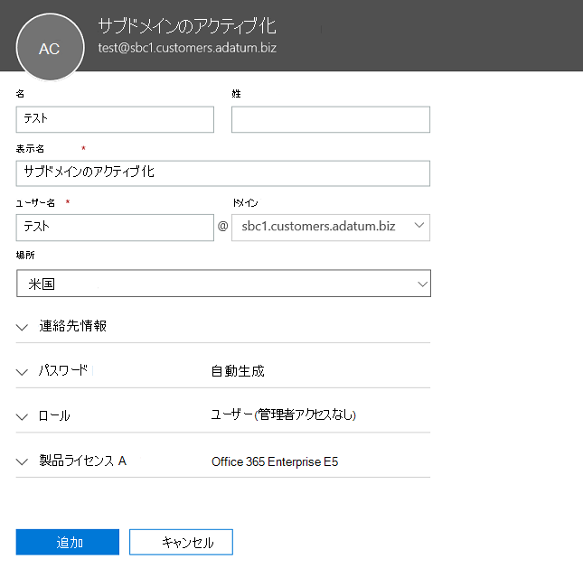

# 複数のテナントのセッション ボーダー コント ローラーを構成します。Configure a Session Border Controller for multiple tenants

直接ルーティングでは、構成する 1 つセッション ボーダー コント ローラー (SBC) 複数のテナントを処理するをサポートします。Direct Routing supports configuring one Session Border Controller (SBC) to serve multiple tenants.

> [!NOTE]
> マイクロソフト パートナーまたは PSTN 通信事業者、このドキュメントの後半には、通信事業者と呼ばれるは、このシナリオは設計されています。This scenario is designed for Microsoft partners and/or PSTN carriers, referred to as carriers later in this document. キャリアは、お客様に、マイクロソフトのチームに配信されるテレフォニー サービスを販売しています。A carrier sells telephony services delivered to Microsoft Teams to their customers. 

キャリア。A carrier:
- SBC のデータ センターでの管理を展開し、(お客様が、SBC を実装する必要はありませんし、チームのクライアントでのキャリアからテレフォニー サービスを受信する)。Deploys and manages an SBC in their datacenter (customers do not need to implement an SBC, and they receive telephony services from the carrier in the Teams client).
- 複数のテナントに SBC を相互接続します。Interconnects the SBC to multiple tenants.
- PSTN サービスを提供しています。Provides PSTN services to customers.
- エンド ツー エンドの通話品質を管理します。Manages call quality end to end.
- PSTN サービスに対して個別に請求します。Charges separately for PSTN services.

マイクロソフトでは、通信事業者は管理されません。Microsoft does not manage carriers. マイクロソフトは、PBX (マイクロソフトの電話システム) とチームのクライアントを提供しています、電話かを確認して、SBCs マイクロソフトの電話システムで使用できるかを確認します。Microsoft offers a PBX (Microsoft Phone System) and a Teams client, certifies phones, and certifies SBCs that can be used with the Microsoft Phone System. 配送業者を選択するには、前にある選択認定 SBC があり、エンド ツー エンドの音声品質を管理することができますを確認してください。Before choosing a carrier, please ensure that your choice has a certified SBC and can manage voice quality end to end.

シナリオを構成するのには技術的な実装手順を次に示します。The following are the technical implementation steps to configure the scenario.

**キャリアのみ。****Carrier only:**
1. SBC を配置し、[認定の SBC ベンダーの指示](#deploy-and-configure-the-sbc)に従って、ホストのシナリオ用に構成します。Deploy the SBC and configure it for the hosting scenario according to the [instructions from the certified SBC vendors](#deploy-and-configure-the-sbc).
2. キャリア テナントでベースのドメイン名を登録し、ワイルドカード証明書を要求します。Register a base domain name in the carrier tenant and request a wildcard certificate.
3. ベースのドメインの一部であるすべてのお客様のサブドメインを登録します。Register a subdomain for every customer, which is part of the base domain.

**キャリアでは、お客様のグローバル管理者:****Carrier with a Customer Global Administrator:**
1. お客様のテナントには、サブドメイン名を追加します。Add the subdomain name to the customer tenant.
2. サブドメイン名を有効にします。Activate the subdomain name.
3. お客様のテナントとプロビジョニングのユーザーに、キャリアからトランクを構成します。Configure the trunk from the carrier to the customer tenant and provision users.

*DNS の基礎と Office 365 でドメイン名を管理する方法を理解することを確認してください。進む前に[Office 365 のドメイン関連のヘルプ](https://support.office.com/en-us/article/Get-help-with-Office-365-domains-28343f3a-dcee-41b6-9b97-5b0f4999b7ef)を確認してください。**Please make sure you understand DNS basics and how the domain name is managed in Office 365. Review [Get help with Office 365 domains](https://support.office.com/en-us/article/Get-help-with-Office-365-domains-28343f3a-dcee-41b6-9b97-5b0f4999b7ef) before proceeding further.*

## 展開し、SBC を構成します。Deploy and configure the SBC

展開し、SBC ホスティング シナリオでは、半角を構成する方法の詳細な手順については、SBC の製造元のマニュアルを参照してください。For the detailed steps on how to deploy and configure SBCs for an SBC hosting scenario, please refer to the SBC vendor's documentation.

- **は:**[直接ルーティングの構成に関する注意事項](https://www.audiocodes.com/solutions-products/products/products-for-microsoft-365/direct-routing-for-Microsoft-Teams)」の接続は SBC マイクロソフト チーム直接ルーティングのホスティング モデル構成メモにします」で説明したシナリオをホストしている SBC の構成**AudioCodes:** [Direct Routing Configuration notes](https://www.audiocodes.com/solutions-products/products/products-for-microsoft-365/direct-routing-for-Microsoft-Teams), the configuration of the SBC hosting scenario described in “Connecting AudioCodes SBC to Microsoft Teams Direct Routing Hosting Model Configuration Note.” 
- **通信のリボン:** シナリオをホストしている SBC、コア ・ シリーズのみがサポートされています。**Ribbon Communications:** For SBC hosting scenarios, only the core series is supported. [リボン通信 SBC コア Microsoft チーム構成ガイド 』](https://support.sonus.net/display/IOT/PBXs+-+SBC+5k7kSWe)を参照してください。Please refer to the [Ribbon Communications SBC Core Microsoft Teams Configuration Guide](https://support.sonus.net/display/IOT/PBXs+-+SBC+5k7kSWe).

> [!NOTE]
> 「連絡先」ヘッダーを構成する方法に注意してください。Please pay attention to how to configure the “Contact” header. Contact ヘッダーを使用して、招待の受信メッセージにお客様のテナントを検索します。The Contact header is used to find the customer tenant on the incoming invite message. 

## 基本ドメインとサブドメインを登録します。Register a base domain and subdomains

ホスティングのシナリオでは、作成する必要があります。For the hosting scenario, you need to create:
- 配送業者が所有する 1 つのベースのドメイン名です。One base domain name owned by the carrier.
- サブドメインで顧客のすべてのテナント ベースのドメイン名の一部であります。A subdomain that is part of the base domain name in every customer tenant.

次の例ではします。In the following example:
- Adatum は、インターネットおよびテレフォニー サービスを提供することで複数の顧客サービスを提供するキャリアです。Adatum is a carrier that serves several customers by providing Internet and telephony services.
- Woodgrove Bank、contoso 社では、Adventure Works は、Office 365 のドメインが存在するが、Adatum からテレフォニー サービスを受信する 3 つの顧客です。Woodgrove Bank, Contoso, and Adventure Works are three customers that have Office 365 domains but receive the telephony services from Adatum.

サブドメインに**する必要があります**では、Office 365 に招待状を送信するときに、顧客および取引先担当者のヘッダー内の FQDN を構成するトランクの FQDN 名と一致します。Subdomains **MUST** match the FQDN name of the trunk that will be configured for the customer and the FQDN in the Contact header when sending the Invite to Office 365. 

Office 365 の直接のルーティング インターフェイスでの呼び出しが到着すると、インタ フェースは、テナントのユーザーを検索する必要がありますを検索するのに連絡先ヘッダーを使用します。When a call arrives at the Office 365 Direct Routing interface, the interface uses the Contact header to find the tenant where the user should be looked up. 直接ルーティングの使用しない電話番号をルックアップへの招待は、一部のお客様がない必要がありますように番号がいくつかのテナントが重複することにしました。Direct Routing does not use phone number lookup on the Invite, as some customers might have non-DID numbers that can overlap in several tenants. したがって、電話番号で、特定のユーザーを検索するのには正確なテナントは Contact ヘッダー内の FQDN 名が必要です。Therefore, the FQDN name in the Contact header is required to identify the exact tenant to look up the user by the phone number.

*Office 365 テナントにドメイン名を作成する方法の詳細については、 [Office 365 のドメイン関連のヘルプ](https://support.office.com/en-us/article/Get-help-with-Office-365-domains-28343f3a-dcee-41b6-9b97-5b0f4999b7ef)を参照してください。**Please review  [Get help with Office 365 domains](https://support.office.com/en-us/article/Get-help-with-Office-365-domains-28343f3a-dcee-41b6-9b97-5b0f4999b7ef) for more information about creating domain names in Office 365 tenants.*

次の図は、基本ドメイン、サブドメインでは、連絡先のヘッダーの要件をまとめたものです。The following diagram summarizes the requirements to base domain, subdomains, and Contact header.

SBC には、接続の認証に証明書が必要です。The SBC requires a certificate to authenticate the connections. キャリアは SBC のホスティング シナリオでは、san 証明書を要求する必要があります*\*.base_domain (たとえば、 \*customers.adatum.biz)*。For the SBC hosting scenario, the carrier needs to request a certificate with SAN *\*.base_domain (for example, \*customers.adatum.biz)*. この証明書は、複数のテナントが 1 つの SBC からへの接続を認証するために使用できます。This certificate can be used to authenticate connections to multiple tenants served from a single SBC.

次の表は、1 つの構成の例です。The following table is an example of one configuration.

|新しいドメイン名New domain name |種類Type|登録Registered  |SBC の SAN 証明書Certificate SAN for SBC  |テナントの既定のドメインの例Tenant default domain in the example  |ユーザーへの呼び出しを送信するとき、連絡先のヘッダーに SBC が提示しなければならない FQDN 名FQDN name that SBC must present in the Contact header when sending calls to users|
|---------|---------|---------|---------|---------|---------|
|customers.adatum.bizcustomers.adatum.biz|    ベースBase     |     キャリアのテナントでIn carrier tenant  |    \*。 customers.adatum.biz\*.customers.adatum.biz  |   adatum.bizadatum.biz      |「Na」と、これは、サービス テナント ユーザーは存在しませんNA, this is a service tenant, no users |
|sbc1.customers.adatum.bizsbc1.customers.adatum.biz|    サブドメインSubdomain  |    お客様のテナントでIn a customer tenant  |    \*。 customers.adatum.biz\*.customers.adatum.biz  | woodgrovebank.uswoodgrovebank.us  |  sbc1.customers.adatum.bizsbc1.customers.adatum.biz|
|sbc2.customers.adatum.bizsbc2.customers.adatum.biz  |   サブドメインSubdomain | お客様のテナントでIn a customer tenant   |   \*。 customers.adatum.biz\*.customers.adatum.biz   |contoso.comcontoso.com   |sbc2.customers.adatum.bizsbc2.customers.adatum.biz |
|sbc3.customers.adatum.bizsbc3.customers.adatum.biz |   サブドメインSubdomain | お客様のテナントでIn a customer tenant |   \*。 customers.adatum.biz\*.customers.adatum.biz  |  adventureworks.comadventureworks.com | sbc3.customers.adatum.bizsbc3.customers.adatum.biz |
||         |         |         |         |         |

ベースおよびサブドメインを構成するには、以下に示す手順に従ってください。To configure the base and subdomains, please follow the steps described below. 例では、ベースのドメイン名 (customers.adatum.biz) と 1 つの顧客 (sbc1.customers.adatum.biz では、Woodgrove Bank のテナント) 用のサブドメイン構成します。In the example, we will configure a base domain name (customers.adatum.biz) and a subdomain for one customer (sbc1.customers.adatum.biz in Woodgrove Bank tenant).

## キャリア テナントでベースのドメイン名を登録します。Register a base domain name in the carrier tenant

**キャリアのテナントでは、これらのアクションが実行されます。****These actions are performed in the carrier tenant.**

### キャリア テナント内の適切な権限があることを確認します。Ensure that you have appropriate rights in the carrier tenant

大域管理者として Office 365 管理センターにサインインする場合にのみ、新しいドメインを追加できます。You can only add new domains if you signed in to the Office 365 admin center as a Global Administrator. 

ある役割を検証するにサインインしてください Microsoft 365 の管理センター (https://portal.office.com)**ユーザー**には、 > **アクティブなユーザー**、グローバル管理者ロールがあることを確認します。To validate the role you have, please sign in to the Microsoft 365 admin center (https://portal.office.com), go to **Users** > **Active Users**, and then verify that you have a Global Administrator role. 

管理者の役割と Office 365 のロールを割り当てる方法の詳細については、 [Office 365 の管理者の役割](https://support.office.com/en-us/article/About-Office-365-admin-roles-da585eea-f576-4f55-a1e0-87090b6aaa9d)を参照してください。For more information about admin roles and how to assign a role in Office 365, see [About Office 365 admin roles](https://support.office.com/en-us/article/About-Office-365-admin-roles-da585eea-f576-4f55-a1e0-87090b6aaa9d).

### テナント ベースのドメインを追加し、そのことを確認Add a base domain to the tenant and verify it

1.  Microsoft 365 管理センターでは、**セットアップ**に移動 > **ドメイン** > **ドメインを追加**します。In the Microsoft 365 admin center, go to **Setup** > **Domains** > **Add domain**.
2.  **自分が所有するドメインを入力してください**] ボックスで、ベースのドメインの FQDN を入力します。In the **Enter a domain you own** box, type the FQDN of the base domain. 次の例では、ベースのドメインとは、 *customers.adatum.biz*です。In the following example, the base domain is *customers.adatum.biz*.

    

3. [**次へ**] をクリックします。Click **Next**.
4. 例では、テナントは既に検証済みのドメイン名として adatum.biz を持っています。In the example, the tenant already has adatum.biz as a verified domain name. ウィザードは要求されません追加の検証 customers.adatum.biz が既に登録されている名前のサブドメインであるためです。The wizard will not ask for additional verification because customers.adatum.biz is a subdomain for the already registered name. ただし、前に確認されていませんが、FQDN を追加する場合は、検証のプロセスを経由する必要があります。However, if you add an FQDN that has not been verified before, you will need to go through the process of verification. 検証のプロセスでは、[以下に説明](#add-a-subdomain-to-the-customer-tenant-and-verify-it)します。The process of verification is [described below](#add-a-subdomain-to-the-customer-tenant-and-verify-it).

    

5.  [**次へ**] をクリックし、[ **DNS の設定の更新**] ページで、 **DNS レコードを自分で追加します**を選択して [**次へ**] をクリックします。Click **Next**, and on the **Update DNS Settings** page, select **I’ll add the DNS records myself** and click **Next**.
6.  [次へ] ページですべての値をオフに場合を除き、ビジネスの交換方法、SharePoint、またはチームと Skype のドメイン名を使用するには)、[**次へ**] をクリックし、 **[完了**] をクリックします。On the next page, clear all values (unless you want to use the domain name for Exchange, SharePoint, or Teams/Skype for Business), click **Next**, and then click **Finish**. セットアップの完了状態では、新しいドメインを確認します。Make sure your new domain is in the Setup complete status.

    

### ドメイン名を有効化します。Activate the domain name

ドメイン名を登録した後、少なくとも 1 人のユーザーを追加することによってアクティブ化し、作成した基本ドメインと一致する SIP アドレスの FQDN の部分での SIP アドレスを割り当てる必要があります。After you have registered a domain name, you need to activate it by adding at least one user and assign a SIP address with the FQDN portion of the SIP address matching the created base domain.

*Office 365 テナントのユーザーの追加の詳細については、 [Office 365 のドメイン関連のヘルプ](https://support.office.com/en-us/article/Get-help-with-Office-365-domains-28343f3a-dcee-41b6-9b97-5b0f4999b7ef)を参照してください。**Please review [Get help with Office 365 domains](https://support.office.com/en-us/article/Get-help-with-Office-365-domains-28343f3a-dcee-41b6-9b97-5b0f4999b7ef) for more information about adding users in Office 365 tenants.*

例: test@customers.adatum.bizFor example: test@customers.adatum.biz

## お客様のテナントにサブドメイン名を登録します。Register a subdomain name in a customer tenant

すべてのお客様の固有のサブドメイン名を作成する必要があります。You will need to create a unique subdomain name for every customer. この例では、既定のドメイン名 woodgrovebank.us のテナントにサブドメインの sbc1.customers.adatum.biz を作成します。In this example, we will create a subdomain sbc1.customers.adatum.biz in a tenant with the default domain name woodgrovebank.us.

**お客様のテナントには、以下のすべてのアクションです。****All actions below are in the customer tenant.**

### お客様のテナント内の適切な権限があることを確認します。Ensure that you have appropriate rights in the customer tenant

大域管理者として Office 365 管理センターにサインインする場合にのみ、新しいドメインを追加できます。You can only add new domains if you signed in to the Office 365 admin center as a Global Administrator. 

ある役割を検証するにサインインしてください Microsoft 365 の管理センター (https://portal.office.com)**ユーザー**には、 > **アクティブなユーザー**、グローバル管理者ロールがあることを確認します。To validate the role you have, please sign in to the Microsoft 365 admin center (https://portal.office.com), go to **Users** > **Active Users**, and then verify that you have a Global Administrator role. 

管理者の役割と Office 365 のロールを割り当てる方法の詳細については、 [Office 365 の管理者の役割](https://support.office.com/en-us/article/About-Office-365-admin-roles-da585eea-f576-4f55-a1e0-87090b6aaa9d)を参照してください。For more information about admin roles and how to assign a role in Office 365, see [About Office 365 admin roles](https://support.office.com/en-us/article/About-Office-365-admin-roles-da585eea-f576-4f55-a1e0-87090b6aaa9d).

### お客様のテナントにサブドメインを追加して、そのことを確認Add a subdomain to the customer tenant and verify it
1. Microsoft 365 管理センターでは、**セットアップ**に移動 > **ドメイン** > **ドメインを追加**します。In the Microsoft 365 admin center, go to **Setup** > **Domains** > **Add domain**.
2. **自分が所有するドメインを入力してください**] ボックスには、このテナントのサブドメインの FQDN を入力します。In the **Enter a domain you own** box, type the FQDN of the subdomain for this tenant. 次の例では、サブドメインとは、sbc1.customers.adatum.biz です。In the example below, the subdomain is sbc1.customers.adatum.biz.

    

3. [**次へ**] をクリックします。Click **Next**.
4. テナントの FQDN が登録されたことはありません。The FQDN has never been registered in the tenant. 次の手順でドメインを確認する必要があります。In the next step, you will need to verify the domain. **代わりに TXT レコードを追加する**を選択します。Select **Add a TXT record instead**. 

    ![[ドメインの確認] ページのオプション](media/direct-routing-6-sbc-verify-customer-domain.png)

5. [**次へ**] をクリックし、ドメイン名を確認するのには生成されたテキスト値を確認します。Click **Next**, and note the TXT value generated to verify the domain name.

    ![[ドメインの確認] ページのテキスト レコード](media/direct-routing-7-sbc-verify-domain-txt.png)

6. 配送業者の DNS ホスティング プロバイダーの前の手順からの値は、TXT レコードを作成します。Create the TXT record with the value from the previous step in carrier’s DNS hosting provider.

    

    詳細については、 [Office 365 のすべての DNS ホスティング プロバイダーを作成する DNS レコード](https://support.office.com/en-us/article/create-dns-records-at-any-dns-hosting-provider-for-office-365-7b7b075d-79f9-4e37-8a9e-fb60c1d95166?ui=en-US&rs=en-US&ad=US)を参照してください。For more information, refer to [Create DNS records at any DNS hosting provider for Office 365](https://support.office.com/en-us/article/create-dns-records-at-any-dns-hosting-provider-for-office-365-7b7b075d-79f9-4e37-8a9e-fb60c1d95166?ui=en-US&rs=en-US&ad=US).

7. お客様の Microsoft 365 管理センターに戻るし、[**確認**] をクリックします。Go back to the customer's Microsoft 365 admin center and click **Verify**. 
8. [次へ] ページでは、 **DNS レコードを自分で追加します**を選択し、[**次へ**] をクリックします。On the next page, select **I’ll add the DNS records myself** and click **Next**.

    ![DNS の更新の設定] ページのオプション](media/direct-routing-9-sbc-update-dns.png)

9. **オンライン サービスの選択**] ページで、[すべてのオプションをオフにし、[**次へ**] をクリックします。On the **Choose your online services** page, clear all options and click **Next**.

    ![オンライン サービス ページの選択]](media/direct-routing-10-sbc-choose-services.png)

10. **DNS の更新の設定**] ページで [**完了**] をクリックします。Click **Finish** on the **Update DNS settings** page.

    ![DNS の更新の設定] ページ](media/direct-routing-11-sbc-update-dns-finish.png)

11. 状態で**セットアップを完了**を確認します。Ensure that the status is **Setup complete**. 
    
    

### サブドメイン名をアクティブにします。Activate the subdomain name

ドメイン名を登録した後には、少なくとも 1 人のユーザーを追加することによってアクティブ化し、お客様のテナントで作成したサブドメインに一致する SIP アドレスの FQDN の部分での SIP アドレスを割り当てる必要があります。After you register a domain name, you need to activate it by adding at least one user and assign a SIP address with the FQDN portion of the SIP address matching the created subdomain in the customer tenant.

*Office 365 テナントのユーザーの追加の詳細については、 [Office 365 のドメイン関連のヘルプ](https://support.office.com/en-us/article/Get-help-with-Office-365-domains-28343f3a-dcee-41b6-9b97-5b0f4999b7ef)を参照してください。**Please review [Get help with Office 365 domains](https://support.office.com/en-us/article/Get-help-with-Office-365-domains-28343f3a-dcee-41b6-9b97-5b0f4999b7ef) for more information about adding users in Office 365 tenants.*

例: test@sbc1.customers.adatum.bizFor example: test@sbc1.customers.adatum.biz

### トランクとプロビジョニングのユーザーを作成します。Create a trunk and provision users

> [!NOTE]
> 技術の採用プログラムで受信したフィードバックに基づき、マイクロソフトは、プロセスを簡素化するお客様のテナントのトランクを作成するプロセスを変更できます。Based on feedback we received in the Technical Adoption Program, Microsoft might change the process of creating trunks in the customer tenants to simplify the process. このページのドキュメントの更新を監視し、次の詳細についてはマイクロソフト テクニカル コミュニティ ブログしてください。Please watch the documentation updates on this page and follow the Microsoft Technical Community blogs for further information. 

新しい CSonlinePSTNGateway コマンドを使用して顧客のドメインには、トランクを作成します。Create a trunk in the customer domain using the New-CSonlinePSTNGateway command. トランクの FQDN が**必要**では、顧客用に作成されたサブドメインと一致します。The trunk FQDN **MUST** match the subdomain created for the customer.

例:For example:

*新しい-CSOnlinePSTNGateway-FQDN sbc1.customers.adatum.biz SipSignallingPort 5068**New-CSOnlinePSTNGateway – FQDN sbc1.customers.adatum.biz -SipSignallingPort 5068*

電話番号を持つユーザーをプロビジョニングし、音声のルーティングを構成します。Provision users with the phone numbers and configure voice routing.

新規の CSOnlinePSTNGateway の詳細については、ユーザーのプロビジョニングと、音声のルーティングを構成するを参照してください[直接ルーティングを構成](direct-routing-configure.md)します。For more information on the New-CSOnlinePSTNGateway, provisioning users, and configuring voice routing, please refer to [Configure Direct Routing](direct-routing-configure.md).

サブドメインの FQDN 名を送信する連絡先のヘッダーに設定する方法についての[SBC の製造元の指示](#deploy-and-configure-the-sbc)を参照してください。Please refer to the [SBC vendor instructions](#deploy-and-configure-the-sbc) on configuring sending the FQDN name of subdomains in the Contact header.

