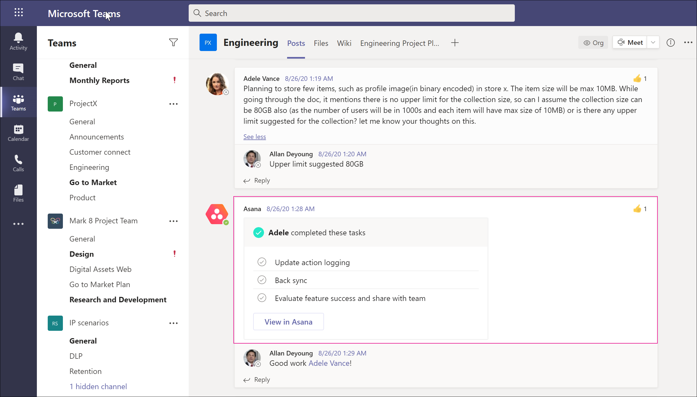

# <a name="conduct-an-ediscovery-investigation-of-content-in-microsoft-teams"></a>Microsoft Teams のコンテンツに対して電子情報開示の調査を行う

多くの場合、大企業は、すべての電子的に保存された情報 (ESI) の提出を要求する高いペナルティ訴訟手続きにさらされます。 Microsoft Teamsコンテンツは、電子情報開示調査中に検索して使用できます。

## <a name="overview"></a>概要

すべてのMicrosoft Teams 1:1 またはグループ チャットは、それぞれのユーザーのメールボックスにジャーナルされます。 すべての標準チャネル メッセージは、チームを表すグループ メールボックスにジャーナルされます。 標準チャネルでアップロードされたファイルは、SharePoint Online および OneDrive for Business の電子情報開示機能の下で扱OneDrive for Business。

プライベート チャネルでのメッセージとファイルの電子情報開示 [は、](private-channels.md) 標準チャネルとは異なる方法で動作します。 詳細については、「プライベート チャネルの [電子情報開示」を参照してください](#ediscovery-of-private-channels)。

すべてのコンテンツTeams eDiscoverable ではありません。 次の表は、Microsoft 電子情報開示ツールを使用して検索できるコンテンツ タイプを示しています。

| コンテンツの種類 | eDiscoverable | 備考 |
|:--- | :--- |:--- |
|オーディオ録音 | いいえ | |
|カードの内容|はい|詳細については [、「カードコンテンツを検索する](#search-for-card-content) 」を参照してください。|
|チャット リンク | はい | |
|チャット メッセージ | はい |これには、Teams チャネルのコンテンツ、1 対 1 のチャット、1:N グループ チャット、ゲスト ユーザー参加者とのチャットが含まれます。  |
|コード スニペット | いいえ | |
|編集されたメッセージ | はい | ユーザーが保留の場合、以前のバージョンの編集されたメッセージも保持されます。 |
|絵文字、GIF、ステッカー | はい | |
|インライン 画像 | はい | |
|IM 会話を会議する | はい | |
|会議メタデータ<sup>1</sup> | はい |  |
|チャネルの名前 | いいえ | |
|プライベート チャネル メッセージ | はい | |
|引用符 | はい | 引用符で囲まれたコンテンツは検索可能です。 ただし、検索結果は、コンテンツが引用されたというわけではありません。 |
|反応 (例: Likes、ハート、その他の反応) | いいえ | |
|件名 | はい | |
|テーブル | はい | |
|フィード通知 | いいえ | |
|||

<sup>1 会議</sup> (および通話) メタデータには、次が含まれます。

- 会議の開始時刻と終了時刻、および期間
- 各参加者の会議への参加と退出のイベント
- VOIP 参加/通話
- 匿名結合
- フェデレーション ユーザー参加
- ゲスト ユーザー参加

  この画像は、会議メタデータの例を示しています。

  > [!div class="mx-imgBorder"]
  > 

会議中の参加者間の IM 会話の例を次に示します。


> [!div class="mx-imgBorder"]
> 

電子情報開示調査の実施の詳細については、「Core eDiscovery の概要 [」を参照してください](/microsoft-365/compliance/get-started-core-ediscovery)。

Microsoft Teams電子情報開示のエクスポート出力に、データが IM または会話Excel表示されます。 ファイルをエクスポートした `.pst` 後、Outlookファイルを開き、それらのメッセージを表示できます。

チームの .pst ファイルを表示すると、すべての会話が [会話履歴] の [チーム チャット] フォルダーに保持されます。 メッセージのタイトルには、チーム名とチャネル名が含まれている。 たとえば、次の図は、製造仕様チームの Project 7 標準チャネルにメッセージを送信した Bob からのメッセージを示しています。


ユーザーのメールボックス内のプライベート チャットは、[会話履歴] の [チーム チャット] フォルダーに保存されます。

## <a name="ediscovery-of-private-channels"></a>プライベート チャネルの電子情報開示

プライベート チャネルで送信されたメッセージのレコードは、グループのメールボックスではなく、すべてのプライベート チャネル メンバーのメールボックスに配信されます。 レコードのタイトルは、送信元のプライベート チャネルが示されるように書式設定されています。

各プライベート チャネルには、親チーム サイトとは別の独自の SharePoint サイトが用意されています。プライベート チャネル内のファイルは、親チームとは独立して管理されます。

Teamsは、チーム内の 1 つのチャネルの電子情報開示検索をサポートしないので、チーム全体を検索する必要があります。 プライベート チャネル内のコンテンツの電子情報開示検索を実行するには、チーム全体、プライベート チャネルに関連付けられているサイト コレクション (ファイルを含める)、プライベート チャネル メンバーのメールボックス (メッセージを含める) を検索します。

次の手順を使用して、電子情報開示検索に含めるプライベート チャネル内のファイルとメッセージを識別します。

### <a name="include-private-channel-files-in-an-ediscovery-search"></a>電子情報開示検索にプライベート チャネル ファイルを含める

これらの手順を実行する前に、SharePoint Online Management Shell をインストールし、SharePoint [Online に接続します](/powershell/sharepoint/sharepoint-online/connect-sharepoint-online)。

1. 次のコマンドを実行して、チーム内のプライベート SharePointに関連付けられているすべてのサイト コレクションの一覧を取得します。

    ```PowerShell
    Get-SPOSite
    ```

2. 次の PowerShell スクリプトを実行して、チーム内のプライベート チャネルSharePoint関連付けられているすべてのサイト コレクション URL と親チーム グループ ID の一覧を取得します。

    ```PowerShell
    $sites = get-sposite -template "teamchannel#0"
    foreach ($site in $sites) {$x= get-sposite -identity $site.url -detail; $x.relatedgroupID; $x.url}
    ```

3. 各チームまたはグループ ID について、次の PowerShell スクリプトを実行して、関連するすべてのプライベート チャネル サイトを識別します。$groupID はチームのグループ ID です。

    ```PowerShell
    $sites = get-sposite -template "teamchannel#0"
    $groupID = "e8195240-4a70-4830-9106-80193cf717cb"
    foreach ($site in $sites) {$x= Get-SpoSite -Identity $site.url -Detail; if ($x.RelatedGroupId -eq $groupID) {$x.RelatedGroupId;$x.url}}
    ```

### <a name="include-private-channel-messages-in-an-ediscovery-search"></a>電子情報開示検索にプライベート チャネル メッセージを含める

これらの手順を実行する前に、PowerShell モジュールの最新バージョンが[インストールTeams確認](teams-powershell-overview.md)してください。

1. 次のコマンドを実行して、チーム内のプライベート チャネルの一覧を取得します。

    ```PowerShell
    Get-TeamChannel -GroupId <GroupID> -MembershipType Private
    ```

2. 次のコマンドを実行して、プライベート チャネル メンバーの一覧を取得します。

    ```PowerShell
    Get-TeamChannelUser -GroupId <GroupID> -DisplayName "Engineering" -Role Member
    ```

3. 電子情報開示検索クエリの一部として、チーム内の各プライベート チャネルのすべてのメンバーの [メールボックスを含める](/microsoft-365/compliance/search-for-content-in-core-ediscovery)。

## <a name="search-for-content-for-guest-users"></a>ゲスト ユーザーのコンテンツを検索する

電子情報開示ツールを使用して、組織内のゲスト Teams関連するコンテンツを検索できます。 Teamsに関連付けられているチャット コンテンツは、クラウドベースの保存場所に保持され、電子情報開示を使用して検索できます。 これには、ゲスト ユーザーが組織内の他のユーザーと参加者である 1:1 と 1:N のチャット会話のコンテンツの検索が含まれます。 ゲスト ユーザーが参加者であるプライベート チャネル メッセージを検索し、ゲスト *と* ゲスト チャットの会話でコンテンツを検索することもできます。この会話では、参加者はゲスト ユーザーのみです。

ゲスト ユーザーのコンテンツを検索するには:

1. Connect Azure AD PowerShell にアクセスします。 手順については、「PowerShell を使用したConnect」の「Azure Active Directory PowerShell での[Connect」Microsoft 365を参照してください](/microsoft-365/enterprise/connect-to-microsoft-365-powershell#connect-with-the-azure-active-directory-powershell-for-graph-module)。 前のトピックの手順 1 と手順 2 を必ず完了してください。

2. Azure AD PowerShell に正常に接続したら、次のコマンドを実行して、組織内のすべてのゲスト ユーザーのユーザー プリンシパル名 (UPN) を表示します。 手順 4 で検索を作成するときに、ゲスト ユーザーの UPN を使用する必要があります。

   ```powershell
   Get-AzureADUser -Filter "userType eq 'Guest'" -All $true | FL UserPrincipalName
   ```

   > [!TIP]
   > コンピューターの画面にユーザー プリンシパル名の一覧を表示する代わりに、コマンドの出力をテキスト ファイルにリダイレクトできます。 これを行うには、前のコマンド `> filename.txt` に を追加します。 ユーザー プリンシパル名を持つテキスト ファイルは、現在のフォルダーに保存されます。

3. 別のウィンドウWindows PowerShell、Security & Compliance Center PowerShell に接続します。 手順については、「Security [Connect Compliance Center PowerShell &」を参照してください](/powershell/exchange/connect-to-scc-powershell)。 多要素認証を使用する場合と接続せずに接続できます。

4. 次のコマンドを実行して、指定されたゲスト ユーザーが参加者だったすべてのコンテンツ (チャット メッセージやメール メッセージなど) を検索するコンテンツ検索を作成します。

   ```powershell
   New-ComplianceSearch <search name> -ExchangeLocation <guest user UPN>  -AllowNotFoundExchangeLocationsEnabled $true -IncludeUserAppContent $true
   ```

   たとえば、ゲスト ユーザー Sara Davis に関連付けられているコンテンツを検索するには、次のコマンドを実行します。

   ```powershell
   New-ComplianceSearch "Sara Davis Guest User" -ExchangeLocation "sara.davis_hotmail.com#EXT#@contoso.onmicrosoft.com" -AllowNotFoundExchangeLocationsEnabled $true -IncludeUserAppContent $true
   ```

    PowerShell を使用してコンテンツ検索を作成する方法の詳細については [、New-ComplianceSearch に関するページを参照してください](/powershell/module/exchange/new-compliancesearch)。

5. 次のコマンドを実行して、手順 4 で作成したコンテンツ検索を開始します。

   ```powershell
   Start-ComplianceSearch <search name>
   ```

6. に移動し [https://compliance.microsoft.com](https://compliance.microsoft.com) 、[すべてのコンテンツ検索 **を表示]**  >  **をクリックします**。

7. 検索の一覧で、手順 4 で作成した検索を選択して、フライアウト ページを表示します。

8. フライアウト ページでは、次の操作を行います。

   - [ **結果の表示]** をクリックして検索結果を表示し、コンテンツをプレビューします。

   - [クエリ] **フィールドの横** にある [編集] **をクリック** して編集し、検索を再実行します。 たとえば、検索クエリを追加して結果を絞り込むなどです。

   - [結果 **のエクスポート]** をクリックして、検索結果をエクスポートしてダウンロードします。

## <a name="search-for-card-content"></a>カードコンテンツを検索する

Teams チャネル、1 対 1 のチャット、1xN チャットのアプリによって生成されたカード コンテンツはメールボックスに格納され、検索できます。 カード *は* 、短いコンテンツの UI コンテナーです。 カードには複数のプロパティと添付ファイルを含め、カードアクションをトリガーできるボタンを含めることができます。 詳細については、「カード」を [参照してください。](/microsoftteams/platform/task-modules-and-cards/what-are-cards)

他のTeamsコンテンツと同様に、カードコンテンツが格納される場所は、カードが使用された場所に基づいて行います。 チャネルで使用されるカードのTeamsは、グループ メールボックスTeams保存されます。 1 対 1 および 1xN のチャットのカード コンテンツは、チャット参加者のメールボックスに保存されます。

カードコンテンツを検索するには、 または 検索条件 `kind:microsoftteams` を `itemclass:IPM.SkypeTeams.Message` 使用します。 検索結果を確認すると、Teams チャネル内のボットによって生成されたカード コンテンツは **、Sender/Author** メール プロパティとして として設定されます。ここでは、カード コンテンツを生成したアプリの名前です `<appname>@teams.microsoft.com` `appname` 。 カードコンテンツがユーザーによって生成された場合 **、Sender/Author** の値はユーザーを識別します。

コンテンツ検索結果でカードコンテンツを表示すると、そのコンテンツがメッセージの添付ファイルとして表示されます。 添付ファイルの名前 `appname.html` は です。 `appname` ここでは、カードコンテンツを生成したアプリの名前です。 次のスクリーンショットは、(Asana という名前のアプリの) カード コンテンツが検索の結果Teamsに表示される方法を示しています。

**Teams 内のカードのTeams**



**検索結果のカード コンテンツ**
  


> [!NOTE]
> この時点でカードコンテンツの画像を検索結果に表示するには (前のスクリーンショットのチェックマークなど)、(検索結果の表示に使用したのと同じブラウザー セッションの別のタブにある) Teams にサインインする必要があります。 https://teams.microsoft.com) それ以外の場合は、画像プレースホルダーが表示されます。

## <a name="advanced-ediscovery"></a>Advanced eDiscovery

一部Microsoft Teamsは、ワークフロー を使用して検索[および保持Advanced eDiscoveryできます](/microsoft-365/compliance/overview-ediscovery-20)。 電子情報開示は、さまざまな検索、保留、エクスポート機能を提供しますが、Advanced eDiscovery では、コンプライアンス管理者はデータ ソースを識別し、その内容を分析するためのより多くのツールを提供します。

### <a name="advanced-ediscovery-custodian-workflow-for-teams-content"></a>Advanced eDiscoveryコンテンツの管理Teamsワークフロー

管理人は、さまざまなチームのメンバーである可能性があります。 これらの管理者にTeamsコンテンツをキャプチャできます。 カストディアン ワークフローの手順については、「ケースに管理者を追加する[」をAdvanced eDiscoveryしてください](/microsoft-365/compliance/add-custodians-to-case)。

管理人を追加したら、[次へ] ボタン **をクリック** し、[追加] **ボタンをクリック** します。 ウィンドウが表示され、追加の場所を選択するように求めるメッセージが表示されます。このウィンドウには、管理人のすべてのメンバーシップと、そのデータに対応する SharePoint サイトの場所が表示されます。 これらのすべてのデータ ソースとチームから、電子情報開示に使用するコンテンツを選択し、そのユーザーと、特定したすべてのデータ ソースを保留にできます。

ユーザーのコンテンツを含めるか、ExchangeコンテンツOneDrive、または両方を含めるかを選択できます。 Exchangeには、ユーザーのメールボックス内のすべてのアプリケーション コンテンツ (メール、メールボックスに格納されている Teams コンテンツなど) が含まれます。 OneDrive コンテンツには、ユーザーのコンテンツだけでなく、1 対 1 のチャット、1:N チャット、チャットで共有されるファイルなど、OneDrive に保存されている Teams のすべてのコンテンツも含まれます。

また、管理人がメンバーであるチームを関連付け、管理人がアクセスできるチャネル チャット メッセージとファイルを含めることもできます。 さらに、他のすべてのチームを管理人に関連付けできます。

> [!NOTE]
> プライベート チャネルでのメッセージとファイルの電子情報開示 [は、](private-channels.md) 標準チャネルとは異なる方法で動作します。 詳細については、「プライベート チャネルの [電子情報開示」を参照してください](#ediscovery-of-private-channels)。

### <a name="placing-a-data-source-on-hold"></a>データ ソースを保留する

管理人として指定する特定のユーザーがいない場合は、データ ソース全体を保留にできます。 保留の詳細については、「Manage [holds in Advanced eDiscovery 」を参照してください](/microsoft-365/compliance/managing-holds)。

コンテンツの保留リストTeams、保留リストに含めるすべての場所を選択できます。 ユーザーがコンテンツを削除または変更している場合でも、保留は、そのコンテンツのすべての以前のバージョンのコピーを保持します。

オプションのクエリを使用して、キーワード、日付範囲、作成者、その他の多くの条件に基づいて保留の条件を設定することもできます。 キーワードを指定しない場合、そのデータ ソースからのすべてが保留の対象です。

### <a name="advanced-ediscovery-searches"></a>Advanced eDiscovery検索

Teamsコンテンツを検索できます。 検索の詳細については、「ケースのデータ[を収集する」を参照Advanced eDiscovery。](/microsoft-365/compliance/collecting-data-for-ediscovery) 1 つのメッセージが検索クエリと一致する場合、検索は会話全体を返します。

検索クエリを作成するときに、既に選択しているすべてのソースが検索されるカストディアンを選択できます。 また、ユーザーにマップされていないサイトTeams、管理されていないソースを検索できます。 オプションのクエリは、コンテンツ内で検索を絞り込むTeamsもあります。

検索を作成して選択すると、選択した検索に対して実行できる追加の詳細とアクションがウィンドウに表示されます。 [統計情報]ボタンをクリックすると、場所の種類、コンテンツの元のソース、コンテンツがグループ メールボックス、個々のユーザー メールボックス、または SharePoint サイトに含かどうかに応じて内訳を含む、検索に関する統計情報を表示できます。 そのため、検索結果にどのソースが影響を受け取ったかの内訳を確認できます。 また、クエリ ビュー **を** 使用して、結果にどのキーワードが影響を受け取ったのか確認できます。

検索を完了した後、[結果を追加してレビューセット] ボタンをクリックし、レビュー セットに追加できます。 レビュー セットの詳細については、この記事の後半の「レビュー セットの管理[」](/microsoft-365/compliance/managing-review-sets)および「Advanced eDiscoveryのワークフロー [」](#review-sets-workflow)を参照してください。

#### <a name="normal-review-sets-and-conversation-review-sets"></a>通常のレビュー セットと会話レビュー セット

レビュー セットに検索を追加するときに、通常のレビュー セットまたは会話レビュー セットから選択できます。

通常のレビュー セットはエクスポートに似ています。コンテンツの個々 `.msg` のファイルTeams表示し、基本的なビューでコンテンツを表示します。 通常、他のソフトウェア ツールを使用して後でファイルを再処理する場合は、通常のレビュー セットを使用します。

会話レビュー セットは、会話のより直感的でスレッド化されたビューを提供します。関連するメッセージが適切な順序で一緒に表示されます。

> [!div class="mx-imgBorder"]
> 

redaction などの機能は、両方の種類のレビュー セットで使用できます。 レビュー セットの詳細については、「高度な電子情報開示で [会話を確認する」を参照してください](/microsoft-365/compliance/conversation-review-sets)。

#### <a name="collection-options"></a>コレクション オプション

レビュー セットに追加する場合、ウィンドウの [コレクション オプション]セクションのチェック ボックスとして、[会話の取得オプション] や [会話] Teams **があります**。 これらのオプションを有効にした場合、レビュー セットTeams含む個々のメッセージも、コンテキストのためにそれらを囲む追加のメッセージと一緒に表示されます。 たとえば、クエリが特定であり、結果として返されるメッセージが 1 つしか返されていない場合、これらのオプションを有効にすると、クエリに一致したメッセージの後に続く複数のメッセージも返されます。

クエリに一致するメッセージに対して追加のメッセージがコンテキストを提供するかどうかを判断するには、多くの論理条件が使用されます。 たとえば、Teamsの場合、これらのオプションを有効にすると、メッセージがスレッド化される方法のために、親メッセージとすべての子メッセージが取得されます。

メッセージのタイム スタンプもチェックされます。 メッセージがクエリと一致する場合、4 時間以内にメッセージの前に表示される隣接するメッセージ、または 4 時間以内に続く隣接するメッセージは会話の一部と見なされ、結果にも含まれます。

検索クエリに一致するコンテキスト メッセージを確実に返す必要がある場合は、これらのオプションを使用する必要があります。 すべてのコンテンツを収集するか、検索の日付範囲を広くして、クエリの結果として返されるメッセージを追加できます。

### <a name="review-sets-workflow"></a>レビュー セットのワークフロー

既存のレビュー セットを表示するか、[レビュー セット] タブをクリックして新しいレビュー セット **を作成** できます。レビュー セットの詳細については、レビュー セットの管理に関するページ [をAdvanced eDiscovery。](/microsoft-365/compliance/managing-review-sets)

ドキュメントに加えて、メール、Teams、Yammer、その他のコンテンツをレビュー セットに追加できます。 レビュー セット内では、コンテンツの検索やカスタム クエリの作成など、他のコンテキストで実行できる操作の多くを実行できます。 これらの操作は、レビュー セットに追加されたアイテムにのみ適用されます。

[ **レビュー セットの** 管理] ボタンには、分析、概要レポート、追加されたロード セットの数などの追加オプションが表示されます。

データの視覚エフェクトとグラフにアクセスするには、右上にある [ **個々の結果** \> **] [検索プロファイル** ] ビューをクリックします。 これらのグラフのくさびをクリックすると、クエリを実行するコンテンツの種類を対話形式で選択できます。 たとえば、コンテンツのクエリのみを実行Teamsできます。 これらのクエリは、手動で書き込むクエリを保存するのと同じ方法で保存することもできます。

#### <a name="summary-view-text-view-and-annotate-view"></a>概要ビュー、テキスト ビュー、注釈ビュー

レビュー セット内の Teams 会話をクリックすると、[概要] ビューが表示されます。このビューには、Teams 会話全体が個別に操作できるメッセージの一覧として表示されます。 メッセージの右側にある下向き矢印をクリックすると、メッセージの詳細を表示したり、個々のファイルをダウンロードしたりできるコンテキスト メニューが表示 `.msg` されます。 メッセージの詳細をクリックすると、メタデータの概要またはメッセージの完全なメタデータが表示されます。

PDF をダウンロードするには、概要ビューの右上にあるダウンロード ボタンをクリックします。

[テキスト **ビュー] タブ** をクリックして、会話の抽出されたテキストのプレーンテキスト ビュー Teamsします。 このプレーン テキスト コンテンツはエクスポートに適しています。他のソフトウェア ツールを使用して簡単に作業できます。

[注釈ビュー] **タブをクリックして** 注釈機能にアクセスします。 このタブには、会話に似た形式でコンテンツがTeams表示されますが、編集するための追加のオプションも表示されます。 鉛筆ツールを使用して、メモを作成したり、メッセージに描画したり、編集のためにきめ細かくスクラッチすることができます。 領域を **黒くして** "編集" としてマークする四角形を描画するために使用できる領域編集ツールもあります。

ユーザー間のスレッド化された会話用に変更されたファイルの例を次に示します。

> [!div class="mx-imgBorder"]
> 

[注釈ビュー] タブ **の** 下部には、[ドキュメント **の** タグ付け] ボタンが表示され、タグ付けパネルが表示されます。 このパネル内で、会話内のすべてのメッセージにタグTeamsできます。 会話に "興味深いアイテム" が含まれているかどうか、エクスポートに含める必要があるかどうか、さらにレビューが必要かどうかなど、応答型または応答性の高くない、特権付きまたは特権を持たない会話としてラベルを付けできます。 他のカスタマイズ可能なタグを管理して適用することもできます。

#### <a name="action-menu"></a>[アクション] メニュー

レビュー セット ウィンドウで、[アクション のエクスポート] をクリックしてコンテンツ **をエクスポート** \> **できます**。 エクスポート時には、多くのオプションを使用できます。

すべてのメッセージのすべてのメタデータを含むファイルをエクスポートするには、Teamsをクリックして [ファイルの読み込み **] チェック ボックスをオン** にします。 コンテンツに適用したタグをファイルに含めるには、クリックして [タグ] チェック ボックス **をオン** にします。

[ネイティブ **ファイル] オプションを** 使用して、ネイティブ形式でファイルをエクスポートします。 会話を 1 つのファイルとしてエクスポートするか、個別の個別のファイル内のすべてのチャット メッセージとしてエクスポートすることができます。

[ **テキスト ファイル]** オプションでは、テキスト形式のコンテンツを保存できます。 レビュー セット内の Teams 会話のプレーン テキスト ビューを取得する方法の詳細については、上の「概要ビュー、テキスト ビュー、注釈ビュー」[を参照](#summary-view-text-view-and-annotate-view)してください。

前の「概要ビュー、テキスト ビュー、注釈ビュー」セクション [](#summary-view-text-view-and-annotate-view)で説明したように、コンテンツに編集を適用した場合は、[編集したネイティブを変換された **PDF** に置き換える] オプションを選択して、ネイティブ ファイルを PDF で変換されたコピーに置き換えます。

Microsoft 提供の Azure Blob Storage コンテナーにエクスポートするか、独自の Azure Blob Storage コンテナーを指定できます。

エクスポート プロセスを開始する準備ができたら、[エクスポート] ボタン **をクリック** します。 Azure BLOB [ストレージ コンテナーに](/microsoft-365/compliance/download-export-jobs) アクセスし、エクスポートが完了した後にエクスポートされたコンテンツをダウンロードする方法の詳細については、「エクスポート ジョブのダウンロード」を参照してください。

> [!NOTE]
> エクスポートには長い時間がかかる場合があります。 エクスポート プロセスの状態を追跡するには、[レビューセット] タブを終了し、[エクスポート] タブ **をクリック** します。

## <a name="related-topics"></a>関連トピック

- [eDiscovery in Microsoft 365](/microsoft-365/compliance/ediscovery)
- [Teams PowerShell の概要](teams-powershell-overview.md)