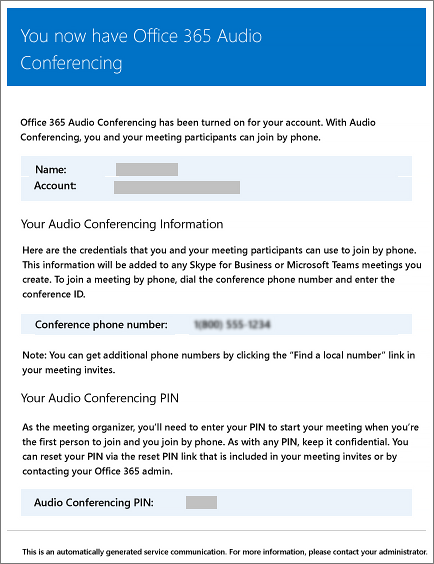

# Microsoft Teams で設定を変更したときにユーザーに送信されるメール

Microsoft を電話会議プロバイダーとして使用する電話[会議用に有効になっ](set-up-audio-conferencing-in-teams.md)ているユーザーには、メールが自動的に送信されます。

既定では、電話会議が有効になっているユーザーに送信されるメールには4種類のメールが用意されています。 ただし、ユーザーに送信されるメールの数を制限する場合は、オフにすることができます。 Office 365 の電話会議では、次の場合にユーザーのメールにメールが送信されます。

- **電話会議ライセンスが割り当てられているか、電話会議プロバイダーを Microsoft に変更する場合。**

     このメールには、会議 ID、会議用の既定の会議電話番号、ユーザー用の電話会議の PIN、およびユーザーの既存の会議を更新するために使用される Skype for Business Online Meeting Update Tool を使用するための手順とリンクが含まれています。 「 [Microsoft Teams ライセンスを割り当てる](assign-teams-licenses.md)」または「 [microsoft を電話会議プロバイダーとして割り当てる](/SkypeForBusiness/audio-conferencing-in-office-365/assign-microsoft-as-the-audio-conferencing-provider)」を参照してください。

    > [!NOTE]
    > 組織で動的会議 Id が有効になっている場合、スケジュールされているすべてのユーザーの会議には、固有の会議 Id が割り当てられます。 [組織内の電話会議の動的 id](/skypeforbusiness/audio-conferencing-in-office-365/reset-a-conference-id-for-a-user)を設定することができます。 

    このメールの例を次に示します。

     

    ライセンスの詳細については、「 [Microsoft Teams のアドオンライセンス](teams-add-on-licensing/microsoft-teams-add-on-licensing.md)」を参照してください。

- **会議 ID またはユーザーの既定の会議の電話番号が変更されます。**

    このメールには、会議 ID、既定の会議電話番号、およびユーザーの既存の会議を更新するために使用される Skype for Business Online Meeting 更新ツールを使用するための手順とリンクが含まれています。 ただし、このメールには、ユーザーの電話会議の PIN は含まれていません。 「[ユーザーの会議通話 ID をリセットする](reset-a-conference-id-for-a-user-in-teams.md)」を参照してください。

    このメールの例を次に示します。

     

- **ユーザーの電話会議の PIN がリセットされます。**

    このメールには、開催者の電話会議の PIN、既存の会議 ID、ユーザー用の既定の会議電話番号が含まれています。 「[電話会議の PIN をリセットする](reset-the-audio-conferencing-pin-in-teams.md)」を参照してください。
    
     このメールの例を次に示します。
    
     
  
- **ユーザーのライセンスが削除されるか、電話会議プロバイダーが Microsoft から別のプロバイダーまたは [なし] に変更されたとき。**

    この問題は、電話**会議**のライセンスがユーザーから削除された場合、または電話会議プロバイダーを **[なし**] に設定した場合に発生します。

    「[一般法人向け Office 365 ライセンスの割り当てまたは解除方法](https://support.office.com/article/997596b5-4173-4627-b915-36abac6786dc)」をご覧ください。

    このメールの例を次に示します。

     

> [!NOTE]
> [!INCLUDE [updating-admin-interfaces](includes/updating-admin-interfaces.md)]

## 送信されたメールメッセージに変更を加える

ユーザーに自動的に送信されるメールに変更を加えることができます。 既定では、メールの送信者は Office 365 から送信されますが、Windows PowerShell を使用して表示名を変更することができます。 詳細については、[Microsoft Teams PowerShell のリファレンス](https://docs.microsoft.com/powershell/module/teams/?view=teams-ps)をご覧ください。

## メールを送信したくない場合はどうすればよいですか?

ユーザーへのメールの送信を無効にすると、ユーザーにライセンスが割り当てられてもメールは送信されません。 この場合、会議 ID、既定の会議電話番号、さらに重要なのは、電話会議の PIN はユーザーに送信されません。 この問題が発生した場合は、個別のメールを送信するか、または電話をかけて、ユーザーに通知する必要があります。

既定では、メールはユーザーに送信されますが、電話会議のメールを受信しないようにするには、Microsoft Teams または Windows PowerShell を使用します。 

 **Microsoft Teams 管理センターの使用**

1. 左側のナビゲーションで、[**会議**]  >  [**会議ブリッジ**] に移動します。 

2. [**会議ブリッジ**] ページの最上部で、[**ブリッジの設定**] をクリックします。 

3. [**ブリッジの設定**] ペインで、[**ダイヤルイン設定が変わると、ユーザーに自動的に電子メールが送信されます**] を有効または無効にします。

4. **[保存]** をクリックします。

> [!Note]
> [!INCLUDE [updating-admin-interfaces](includes/updating-admin-interfaces.md)]

**Windows PowerShell を使用する**

詳細については、[Microsoft Teams PowerShell のリファレンス](https://docs.microsoft.com/powershell/module/teams/?view=teams-ps)をご覧ください。

## Windows PowerShell の詳細情報

既定では、メールの送信者は Office 365 から送信されますが、Windows PowerShell を使用してメールアドレスと表示名を変更することができます。 

Windows PowerShell で行うのは、ユーザーを管理し、ユーザーに何を許可して何を禁止するかを管理することです。Windows PowerShell を利用すると、Office 365 の管理を 1 か所で行うことができるので、複数のタスクを担当する管理者の日常業務を単純化できます。Windows PowerShell の使用を開始するには、次のトピックを参照してください。

  - [Office 365 PowerShell を使用する必要がある理由](https://go.microsoft.com/fwlink/?LinkId=525041)

  - [Windows PowerShell で Office 365 を管理するための最善の方法](https://go.microsoft.com/fwlink/?LinkId=525142)

Windows PowerShell の詳細については、「[Microsoft Teams PowerShell のリファレンス](https://docs.microsoft.com/powershell/module/teams/?view=teams-ps)」をご覧ください。

## 関連トピック

[電話会議の設定が変更されたときのメールの自動送信を有効または無効にする](enable-or-disable-sending-emails-when-their-settings-change-in-teams.md)

[電話会議の情報が記載されたメールをユーザーに送信する](send-an-email-to-a-user-with-their-dial-in-information-in-teams.md)
