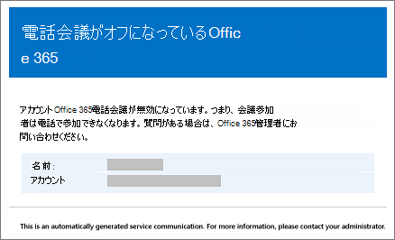

# Microsoft Teams で設定を変更したときにユーザーに送信されるメールEmails sent to users when their settings change in Microsoft Teams

Microsoft を電話会議プロバイダーとして使用して[電話会議を利用できる](set-up-audio-conferencing-in-teams.md)ようになっているユーザーに、メールが自動的に送信されます。Emails will be automatically sent to users who are [enabled for Audio Conferencing](set-up-audio-conferencing-in-teams.md) using Microsoft as the audio conferencing provider.

既定では、電話会議を利用できるユーザーに対して送信されるメールには、4 つの種類があります。By default, there are four types of email that will be sent to your users who are enabled for Audio Conferencing. ただし、ユーザーに送信されるメールの数を制限する場合は、この設定をオフにすることができます。However, if you want to limit the number of emails sent to users, you can turn it off. Office 365 の電話会議は、次の場合にユーザーにメールを送信します。Audio Conferencing in Office 365 will send email to your users' email when:

- **電話会議のライセンスが割り当てられているか、電話会議プロバイダーを Microsoft に変更している場合。****An Audio Conferencing license is assigned to them or when you are changing the audio conferencing provider to Microsoft.**

     このメールには会議 ID、既定の電話会議の電話番号、ユーザーの電話会議 PIN、およびユーザーのために既存の会議を更新するために使用される Skype for Business Online Meeting Update Tool の操作手順とリンクが記載されています。This email includes the conference ID, the default conference phone number for the meetings, the audio conferencing PIN for the user, and the instructions and link to use the Skype for Business Online Meeting Update Tool that is used to update existing meetings for the user. [マイクロソフトのチームを割り当てるライセンス](assign-teams-licenses.md)または[オーディオ会議プロバイダーとしての Microsoft の割り当て](/SkypeForBusiness/audio-conferencing-in-office-365/assign-microsoft-as-the-audio-conferencing-provider)を参照してください。See [Assign Microsoft Teams licenses](assign-teams-licenses.md) or [Assign Microsoft as the audio conferencing provider](/SkypeForBusiness/audio-conferencing-in-office-365/assign-microsoft-as-the-audio-conferencing-provider).

    > [!NOTE]
    > 所属する組織で、動的な会議 ID が有効になっている場合、すべてのユーザーの会議に固有の会議 ID が設定されます。If your organization has been enabled for dynamic conference IDs, all of a user's meetings that they schedule will have unique conference IDs. [組織での電話会議の動的 ID ](/skypeforbusiness/audio-conferencing-in-office-365/reset-a-conference-id-for-a-user)をセットアップすることができます。You can set up [Audio Conferencing dynamic IDs in your organization](/skypeforbusiness/audio-conferencing-in-office-365/reset-a-conference-id-for-a-user). 

    このメールの例を次に示します。Here is an example of this email:

     

    ライセンスの詳細については、[マイクロソフトのチームのアドオンのライセンス](teams-add-on-licensing/microsoft-teams-add-on-licensing.md)を参照してください。To find out more about licensing, see [Microsoft Teams add-on licensing](teams-add-on-licensing/microsoft-teams-add-on-licensing.md).

- **ユーザーの会議 ID または既定の電話会議の電話番号が変更された場合。****The conference ID or default conference phone number of a user changes.**

    このメールには会議 ID、既定の電話会議の電話番号、およびユーザーのために既存の会議を更新するために使用される Skype for Business Online Meeting Update Tool の操作手順とリンクが記載されています。This email contains the conference ID, default conference phone number, and the instructions and link to use the Skype for Business Online Meeting Update Tool that is used to update existing meetings for the user. ただし、このメールにはユーザーの電話会議 PIN は含まれていません。But this email doesn't include the user's audio conferencing PIN. 「[ユーザーのために会議 ID をリセットする](reset-a-conference-id-for-a-user-in-teams.md)」をご覧ください。See [Reset a conference ID for a user](reset-a-conference-id-for-a-user-in-teams.md).

    このメールの例を次に示します。Here is an example of this email:

     

- **ユーザーの電話会議の PIN がリセットされる場合。****The audio conferencing PIN of a user is reset.**

    このメールには、ユーザーに向けた組織の電話会議 PIN、既存の会議 ID、および既定の電話会議の電話番号が記載されます。This email contains the organizer's audio conferencing PIN, the existing conference ID, and default conference phone number for the user. 「[電話会議の PIN をリセットする](reset-the-audio-conferencing-pin-in-teams.md)」をご覧ください。See [Reset the Audio Conferencing PIN](reset-the-audio-conferencing-pin-in-teams.md).
    
     このメールの例を次に示します。Here is an example of this email:
    
     
  
- **ユーザーのライセンスが削除されたか、電話会議プロバイダーが Microsoft から他のプロバイダーに変更または、なしに設定された場合****A user's license is removed or when audio conferencing provider changes from Microsoft to other provider or None.**

    これは、**電話会議**ライセンスがユーザーから削除された場合、ユーザーの電話会議プロバイダーを Microsoft からサードパーティの電話会議プロバイダーに変更する場合、またはプロバイダーを [**なし**] に設定する場合に発生します。This happens when the **Audio Conferencing** license is removed from a user or when changing the audio conferencing provider of a user from Microsoft to a third-party audio conferencing provider or when setting the provider to **None**. このメールには、ユーザーが Skype for Business Online Meeting Update Tool を使用して、既定の電話会議番号や会議 ID などの電話会議固有の情報を削除するための操作指示および情報が記載されています。This email contains the instructions and information for the user to use the Skype for Business Online Meeting Update Tool to remove audio conferencing specific information, such as the default conference phone number or conference ID.

    「[一般法人向け Office 365 ライセンスの割り当てまたは解除方法](https://support.office.com/article/997596b5-4173-4627-b915-36abac6786dc)」をご覧ください。See [Assign or remove licenses for Office 365 for business](https://support.office.com/article/997596b5-4173-4627-b915-36abac6786dc).

    このメールの例を次に示します。Here is an example of this email:

     

> [!NOTE]
> [!INCLUDE [updating-admin-interfaces](includes/updating-admin-interfaces.md)]

## ユーザーに送信されるメールのメッセージを変更するMake changes to the email messages that are sent to them

ユーザーに自動的に送信される電子メールには、変更を行うことができます。You can make changes to the email that is automatically sent to users. 既定では、電子メールの送信者は、Office 365 からなりますが、Windows PowerShell を使用して表示名を変更することができます。By default, the sender of the emails will be from Office 365, but you can change the display name using Windows PowerShell. 詳細については、[Microsoft Teams PowerShell のリファレンス](https://docs.microsoft.com/powershell/module/teams/?view=teams-ps)をご覧ください。See the [Microsoft Teams PowerShell reference](https://docs.microsoft.com/powershell/module/teams/?view=teams-ps) for more information.

## ユーザーにメールが送信されないようにする場合What if you don't want email to be sent to them?

ユーザーへのメールの送信を無効にすると、ユーザーにライセンスが割り当てられたときでもメールは送信されません。When you disable sending emails to users, email won't be sent even when a user gets assigned a license. この場合、会議 ID、既定の電話会議の電話番号、およびより重要であるユーザーの電話会議の PIN はユーザーに送信されません。In this case, the conference ID, default conferencing phone number, and, more importantly, their audio conferencing PIN won't be sent to the user. このような場合は、ユーザーに別個のメールを送信するか、電話をすることによって伝える必要があります。When this happens, you must tell the user by sending them a separate email or by calling them.

既定では、メールはユーザーに送信されますが、Microsoft Teams または Windows PowerShell を使用して、電話会議についてのメールをユーザーが受け取らないようにすることができます。By default, emails will be sent to your users, but if you want to prevent them from receiving email for audio conferencing, you can use Microsoft Teams or Windows PowerShell. 

 **、マイクロソフトのチーム管理センターを使用して** **Using the Microsoft Teams admin center**

1. 左側のナビゲーションで、[**会議**]  >  [**会議ブリッジ**] に移動します。In the left navigation, go to **Meetings** > **Conference Bridges**. 

2. [**会議ブリッジ**] ページの最上部で、[**ブリッジの設定**] をクリックします。At the top of the **Conference Bridges** page, click **Bridge settings**. 

3. [**ブリッジの設定**] ペインで、[**ダイヤルイン設定が変わると、ユーザーに自動的に電子メールが送信されます**] を有効または無効にします。In the **Bridge settings** pane, enable or disable **Automatically send emails to users if their dial-in settings change**.

4. [**保存**] をクリックします。Click **Save**.

> [!Note]
> [!INCLUDE [updating-admin-interfaces](includes/updating-admin-interfaces.md)]

**Windows PowerShell を使用する****Using Windows PowerShell**

詳細については、[Microsoft Teams PowerShell のリファレンス](https://docs.microsoft.com/powershell/module/teams/?view=teams-ps)をご覧ください。See the [Microsoft Teams PowerShell reference](https://docs.microsoft.com/powershell/module/teams/?view=teams-ps) for more information.

## Windows PowerShell の詳細情報Want to know more about Windows PowerShell?

既定では、メールの送信者は Office 365 ですが、Windows PowerShell を使用してメール アドレスと表示名を変更することができます。By default, the sender of the emails will be from Office 365, but you can change the email address and display name using Windows PowerShell. 

Windows PowerShell は、ユーザーと、ユーザーに許可されていることと許可されていないことを管理するためにあるということです。Windows PowerShell があれば、一元管理を使用して Office 365 を管理し、複数のタスクを抱えているときに、日常の仕事を簡素化することができます。Windows PowerShell を開始するには、これらのトピックを参照してください。Windows PowerShell is all about managing users and what users are allowed or not allowed to do. With Windows PowerShell, you can manage Office 365 using a single point of administration that can simplify your daily work when you have multiple tasks to do. To get started with Windows PowerShell, see these topics:

  - [Windows PowerShell で Office 365 を管理するための最善の方法Why you need to use Office 365 PowerShell](https://go.microsoft.com/fwlink/?LinkId=525041)

  - [Windows PowerShell で Office 365 を管理するための最善の方法Best ways to manage Office 365 with Windows PowerShell](https://go.microsoft.com/fwlink/?LinkId=525142)

Windows PowerShell の詳細については、「[Microsoft Teams PowerShell のリファレンス](https://docs.microsoft.com/powershell/module/teams/?view=teams-ps)」をご覧ください。For more information about Windows PowerShell, see the [Microsoft Teams PowerShell reference](https://docs.microsoft.com/powershell/module/teams/?view=teams-ps) for more information.

## 関連トピックRelated topics

[電話会議の設定が変更されたときのメールの自動送信を有効または無効にするEnable or disable sending emails when Audio Conferencing settings change](enable-or-disable-sending-emails-when-their-settings-change-in-teams.md)

[電話会議の情報が記載されたメールをユーザーに送信するSend an email to a user with their Audio Conferencing information](send-an-email-to-a-user-with-their-dial-in-information-in-teams.md)
