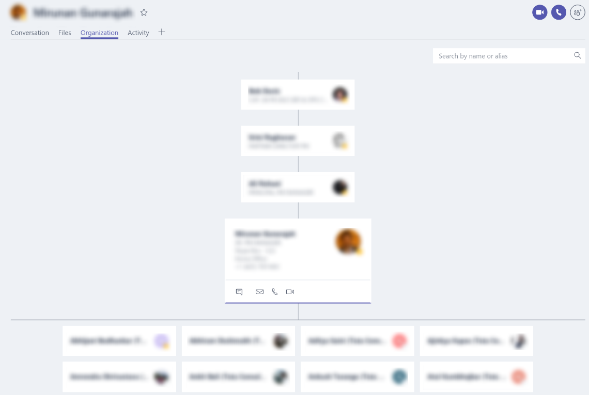
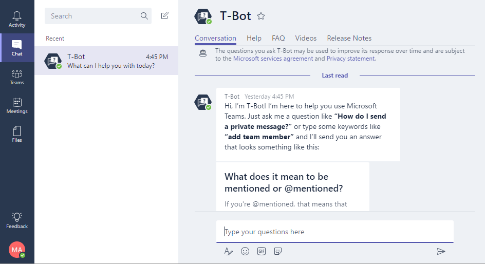
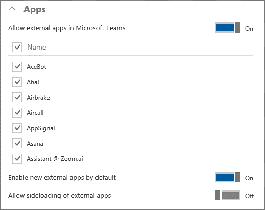

Office 365 を使用する組織で Microsoft Teams の機能を有効にするEnable Microsoft Teams features in your Office 365 organization
======================================================

Microsoft Teams には、テナント レベルで有効または無効にすることができる設定が複数あります。テナントで Teams を有効にすると、Teams が有効なすべてのユーザーにもテナント レベルの設定が継承されます。Microsoft Teams has multiple settings that can be enabled or disabled at the tenant level. With Teams enabled for the tenant, any user that is also enabled for Teams will inherit the settings from the tenant level.

Teams 内で Office 365 管理者が有効または無効にできる機能のリストを次に示します。Below is the list of features an Office 365 administrator can choose to enable or disable in Teams.

特に明記されていない場合を除き、オプションの規定値はオンです。Unless otherwise noted, the default value for an option is On.

> [!NOTE]
> Office 365 管理者はいつでも Office 365 管理センターを介して Microsoft Teams をオフにすることができます。Teams をオフにした場合でも、Microsoft Teams の有効なライセンスを所有するユーザーには Teams アプリ タイルがそのまま表示され続けます。ユーザーからライセンスを削除する方法について詳しくは、「[Microsoft Teams へのユーザー アクセスを管理する](user-access.md)」をご覧ください。Teams を無効にすると、Teams クライアントからのアクセスが遮断されます。ただし、SharePoint や OneDrive を介したファイルなど、その他のクライアントやサービスから利用できるデータには継続的に利用できます。チームを明示的に削除しない限り、すべてのデータはそのまま残ります。An Office 365 admin can turn off Microsoft Teams at any time in the Office 365 Admin center. Be aware that users with active Microsoft Teams licenses will continue to see the Teams app tile even if you turn off Teams. For details about how to remove licenses from users, see [Manage user access to Microsoft Teams](user-access.md). After Teams is disabled, access from the Teams client is blocked, but data available through other clients and services is still available, such as files via SharePoint and OneDrive. All data remains in place unless the teams are explicitly deleted.

テナント全体の設定Tenant-wide settings 
---------------------

[**テナント全体の設定**] で、[全般]、[電子メール統合]、[アプリ]、[Custom cloud storage (カスタム クラウド ストレージ)] のオプションをオンまたはオフに切り替えられます。In **Tenant-wide settings**, you can turn on or turn off options in General, Email integration, Apps, and Custom cloud storage.

### 全般General

[全般] セクションでは組織の次の設定を構成できます。The General section lets you configure the following settings for your organization:

> ![テナント全体にわたる設定の [全般] セクションのスクリーンショット。](media/Enable_Microsoft_Teams_features_in_your_Office_365_organization_image1.png)

-   **個人プロファイルに組織図を表示する:** この設定を有効にすると、組織図アイコンがユーザーの連絡先カードに表示されます。このアイコンをクリックすると、詳細な組織図が表示されます。**Show organizational chart in personal profile:** When this setting is enabled, it shows the organizational chart icon in the user’s contact card and when clicked, it displays the detailed organizational chart.

    ![ユーザーの連絡先カードの [組織図] アイコンのスクリーンショット。](media/Enable_Microsoft_Teams_features_in_your_Office_365_organization_image2.png)

    

-   **Microsoft Teams を所有していない受信者に対して Skype for Business を使用する:** この設定を有効にすると、Microsoft Teams のユーザーは組織内で Microsoft Teams が有効でないユーザーに対して Skype for Business 経由で連絡することができます。**Use Skype for Business for recipients who don’t have Microsoft Teams:** When this setting is enabled, it allows Microsoft Teams users to contact other users in the organization that are not enabled for Microsoft Teams via Skype for Business.

-   **T-Bot がプロアクティブにヘルプ メッセージに送るのを許可する:** この設定を有効にすると、T-Bot はプライベート チャット セッションを開始し、Microsoft Teams の使用に関するガイドを提供します。**Allow T-bot proactive help messages:** When this setting is enabled, T-bot will initiate a private chat session with users to guide them in using Microsoft Teams.

    

電子メール統合Email integration
-----------------

この機能をオンにすると、ユーザーはチャネル電子メール アドレスを使用して、Microsoft Teams のチャネルにメールを送信できるようなります。この操作は、ユーザーが所有するチームに属しているどのチャネルに対しても行えます。ユーザーのメールは、チーム メンバーに対して有効になっている追加のコネクタがあるチーム内の任意のチャネルにも送信できます。また、ユーザーにチャネル電子メール アドレスを作成する権限がない場合でも、権限のある他のユーザーがアドレスを作成すれば、そのアドレスに該当チャネルの \<その他アイコン\> メニューからアクセスできます。Turn this feature on so that users can send an email to a channel in Microsoft Teams, using the channel email address. Users can do this for any channel belonging to a team they own. Users can also send emails to any channel in a team that has adding connectors enabled for team members. And, even if a user doesn’t have permission to create a channel email address, if someone who does have permission creates that address, the user can access it from the \<more icon\> menu for that channel.

[電子メール統合] セクションでは組織の次の設定を構成できます。The Email integration section lets you configure the following settings for your organization:

   ![テナント全体の設定の [電子メール統合] セクションのスクリーンショット。](media/Enable_Microsoft_Teams_features_in_your_Office_365_organization_image5.png)

-   **ユーザーがチャネルにメールを送信するのを許可する:** 有効にすると、メール フックが有効に設定されます。ユーザーは Microsoft Teams のチャネルの電子メール アドレス宛に電子メールを送信することでチャネルにメッセージを投稿できるようになります。**Allow users to send emails to channels:** When enabled, mail hooks are enabled, and users can post messages to a channel by sending an email to the email address of Microsoft Teams channel.

> チャネルの電子メール アドレスを見つけるには、チャネル名の隣にある [**その他のオプション**] をクリックしてから [**電子メール アドレスの取得**] を選択します。To find the channel’s e-mail address, click **More options** next to the channel name and then select **Get email address**.

-   **送信者の制限一覧:** 送信者のドメインをさらに制限して、SMTP ドメインのみが Microsoft Teams チャネルに電子メールを送信できるようにします。**Restricted Senders List:** Senders domains can be further restricted to ensure that only allowed SMTP domains can send emails to the Microsoft Teams channels.

アプリApps
----

Microsoft Teams の [アプリ] は、チームが関心を持つツールとサービスをチャネルやチャットに統合するための優れたツールです。Apps in Microsoft Teams are a terrific way to integrate the tools and services your team cares about, right into any channel or chat.

[**アプリ**] セクションでは、組織の次の設定を構成できます。The **Apps** section lets you configure the following settings for your organization:

![[アプリ] セクションのスクリーンショット。](media/Enable_Microsoft_Teams_features_in_your_Office_365_organization_image6.png)

-   **Microsoft Teams の外部アプリを許可する:** 有効にすると、ユーザーは Office 365 テナントで利用できるタブやボットを 追加することができます。**Allow external apps in Microsoft Teams:** When enabled, users can add tabs and bots that are available to the Office 365 tenant.
![[アプリ] セクションの外部アプリの許可コントロールのスクリーンショット。](media/Enable_Microsoft_Teams_features_in_your_Office_365_organization_image6.2.png)

-   **外部アプリのサイドロードを許可する:** 有効にすると、ユーザーはカスタムのボットやタブをインストールして有効にすることができます。**Allow sideloading of external apps:** When enabled, users can install and enable custom bots and tabs.

カスタム クラウド ストレージCustom cloud storage
--------------------

現時点では、Microsoft Teams のクラウド ストレージ オプションには、Box、Dropbox、Google ドライブ、ShareFile があります。ユーザーは Microsoft Teams チャネルやチャットでクラウド ストレージ サービスを介してファイルをアップロード、共有できます。組織が使用するクラウド ストレージ プロバイダの横にあるトグル スイッチをクリックまたはタップします。Cloud storage options in Microsoft Teams currently include Box, Dropbox, Google Drive, and ShareFile. Users can upload and share files from cloud storage services in Microsoft Teams channels and chats. Click or tap the toggle switch next to the cloud storage providers that your organization wants to use.

![[カスタム クラウド ストレージ] セクションのスクリーンショット。](media/Enable_Microsoft_Teams_features_in_your_Office_365_organization_image7.png)

ライセンスでのユーザー設定User settings by license
------------------------

[**ライセンスでのユーザー設定**] で、[チームとチャネル]、[通話と会議]、[メッセージング] でオプションをオンまたはオフにできます。In **User settings by license**, you can turn on or turn off options in Teams and channels, Calls and meetings, and Messaging.

チームとチャネルTeams and channels
------------------

チームは、業務遂行のために緊密に連携するグループ メンバーをまとめるように設計されています。チームは、プロジェクト ベースの作業向けで動的です (製品の立ち上げや、デジタル作戦指令室を作るなど)。また、組織の内部構造を反映して、随時変化していきます。A team is designed to bring together a group of people who work closely to get things done. Teams can be dynamic for project-based work (for example, launching a product or creating a digital war room). Or, teams can be ongoing, to reflect the internal structure of your organization.

管理者として、ポータルの [グループ] ダッシュボードを使用して、チームの所有者とメンバーを管理することができます。[チームとチャネル] セクションで、[**Office 365 管理センターの [グループ] ダッシュボードを使用してチームを管理する**] のリンクをクリックしてください。As an admin, you can manage team owners and members by using the Groups dashboard in the Office 365 admin center portal. In the Teams and channels section, click the link for **Use the Groups dashboard in the Office 365 admin center to manage teams**.

Microsoft Teams でチームを作成できる組織のユーザーを制御できます。Office 365 グループで定義した作成設定が Microsoft Teams にも適用されます。Office 365 グループの管理について詳しくは、「[Create Office 365 groups (Office 365 グループを作成する)](https://support.office.com/en-us/article/Create-Office-365-groups-74a1ef8b-3844-4d08-9980-9f8f7a36000f)」と「[Control who can create Office 365 Groups (Office 365 グループを作成できるユーザーを制御する)](https://support.office.com/en-us/article/Control-who-can-create-Office-365-Groups-4c46c8cb-17d0-44b5-9776-005fced8e618)」をご覧ください。You can control which users in your organization can create teams in Microsoft Teams. The same creation settings defined by Office 365 groups apply to Microsoft Teams. For more information about managing Office 365 groups, see [Create Office 365 groups](https://support.office.com/en-us/article/Create-Office-365-groups-74a1ef8b-3844-4d08-9980-9f8f7a36000f) and [Control who can create Office 365 Groups](https://support.office.com/en-us/article/Control-who-can-create-Office-365-Groups-4c46c8cb-17d0-44b5-9776-005fced8e618).

注意: [グループ] ダッシュボードでチームを作成することはできません。チームは、デスクトップ クライアントまたは Web アプリを使用して作成する必要があります。NOTE: You can't create teams from the Groups dashboard. Teams must be created by using the Microsoft Teams desktop client or web app.

既定では、どのユーザーもチームやグループを作成できます。ユーザーは、クライアント (デスクトップ クライアントまたは Web アプリ) の左側にある [チーム] を選択し、クライアントの下部のチーム リストの下にある [チームを作成] を選択して、チームを作成することができます。By default, every user can create a team or group. Users can create teams by choosing Teams on the left side in the Microsoft Teams client (desktop client or web app), and then choosing Create team at the bottom of the client, below the team list.

現在、Office 365 テナントが所有できるチームの既定の最大数は 500,000 です。グローバル管理者はチームを無制限に作成できます。1 人のユーザーが作成できるチームの数は 250 です。チーム所有者は 2500 人のメンバーをチームに追加できます。The default maximum number of teams that an Office 365 tenant can have is currently 500,000. A global admin can create an unlimited number of teams. A user can create 250 teams. A team owner can add 2500 members to a team.

![[ライセンスでのユーザー設定] セクションのスクリーンショット。](media/Enable_Microsoft_Teams_features_in_your_Office_365_organization_image8.png)

チャネルは、チームのサブカテゴリーです。チームの誰もがチャネルを追加したり、チャネル内の会話に参加できます。チャネルは、アクティビティや部署用に作成します。会話、ファイル、Wiki は、各チャネルに固有ですが、チーム内の全メンバーが見ることができます。Channels are subcategories of teams. Anyone on the team can add a channel and participate in the conversations in a channel. You might create a channel for an activity or for a department. Conversations, files, and wikis are specific to each channel, but all members of the team can see them.

### 通話と会議Calls and meetings

[**通話と会話**] セクションでは、組織の次の設定を構成できます。The **Calls and meetings** section lets you configure the following settings for your organization:

> ![[通話と会話] セクションのスクリーンショット。](media/Enable_Microsoft_Teams_features_in_your_Office_365_organization_image9.png)

-   **Allow scheduling for private meetings (プライベート会議の予約を許可する):** 有効の場合、ユーザーはいずれのチャネルにもリストされていないプライベート会議を予約できます。**Allow scheduling for private meetings:** When enabled, users can schedule private meetings that are not listed in any channel.

-   **Allow ad-hoc channel meetup (臨時のチャネル会合を許可する):****Allow ad-hoc channel meetup:**

-   **Allow scheduling for channel meetings (チャネル会議の予約を許可する):** 有効の場合、ユーザーは、すべてのチャネル メンバーが 1 回のクリックで簡単に参加できるチャネルの会議を予約することができます。**Allow scheduling for channel meetings:** When enabled, users can schedule a meeting for a channel that all channel members can easily join with a single click.

-   **会議のビデオを許可:** 会議でビデオの使用を許可するかどうかを指定します。**Allow videos in meetings:** Specifies whether the use of video is allowed within the meetings.

-   **会議の画面共有を許可:** 会議で画面共有を許可するかどうかを指定します。**Allow screen sharing in meetings:** Specifies whether screen sharing is allowed within the meetings.

-   **プライベート通話を許可:** 有効の場合、ユーザーはプライベート通話を行うことができます。**Allow private calling:** When enabled, users can make private calls.

会議に参加できる人の最大数は 80人です。プライベート チャットでは、チャットの作成者を含め、最大 20 人です。The maximum number of people in a meeting is 80. There can be 20 members in a private chat, including the user who created the chat.

### メッセージングMessaging 

[メッセージング] セクションでは組織の次の設定を構成できます。The Messaging section lets you configure the following settings for your organization:

![[メッセージング] セクションのスクリーンショット。](media/Enable_Microsoft_Teams_features_in_your_Office_365_organization_image10.png)

-   **Giphy を有効にして会話に gif を追加できるようにする:** 有効の場合、ユーザーは会話内でアニメーション画像を使用できます。**Enable Giphy so users can add gifs to conversations:** When enabled, users can use animated pictures within the conversations.

    -   **コンテンツ評価:** アニメーション画像がオンの場合は、コンテンツ評価を適用して、会話に表示できるアニメーション画像の種類を制限することができます。利用可能なコンテンツ評価は次のとおりです。**Content Rating:** When animated images are turned on, content rating can be applied to restrict the type of animated images that can be displayed in conversations. Available content rating options are:

        -   制限なしNo restriction

        -   中レベル (規定値)Moderate (the default value)

        -   厳密Strict

-   **Enable memes that users can edit and add to conversations (ミームを編集したり会話に追加できようにする):** 有効の場合、ユーザーはインターネット ミームを使用してユーモアのあるメッセージを投稿できます。**Enable memes that users can edit and add to conversations:** When enabled, users can use internet memes to make humorous posts.

-   **Enable stickers that users can edit and add to conversations (ステッカーを編集したり会話に追加できようにする):** 有効の場合、ユーザーは編集可能なテキストを含む画像を投稿して、チャネル メンバーに注目させることができます。**Enable stickers that users can edit and add to conversations:** When enabled, users can post images with editable text to get channel members attention.

-   **所有者がすべてのメッセージを削除することを許可する:** 有効の場合、チャネルの所有者はチャネルのすべてのメッセージを削除することができます。**Allow owners to delete all messages:** When enabled, channel owners can remove all messages in a channel.

-   **ユーザーが自分のメッセージを編集することを許可する:** 有効の場合、ユーザーは自分のメッセージを編集することができます。**Allow users to edit their own messages:** When enabled, users can edit their own messages.

-   **ユーザーが自分のメッセージを削除することを許可する:** 有効の場合、ユーザーは自分のメッセージを削除することができます。**Allow users to delete their own messages:** When enabled, users can delete their own messages.

-   **Allow users to chat privately (ユーザーがプライベートでチャットすることを許可する):** 有効の場合、ユーザーは、チーム メンバー全員ではなく、チャット内のユーザーにのみ表示されるプライベート チャットに参加できます。**Allow users to chat privately:** When enabled, users can engage in private chats that are visible only to the people in the chat, instead of everyone on the team.

| |  |  |
|---------|---------|---------|
|     |判断ポイントDecision Point         |組織で有効にする Microsoft Teams の設定を教えてください。What settings for Microsoft Teams will your organization enable?         |
|     |次のステップNext Steps        |[Microsoft Teams で役割と権限を割り当てる](assign-roles-permissions.md)の表における、これらの決定を文書化します。Document these decisions in the table in [Assign roles and permissions in Microsoft Teams](assign-roles-permissions.md).         |

