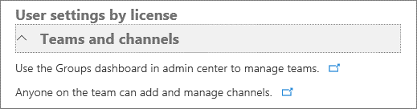

Office 365 の組織で Microsoft チーム機能を有効にします。Turn on Microsoft Teams features in your Office 365 organization
======================================================

チームでは、Office 365 のテナント レベルでをオンまたはオフになっていることができる複数の設定があります。チームのテナントのになっている場合チームも有効になっているすべてのユーザーは、テナント レベルから設定を継承するされます。Teams has multiple settings that can be turned on or turned off at the Office 365 tenant level. With Teams turned on for a tenant, any user that is also enabled for Teams will inherit the settings from the tenant level.

以下の機能を有効にする、またはチームで無効にする Office 365 管理者を選択できます。Below is the list of features an Office 365 administrator can choose to enable or disable in Teams.

オプションの既定値は、限り、します。Unless otherwise noted, the default value for an option is On.

> [!NOTE]
> Office 365 の管理者は、いつでも、Office 365 管理センターで Microsoft チームを無効にできます。タイルのチームをオフにする場合でも、チームのアプリを表示するアクティブな Microsoft チーム ライセンスを持つユーザーが引き続き注意します。ユーザーからライセンスを削除する方法の詳細については、 [Microsoft チームへのユーザー アクセスを管理する](user-access.md)を参照してください。チームを無効にすると、チーム クライアントからのアクセスをブロックすると、データが他のクライアントとサービスを利用可能な SharePoint と OneDrive を使用したファイルなど、引き続き利用できます。すべてのデータは、チームが明示的に削除しない限り、場所に残ります。An Office 365 admin can turn off Microsoft Teams at any time in the Office 365 admin center. Be aware that users with active Microsoft Teams licenses will continue to see the Teams app tile even if you turn off Teams. For details about how to remove licenses from users, see [Manage user access to Microsoft Teams](user-access.md). After Teams is disabled, access from the Teams client is blocked, but data available through other clients and services is still available, such as files via SharePoint and OneDrive. All data remains in place unless the teams are explicitly deleted.

Office 365 テナント全体の設定Office 365 tenant-wide settings 
---------------------

**テナント全体の設定**] で有効にするまたは有効にするオプションを無効一般に、メールとの統合、アプリ、およびカスタム クラウド ストレージします。In **Tenant-wide settings**, you can turn on or turn off options in General, Email integration, Apps, and Custom cloud storage.

チームの**テナント全体の設定**を編集するには、Office 365 管理センターに移動します。[**設定**] を選びます > **サービスおよびアドイン** > **Microsoft チーム**します。To edit **Tenant-wide settings** for Teams, go to the Office 365 admin center. Choose **Settings** > **Services & add-ins** > **Microsoft Teams**.

### [全般]General

[全般] セクションでは、組織の次の設定を構成できます。The General section lets you configure the following settings for your organization:

> ![テナント全体の設定] で [全般] セクションのスクリーン ショット。](media/Enable_Microsoft_Teams_features_in_your_Office_365_organization_image1.png)

-   **個人プロファイルで組織図を表示する:**この設定を有効にすると、ユーザーの連絡先カードで組織図] アイコンが表示し、詳細な組織図] をクリックしたときに表示されます。**Show organizational chart in personal profile:** When this setting is enabled, it shows the organizational chart icon in the user’s contact card and when clicked, it displays the detailed organizational chart.

    ![ユーザーの連絡先カードの [組織図] アイコンのスクリーン ショット。](media/Enable_Microsoft_Teams_features_in_your_Office_365_organization_image2.png)

    

-   **Skype for Business チームを持っていない受信者の使用:**この設定を有効にすると、チームのユーザーに Skype for Business でチームが無効にする、組織内の他のユーザーに連絡を許可します。**Use Skype for Business for recipients who don’t have Teams:** When this setting is enabled, it allows Teams users to contact other users in the organization that are not enabled for Teams via Skype for Business.

-   **T 寸法積極的なヘルプ メッセージを許可する:**この設定を有効にすると、T-結果のチームを使用するためのユーザーとプライベート チャット セッションを開始します。**Allow T-bot proactive help messages:** When this setting is enabled, T-bot will initiate a private chat session with users to guide them in using Teams.

    ![チームのインターフェイスで T のスクリーン ショットの結果] セクション。](media/Enable_Microsoft_Teams_features_in_your_Office_365_organization_image4.png)

メールとの統合Email integration
-----------------

ユーザー メールを送信できる、チームのチャンネルにチャンネルのメール アドレスを使用するように、この機能を有効にします。ユーザーは、所有しているチームに属しているすべてのチャンネルにこれを実行できます。ユーザーは、コネクタをチーム メンバー用に有効に追加されているチームの任意のチャンネルにもメールを送信できます。ユーザーがからアクセスできる場合でも、ユーザーは、権限を持っているユーザーがそのアドレスを作成する場合、チャンネルのメール アドレスを作成するのにはアクセス許可を割り当てられていない、\<詳細]\>そのチャンネルのメニュー。Turn on this feature so users can send email to a channel in Teams, using the channel email address. Users can do this for any channel belonging to a team they own. Users can also send emails to any channel in a team that has adding connectors enabled for team members. And, even if a user doesn’t have permission to create a channel email address, if someone who does have permission creates that address, the user can access it from the \<more icon\> menu for that channel.

メールとの統合] セクションでは、組織の次の設定を構成できます。The Email integration section lets you configure the following settings for your organization:

   ![テナント全体の設定] で [メールとの統合] セクションのスクリーン ショット。](media/QS-edu-email-integration.png)

-   **チャンネルにメールを送信するユーザーを許可する:**有効な場合は、メール フックが有効であり、ユーザーがチーム チャネルのメール アドレスにメールを送信してチャンネルにメッセージを投稿できます。**Allow users to send emails to channels:** When enabled, mail hooks are enabled, and users can post messages to a channel by sending an email to the email address of Teams channel.

> チャンネルの電子メール アドレスを検索するには、チャンネル名の横にある [**その他のオプション**] をクリックし、[**メール アドレスを取得する**] を選びます。To find the channel’s e-mail address, click **More options** next to the channel name and then select **Get email address**.

-   **差出人のリストを制限:**SMTP の許可ドメインのみがチャンネルをチームに電子メールを送信することを確認する送信者のドメインをさらに制限することができます。**Restricted Senders List:** Senders domains can be further restricted to ensure that only allowed SMTP domains can send emails to the Teams channels.

アプリApps
----

アプリをチームでは、任意のチャンネルまたはチャットに、チームが気ツールとサービスを統合するすばらしい方法です。Apps in Teams are a terrific way to integrate the tools and services your team cares about, right into any channel or chat.

**[アプリ**] セクションでは、組織の次の設定を構成できます。The **Apps** section lets you configure the following settings for your organization:

![[アプリ] セクションのスクリーン ショット。](media/Enable_Microsoft_Teams_features_in_your_Office_365_organization_image6.png)

-   **Microsoft チームで外部のアプリを許可する:**有効にすると、ユーザーは、タブと Office 365 テナントに利用できるコンポーネントに追加できます。![アプリ] セクションで、制御を許可する外部アプリのスクリーン ショット。](media/Enable_Microsoft_Teams_features_in_your_Office_365_organization_image6.2.png)**Allow external apps in Microsoft Teams:** When enabled, users can add tabs and bots that are available to the Office 365 tenant. 

-   **Sideloading の外部のアプリを許可する:**有効にすると、ユーザーはインストールして、カスタム コンポーネントとタブを有効にします。**Allow sideloading of external apps:** When enabled, users can install and enable custom bots and tabs.

ユーザー設定のクラウド ストレージCustom cloud storage
--------------------

現在、チームでのクラウド ストレージのオプションには、ボックス、Dropbox、Google ドライブ、および ShareFile が含まれます。ユーザーは、アップロードして、チーム チャンネルやチャットのクラウド ストレージ サービスからファイルを共有します。をクリックするか、組織が使用するクラウド ストレージのプロバイダーの横にあるトグル スイッチをタップします。Cloud storage options in Teams currently include Box, Dropbox, Google Drive, and ShareFile. Users can upload and share files from cloud storage services in Teams channels and chats. Click or tap the toggle switch next to the cloud storage providers that your organization wants to use.

![クラウド記憶域のユーザー設定] セクションのスクリーン ショット。](media/Enable_Microsoft_Teams_features_in_your_Office_365_organization_image7.png)

ライセンスをユーザー設定User settings by license
------------------------

**ライセンスをユーザー設定**] を有効にするまたはチームとチャネル、通話、会議、およびメッセージング オプションをオフにできます。In **User settings by license**, you can turn on or turn off options in Teams and channels, Calls and meetings, and Messaging.

チームとチャネルTeams and channels
------------------

チームは、仕事を片付けるに密接に連携しているユーザーのグループを一緒に設計されています。チームは (たとえば、製品を起動またはデジタル war ルームを作成) プロジェクト ベースの作業を動的にすることはできます。または、チームを組織の内部構造を反映するように、継続的に行うことができます。A team is designed to bring together a group of people who work closely to get things done. Teams can be dynamic for project-based work (for example, launching a product or creating a digital war room). Or, teams can be ongoing, to reflect the internal structure of your organization.

管理者は、Office 365 管理センターのポータルでグループ ダッシュ ボードを使用して、チームの所有者とメンバーを管理できます。チームとチャネル] セクションでは、**チームを管理するのには、Office 365 管理センターでグループ ダッシュ ボードを使用する**ためのリンクをクリックします。As an admin, you can manage team owners and members by using the Groups dashboard in the Office 365 admin center portal. In the Teams and channels section, click the link for **Use the Groups dashboard in the Office 365 admin center to manage teams**.

チームでチームを作成できる、組織内のどのユーザーを制御できます。Office 365 グループによって定義された同じ作成設定は、チームに適用されます。詳細については、Office 365 グループを管理する、[グループを作成する Office 365](https://support.office.com/en-us/article/Create-Office-365-groups-74a1ef8b-3844-4d08-9980-9f8f7a36000f)と[Office 365 グループを作成できるユーザー コントロール](https://support.office.com/en-us/article/Control-who-can-create-Office-365-Groups-4c46c8cb-17d0-44b5-9776-005fced8e618)を参照してください。You can control which users in your organization can create teams in Teams. The same creation settings defined by Office 365 groups apply to Teams. For more information about managing Office 365 groups, see [Create Office 365 groups](https://support.office.com/en-us/article/Create-Office-365-groups-74a1ef8b-3844-4d08-9980-9f8f7a36000f) and [Control who can create Office 365 Groups](https://support.office.com/en-us/article/Control-who-can-create-Office-365-Groups-4c46c8cb-17d0-44b5-9776-005fced8e618).

> [!NOTE]
> グループ ダッシュ ボードからチームを作成することはできません。チーム デスクトップ クライアントまたは web アプリを使用してチームを作成する必要があります。You can't create teams from the Groups dashboard. Teams must be created by using the Teams desktop client or web app.

既定では、すべてのユーザーがチームまたはグループを作成できます。チーム クライアント (デスクトップ クライアントまたは web アプリケーション)] で、左側にある**チーム**を選択し、**チームを作成し、参加**、クライアント、チームの一覧の下の下部にあるをクリックします。By default, every user can create a team or group. Choose **Teams** on the left side in the Teams client (desktop client or web app), then choose **Create and join team** at the bottom of the client, below the team list.

現在、Office 365 テナントを持つことができるチームの既定の最大数は 500,000 です。グローバル管理者は、任意の数のチームを作成できます。ユーザーは、250 チームを作成できます。チームの所有者は、チームに 2500 メンバーを追加することができます。The default maximum number of teams that an Office 365 tenant can have is currently 500,000. A global admin can create an unlimited number of teams. A user can create 250 teams. A team owner can add 2500 members to a team.

チャネルは、チームのサブカテゴリです。チャンネルを追加し、チャネルでの会話に参加する、チーム内のだれでもできます。アクティビティや部門のチャネルを作成することがあります。スレッド、ファイル、および wiki が、各チャンネルに固有のものが、チームのメンバー全員が確認できます。Channels are subcategories of teams. Anyone on the team can add a channel and participate in the conversations in a channel. You might create a channel for an activity or for a department. Conversations, files, and wikis are specific to each channel, but all members of the team can see them.

### 通話と会議Calls and meetings

**通話と会議**] セクションでは、組織の次の設定を構成できます。The **Calls and meetings** section lets you configure the following settings for your organization:

> ![通話と会議] セクションのスクリーン ショット。](media/Enable_Microsoft_Teams_features_in_your_Office_365_organization_image9.png)

-   **プライベート会議のスケジュールを設定できるようにする:**有効にすると、ユーザーは、チャンネルに表示されていないプライベート会議をスケジュールできます。**Allow scheduling for private meetings:** When enabled, users can schedule private meetings that are not listed in any channel.

-   **アドホック チャネル meetup を許可するには。****Allow ad-hoc channel meetup:**

-   **チャネルの会議のスケジュールを設定できるようにする:**有効にすると、ユーザーは、チャンネルのすべてのメンバーが 1 回のクリックで簡単に参加できるチャンネルの会議をスケジュールできます。**Allow scheduling for channel meetings:** When enabled, users can schedule a meeting for a channel that all channel members can easily join with a single click.

-   **会議でビデオを許可する:**会議内でビデオの使用が許可されているかどうかを指定します。**Allow videos in meetings:** Specifies whether the use of video is allowed within the meetings.

-   **画面の共有の会議を許可する:**会議内で画面の共有を許可するかどうかを指定します。**Allow screen sharing in meetings:** Specifies whether screen sharing is allowed within the meetings.

-   **プライベート通話を許可する:**有効な場合、ユーザー プライベート通話の発信ことができます。**Allow private calling:** When enabled, users can make private calls.

会議内のユーザーの最大数は、80 です。チャットを作成したユーザーを含む、非公開チャットに 20 のメンバーがあります。The maximum number of people in a meeting is 80. There can be 20 members in a private chat, including the user who created the chat.

### メッセージングMessaging 

[メッセージング] セクションでは、組織の次の設定を構成できます。The Messaging section lets you configure the following settings for your organization:

![[メッセージング] セクションのスクリーン ショット。](media/Enable_Microsoft_Teams_features_in_your_Office_365_organization_image10.png)

-   **Gif の会話に追加できるように Giphy を有効にする:**有効にすると、ユーザーは、会話内でアニメーションを使用できます。**Enable Giphy so users can add gifs to conversations:** When enabled, users can use animated pictures within the conversations.

    -   **コンテンツの規制:**アニメーション画像が点灯しているときに、会話で表示できるアニメーション画像の種類を制限するコンテンツの評価を適用できます。利用可能なコンテンツの評価オプションは次のとおりです。**Content Rating:** When animated images are turned on, content rating can be applied to restrict the type of animated images that can be displayed in conversations. Available content rating options are:

        -   制限なしNo restriction

        -   モデレートする (既定値)Moderate (the default value)

        -   厳格ですStrict

-   **ユーザーを編集および会話に追加できる memes を有効にする:**有効にすると、ユーザーは、ユーモアの投稿をインターネット memes を使用できます。**Enable memes that users can edit and add to conversations:** When enabled, users can use internet memes to make humorous posts.

-   **ユーザーを編集および会話に追加できるステッカーを有効にする:**有効にすると、ユーザーは、チャンネルのメンバーに注意を引く編集可能なテキストと画像を投稿できます。**Enable stickers that users can edit and add to conversations:** When enabled, users can post images with editable text to get channel members attention.

-   **の所有者がすべてのメッセージを削除するのには:**有効にすると、チャンネルの所有者は、チャンネルのすべてのメッセージを削除できます。**Allow owners to delete all messages:** When enabled, channel owners can remove all messages in a channel.

-   **ユーザー独自のメッセージを編集できるようにする:**有効にすると、ユーザーは、独自のメッセージを編集できます。**Allow users to edit their own messages:** When enabled, users can edit their own messages.

-   **独自のメッセージを削除するのには、ユーザーに許可する:**有効にすると、ユーザーは、独自のメッセージを削除できます。**Allow users to delete their own messages:** When enabled, users can delete their own messages.

-   **プライベートでチャットを許可]:**有効な場合、ユーザーがチームのすべてのユーザーの代わりに、チャットのユーザーだけが表示されているチャットをプライベートで取り組むことができます。**Allow users to chat privately:** When enabled, users can engage in private chats that are visible only to the people in the chat, instead of everyone on the team.

| |  |  |
|---------|---------|---------|
|     |判断するポイントDecision Point         |組織ではどのような Microsoft チームの設定を有効にします。What settings for Microsoft Teams will your organization enable?         |
|     |次のステップNext Steps        |文書のテーブルで[Microsoft チームの役割および権限を割り当てる](assign-roles-permissions.md)ビジネス上の決定されます。Document these decisions in the table in [Assign roles and permissions in Microsoft Teams](assign-roles-permissions.md).         |

