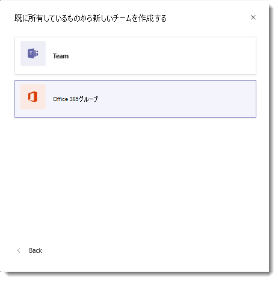

既存の Office 365 グループを Microsoft Teams で強化する
=======================================================

Microsoft Teams ユーザーは、Microsoft Teams の機能を使って既存の Office 365 グループを強化することができます。Office 365 のパブリック グループでは、そのメンバー数が 2500 人以下の場合にグループを強化できます。

この操作を行うには、Microsoft Teams クライアントから新規のチームを作成します。画面下部にある「**はい。Microsoft Teams の機能を追加します。**」を選択し、Microsoft Teams により強化する既存のグループを選択します。既存のグループのメンバーがチームのメンバーとして自動的に追加されます。

> [!IMPORTANT]
> Microsoft Teams を使用して既存のグループを強化するためのアクセス許可は Office 365 グループの所有者のみが有します。 

ユーザーは配布リストをチームに取り込むこともできます。それを行うと、配布リストのメンバーがチームに追加されます。この処理は一度のみ実行されるため、その後に配布リスト内のグループ メンバーの変更があった場合でもチームには反映されません。 

チームのメンバーとして、メール対応のセキュリティ グループを追加することもできます。ただし、後でセキュリティ グループにさらに多くのメンバーを追加しても、それらのメンバーはチームに自動追加されません。新しいメンバーをチームに個別に追加するか、セキュリティ グループをチームに再追加する必要があります。(セキュリティ グループを再追加する場合は、重複を削除してメンバーが一度だけ追加されるようにします。)

Office 365 グループでのプライバシー設定には、**パブリックとプライベート**の 2 種類があります。これらのグループの種類は両方とも、Microsoft Teams で有効にすることができますが、セルフ サービスの場合ではこれらの種類の間に多少の違いがあります。

-   ユーザーはパブリック グループを検索して、チーム所有者の承認なしで自由に参加できます。

-   プライベート グループは検索できません。ユーザーはチーム所有者からメンバーとして追加されない限り参加することはできません。

Microsoft Teams で新しいチームを作成すると、既存のプライベート  グループの所有者は、グループのメンバーシップを使って新しいチームを作成することができます。ユーザーは、既存の SharePoint ファイル (タブの追加) や OneNote ファイル (ファイルの結合) を追加できます。
