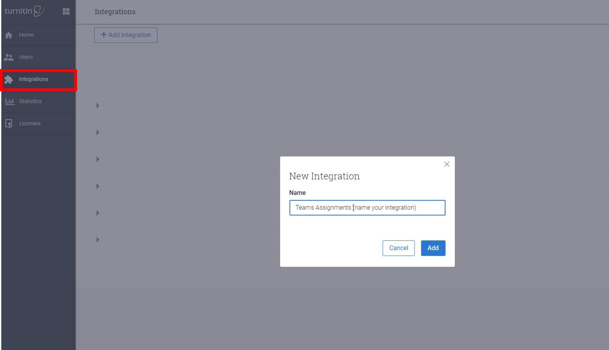

# 教育機関向けの Teams の課題 Assignments in Teams for Education

割り当ては、学生またはチームメンバーに対して、調査の一環として、クラス内で割り当てられているタスクまたは作業単位数です。Assignments are tasks or units of work assigned to a student or team member in a class as part of their study. Teams クラス内で課題を作成することができます。You can create assignments within your Teams class.

[割り当ての詳細について](https://support.office.com/article/microsoft-teams-5aa4431a-8a3c-4aa5-87a6-b6401abea114?ui=en-US&rs=en-IE&ad=IE#ID0EAABAAA=Assignments)は、こちらを参照してください。[Learn more about Assignments](https://support.office.com/article/microsoft-teams-5aa4431a-8a3c-4aa5-87a6-b6401abea114?ui=en-US&rs=en-IE&ad=IE#ID0EAABAAA=Assignments).

> [!Note]
> さまざまなプラットフォームでの Teams の割り当てについて詳しくは、「 [プラットフォームごとの teams の機能](https://support.microsoft.com/office/teams-features-by-platform-debe7ff4-7db4-4138-b7d0-fcc276f392d3)」をご覧ください。For details about Teams assignments on different platforms, see [Teams features by platform](https://support.microsoft.com/office/teams-features-by-platform-debe7ff4-7db4-4138-b7d0-fcc276f392d3).

## Microsoft Teams 管理センターでの課題Assignments in the Microsoft Teams admin center

Microsoft Teams 管理センターの管理設定を使用すると、組織内の学生と教師が、次の機能を有効または無効にすることができます。With the admin settings in Microsoft Teams admin center, you can turn the following features on or off to be available for students and teachers within your organization. 課題に関連する設定を次に示します。The following are settings related to Assignments:

### 1週間のガーディアンメールダイジェストWeekly guardian email digest

このメールには、前週と来週の課題に関する情報が含まれており、週末に送信されます。The emails will contain information about assignments from the previous week and for the upcoming week, and will be sent over the weekend. メールコンテンツに関する情報については、こちらを参照してください。Information about the email content can be found here. メールは、 [School Data Sync (SDS)](https://docs.microsoft.com/schooldatasync/)を使用して管理者がセットアップおよび更新する必要があります。The emails need to be set up and updated by the admins by using [School Data Sync (SDS)](https://docs.microsoft.com/schooldatasync/). この機能は、学校の学生情報システム (SIS) を使用して、学生の選手名簿で Teams のクラスを自動的に設定します。This feature automatically populates classes for Teams with student rosters from the school's student information system (SIS). この機能を有効にするには、次の手順を実行します。The steps to enable this feature are:

1. SDS で親とガーディアンの同期を使って、親の連絡先情報をインポートします。Import parent contact information via Parent and Guardian Sync in SDS. 親とガーディアンの同期を有効にする方法については、「 [親とガーディアンの同期を有効](https://docs.microsoft.com/schooldatasync/parent-contact-sync#enabling-parent-and-guardian-sync)にする」を参照してください。For instructions on how to enable Parent and Guardian Sync, see [Enabling Parent and Guardian Sync](https://docs.microsoft.com/schooldatasync/parent-contact-sync#enabling-parent-and-guardian-sync).

2. 設定は既定で無効になっているため、Microsoft Teams 管理センターで [ガーディアン] 設定をオンにします。Turn on the Guardian Setting in the Microsoft Teams admin center, as the setting is turned off by default. これにより、教師が毎週のダイジェストを送信できるようになります。This will enable teachers to send out a weekly digest.

   > [!NOTE]
   > 教師は、独自の個人用クラスチーム内の設定 (**親/ガーディアンメール > の割り当て設定**) の選択を解除することによって、ダイジェストを除外することができます。Teachers can opt-out of the digest by deselecting the setting inside their own personal class team (**Assignment Settings > Parent/Guardian Emails**).

親からメールが送信されることを確認するには、次の3つの項目が true である必要があります。To verify that Parents will get the email the following three items must be true:

 - SDS の学生プロファイルに添付され、 _親_ または _ガーディアン_ としてタグ付けされたメールアドレス。Email address attached to the student profile in SDS and tagged as _Parent_ or _Guardian_. 詳細については、「 [親とガーディアンの同期ファイル形式](https://docs.microsoft.com/schooldatasync/parent-contact-sync-file-format)」を参照してください。For details, see [Parent and Guardian Sync File Format](https://docs.microsoft.com/schooldatasync/parent-contact-sync-file-format).

 - 学生は、[ [割り当ての設定](https://support.microsoft.com/office/adjust-assignment-settings-in-your-class-team-05bb3b89-1cdf-415a-b6c7-44add0376a77)] の教師によって無効にされていない1つ以上のクラスに属しています。Students belong to at least one class in which e-mail is not disabled by the teacher in [assignment settings](https://support.microsoft.com/office/adjust-assignment-settings-in-your-class-team-05bb3b89-1cdf-415a-b6c7-44add0376a77).

 - このメールには、先週または来週に期限がある課題に関する情報が含まれています。The emails will contain information about assignments that had a due date in the previous week or in the upcoming week.

この設定は、既定ではオフになっています。This setting is off by default.

### MakeCodeMakeCode
Microsoft MakeCode はブロックベースのコーディングプラットフォームであり、すべての学生に対してコンピューターの科学を実現します。Microsoft MakeCode is a block-based coding platform that brings computer science to life for all students. 

MakeCode は、Microsoft [利用規約](https://go.microsoft.com/fwlink/?LinkID=206977) および [プライバシー](https://go.microsoft.com/fwlink/?LinkId=521839) ポリシーの適用対象となる microsoft 製品です。MakeCode is a Microsoft product that is subject to the Microsoft [terms of use](https://go.microsoft.com/fwlink/?LinkID=206977) and [privacy](https://go.microsoft.com/fwlink/?LinkId=521839) policies.

この設定は、既定ではオフになっています。This setting is off by default. Teams で MakeCode の割り当てを有効にするには、 **Teams 管理センター** で、[ **課題** ] セクションに移動し、MakeCode トグルオプションを **[オン**] にします。To enable MakeCode assignments in Teams, in the **Teams Admin Center**, navigate to the **Assignments** section and turn the MakeCode toggle option to **On**. [ **保存** ] をクリックして、これらの設定が有効になるまで数時間待ちます。Click **Save** and allow a few hours for these settings to take effect.

この機能のしくみについて詳しくは、この [ビデオデモ](https://makecode.com/blog/teams/teams-assignments)をご覧ください。For more information on how this feature works, see this [video demonstration](https://makecode.com/blog/teams/teams-assignments).

[MakeCode の詳細について](https://aka.ms/makecode)は、こちらを参照してください。[Learn more about MakeCode](https://aka.ms/makecode).

### TurnitinTurnitin

Turnitin は、plagiarism の検出サービスです。Turnitin is a plagiarism detection service. これは、サードパーティの製品またはサービスであり、独自の用語とプライバシーポリシーの適用対象となります。This is a third-party product or service that is subject to its own terms and privacy policy. お客様は、サードパーティの製品とサービスの使用に関して責任を負います。You are responsible for your use of any third-party products and services.

この設定は、既定ではオフになっています。This setting is off by default.

組織の Turnitin を正常に有効にするには、Turnitin サブスクリプションが既に存在している必要があります。In order to successfully enable Turnitin for your organization, you will need to already have a Turnitin subscription. 次の追加情報を入力する必要があります。これは、Turnitin の管理コンソールにあります。You will need to enter the following additional information, which can be found in your Turnitin admin console:

  * **TurnitinApiKey**: この32文字の GUID は、[統合] の下の管理コンソールにあります。**TurnitinApiKey**: This is a 32-character GUID found in the admin console under Integrations.
  * **TurnitinApiUrl**: これは、Turnitin 管理コンソールの HTTPS URL です。**TurnitinApiUrl**: This is the HTTPS URL of your Turnitin admin console.

この情報を取得するための手順をいくつか紹介します。Here are some instructions to help you obtain this information.

**TurnitinApiUrl** は、管理コンソールのホストアドレスです。The **TurnitinApiUrl** is the host address of your admin console.
次 `https://your-tenant-name.turnitin.com`Example: `https://your-tenant-name.turnitin.com`

管理コンソールでは、統合と関連付けられた API キーを作成できます。The admin console is where you can create an integration and an API key associated with the integration.

サイド **メニューから [統合] を選択** し、[ **統合の追加** ] を選択して、統合の名前を指定します。Select **Integrations** from the side menu, then select **Add Integration** and give the integration a name.

プロンプトが表示された後、 **TurnitinApiKey** が提供されます。The **TurnitinApiKey** will be given to you after you follow the prompts. API キーをコピーして、Microsoft Teams 管理センターに貼り付けます。Copy the API key and paste it into the Microsoft Teams admin center.  これは、キーを表示できる唯一の時間です。This is the only time you can view the key.

この設定のために管理センターで [ **保存** ] ボタンをクリックしたときに、これらの設定が有効になるまで、数時間許可してください。Upon clicking the **Save** button in the admin center for this setting, please allow a few hours for these settings to take effect.

Teams で Turnitin 統合の使用を開始する準備ができましたか?Ready to start using the Turnitin integration in Teams? [以前のアクセスプログラム](https://www.turnitin.com/products/feedback-studio/microsoft-teams-integration)にサインアップします。Sign up for the [early access program](https://www.turnitin.com/products/feedback-studio/microsoft-teams-integration).
