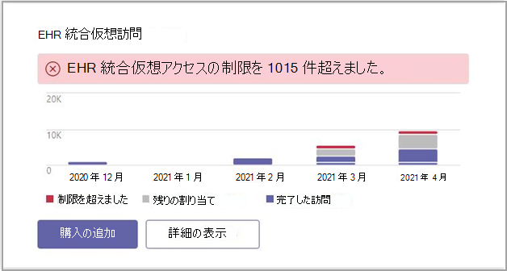

# Microsoft TeamsEHR コネクタの管理レポートMicrosoft Teams EHR connector Admin Reports

[Microsoft Teams (EHR) コネクタの [管理レポート] ダイアログ ボックスでは、使用状況データのすばやく読み取りが簡単にできます。The Microsoft Teams electronic health record (EHR) connector Admin Report dialog provides a quick and easy to read view of usage data.

EHR コネクタ管理者Microsoft Teamsレポートを表示するには、管理センターのダッシュボードMicrosoft Teamsダイアログを表示します。You can see the Microsoft Teams EHR connector admin report by going to the Microsoft Teams Admin Center dashboard and viewing the dialog there.

管理センター ダッシュボードのMicrosoft Teamsレポートにアクセスします。Access the report from the Microsoft Teams Admin Center dashboard.

 

ダイアログには、次のデータが表示されます。The dialog provides the following data:

- 上限を超えましたExceeded limit
- 残りの割り当てRemaining allocation
- 完了したアクセスCompleted visits

レポート ダイアログを使用して、仮想アクセスを追加購入できます。You can use the report dialog to buy more virtual visits.

## 関連項目Related topics

[Teamsアクセスの詳細Teams for virtual visits](ehr-admin.md)
