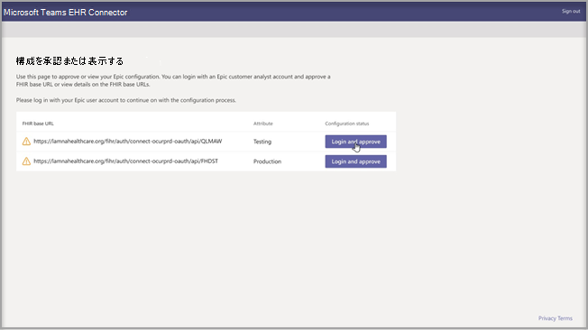
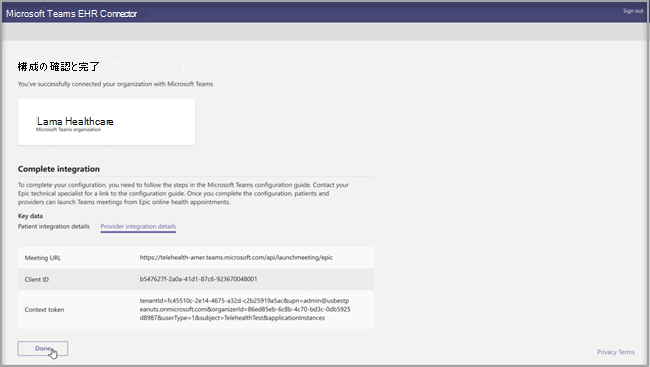
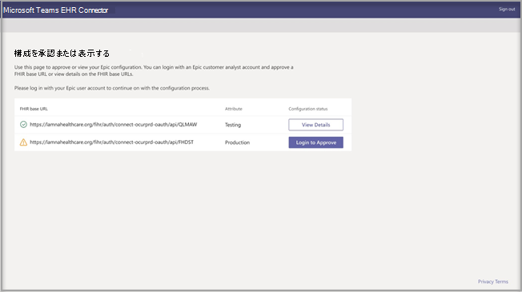

# Teams での仮想アクセス - EHR への統合

Microsoft Teams の電子健康記録 (EHR) コネクタを使用すると、臨床医は EHR システムから直接、仮想の患者訪問や Teams 内の別のプロバイダーとの相談を簡単に開始できます。 Microsoft 365 クラウド上に構築された Microsoft Teams は、HIPAA、HITECH 認定などへの準拠をサポートする単一のハブで、チャット、ビデオ、音声、およびヘルスケア ツールとのシンプルで安全なコラボレーションとコミュニケーションを可能にします。
Teams のコミュニケーションおよびコラボレーション プラットフォームにより、臨床医は断片化されたシステムの乱雑さを簡単に切り抜けることができるため、可能な限り最善のケアを提供するために時間を費やすことができます。 Microsoft Teams の電子健康記録 (EHR) コネクタは次のことができます。
- プロバイダー ポータルと患者ポータルの両方から Teams の仮想アクセスを開始します。
- 接続イベントと切断イベントで EHR メタデータに書き戻し、自動監査と記録保持を有効にします。
- Microsoft Teams の使用を許可しながら、既存の臨床医および患者のワークフローに統合します。

  EHR ポータルから仮想アクセスを管理する方法のビデオをご覧ください。

> [!VIDEO https://www.microsoft.com/videoplayer/embed/RE4HAtn]

## はじめに

EHR コネクタを統合する前に、次の前提条件があることを確認する必要があります。

- [Epic の App Orchard マーケットプレイス](https://apporchard.epic.com/Gallery?id=6153)で Microsoft Teams アプリを使用するためのアクセス。

- Microsoft Cloud for Healthcare の現在有効なサブスクリプションまたは Microsoft Teams EHR Connector のスタンドアロン プランのサブスクリプション (本番テスト中にのみ適用されます)。

- ユーザーは Microsoft Teams 会議が含まれている Microsoft 365 または Office 365 の適切なライセンスを所有している必要があります。

- Microsoft Teams は、組織内で採用および使用する必要があります。

- 組織は、 Epic の 2018 年 11 月以降のバージョンを持っている必要があります。

- システムは、すべての[ソフトウェアとブラウザーの前提条件](https://docs.microsoft.com/microsoftteams/hardware-requirements-for-the-teams-app)を満たす必要があります。

また、組織内の次のユーザーからの情報も必要になります。

- Microsoft 365 管理者

- Epic 顧客アナリスト

> [!Note]
> Epic テクニカル スペシャリストに、Epic マーケットプレイスで入手可能な Epic-Microsoft Telehealth Integration ガイドを提供するように依頼してください。

## コネクタの設定

コネクタの設定には、次のことが必要です。

- [EHR コネクタ構成ポータルを起動する](ehr-admin.md#launch-the-ehr-connector-configuration-portal)
- [構成情報](ehr-admin.md#configuration-information)
- [構成を承認または表示する](ehr-admin.md#approve-or-view-configuration)
- [構成を確認して終了する](ehr-admin.md#review-and-finish-the-configuration)

### [EHR コネクタ構成ポータルを起動する](#launch-the-ehr-connector-configuration-portal)

Microsoft Teams で仮想アクセスを開始するため医療機関を構成するには、EHR コネクタ構成ポータルを起動することから始めます。 統合をテストするために、単一または複数の組織を構成します。 構成ポータルでテスト URL と本番 URL を構成します。 本番環境に移行する前に、Epic のテスト環境から統合をテストします。
  
- EHR コネクタ構成 URL: [https://ehrconnector.teams.microsoft.com](https://ehrconnector.teams.microsoft.com)

組織の Microsoft 365 管理者と Epic 顧客アナリストは、構成ポータルで情報と統合の手順を完了する必要があります。 Epic の構成手順については、組織に割り当てられている Epic テクニカル スペシャリスト リソースにアクセスしてください。

### [構成情報](#configuration-information)

この手順は、**Microsoft 365 管理者** が実行する必要があります。 Microsoft 365 管理者は、コネクタ構成ポータルを起動し、Microsoft 資格情報を使用してサインインし、構成プロセスを開始する必要があります。

この手順を完了するには、Microsoft 365 管理者は、Epic テクニカル スペシャリストから有効な Fast Health Interoperability Resources (FHIR) ベース URL と、構成を承認する Epic 顧客アナリストのユーザー名を受け取る必要があります。 Microsoft 365 管理者は、コネクタ構成ページを起動し、Microsoft 資格情報を使用してサインインし、構成プロセスを開始する必要があります。

- FHIR ベース URL は、サーバーの FHIR API エンドポイントに対応する静的アドレスです。 URL の例は、`https://lamnahealthcare.org/fihr/auth/connect-ocurprd-oauth/api/FHDST` です。

- 構成承認者名は、次の手順で構成を承認する責任を負う Epic 顧客アナリストの名前です。 Epic 顧客アナリストは、Epic にサインイン アクセスできる組織内のユーザーです。

  

### [構成を承認または表示する](#approve-or-view-configuration)

承認者として追加されたヘルスケア組織の Epic 顧客アナリストは、Microsoft 365 資格情報を使用してサインインするために、前の手順と同じ EHR コネクタ URL を使用する必要があります。 検証が成功すると、承認者は Epic 資格情報を使用してサインインし、Epic 組織を検証するように求められます。

> [!Note]
> 組織内の Microsoft 365 管理者と Epic 顧客アナリストは同じ人物であることが可能です。 その場合は、自分のユーザー名を承認者として追加してください。 アクセスを検証するには、Epic にサインインする必要があります。 Epic サインインは、FHIR ベース URL を検証するためにのみ使用されます。 Microsoft は、このサインインで資格情報を保存したり、EHR データにアクセスしたりすることはありません。

  

Epic サインインが成功したら、Epic 顧客アナリストは構成を承認する **必要があります**。 構成が正しくない場合、Microsoft 365 管理者は、Microsoft EHR コネクタ ポータルに再度サインインすることにより、元の構成を変更できます。 

### [構成を確認して終了する](#review-and-finish-the-configuration)

構成情報が Epic 管理者によって承認されると、患者とプロバイダーの立ち上げに関する統合レコードが表示されます。 これらのレコードは、Epic で仮想アクセスの構成を完了するために必要です。 詳細については、Epic-Microsoft Teams Telehealth Integration ガイドを参照してください。

> [!Note]  
> Microsoft 365 または Epic 顧客アナリストは、いつでも構成ポータルにサインインして、統合レコードを表示し、必要に応じて組織の構成を変更できます。

> [!Note]
> 承認プロセスは、Microsoft 管理者が以前に構成したすべての FHIR URL について、Epic 顧客アナリストにより完了される必要があります。

## Teams の仮想アクセスを開始する

EHR コネクタの手順と Epic 構成を完了すると、組織は Microsoft Teams でのビデオ訪問をサポートする準備が整います。

### 仮想アクセスの前提条件

- システムは、すべての[ソフトウェアとブラウザーの前提条件](https://docs.microsoft.com/microsoftteams/hardware-requirements-for-the-teams-app)を満たす必要があります。

- ヘルスケア組織は、Epic 組織と Microsoft 365 組織の間のセットアップを完了している必要があります。

### プロバイダー エクスペリエンス

組織の医療提供者は、Epic プロバイダー アプリケーション (Hyperspace、Haiku、Canto) から Microsoft Teams を使用した仮想アクセスに参加することもできます。 **[仮想アクセスの開始]** ボタンは、プロバイダー フローに組み込まれています。

プロバイダー エクスペリエンスの主な機能:

- プロバイダーは、サポートされているブラウザーまたは Microsoft Teams アプリケーションを使用して仮想アクセスに参加できます。

- プロバイダーは、仮想アクセスに初めて参加するときに、Microsoft 365 アカウントで 1 回サインインする必要があります。

- 1 回のサインイン後、プロバイダーは Microsoft Teams の仮想予定に直接移動します。 (プロバイダーは Microsoft Teams にサインインする必要があります)。

- プロバイダーは、与えられた予定に対し、参加者の接続と切断のリアルタイム更新を確認できます。 プロバイダーは、患者が仮想アクセスに接続されていることを確認できます。

  

### 患者エクスペリエンス

コネクタは、MyChart の Web とモバイルを通じて仮想アクセスに参加する患者をサポートします。 予約時に、患者は **[仮想アクセスの開始]** ボタンを使用して MyChart から仮想アクセスを開始できます。

患者エクスペリエンスの主な機能:

- 患者は、アプリをインストールしなくても、デスクトップとモバイルの最新の Web ブラウザーから仮想アクセスに参加できます。

- 患者はワンクリックで仮想アクセスに参加でき、他のアカウントやサインインは必要ありません。

- 患者は、仮想アクセスを開始するために Microsoft アカウントを作成したりサインインしたりする必要はありません。

- 患者は、医療提供者が予約に参加し、仮想アクセスを許可するまでロビーに配置されます。

- ビデオとマイクのテストは、仮想アクセスに参加する前にロビーで利用できます。

  

> [!Note]
> Epic、MyChart、Haiku、および Canto は、Epic Systems Corporation の商標です。

### データのプライバシーと場所

Teams の EHR システムへの統合により、統合および仮想アクセス フロー中に使用および保存されるデータの量が最適化されます。 このソリューションは、Teams のプライバシーとデータ管理の原則、および Teams のプライバシーで概説されているガイドラインに従います。

Microsoft Teams EHR コネクタは、EHR システムから、識別可能な個人データや患者または医療提供者の健康記録を保存または転送しません。 EHR コネクタによって保存される唯一のデータは、EHR ユーザーの一意の ID であり、Teams 会議のセットアップ中に使用されます。 EHR ユーザーの一意の ID は、「[Microsoft 365 の顧客データの保存場所](https://docs.microsoft.com/microsoft-365/enterprise/o365-data-locations?view=o365-worldwide#data-center-geographies)」で説明されている 3 つの地理的地域のいずれかに保存されます。 会議の参加者が Teams に入力したすべてのチャット、録音、およびその他のデータは、既存の保存ポリシーに従って保存されます。 Microsoft Teams のデータの場所の詳細については、「[Teams のデータの場所](https://docs.microsoft.com/microsoftteams/location-of-data-in-teams)」にアクセスしてください。
