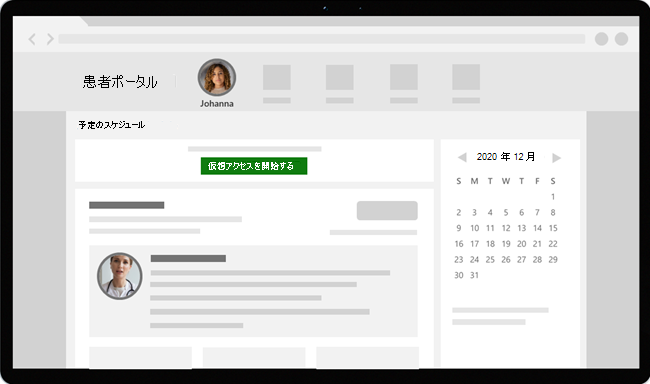

# 仮想アクセスと Teams - エピック EHR への統合

Microsoft Teams電子健康記録 (EHR) コネクタを使用すると、医師は、仮想患者の訪問を開始したり、エピック EHR システムから直接 Microsoft Teams で別のプロバイダーと相談したりすることができます。 Microsoft 365 クラウド上に構築された Teams では、HIPAA、HITECH 認定などへの準拠をサポートする単一のハブで、チャット、ビデオ、音声、および医療ツールとの簡単で安全なコラボレーションと通信が可能です。

Teams のコミュニケーションおよびコラボレーション プラットフォームを使用すると、患者は断片化されたシステムの煩雑な部分を簡単に切り取り、可能な限り最善のケアを提供できます。 EHR コネクタTeams使用すると、次の方法を実行できます。

- 統合Teams、エピック EHR システムから仮想アクセスを開始します。
- 患者が患者ポータル内Teams SMS を介して、仮想アクセスに参加できます。
- マルチ参加者、グループ訪問、インタープリター サービスなど、その他の仮想訪問シナリオをサポートします。
- 出席者が接続、切断、自動監査とレコード保持を有効にしたTeams仮想アクセスに関するメタデータを EHR システムに書き戻します。
- EHR に接続された訪問の消費データ レポートとカスタマイズ可能な通話品質情報を表示します。

EHR ポータルから仮想アクセスを管理する方法の概要については、このビデオをご覧ください。

> [!VIDEO https://www.microsoft.com/videoplayer/embed/RE4HAtn]

この記事では、医療組織のエピック プラットフォームと統合Teams EHR コネクタを設定および構成する方法について説明します。 また、エピック EHR システムからの仮想Teamsエクスペリエンスの概要も示します。

## はじめに

開始する前に、統合を準備するためにいくつかの操作を行います。

### 統合プロセスを理解する

統合プロセス全体を理解するには、次の情報を確認してください。

:::image type="content" source="media/ehr-connector-epic-flow.png" alt-text="統合プロセス全体の手順を要約した画像。":::

||||||
|---------|---------|---------|---------|---------|
|**アクション**: アプリ [へのアクセスを要求Teamsします](#request-access-to-the-teams-app)。   **結果**: テストのために組織を承認します。|**アクション**: 公開キー証明書とプライベート キー証明書を作成し、それをエピックにアップロードします。   **結果**: エピックは公開キー証明書を同期します。|**対処** 方法: EHR コネクタ構成ポータルで構成手順を完了します。   **結果**: エピック構成の FDI レコードを受け取る。| **対処**: エピックの技術スペシャリストと一緒に、エピックで FDI レコードを構成します。  **結果**: 構成が完了しました。 テストの準備ができました。|**対処** 方法: テスト環境でテストを完了します。  **結果**: フローの完全な検証と、実稼働環境への移行の決定。|

### アプリへのアクセスをTeamsする

アプリへのアクセスを要求するTeamsがあります。

1. Epic App Orchard マーケットプレースTeamsアプリのダウンロード[を要求します](https://apporchard.epic.com/Gallery?id=6153)。 これにより、エピックから Microsoft EHR コネクタ チームへの要求がトリガーされます。
1. 要求を行った後、組織名、テナント ID、 [およびエピック技術連絡先](mailto:teamsforhealthcare@service.microsoft.com) のメール アドレスを含むメールを TeamsForHealthcare@service.microsoft.com に送信します。
1. Microsoft EHR コネクタ チームは、有効化の確認を求め、メールに応答します。

### Telehealth Epic-Microsoft Teamsガイドを確認する

「[Epic-Microsoft Teams Telehealth Integration ガイド](https://galaxy.epic.com/Search/GetFile?Url=1!68!100!100100357)」を Epic の技術専門家と一緒にご確認ください。 すべての前提条件が満たされていることを確認します。

## 前提条件

- EHR コネクタスタンドアロン オファー医療向け Microsoft CloudまたはサブスクリプションをMicrosoft Teams (実稼働 EHR 環境でテストする場合にのみ適用されます)。
- エピック バージョン 2018 年 11 月以降。
- ユーザーは、会議を含Microsoft 365またはOffice 365ライセンスを持Teamsがあります。
- Teams組織で採用および使用されます。
- システムは、すべての[ソフトウェアとブラウザーの要件を満](../../hardware-requirements-for-the-teams-app.md)たTeams。

> [!IMPORTANT]
> 統合を進む前に、統合前の手順を完了し、すべての前提条件が満たされていることを確認してください。

統合手順は、組織内の次のユーザーによって実行されます。

- **Microsoft 365管理者**: 統合を担当する主要人物。 管理者はコネクタを構成し、SMS を有効にし (必要に応じて)、構成を承認するエピックの顧客アナリストを追加します。
- **エピック カスタマー アナリスト**: エピックへのログイン資格情報を持つ組織内のユーザー。 管理者が入力した構成設定を承認し、構成レコードをエピックに提供します。

管理者Microsoft 365エピックの顧客アナリストは、同じ人物である可能性があります。

## EHR コネクタTeams設定する

コネクタの設定には、次のことが必要です。

- [EHR コネクタ構成ポータルを起動する](#launch-the-ehr-connector-configuration-portal)
- [構成情報を入力する](#enter-configuration-information)
- [SMS 通知を有効にする (省略可能)](#enable-sms-notifications-optional)
- [構成を承認または表示する](#approve-or-view-the-configuration)
- [構成を確認して終了する](#review-and-finish-the-configuration)

### EHR コネクタ構成ポータルを起動する

最初に、管理者Microsoft 365 [EHR](https://ehrconnector.teams.microsoft.com) コネクタ構成ポータルを起動し、その資格情報を使用してMicrosoft 365します。

管理者Microsoft 365、統合をテストするために 1 つの組織または複数の組織を構成できます。 構成ポータルでテスト URL と本番 URL を構成します。 実稼働環境に移行する前に、必ずエピック テスト環境から統合をテストしてください。

> [!NOTE]
> 管理者Microsoft 365エピックカスタマー アナリストは、構成ポータルで統合手順を完了する必要があります。 エピックの構成手順については、組織に割り当てられているエピック テクニカル スペシャリストにお問い合わせください。

### 構成情報を入力する

次に、統合を設定するために、管理者Microsoft 365次の手順を実行します。

1. エピックのテクニカル スペシャリストから Fast Health 相互運用性リソース (FHIR) ベース URL を追加し、環境を指定します。 組織のニーズとテストする環境に応じて、必要な数の FHIR ベース URL を構成します。

    - FHIR ベース URL は、サーバーの FHIR API エンドポイントに対応する静的アドレスです。 URL の例は、`https://lamnahealthcare.org/fihr/auth/connect-ocurprd-oauth/api/FHDST` です。

    - テスト環境と実稼働環境の統合を設定できます。 初期セットアップでは、実稼働環境に移行する前に、テスト環境からコネクタを構成してください。

1. 後の手順で構成を承認するエピック カスタマー アナリストのユーザー名を追加します。

    :::image type="content" source="media/ehr-connector-epic-configure.png" alt-text="追加される承認者を示す [構成] ページのスクリーンショット。" lightbox="media/ehr-connector-epic-configure.png":::

### SMS 通知を有効にする (省略可能)

> [!NOTE]
> SMS 通知は現在、米国でのみ利用できます。 今後のリリースでは、この機能を他のリージョンで使用Teams、利用可能な場合は、この記事を更新します。 

組織で患者の SMS 通知を管理する必要がある場合は、この手順を完了します。 SMS 通知を有効にした場合、スケジュールされた仮想訪問の確認メッセージとアラーム メッセージが患者に届きます。

SMS 通知を有効にするには、管理者Microsoft 365次の手順を実行します。

1. [SMS 通知] ページで、次の両方の同意チェック ボックスをオンにします。

    - Microsoft が組織に代わって患者に SMS 通知を送信できます。
    - 出席者が SMS メッセージの送受信に同意したと確認します。
    
    :::image type="content" source="media/ehr-connector-epic-sms-notifications.png" alt-text="[SMS 通知] ページのスクリーンショット。同意チェック ボックスと電話番号を生成するオプションが表示されています。" lightbox="media/ehr-connector-epic-sms-notifications.png":::

1. [ **電話番号] で、[** 新しい **電話番号の生成] を選択** して、組織の電話番号を生成します。 これにより、新しい電話番号を要求して生成するプロセスが開始されます。 このプロセスが完了するには、最大で 2 分かかる場合があります。

    電話番号が生成されると、画面に表示されます。 この番号は、SMS の確認とアラームを患者に送信するために使用されます。 この番号はプロビジョニングされましたが、まだ FHIR ベース URL にリンクされていません。 これは、次の手順で行います。

    :::image type="content" source="media/ehr-connector-epic-phone-number.png" alt-text="生成された電話番号の例を示すスクリーンショット。" lightbox="media/ehr-connector-epic-phone-number.png":::

    [完了 **] を** 選択し、[次へ] を **選択します**。

1. 電話番号を FHIR ベース URL にリンクするには、[**SMS** 構成] セクションの **[電話番号**] で番号を選択します。 これは、SMS 通知を有効にする FHIR ベース URL ごとに行います。

    :::image type="content" source="media/ehr-connector-epic-link-phone-number.png" alt-text="電話番号を FHIR ベース URL にリンクする方法を示すスクリーンショット。" lightbox="media/ehr-connector-epic-link-phone-number.png":::

    コネクタを初めて構成する場合は、前の手順で入力した FHIR ベース URL が表示されます。 同じ電話番号を複数の FHIR ベース URL にリンクできます。つまり、患者は組織や部門ごとに同じ電話番号から SMS 通知を受信します。

1. 各 **FHIR ベース** URL の横にある [SMS セットアップ] を選択して、患者に送信する SMS 通知の種類を設定します。

    :::image type="content" source="media/ehr-connector-epic-sms-setup.png" alt-text="SMS セットアップ設定を示すスクリーンショット。" lightbox="media/ehr-connector-epic-sms-setup.png":::

    - **確認 SMS**: EHR システムで仮想訪問がスケジュール、更新、または取り消された場合に、通知が患者に送信されます。
    - **アラーム SMS**: 通知は、指定した時間間隔と仮想訪問のスケジュールされた時刻に従って患者に送信されます。

    [ **保存**] を選びます。

1. [アップロード **] を選択** して公開キー証明書をアップロードします。 環境ごとに Base64 でエンコードされた (公開キーのみ) .cer 証明書をアップロードする必要があります。

    SMS 通知を送信する予定情報を受信するには、公開キー証明書が必要です。 証明書は、受信情報が有効なソースからの情報を確認するために必要です。

    コネクタを使用して SMS アラームを送信すると、エピックで予定が作成されると、患者の電話番号が HL7v2 ペイロードでエピックによって送信されます。 これらの番号は、組織の地域の各予定に保存され、予定が行されるまで保持されます。 HL7v2 メッセージを構成する方法の詳細については、[Telehealth 統合ガイドの「エMicrosoft Teams」を参照してください](https://galaxy.epic.com/Search/GetFile?Url=1!68!100!100100357)。

    **[次へ]** を選択します。

> [!NOTE]
> 管理者は、いつでもMicrosoft 365の SMS 設定を更新できます。 設定を変更すると、SMS サービスが停止する可能性があります。 SMS レポートを表示する方法の詳細については、「EHR コネクタの管理[Teamsを参照してください](ehr-admin-reports.md)。

### 構成を承認または表示する

承認者として追加された組織のエピックカスタマー アナリストは、[EHR](https://ehrconnector.teams.microsoft.com) コネクタ構成ポータルを起動し、ユーザーの資格情報を使用Microsoft 365します。 検証に成功すると、承認者は、エピックの資格情報を使用してサインインして、エピック組織を検証する必要があります。

> [!Note]
> 管理者とMicrosoft 365エピックの顧客アナリストが同じ人物である場合でも、アクセスを検証するには、エピックにサインインする必要があります。 エピック サインインは、FHIR ベース URL の検証にのみ使用されます。 Microsoft は、このサインインを使用して資格情報を保存したり、EHR データにアクセスしたりは行ないます。

:::image type="content" source="media/ehr-connector-epic-login-approve.png" alt-text="[ログインと承認] オプションを示す [構成の承認または表示] ページのスクリーンショット。" lightbox="media/ehr-connector-epic-login-approve.png":::

エピックへのサインインが成功したら、エピックの顧客アナリストが **構成を** 承認する必要があります。 構成が正しい場合は、管理者Microsoft 365ポータルにサインインし、設定を変更できます。

:::image type="content" source="media/ehr-connector-epic-approve.png" alt-text="[承認] オプションを示す [構成の承認または表示] ページのスクリーンショット。" lightbox="media/ehr-connector-epic-approve.png":::

### 構成を確認して終了する

構成情報が Epic 管理者によって承認されると、患者とプロバイダーの立ち上げに関する統合レコードが表示されます。 統合レコードには、次のものが含まれます。

- 患者とプロバイダーのレコード
- SMS レコードを直接送信する
- SMS 構成レコード
- デバイス テスト構成レコード

エピックの顧客アナリストは、これらのレコードをエピックに提供して、エピックの仮想訪問構成を完了する必要があります。 詳細については、「[Telehealth 統合ガイド」の「Microsoft Teams」を参照してください](https://galaxy.epic.com/Search/GetFile?Url=1!68!100!100100357)。

> [!Note]  
> 必要に応じて、Microsoft 365またはエピックの顧客アナリストは、いつでも構成ポータルにサインインして統合レコードを表示し、組織の構成を変更できます。

:::image type="content" source="media/ehr-connector-epic-finish.png" alt-text="統合情報を示す [レビューと完了] ページのスクリーンショット。" lightbox="media/ehr-connector-epic-finish.png":::

> [!Note]
> エピックの顧客アナリストは、管理者が構成した FHIR ベース URL ごとに承認プロセスを完了Microsoft 365があります。

## Teams の仮想アクセスを開始する

EHR コネクタの手順とエピック構成を完了すると、組織はビデオアクセスをサポートする準備が整Teams。

### 仮想アクセスの前提条件

- システムは、すべてのソフトウェアと[ブラウザーの要件を満](../../hardware-requirements-for-the-teams-app.md)たしている必要Teams。

- エピック組織と自分の組織の間の統合Microsoft 365完了しました。

### プロバイダー エクスペリエンス

組織の医療プロバイダーは、エピック プロバイダー アプリ (Hyperspace、Haiku、Canto) から Teams を使用して仮想訪問に参加できます。 **[仮想アクセスの開始]** ボタンは、プロバイダー フローに組み込まれています。

プロバイダー エクスペリエンスの主な機能:

- プロバイダーは、サポートされているブラウザーまたはアプリを使用して仮想Teamsできます。

- プロバイダーは、仮想アクセスに初めて参加するときに、Microsoft 365 アカウントで 1 回サインインする必要があります。

- 1 回サインインすると、プロバイダーは、仮想マシンの仮想予定に直接Teams。 (プロバイダーは、Teams にサインインする必要があります)。

- プロバイダーは、特定の予定の接続と切断の参加者のリアルタイムの更新を確認できます。 プロバイダーは、患者がいつ仮想訪問に接続されているのか確認できます。

  

> [!NOTE]
> 医療記録の継続性または保持の目的で必要な会議チャットに入力された情報は、医療機関によってダウンロード、コピー、および記録される必要があります。 チャットは、法的医療記録や指定されたレコード セットを構成する必要があります。 チャットからのメッセージは、管理者が作成した設定に基Microsoft Teamsされます。

### 患者エクスペリエンス

コネクタは、MyChart の Web とモバイルを通じて仮想アクセスに参加する患者をサポートします。 予約時に、患者は **[仮想アクセスの開始]** ボタンを使用して MyChart から仮想アクセスを開始できます。

患者エクスペリエンスの主な機能:

- 患者は、デスクトップとモバイルの最新の Web ブラウザーから仮想アクセスに参加できます。アプリをインストールTeams[できます](../mobile-browser-join.md)。

- 患者は 1 回のクリックで仮想訪問に参加できます。他のアカウントやサインインは必要ありません。

- 患者は、仮想アクセスを開始するために Microsoft アカウントを作成したりサインインしたりする必要はありません。

- 患者は、プロバイダーが予定に参加し、仮想訪問を認めるまでロビーに配置されます。

- 患者は、仮想訪問に参加する前にロビーでビデオとマイクをテストできます。

  

> [!Note]
> Epic、MyChart、Haiku、および Canto は、Epic Systems Corporation の商標です。

### データのプライバシーと場所

Teams統合すると、統合フローと仮想訪問フロー中に使用および格納されるデータの量が最適化されます。 このソリューションは、Teams のプライバシーとデータ管理の原則、および Teams のプライバシーで概説されているガイドラインに従います。

EHR Teams、EHR システムから識別可能な個人データや患者または医療プロバイダーの健康記録を保存または転送する必要があります。 EHR コネクタによって保存される唯一のデータは、EHR ユーザーの一意の ID であり、Teams 会議のセットアップ中に使用されます。

EHR ユーザーの一意の ID は、「[Microsoft 365 の顧客データの保存場所](/microsoft-365/enterprise/o365-data-locations)」で説明されている 3 つの地理的地域のいずれかに保存されます。 会議の参加者によって共有されるチャット、録音、その他Teamsデータは、既存のストレージ ポリシーに従って保存されます。 データ内のデータの場所の詳細については、「Teamsのデータの場所[」をTeams](../../location-of-data-in-teams.md)。

## 関連記事

- [Teams EHR コネクタ管理者レポート](ehr-admin-reports.md)
- [医療組織向Teamsの使用を開始する](teams-in-hc.md)
